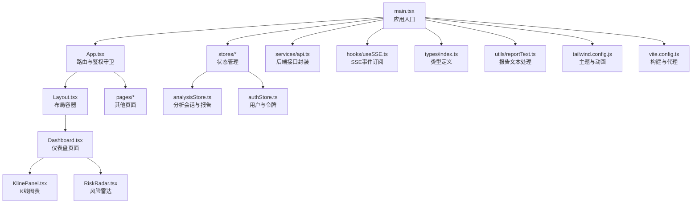
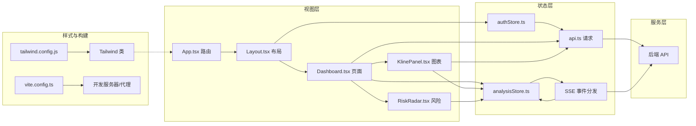
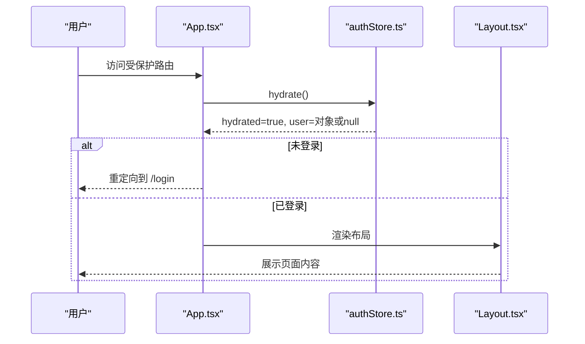
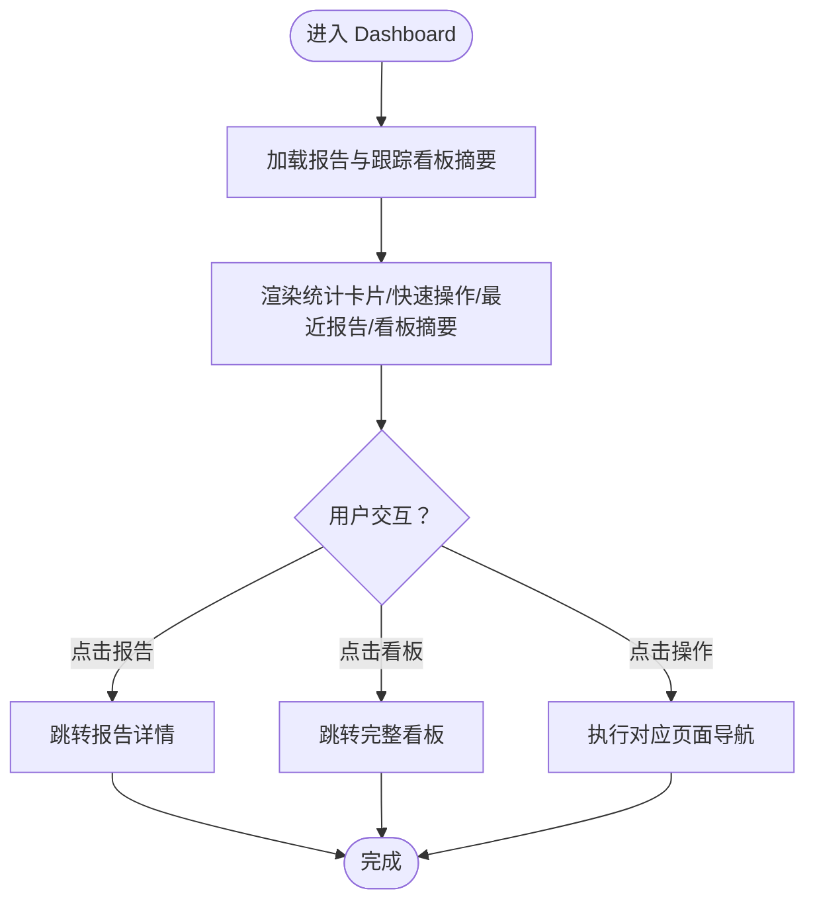
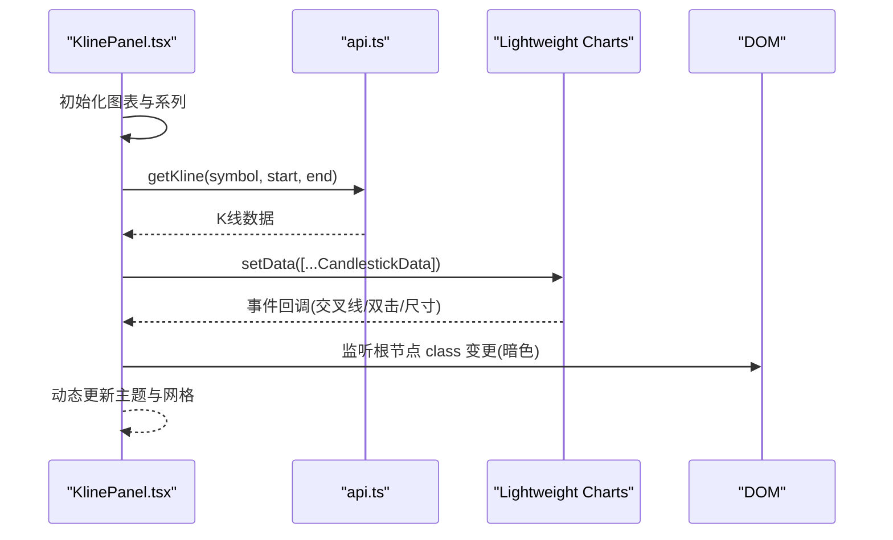
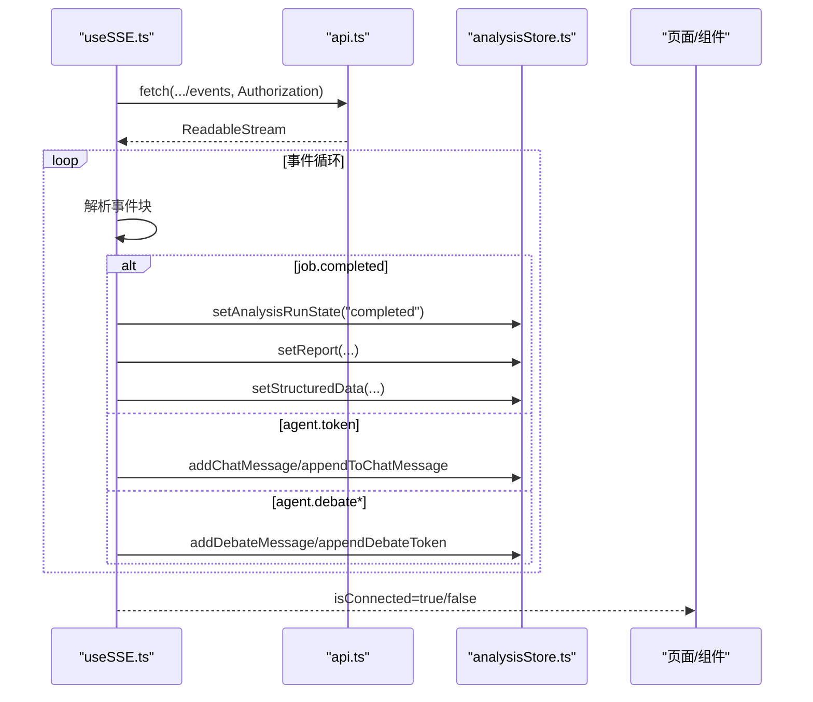
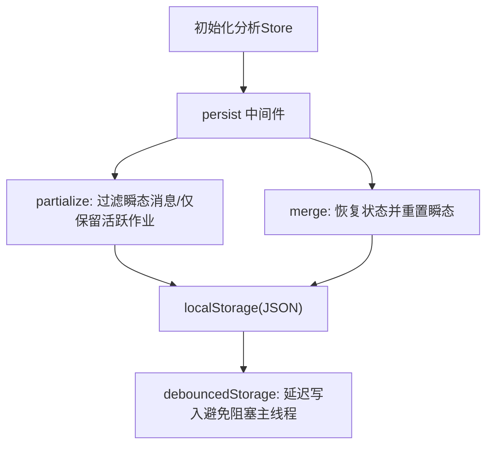
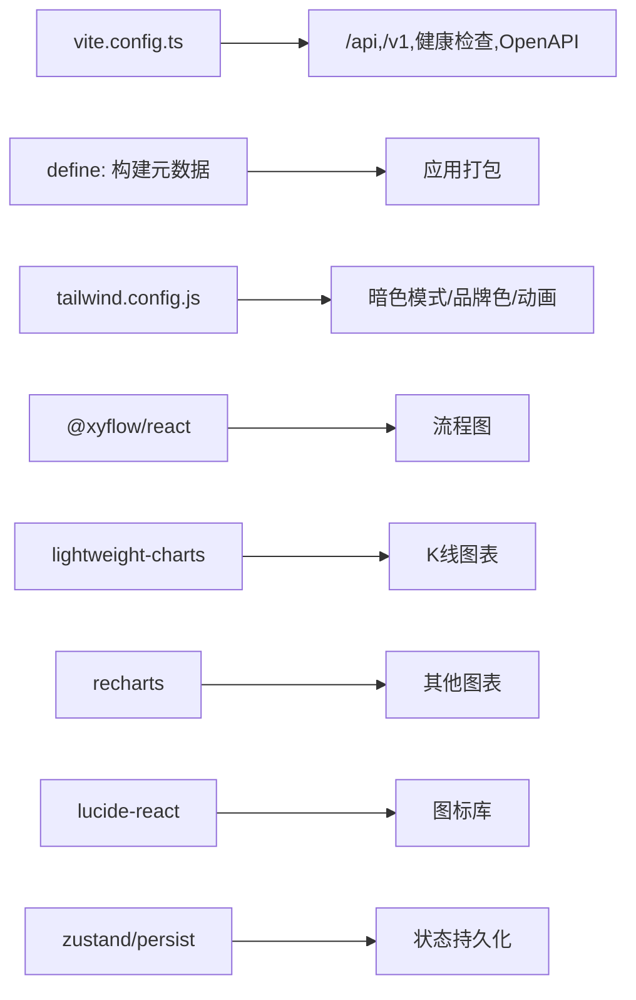

# 界面定制

<cite>
**本文引用的文件**
- [frontend/src/App.tsx](file://frontend/src/App.tsx)
- [frontend/src/main.tsx](file://frontend/src/main.tsx)
- [frontend/package.json](file://frontend/package.json)
- [frontend/vite.config.ts](file://frontend/vite.config.ts)
- [frontend/tailwind.config.js](file://frontend/tailwind.config.js)
- [frontend/src/components/Layout.tsx](file://frontend/src/components/Layout.tsx)
- [frontend/src/pages/Dashboard.tsx](file://frontend/src/pages/Dashboard.tsx)
- [frontend/src/stores/authStore.ts](file://frontend/src/stores/authStore.ts)
- [frontend/src/stores/analysisStore.ts](file://frontend/src/stores/analysisStore.ts)
- [frontend/src/services/api.ts](file://frontend/src/services/api.ts)
- [frontend/src/components/KlinePanel.tsx](file://frontend/src/components/KlinePanel.tsx)
- [frontend/src/components/RiskRadar.tsx](file://frontend/src/components/RiskRadar.tsx)
- [frontend/src/hooks/useSSE.ts](file://frontend/src/hooks/useSSE.ts)
- [frontend/src/types/index.ts](file://frontend/src/types/index.ts)
- [frontend/src/utils/reportText.ts](file://frontend/src/utils/reportText.ts)
</cite>

## 目录
1. [简介](#简介)
2. [项目结构](#项目结构)
3. [核心组件](#核心组件)
4. [架构总览](#架构总览)
5. [详细组件分析](#详细组件分析)
6. [依赖关系分析](#依赖关系分析)
7. [性能考量](#性能考量)
8. [故障排查指南](#故障排查指南)
9. [结论](#结论)
10. [附录](#附录)

## 简介
本文件面向“TradingAgents-AShare”前端的界面定制与扩展，聚焦于以下目标：
- 前端架构与组件系统设计
- UI 组件定制方法：主题、样式、布局与交互
- 状态管理扩展：新 store 开发、状态持久化与跨组件通信
- 图表组件定制：技术指标、样式与数据可视化优化
- 响应式设计、无障碍与浏览器兼容
- UI 开发工具链、组件开发模板与性能优化技巧

## 项目结构
前端采用 Vite + React + TypeScript + TailwindCSS 架构，路由基于 React Router，状态管理使用 Zustand，图表使用 Lightweight Charts，实时事件通过 Server-Sent Events 推送。

**图表来源**
- [frontend/src/main.tsx:1-11](file://frontend/src/main.tsx#L1-L11)
- [frontend/src/App.tsx:1-78](file://frontend/src/App.tsx#L1-L78)
- [frontend/src/components/Layout.tsx:1-25](file://frontend/src/components/Layout.tsx#L1-L25)
- [frontend/src/pages/Dashboard.tsx:1-337](file://frontend/src/pages/Dashboard.tsx#L1-L337)
- [frontend/src/components/KlinePanel.tsx:1-333](file://frontend/src/components/KlinePanel.tsx#L1-L333)
- [frontend/src/components/RiskRadar.tsx:1-53](file://frontend/src/components/RiskRadar.tsx#L1-L53)
- [frontend/src/stores/analysisStore.ts:1-524](file://frontend/src/stores/analysisStore.ts#L1-L524)
- [frontend/src/stores/authStore.ts:1-56](file://frontend/src/stores/authStore.ts#L1-L56)
- [frontend/src/services/api.ts:1-452](file://frontend/src/services/api.ts#L1-L452)
- [frontend/src/hooks/useSSE.ts:1-416](file://frontend/src/hooks/useSSE.ts#L1-L416)
- [frontend/src/types/index.ts:1-839](file://frontend/src/types/index.ts#L1-L839)
- [frontend/src/utils/reportText.ts:1-75](file://frontend/src/utils/reportText.ts#L1-L75)
- [frontend/tailwind.config.js:1-37](file://frontend/tailwind.config.js#L1-L37)
- [frontend/vite.config.ts:1-75](file://frontend/vite.config.ts#L1-L75)

**章节来源**
- [frontend/src/main.tsx:1-11](file://frontend/src/main.tsx#L1-L11)
- [frontend/src/App.tsx:1-78](file://frontend/src/App.tsx#L1-L78)
- [frontend/package.json:1-47](file://frontend/package.json#L1-L47)
- [frontend/vite.config.ts:1-75](file://frontend/vite.config.ts#L1-L75)
- [frontend/tailwind.config.js:1-37](file://frontend/tailwind.config.js#L1-L37)

## 核心组件
- 应用入口与路由
  - 入口文件负责挂载 React 应用与全局样式。
  - 路由层包含登录页、赞助与感谢页外部跳转、以及受鉴权保护的主布局与页面集合。
- 布局容器
  - 提供侧边栏、头部与主内容区域，统一背景色与暗色模式类名。
- 页面组件
  - 仪表盘聚合统计卡片、跟踪看板摘要、快速操作与最近报告列表。
- 图表组件
  - K 线面板集成 Lightweight Charts，支持主题切换、缩放、交叉线与数据加载。
- 风险组件
  - 风险雷达以分级标签展示风险项，支持空态提示。
- 状态管理
  - 分析会话 store：持久化分析状态、报告片段、里程碑、辩论消息等。
  - 认证 store：令牌与用户信息本地持久化、Hydrate 流程。
- 服务与钩子
  - API 封装统一请求、鉴权头注入、错误处理。
  - SSE 钩子：连接/断开、事件分发、重连策略、消息聚合。
- 类型与工具
  - 统一的 TS 类型定义与报告文本清洗/提取工具。

**章节来源**
- [frontend/src/components/Layout.tsx:1-25](file://frontend/src/components/Layout.tsx#L1-L25)
- [frontend/src/pages/Dashboard.tsx:1-337](file://frontend/src/pages/Dashboard.tsx#L1-L337)
- [frontend/src/components/KlinePanel.tsx:1-333](file://frontend/src/components/KlinePanel.tsx#L1-L333)
- [frontend/src/components/RiskRadar.tsx:1-53](file://frontend/src/components/RiskRadar.tsx#L1-L53)
- [frontend/src/stores/analysisStore.ts:1-524](file://frontend/src/stores/analysisStore.ts#L1-L524)
- [frontend/src/stores/authStore.ts:1-56](file://frontend/src/stores/authStore.ts#L1-L56)
- [frontend/src/services/api.ts:1-452](file://frontend/src/services/api.ts#L1-L452)
- [frontend/src/hooks/useSSE.ts:1-416](file://frontend/src/hooks/useSSE.ts#L1-L416)
- [frontend/src/types/index.ts:1-839](file://frontend/src/types/index.ts#L1-L839)
- [frontend/src/utils/reportText.ts:1-75](file://frontend/src/utils/reportText.ts#L1-L75)

## 架构总览
前端采用“路由层-布局层-页面层-组件层-状态层-服务层”的分层架构，配合 TailwindCSS 实现主题与响应式，Zustand 管理跨页面状态，Lightweight Charts 提供图表渲染，SSE 实时推送分析事件。

**图表来源**
- [frontend/src/App.tsx:1-78](file://frontend/src/App.tsx#L1-L78)
- [frontend/src/components/Layout.tsx:1-25](file://frontend/src/components/Layout.tsx#L1-L25)
- [frontend/src/pages/Dashboard.tsx:1-337](file://frontend/src/pages/Dashboard.tsx#L1-L337)
- [frontend/src/components/KlinePanel.tsx:1-333](file://frontend/src/components/KlinePanel.tsx#L1-L333)
- [frontend/src/components/RiskRadar.tsx:1-53](file://frontend/src/components/RiskRadar.tsx#L1-L53)
- [frontend/src/stores/analysisStore.ts:1-524](file://frontend/src/stores/analysisStore.ts#L1-L524)
- [frontend/src/stores/authStore.ts:1-56](file://frontend/src/stores/authStore.ts#L1-L56)
- [frontend/src/services/api.ts:1-452](file://frontend/src/services/api.ts#L1-L452)
- [frontend/src/hooks/useSSE.ts:1-416](file://frontend/src/hooks/useSSE.ts#L1-L416)
- [frontend/tailwind.config.js:1-37](file://frontend/tailwind.config.js#L1-L37)
- [frontend/vite.config.ts:1-75](file://frontend/vite.config.ts#L1-L75)

## 详细组件分析

### 路由与鉴权流程
- 登录页与外部跳转：在指定域名下进行外部跳转，否则渲染内部页面。
- 鉴权守卫：读取本地存储的用户信息，未 Hydrate 完成前显示加载态；未登录则重定向到登录页。
- 主布局包裹：除登录外的所有路径均在 Layout 中渲染，统一侧边栏与头部。

**图表来源**
- [frontend/src/App.tsx:27-43](file://frontend/src/App.tsx#L27-L43)
- [frontend/src/stores/authStore.ts:36-54](file://frontend/src/stores/authStore.ts#L36-L54)
- [frontend/src/components/Layout.tsx:1-25](file://frontend/src/components/Layout.tsx#L1-L25)

**章节来源**
- [frontend/src/App.tsx:1-78](file://frontend/src/App.tsx#L1-L78)
- [frontend/src/stores/authStore.ts:1-56](file://frontend/src/stores/authStore.ts#L1-L56)

### 仪表盘页面与卡片组件
- 统计卡片：展示 Agent 状态、分析任务、报告总数与系统状态。
- 快速操作：直达“开始分析”“查看报告”“系统设置”。
- 最近报告：列表项点击跳转详情，决策文本按方向着色。
- 跟踪看板摘要：展示标的数量、报价覆盖、刷新间隔与最新更新时间。

**图表来源**
- [frontend/src/pages/Dashboard.tsx:10-194](file://frontend/src/pages/Dashboard.tsx#L10-L194)

**章节来源**
- [frontend/src/pages/Dashboard.tsx:1-337](file://frontend/src/pages/Dashboard.tsx#L1-L337)

### K 线面板与图表定制
- 数据加载：按日期范围拉取 K 线，转换为 Lightweight Charts 的 CandlestickData。
- 主题适配：监听 html 根节点 class 变更，动态切换网格、坐标轴与背景色。
- 交互能力：十字光标移动显示当日快照，双击还原缩放，窗口 resize 自适应。
- 标的切换：支持指数与热门标的快捷切换，支持从分析会话同步当前标的。

**图表来源**
- [frontend/src/components/KlinePanel.tsx:1-333](file://frontend/src/components/KlinePanel.tsx#L1-L333)
- [frontend/src/services/api.ts:121-126](file://frontend/src/services/api.ts#L121-L126)

**章节来源**
- [frontend/src/components/KlinePanel.tsx:1-333](file://frontend/src/components/KlinePanel.tsx#L1-L333)
- [frontend/src/services/api.ts:1-452](file://frontend/src/services/api.ts#L1-L452)

### 风险雷达组件
- 输入：RiskItem 数组。
- 行为：空态提示；非空时按等级映射颜色与图标，展示名称与描述。

**章节来源**
- [frontend/src/components/RiskRadar.tsx:1-53](file://frontend/src/components/RiskRadar.tsx#L1-L53)

### SSE 事件订阅与状态同步
- 连接：基于 jobId 订阅 /v1/jobs/{id}/events，自动注入 Authorization。
- 事件分发：根据事件类型更新分析状态、聊天消息、里程碑、报告片段、辩论消息等。
- 重连：异常断开后定时重连，记录日志。
- 断开：组件卸载或显式调用时终止连接。

**图表来源**
- [frontend/src/hooks/useSSE.ts:1-416](file://frontend/src/hooks/useSSE.ts#L1-L416)
- [frontend/src/stores/analysisStore.ts:187-524](file://frontend/src/stores/analysisStore.ts#L187-L524)
- [frontend/src/services/api.ts:44-151](file://frontend/src/services/api.ts#L44-L151)

**章节来源**
- [frontend/src/hooks/useSSE.ts:1-416](file://frontend/src/hooks/useSSE.ts#L1-L416)
- [frontend/src/stores/analysisStore.ts:1-524](file://frontend/src/stores/analysisStore.ts#L1-L524)

### 状态管理扩展与持久化
- 认证 store
  - 本地持久化令牌与用户信息，Hydrate 时校验并回写。
  - 登出清理本地存储并重置会话状态。
- 分析 store
  - 使用 persist 中间件与自定义 JSONStorage 包装，实现去抖写入。
  - 支持部分序列化与合并策略，仅恢复活跃作业状态。
  - 提供聊天消息、里程碑、辩论消息、报告片段等的增删改查动作。

**图表来源**
- [frontend/src/stores/analysisStore.ts:477-524](file://frontend/src/stores/analysisStore.ts#L477-L524)
- [frontend/src/stores/authStore.ts:16-55](file://frontend/src/stores/authStore.ts#L16-L55)

**章节来源**
- [frontend/src/stores/analysisStore.ts:1-524](file://frontend/src/stores/analysisStore.ts#L1-L524)
- [frontend/src/stores/authStore.ts:1-56](file://frontend/src/stores/authStore.ts#L1-L56)

### API 服务与错误处理
- 统一请求：自动拼接 baseUrl，注入 Authorization，处理非 JSON 响应与空响应。
- 错误处理：优先解析 JSON detail/message，否则回退为文本错误。
- 端点覆盖：分析、报告、看板、组合、配置、登录等。

**章节来源**
- [frontend/src/services/api.ts:1-452](file://frontend/src/services/api.ts#L1-L452)

### 报告文本处理与决策识别
- 决策标签检测：支持中文“增持/减持/买入/卖出/观望/持有”与英文别名。
- Markdown 清洗：去除机器可读标签与多余格式，输出可读摘要。
- 结论提取：从 HTML 注释中提取结构化裁决，兼容中英显示。

**章节来源**
- [frontend/src/utils/reportText.ts:1-75](file://frontend/src/utils/reportText.ts#L1-L75)
- [frontend/src/types/index.ts:250-272](file://frontend/src/types/index.ts#L250-L272)

## 依赖关系分析
- 构建与开发
  - Vite 提供开发服务器与代理，支持 /api、/v1、/healthz、/openapi.json、/docs 等后端接口转发。
  - 定义构建元数据（提交号、日期、版本），便于追踪构建来源。
- 样式与主题
  - TailwindCSS 启用暗色模式 class，扩展 trading 品牌色、等宽字体族与动画。
- 依赖库
  - React 生态、Zustand 状态管理、@xyflow/react（流程图）、lightweight-charts（K线）、recharts（图表）、lucide-react（图标）、date-fns（日期）、clsx/tailwind-merge（类名合并）。

**图表来源**
- [frontend/vite.config.ts:36-75](file://frontend/vite.config.ts#L36-L75)
- [frontend/tailwind.config.js:1-37](file://frontend/tailwind.config.js#L1-L37)
- [frontend/package.json:12-29](file://frontend/package.json#L12-L29)

**章节来源**
- [frontend/vite.config.ts:1-75](file://frontend/vite.config.ts#L1-L75)
- [frontend/tailwind.config.js:1-37](file://frontend/tailwind.config.js#L1-L37)
- [frontend/package.json:1-47](file://frontend/package.json#L1-L47)

## 性能考量
- 状态持久化去抖
  - 分析 store 使用自定义去抖存储，降低频繁写入对主线程的影响。
- SSE 连接与断开
  - 显式 abort 控制器，组件卸载时断开连接，避免内存泄漏。
- 图表渲染
  - 仅在主题变化或数据变更时更新选项，避免重复初始化。
- 构建与缓存
  - Vite 代理开发环境，生产构建开启压缩与最小化。
- 无障碍与兼容
  - 使用语义化标签与可访问的交互元素，确保键盘可达与屏幕阅读器友好。

[本节为通用指导，无需具体文件分析]

## 故障排查指南
- 鉴权失败或未登录
  - 检查本地存储是否存在令牌与用户信息；确认 Hydrate 是否成功；核对后端 /v1/auth/me 返回。
- SSE 连接异常
  - 观察 isConnected 状态与日志；确认 Authorization 头是否正确；检查后端 /v1/jobs/{id}/events 可达性。
- 图表无数据或空白
  - 核对 getKline 返回数据格式；确认时间轴与数值有效性；检查暗色模式主题色配置。
- 构建代理问题
  - 确认 /api 前缀与后端地址一致；检查代理 rewrite 规则；验证本地 8000 端口可用。

**章节来源**
- [frontend/src/stores/authStore.ts:36-54](file://frontend/src/stores/authStore.ts#L36-L54)
- [frontend/src/hooks/useSSE.ts:387-416](file://frontend/src/hooks/useSSE.ts#L387-L416)
- [frontend/src/components/KlinePanel.tsx:218-263](file://frontend/src/components/KlinePanel.tsx#L218-L263)
- [frontend/vite.config.ts:50-72](file://frontend/vite.config.ts#L50-L72)

## 结论
本项目前端以清晰的分层架构与模块化组件为基础，结合 Zustand 的轻量状态管理、TailwindCSS 的主题体系与 Lightweight Charts 的专业图表能力，实现了从仪表盘到分析会话的完整 UI 场景。通过 SSE 实时事件驱动与 API 统一封装，系统具备良好的扩展性与可维护性。后续可在现有基础上继续完善主题变量、图表指标体系、无障碍细节与性能监控。

[本节为总结，无需具体文件分析]

## 附录

### UI 开发工具链与最佳实践
- 开发工具
  - Vite：热更新、代理、构建与预览。
  - TypeScript：强类型约束，提升协作效率。
  - ESLint：统一代码风格与规则。
- 样式与主题
  - TailwindCSS：原子化样式，支持暗色模式与品牌色扩展。
  - 动画与过渡：利用内置动画类与自定义类名。
- 组件开发模板
  - 布局容器：Layout.tsx 提供统一容器与侧边栏/头部占位。
  - 页面模板：Dashboard.tsx 展示卡片、列表与按钮交互。
  - 图表模板：KlinePanel.tsx 展示数据加载、主题切换与交互。
- 状态管理模板
  - 新 store：参考 analysisStore.ts 的 create + persist 模式，合理划分 actions 与状态粒度。
  - 跨组件通信：通过 store 共享分析会话、聊天消息与 SSE 事件。
- 性能优化技巧
  - 去抖写入：分析 store 的 debouncedStorage。
  - 条件渲染：仅在需要时初始化图表与订阅事件。
  - 事件解绑：组件卸载时断开 SSE 与 DOM 事件监听。

**章节来源**
- [frontend/package.json:6-11](file://frontend/package.json#L6-L11)
- [frontend/vite.config.ts:1-75](file://frontend/vite.config.ts#L1-L75)
- [frontend/tailwind.config.js:1-37](file://frontend/tailwind.config.js#L1-L37)
- [frontend/src/components/Layout.tsx:1-25](file://frontend/src/components/Layout.tsx#L1-L25)
- [frontend/src/pages/Dashboard.tsx:1-337](file://frontend/src/pages/Dashboard.tsx#L1-L337)
- [frontend/src/components/KlinePanel.tsx:1-333](file://frontend/src/components/KlinePanel.tsx#L1-L333)
- [frontend/src/stores/analysisStore.ts:165-185](file://frontend/src/stores/analysisStore.ts#L165-L185)