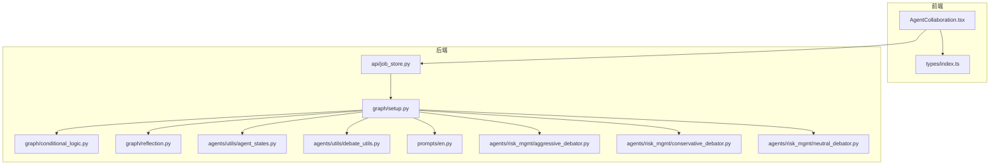
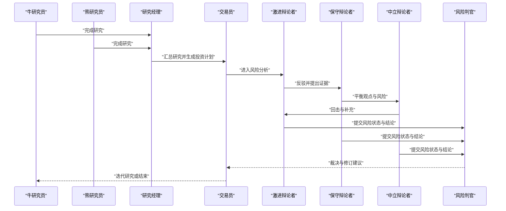
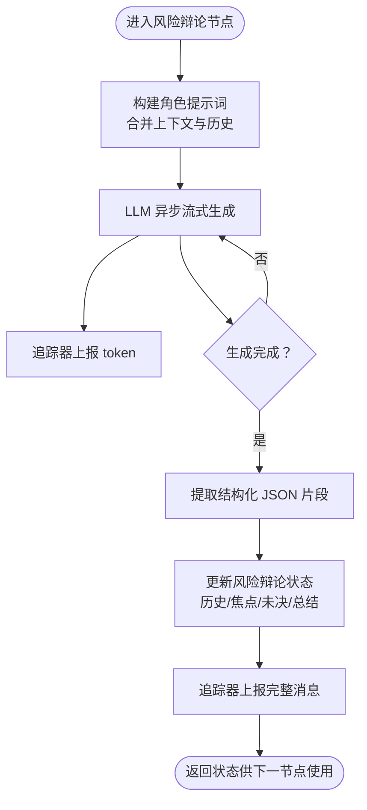
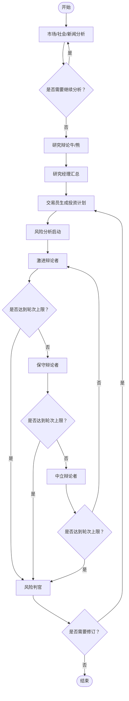
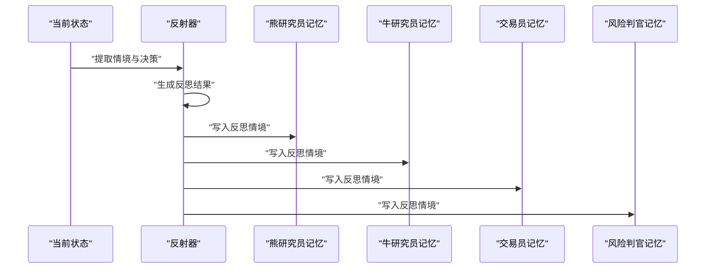
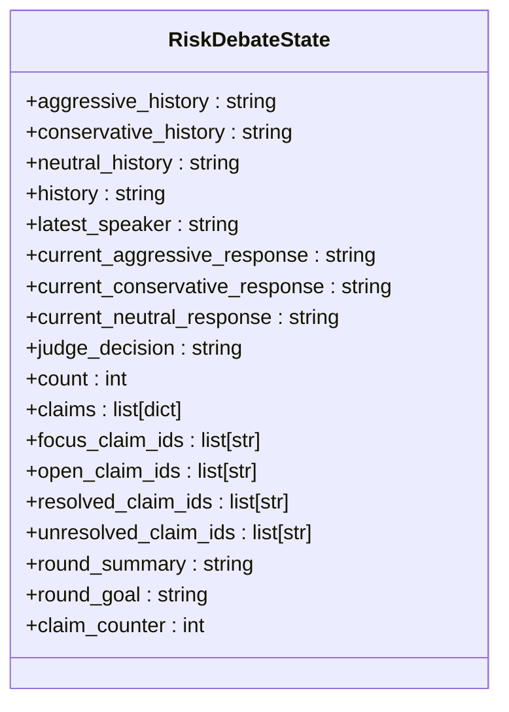
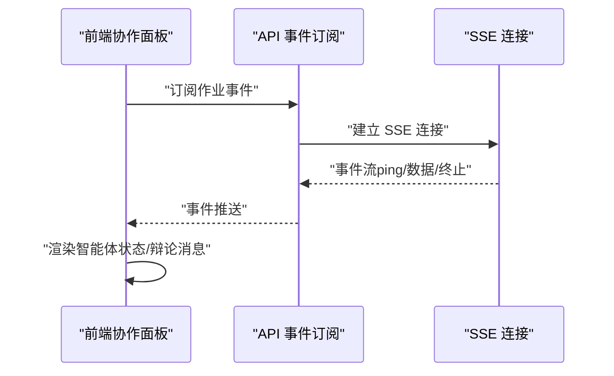
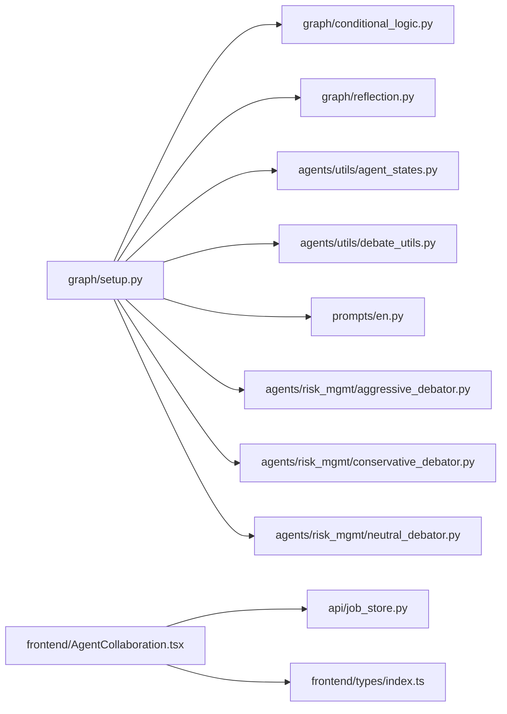

# 智能体协作机制

<cite>
**本文引用的文件**
- [aggressive_debator.py](file://tradingagents/agents/risk_mgmt/aggressive_debator.py)
- [conservative_debator.py](file://tradingagents/agents/risk_mgmt/conservative_debator.py)
- [neutral_debator.py](file://tradingagents/agents/risk_mgmt/neutral_debator.py)
- [setup.py](file://tradingagents/graph/setup.py)
- [conditional_logic.py](file://tradingagents/graph/conditional_logic.py)
- [reflection.py](file://tradingagents/graph/reflection.py)
- [agent_states.py](file://tradingagents/agents/utils/agent_states.py)
- [debate_utils.py](file://tradingagents/agents/utils/debate_utils.py)
- [en.py](file://tradingagents/prompts/en.py)
- [AgentCollaboration.tsx](file://frontend/src/components/AgentCollaboration.tsx)
- [index.ts](file://frontend/src/types/index.ts)
- [job_store.py](file://api/job_store.py)
</cite>

## 目录
1. [引言](#引言)
2. [项目结构](#项目结构)
3. [核心组件](#核心组件)
4. [架构总览](#架构总览)
5. [详细组件分析](#详细组件分析)
6. [依赖关系分析](#依赖关系分析)
7. [性能考虑](#性能考虑)
8. [故障排查指南](#故障排查指南)
9. [结论](#结论)
10. [附录](#附录)

## 引言
本文件系统性阐述 TradingAgents-AShare 的智能体协作机制与投资辩论系统，重点覆盖：
- 多智能体协作架构与对话协议设计
- 智能体间通信机制、消息传递与响应处理
- 投资辩论系统：激进辩论者、保守辩论者与中立辩论者的角色与交互
- 条件逻辑判断、反射机制与决策流程
- 协作模式配置指南与性能优化建议
- 协作调试工具与冲突解决策略

## 项目结构
围绕“智能体协作”主题，相关代码主要分布在以下模块：
- 后端图编排与控制流：graph（条件逻辑、反射、图构建）
- 风险管理智能体：agents/risk_mgmt（激进/保守/中立辩论者）
- 状态与工具：agents/utils（状态模型、辩论工具）
- 前端协作可视化：frontend/src/components（协作面板、辩论抽屉等）
- API 事件订阅：api/job_store（SSE 订阅与事件分发）

图表来源
- [setup.py:227-281](file://tradingagents/graph/setup.py#L227-L281)
- [conditional_logic.py:1-37](file://tradingagents/graph/conditional_logic.py#L1-L37)
- [reflection.py:1-93](file://tradingagents/graph/reflection.py#L1-L93)
- [agent_states.py:114-132](file://tradingagents/agents/utils/agent_states.py#L114-L132)
- [debate_utils.py](file://tradingagents/agents/utils/debate_utils.py)
- [en.py:155-180](file://tradingagents/prompts/en.py#L155-L180)
- [aggressive_debator.py:51-85](file://tradingagents/agents/risk_mgmt/aggressive_debator.py#L51-L85)
- [conservative_debator.py:51-85](file://tradingagents/agents/risk_mgmt/conservative_debator.py#L51-L85)
- [neutral_debator.py](file://tradingagents/agents/risk_mgmt/neutral_debator.py)
- [AgentCollaboration.tsx:288-309](file://frontend/src/components/AgentCollaboration.tsx#L288-L309)
- [index.ts:830-838](file://frontend/src/types/index.ts#L830-L838)
- [job_store.py:226-275](file://api/job_store.py#L226-L275)

章节来源
- [setup.py:227-281](file://tradingagents/graph/setup.py#L227-L281)
- [AgentCollaboration.tsx:288-309](file://frontend/src/components/AgentCollaboration.tsx#L288-L309)
- [job_store.py:226-275](file://api/job_store.py#L226-L275)

## 核心组件
- 风险辩论智能体族：激进、保守、中立三者按回合制进行风险议题辩论，通过统一的状态机与提示词驱动，逐步收敛至“风险判官”裁决。
- 图编排与条件逻辑：根据上一轮输出是否触发工具调用等条件，决定后续节点流转；支持研究辩论与风险分析两套条件分支。
- 反射机制：对各组件（熊/牛研究员、交易员、风险判官）在当前市场情境下的决策进行反思与记忆更新，形成经验闭环。
- 状态与工具：定义风险辩论状态结构、历史记录、焦点议题与未决议题集合，并提供从大模型输出中提取结构化 JSON 的工具函数。
- 前端协作面板：展示各智能体状态、流式输出与辩论结果，支持打开“研究/风险”辩论抽屉查看时序。

章节来源
- [aggressive_debator.py:51-85](file://tradingagents/agents/risk_mgmt/aggressive_debator.py#L51-L85)
- [conservative_debator.py:51-85](file://tradingagents/agents/risk_mgmt/conservative_debator.py#L51-L85)
- [setup.py:227-281](file://tradingagents/graph/setup.py#L227-L281)
- [conditional_logic.py:1-37](file://tradingagents/graph/conditional_logic.py#L1-L37)
- [reflection.py:1-93](file://tradingagents/graph/reflection.py#L1-L93)
- [agent_states.py:114-132](file://tradingagents/agents/utils/agent_states.py#L114-L132)
- [debate_utils.py](file://tradingagents/agents/utils/debate_utils.py)
- [AgentCollaboration.tsx:288-309](file://frontend/src/components/AgentCollaboration.tsx#L288-L309)

## 架构总览
下图展示了从“研究辩论”到“风险分析”的端到端协作流程，以及三类风险辩论者之间的轮转与最终裁决：

图表来源
- [setup.py:227-281](file://tradingagents/graph/setup.py#L227-L281)

## 详细组件分析

### 风险辩论智能体（激进/保守/中立）
- 角色职责
  - 激进辩论者：积极捍卫高潜力头寸，以数据驱动的方式反驳质疑，强调上行空间与证据链。
  - 保守辩论者：审慎评估风险，强调下行威胁与保护性措施，对激进建议进行约束性反驳。
  - 中立辩论者：平衡双方视角，聚焦未决议题与证据权重，推动共识与可执行的总结。
- 输入与提示词
  - 共享上下文：交易员投资计划、市场/情绪/新闻/基本面报告、历史辩论记录、本轮目标与摘要。
  - 个性化提示词：根据角色差异注入不同立场与语气，确保三者在同轮次内产生互补而非重复的输出。
- 输出结构
  - 统一以结构化 JSON 片段标记包裹，包含已回应议题、新增风险议题、已解决与未决议题、下一轮焦点议题、本轮摘要与目标等字段。
- 流式输出与追踪
  - 使用异步流式生成，边生成边向追踪器上报 token 与完整消息，便于前端实时渲染与调试。

图表来源
- [aggressive_debator.py:51-85](file://tradingagents/agents/risk_mgmt/aggressive_debator.py#L51-L85)
- [conservative_debator.py:51-85](file://tradingagents/agents/risk_mgmt/conservative_debator.py#L51-L85)
- [en.py:155-180](file://tradingagents/prompts/en.py#L155-L180)
- [debate_utils.py](file://tradingagents/agents/utils/debate_utils.py)

章节来源
- [aggressive_debator.py:51-85](file://tradingagents/agents/risk_mgmt/aggressive_debator.py#L51-L85)
- [conservative_debator.py:51-85](file://tradingagents/agents/risk_mgmt/conservative_debator.py#L51-L85)
- [neutral_debator.py](file://tradingagents/agents/risk_mgmt/neutral_debator.py)
- [en.py:155-180](file://tradingagents/prompts/en.py#L155-L180)

### 图编排与条件逻辑
- 节点连接
  - 研究辩论：牛研究员与熊研究员相互反驳，完成后进入研究经理汇总。
  - 风险分析：交易员投资计划完成后，进入风险辩论三阶段循环（激进→保守→中立），最终由风险判官裁决。
- 条件判断
  - should_continue_debate：依据上一轮输出是否包含工具调用等信号，决定继续辩论还是进入研究经理。
  - should_continue_risk_analysis：依据辩论轮数与状态计数，决定继续下一个辩论者或进入风险判官。
  - should_revise_after_risk_judge：根据判官裁决决定是否回到交易员修订计划或结束流程。
- 编排实现
  - 使用图编排框架添加有向边与条件边，支持检查点持久化与并发安全。

图表来源
- [setup.py:227-281](file://tradingagents/graph/setup.py#L227-L281)
- [conditional_logic.py:1-37](file://tradingagents/graph/conditional_logic.py#L1-L37)

章节来源
- [setup.py:227-281](file://tradingagents/graph/setup.py#L227-L281)
- [conditional_logic.py:1-37](file://tradingagents/graph/conditional_logic.py#L1-L37)

### 反射机制与决策闭环
- 反射对象
  - 熊/牛研究员、交易员、风险判官分别进行反思，结合当前市场情境与实际收益/损失，更新各自记忆库。
- 反射流程
  - 提取当前情境（市场/情绪/新闻/基本面报告）与决策文本。
  - 调用反思系统提示词，生成反思结果并写入记忆。
- 价值
  - 将每次协作中的经验沉淀为可复用的知识，提升后续决策质量与稳定性。

图表来源
- [reflection.py:1-93](file://tradingagents/graph/reflection.py#L1-L93)

章节来源
- [reflection.py:1-93](file://tradingagents/graph/reflection.py#L1-L93)

### 状态模型与辩论工具
- 风险辩论状态（TypedDict）
  - 历史记录：激进/保守/中立/总体历史，最新发言者，本轮各角色响应。
  - 议题集合：已跟踪风险议题、焦点议题、已解决与未决议题、计数器与轮次摘要/目标。
- 辩论工具
  - 结构化 JSON 提取：从长文本中剥离标记片段，避免解析错误。
  - 状态更新：将新响应合并入状态，维护历史与议题演进。
  - 安全整型转换：在计算轮次时进行容错处理，避免异常中断。

图表来源
- [agent_states.py:114-132](file://tradingagents/agents/utils/agent_states.py#L114-L132)

章节来源
- [agent_states.py:114-132](file://tradingagents/agents/utils/agent_states.py#L114-L132)
- [debate_utils.py](file://tradingagents/agents/utils/debate_utils.py)

### 前端协作可视化与事件流
- 协作面板
  - 展示各智能体状态、流式输出与结论卡片，支持选择板块与打开“研究/风险”辩论抽屉。
- 类型定义
  - DebateMessage：统一的辩论消息结构，包含辩论类型、智能体名称、轮次、内容与是否为裁决等字段。
- 事件订阅
  - API 层提供 SSE 订阅接口，支持心跳与终端事件，前端基于事件流渲染协作过程。

图表来源
- [AgentCollaboration.tsx:288-309](file://frontend/src/components/AgentCollaboration.tsx#L288-L309)
- [index.ts:830-838](file://frontend/src/types/index.ts#L830-L838)
- [job_store.py:226-275](file://api/job_store.py#L226-L275)

章节来源
- [AgentCollaboration.tsx:288-309](file://frontend/src/components/AgentCollaboration.tsx#L288-L309)
- [index.ts:830-838](file://frontend/src/types/index.ts#L830-L838)
- [job_store.py:226-275](file://api/job_store.py#L226-L275)

## 依赖关系分析
- 模块耦合
  - graph/setup.py 作为中枢，依赖 conditional_logic、reflection、agents/utils 下的状态与工具，以及 prompts/en.py 的提示词模板。
  - 风险辩论智能体依赖 debate_utils 与 agent_states，同时消费统一的提示词模板。
  - 前端依赖 API 的事件流与类型定义，实现可视化协作。
- 外部集成
  - API 层通过 SSE 提供事件订阅能力，支撑前端实时渲染与调试。

图表来源
- [setup.py:227-281](file://tradingagents/graph/setup.py#L227-L281)
- [conditional_logic.py:1-37](file://tradingagents/graph/conditional_logic.py#L1-L37)
- [reflection.py:1-93](file://tradingagents/graph/reflection.py#L1-L93)
- [agent_states.py:114-132](file://tradingagents/agents/utils/agent_states.py#L114-L132)
- [debate_utils.py](file://tradingagents/agents/utils/debate_utils.py)
- [en.py:155-180](file://tradingagents/prompts/en.py#L155-L180)
- [aggressive_debator.py:51-85](file://tradingagents/agents/risk_mgmt/aggressive_debator.py#L51-L85)
- [conservative_debator.py:51-85](file://tradingagents/agents/risk_mgmt/conservative_debator.py#L51-L85)
- [neutral_debator.py](file://tradingagents/agents/risk_mgmt/neutral_debator.py)
- [AgentCollaboration.tsx:288-309](file://frontend/src/components/AgentCollaboration.tsx#L288-L309)
- [index.ts:830-838](file://frontend/src/types/index.ts#L830-L838)
- [job_store.py:226-275](file://api/job_store.py#L226-L275)

## 性能考虑
- 流式输出与前端渲染
  - 使用异步流式生成并在追踪器中逐 token 上报，降低首屏延迟，提升交互体验。
- 事件订阅与心跳
  - SSE 订阅采用定时 ping 与终端事件检测，避免长时间阻塞，释放资源。
- 状态与内存
  - 风险辩论状态包含历史与议题集合，建议在长会话中定期清理过期历史，控制内存占用。
- 并发与检查点
  - 图编排支持检查点持久化，可在并发场景下保证一致性与可恢复性。

## 故障排查指南
- 辩论无进展
  - 检查条件逻辑是否正确识别“继续/结束”信号；确认上一轮输出是否包含工具调用等触发条件。
- 状态不一致
  - 核对结构化 JSON 片段提取与状态更新流程，确保字段映射正确且计数器递增。
- 前端不显示消息
  - 确认 SSE 订阅是否建立成功，事件流是否包含“ping/数据/终止”等事件；检查类型定义是否匹配。
- 轮次异常
  - 检查轮次计算逻辑与异常处理，确保在非整数值输入时仍能推进流程。

章节来源
- [conditional_logic.py:1-37](file://tradingagents/graph/conditional_logic.py#L1-L37)
- [debate_utils.py](file://tradingagents/agents/utils/debate_utils.py)
- [job_store.py:226-275](file://api/job_store.py#L226-L275)
- [index.ts:830-838](file://frontend/src/types/index.ts#L830-L838)

## 结论
本协作机制通过“研究辩论—风险分析—判官裁决”的闭环流程，结合三类风险辩论者的差异化立场与统一的状态/提示词体系，实现了稳健而富有张力的投资决策过程。条件逻辑与反射机制进一步增强了系统的自适应能力与经验积累。前端事件流与可视化组件则提供了良好的协作可观测性与调试入口。

## 附录
- 协作模式配置要点
  - 在提示词模板中调整角色语气与目标，以适配不同市场环境。
  - 通过条件逻辑参数控制辩论轮次上限与是否继续分析，平衡深度与效率。
  - 在状态中合理设置议题焦点与未决集合，引导辩论聚焦关键风险点。
- 冲突解决策略
  - 当出现立场极端化时，利用中立辩论者推动共识；必要时引入判官裁决以收敛分歧。
  - 对历史记录进行周期性归档与清理，避免冗余信息干扰后续推理。