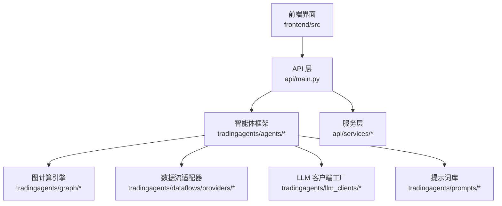
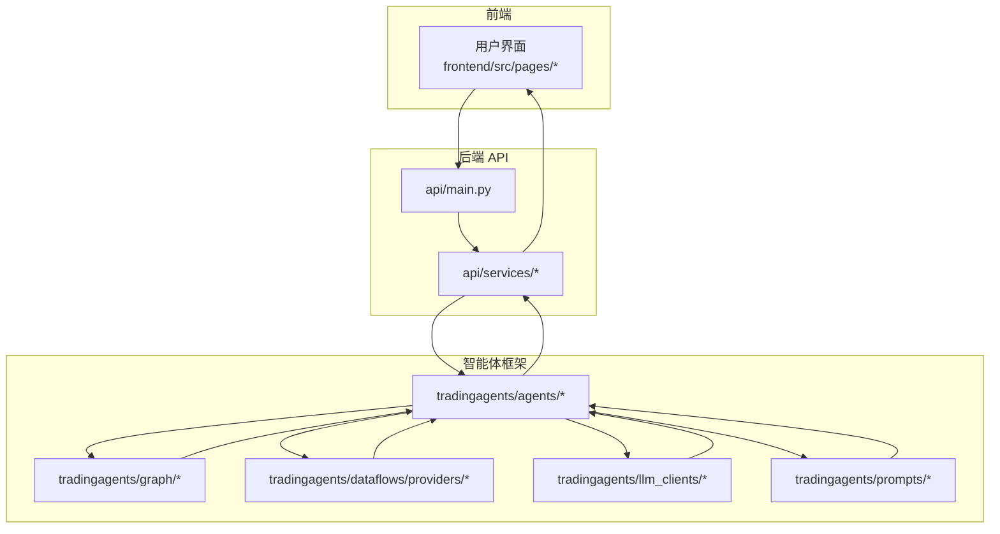
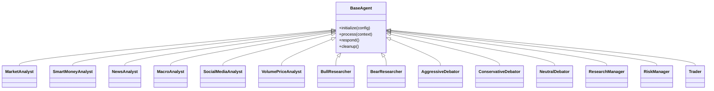
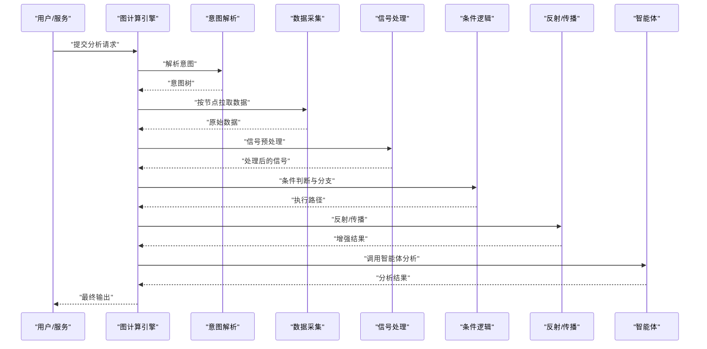
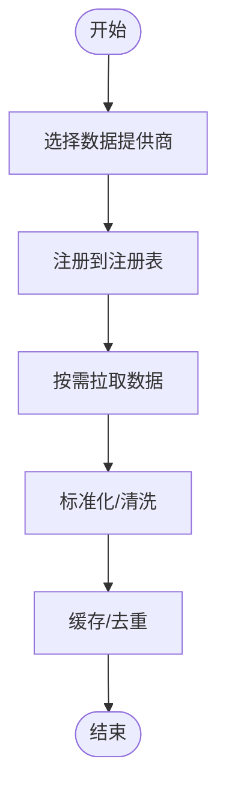
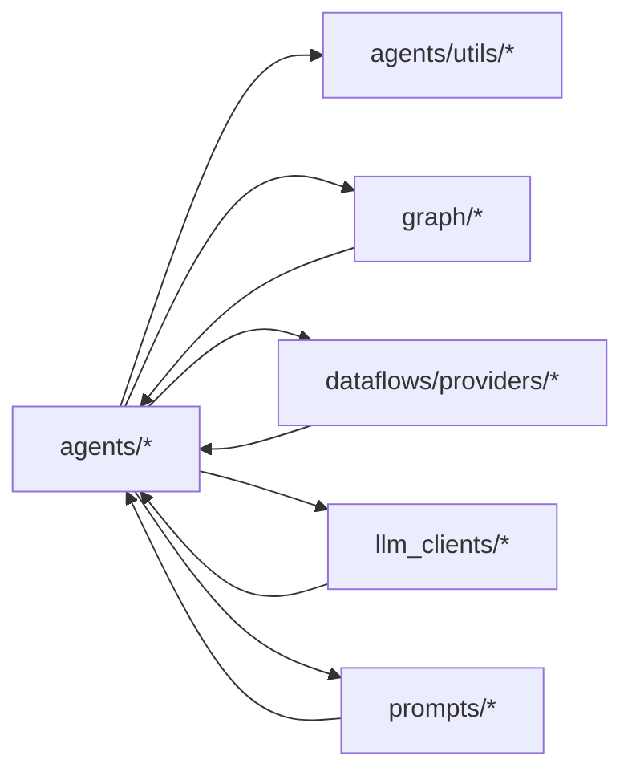

# 智能体开发指南

<cite>
**本文引用的文件**
- [AGENTS.md](file://AGENTS.md)
- [default_config.py](file://tradingagents/default_config.py)
- [__init__.py](file://tradingagents/agents/__init__.py)
- [agent_states.py](file://tradingagents/agents/utils/agent_states.py)
- [agent_utils.py](file://tradingagents/agents/utils/agent_utils.py)
- [context_utils.py](file://tradingagents/agents/utils/context_utils.py)
- [memory.py](file://tradingagents/agents/utils/memory.py)
- [fundamental_data_tools.py](file://tradingagents/agents/utils/fundamental_data_tools.py)
- [news_data_tools.py](file://tradingagents/agents/utils/news_data_tools.py)
- [technical_indicators_tools.py](file://tradingagents/agents/utils/technical_indicators_tools.py)
- [game_theory_tools.py](file://tradingagents/agents/utils/game_theory_tools.py)
- [debate_utils.py](file://tradingagents/agents/utils/debate_utils.py)
- [market_analyst.py](file://tradingagents/agents/analysts/market_analyst.py)
- [smart_money_analyst.py](file://tradingagents/agents/analysts/smart_money_analyst.py)
- [news_analyst.py](file://tradingagents/agents/analysts/news_analyst.py)
- [macro_analyst.py](file://tradingagents/agents/analysts/macro_analyst.py)
- [social_media_analyst.py](file://tradingagents/agents/analysts/social_media_analyst.py)
- [volume_price_analyst.py](file://tradingagents/agents/analysts/volume_price_analyst.py)
- [bull_researcher.py](file://tradingagents/agents/researchers/bull_researcher.py)
- [bear_researcher.py](file://tradingagents/agents/researchers/bear_researcher.py)
- [aggressive_debator.py](file://tradingagents/agents/risk_mgmt/aggressive_debator.py)
- [conservative_debator.py](file://tradingagents/agents/risk_mgmt/conservative_debator.py)
- [neutral_debator.py](file://tradingagents/agents/risk_mgmt/neutral_debator.py)
- [research_manager.py](file://tradingagents/agents/managers/research_manager.py)
- [risk_manager.py](file://tradingagents/agents/managers/risk_manager.py)
- [trader.py](file://tradingagents/agents/trader/trader.py)
- [trading_graph.py](file://tradingagents/graph/trading_graph.py)
- [intent_parser.py](file://tradingagents/graph/intent_parser.py)
- [data_collector.py](file://tradingagents/graph/data_collector.py)
- [signal_processing.py](file://tradingagents/graph/signal_processing.py)
- [conditional_logic.py](file://tradingagents/graph/conditional_logic.py)
- [reflection.py](file://tradingagents/graph/reflection.py)
- [propagation.py](file://tradingagents/graph/propagation.py)
- [setup.py](file://tradingagents/graph/setup.py)
- [base_client.py](file://tradingagents/llm_clients/base_client.py)
- [openai_client.py](file://tradingagents/llm_clients/openai_client.py)
- [anthropic_client.py](file://tradingagents/llm_clients/anthropic_client.py)
- [google_client.py](file://tradingagents/llm_clients/google_client.py)
- [factory.py](file://tradingagents/llm_clients/factory.py)
- [en.py](file://tradingagents/prompts/en.py)
- [zh.py](file://tradingagents/prompts/zh.py)
- [catalog.py](file://tradingagents/prompts/catalog.py)
- [alpha_vantage_provider.py](file://tradingagents/dataflows/providers/alpha_vantage_provider.py)
- [china_equity_provider.py](file://tradingagents/dataflows/providers/china_equity_provider.py)
- [cn_akshare_provider.py](file://tradingagents/dataflows/providers/cn_akshare_provider.py)
- [cn_baostock_provider.py](file://tradingagents/dataflows/providers/cn_baostock_provider.py)
- [yfinance_provider.py](file://tradingagents/dataflows/providers/yfinance_provider.py)
- [base.py](file://tradingagents/dataflows/providers/base.py)
- [registry.py](file://tradingagents/dataflows/providers/registry.py)
- [main.py](file://api/main.py)
- [backtest_service.py](file://api/services/backtest_service.py)
- [report_service.py](file://api/services/report_service.py)
- [tracking_board_service.py](file://api/services/tracking_board_service.py)
- [vlm_service.py](file://api/services/vlm_service.py)
- [portfolio_import_service.py](file://api/services/portfolio_import_service.py)
- [email_report_service.py](file://api/services/email_report_service.py)
- [watchlist_service.py](file://api/services/watchlist_service.py)
- [board_gold_service.py](file://api/services/board_gold_service.py)
- [scheduled_service.py](file://api/services/scheduled_service.py)
- [feedback_service.py](file://api/services/feedback_service.py)
- [wecom_notification_service.py](file://api/services/wecom_notification_service.py)
- [job_store.py](file://api/job_store.py)
- [job_store_redis.py](file://api/job_store_redis.py)
- [logging_config.yaml](file://api/logging_config.yaml)
- [docker-compose.yml](file://docker-compose.yml)
- [Dockerfile](file://Dockerfile)
- [requirements.txt](file://requirements.txt)
- [pyproject.toml](file://pyproject.toml)
</cite>

## 目录
1. [简介](#简介)
2. [项目结构](#项目结构)
3. [核心组件](#核心组件)
4. [架构总览](#架构总览)
5. [详细组件分析](#详细组件分析)
6. [依赖关系分析](#依赖关系分析)
7. [性能考虑](#性能考虑)
8. [故障排查指南](#故障排查指南)
9. [结论](#结论)
10. [附录](#附录)

## 简介
本指南面向希望在 TradingAgents-AShare 平台上开发与集成智能体的工程师与研究者。文档从系统架构、智能体基类与接口规范、分析逻辑与数据处理最佳实践、配置与提示词工程、性能调优、测试与调试、到集成部署与运维维护，提供端到端的开发路径。读者可基于现有智能体实现快速扩展，并遵循统一的模式与约定。

## 项目结构
TradingAgents-AShare 采用模块化分层设计：前端界面、后端 API、智能体框架（agents）、图计算引擎（graph）、LLM 客户端（llm_clients）、提示词（prompts）、数据流（dataflows）以及服务层（api/services）。智能体开发主要围绕 tradingagents/agents 下的各类角色展开，配合 graph 的推理管线与 dataflows 的数据源适配器。

图表来源
- [main.py](file://api/main.py)
- [__init__.py](file://tradingagents/agents/__init__.py)
- [trading_graph.py](file://tradingagents/graph/trading_graph.py)
- [base.py](file://tradingagents/dataflows/providers/base.py)
- [factory.py](file://tradingagents/llm_clients/factory.py)
- [en.py](file://tradingagents/prompts/en.py)

章节来源
- [AGENTS.md](file://AGENTS.md)
- [main.py](file://api/main.py)

## 核心组件
本节聚焦智能体开发的核心构件：智能体基类与接口、状态管理、上下文与记忆、分析工具集、LLM 客户端与提示词体系、数据流适配器等。

- 智能体基类与接口
  - 建议所有智能体实现统一的生命周期接口：初始化、接收输入、执行分析、生成输出、清理资源。可参考现有智能体的职责划分与调用方式，确保与图计算引擎的集成点一致。
  - 关键接口建议包括：initialize(config)、process(context)、respond()、cleanup()。具体签名以实际实现为准。

- 状态管理与上下文
  - 状态机用于记录智能体在不同阶段的状态流转，便于调试与回放。
  - 上下文工具负责聚合输入数据、历史对话、市场信号等，形成统一的分析上下文。

- 记忆与工具
  - 记忆模块支持短期与长期记忆的存取，辅助多轮对话与跨回合决策。
  - 工具集覆盖财务数据、新闻数据、技术指标、博弈论等，支撑多维度分析。

- LLM 客户端与提示词
  - 提供 OpenAI、Anthropic、Google 等客户端封装与工厂模式，便于切换与扩展。
  - 提示词库按语言与主题分类，支持中英文版本与目录索引。

- 数据流适配器
  - 面向 AlphaVantage、YFinance、AkShare、Baostock、国内股票行情等多源数据，统一抽象与注册机制，便于新增数据提供商。

章节来源
- [agent_states.py](file://tradingagents/agents/utils/agent_states.py)
- [context_utils.py](file://tradingagents/agents/utils/context_utils.py)
- [memory.py](file://tradingagents/agents/utils/memory.py)
- [fundamental_data_tools.py](file://tradingagents/agents/utils/fundamental_data_tools.py)
- [news_data_tools.py](file://tradingagents/agents/utils/news_data_tools.py)
- [technical_indicators_tools.py](file://tradingagents/agents/utils/technical_indicators_tools.py)
- [game_theory_tools.py](file://tradingagents/agents/utils/game_theory_tools.py)
- [debate_utils.py](file://tradingagents/agents/utils/debate_utils.py)
- [base_client.py](file://tradingagents/llm_clients/base_client.py)
- [factory.py](file://tradingagents/llm_clients/factory.py)
- [en.py](file://tradingagents/prompts/en.py)
- [zh.py](file://tradingagents/prompts/zh.py)
- [alpha_vantage_provider.py](file://tradingagents/dataflows/providers/alpha_vantage_provider.py)
- [yfinance_provider.py](file://tradingagents/dataflows/providers/yfinance_provider.py)
- [cn_akshare_provider.py](file://tradingagents/dataflows/providers/cn_akshare_provider.py)
- [cn_baostock_provider.py](file://tradingagents/dataflows/providers/cn_baostock_provider.py)
- [china_equity_provider.py](file://tradingagents/dataflows/providers/china_equity_provider.py)

## 架构总览
下图展示了智能体在系统中的位置与交互关系：前端触发任务，API 接收并调度服务，服务层调用智能体框架，智能体通过图计算引擎组织分析流程，使用 LLM 客户端与提示词，访问数据流适配器获取外部数据，并将结果返回给服务层与前端。

图表来源
- [main.py](file://api/main.py)
- [__init__.py](file://tradingagents/agents/__init__.py)
- [trading_graph.py](file://tradingagents/graph/trading_graph.py)
- [base.py](file://tradingagents/dataflows/providers/base.py)
- [factory.py](file://tradingagents/llm_clients/factory.py)
- [en.py](file://tradingagents/prompts/en.py)

## 详细组件分析

### 智能体基类与继承模式
- 设计要点
  - 统一的抽象基类定义生命周期钩子与公共能力（如 LLM 客户端注入、上下文构建、工具调用）。
  - 子类仅需实现特定分析逻辑与输出格式，降低耦合度。
  - 通过工厂或注册表加载智能体，支持动态选择与组合。

- 类关系示意（概念性）

章节来源
- [market_analyst.py](file://tradingagents/agents/analysts/market_analyst.py)
- [smart_money_analyst.py](file://tradingagents/agents/analysts/smart_money_analyst.py)
- [news_analyst.py](file://tradingagents/agents/analysts/news_analyst.py)
- [macro_analyst.py](file://tradingagents/agents/analysts/macro_analyst.py)
- [social_media_analyst.py](file://tradingagents/agents/analysts/social_media_analyst.py)
- [volume_price_analyst.py](file://tradingagents/agents/analysts/volume_price_analyst.py)
- [bull_researcher.py](file://tradingagents/agents/researchers/bull_researcher.py)
- [bear_researcher.py](file://tradingagents/agents/researchers/bear_researcher.py)
- [aggressive_debator.py](file://tradingagents/agents/risk_mgmt/aggressive_debator.py)
- [conservative_debator.py](file://tradingagents/agents/risk_mgmt/conservative_debator.py)
- [neutral_debator.py](file://tradingagents/agents/risk_mgmt/neutral_debator.py)
- [research_manager.py](file://tradingagents/agents/managers/research_manager.py)
- [risk_manager.py](file://tradingagents/agents/managers/risk_manager.py)
- [trader.py](file://tradingagents/agents/trader/trader.py)

### 图计算引擎与分析流程
- 流程说明
  - 输入意图解析与意图树构建，驱动后续节点执行。
  - 数据采集器按需拉取市场、财务、新闻等数据。
  - 信号处理与条件逻辑根据规则进行分支与合并。
  - 反射与传播模块对中间结果进行再评估与扩散。
  - 最终由智能体生成响应并写入上下文。

- 序列图（概念性）

章节来源
- [trading_graph.py](file://tradingagents/graph/trading_graph.py)
- [intent_parser.py](file://tradingagents/graph/intent_parser.py)
- [data_collector.py](file://tradingagents/graph/data_collector.py)
- [signal_processing.py](file://tradingagents/graph/signal_processing.py)
- [conditional_logic.py](file://tradingagents/graph/conditional_logic.py)
- [reflection.py](file://tradingagents/graph/reflection.py)
- [propagation.py](file://tradingagents/graph/propagation.py)
- [setup.py](file://tradingagents/graph/setup.py)

### 数据流适配器与外部数据接入
- 适配器模式
  - 所有数据提供商均实现统一接口，注册到注册表，便于按需启用与替换。
  - 支持多源数据融合：行情、财务、新闻、技术指标等。

- 数据流示意（概念性）

章节来源
- [base.py](file://tradingagents/dataflows/providers/base.py)
- [registry.py](file://tradingagents/dataflows/providers/registry.py)
- [alpha_vantage_provider.py](file://tradingagents/dataflows/providers/alpha_vantage_provider.py)
- [yfinance_provider.py](file://tradingagents/dataflows/providers/yfinance_provider.py)
- [cn_akshare_provider.py](file://tradingagents/dataflows/providers/cn_akshare_provider.py)
- [cn_baostock_provider.py](file://tradingagents/dataflows/providers/cn_baostock_provider.py)
- [china_equity_provider.py](file://tradingagents/dataflows/providers/china_equity_provider.py)

### LLM 客户端与提示词工程
- 客户端工厂
  - 通过工厂模式创建不同供应商的 LLM 客户端，支持统一的调用接口与错误处理。
- 提示词体系
  - 按语言与主题分类，提供中英文版本；目录索引便于检索与复用。
- 提示词工程最佳实践
  - 明确角色与约束，限定输出格式，加入思维链与反事实提示，提升稳定性与可控性。

章节来源
- [factory.py](file://tradingagents/llm_clients/factory.py)
- [openai_client.py](file://tradingagents/llm_clients/openai_client.py)
- [anthropic_client.py](file://tradingagents/llm_clients/anthropic_client.py)
- [google_client.py](file://tradingagents/llm_clients/google_client.py)
- [en.py](file://tradingagents/prompts/en.py)
- [zh.py](file://tradingagents/prompts/zh.py)
- [catalog.py](file://tradingagents/prompts/catalog.py)

### 典型智能体实现剖析
- 市场分析师
  - 职责：整合多源市场信号，输出宏观与微观层面的综合判断。
  - 关键点：结合技术指标与新闻事件，避免单一信号误导。
- 资金流向分析师
  - 职责：识别主力资金动向，辅助趋势判断与买卖时机。
  - 关键点：结合成交量、资金流与市场情绪，注意滞后性与噪音。
- 新闻与社交媒体分析师
  - 职责：抽取关键信息，评估事件对标的的影响方向与强度。
  - 关键点：事件抽取与情感分析，避免误判与过度解读。
- 宏观分析师
  - 职责：解读政策、经济数据与地缘政治影响。
  - 关键点：时滞与传导机制，避免预测偏差。
- 多头/空头研究员
  - 职责：构建多头/空头叙事，提供逻辑链条与风险点。
  - 关键点：情景假设与压力测试，保持叙事一致性。
- 风险辩手（激进/稳健/中性）
  - 职责：从风险角度审视决策，提出反驳与修正方案。
  - 关键点：博弈论视角与底线思维。
- 研究经理与风控经理
  - 职责：协调多智能体协作，统一输出口径，控制风险边界。
  - 关键点：流程编排与质量门禁。
- 交易员
  - 职责：基于分析结果生成交易指令，对接执行系统。
  - 关键点：滑点、流动性与订单拆分。

章节来源
- [market_analyst.py](file://tradingagents/agents/analysts/market_analyst.py)
- [smart_money_analyst.py](file://tradingagents/agents/analysts/smart_money_analyst.py)
- [news_analyst.py](file://tradingagents/agents/analysts/news_analyst.py)
- [macro_analyst.py](file://tradingagents/agents/analysts/macro_analyst.py)
- [social_media_analyst.py](file://tradingagents/agents/analysts/social_media_analyst.py)
- [volume_price_analyst.py](file://tradingagents/agents/analysts/volume_price_analyst.py)
- [bull_researcher.py](file://tradingagents/agents/researchers/bull_researcher.py)
- [bear_researcher.py](file://tradingagents/agents/researchers/bear_researcher.py)
- [aggressive_debator.py](file://tradingagents/agents/risk_mgmt/aggressive_debator.py)
- [conservative_debator.py](file://tradingagents/agents/risk_mgmt/conservative_debator.py)
- [neutral_debator.py](file://tradingagents/agents/risk_mgmt/neutral_debator.py)
- [research_manager.py](file://tradingagents/agents/managers/research_manager.py)
- [risk_manager.py](file://tradingagents/agents/managers/risk_manager.py)
- [trader.py](file://tradingagents/agents/trader/trader.py)

## 依赖关系分析
- 模块内聚与耦合
  - 智能体内部高内聚：各自职责明确，依赖工具与上下文。
  - 模块间低耦合：通过统一接口与工厂解耦，便于替换与扩展。
- 外部依赖
  - LLM 供应商 SDK、第三方数据提供商 SDK、消息队列/缓存等。
- 循环依赖规避
  - 通过抽象接口与延迟导入避免循环引用。

图表来源
- [__init__.py](file://tradingagents/agents/__init__.py)
- [agent_utils.py](file://tradingagents/agents/utils/agent_utils.py)
- [trading_graph.py](file://tradingagents/graph/trading_graph.py)
- [base.py](file://tradingagents/dataflows/providers/base.py)
- [factory.py](file://tradingagents/llm_clients/factory.py)
- [en.py](file://tradingagents/prompts/en.py)

章节来源
- [__init__.py](file://tradingagents/agents/__init__.py)
- [agent_utils.py](file://tradingagents/agents/utils/agent_utils.py)

## 性能考虑
- 数据流优化
  - 合理缓存与去重，减少重复拉取；批量请求与并发拉取提升吞吐。
- 分析流程优化
  - 将昂贵的 LLM 调用放在必要节点；对可并行的分支进行并发执行。
- 内存与状态管理
  - 控制上下文长度与历史记录规模；定期清理临时状态。
- LLM 调用优化
  - 使用更合适的模型与温度参数；限制输出长度；启用流式响应。
- 监控与可观测性
  - 记录关键指标（耗时、调用次数、失败率、Token 消耗）；设置告警阈值。

## 故障排查指南
- 常见问题定位
  - 数据源异常：检查数据提供商可用性与认证配置；查看日志与重试策略。
  - LLM 调用失败：确认模型可用性、限流与鉴权；验证提示词格式。
  - 智能体状态异常：检查状态机流转与上下文完整性；核对工具调用结果。
- 调试技巧
  - 开启详细日志；使用最小化输入复现问题；逐步注释与回退定位。
  - 利用单元测试与集成测试覆盖关键路径。
- 监控与告警
  - 结合服务层的日志配置与作业存储，建立端到端可观测性。

章节来源
- [logging_config.yaml](file://api/logging_config.yaml)
- [job_store.py](file://api/job_store.py)
- [job_store_redis.py](file://api/job_store_redis.py)

## 结论
通过遵循统一的智能体基类与接口规范、利用成熟的图计算引擎与数据流适配器、结合 LLM 客户端与提示词工程，开发者可以高效构建稳定、可扩展的智能体系统。建议在开发过程中坚持“小步快跑、持续集成”的原则，配合完善的测试与监控体系，确保上线质量与运行稳定性。

## 附录

### 智能体开发模板与步骤
- 步骤清单
  - 明确智能体职责与输入输出规范。
  - 设计状态机与上下文结构。
  - 选择/实现所需工具与数据源。
  - 编写分析逻辑与输出格式。
  - 集成到图计算引擎与服务层。
  - 编写测试用例与性能基准。
  - 部署与监控。

- 模板参考
  - 可参考现有智能体的实现文件作为模板，对照其职责、工具调用与输出格式，快速完成新智能体的开发。

章节来源
- [market_analyst.py](file://tradingagents/agents/analysts/market_analyst.py)
- [smart_money_analyst.py](file://tradingagents/agents/analysts/smart_money_analyst.py)
- [news_analyst.py](file://tradingagents/agents/analysts/news_analyst.py)
- [macro_analyst.py](file://tradingagents/agents/analysts/macro_analyst.py)
- [social_media_analyst.py](file://tradingagents/agents/analysts/social_media_analyst.py)
- [volume_price_analyst.py](file://tradingagents/agents/analysts/volume_price_analyst.py)
- [bull_researcher.py](file://tradingagents/agents/researchers/bull_researcher.py)
- [bear_researcher.py](file://tradingagents/agents/researchers/bear_researcher.py)
- [aggressive_debator.py](file://tradingagents/agents/risk_mgmt/aggressive_debator.py)
- [conservative_debator.py](file://tradingagents/agents/risk_mgmt/conservative_debator.py)
- [neutral_debator.py](file://tradingagents/agents/risk_mgmt/neutral_debator.py)
- [research_manager.py](file://tradingagents/agents/managers/research_manager.py)
- [risk_manager.py](file://tradingagents/agents/managers/risk_manager.py)
- [trader.py](file://tradingagents/agents/trader/trader.py)

### 配置参数与提示词工程
- 配置参数
  - 在默认配置文件中集中管理全局参数，按模块拆分细粒度配置项。
- 提示词工程
  - 角色设定清晰、约束明确、输出格式固定；针对不同场景准备模板与变体。

章节来源
- [default_config.py](file://tradingagents/default_config.py)
- [en.py](file://tradingagents/prompts/en.py)
- [zh.py](file://tradingagents/prompts/zh.py)
- [catalog.py](file://tradingagents/prompts/catalog.py)

### 测试策略与调试技巧
- 单元测试
  - 针对工具函数与智能体核心逻辑编写独立测试。
- 集成测试
  - 覆盖从意图解析到智能体输出的完整链路。
- 回归测试
  - 对关键场景与边界条件建立回归用例。
- 调试技巧
  - 使用最小输入复现问题；逐步缩小范围；记录关键中间态。

章节来源
- [tests/test_intent_parser.py](file://tests/test_intent_parser.py)
- [tests/test_data_collector.py](file://tests/test_data_collector.py)
- [tests/test_market_analyst.py](file://tests/test_market_analyst.py)
- [tests/test_smart_money_analyst.py](file://tests/test_smart_money_analyst.py)
- [tests/test_news_analyst.py](file://tests/test_news_analyst.py)
- [tests/test_macro_analyst.py](file://tests/test_macro_analyst.py)
- [tests/test_social_media_analyst.py](file://tests/test_social_media_analyst.py)
- [tests/test_volume_price_analyst.py](file://tests/test_volume_price_analyst.py)
- [tests/test_bull_researcher.py](file://tests/test_bull_researcher.py)
- [tests/test_bear_researcher.py](file://tests/test_bear_researcher.py)
- [tests/test_aggressive_debator.py](file://tests/test_aggressive_debator.py)
- [tests/test_conservative_debator.py](file://tests/test_conservative_debator.py)
- [tests/test_neutral_debator.py](file://tests/test_neutral_debator.py)
- [tests/test_research_manager.py](file://tests/test_research_manager.py)
- [tests/test_risk_manager.py](file://tests/test_risk_manager.py)
- [tests/test_trading_graph_multi_horizon.py](file://tests/test_trading_graph_multi_horizon.py)

### 集成、部署与运维
- 集成步骤
  - 将新智能体注册到图计算引擎与服务层；更新配置与提示词。
- 部署流程
  - 使用容器镜像与编排工具部署；配置环境变量与密钥；健康检查与滚动更新。
- 运维维护
  - 建立日志与监控体系；定期评估模型与数据源质量；制定应急预案。

章节来源
- [docker-compose.yml](file://docker-compose.yml)
- [Dockerfile](file://Dockerfile)
- [requirements.txt](file://requirements.txt)
- [pyproject.toml](file://pyproject.toml)
- [main.py](file://api/main.py)
- [backtest_service.py](file://api/services/backtest_service.py)
- [report_service.py](file://api/services/report_service.py)
- [tracking_board_service.py](file://api/services/tracking_board_service.py)
- [vlm_service.py](file://api/services/vlm_service.py)
- [portfolio_import_service.py](file://api/services/portfolio_import_service.py)
- [email_report_service.py](file://api/services/email_report_service.py)
- [watchlist_service.py](file://api/services/watchlist_service.py)
- [board_gold_service.py](file://api/services/board_gold_service.py)
- [scheduled_service.py](file://api/services/scheduled_service.py)
- [feedback_service.py](file://api/services/feedback_service.py)
- [wecom_notification_service.py](file://api/services/wecom_notification_service.py)