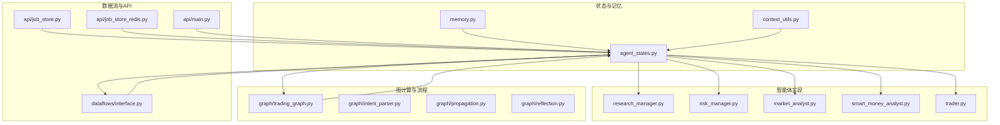
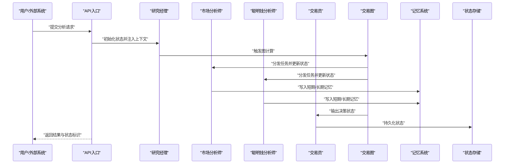
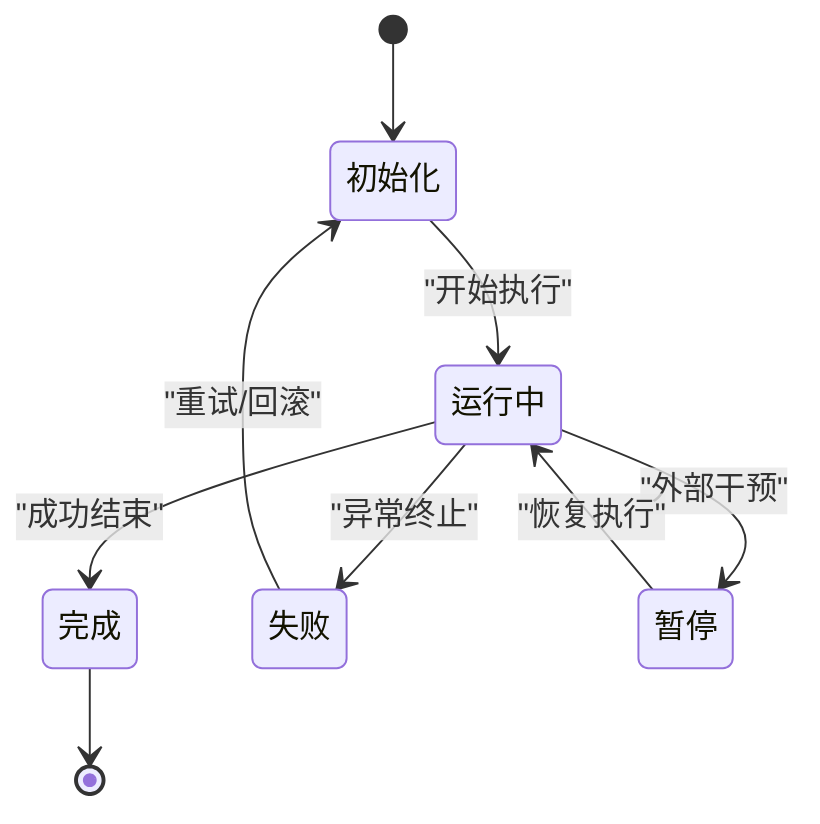
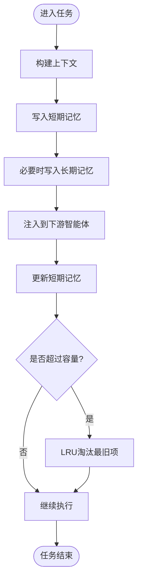
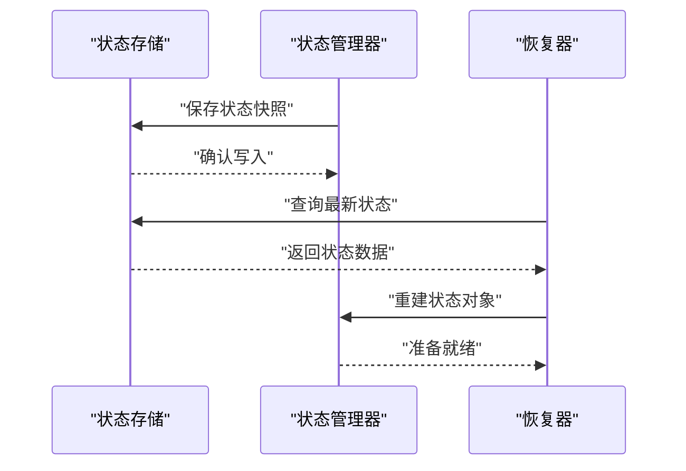
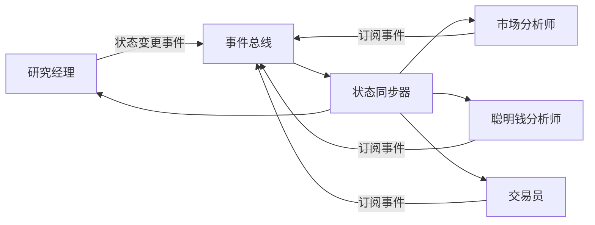
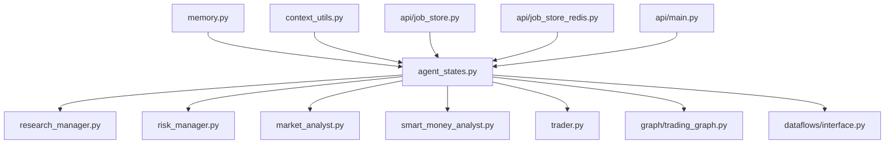

# 智能体状态管理

<cite>
**本文引用的文件**
- [agent_states.py](file://tradingagents/agents/utils/agent_states.py)
- [memory.py](file://tradingagents/agents/utils/memory.py)
- [context_utils.py](file://tradingagents/agents/utils/context_utils.py)
- [test_agent_states.py](file://tests/test_agent_states.py)
- [agent_utils.py](file://tradingagents/agents/utils/agent_utils.py)
- [research_manager.py](file://tradingagents/agents/managers/research_manager.py)
- [risk_manager.py](file://tradingagents/agents/managers/risk_manager.py)
- [market_analyst.py](file://tradingagents/agents/analysts/market_analyst.py)
- [smart_money_analyst.py](file://tradingagents/agents/analysts/smart_money_analyst.py)
- [trader.py](file://tradingagents/agents/trader/trader.py)
- [graph.py](file://tradingagents/graph/trading_graph.py)
- [intent_parser.py](file://tradingagents/graph/intent_parser.py)
- [propagation.py](file://tradingagents/graph/propagation.py)
- [reflection.py](file://tradingagents/graph/reflection.py)
- [dataflows.py](file://tradingagents/dataflows/interface.py)
- [job_store.py](file://api/job_store.py)
- [job_store_redis.py](file://api/job_store_redis.py)
- [main.py](file://api/main.py)
</cite>

## 目录
1. [引言](#引言)
2. [项目结构](#项目结构)
3. [核心组件](#核心组件)
4. [架构总览](#架构总览)
5. [详细组件分析](#详细组件分析)
6. [依赖关系分析](#依赖关系分析)
7. [性能考量](#性能考量)
8. [故障排除指南](#故障排除指南)
9. [结论](#结论)
10. [附录](#附录)

## 引言
本文件聚焦于 TradingAgents-AShare 中的智能体状态管理，系统性阐述 AgentState 数据结构与状态转换机制；深入解析智能体记忆系统（短期记忆、长期记忆、上下文管理）的设计原理；说明状态持久化策略、状态恢复机制与并发安全处理；解释智能体间的状态共享与同步；并提供状态管理的最佳实践、调试工具与故障排除指南。

## 项目结构
围绕状态管理的关键代码主要位于以下模块：
- 状态与记忆：tradingagents/agents/utils/agent_states.py、memory.py、context_utils.py
- 测试验证：tests/test_agent_states.py
- 状态使用方：agents/managers、agents/analysts、agents/trader、graph、dataflows、api

**图表来源**
- [agent_states.py](file://tradingagents/agents/utils/agent_states.py)
- [memory.py](file://tradingagents/agents/utils/memory.py)
- [context_utils.py](file://tradingagents/agents/utils/context_utils.py)
- [research_manager.py](file://tradingagents/agents/managers/research_manager.py)
- [risk_manager.py](file://tradingagents/agents/managers/risk_manager.py)
- [market_analyst.py](file://tradingagents/agents/analysts/market_analyst.py)
- [smart_money_analyst.py](file://tradingagents/agents/analysts/smart_money_analyst.py)
- [trader.py](file://tradingagents/agents/trader/trader.py)
- [graph.py](file://tradingagents/graph/trading_graph.py)
- [intent_parser.py](file://tradingagents/graph/intent_parser.py)
- [propagation.py](file://tradingagents/graph/propagation.py)
- [reflection.py](file://tradingagents/graph/reflection.py)
- [dataflows.py](file://tradingagents/dataflows/interface.py)
- [job_store.py](file://api/job_store.py)
- [job_store_redis.py](file://api/job_store_redis.py)
- [main.py](file://api/main.py)

**章节来源**
- [agent_states.py](file://tradingagents/agents/utils/agent_states.py)
- [memory.py](file://tradingagents/agents/utils/memory.py)
- [context_utils.py](file://tradingagents/agents/utils/context_utils.py)

## 核心组件
- AgentState：定义智能体状态的数据结构，包含状态键、当前状态值、时间戳、元数据等字段，用于跨模块传递与持久化。
- 记忆系统：短期记忆（工作记忆）、长期记忆（知识库/历史会话）、上下文管理（对话上下文、任务上下文）。
- 上下文工具：封装上下文构建、注入、清理与序列化逻辑。
- 状态持久化与恢复：通过作业存储（本地/Redis）实现状态落盘与恢复。
- 并发安全：在多线程/多进程场景下的锁与原子操作策略。
- 智能体间共享与同步：基于共享内存/分布式缓存与事件传播机制。

**章节来源**
- [agent_states.py](file://tradingagents/agents/utils/agent_states.py)
- [memory.py](file://tradingagents/agents/utils/memory.py)
- [context_utils.py](file://tradingagents/agents/utils/context_utils.py)

## 架构总览
状态管理贯穿“感知—推理—决策—执行—反馈”的完整闭环，状态在各智能体角色之间流转，并通过图计算与数据流进行传播与反射更新。

**图表来源**
- [main.py](file://api/main.py)
- [research_manager.py](file://tradingagents/agents/managers/research_manager.py)
- [market_analyst.py](file://tradingagents/agents/analysts/market_analyst.py)
- [smart_money_analyst.py](file://tradingagents/agents/analysts/smart_money_analyst.py)
- [trader.py](file://tradingagents/agents/trader/trader.py)
- [graph.py](file://tradingagents/graph/trading_graph.py)
- [memory.py](file://tradingagents/agents/utils/memory.py)
- [agent_states.py](file://tradingagents/agents/utils/agent_states.py)

## 详细组件分析

### AgentState 数据结构与状态转换
- 数据结构要点
  - 状态键：唯一标识一次分析或任务的键空间，支持命名空间隔离。
  - 当前状态值：包含状态类型、阶段、子状态、进度百分比、结果摘要等。
  - 时间戳：记录状态创建、更新、完成的时间点。
  - 元数据：携带来源、优先级、标签、错误信息等扩展信息。
- 状态转换机制
  - 转换规则：遵循有限状态机模型，从“初始化”到“运行中”再到“完成/失败”，中间可包含“暂停/恢复”等可选状态。
  - 触发条件：由上游节点（如意图解析、图传播）或内部推理（如反思）驱动状态跃迁。
  - 转换幂等性：确保重复触发不会破坏一致性，必要时引入版本号或CAS比较。
- 状态传播
  - 在图计算中，状态随消息/事件在节点间传播，下游节点根据上游状态决定是否继续或回退。
- 状态持久化
  - 使用作业存储（本地文件/Redis）保存状态快照，便于重启恢复与审计追踪。

**图表来源**
- [agent_states.py](file://tradingagents/agents/utils/agent_states.py)
- [graph.py](file://tradingagents/graph/trading_graph.py)
- [propagation.py](file://tradingagents/graph/propagation.py)

**章节来源**
- [agent_states.py](file://tradingagents/agents/utils/agent_states.py)
- [graph.py](file://tradingagents/graph/trading_graph.py)
- [propagation.py](file://tradingagents/graph/propagation.py)

### 记忆系统设计原理
- 短期记忆（工作记忆）
  - 作用：承载当前任务所需的临时上下文与中间结果，生命周期短、容量受限。
  - 实现：以栈/队列形式维护最近N条交互或分析片段，支持LRU淘汰。
- 长期记忆（知识库）
  - 作用：沉淀历史经验、规则、模式与专家建议，供后续任务复用。
  - 实现：以键值对或向量数据库形式存储，支持检索与相似度匹配。
- 上下文管理
  - 作用：在不同智能体间传递语义一致的上下文，避免重复构造与信息丢失。
  - 实现：通过上下文工具统一打包/解包，支持增量更新与压缩传输。

**图表来源**
- [memory.py](file://tradingagents/agents/utils/memory.py)
- [context_utils.py](file://tradingagents/agents/utils/context_utils.py)

**章节来源**
- [memory.py](file://tradingagents/agents/utils/memory.py)
- [context_utils.py](file://tradingagents/agents/utils/context_utils.py)

### 状态持久化策略与恢复机制
- 持久化策略
  - 选择时机：在关键节点（如任务开始、阶段性完成、异常发生）进行快照。
  - 存储介质：本地文件系统与Redis双通道，保证高可用与快速恢复。
  - 序列化格式：采用轻量且可扩展的二进制/JSON格式，包含状态与上下文。
- 恢复机制
  - 启动恢复：系统启动时扫描存储介质，加载最新状态并重建内存结构。
  - 断点续跑：根据状态中的进度与元数据，跳过已完成步骤，继续未完成部分。
- 版本兼容
  - 引入版本字段与迁移脚本，确保状态结构演进时的向后兼容。

**图表来源**
- [job_store.py](file://api/job_store.py)
- [job_store_redis.py](file://api/job_store_redis.py)
- [agent_states.py](file://tradingagents/agents/utils/agent_states.py)

**章节来源**
- [job_store.py](file://api/job_store.py)
- [job_store_redis.py](file://api/job_store_redis.py)
- [agent_states.py](file://tradingagents/agents/utils/agent_states.py)

### 并发安全处理
- 锁策略
  - 写操作加互斥锁，读操作支持无锁读或读写分离。
  - 对热点状态键采用细粒度锁，降低争用。
- 原子更新
  - 使用CAS（Compare-And-Swap）或事务性写入，避免竞态条件。
- 线程/进程隔离
  - 不同智能体实例使用独立的状态命名空间，避免互相污染。
- 异步与队列
  - 使用有界队列缓冲状态变更，防止内存暴涨。

**章节来源**
- [agent_states.py](file://tradingagents/agents/utils/agent_states.py)
- [memory.py](file://tradingagents/agents/utils/memory.py)

### 智能体间的状态共享与同步
- 共享接口
  - 通过统一的状态键空间与上下文注入机制，实现跨智能体的可见性。
- 同步协议
  - 基于事件总线或发布订阅，状态变更广播给订阅者。
  - 对强一致需求的任务，采用两阶段提交或分布式锁。
- 冲突解决
  - 以时间戳/版本号为准，冲突时触发仲裁或回滚重试。

**图表来源**
- [research_manager.py](file://tradingagents/agents/managers/research_manager.py)
- [market_analyst.py](file://tradingagents/agents/analysts/market_analyst.py)
- [smart_money_analyst.py](file://tradingagents/agents/analysts/smart_money_analyst.py)
- [trader.py](file://tradingagents/agents/trader/trader.py)

**章节来源**
- [research_manager.py](file://tradingagents/agents/managers/research_manager.py)
- [market_analyst.py](file://tradingagents/agents/analysts/market_analyst.py)
- [smart_money_analyst.py](file://tradingagents/agents/analysts/smart_money_analyst.py)
- [trader.py](file://tradingagents/agents/trader/trader.py)

### 状态管理最佳实践
- 状态清理
  - 定期清理过期状态与无用上下文，释放内存与磁盘空间。
  - 对失败任务设置自动清理阈值，避免僵尸状态堆积。
- 内存优化
  - 短期记忆采用环形缓冲或滑动窗口，限制最大长度。
  - 长期记忆使用压缩与索引，提高检索效率。
- 性能监控
  - 统计状态转换耗时、持久化延迟、并发等待时间等指标。
  - 设置告警阈值，异常时自动降级或限流。
- 可观测性
  - 为每个状态键生成唯一追踪ID，串联日志与指标。
  - 提供状态快照导出与对比工具，辅助问题定位。

**章节来源**
- [memory.py](file://tradingagents/agents/utils/memory.py)
- [agent_states.py](file://tradingagents/agents/utils/agent_states.py)

## 依赖关系分析
状态管理模块与各智能体、图计算、数据流、API之间的耦合关系如下：

**图表来源**
- [agent_states.py](file://tradingagents/agents/utils/agent_states.py)
- [memory.py](file://tradingagents/agents/utils/memory.py)
- [context_utils.py](file://tradingagents/agents/utils/context_utils.py)
- [research_manager.py](file://tradingagents/agents/managers/research_manager.py)
- [risk_manager.py](file://tradingagents/agents/managers/risk_manager.py)
- [market_analyst.py](file://tradingagents/agents/analysts/market_analyst.py)
- [smart_money_analyst.py](file://tradingagents/agents/analysts/smart_money_analyst.py)
- [trader.py](file://tradingagents/agents/trader/trader.py)
- [graph.py](file://tradingagents/graph/trading_graph.py)
- [dataflows.py](file://tradingagents/dataflows/interface.py)
- [job_store.py](file://api/job_store.py)
- [job_store_redis.py](file://api/job_store_redis.py)
- [main.py](file://api/main.py)

**章节来源**
- [agent_states.py](file://tradingagents/agents/utils/agent_states.py)
- [memory.py](file://tradingagents/agents/utils/memory.py)
- [context_utils.py](file://tradingagents/agents/utils/context_utils.py)
- [research_manager.py](file://tradingagents/agents/managers/research_manager.py)
- [risk_manager.py](file://tradingagents/agents/managers/risk_manager.py)
- [market_analyst.py](file://tradingagents/agents/analysts/market_analyst.py)
- [smart_money_analyst.py](file://tradingagents/agents/analysts/smart_money_analyst.py)
- [trader.py](file://tradingagents/agents/trader/trader.py)
- [graph.py](file://tradingagents/graph/trading_graph.py)
- [dataflows.py](file://tradingagents/dataflows/interface.py)
- [job_store.py](file://api/job_store.py)
- [job_store_redis.py](file://api/job_store_redis.py)
- [main.py](file://api/main.py)

## 性能考量
- 状态体积控制：对大对象进行分片或延迟加载，仅在需要时解码。
- 批量持久化：合并多次小更新为批量写入，减少IO次数。
- 缓存命中优化：热点状态驻留内存，冷数据落盘或压缩。
- 并发吞吐：合理划分状态键的分区与锁粒度，避免热点争用。

## 故障排除指南
- 常见问题
  - 状态不一致：检查状态转换链路与事件顺序，确保无遗漏或重复触发。
  - 恢复失败：核对存储介质可用性与序列化格式版本，必要时执行迁移。
  - 并发冲突：增加重试与退避策略，必要时调整锁粒度或拆分状态域。
- 调试工具
  - 状态快照导出：将当前状态转储为可读格式，便于人工校验。
  - 跟踪ID串联：为每个请求分配追踪ID，串联日志与指标，定位瓶颈。
  - 可视化面板：在前端展示状态树与转换轨迹，辅助排障。

**章节来源**
- [test_agent_states.py](file://tests/test_agent_states.py)
- [agent_states.py](file://tradingagents/agents/utils/agent_states.py)

## 结论
本文件系统性梳理了 TradingAgents-AShare 的智能体状态管理体系，覆盖数据结构、转换机制、记忆设计、持久化与并发安全、智能体间共享与同步，并给出最佳实践与故障排除建议。实际部署中应结合业务场景细化策略，持续优化性能与可靠性。

## 附录
- 关键实现参考路径
  - AgentState 定义与转换：[agent_states.py](file://tradingagents/agents/utils/agent_states.py)
  - 记忆系统与上下文：[memory.py](file://tradingagents/agents/utils/memory.py)、[context_utils.py](file://tradingagents/agents/utils/context_utils.py)
  - 状态持久化与恢复：[job_store.py](file://api/job_store.py)、[job_store_redis.py](file://api/job_store_redis.py)
  - 智能体使用示例：[research_manager.py](file://tradingagents/agents/managers/research_manager.py)、[market_analyst.py](file://tradingagents/agents/analysts/market_analyst.py)、[smart_money_analyst.py](file://tradingagents/agents/analysts/smart_money_analyst.py)、[trader.py](file://tradingagents/agents/trader/trader.py)
  - 图计算与状态传播：[graph.py](file://tradingagents/graph/trading_graph.py)、[propagation.py](file://tradingagents/graph/propagation.py)、[reflection.py](file://tradingagents/graph/reflection.py)
  - 数据流与API集成：[dataflows.py](file://tradingagents/dataflows/interface.py)、[main.py](file://api/main.py)