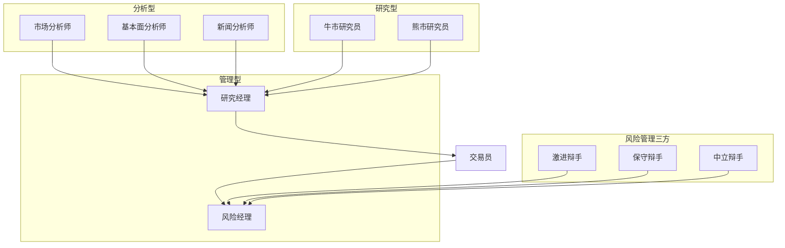
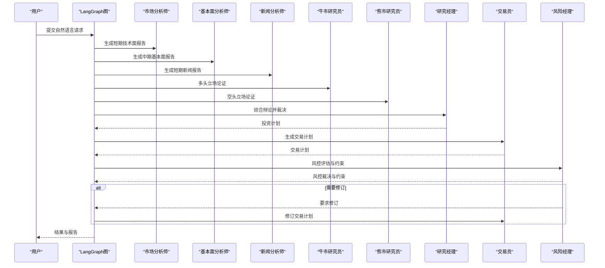
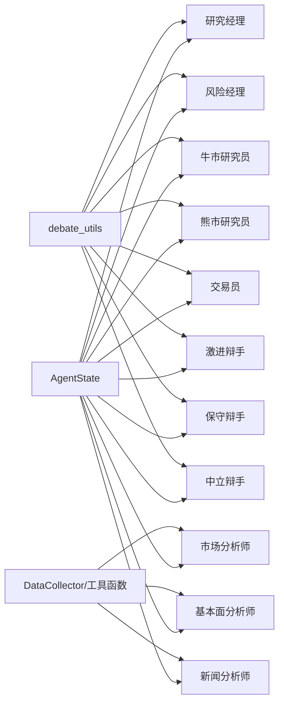
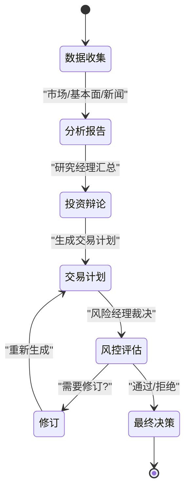

# 智能体类型与架构

<cite>
**本文引用的文件**
- [AGENTS.md](file://AGENTS.md)
- [tradingagents/agents/__init__.py](file://tradingagents/agents/__init__.py)
- [tradingagents/agents/utils/agent_states.py](file://tradingagents/agents/utils/agent_states.py)
- [tradingagents/agents/utils/debate_utils.py](file://tradingagents/agents/utils/debate_utils.py)
- [tradingagents/agents/researchers/bull_researcher.py](file://tradingagents/agents/researchers/bull_researcher.py)
- [tradingagents/agents/researchers/bear_researcher.py](file://tradingagents/agents/researchers/bear_researcher.py)
- [tradingagents/agents/managers/research_manager.py](file://tradingagents/agents/managers/research_manager.py)
- [tradingagents/agents/analysts/market_analyst.py](file://tradingagents/agents/analysts/market_analyst.py)
- [tradingagents/agents/analysts/fundamentals_analyst.py](file://tradingagents/agents/analysts/fundamentals_analyst.py)
- [tradingagents/agents/analysts/news_analyst.py](file://tradingagents/agents/analysts/news_analyst.py)
- [tradingagents/agents/risk_mgmt/aggressive_debator.py](file://tradingagents/agents/risk_mgmt/aggressive_debator.py)
- [tradingagents/agents/risk_mgmt/conservative_debator.py](file://tradingagents/agents/risk_mgmt/conservative_debator.py)
- [tradingagents/agents/risk_mgmt/neutral_debator.py](file://tradingagents/agents/risk_mgmt/neutral_debator.py)
- [tradingagents/agents/managers/risk_manager.py](file://tradingagents/agents/managers/risk_manager.py)
- [tradingagents/agents/trader/trader.py](file://tradingagents/agents/trader/trader.py)
</cite>

## 目录
1. [引言](#引言)
2. [项目结构](#项目结构)
3. [核心组件](#核心组件)
4. [架构总览](#架构总览)
5. [详细组件分析](#详细组件分析)
6. [依赖分析](#依赖分析)
7. [性能考虑](#性能考虑)
8. [故障排查指南](#故障排查指南)
9. [结论](#结论)
10. [附录](#附录)

## 引言
本文件面向TradingAgents-AShare项目的智能体体系，系统化梳理智能体类型、职责边界、工作流程与交互模式，阐释智能体架构设计原则（继承关系、接口约定、扩展机制），并提供智能体类型选择指南与组合使用策略，最后给出生命周期管理与状态转换图示，帮助读者快速理解并高效使用该智能体系统。

## 项目结构
智能体位于tradingagents/agents目录下，按职能分为三类：
- 研究型智能体：牛市研究员、熊市研究员
- 分析型智能体：市场分析师、基本面分析师、新闻分析师
- 管理型智能体：研究经理、风险经理
- 风险管理三方：激进辩手、保守辩手、中立辩手
- 交易员：执行投资计划并响应风控反馈

图表来源
- [tradingagents/agents/__init__.py:24-45](file://tradingagents/agents/__init__.py#L24-L45)
- [tradingagents/agents/researchers/bull_researcher.py:15-99](file://tradingagents/agents/researchers/bull_researcher.py#L15-L99)
- [tradingagents/agents/researchers/bear_researcher.py:15-99](file://tradingagents/agents/researchers/bear_researcher.py#L15-L99)
- [tradingagents/agents/managers/research_manager.py:15-149](file://tradingagents/agents/managers/research_manager.py#L15-L149)
- [tradingagents/agents/analysts/market_analyst.py:26-89](file://tradingagents/agents/analysts/market_analyst.py#L26-L89)
- [tradingagents/agents/analysts/fundamentals_analyst.py:10-82](file://tradingagents/agents/analysts/fundamentals_analyst.py#L10-L82)
- [tradingagents/agents/analysts/news_analyst.py:10-89](file://tradingagents/agents/analysts/news_analyst.py#L10-L89)
- [tradingagents/agents/risk_mgmt/aggressive_debator.py:14-93](file://tradingagents/agents/risk_mgmt/aggressive_debator.py#L14-L93)
- [tradingagents/agents/risk_mgmt/conservative_debator.py:14-97](file://tradingagents/agents/risk_mgmt/conservative_debator.py#L14-L97)
- [tradingagents/agents/risk_mgmt/neutral_debator.py:14-97](file://tradingagents/agents/risk_mgmt/neutral_debator.py#L14-L97)
- [tradingagents/agents/managers/risk_manager.py:15-116](file://tradingagents/agents/managers/risk_manager.py#L15-L116)
- [tradingagents/agents/trader/trader.py:15-85](file://tradingagents/agents/trader/trader.py#L15-L85)

章节来源
- [AGENTS.md:20-36](file://AGENTS.md#L20-L36)
- [tradingagents/agents/__init__.py:1-46](file://tradingagents/agents/__init__.py#L1-L46)

## 核心组件
- 状态模型与上下文
  - AgentState：统一承载投资决策所需的所有上下文（标的、市场、用户、工作流元数据、各分析师报告、辩论状态、最终决策等）
  - InvestDebateState/RiskDebateState：分别驱动“是否投资”和“风险评估”的多智能体辩论
  - RiskFeedbackState：记录风控反馈与修订次数、约束与触发条件
- 辩论工具
  - 提取与清洗标签化JSON（如VERDICT、RISK_STATE、RISK_JUDGE）
  - 格式化声明列表、轮次目标、轮次摘要
  - 构建空风控辩论状态、汇总风控反馈
- 创建工厂
  - 所有智能体均通过create_xxx(...)工厂函数返回异步节点，便于LangGraph编排

章节来源
- [tradingagents/agents/utils/agent_states.py:147-185](file://tradingagents/agents/utils/agent_states.py#L147-L185)
- [tradingagents/agents/utils/debate_utils.py:8-71](file://tradingagents/agents/utils/debate_utils.py#L8-L71)
- [tradingagents/agents/utils/debate_utils.py:159-269](file://tradingagents/agents/utils/debate_utils.py#L159-L269)
- [tradingagents/agents/utils/debate_utils.py:312-332](file://tradingagents/agents/utils/debate_utils.py#L312-L332)
- [tradingagents/agents/__init__.py:5-22](file://tradingagents/agents/__init__.py#L5-L22)

## 架构总览
系统采用LangGraph图式编排，以AgentState为共享状态，通过“数据收集-分析-辩论-决策-执行”的流水线串联各智能体。分析阶段由多个分析师并行产出报告；研究经理对投资辩论进行裁决并生成投资计划；交易员据此制定交易计划并提交风控；风险经理综合多方观点与约束进行裁决，必要时要求交易员修订。

图表来源
- [tradingagents/agents/analysts/market_analyst.py:26-89](file://tradingagents/agents/analysts/market_analyst.py#L26-L89)
- [tradingagents/agents/analysts/fundamentals_analyst.py:10-82](file://tradingagents/agents/analysts/fundamentals_analyst.py#L10-L82)
- [tradingagents/agents/analysts/news_analyst.py:10-89](file://tradingagents/agents/analysts/news_analyst.py#L10-L89)
- [tradingagents/agents/researchers/bull_researcher.py:15-99](file://tradingagents/agents/researchers/bull_researcher.py#L15-L99)
- [tradingagents/agents/researchers/bear_researcher.py:15-99](file://tradingagents/agents/researchers/bear_researcher.py#L15-L99)
- [tradingagents/agents/managers/research_manager.py:15-149](file://tradingagents/agents/managers/research_manager.py#L15-L149)
- [tradingagents/agents/trader/trader.py:15-85](file://tradingagents/agents/trader/trader.py#L15-L85)
- [tradingagents/agents/managers/risk_manager.py:15-116](file://tradingagents/agents/managers/risk_manager.py#L15-L116)

## 详细组件分析

### 研究型智能体
- 牛市研究员
  - 职责：在综合市场、新闻、情绪、基本面与量价报告后，构建多头立场的论证，推动投资决策
  - 输入：投资辩论历史、当前回合响应、各类报告、焦点/未决声明集合、轮次摘要与目标
  - 输出：更新后的投资辩论状态（含声明、焦点、轮次摘要等）
  - 关键点：使用horizon上下文与记忆检索增强推理，支持Token级流式输出与前端追踪
- 熊市研究员
  - 职责：针对多头观点进行反驳，暴露潜在风险与脆弱假设
  - 输入/输出与牛市研究员一致，但立场相反，用于平衡论证
- 工作流要点
  - 使用debate_utils对LLM输出中的声明与轮次目标进行结构化解析与状态更新
  - 通过tracker向前端推送流式token与完整消息

章节来源
- [tradingagents/agents/researchers/bull_researcher.py:15-99](file://tradingagents/agents/researchers/bull_researcher.py#L15-L99)
- [tradingagents/agents/researchers/bear_researcher.py:15-99](file://tradingagents/agents/researchers/bear_researcher.py#L15-L99)
- [tradingagents/agents/utils/debate_utils.py:159-269](file://tradingagents/agents/utils/debate_utils.py#L159-L269)

### 分析型智能体
- 市场分析师
  - 职责：基于短期K线与技术指标生成技术面报告，并抽取结论与置信度
  - 数据获取：优先从DataCollector池获取，否则并行拉取股票数据与多项指标
  - 输出：市场报告与trace记录（含时间窗、结论、置信度）
- 基本面分析师
  - 职责：生成中长期基本面报告，整合财务报表与现金流等
  - 数据获取：并行抓取财务、资产负债表、现金流量表与利润表
- 新闻分析师
  - 职责：整合个股与全球新闻，限定短期窗口，严格基于事实输出
  - 数据获取：并行抓取个股新闻与全球新闻
- 共同特征
  - 均支持Token级流式输出与状态追踪
  - 均通过extract_verdict从LLM输出中抽取结构化结论

章节来源
- [tradingagents/agents/analysts/market_analyst.py:26-89](file://tradingagents/agents/analysts/market_analyst.py#L26-L89)
- [tradingagents/agents/analysts/fundamentals_analyst.py:10-82](file://tradingagents/agents/analysts/fundamentals_analyst.py#L10-L82)
- [tradingagents/agents/analysts/news_analyst.py:10-89](file://tradingagents/agents/analysts/news_analyst.py#L10-L89)
- [tradingagents/agents/utils/agent_states.py:18-27](file://tradingagents/agents/utils/agent_states.py#L18-L27)

### 管理型智能体
- 研究经理
  - 职责：汇总所有分析报告与辩论历史，形成投资计划；记录推理首字节延迟等指标
  - 输入：历史、各类报告、声明集合、未决声明、轮次摘要
  - 输出：投资计划与更新后的投资辩论状态（含裁决）
- 风险经理
  - 职责：基于交易员计划与约束，评估执行可行性，输出裁决与硬/软约束、执行前提、降风险触发器
  - 输入：交易计划、市场/用户/仪器上下文视图、声明集合、轮次摘要
  - 输出：风控裁决、清理后的裁决文本、风险反馈状态

章节来源
- [tradingagents/agents/managers/research_manager.py:15-149](file://tradingagents/agents/managers/research_manager.py#L15-L149)
- [tradingagents/agents/managers/risk_manager.py:15-116](file://tradingagents/agents/managers/risk_manager.py#L15-L116)
- [tradingagents/agents/utils/debate_utils.py:36-71](file://tradingagents/agents/utils/debate_utils.py#L36-L71)

### 风险管理三方
- 激进辩手、保守辩手、中立辩手
  - 职责：分别代表激进、保守与中立立场，对交易计划进行风险层面的攻防
  - 输入：交易计划、各类报告、历史与声明集合、轮次摘要与目标
  - 输出：各自立场的论证，更新风险辩论状态（含当前响应字段）

章节来源
- [tradingagents/agents/risk_mgmt/aggressive_debator.py:14-93](file://tradingagents/agents/risk_mgmt/aggressive_debator.py#L14-L93)
- [tradingagents/agents/risk_mgmt/conservative_debator.py:14-97](file://tradingagents/agents/risk_mgmt/conservative_debator.py#L14-L97)
- [tradingagents/agents/risk_mgmt/neutral_debator.py:14-97](file://tradingagents/agents/risk_mgmt/neutral_debator.py#L14-L97)

### 交易员
- 职责：根据研究经理的投资计划、上下文视图与风控反馈，生成交易计划；若收到修订指令，则重建风险辩论状态并清空修订标志
- 输入：投资计划、历史上下文、风险反馈摘要、过往记忆
- 输出：交易计划、消息记录、发送者标识；必要时附加新的风险辩论状态与更新后的风险反馈状态

章节来源
- [tradingagents/agents/trader/trader.py:15-85](file://tradingagents/agents/trader/trader.py#L15-L85)
- [tradingagents/agents/utils/debate_utils.py:312-332](file://tradingagents/agents/utils/debate_utils.py#L312-L332)

## 依赖分析
- 组件耦合
  - 所有智能体节点均依赖统一的状态模型AgentState与上下文视图构建工具
  - 研究经理与风险经理依赖debate_utils进行声明解析、轮次目标与摘要维护
  - 交易员依赖风险反馈汇总与空风控状态构建
- 外部依赖
  - LLM客户端（通过astream实现流式输出）
  - 数据采集池（DataCollector）与工具函数（获取K线、指标、新闻、财务等）
  - 前端事件追踪器（通过contextvar注入，实现流式token与消息的前端同步）

图表来源
- [tradingagents/agents/utils/agent_states.py:147-185](file://tradingagents/agents/utils/agent_states.py#L147-L185)
- [tradingagents/agents/utils/debate_utils.py:159-269](file://tradingagents/agents/utils/debate_utils.py#L159-L269)
- [tradingagents/agents/analysts/market_analyst.py:39-49](file://tradingagents/agents/analysts/market_analyst.py#L39-L49)
- [tradingagents/agents/analysts/fundamentals_analyst.py:29-46](file://tradingagents/agents/analysts/fundamentals_analyst.py#L29-L46)
- [tradingagents/agents/analysts/news_analyst.py:29-52](file://tradingagents/agents/analysts/news_analyst.py#L29-L52)

## 性能考虑
- 并行数据获取
  - 市场分析师与基本面/新闻分析师在无DataCollector池时，采用asyncio.gather并行拉取数据，显著降低等待时间
- 流式输出与前端同步
  - 所有分析与辩论节点均支持astream，结合tracker实现token级推送，避免阻塞UI渲染
- 日志与可观测性
  - 研究经理记录推理内容与首字节时间，便于优化提示词与模型参数
- 缓存与限速
  - 项目README强调外部数据源的速率限制与缓存策略，建议在生产环境遵循相关约束

章节来源
- [tradingagents/agents/analysts/market_analyst.py:105-121](file://tradingagents/agents/analysts/market_analyst.py#L105-L121)
- [tradingagents/agents/analysts/fundamentals_analyst.py:38-46](file://tradingagents/agents/analysts/fundamentals_analyst.py#L38-L46)
- [tradingagents/agents/analysts/news_analyst.py:42-52](file://tradingagents/agents/analysts/news_analyst.py#L42-L52)
- [tradingagents/agents/managers/research_manager.py:75-117](file://tradingagents/agents/managers/research_manager.py#L75-L117)
- [AGENTS.md:138-172](file://AGENTS.md#L138-L172)

## 故障排查指南
- 前端未显示最新消息
  - 确认后端在流式结束后仍推送完整消息；检查tracker.emit_debate_message调用
- 风控裁决解析失败
  - 若RISK_JUDGE块缺失或格式异常，系统会按“拒绝”处理并补充说明；检查LLM输出格式
- 修订循环未终止
  - 交易员在收到修订指令后会清空修订标志并重建风险辩论状态；确认risk_feedback_state的latest_risk_verdict与revision_required流转
- 数据获取失败
  - 当DataCollector不可用时，智能体会回退到直接工具调用；检查网络代理与外部服务可用性

章节来源
- [tradingagents/agents/utils/debate_utils.py:36-71](file://tradingagents/agents/utils/debate_utils.py#L36-L71)
- [tradingagents/agents/trader/trader.py:70-83](file://tradingagents/agents/trader/trader.py#L70-L83)
- [AGENTS.md:152-167](file://AGENTS.md#L152-L167)

## 结论
该智能体体系以统一状态模型为核心，通过并行数据分析与结构化辩论，形成从研究到风控再到执行的闭环。研究型与分析型智能体负责信息收集与观点生成，管理型智能体负责整合与裁决，风险管理三方确保执行层面的审慎与平衡。通过清晰的接口与扩展机制，系统既保证了可维护性，也为未来新增智能体提供了稳定基座。

## 附录

### 智能体类型选择指南与组合策略
- 短期交易场景
  - 必选：市场分析师、新闻分析师、牛市/熊市研究员
  - 可选：基本面分析师（若需中长期背景）
- 中长期研究场景
  - 必选：基本面分析师、市场分析师（短期）、新闻分析师
  - 可选：牛市/熊市研究员（强化多空论证）
- 风险敏感场景
  - 必选：激进/保守/中立辩手、风险经理
  - 与交易员配合，确保硬约束与执行前提得到满足
- 组合策略
  - 投研阶段：市场/新闻/基本面+研究经理，形成投资计划
  - 执行阶段：交易员+风控三方+风险经理，形成最终决策

### 智能体生命周期与状态转换（概念图）
