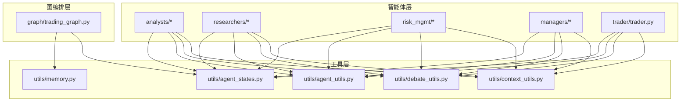
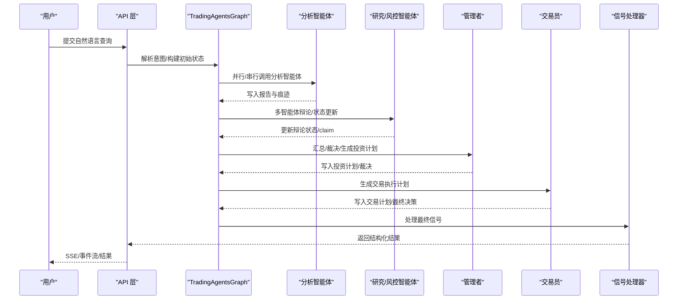
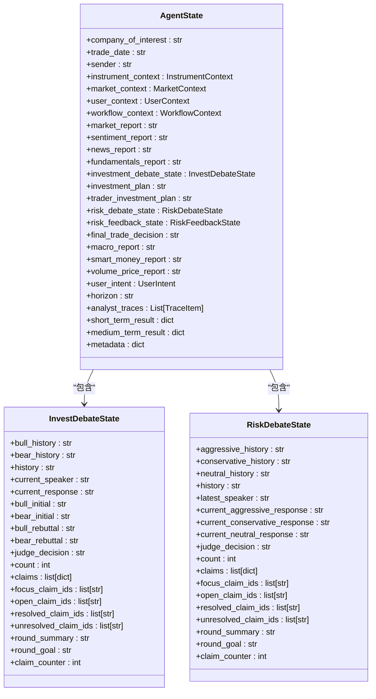
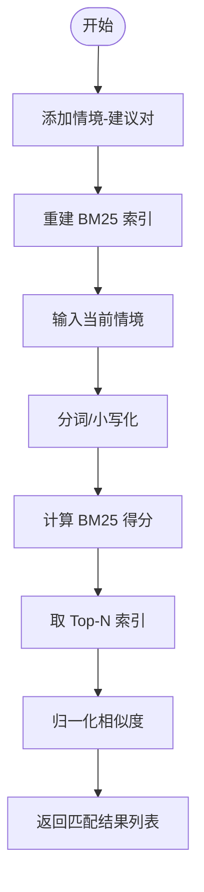
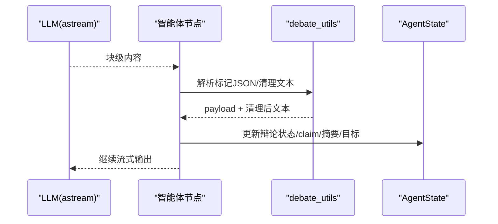
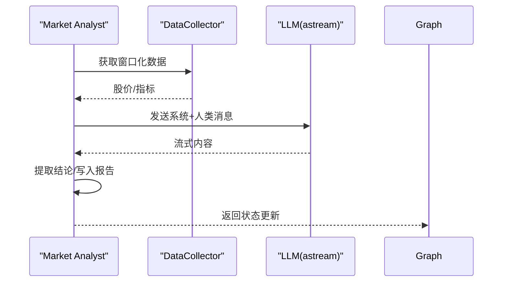
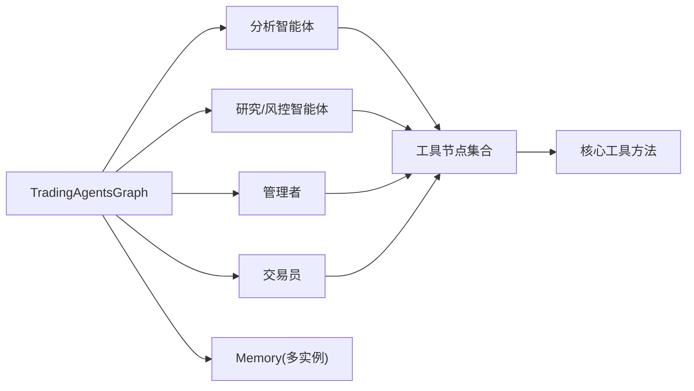

# 自定义智能体

<cite>
**本文引用的文件**   
- [tradingagents/agents/__init__.py](file://tradingagents/agents/__init__.py)
- [tradingagents/agents/utils/agent_states.py](file://tradingagents/agents/utils/agent_states.py)
- [tradingagents/agents/utils/memory.py](file://tradingagents/agents/utils/memory.py)
- [tradingagents/agents/utils/context_utils.py](file://tradingagents/agents/utils/context_utils.py)
- [tradingagents/agents/utils/agent_utils.py](file://tradingagents/agents/utils/agent_utils.py)
- [tradingagents/agents/utils/debate_utils.py](file://tradingagents/agents/utils/debate_utils.py)
- [tradingagents/agents/analysts/market_analyst.py](file://tradingagents/agents/analysts/market_analyst.py)
- [tradingagents/agents/researchers/bull_researcher.py](file://tradingagents/agents/researchers/bull_researcher.py)
- [tradingagents/agents/risk_mgmt/aggressive_debator.py](file://tradingagents/agents/risk_mgmt/aggressive_debator.py)
- [tradingagents/agents/managers/research_manager.py](file://tradingagents/agents/managers/research_manager.py)
- [tradingagents/graph/trading_graph.py](file://tradingagents/graph/trading_graph.py)
- [tradingagents/default_config.py](file://tradingagents/default_config.py)
- [AGENTS.md](file://AGENTS.md)
</cite>

## 目录
1. [简介](#简介)
2. [项目结构](#项目结构)
3. [核心组件](#核心组件)
4. [架构总览](#架构总览)
5. [详细组件分析](#详细组件分析)
6. [依赖分析](#依赖分析)
7. [性能考虑](#性能考虑)
8. [故障排查指南](#故障排查指南)
9. [结论](#结论)
10. [附录](#附录)

## 简介
本文件面向希望在 TradingAgents-AShare 中创建“自定义智能体”的开发者，系统讲解智能体架构设计、状态管理、消息与状态流转、多智能体协作模式、记忆与上下文管理、以及调试与性能监控方法。文档同时提供可复用的开发模板、最佳实践与端到端集成示例，帮助快速落地符合项目规范的新型智能体。

## 项目结构
TradingAgents-AShare 将“智能体”组织为“分析类”“研究类”“风控类”“管理层”“交易员”等角色族，通过统一的状态结构与图编排框架完成跨角色协作。核心目录要点如下：
- tradingagents/agents：各类智能体实现与通用工具
  - analysts/*：市场、新闻、情绪、基本面、宏观、聪明钱、量价等分析智能体
  - researchers/*：多空研究员（如 Bull/Bear）
  - risk_mgmt/*：激进/保守/中性风控辩手
  - managers/*：研究/风控管理者
  - trader/trader.py：交易员
  - utils/*：状态、上下文、记忆、辩论工具、通用工具
- tradingagents/graph：LangGraph 图编排、传播、反射、信号处理
- tradingagents/default_config.py：默认运行配置
- AGENTS.md：项目工作指南与命令说明

**图表来源**
- [tradingagents/agents/__init__.py:1-46](file://tradingagents/agents/__init__.py#L1-L46)
- [tradingagents/graph/trading_graph.py:1-489](file://tradingagents/graph/trading_graph.py#L1-L489)

**章节来源**
- [AGENTS.md:20-36](file://AGENTS.md#L20-L36)
- [tradingagents/agents/__init__.py:1-46](file://tradingagents/agents/__init__.py#L1-L46)

## 核心组件
- 统一状态模型：AgentState 及其子状态 InvestDebateState/RiskDebateState，承载市场/用户/工作流上下文、各分析报告、辩论与反馈状态、最终决策等。
- 记忆系统：FinancialSituationMemory 使用 BM25 进行离线相似度检索，支持多智能体长期经验沉淀与复用。
- 上下文工具：根据标的、日期与市场国家推断 Instrument/Market/User 三类上下文，并提供摘要与视图。
- 辩论工具：提供结构化解析、状态更新、轮次目标与摘要生成等能力，支撑多智能体对话协议。
- 工具节点：封装数据采集与分析工具，作为 LangGraph 的 ToolNode 供智能体调用。
- 图编排：TradingAgentsGraph 负责初始化 LLM、内存、工具节点、条件逻辑与传播器，构建可持久化的图并驱动状态流转。

**章节来源**
- [tradingagents/agents/utils/agent_states.py:147-185](file://tradingagents/agents/utils/agent_states.py#L147-L185)
- [tradingagents/agents/utils/memory.py:12-145](file://tradingagents/agents/utils/memory.py#L12-L145)
- [tradingagents/agents/utils/context_utils.py:33-88](file://tradingagents/agents/utils/context_utils.py#L33-L88)
- [tradingagents/agents/utils/debate_utils.py:159-269](file://tradingagents/agents/utils/debate_utils.py#L159-L269)
- [tradingagents/graph/trading_graph.py:186-242](file://tradingagents/graph/trading_graph.py#L186-L242)

## 架构总览
下图展示从意图解析到图传播、再到最终信号处理的端到端流程，以及智能体之间的协作关系。

**图表来源**
- [tradingagents/graph/trading_graph.py:243-296](file://tradingagents/graph/trading_graph.py#L243-L296)
- [tradingagents/agents/analysts/market_analyst.py:26-89](file://tradingagents/agents/analysts/market_analyst.py#L26-L89)
- [tradingagents/agents/researchers/bull_researcher.py:15-99](file://tradingagents/agents/researchers/bull_researcher.py#L15-L99)
- [tradingagents/agents/managers/research_manager.py:15-149](file://tradingagents/agents/managers/research_manager.py#L15-L149)

## 详细组件分析

### 组件A：状态模型与上下文管理
- AgentState：统一承载 instrument/market/user/workflow 上下文、各分析报告、辩论状态、最终决策与元数据。
- InvestDebateState/RiskDebateState：分别记录多空/风控辩论的历史、轮次、claim 集合与焦点、回合摘要与目标。
- 上下文工具：根据标的与日期推断市场国家、交易时段、分析模式与数据截止时间，提供中文摘要视图。

**图表来源**
- [tradingagents/agents/utils/agent_states.py:147-185](file://tradingagents/agents/utils/agent_states.py#L147-L185)
- [tradingagents/agents/utils/agent_states.py:88-133](file://tradingagents/agents/utils/agent_states.py#L88-L133)

**章节来源**
- [tradingagents/agents/utils/agent_states.py:30-185](file://tradingagents/agents/utils/agent_states.py#L30-L185)
- [tradingagents/agents/utils/context_utils.py:67-88](file://tradingagents/agents/utils/context_utils.py#L67-L88)

### 组件B：记忆系统与上下文管理
- FinancialSituationMemory：基于 BM25 的离线相似匹配，支持添加“情境-建议”对、检索 Top-N 匹配并归一化相似度。
- 上下文摘要：提供标的、市场、用户三类上下文的中文摘要字符串，便于提示词注入。

**图表来源**
- [tradingagents/agents/utils/memory.py:44-92](file://tradingagents/agents/utils/memory.py#L44-L92)

**章节来源**
- [tradingagents/agents/utils/memory.py:12-145](file://tradingagents/agents/utils/memory.py#L12-L145)
- [tradingagents/agents/utils/context_utils.py:162-234](file://tradingagents/agents/utils/context_utils.py#L162-L234)

### 组件C：智能体协作与消息处理
- 多智能体对话协议：通过 InvestDebateState/RiskDebateState 维护历史、当前发言、轮次计数、claim 集合与焦点、回合摘要与目标。
- 结构化输出：智能体输出中嵌入带标记的 JSON（如 DEBATE_STATE、RISK_STATE），由 debate_utils 解析并更新状态。
- Token 级流式输出：通过 ContextVar 注入的进度跟踪器实时推送 SSE 事件，前端可视化。

**图表来源**
- [tradingagents/agents/researchers/bull_researcher.py:60-98](file://tradingagents/agents/researchers/bull_researcher.py#L60-L98)
- [tradingagents/agents/utils/debate_utils.py:8-22](file://tradingagents/agents/utils/debate_utils.py#L8-L22)
- [tradingagents/agents/utils/debate_utils.py:159-269](file://tradingagents/agents/utils/debate_utils.py#L159-L269)

**章节来源**
- [tradingagents/agents/researchers/bull_researcher.py:15-99](file://tradingagents/agents/researchers/bull_researcher.py#L15-L99)
- [tradingagents/agents/risk_mgmt/aggressive_debator.py:14-94](file://tradingagents/agents/risk_mgmt/aggressive_debator.py#L14-L94)
- [tradingagents/agents/utils/debate_utils.py:159-269](file://tradingagents/agents/utils/debate_utils.py#L159-L269)

### 组件D：分析智能体实现范式
- 市场分析智能体：并行拉取 K 线与技术指标，构造提示词，流式输出报告并提取结论。
- 研究/风控智能体：读取历史报告与记忆，结合辩论状态与焦点 claim，生成结构化回复并更新状态。

**图表来源**
- [tradingagents/agents/analysts/market_analyst.py:26-89](file://tradingagents/agents/analysts/market_analyst.py#L26-L89)

**章节来源**
- [tradingagents/agents/analysts/market_analyst.py:26-122](file://tradingagents/agents/analysts/market_analyst.py#L26-L122)
- [tradingagents/agents/researchers/bull_researcher.py:15-99](file://tradingagents/agents/researchers/bull_researcher.py#L15-L99)
- [tradingagents/agents/managers/research_manager.py:15-149](file://tradingagents/agents/managers/research_manager.py#L15-L149)

## 依赖分析
- 智能体到工具层：各智能体通过统一工具节点访问数据采集与分析能力，降低耦合。
- 工具层内部：工具节点聚合多个具体工具（如 get_stock_data、get_indicators、get_fundamentals 等），便于扩展。
- 图编排层：TradingAgentsGraph 统一初始化 LLM、内存、工具节点与条件逻辑，负责状态持久化与传播。

**图表来源**
- [tradingagents/graph/trading_graph.py:186-242](file://tradingagents/graph/trading_graph.py#L186-L242)
- [tradingagents/agents/utils/agent_utils.py:4-27](file://tradingagents/agents/utils/agent_utils.py#L4-L27)

**章节来源**
- [tradingagents/graph/trading_graph.py:51-152](file://tradingagents/graph/trading_graph.py#L51-L152)
- [tradingagents/agents/utils/agent_utils.py:29-52](file://tradingagents/agents/utils/agent_utils.py#L29-L52)

## 性能考虑
- 并行数据获取：分析智能体在获取指标时采用并发任务，减少等待时间。
- 流式输出与进度追踪：通过 ContextVar 注入的进度跟踪器，前端可实时感知 Token 级输出，提升交互体验。
- 缓存与预取：图编排层在运行前预取全量数据，避免重复网络请求。
- 日志与耗时统计：管理者节点记录推理与内容首 Token 时间，便于性能分析与优化。

**章节来源**
- [tradingagents/agents/analysts/market_analyst.py:101-122](file://tradingagents/agents/analysts/market_analyst.py#L101-L122)
- [tradingagents/agents/managers/research_manager.py:67-125](file://tradingagents/agents/managers/research_manager.py#L67-L125)
- [tradingagents/graph/trading_graph.py:328-341](file://tradingagents/graph/trading_graph.py#L328-L341)

## 故障排查指南
- SSE 事件与作业恢复：确认作业 ID 不丢失，刷新页面后通过恢复接口与事件流同步状态。
- 数据提供方稳定性：针对易限流的数据源（如东财资金流）遵循项目建议的缓存与冷却策略。
- 提示词与输出结构：若风控裁决解析失败，系统会按拒绝处理并记录说明，需检查智能体输出中的标记块格式。

**章节来源**
- [AGENTS.md:110-137](file://AGENTS.md#L110-L137)
- [tradingagents/agents/utils/debate_utils.py:36-72](file://tradingagents/agents/utils/debate_utils.py#L36-L72)

## 结论
通过统一的状态模型、严谨的上下文与记忆机制、结构化的辩论协议与流式输出体系，TradingAgents-AShare 为自定义智能体提供了清晰的扩展路径。开发者可基于现有智能体实现范式，快速创建新的分析/研究/风控智能体，并融入图编排与持久化流程，实现稳定、可观测且可维护的多智能体协作。

## 附录

### 开发模板：创建自定义智能体类型
- 步骤概要
  - 定义智能体工厂函数，接收 LLM 与可选依赖（如 Memory/DataCollector）。
  - 在智能体内部：
    - 读取 AgentState 中的上下文与报告字段。
    - 通过工具节点或直接并行获取所需数据。
    - 构造提示词，使用 LLM.astream 进行流式输出。
    - 从输出中提取结构化 JSON（如 DEBATE_STATE/RISK_STATE），调用 debate_utils 更新状态。
    - 通过进度跟踪器推送 SSE 事件。
  - 返回状态更新字典，确保字段与 AgentState 兼容。

- 参考实现路径
  - [tradingagents/agents/analysts/market_analyst.py:26-89](file://tradingagents/agents/analysts/market_analyst.py#L26-L89)
  - [tradingagents/agents/researchers/bull_researcher.py:15-99](file://tradingagents/agents/researchers/bull_researcher.py#L15-L99)
  - [tradingagents/agents/managers/research_manager.py:15-149](file://tradingagents/agents/managers/research_manager.py#L15-L149)
  - [tradingagents/agents/risk_mgmt/aggressive_debator.py:14-94](file://tradingagents/agents/risk_mgmt/aggressive_debator.py#L14-L94)

- 关键要点
  - 使用 TypedDict 字段名保持与 AgentState 一致。
  - 使用 extract_verdict/strip_tagged_json 等工具保证输出结构化。
  - 通过 current_tracker_var 注入进度跟踪器，确保前端可流式显示。

**章节来源**
- [tradingagents/agents/analysts/market_analyst.py:26-89](file://tradingagents/agents/analysts/market_analyst.py#L26-L89)
- [tradingagents/agents/researchers/bull_researcher.py:15-99](file://tradingagents/agents/researchers/bull_researcher.py#L15-L99)
- [tradingagents/agents/managers/research_manager.py:15-149](file://tradingagents/agents/managers/research_manager.py#L15-L149)
- [tradingagents/agents/utils/debate_utils.py:8-22](file://tradingagents/agents/utils/debate_utils.py#L8-L22)

### 消息处理与状态转换
- 智能体输出结构化标记块，debate_utils 负责：
  - 提取标记 JSON（如 DEBATE_STATE/RISK_STATE）。
  - 清洗文本，更新 claim 状态（open/addressed/resolved/unresolved）。
  - 维护焦点 claim、回合摘要与目标。
  - 追加历史与当前发言，递增轮次计数。

**章节来源**
- [tradingagents/agents/utils/debate_utils.py:159-269](file://tradingagents/agents/utils/debate_utils.py#L159-L269)

### 记忆系统与上下文管理
- 记忆系统
  - 添加：add_situations
  - 查询：get_memories
  - 清空：clear
- 上下文
  - 标的：infer_instrument_context
  - 市场：build_market_context
  - 用户：normalize_user_context
  - 摘要：summarize_* 系列

**章节来源**
- [tradingagents/agents/utils/memory.py:44-99](file://tradingagents/agents/utils/memory.py#L44-L99)
- [tradingagents/agents/utils/context_utils.py:33-234](file://tradingagents/agents/utils/context_utils.py#L33-L234)

### 配置与运行参数
- 默认配置项：LLM 提供商、模型、推理配置、辩论轮次上限、数据供应商路由、语言控制等。
- 建议在新增智能体时：
  - 明确提示词语言（zh/en/auto）。
  - 控制推理 effort/thinking level 以平衡速度与质量。
  - 合理设置 TA_MAX_DEBATE/TA_MAX_RISK 以控制对话轮次。

**章节来源**
- [tradingagents/default_config.py:3-43](file://tradingagents/default_config.py#L3-L43)

### 调试工具与性能监控
- 流式输出与 SSE：通过进度跟踪器推送 Token/消息事件，前端可实时渲染。
- 日志与耗时：管理者节点记录推理与内容首 Token 时间，便于定位慢点。
- 作业恢复：API 层提供作业恢复与事件流接口，确保刷新后状态一致。

**章节来源**
- [tradingagents/agents/managers/research_manager.py:67-125](file://tradingagents/agents/managers/research_manager.py#L67-L125)
- [AGENTS.md:110-137](file://AGENTS.md#L110-L137)

### 完整集成示例（步骤指引）
- 在 tradingagents/agents/analysts/ 下新增智能体模块，导出 create_* 工厂函数。
- 在 tradingagents/agents/__init__.py 中注册新智能体工厂。
- 在 tradingagents/graph/setup.py 中导入并注册到 GraphSetup。
- 在 TradingAgentsGraph 中确认工具节点包含所需工具，或新增 ToolNode。
- 在前端侧确认 AgentCollaboration.tsx 能正确渲染新智能体节点与分组标签。
- 通过 API 触发分析，观察 SSE 事件与最终结果。

**章节来源**
- [tradingagents/agents/__init__.py:5-22](file://tradingagents/agents/__init__.py#L5-L22)
- [tradingagents/graph/setup.py:22-54](file://tradingagents/graph/setup.py#L22-L54)
- [frontend/src/components/AgentCollaboration.tsx:141-145](file://frontend/src/components/AgentCollaboration.tsx#L141-L145)