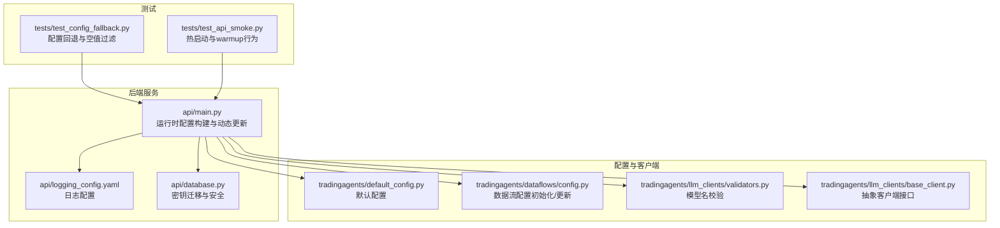
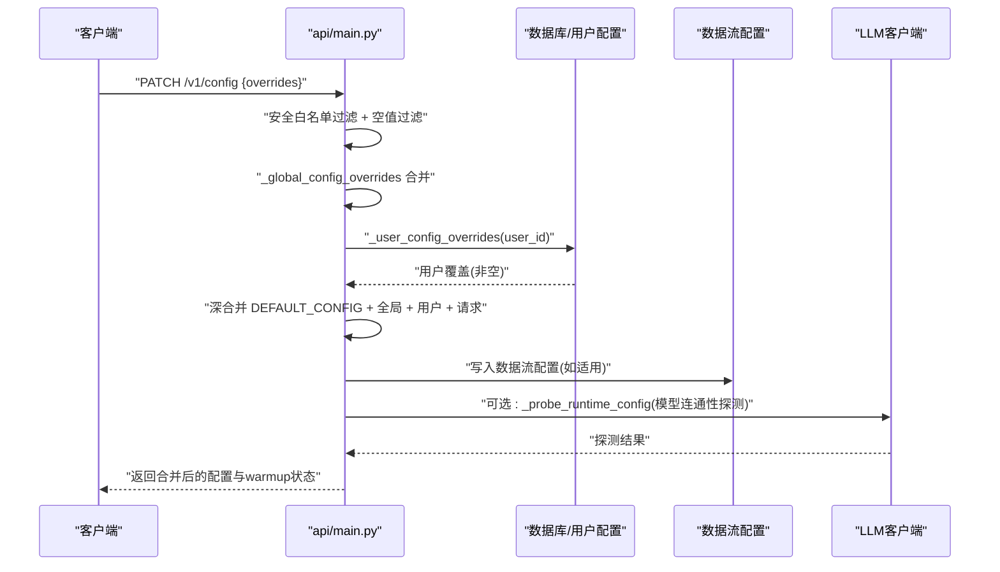
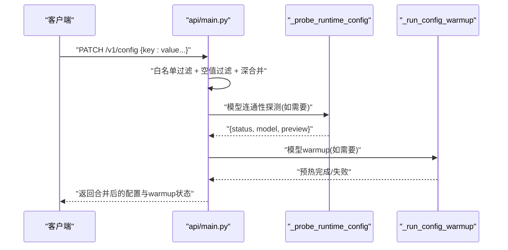
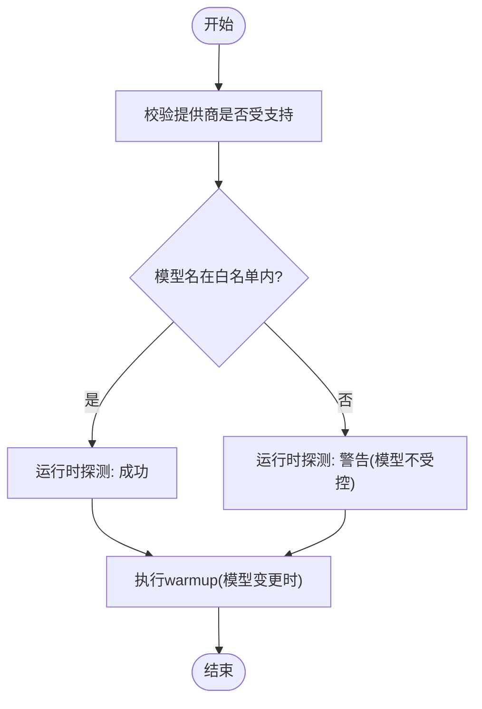
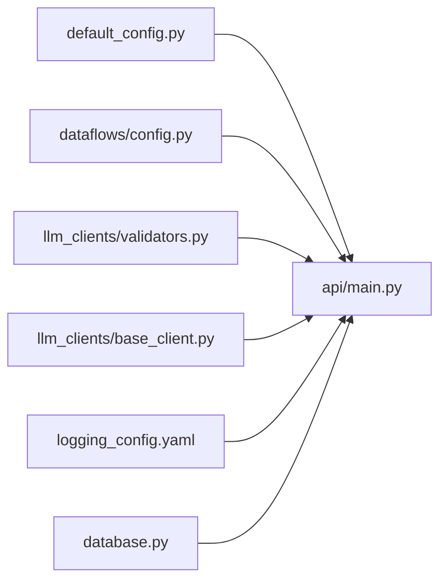

# 配置扩展

<cite>
**本文引用的文件**
- [api/main.py](file://api/main.py)
- [api/logging_config.yaml](file://api/logging_config.yaml)
- [api/database.py](file://api/database.py)
- [tradingagents/default_config.py](file://tradingagents/default_config.py)
- [tradingagents/dataflows/config.py](file://tradingagents/dataflows/config.py)
- [tradingagents/llm_clients/validators.py](file://tradingagents/llm_clients/validators.py)
- [tradingagents/llm_clients/base_client.py](file://tradingagents/llm_clients/base_client.py)
- [tests/test_config_fallback.py](file://tests/test_config_fallback.py)
- [tests/test_api_smoke.py](file://tests/test_api_smoke.py)
</cite>

## 目录
1. [简介](#简介)
2. [项目结构](#项目结构)
3. [核心组件](#核心组件)
4. [架构总览](#架构总览)
5. [详细组件分析](#详细组件分析)
6. [依赖分析](#依赖分析)
7. [性能考虑](#性能考虑)
8. [故障排除指南](#故障排除指南)
9. [结论](#结论)
10. [附录](#附录)

## 简介
本文件面向“TradingAgents-AShare”项目的配置扩展与运维场景，系统化阐述配置架构、配置项分类、加载优先级、动态更新与回滚策略，并提供扩展开发方法与最佳实践。重点覆盖以下方面：
- 全局配置、智能体配置、数据源配置、LLM配置的分类与职责边界
- 配置加载顺序：环境变量、数据库用户配置、请求级覆盖、默认值与安全过滤
- 动态配置更新：PATCH /v1/config 的合并策略、热重载与预检（warmup）
- 配置验证与回滚：模型名校验、运行时探测、错误处理与降级
- 扩展开发：新增配置项、验证器实现、迁移工具与安全约束

## 项目结构
围绕配置相关的关键模块如下：
- 后端入口与运行时配置构建：api/main.py
- 默认配置与数据流配置：tradingagents/default_config.py、tradingagents/dataflows/config.py
- LLM 客户端与模型校验：tradingagents/llm_clients/*
- 日志配置：api/logging_config.yaml
- 数据库与密钥迁移：api/database.py
- 测试用例：tests/test_config_fallback.py、tests/test_api_smoke.py



图表来源
- [api/main.py:994-1017](file://api/main.py#L994-L1017)
- [tradingagents/default_config.py](file://tradingagents/default_config.py)
- [tradingagents/dataflows/config.py:1-31](file://tradingagents/dataflows/config.py#L1-L31)
- [tradingagents/llm_clients/validators.py:1-82](file://tradingagents/llm_clients/validators.py#L1-L82)
- [tradingagents/llm_clients/base_client.py:1-21](file://tradingagents/llm_clients/base_client.py#L1-L21)
- [api/logging_config.yaml](file://api/logging_config.yaml)
- [api/database.py:146-239](file://api/database.py#L146-L239)
- [tests/test_config_fallback.py:1-26](file://tests/test_config_fallback.py#L1-L26)
- [tests/test_api_smoke.py:327-350](file://tests/test_api_smoke.py#L327-L350)

章节来源
- [api/main.py:994-1017](file://api/main.py#L994-L1017)
- [tradingagents/default_config.py](file://tradingagents/default_config.py)
- [tradingagents/dataflows/config.py:1-31](file://tradingagents/dataflows/config.py#L1-L31)
- [tradingagents/llm_clients/validators.py:1-82](file://tradingagents/llm_clients/validators.py#L1-L82)
- [tradingagents/llm_clients/base_client.py:1-21](file://tradingagents/llm_clients/base_client.py#L1-L21)
- [api/logging_config.yaml](file://api/logging_config.yaml)
- [api/database.py:146-239](file://api/database.py#L146-L239)
- [tests/test_config_fallback.py:1-26](file://tests/test_config_fallback.py#L1-L26)
- [tests/test_api_smoke.py:327-350](file://tests/test_api_smoke.py#L327-L350)

## 核心组件
- 运行时配置构建器：负责从默认配置出发，叠加全局覆盖、用户覆盖与请求覆盖，并进行空值过滤与安全白名单限制，最终生成当前会话可用的配置快照。
- 数据流配置管理：提供数据流层的配置初始化、更新与读取能力，确保数据采集与处理链路可被统一注入。
- LLM 客户端与校验：抽象出统一的 LLM 客户端接口，配合模型名白名单校验，保障模型选择的安全性与兼容性。
- 日志与密钥迁移：通过日志配置文件与数据库迁移逻辑，确保系统在升级过程中对敏感信息的持久化与加密策略保持一致。

章节来源
- [api/main.py:994-1017](file://api/main.py#L994-L1017)
- [tradingagents/dataflows/config.py:1-31](file://tradingagents/dataflows/config.py#L1-L31)
- [tradingagents/llm_clients/base_client.py:1-21](file://tradingagents/llm_clients/base_client.py#L1-L21)
- [tradingagents/llm_clients/validators.py:1-82](file://tradingagents/llm_clients/validators.py#L1-L82)
- [api/logging_config.yaml](file://api/logging_config.yaml)
- [api/database.py:146-239](file://api/database.py#L146-L239)

## 架构总览
下图展示配置从“默认值”到“运行时”的全链路加载与合并过程，以及与 LLM 探测、warmup 的交互关系。



图表来源
- [api/main.py:994-1017](file://api/main.py#L994-L1017)
- [api/main.py:3729-3757](file://api/main.py#L3729-L3757)
- [api/main.py:3830-3837](file://api/main.py#L3830-L3837)
- [tradingagents/dataflows/config.py:15-27](file://tradingagents/dataflows/config.py#L15-L27)

章节来源
- [api/main.py:994-1017](file://api/main.py#L994-L1017)
- [api/main.py:3729-3757](file://api/main.py#L3729-L3757)
- [api/main.py:3830-3837](file://api/main.py#L3830-L3837)
- [tradingagents/dataflows/config.py:15-27](file://tradingagents/dataflows/config.py#L15-L27)

## 详细组件分析

### 配置分类体系
- 全局配置：通过 PATCH /v1/config 设置的全局覆盖，作用于后续所有请求；由运行时配置构建器统一合并。
- 智能体配置：与交易智能体行为相关的参数（如辩论轮次、研究深度等），通常随全局配置下发至各智能体执行单元。
- 数据源配置：数据流层的配置（如数据提供者、采集周期、指标计算等），通过数据流配置模块进行初始化与更新。
- LLM 配置：包含模型提供商、模型名称、基础URL、API Key 等，支持按用户维度存储与加密。

章节来源
- [api/main.py:994-1017](file://api/main.py#L994-L1017)
- [tradingagents/dataflows/config.py:1-31](file://tradingagents/dataflows/config.py#L1-L31)
- [api/database.py:174-239](file://api/database.py#L174-L239)

### 配置加载优先级与安全过滤
- 优先级顺序（从低到高）：
  1) 默认配置 DEFAULT_CONFIG
  2) 全局覆盖（来自 PATCH /v1/config 的持久化）
  3) 用户覆盖（来自数据库 user_llm_configs 等表）
  4) 请求覆盖（来自本次 PATCH 请求）
- 安全与健壮性：
  - 仅允许白名单内的键进入运行时配置
  - 合并前过滤空值（None、""、[]），避免覆盖环境变量默认值
  - 支持服务器端回退开关（ALLOW_SERVER_LLM_FALLBACK）

```mermaid
flowchart TD
Start(["开始"]) --> LoadDefault["加载默认配置 DEFAULT_CONFIG"]
LoadDefault --> ApplyGlobal["应用全局覆盖(_global_config_overrides)"]
ApplyGlobal --> FetchUser["查询用户覆盖(user_id)"]
FetchUser --> FilterEmpty["过滤空值(None/\"\"/[])"]
FilterEmpty --> MergeOrder{"合并顺序"}
MergeOrder --> |1. 全局| Merge1["深合并"]
MergeOrder --> |2. 用户| Merge2["深合并"]
MergeOrder --> |3. 请求| Merge3["深合并"]
Merge1 --> ValidateAllow["白名单过滤"]
Merge2 --> ValidateAllow
Merge3 --> ValidateAllow
ValidateAllow --> End(["输出运行时配置"])
```

图表来源
- [api/main.py:994-1017](file://api/main.py#L994-L1017)

章节来源
- [api/main.py:994-1017](file://api/main.py#L994-L1017)
- [tests/test_config_fallback.py:12-26](file://tests/test_config_fallback.py#L12-L26)

### 动态配置更新机制
- 更新入口：PATCH /v1/config
- 合并策略：深合并，键名需在允许列表中；空值不参与合并
- 预检与热启动（warmup）：
  - 当涉及模型变更时，触发探测与预热，验证上游连通性与响应质量
  - 非模型变更则跳过 warmup
- 错误处理：
  - 401 认证错误会被识别并转换为明确的用户提示
  - 其他异常按摘要返回，便于定位



图表来源
- [api/main.py:3729-3757](file://api/main.py#L3729-L3757)
- [api/main.py:3830-3837](file://api/main.py#L3830-L3837)
- [tests/test_api_smoke.py:327-350](file://tests/test_api_smoke.py#L327-L350)

章节来源
- [api/main.py:3729-3757](file://api/main.py#L3729-L3757)
- [api/main.py:3830-3837](file://api/main.py#L3830-L3837)
- [tests/test_api_smoke.py:327-350](file://tests/test_api_smoke.py#L327-L350)

### 配置验证与回滚策略
- 模型名验证：基于白名单的模型名校验，支持主流厂商的多系列模型
- 运行时探测：构造简短提示词，调用 LLM 返回内容的片段作为预览，用于快速判断连通性与响应质量
- 回滚策略：若探测或 warmup 失败，API 将返回错误详情，建议回滚到上一个稳定配置；数据库侧对密钥与敏感字段进行哈希与重新加密迁移，降低升级风险



图表来源
- [tradingagents/llm_clients/validators.py:69-82](file://tradingagents/llm_clients/validators.py#L69-L82)
- [api/main.py:3729-3757](file://api/main.py#L3729-L3757)
- [api/main.py:3830-3837](file://api/main.py#L3830-L3837)

章节来源
- [tradingagents/llm_clients/validators.py:1-82](file://tradingagents/llm_clients/validators.py#L1-L82)
- [api/main.py:3729-3757](file://api/main.py#L3729-L3757)
- [api/main.py:3830-3837](file://api/main.py#L3830-L3837)
- [api/database.py:146-239](file://api/database.py#L146-L239)

### 配置扩展开发方法
- 新增配置项
  - 在默认配置中定义键与默认值
  - 在运行时配置构建器的白名单中加入新键
  - 如属数据流相关，同步在数据流配置模块中暴露 set/get 接口
- 配置验证器实现
  - 对于模型类配置，复用模型名校验器或扩展白名单
  - 对于其他类型（如数值范围、枚举），在运行时构建器或专用校验模块中增加校验逻辑
- 配置迁移工具
  - 参考数据库迁移逻辑，对敏感字段进行哈希/重新加密
  - 提供版本化的迁移脚本，确保升级时的数据一致性与安全性

章节来源
- [tradingagents/default_config.py](file://tradingagents/default_config.py)
- [api/main.py:994-1017](file://api/main.py#L994-L1017)
- [tradingagents/dataflows/config.py:15-27](file://tradingagents/dataflows/config.py#L15-L27)
- [tradingagents/llm_clients/validators.py:1-82](file://tradingagents/llm_clients/validators.py#L1-L82)
- [api/database.py:146-239](file://api/database.py#L146-L239)

## 依赖分析
- 运行时配置构建器依赖默认配置、数据库用户覆盖、白名单与深合并工具
- 数据流配置模块依赖默认配置并在必要时被运行时配置覆盖
- LLM 客户端依赖模型校验器与运行时配置中的提供商、模型、URL、Key 等参数
- 日志配置与数据库迁移分别服务于可观测性与数据安全



图表来源
- [api/main.py:994-1017](file://api/main.py#L994-L1017)
- [tradingagents/default_config.py](file://tradingagents/default_config.py)
- [tradingagents/dataflows/config.py:1-31](file://tradingagents/dataflows/config.py#L1-L31)
- [tradingagents/llm_clients/validators.py:1-82](file://tradingagents/llm_clients/validators.py#L1-L82)
- [tradingagents/llm_clients/base_client.py:1-21](file://tradingagents/llm_clients/base_client.py#L1-L21)
- [api/logging_config.yaml](file://api/logging_config.yaml)
- [api/database.py:146-239](file://api/database.py#L146-L239)

章节来源
- [api/main.py:994-1017](file://api/main.py#L994-L1017)
- [tradingagents/dataflows/config.py:1-31](file://tradingagents/dataflows/config.py#L1-L31)
- [tradingagents/llm_clients/validators.py:1-82](file://tradingagents/llm_clients/validators.py#L1-L82)
- [api/database.py:146-239](file://api/database.py#L146-L239)

## 性能考虑
- 合并与探测成本控制：尽量减少不必要的深合并层级，避免在高频请求中重复大对象合并
- warmup 触发条件：仅在模型相关配置变更时触发，降低非必要预热开销
- 缓存与预热：对常用模型的 warmup 结果进行短期缓存，提升后续请求的响应速度
- 日志级别：生产环境建议使用更严格的日志级别，避免在热路径中产生大量 IO

## 故障排除指南
- 现象：PATCH /v1/config 返回 400，提示认证失败
  - 排查：确认 API Key 是否正确，探测逻辑会将 401 明确转译为用户可读提示
- 现象：PATCH /v1/config 返回 400，提示连接验证失败
  - 排查：检查模型名是否在白名单内，网络连通性，基础 URL 与超时设置
- 现象：warmup 被跳过或失败
  - 排查：确认是否涉及模型变更；查看 warmup 的超时与错误摘要；必要时回滚至上一稳定配置
- 现象：配置未生效或被覆盖
  - 排查：确认键是否在白名单内；检查是否存在空值导致的过滤；核对全局/用户/请求三层覆盖顺序

章节来源
- [api/main.py:3746-3757](file://api/main.py#L3746-L3757)
- [tests/test_api_smoke.py:327-350](file://tests/test_api_smoke.py#L327-L350)
- [tests/test_config_fallback.py:12-26](file://tests/test_config_fallback.py#L12-L26)

## 结论
本配置体系以“默认配置 + 白名单 + 空值过滤 + 深合并”为核心，结合 LLM 探测与 warmup，实现了可控、可观测、可回退的动态配置管理。通过分层分类与迁移工具，既满足扩展需求，又确保系统在升级与变更中的稳定性与安全性。

## 附录
- 最佳实践清单
  - 新增配置项必须先在默认配置与白名单中声明
  - 严格区分全局、用户与请求级覆盖，避免无意覆盖
  - 涉及模型的变更必须走探测与 warmup，失败即回滚
  - 敏感字段采用加密存储与定期迁移策略
  - 生产环境开启最小日志级别，避免热路径 IO 抖动