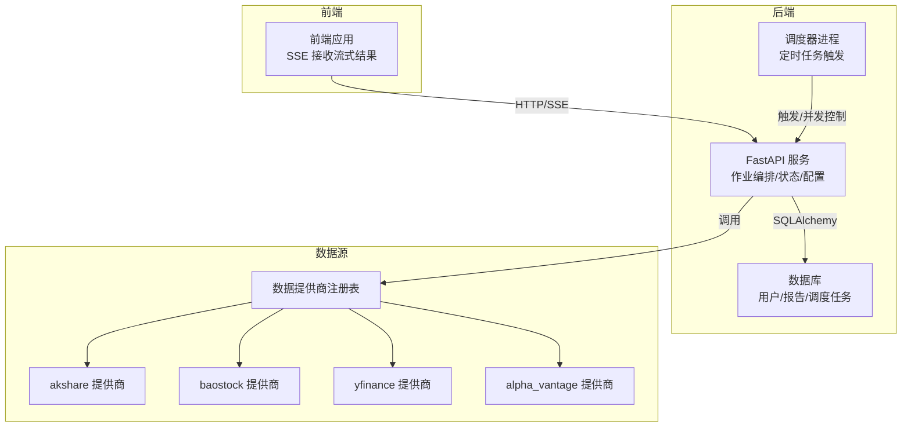
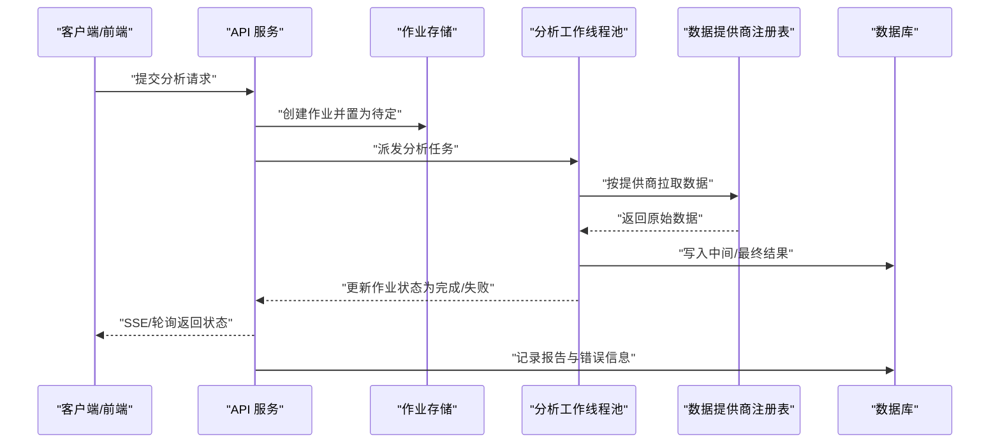
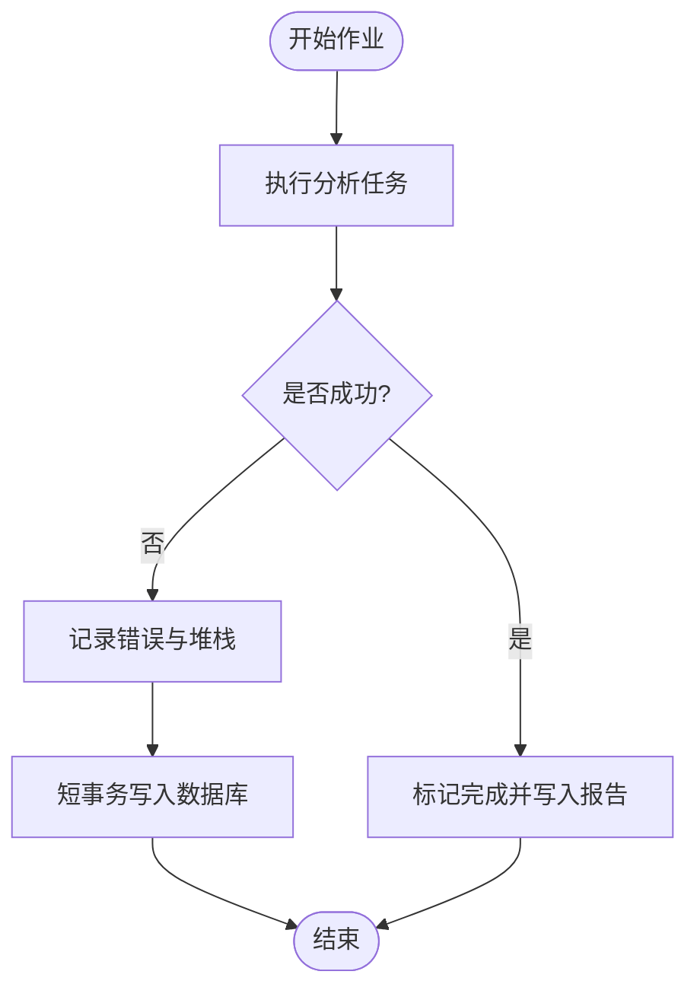
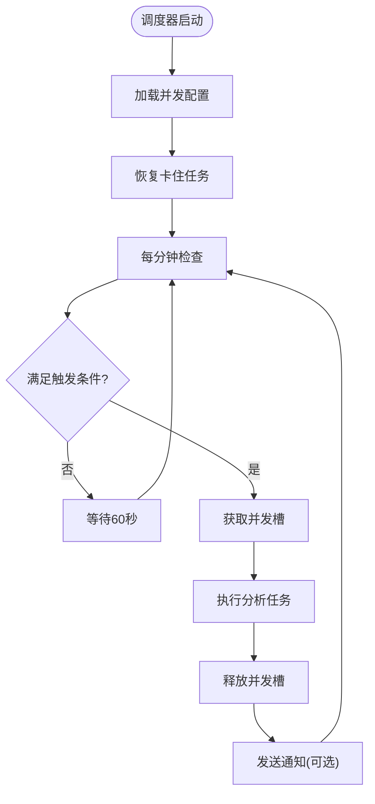
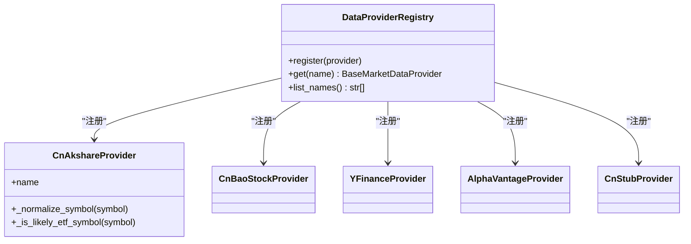
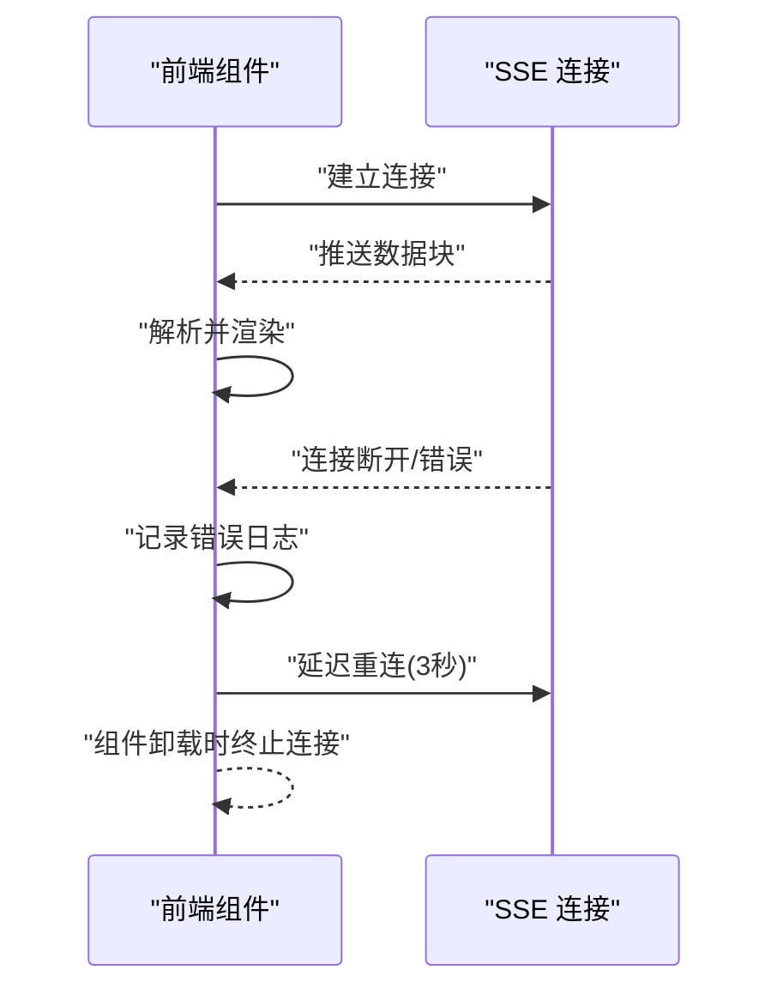
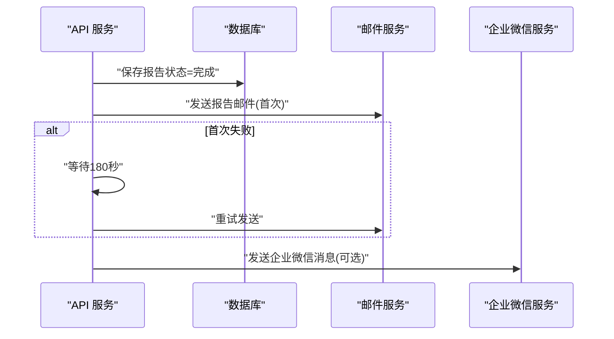
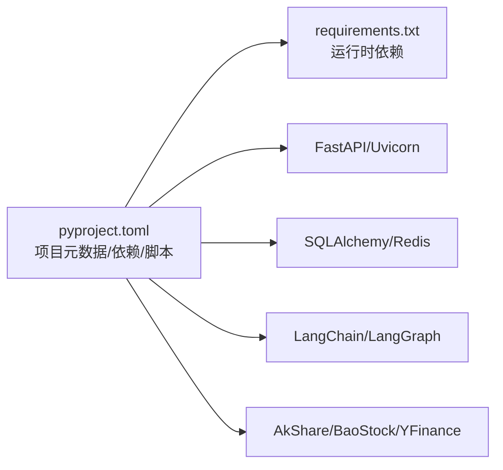

# 故障排除

<cite>
**本文引用的文件**
- [api/main.py](file://api/main.py)
- [api/logging_config.yaml](file://api/logging_config.yaml)
- [scheduler/main.py](file://scheduler/main.py)
- [requirements.txt](file://requirements.txt)
- [pyproject.toml](file://pyproject.toml)
- [frontend/src/hooks/useSSE.ts](file://frontend/src/hooks/useSSE.ts)
- [api/services/email_report_service.py](file://api/services/email_report_service.py)
- [api/services/report_service.py](file://api/services/report_service.py)
- [tests/test_report_recovery.py](file://tests/test_report_recovery.py)
- [tests/test_email_report_service.py](file://tests/test_email_report_service.py)
- [tradingagents/dataflows/providers/registry.py](file://tradingagents/dataflows/providers/registry.py)
- [tradingagents/dataflows/providers/cn_akshare_provider.py](file://tradingagents/dataflows/providers/cn_akshare_provider.py)
- [tradingagents/dataflows/config.py](file://tradingagents/dataflows/config.py)
- [.github/workflows](file://.github/workflows)
- [.run/logs](file://.run/logs)
- [.run/pids](file://.run/pids)
</cite>

## 目录
1. [简介](#简介)
2. [项目结构](#项目结构)
3. [核心组件](#核心组件)
4. [架构总览](#架构总览)
5. [详细组件分析](#详细组件分析)
6. [依赖分析](#依赖分析)
7. [性能考虑](#性能考虑)
8. [故障排除指南](#故障排除指南)
9. [结论](#结论)
10. [附录](#附录)

## 简介
本文件面向运维与开发者，提供 TradingAgents-AShare 的系统化故障排除与常见问题解答（FAQ）。内容涵盖安装与环境准备、配置错误定位、运行时异常与日志分析、性能瓶颈识别与优化、网络与数据获取失败排查、智能体异常处理、紧急故障处置、数据恢复与系统回滚策略，以及社区支持与问题反馈渠道。

## 项目结构
系统采用前后端分离与服务化架构：
- 后端 API 服务：FastAPI 提供分析、报告、调度、通知等接口，负责作业编排与状态管理。
- 调度器进程：独立的计划任务执行器，按交易日与时间窗口触发定时分析。
- 前端：React/Vite 前端应用，通过 SSE 流式接收分析结果。
- 数据层：SQLAlchemy 连接数据库，持久化用户、报告、调度任务等。
- 数据源：多数据提供商注册表，支持 akshare、baostock、yfinance、alpha_vantage 等。
- 日志：标准库 logging 与 uvicorn 日志配置，统一输出格式与级别。

图表来源
- [api/main.py](file://api/main.py)
- [scheduler/main.py](file://scheduler/main.py)
- [tradingagents/dataflows/providers/registry.py](file://tradingagents/dataflows/providers/registry.py)

章节来源
- [api/main.py](file://api/main.py)
- [scheduler/main.py](file://scheduler/main.py)
- [tradingagents/dataflows/providers/registry.py](file://tradingagents/dataflows/providers/registry.py)

## 核心组件
- 作业生命周期与状态机：作业在后端维护“待定/运行/完成/失败”状态，失败时记录错误与堆栈，并持久化到数据库。
- 调度器并发控制：使用信号量限制并发，避免资源争用；启动时恢复“卡住”的任务状态。
- 数据提供商注册与选择：通过注册表统一管理多家数据源，便于扩展与切换。
- SSE 流式传输：前端通过 SSE 接收实时分析进度，具备断线重连与错误日志记录。
- 报告与通知：报告完成后异步发送邮件与企业微信通知，带重试逻辑。
- 日志与可观测性：统一日志格式与级别，支持 uvicorn 访问日志与错误日志。

章节来源
- [api/main.py](file://api/main.py)
- [scheduler/main.py](file://scheduler/main.py)
- [frontend/src/hooks/useSSE.ts](file://frontend/src/hooks/useSSE.ts)
- [api/services/email_report_service.py](file://api/services/email_report_service.py)
- [api/logging_config.yaml](file://api/logging_config.yaml)

## 架构总览
下图展示从请求到分析完成的关键交互路径，包括作业状态流转、并发控制、数据源访问与通知流程。

图表来源
- [api/main.py](file://api/main.py)
- [scheduler/main.py](file://scheduler/main.py)
- [tradingagents/dataflows/providers/registry.py](file://tradingagents/dataflows/providers/registry.py)

## 详细组件分析

### 作业状态与错误处理
- 作业状态：后端维护作业状态字典，失败时写入错误消息与堆栈，并持久化报告状态。
- 错误记录：失败时尝试短事务写入数据库，记录失败原因与堆栈，确保可观测性。
- 并发与超时：作业默认超时阈值可配置，线程池大小与 AnyIO 线程限制可调，避免饥饿与阻塞。

图表来源
- [api/main.py](file://api/main.py)

章节来源
- [api/main.py](file://api/main.py)

### 调度器并发与恢复
- 并发控制：使用信号量限制同时运行的任务数，避免资源耗尽。
- 启动恢复：启动时扫描“运行中但无报告”的任务，重置为失败或清理状态，保障一致性。
- 时间窗口：仅在交易日、非交易时段触发，避免干扰市场数据。

图表来源
- [scheduler/main.py](file://scheduler/main.py)

章节来源
- [scheduler/main.py](file://scheduler/main.py)

### 数据提供商注册与 akshare 适配
- 注册表：集中管理多家数据提供商，便于扩展与切换。
- akshare 适配：对 akshare 导入缺失进行显式提示，支持 A 股代码规范化与 ETF 判别。

图表来源
- [tradingagents/dataflows/providers/registry.py](file://tradingagents/dataflows/providers/registry.py)
- [tradingagents/dataflows/providers/cn_akshare_provider.py](file://tradingagents/dataflows/providers/cn_akshare_provider.py)

章节来源
- [tradingagents/dataflows/providers/registry.py](file://tradingagents/dataflows/providers/registry.py)
- [tradingagents/dataflows/providers/cn_akshare_provider.py](file://tradingagents/dataflows/providers/cn_akshare_provider.py)

### SSE 流式传输与断线重连
- 断线重连：前端监听连接错误，自动重试并记录日志，避免长时间无响应。
- 中断处理：组件卸载时主动中断连接与计时器，防止内存泄漏。

图表来源
- [frontend/src/hooks/useSSE.ts](file://frontend/src/hooks/useSSE.ts)

章节来源
- [frontend/src/hooks/useSSE.ts](file://frontend/src/hooks/useSSE.ts)

### 报告与通知（邮件/企业微信）
- 报告生成：分析完成后生成报告，关键指标与最终决策持久化。
- 通知重试：邮件发送失败时延时重试一次，记录成功/失败日志。

图表来源
- [api/services/email_report_service.py](file://api/services/email_report_service.py)
- [api/services/report_service.py](file://api/services/report_service.py)

章节来源
- [api/services/email_report_service.py](file://api/services/email_report_service.py)
- [api/services/report_service.py](file://api/services/report_service.py)

## 依赖分析
- Python 版本与包管理：要求 Python 3.10+，使用 setuptools 构建，依赖 langchain/langgraph、fastapi/uvicorn、sqlalchemy、redis、akshare 等。
- 运行脚本：提供 tradingagents-api、tradingagents-scheduler 等命令入口。
- 前端开发依赖：eslint、tailwind、vite 等工具链。

图表来源
- [pyproject.toml](file://pyproject.toml)
- [requirements.txt](file://requirements.txt)

章节来源
- [pyproject.toml](file://pyproject.toml)
- [requirements.txt](file://requirements.txt)

## 性能考虑
- 线程池与并发
  - API 与调度器均配置默认线程池大小与 AnyIO 线程限制，避免大量同步调用导致事件循环阻塞。
  - 调度器并发可通过环境变量控制，建议根据 CPU 与数据源限速情况调整。
- 作业超时
  - 作业默认超时阈值可配置，长流程分析建议适当提高，避免误判失败。
- 数据缓存
  - 股票名称映射与交易日历有预热与 TTL 缓存，减少重复 IO。
- I/O 与网络
  - 数据提供商调用需注意外部 API 速率限制，必要时增加重试与退避策略（当前 akshare 提供商已内置锁）。

章节来源
- [api/main.py](file://api/main.py)
- [scheduler/main.py](file://scheduler/main.py)

## 故障排除指南

### 安装与环境准备
- Python 版本
  - 确认 Python ≥ 3.10，否则构建与运行会失败。
- 依赖安装
  - 使用 pip 安装 requirements.txt 中的依赖；若缺少 akshare，请单独安装以启用 A 股数据获取能力。
- 构建与脚本
  - 通过 pyproject.toml 中的脚本入口启动 API 与调度器进程。

章节来源
- [pyproject.toml](file://pyproject.toml)
- [requirements.txt](file://requirements.txt)

### 配置错误
- 环境变量
  - TA_APP_SECRET_KEY 未设置会导致安全警告，生产环境必须设置。
  - LOG_LEVEL 控制日志级别；ANYIO_THREAD_LIMIT、ASYNCIO_DEFAULT_EXECUTOR_WORKERS、TA_JOB_TIMEOUT 等影响并发与超时。
- 配置覆盖
  - 客户端允许的配置覆盖项有限，空值不会覆盖默认值；用户配置优先级高于环境变量。
- 数据源配置
  - akshare 提供商需要正确安装 akshare；若导入失败，将抛出明确异常提示。

章节来源
- [api/main.py](file://api/main.py)
- [tradingagents/dataflows/providers/cn_akshare_provider.py](file://tradingagents/dataflows/providers/cn_akshare_provider.py)

### 运行时异常
- 作业失败
  - 失败时会记录错误与堆栈到作业状态与数据库；检查对应作业 ID 的日志与数据库记录。
- SSE 连接失败
  - 前端会记录错误并自动重连；若长时间无法连接，检查 API 服务健康与网络连通性。
- 邮件通知失败
  - 首次失败会延时重试一次；若仍失败，检查邮件服务配置与凭据。

章节来源
- [api/main.py](file://api/main.py)
- [frontend/src/hooks/useSSE.ts](file://frontend/src/hooks/useSSE.ts)
- [api/services/email_report_service.py](file://api/services/email_report_service.py)

### 性能问题
- 高并发阻塞
  - 检查线程池大小与 AnyIO 线程限制是否过低；适当提升以缓解阻塞。
- 作业超时
  - 对长流程分析适当提高 TA_JOB_TIMEOUT；避免因超时误判失败。
- 数据源限速
  - akshare 等外部 API 存在速率限制，建议增加重试与退避策略（当前提供商已内置锁）。

章节来源
- [api/main.py](file://api/main.py)
- [scheduler/main.py](file://scheduler/main.py)
- [tradingagents/dataflows/providers/cn_akshare_provider.py](file://tradingagents/dataflows/providers/cn_akshare_provider.py)

### 网络连接与数据获取失败
- akshare 导入失败
  - 明确提示需要安装 akshare；安装后重启服务。
- 数据提供商不可达
  - 检查网络与代理设置；确认提供商可用性与限速策略。
- 交易日历与名称映射
  - 启动时会预加载交易日历与名称映射；若异常，检查磁盘权限与网络可达性。

章节来源
- [tradingagents/dataflows/providers/cn_akshare_provider.py](file://tradingagents/dataflows/providers/cn_akshare_provider.py)
- [api/main.py](file://api/main.py)

### 智能体异常
- 分析流程中断
  - 查看作业状态与错误堆栈；确认各分析师模块可用性与配置。
- 报告状态异常
  - 若报告处于“运行中但无结果”，调度器启动时会恢复为失败；检查数据库与日志。

章节来源
- [api/main.py](file://api/main.py)
- [scheduler/main.py](file://scheduler/main.py)

### 日志分析方法
- 日志级别与格式
  - 通过 LOG_LEVEL 控制日志级别；统一格式包含时间戳与消息。
- uvicorn 访问日志
  - 访问日志与错误日志分别配置，便于区分业务日志与服务器日志。
- 作业与调度日志
  - 作业失败会记录堆栈；调度器会记录并发槽获取/释放与任务恢复过程。

章节来源
- [api/logging_config.yaml](file://api/logging_config.yaml)
- [api/main.py](file://api/main.py)
- [scheduler/main.py](file://scheduler/main.py)

### 调试技巧
- 本地复现
  - 使用最小化配置与测试数据复现问题；逐步开启功能定位根因。
- 并发与超时
  - 临时降低并发或提高超时，排除资源争用与外部限速影响。
- 数据源隔离
  - 临时切换至其他数据提供商，验证是否为特定提供商问题。

章节来源
- [api/main.py](file://api/main.py)
- [scheduler/main.py](file://scheduler/main.py)

### 紧急故障处理流程
- 快速评估
  - 确认服务进程状态、数据库连接、外部数据源可用性。
- 降级与隔离
  - 临时关闭高负载功能（如邮件通知），释放资源给核心分析。
- 回滚策略
  - 回退到上一稳定版本镜像或 Git 标签；恢复数据库备份。
- 通知与记录
  - 记录故障现象、处理步骤与恢复时间，形成知识库。

章节来源
- [scheduler/main.py](file://scheduler/main.py)
- [tests/test_report_recovery.py](file://tests/test_report_recovery.py)

### 数据恢复与系统回滚
- 报告恢复
  - 启动时对“运行中但无有效报告”的任务进行恢复，标记失败并记录错误信息。
- 数据库回滚
  - 使用数据库备份进行回滚；回滚前先停止相关进程，回滚后验证服务可用性。
- 配置回滚
  - 恢复到稳定的环境变量与配置文件；避免引入新的覆盖项。

章节来源
- [tests/test_report_recovery.py](file://tests/test_report_recovery.py)
- [scheduler/main.py](file://scheduler/main.py)

### 社区支持与问题反馈
- 工作流与依赖
  - 可参考仓库中的 GitHub Actions 工作流与依赖配置，了解构建与发布流程。
- 日志与 PID 文件
  - 进程日志与 PID 文件位于 .run/logs 与 .run/pids，便于定位进程状态。

章节来源
- [.github/workflows](file://.github/workflows)
- [.run/logs](file://.run/logs)
- [.run/pids](file://.run/pids)

## 结论
通过规范的日志、完善的作业状态管理、调度器恢复机制与通知重试策略，系统在多数异常情况下具备自愈与可观测能力。建议在生产环境中严格设置密钥与环境变量、合理配置并发与超时、定期备份数据库，并建立标准化的回滚与应急响应流程，以保障系统稳定运行。

## 附录

### 常见问题与快速解决清单
- 缺少 akshare：安装 akshare 并重启服务。
- 作业长时间 pending：检查线程池与外部数据源限速；适当提高超时。
- SSE 无法连接：检查 API 服务健康与网络；前端会自动重连。
- 邮件发送失败：检查邮件服务配置；系统会自动重试一次。
- 生产环境安全：设置 TA_APP_SECRET_KEY；避免使用默认密钥。

章节来源
- [requirements.txt](file://requirements.txt)
- [api/main.py](file://api/main.py)
- [frontend/src/hooks/useSSE.ts](file://frontend/src/hooks/useSSE.ts)
- [api/services/email_report_service.py](file://api/services/email_report_service.py)