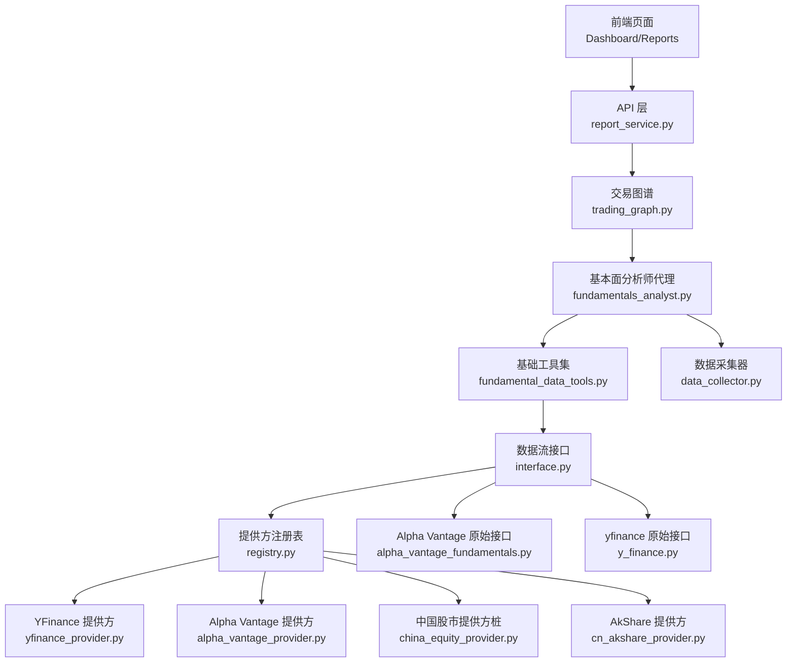
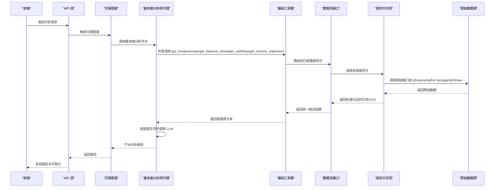
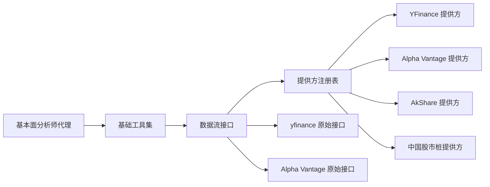

# 基本面数据处理

<cite>
**本文引用的文件**
- [fundamental_data_tools.py](file://tradingagents/agents/utils/fundamental_data_tools.py)
- [fundamentals_analyst.py](file://tradingagents/agents/analysts/fundamentals_analyst.py)
- [data_collector.py](file://tradingagents/graph/data_collector.py)
- [interface.py](file://tradingagents/dataflows/interface.py)
- [registry.py](file://tradingagents/dataflows/providers/registry.py)
- [yfinance_provider.py](file://tradingagents/dataflows/providers/yfinance_provider.py)
- [alpha_vantage_provider.py](file://tradingagents/dataflows/providers/alpha_vantage_provider.py)
- [china_equity_provider.py](file://tradingagents/dataflows/providers/china_equity_provider.py)
- [cn_akshare_provider.py](file://tradingagents/dataflows/providers/cn_akshare_provider.py)
- [y_finance.py](file://tradingagents/dataflows/y_finance.py)
- [alpha_vantage_fundamentals.py](file://tradingagents/dataflows/alpha_vantage_fundamentals.py)
- [trading_graph.py](file://tradingagents/graph/trading_graph.py)
- [report_service.py](file://api/services/report_service.py)
</cite>

## 目录
1. [引言](#引言)
2. [项目结构](#项目结构)
3. [核心组件](#核心组件)
4. [架构总览](#架构总览)
5. [详细组件分析](#详细组件分析)
6. [依赖关系分析](#依赖关系分析)
7. [性能考量](#性能考量)
8. [故障排查指南](#故障排查指南)
9. [结论](#结论)
10. [附录](#附录)

## 引言
本技术文档聚焦于 TradingAgents-AShare 的基本面数据处理系统，系统围绕“财务报表获取—解析—标准化—分析—报告”的完整链路展开。重点覆盖以下方面：
- 财务数据获取：支持多数据源（Alpha Vantage、yfinance、AkShare、BaoStock 等）的统一接入与路由。
- 解析与标准化：将异构数据源输出转换为一致的数据结构，便于后续分析与可视化。
- 报表处理：对收入报表、资产负债表、现金流量表进行统一处理与字段归一化。
- 估值与比率分析：提供关键财务指标与趋势分析能力，支撑投资决策。
- 数据质量控制：缺失值处理、异常检测与错误恢复策略。
- 可视化与对比：提供多维度财务指标对比与趋势展示。
- 更新策略与缓存：基于时间窗口的数据收集与缓存复用，提升性能。

## 项目结构
基本面数据处理涉及前端调用、代理节点、数据采集器、数据流接口与多个数据提供方实现。下图给出与基本面数据处理相关的关键模块与交互关系：

图表来源
- [trading_graph.py:186-228](file://tradingagents/graph/trading_graph.py#L186-L228)
- [fundamentals_analyst.py:10-82](file://tradingagents/agents/analysts/fundamentals_analyst.py#L10-L82)
- [fundamental_data_tools.py:6-77](file://tradingagents/agents/utils/fundamental_data_tools.py#L6-L77)
- [interface.py:1-200](file://tradingagents/dataflows/interface.py#L1-L200)
- [registry.py:11-34](file://tradingagents/dataflows/providers/registry.py#L11-L34)
- [yfinance_provider.py:1-200](file://tradingagents/dataflows/providers/yfinance_provider.py#L1-L200)
- [alpha_vantage_provider.py:1-200](file://tradingagents/dataflows/providers/alpha_vantage_provider.py#L1-L200)
- [china_equity_provider.py:1-54](file://tradingagents/dataflows/providers/china_equity_provider.py#L1-L54)
- [cn_akshare_provider.py:155-196](file://tradingagents/dataflows/providers/cn_akshare_provider.py#L155-L196)
- [y_finance.py:353-394](file://tradingagents/dataflows/y_finance.py#L353-L394)
- [alpha_vantage_fundamentals.py:1-76](file://tradingagents/dataflows/alpha_vantage_fundamentals.py#L1-L76)
- [data_collector.py:1-43](file://tradingagents/graph/data_collector.py#L1-L43)

章节来源
- [trading_graph.py:186-228](file://tradingagents/graph/trading_graph.py#L186-L228)
- [fundamentals_analyst.py:10-82](file://tradingagents/agents/analysts/fundamentals_analyst.py#L10-L82)
- [fundamental_data_tools.py:6-77](file://tradingagents/agents/utils/fundamental_data_tools.py#L6-L77)
- [interface.py:1-200](file://tradingagents/dataflows/interface.py#L1-L200)
- [registry.py:11-34](file://tradingagents/dataflows/providers/registry.py#L11-L34)

## 核心组件
- 基础工具集：封装了获取综合基本面、资产负债表、现金流量表、利润表的工具函数，并通过统一路由到配置的数据提供方。
- 数据采集器：负责一次性拉取并缓存多类数据（含基本面），为代理节点提供窗口化数据视图。
- 代理节点：基本面分析师代理按需并发调用工具集，组装提示词并生成分析报告。
- 数据流接口与提供方：定义统一接口与多种具体提供方实现，支持多源数据聚合与切换。
- 注册表：集中管理提供方实例，便于扩展与替换。
- 报告服务：对关键指标进行结构化校验与格式化输出，支撑前端展示。

章节来源
- [fundamental_data_tools.py:6-77](file://tradingagents/agents/utils/fundamental_data_tools.py#L6-L77)
- [data_collector.py:1-43](file://tradingagents/graph/data_collector.py#L1-L43)
- [fundamentals_analyst.py:10-82](file://tradingagents/agents/analysts/fundamentals_analyst.py#L10-L82)
- [interface.py:1-200](file://tradingagents/dataflows/interface.py#L1-L200)
- [registry.py:11-34](file://tradingagents/dataflows/providers/registry.py#L11-L34)
- [report_service.py:53-77](file://api/services/report_service.py#L53-L77)

## 架构总览
下图展示了从用户请求到最终报告产出的端到端流程，包括数据获取、解析、标准化与分析环节：

图表来源
- [trading_graph.py:186-228](file://tradingagents/graph/trading_graph.py#L186-L228)
- [fundamentals_analyst.py:10-82](file://tradingagents/agents/analysts/fundamentals_analyst.py#L10-L82)
- [fundamental_data_tools.py:6-77](file://tradingagents/agents/utils/fundamental_data_tools.py#L6-L77)
- [interface.py:1-200](file://tradingagents/dataflows/interface.py#L1-L200)
- [yfinance_provider.py:1-200](file://tradingagents/dataflows/providers/yfinance_provider.py#L1-L200)
- [alpha_vantage_provider.py:1-200](file://tradingagents/dataflows/providers/alpha_vantage_provider.py#L1-L200)
- [cn_akshare_provider.py:155-196](file://tradingagents/dataflows/providers/cn_akshare_provider.py#L155-L196)
- [y_finance.py:353-394](file://tradingagents/dataflows/y_finance.py#L353-L394)
- [alpha_vantage_fundamentals.py:1-76](file://tradingagents/dataflows/alpha_vantage_fundamentals.py#L1-L76)

## 详细组件分析

### 基础工具集（fundamental_data_tools.py）
- 功能职责
  - 对外暴露四个工具函数：综合基本面、资产负债表、现金流量表、利润表。
  - 工具通过统一路由到配置的数据提供方，屏蔽底层差异。
- 关键点
  - 参数设计：支持频率（年/季）、当前日期等上下文参数。
  - 返回格式：以文本或 CSV 字符串形式返回，便于后续解析与展示。
- 使用场景
  - 代理节点并发调用，组合成完整的分析输入。

章节来源
- [fundamental_data_tools.py:6-77](file://tradingagents/agents/utils/fundamental_data_tools.py#L6-L77)

### 数据采集器（data_collector.py）
- 功能职责
  - 一次性拉取并缓存多类数据（含基本面），为代理节点提供窗口化数据视图。
  - 内置并发执行与线程池，提升批量数据获取效率。
- 关键点
  - 支持短期与长期时间窗口，便于趋势分析。
  - 将原始 CSV 文本解析为统一的 OHLCV 结构，便于后续指标计算。
- 性能特性
  - 多任务并发拉取，减少等待时间；缓存命中可显著降低重复请求。

章节来源
- [data_collector.py:1-43](file://tradingagents/graph/data_collector.py#L1-L43)

### 代理节点（fundamentals_analyst.py）
- 功能职责
  - 按中长期视角组织基本面分析，调用工具集获取四大报表。
  - 将结果拼接为提示词，交由 LLM 生成分析报告与结论。
- 关键点
  - 并发安全：通过异步 gather 并发调用工具集，异常时返回错误信息而非中断。
  - 输出追踪：支持流式输出与进度追踪，便于前端实时反馈。
- 分析流程
  - 组装系统提示词与上下文，调用 LLM，抽取结论与置信度，形成结构化轨迹。

章节来源
- [fundamentals_analyst.py:10-82](file://tradingagents/agents/analysts/fundamentals_analyst.py#L10-L82)

### 数据流接口与提供方（interface.py、registry.py、各 provider）
- 数据流接口（interface.py）
  - 定义统一的路由逻辑，根据配置选择具体提供方。
  - 提供方名称与实现解耦，便于扩展新数据源。
- 提供方注册表（registry.py）
  - 集中注册与检索提供方实例，支持默认注册表构建。
  - 支持多提供方并存与切换。
- 具体提供方
  - YFinance 提供方：对接 yfinance，支持季报/年报平衡表与现金流。
  - Alpha Vantage 提供方：对接 Alpha Vantage API，提供概览与三大报表。
  - AkShare/BaoStock 提供方：对接国内数据源，支持 A 股代码规范化与锁控调用。
  - 中国股市桩提供方：占位实现，避免未配置导致的不可用问题。

章节来源
- [interface.py:1-200](file://tradingagents/dataflows/interface.py#L1-L200)
- [registry.py:11-34](file://tradingagents/dataflows/providers/registry.py#L11-L34)
- [yfinance_provider.py:1-200](file://tradingagents/dataflows/providers/yfinance_provider.py#L1-L200)
- [alpha_vantage_provider.py:1-200](file://tradingagents/dataflows/providers/alpha_vantage_provider.py#L1-L200)
- [china_equity_provider.py:1-54](file://tradingagents/dataflows/providers/china_equity_provider.py#L1-L54)
- [cn_akshare_provider.py:155-196](file://tradingagents/dataflows/providers/cn_akshare_provider.py#L155-L196)

### 原始接口适配（y_finance.py、alpha_vantage_fundamentals.py）
- yfinance 适配
  - 支持季报/年报平衡表、现金流量表与利润表，返回 CSV 字符串并附加头部信息。
  - 异常捕获与空数据提示，保证稳定性。
- Alpha Vantage 适配
  - 提供公司概览、三大报表的标准化字段，便于统一解析。
- 作用
  - 作为提供方内部的具体实现，向上层提供统一的文本/CSV 输出。

章节来源
- [y_finance.py:353-394](file://tradingagents/dataflows/y_finance.py#L353-L394)
- [alpha_vantage_fundamentals.py:1-76](file://tradingagents/dataflows/alpha_vantage_fundamentals.py#L1-L76)

### 交易图谱节点（trading_graph.py）
- 功能职责
  - 将不同数据源的工具函数组织为独立节点，便于在图谱中编排与调度。
  - 基本面节点包含四大报表工具，便于分析师代理直接调用。
- 关键点
  - 节点划分清晰，便于扩展其他分析域（市场、新闻、宏观等）。

章节来源
- [trading_graph.py:186-228](file://tradingagents/graph/trading_graph.py#L186-L228)

### 报告服务（report_service.py）
- 功能职责
  - 对关键指标进行结构化校验与格式化，确保输出稳定可靠。
  - 指标状态（优/良/中/差）与数值格式统一，便于前端渲染。
- 关键点
  - 类型校验与默认值处理，避免下游解析异常。

章节来源
- [report_service.py:53-77](file://api/services/report_service.py#L53-L77)

## 依赖关系分析
- 组件耦合
  - 代理节点依赖工具集与数据采集器；工具集依赖数据流接口；接口依赖注册表与具体提供方实现。
- 外部依赖
  - yfinance、Alpha Vantage、AkShare、BaoStock 等第三方库，需按提供方安装相应依赖。
- 潜在风险
  - 提供方不可用或限流时，需具备降级与重试策略；注册表应支持动态切换。

图表来源
- [fundamentals_analyst.py:10-82](file://tradingagents/agents/analysts/fundamentals_analyst.py#L10-L82)
- [fundamental_data_tools.py:6-77](file://tradingagents/agents/utils/fundamental_data_tools.py#L6-L77)
- [interface.py:1-200](file://tradingagents/dataflows/interface.py#L1-L200)
- [registry.py:11-34](file://tradingagents/dataflows/providers/registry.py#L11-L34)
- [yfinance_provider.py:1-200](file://tradingagents/dataflows/providers/yfinance_provider.py#L1-L200)
- [alpha_vantage_provider.py:1-200](file://tradingagents/dataflows/providers/alpha_vantage_provider.py#L1-L200)
- [cn_akshare_provider.py:155-196](file://tradingagents/dataflows/providers/cn_akshare_provider.py#L155-L196)
- [y_finance.py:353-394](file://tradingagents/dataflows/y_finance.py#L353-L394)
- [alpha_vantage_fundamentals.py:1-76](file://tradingagents/dataflows/alpha_vantage_fundamentals.py#L1-L76)

## 性能考量
- 并发拉取
  - 代理节点并发调用四大报表工具，减少整体等待时间；数据采集器亦采用并发策略。
- 缓存复用
  - 数据采集器按时间窗口缓存数据，避免重复请求；建议结合业务场景设置合理的过期策略。
- 调用节流
  - 国内数据源（如 AkShare）提供锁控调用示例，建议在高并发场景下启用限速与重试。
- 解析优化
  - 统一 CSV/文本解析为 DataFrame，便于后续指标计算与可视化；注意内存占用与列类型优化。
- 网络与超时
  - 原始接口层已做异常捕获，建议在网关层增加超时与重试配置，提升鲁棒性。

## 故障排查指南
- 常见问题
  - 提供方未安装依赖：检查对应提供方导入依赖是否正确。
  - 提供方不可用/限流：查看原始接口返回的错误信息，必要时切换提供方或调整频率。
  - 空数据返回：确认股票代码是否规范、频率参数是否匹配。
  - 解析失败：检查返回格式是否符合预期（CSV/文本），必要时补充解析容错。
- 排查步骤
  - 从代理节点开始，逐层定位：工具调用 → 接口路由 → 提供方实现 → 原始接口。
  - 记录并回放关键参数（股票代码、日期、频率），便于复现与修复。
- 错误恢复
  - 代理节点对工具调用做了异常包裹，返回错误信息而非中断；建议在上层增加重试与降级策略。

章节来源
- [y_finance.py:353-394](file://tradingagents/dataflows/y_finance.py#L353-L394)
- [alpha_vantage_fundamentals.py:1-76](file://tradingagents/dataflows/alpha_vantage_fundamentals.py#L1-L76)
- [cn_akshare_provider.py:155-196](file://tradingagents/dataflows/providers/cn_akshare_provider.py#L155-L196)
- [fundamentals_analyst.py:10-82](file://tradingagents/agents/analysts/fundamentals_analyst.py#L10-L82)

## 结论
该基本面数据处理系统通过“工具集—接口—提供方”的分层设计，实现了多数据源的统一接入与标准化输出。配合代理节点的并发拉取与缓存机制，能够高效地完成财务报表获取、解析与分析，并为后续可视化与报告生成奠定基础。建议在生产环境中进一步完善错误恢复、限流与缓存策略，以提升稳定性与性能。

## 附录
- 数据更新策略
  - 建议按季度/月度触发更新，结合交易日历与财报披露时间窗口。
  - 对于高频指标，可采用滚动窗口缓存与增量更新相结合的方式。
- 缺失值与异常检测
  - 对于空数据或异常值，建议引入阈值检测与历史对比策略；对缺失字段进行合理填充或标注。
- 可视化与对比
  - 基于统一的指标结构，前端可实现多公司、多指标的对比分析与趋势展示。
- 预测模型集成
  - 可将标准化后的财务指标作为特征输入，结合时间序列模型进行财务健康度预测或盈利预测。