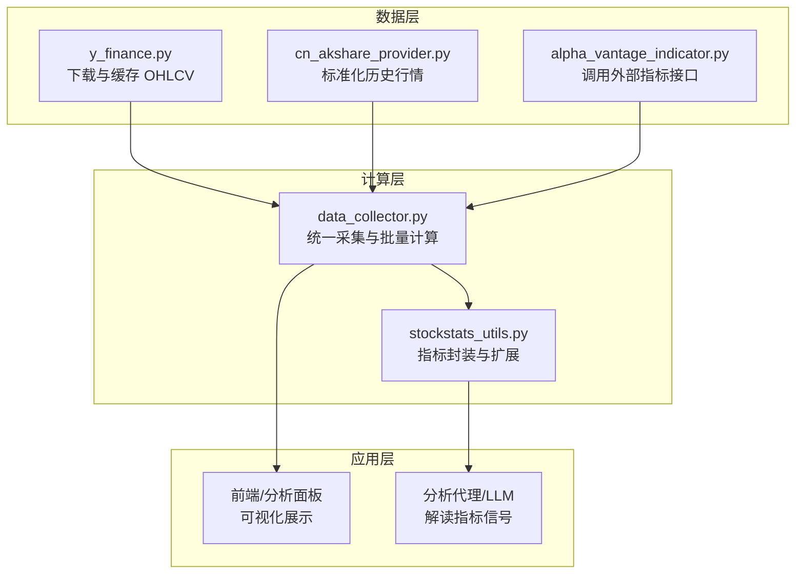
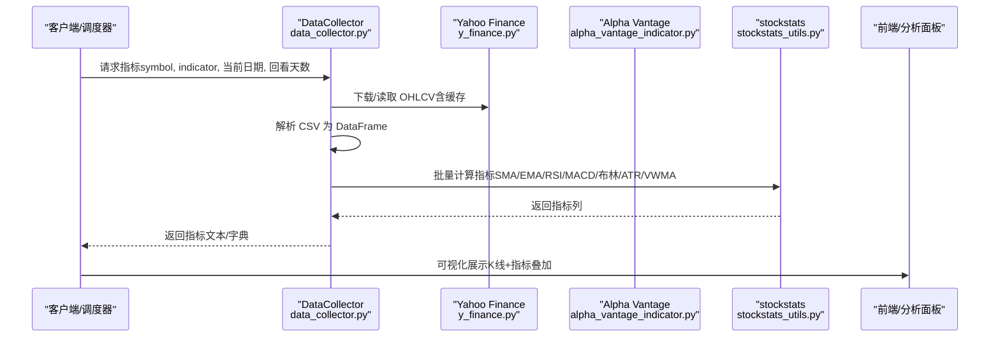
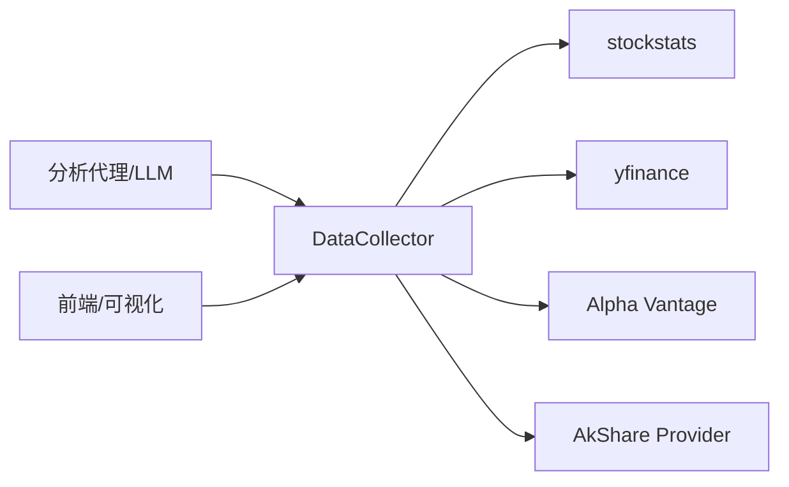

# 技术指标计算

<cite>
**本文引用的文件**
- [tradingagents/dataflows/alpha_vantage_indicator.py](file://tradingagents/dataflows/alpha_vantage_indicator.py)
- [tradingagents/dataflows/y_finance.py](file://tradingagents/dataflows/y_finance.py)
- [tradingagents/graph/data_collector.py](file://tradingagents/graph/data_collector.py)
- [tradingagents/dataflows/providers/cn_akshare_provider.py](file://tradingagents/dataflows/providers/cn_akshare_provider.py)
- [tradingagents/dataflows/stockstats_utils.py](file://tradingagents/dataflows/stockstats_utils.py)
</cite>

## 目录
1. [引言](#引言)
2. [项目结构](#项目结构)
3. [核心组件](#核心组件)
4. [架构总览](#架构总览)
5. [详细组件分析](#详细组件分析)
6. [依赖关系分析](#依赖关系分析)
7. [性能考量](#性能考量)
8. [故障排查指南](#故障排查指南)
9. [结论](#结论)
10. [附录](#附录)

## 引言
本文件面向 TradingAgents-AShare 的技术指标计算体系，系统梳理移动平均线（SMA/EMA）、RSI、MACD、布林带（Bollinger Bands）、ATR、VWMA 等经典指标的数学原理、参数配置、时间窗口选择与信号生成规则；并给出指标组合使用、交叉验证与风险管理策略；同时总结性能优化、缓存策略与批量计算方法，提供调试工具、可视化展示与自定义指标开发指南。

## 项目结构
技术指标相关能力主要分布在以下模块：
- 数据来源与标准化：Yahoo Finance、Alpha Vantage、AkShare 提供商
- 指标计算引擎：基于 stockstats 的本地计算与缓存
- 图表与窗口数据采集：统一拉取 OHLCV 并按窗口派生指标
- 参数与描述：中文指标说明与最佳实践提示

图表来源
- [tradingagents/dataflows/y_finance.py:43-273](file://tradingagents/dataflows/y_finance.py#L43-L273)
- [tradingagents/dataflows/alpha_vantage_indicator.py:1-150](file://tradingagents/dataflows/alpha_vantage_indicator.py#L1-L150)
- [tradingagents/graph/data_collector.py:1-43](file://tradingagents/graph/data_collector.py#L1-L43)
- [tradingagents/dataflows/providers/cn_akshare_provider.py:198-266](file://tradingagents/dataflows/providers/cn_akshare_provider.py#L198-L266)
- [tradingagents/dataflows/stockstats_utils.py](file://tradingagents/dataflows/stockstats_utils.py)

章节来源
- [tradingagents/dataflows/y_finance.py:43-273](file://tradingagents/dataflows/y_finance.py#L43-L273)
- [tradingagents/dataflows/alpha_vantage_indicator.py:1-150](file://tradingagents/dataflows/alpha_vantage_indicator.py#L1-L150)
- [tradingagents/graph/data_collector.py:1-43](file://tradingagents/graph/data_collector.py#L1-L43)
- [tradingagents/dataflows/providers/cn_akshare_provider.py:198-266](file://tradingagents/dataflows/providers/cn_akshare_provider.py#L198-L266)

## 核心组件
- 统一数据采集与窗口化：在一次拉取中获取 OHLCV，按窗口派生指标，减少重复请求与解析成本
- 本地指标计算：基于 stockstats 对 OHLCV 进行批量计算，支持 SMA/EMA/RSI/MACD/Bollinger/ATR/VWMA 等
- 外部指标接口：对部分指标（如 Alpha Vantage 的 MACD、RSI、BBANDS、ATR、SMA/EMA）进行直接调用
- 缓存策略：按股票与日期范围缓存原始数据 CSV，避免重复下载与解析
- 中文指标说明与最佳实践：为每个指标提供用途、阈值与注意事项，便于组合与交叉验证

章节来源
- [tradingagents/graph/data_collector.py:329-358](file://tradingagents/graph/data_collector.py#L329-L358)
- [tradingagents/dataflows/y_finance.py:193-273](file://tradingagents/dataflows/y_finance.py#L193-L273)
- [tradingagents/dataflows/alpha_vantage_indicator.py:30-150](file://tradingagents/dataflows/alpha_vantage_indicator.py#L30-L150)

## 架构总览
下图展示了从数据源到指标输出的关键流程：统一采集 → 解析与缓存 → 批量计算 → 信号解读与可视化。

图表来源
- [tradingagents/graph/data_collector.py:329-358](file://tradingagents/graph/data_collector.py#L329-L358)
- [tradingagents/dataflows/y_finance.py:193-273](file://tradingagents/dataflows/y_finance.py#L193-L273)
- [tradingagents/dataflows/alpha_vantage_indicator.py:1-150](file://tradingagents/dataflows/alpha_vantage_indicator.py#L1-L150)
- [tradingagents/dataflows/stockstats_utils.py](file://tradingagents/dataflows/stockstats_utils.py)

## 详细组件分析

### 移动平均线（SMA/EMA）
- 数学原理
  - SMA：N 日简单移动平均，对最近 N 个收盘价求算术平均
  - EMA：N 日指数移动平均，以平滑因子对近期价格赋予更高权重，对新信息反应更灵敏
- 参数配置
  - 短期：10 日 EMA
  - 中期：50 日 SMA
  - 长期：200 日 SMA
- 时间周期选择
  - 日线：SMA/EMA 作为趋势与支撑阻力参考
  - 结合：短期上穿长期形成“金叉”，死叉则可能转弱
- 信号生成规则
  - 价格站上均线：多头排列，偏多
  - 价格跌破均线：空头排列，偏空
  - 注意：EMA 更敏感，SMA 更稳定，建议组合使用
- 实现要点
  - 使用 stockstats 的 SMA/EMA 计算列
  - 在统一窗口内一次性计算，避免重复遍历

章节来源
- [tradingagents/dataflows/alpha_vantage_indicator.py:30-100](file://tradingagents/dataflows/alpha_vantage_indicator.py#L30-L100)
- [tradingagents/graph/data_collector.py:347-358](file://tradingagents/graph/data_collector.py#L347-L358)

### RSI（相对强弱指数）
- 数学原理
  - 衡量一定周期内上涨与下跌幅度的比率，典型周期 14 日
  - 常用阈值：超买 70，超卖 30；极端值（如 >80/<20）常伴随反转信号
- 参数配置
  - 周期：默认 14 日，可根据市场波动性调整（如 9/21）
- 时间周期选择
  - 日线：RSI 作为短期动量与超买超卖指示
  - 周线：RSI 作为中期趋势过滤器
- 信号生成规则
  - 顶背离：价格创新高但 RSI 不创新高 → 谨慎做多
  - 底背离：价格创新低但 RSI 不创新低 → 谨慎做空
  - 阈值穿越：上穿 30/下穿 70 作为中性信号，需结合趋势与成交量
- 实现要点
  - stockstats 提供 rsi_N 列
  - 与 MACD、布林带组合，降低假信号概率

章节来源
- [tradingagents/dataflows/alpha_vantage_indicator.py:122-129](file://tradingagents/dataflows/alpha_vantage_indicator.py#L122-L129)
- [tradingagents/graph/data_collector.py:347-358](file://tradingagents/graph/data_collector.py#L347-L358)

### MACD（异同移动平均线）
- 数学原理
  - 由快慢两条 EMA 的差值构成，再对差值做信号线平滑
  - 三元素：MACD 线、信号线、柱状图（两者的差值）
- 参数配置
  - 快线：12 日 EMA，慢线：26 日 EMA，信号线：9 日 EMA
- 时间周期选择
  - 日线：MACD 作为动量与趋势切换的主力指标
- 信号生成规则
  - 金叉/死叉：MACD 线上穿/下穿信号线
  - 柱状图：反映动量强弱，柱放大/缩小提示趋势动能变化
  - 背离：价格与 MACD 背离时注意趋势反转风险
- 实现要点
  - 使用 stockstats 的 macd 系列列
  - 与 RSI、布林带组合，提高穿越信号质量

章节来源
- [tradingagents/dataflows/alpha_vantage_indicator.py:101-121](file://tradingagents/dataflows/alpha_vantage_indicator.py#L101-L121)
- [tradingagents/graph/data_collector.py:347-358](file://tradingagents/graph/data_collector.py#L347-L358)

### 布林带（Bollinger Bands）
- 数学原理
  - 中轨：N 日 SMA（常用 20 日）
  - 上轨/下轨：中轨 ± K 倍标准差（常用 K=2）
- 参数配置
  - 中轨周期：20 日
  - 标准差倍数：2 倍
- 时间周期选择
  - 日线：用于判断突破、回踩与通道状态
- 信号生成规则
  - 突破上轨：偏多，但需结合动量与成交量
  - 突破下轨：偏空，同样需确认趋势强度
  - 收敛/扩张：布林收窄预示突破概率上升，扩张后回踩提供机会
- 实现要点
  - stockstats 提供 boll_ub/boll_lb 与中轨列
  - 与 RSI、MACD 协同，避免单轨信号误判

章节来源
- [tradingagents/dataflows/alpha_vantage_indicator.py:130-137](file://tradingagents/dataflows/alpha_vantage_indicator.py#L130-L137)
- [tradingagents/graph/data_collector.py:347-358](file://tradingagents/graph/data_collector.py#L347-L358)

### ATR（平均真实波幅）
- 数学原理
  - 衡量一定周期内的平均真实波幅，刻画波动率
- 参数配置
  - 周期：默认 14 日，可按策略波动目标调整
- 时间周期选择
  - 日线：用于动态止损与止盈设置
- 信号生成规则
  - 波动上升：扩大止损，降低仓位
  - 波动下降：收紧止损，提高效率
- 实现要点
  - stockstats 提供 atr 列
  - 与 VWMA、成交量比配合，避免在震荡市中频繁止损

章节来源
- [tradingagents/dataflows/alpha_vantage_indicator.py:138-144](file://tradingagents/dataflows/alpha_vantage_indicator.py#L138-L144)
- [tradingagents/graph/data_collector.py:347-358](file://tradingagents/graph/data_collector.py#L347-L358)

### VWMA（成交量加权移动平均）
- 数学原理
  - 将每日价格乘以当日成交量，累计后再除以累计成交量
- 参数配置
  - 周期：常用 20 日
- 时间周期选择
  - 日线：结合量价确认趋势有效性
- 信号生成规则
  - 价量齐升：趋势确认增强
  - 量缩价跌：警惕趋势衰竭
- 实现要点
  - Alpha Vantage 未提供直接 VWMA 接口，需基于 OHLCV 自行计算
  - 与 ATR、布林带组合，提升趋势与波动匹配度

章节来源
- [tradingagents/dataflows/alpha_vantage_indicator.py:145-148](file://tradingagents/dataflows/alpha_vantage_indicator.py#L145-L148)
- [tradingagents/graph/data_collector.py:347-358](file://tradingagents/graph/data_collector.py#L347-L358)

### 指标组合与交叉验证
- 组合策略
  - 趋势（SMA/EMA）+ 动量（RSI/MACD）+ 波动（ATR）+ 通道（布林）
  - 示例：MACD 金叉 + RSI 低位背离 + 布林收窄后突破 + ATR 放大
- 交叉验证
  - 多周期共振：日线趋势、小时线动量
  - 多指标一致：至少 2/3 指标给出相同方向信号
- 风险管理
  - 止损：ATR 动态止损；突破失败即止损
  - 止盈：布林上轨/下轨回踩；RSI 极端反转
  - 仓位：根据 ATR 设定风险敞口，避免固定手数

章节来源
- [tradingagents/dataflows/y_finance.py:62-142](file://tradingagents/dataflows/y_finance.py#L62-L142)
- [tradingagents/graph/data_collector.py:347-358](file://tradingagents/graph/data_collector.py#L347-L358)

### 外部指标接口（Alpha Vantage）
- 支持指标
  - SMA（50/200）、EMA（10）、MACD、MACD Signal、MACD Histogram、RSI、BBANDS、ATR、VWMA（说明：需自行计算）
- 调用方式
  - 按指标类型构造请求参数，返回 CSV 字符串
  - 解析为 DataFrame 后，按需提取目标列
- 注意事项
  - 部分指标（如 VWMA）无直接接口，需基于 OHLCV 计算
  - 指标系列类型（series_type）与周期参数需与接口要求一致

章节来源
- [tradingagents/dataflows/alpha_vantage_indicator.py:30-150](file://tradingagents/dataflows/alpha_vantage_indicator.py#L30-L150)

### 本地批量计算与缓存
- 批量计算
  - 一次性 wrap DataFrame，触发 stockstats 对所有列的计算
  - 计算映射：SMA/EMA/RSI/MACD/布林/ATR/VWMA
- 缓存策略
  - 以股票与日期范围命名 CSV 文件，首次下载后本地缓存
  - 读取缓存时自动转换日期格式，避免重复网络请求
- 性能优化
  - 单次拉取 + 单次解析 + 多指标计算，减少 IO 与重复计算
  - 线程池并发执行任务，降低等待时间

章节来源
- [tradingagents/graph/data_collector.py:329-358](file://tradingagents/graph/data_collector.py#L329-L358)
- [tradingagents/dataflows/y_finance.py:193-273](file://tradingagents/dataflows/y_finance.py#L193-L273)

### 数据标准化与窗口化
- 数据标准化
  - 统一列名（Date/Open/High/Low/Close/Volume），数值类型转换与缺失值处理
  - 支持 AkShare 等多数据源的历史数据规范化
- 窗口化
  - 以当前交易日为基准，向前回看指定天数
  - 仅保留 OHLCV 必备列，确保指标计算稳定性

章节来源
- [tradingagents/dataflows/providers/cn_akshare_provider.py:198-266](file://tradingagents/dataflows/providers/cn_akshare_provider.py#L198-L266)
- [tradingagents/graph/data_collector.py:42-43](file://tradingagents/graph/data_collector.py#L42-L43)

## 依赖关系分析
- 组件耦合
  - DataCollector 依赖 y_finance 与 stockstats，负责统一采集与批量计算
  - Alpha Vantage 指标接口作为补充，覆盖部分 stockstats 未提供的指标
  - AkShare 提供历史数据标准化，保障多数据源一致性
- 外部依赖
  - stockstats：核心指标计算引擎
  - yfinance：在线/离线数据下载与缓存
  - pandas/numpy：数据结构与数值计算

图表来源
- [tradingagents/graph/data_collector.py:1-43](file://tradingagents/graph/data_collector.py#L1-L43)
- [tradingagents/dataflows/y_finance.py:43-273](file://tradingagents/dataflows/y_finance.py#L43-L273)
- [tradingagents/dataflows/alpha_vantage_indicator.py:1-150](file://tradingagents/dataflows/alpha_vantage_indicator.py#L1-L150)
- [tradingagents/dataflows/providers/cn_akshare_provider.py:198-266](file://tradingagents/dataflows/providers/cn_akshare_provider.py#L198-L266)

## 性能考量
- 批量计算优先：wrap DataFrame 后一次性计算多个指标，避免逐列重复计算
- 缓存命中：按股票与日期范围缓存 CSV，显著降低重复下载与解析成本
- 并发控制：限制线程池大小，避免被反爬/限流
- 内存与 IO：仅加载必要列，及时丢弃中间列，减少内存占用
- 网络与 API：优先使用本地计算，必要时才调用外部接口

章节来源
- [tradingagents/graph/data_collector.py:329-358](file://tradingagents/graph/data_collector.py#L329-L358)
- [tradingagents/dataflows/y_finance.py:224-256](file://tradingagents/dataflows/y_finance.py#L224-L256)

## 故障排查指南
- 指标缺失或为空
  - 检查 OHLCV 是否完整（日期、开盘、最高、最低、收盘、成交量）
  - 确认回看天数是否足够（如布林需要至少 20 日，ATR/RSI 需要至少 14 日）
- 外部接口错误
  - Alpha Vantage：确认指标类型与参数（series_type、time_period）正确
  - 无直接 VWMA：按 OHLCV 自行计算或改用 stockstats 的 vwma 列
- 缓存问题
  - 清理过期缓存文件，重新下载并写入
  - 检查缓存目录权限与磁盘空间
- 性能瓶颈
  - 减少并发线程数，避免被限流
  - 合理设置回看窗口，避免过大导致内存压力

章节来源
- [tradingagents/dataflows/alpha_vantage_indicator.py:60-70](file://tradingagents/dataflows/alpha_vantage_indicator.py#L60-L70)
- [tradingagents/dataflows/y_finance.py:211-223](file://tradingagents/dataflows/y_finance.py#L211-L223)
- [tradingagents/graph/data_collector.py:329-358](file://tradingagents/graph/data_collector.py#L329-L358)

## 结论
本系统通过统一的数据采集、标准化与本地批量计算，实现了 SMA/EMA、RSI、MACD、布林带、ATR、VWMA 等指标的高效、稳定与可复用。结合中文指标说明与最佳实践，有助于构建稳健的信号生成与风险管理流程。建议在实际应用中持续优化缓存与并发策略，并加强指标组合与交叉验证机制。

## 附录

### 指标参数与信号速查
- 移动平均线：短期（10 EMA）、中期（50 SMA）、长期（200 SMA）
- RSI：周期 14，阈值 70/30，关注背离
- MACD：快线 12、慢线 26、信号 9，关注金叉/死叉与柱状图
- 布林带：周期 20，倍数 2，关注突破与回踩
- ATR：周期 14，用于动态止损与止盈
- VWMA：周期 20，结合量价确认趋势

章节来源
- [tradingagents/dataflows/alpha_vantage_indicator.py:30-150](file://tradingagents/dataflows/alpha_vantage_indicator.py#L30-L150)
- [tradingagents/dataflows/y_finance.py:62-142](file://tradingagents/dataflows/y_finance.py#L62-L142)