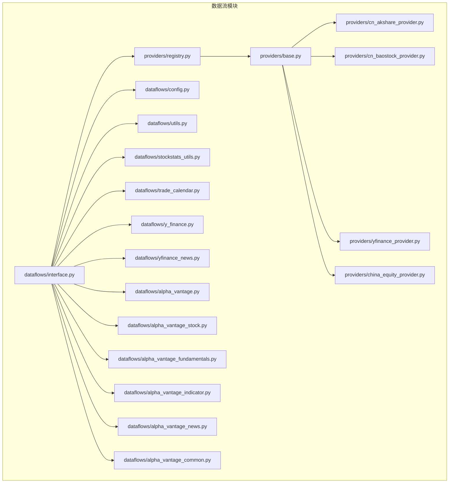
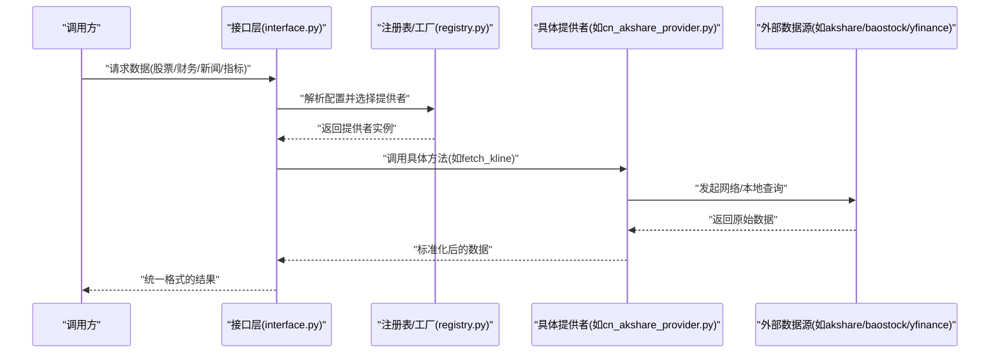
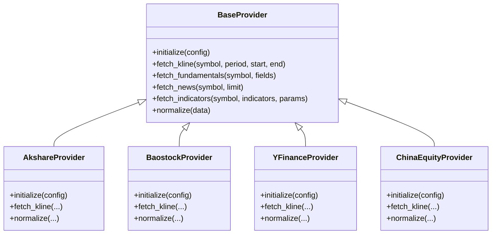
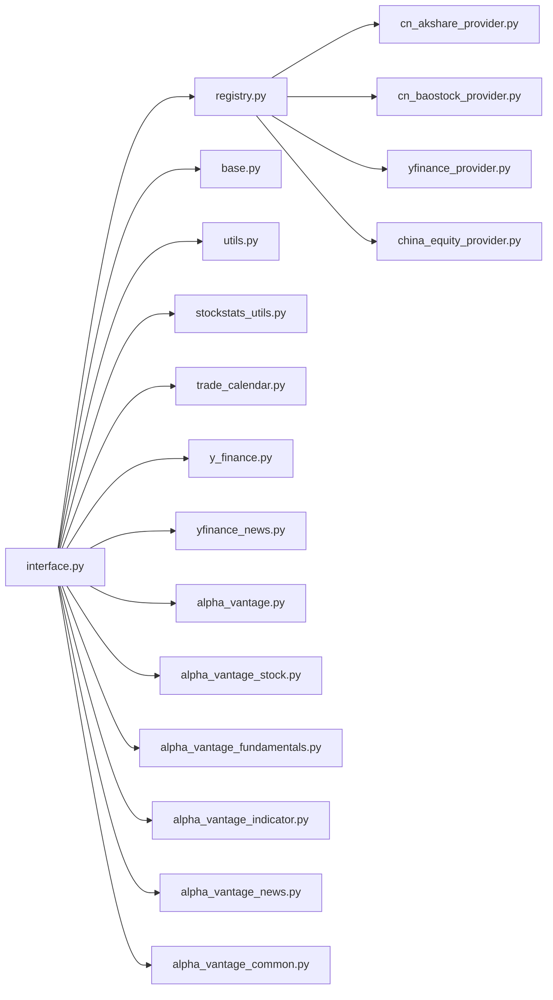

# 数据处理系统

<cite>
**本文引用的文件**
- [providers/base.py](file://tradingagents/dataflows/providers/base.py)
- [providers/registry.py](file://tradingagents/dataflows/providers/registry.py)
- [providers/cn_akshare_provider.py](file://tradingagents/dataflows/providers/cn_akshare_provider.py)
- [providers/cn_baostock_provider.py](file://tradingagents/dataflows/providers/cn_baostock_provider.py)
- [providers/yfinance_provider.py](file://tradingagents/dataflows/providers/yfinance_provider.py)
- [providers/china_equity_provider.py](file://tradingagents/dataflows/providers/china_equity_provider.py)
- [dataflows/config.py](file://tradingagents/dataflows/config.py)
- [dataflows/interface.py](file://tradingagents/dataflows/interface.py)
- [dataflows/utils.py](file://tradingagents/dataflows/utils.py)
- [dataflows/stockstats_utils.py](file://tradingagents/dataflows/stockstats_utils.py)
- [dataflows/trade_calendar.py](file://tradingagents/dataflows/trade_calendar.py)
- [dataflows/y_finance.py](file://tradingagents/dataflows/y_finance.py)
- [dataflows/yfinance_news.py](file://tradingagents/dataflows/yfinance_news.py)
- [dataflows/alpha_vantage.py](file://tradingagents/dataflows/alpha_vantage.py)
- [dataflows/alpha_vantage_stock.py](file://tradingagents/dataflows/alpha_vantage_stock.py)
- [dataflows/alpha_vantage_fundamentals.py](file://tradingagents/dataflows/alpha_vantage_fundamentals.py)
- [dataflows/alpha_vantage_indicator.py](file://tradingagents/dataflows/alpha_vantage_indicator.py)
- [dataflows/alpha_vantage_news.py](file://tradingagents/dataflows/alpha_vantage_news.py)
- [dataflows/alpha_vantage_common.py](file://tradingagents/dataflows/alpha_vantage_common.py)
- [tests/test_data_collector.py](file://tests/test_data_collector.py)
</cite>

## 目录
1. [简介](#简介)
2. [项目结构](#项目结构)
3. [核心组件](#核心组件)
4. [架构总览](#架构总览)
5. [详细组件分析](#详细组件分析)
6. [依赖关系分析](#依赖关系分析)
7. [性能考虑](#性能考虑)
8. [故障排除指南](#故障排除指南)
9. [结论](#结论)
10. [附录](#附录)

## 简介
本文件面向TradingAgents-AShare的数据处理系统，聚焦于数据流架构、多数据源集成与数据处理管道设计。系统通过统一接口抽象不同数据提供商（如akshare、baostock、yfinance、Alpha Vantage），实现跨市场的股票行情、财务、新闻与技术指标数据的采集、转换与质量控制。文档同时覆盖缓存策略、错误处理、性能优化与扩展新数据源的方法，并提供监控、日志与故障排除建议。

## 项目结构
数据处理系统主要位于tradingagents/dataflows目录下，采用“提供者注册表 + 抽象基类 + 具体提供者”的分层组织方式；同时包含通用工具、指标计算与交易日历等支撑模块。测试用例集中在tests目录，验证数据采集器行为。

图表来源
- [providers/registry.py](file://tradingagents/dataflows/providers/registry.py)
- [providers/base.py](file://tradingagents/dataflows/providers/base.py)
- [providers/cn_akshare_provider.py](file://tradingagents/dataflows/providers/cn_akshare_provider.py)
- [providers/cn_baostock_provider.py](file://tradingagents/dataflows/providers/cn_baostock_provider.py)
- [providers/yfinance_provider.py](file://tradingagents/dataflows/providers/yfinance_provider.py)
- [providers/china_equity_provider.py](file://tradingagents/dataflows/providers/china_equity_provider.py)
- [dataflows/interface.py](file://tradingagents/dataflows/interface.py)
- [dataflows/config.py](file://tradingagents/dataflows/config.py)
- [dataflows/utils.py](file://tradingagents/dataflows/utils.py)
- [dataflows/stockstats_utils.py](file://tradingagents/dataflows/stockstats_utils.py)
- [dataflows/trade_calendar.py](file://tradingagents/dataflows/trade_calendar.py)
- [dataflows/y_finance.py](file://tradingagents/dataflows/y_finance.py)
- [dataflows/yfinance_news.py](file://tradingagents/dataflows/yfinance_news.py)
- [dataflows/alpha_vantage.py](file://tradingagents/dataflows/alpha_vantage.py)
- [dataflows/alpha_vantage_stock.py](file://tradingagents/dataflows/alpha_vantage_stock.py)
- [dataflows/alpha_vantage_fundamentals.py](file://tradingagents/dataflows/alpha_vantage_fundamentals.py)
- [dataflows/alpha_vantage_indicator.py](file://tradingagents/dataflows/alpha_vantage_indicator.py)
- [dataflows/alpha_vantage_news.py](file://tradingagents/dataflows/alpha_vantage_news.py)
- [dataflows/alpha_vantage_common.py](file://tradingagents/dataflows/alpha_vantage_common.py)

章节来源
- [providers/registry.py](file://tradingagents/dataflows/providers/registry.py)
- [providers/base.py](file://tradingagents/dataflows/providers/base.py)
- [dataflows/interface.py](file://tradingagents/dataflows/interface.py)
- [dataflows/config.py](file://tradingagents/dataflows/config.py)

## 核心组件
- 提供者抽象与注册表：通过抽象基类定义统一接口，注册表负责提供者实例化与路由选择，便于扩展新数据源。
- 接口适配层：对外暴露统一的数据访问接口，屏蔽底层提供者的差异性。
- 工具与支撑：通用数据处理工具、技术指标工具、交易日历与缓存辅助等。
- Alpha Vantage与yfinance专用模块：分别封装对应提供商的股票、财务、新闻与指标数据的获取逻辑。

章节来源
- [providers/base.py](file://tradingagents/dataflows/providers/base.py)
- [providers/registry.py](file://tradingagents/dataflows/providers/registry.py)
- [dataflows/interface.py](file://tradingagents/dataflows/interface.py)
- [dataflows/utils.py](file://tradingagents/dataflows/utils.py)
- [dataflows/stockstats_utils.py](file://tradingagents/dataflows/stockstats_utils.py)
- [dataflows/trade_calendar.py](file://tradingagents/dataflows/trade_calendar.py)
- [dataflows/y_finance.py](file://tradingagents/dataflows/y_finance.py)
- [dataflows/yfinance_news.py](file://tradingagents/dataflows/yfinance_news.py)
- [dataflows/alpha_vantage.py](file://tradingagents/dataflows/alpha_vantage.py)
- [dataflows/alpha_vantage_stock.py](file://tradingagents/dataflows/alpha_vantage_stock.py)
- [dataflows/alpha_vantage_fundamentals.py](file://tradingagents/dataflows/alpha_vantage_fundamentals.py)
- [dataflows/alpha_vantage_indicator.py](file://tradingagents/dataflows/alpha_vantage_indicator.py)
- [dataflows/alpha_vantage_news.py](file://tradingagents/dataflows/alpha_vantage_news.py)
- [dataflows/alpha_vantage_common.py](file://tradingagents/dataflows/alpha_vantage_common.py)

## 架构总览
系统以“接口层 -> 注册表/工厂 -> 提供者实现 -> 外部数据源”的分层模式组织。接口层负责参数校验、任务编排与结果聚合；注册表根据配置选择具体提供者；提供者实现各自的数据获取与转换逻辑；外部数据源包括akshare、baostock、yfinance以及Alpha Vantage。

图表来源
- [dataflows/interface.py](file://tradingagents/dataflows/interface.py)
- [providers/registry.py](file://tradingagents/dataflows/providers/registry.py)
- [providers/cn_akshare_provider.py](file://tradingagents/dataflows/providers/cn_akshare_provider.py)
- [providers/cn_baostock_provider.py](file://tradingagents/dataflows/providers/cn_baostock_provider.py)
- [providers/yfinance_provider.py](file://tradingagents/dataflows/providers/yfinance_provider.py)

## 详细组件分析

### 提供者抽象与注册表
- 抽象基类定义统一接口，确保各提供者实现一致的生命周期与方法签名，便于替换与扩展。
- 注册表负责基于配置选择提供者实例，支持按市场/类型路由到不同实现。

图表来源
- [providers/base.py](file://tradingagents/dataflows/providers/base.py)
- [providers/cn_akshare_provider.py](file://tradingagents/dataflows/providers/cn_akshare_provider.py)
- [providers/cn_baostock_provider.py](file://tradingagents/dataflows/providers/cn_baostock_provider.py)
- [providers/yfinance_provider.py](file://tradingagents/dataflows/providers/yfinance_provider.py)
- [providers/china_equity_provider.py](file://tradingagents/dataflows/providers/china_equity_provider.py)

章节来源
- [providers/base.py](file://tradingagents/dataflows/providers/base.py)
- [providers/registry.py](file://tradingagents/dataflows/providers/registry.py)

### 接口层与数据流编排
- 接口层负责接收上层请求，解析参数，调用注册表选择提供者，并对结果进行统一标准化与聚合。
- 支持多数据源并行或串行组合，依据配置决定优先级与回退策略。

章节来源
- [dataflows/interface.py](file://tradingagents/dataflows/interface.py)
- [dataflows/config.py](file://tradingagents/dataflows/config.py)

### 数据获取策略与缓存机制
- 缓存策略：在接口层或提供者层实现短期缓存，避免重复请求；结合交易日历与周期参数，仅在必要时刷新。
- 获取策略：按需拉取（增量）、批量拉取（历史回测）与实时订阅（待实现）相结合；对失败重试与指数退避策略进行控制。

章节来源
- [dataflows/interface.py](file://tradingagents/dataflows/interface.py)
- [dataflows/utils.py](file://tradingagents/dataflows/utils.py)
- [dataflows/trade_calendar.py](file://tradingagents/dataflows/trade_calendar.py)

### 错误处理流程
- 异常捕获：在网络请求、解析与标准化阶段均设置异常捕获与分类。
- 回退与降级：当主数据源不可用时，自动切换至备用提供者；若仍失败，返回空值或抛出可识别的业务异常。
- 日志记录：在关键节点输出结构化日志，便于追踪与审计。

章节来源
- [dataflows/interface.py](file://tradingagents/dataflows/interface.py)
- [providers/base.py](file://tradingagents/dataflows/providers/base.py)

### 技术指标计算与数据转换
- 指标计算：通过独立工具模块封装常用技术指标，支持多周期与多标的批量计算。
- 数据转换：提供标准化字段映射与单位换算，保证跨数据源一致性。

章节来源
- [dataflows/stockstats_utils.py](file://tradingagents/dataflows/stockstats_utils.py)
- [dataflows/utils.py](file://tradingagents/dataflows/utils.py)

### Alpha Vantage与yfinance专用模块
- Alpha Vantage：分别针对股票、财务、新闻与指标提供独立模块，统一入口由接口层调度。
- yfinance：封装股票与新闻数据获取，结合本地缓存与交易日历，减少无效请求。

章节来源
- [dataflows/alpha_vantage.py](file://tradingagents/dataflows/alpha_vantage.py)
- [dataflows/alpha_vantage_stock.py](file://tradingagents/dataflows/alpha_vantage_stock.py)
- [dataflows/alpha_vantage_fundamentals.py](file://tradingagents/dataflows/alpha_vantage_fundamentals.py)
- [dataflows/alpha_vantage_indicator.py](file://tradingagents/dataflows/alpha_vantage_indicator.py)
- [dataflows/alpha_vantage_news.py](file://tradingagents/dataflows/alpha_vantage_news.py)
- [dataflows/alpha_vantage_common.py](file://tradingagents/dataflows/alpha_vantage_common.py)
- [dataflows/y_finance.py](file://tradingagents/dataflows/y_finance.py)
- [dataflows/yfinance_news.py](file://tradingagents/dataflows/yfinance_news.py)

### 数据质量控制
- 字段完整性：对关键字段进行非空与范围检查。
- 时间序列一致性：按交易日补齐缺失日期，避免跨市场时间差导致的错位。
- 去重与合并：对重复数据进行去重，合并多源数据时采用权重或置信度策略。

章节来源
- [dataflows/utils.py](file://tradingagents/dataflows/utils.py)
- [dataflows/trade_calendar.py](file://tradingagents/dataflows/trade_calendar.py)

### 扩展新数据源的方法
- 实现抽象基类：遵循统一接口，完成初始化与数据获取方法。
- 注册与路由：在注册表中登记新提供者，配置默认路由与优先级。
- 单元测试：编写针对性测试用例，覆盖正常路径与异常路径。

章节来源
- [providers/base.py](file://tradingagents/dataflows/providers/base.py)
- [providers/registry.py](file://tradingagents/dataflows/providers/registry.py)
- [tests/test_data_collector.py](file://tests/test_data_collector.py)

## 依赖关系分析
- 耦合与内聚：接口层与提供者实现松耦合，通过抽象基类与注册表解耦；提供者内部高内聚，职责单一。
- 外部依赖：依赖akshare、baostock、yfinance与Alpha Vantage等第三方库；通过统一接口屏蔽版本差异。
- 循环依赖：未见循环导入；模块间通过接口层间接通信。

图表来源
- [dataflows/interface.py](file://tradingagents/dataflows/interface.py)
- [providers/registry.py](file://tradingagents/dataflows/providers/registry.py)
- [providers/base.py](file://tradingagents/dataflows/providers/base.py)
- [providers/cn_akshare_provider.py](file://tradingagents/dataflows/providers/cn_akshare_provider.py)
- [providers/cn_baostock_provider.py](file://tradingagents/dataflows/providers/cn_baostock_provider.py)
- [providers/yfinance_provider.py](file://tradingagents/dataflows/providers/yfinance_provider.py)
- [providers/china_equity_provider.py](file://tradingagents/dataflows/providers/china_equity_provider.py)
- [dataflows/utils.py](file://tradingagents/dataflows/utils.py)
- [dataflows/stockstats_utils.py](file://tradingagents/dataflows/stockstats_utils.py)
- [dataflows/trade_calendar.py](file://tradingagents/dataflows/trade_calendar.py)
- [dataflows/y_finance.py](file://tradingagents/dataflows/y_finance.py)
- [dataflows/yfinance_news.py](file://tradingagents/dataflows/yfinance_news.py)
- [dataflows/alpha_vantage.py](file://tradingagents/dataflows/alpha_vantage.py)
- [dataflows/alpha_vantage_stock.py](file://tradingagents/dataflows/alpha_vantage_stock.py)
- [dataflows/alpha_vantage_fundamentals.py](file://tradingagents/dataflows/alpha_vantage_fundamentals.py)
- [dataflows/alpha_vantage_indicator.py](file://tradingagents/dataflows/alpha_vantage_indicator.py)
- [dataflows/alpha_vantage_news.py](file://tradingagents/dataflows/alpha_vantage_news.py)
- [dataflows/alpha_vantage_common.py](file://tradingagents/dataflows/alpha_vantage_common.py)

章节来源
- [providers/registry.py](file://tradingagents/dataflows/providers/registry.py)
- [providers/base.py](file://tradingagents/dataflows/providers/base.py)
- [dataflows/interface.py](file://tradingagents/dataflows/interface.py)

## 性能考虑
- 并发与批处理：对多标的/多周期请求采用并发拉取与批处理，降低总延迟。
- 缓存与预热：热点数据与历史数据建立缓存，启动时预热常用键，减少冷启动开销。
- 请求节流：对第三方API设置速率限制与指数退避，避免触发限流。
- 内存与序列化：对大数据集进行分页与流式处理，减少内存峰值；使用高效序列化格式存储中间结果。

## 故障排除指南
- 常见问题定位
  - 网络超时/连接失败：检查代理与DNS配置，确认防火墙放行；启用重试与熔断。
  - 数据为空/不完整：核对时间区间与交易日历，确认字段映射是否正确。
  - 指标计算异常：检查输入数据长度与缺失值，确认周期参数与平滑窗口。
- 日志与监控
  - 在接口层与提供者层增加结构化日志，记录请求参数、耗时与错误码。
  - 对关键路径埋点，统计成功率、P95/P99延迟与重试次数。
- 回滚与降级
  - 主数据源故障时自动切换备用提供者；若仍失败，返回空结果并告警。

章节来源
- [dataflows/interface.py](file://tradingagents/dataflows/interface.py)
- [providers/base.py](file://tradingagents/dataflows/providers/base.py)

## 结论
该数据处理系统通过抽象基类与注册表实现了多数据源的统一接入，配合接口层的编排能力与工具模块的标准化处理，形成从采集、转换到质量控制的完整管道。系统具备良好的扩展性与稳定性，适合在多市场、多维度数据场景下持续演进。

## 附录
- 配置项参考
  - 数据源选择与优先级
  - 缓存开关与过期策略
  - 并发数与批大小
  - 指标计算参数与窗口
- 测试建议
  - 单元测试覆盖正常/异常路径
  - 集成测试覆盖多数据源回退
  - 压力测试评估并发与缓存命中率