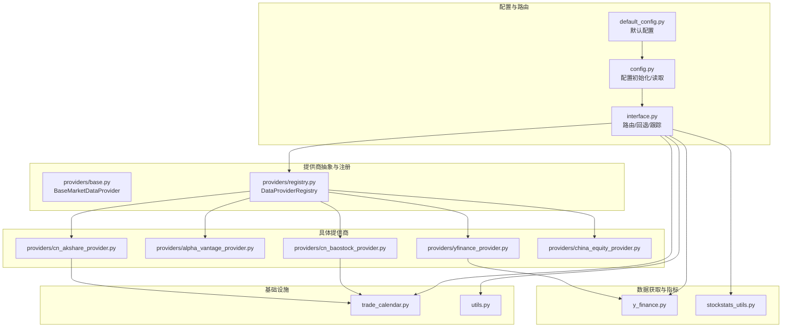
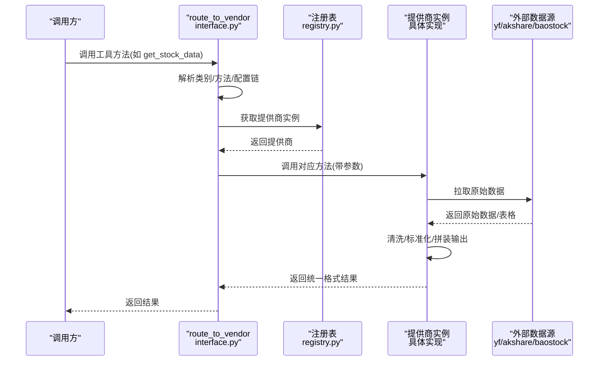
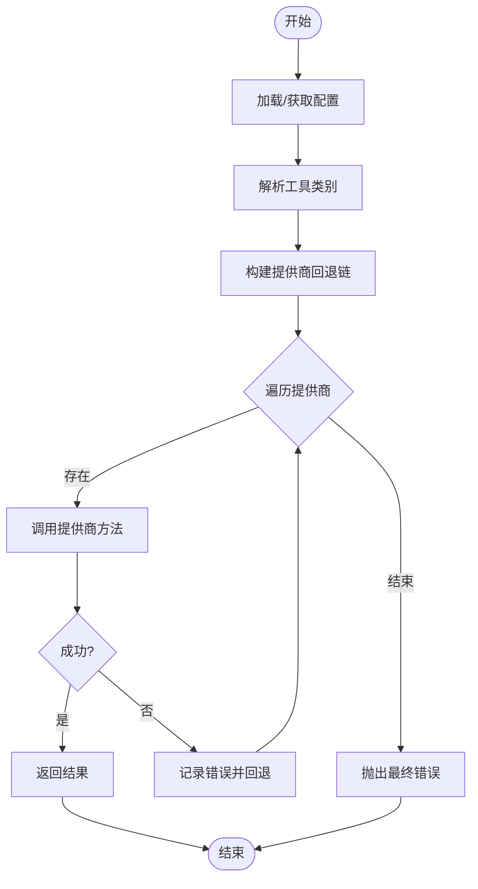
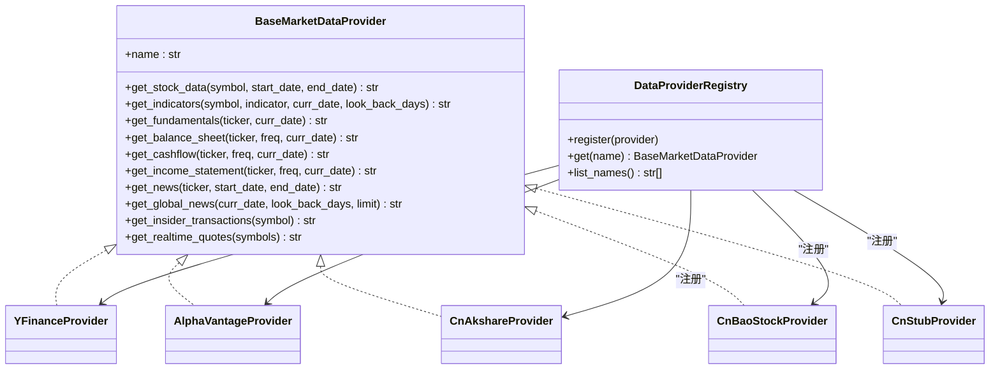
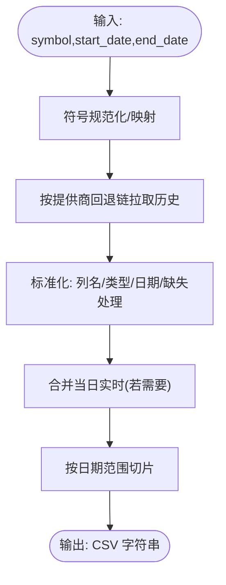
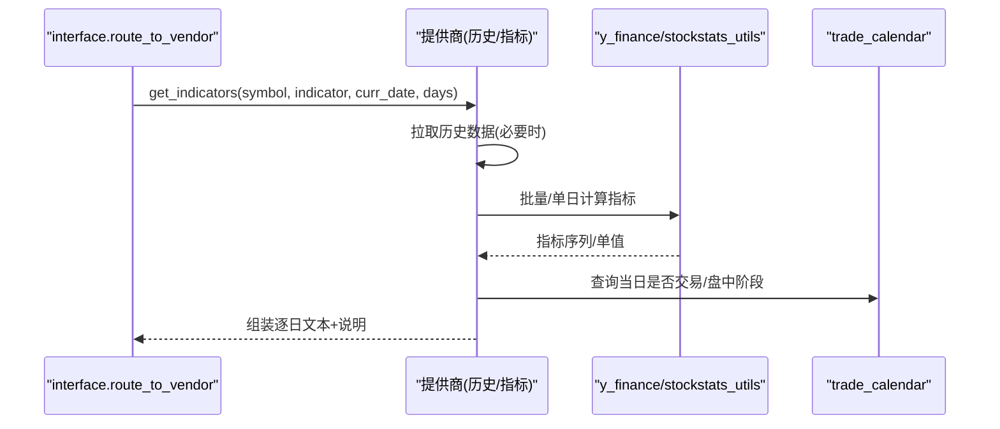
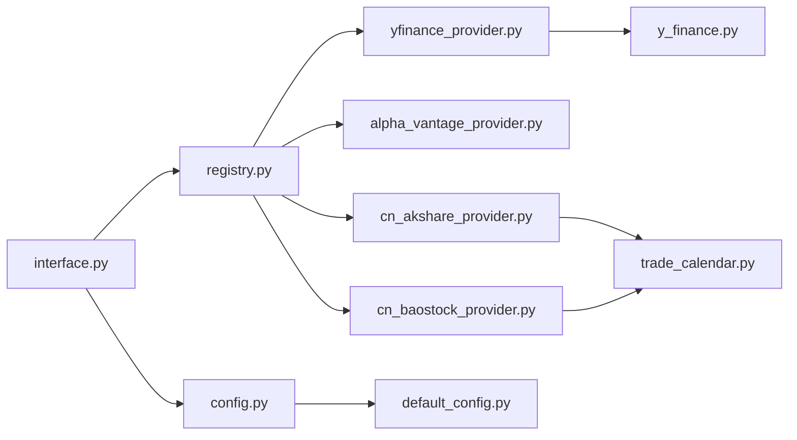

# 数据流管道

<cite>
**本文引用的文件**
- [tradingagents/dataflows/config.py](file://tradingagents/dataflows/config.py)
- [tradingagents/dataflows/interface.py](file://tradingagents/dataflows/interface.py)
- [tradingagents/dataflows/providers/base.py](file://tradingagents/dataflows/providers/base.py)
- [tradingagents/dataflows/providers/registry.py](file://tradingagents/dataflows/providers/registry.py)
- [tradingagents/dataflows/providers/yfinance_provider.py](file://tradingagents/dataflows/providers/yfinance_provider.py)
- [tradingagents/dataflows/providers/alpha_vantage_provider.py](file://tradingagents/dataflows/providers/alpha_vantage_provider.py)
- [tradingagents/dataflows/providers/china_equity_provider.py](file://tradingagents/dataflows/providers/china_equity_provider.py)
- [tradingagents/dataflows/providers/cn_akshare_provider.py](file://tradingagents/dataflows/providers/cn_akshare_provider.py)
- [tradingagents/dataflows/providers/cn_baostock_provider.py](file://tradingagents/dataflows/providers/cn_baostock_provider.py)
- [tradingagents/dataflows/y_finance.py](file://tradingagents/dataflows/y_finance.py)
- [tradingagents/dataflows/stockstats_utils.py](file://tradingagents/dataflows/stockstats_utils.py)
- [tradingagents/dataflows/trade_calendar.py](file://tradingagents/dataflows/trade_calendar.py)
- [tradingagents/dataflows/utils.py](file://tradingagents/dataflows/utils.py)
- [tradingagents/default_config.py](file://tradingagents/default_config.py)
</cite>

## 目录
1. [引言](#引言)
2. [项目结构](#项目结构)
3. [核心组件](#核心组件)
4. [架构总览](#架构总览)
5. [详细组件分析](#详细组件分析)
6. [依赖分析](#依赖分析)
7. [性能考虑](#性能考虑)
8. [故障排除指南](#故障排除指南)
9. [结论](#结论)
10. [附录](#附录)

## 引言
本文件面向 TradingAgents-AShare 的“数据流管道”子系统，系统性梳理从数据获取、转换、验证到路由与回退的整体流程，覆盖多数据源提供商（AkShare、BaoStock、YFinance、AlphaVantage）的统一抽象、配置驱动的路由与回退、A 股交易日历与实时行情处理、技术指标计算与数据标准化、以及可观测性与性能优化策略。文档同时提供可视化图示与分层讲解，帮助读者快速理解并高效维护与扩展数据流。

## 项目结构
数据流管道位于 tradingagents/dataflows 目录，围绕“配置中心 + 抽象接口 + 提供商注册表 + 具体提供商实现 + 工具函数”的层次化组织展开。核心模块包括：
- 配置与路由：config.py、default_config.py、interface.py
- 提供商抽象与注册：providers/base.py、providers/registry.py
- 具体提供商：providers/yfinance_provider.py、providers/alpha_vantage_provider.py、providers/cn_akshare_provider.py、providers/cn_baostock_provider.py、providers/china_equity_provider.py
- 数据获取与指标：y_finance.py、stockstats_utils.py
- 交易日历与通用工具：trade_calendar.py、utils.py

图表来源
- [tradingagents/dataflows/config.py:1-32](file://tradingagents/dataflows/config.py#L1-L32)
- [tradingagents/default_config.py:1-43](file://tradingagents/default_config.py#L1-L43)
- [tradingagents/dataflows/interface.py:1-181](file://tradingagents/dataflows/interface.py#L1-L181)
- [tradingagents/dataflows/providers/base.py:1-67](file://tradingagents/dataflows/providers/base.py#L1-L67)
- [tradingagents/dataflows/providers/registry.py:1-35](file://tradingagents/dataflows/providers/registry.py#L1-L35)
- [tradingagents/dataflows/providers/yfinance_provider.py:1-64](file://tradingagents/dataflows/providers/yfinance_provider.py#L1-L64)
- [tradingagents/dataflows/providers/alpha_vantage_provider.py:1-57](file://tradingagents/dataflows/providers/alpha_vantage_provider.py#L1-L57)
- [tradingagents/dataflows/providers/cn_akshare_provider.py:1-800](file://tradingagents/dataflows/providers/cn_akshare_provider.py#L1-L800)
- [tradingagents/dataflows/providers/cn_baostock_provider.py:1-209](file://tradingagents/dataflows/providers/cn_baostock_provider.py#L1-L209)
- [tradingagents/dataflows/providers/china_equity_provider.py:1-55](file://tradingagents/dataflows/providers/china_equity_provider.py#L1-L55)
- [tradingagents/dataflows/y_finance.py:1-479](file://tradingagents/dataflows/y_finance.py#L1-L479)
- [tradingagents/dataflows/stockstats_utils.py:1-68](file://tradingagents/dataflows/stockstats_utils.py#L1-L68)
- [tradingagents/dataflows/trade_calendar.py:1-119](file://tradingagents/dataflows/trade_calendar.py#L1-L119)
- [tradingagents/dataflows/utils.py:1-40](file://tradingagents/dataflows/utils.py#L1-L40)

章节来源
- [tradingagents/dataflows/config.py:1-32](file://tradingagents/dataflows/config.py#L1-L32)
- [tradingagents/default_config.py:1-43](file://tradingagents/default_config.py#L1-L43)
- [tradingagents/dataflows/interface.py:1-181](file://tradingagents/dataflows/interface.py#L1-L181)
- [tradingagents/dataflows/providers/base.py:1-67](file://tradingagents/dataflows/providers/base.py#L1-L67)
- [tradingagents/dataflows/providers/registry.py:1-35](file://tradingagents/dataflows/providers/registry.py#L1-L35)

## 核心组件
- 配置中心：负责默认配置加载、环境变量覆盖、全局配置读取与更新，确保路由与回退策略可配置。
- 路由与回退：根据工具类别与方法名解析目标提供商，构建回退链，逐个尝试调用，遇到限流/未实现/解析错误等即回退。
- 抽象接口与注册表：定义统一的提供商接口，集中注册各提供商，便于扩展与替换。
- 多提供商实现：AkShare（A 股历史/实时/新闻/财务）、BaoStock（A 股历史）、YFinance（全球数据/指标/财务/新闻）、AlphaVantage（部分指标/财务/新闻）。
- 指标与数据标准化：统一输出 CSV/Markdown/JSON 字符串，标准化列名与数值类型，处理缺失与异常。
- 交易日历与实时：A 股交易日判定、盘中阶段判断、实时行情合并与缓存、无数据原因说明。

章节来源
- [tradingagents/dataflows/config.py:1-32](file://tradingagents/dataflows/config.py#L1-L32)
- [tradingagents/default_config.py:1-43](file://tradingagents/default_config.py#L1-L43)
- [tradingagents/dataflows/interface.py:1-181](file://tradingagents/dataflows/interface.py#L1-L181)
- [tradingagents/dataflows/providers/base.py:1-67](file://tradingagents/dataflows/providers/base.py#L1-L67)
- [tradingagents/dataflows/providers/registry.py:1-35](file://tradingagents/dataflows/providers/registry.py#L1-L35)
- [tradingagents/dataflows/providers/yfinance_provider.py:1-64](file://tradingagents/dataflows/providers/yfinance_provider.py#L1-L64)
- [tradingagents/dataflows/providers/alpha_vantage_provider.py:1-57](file://tradingagents/dataflows/providers/alpha_vantage_provider.py#L1-L57)
- [tradingagents/dataflows/providers/cn_akshare_provider.py:1-800](file://tradingagents/dataflows/providers/cn_akshare_provider.py#L1-L800)
- [tradingagents/dataflows/providers/cn_baostock_provider.py:1-209](file://tradingagents/dataflows/providers/cn_baostock_provider.py#L1-L209)
- [tradingagents/dataflows/providers/china_equity_provider.py:1-55](file://tradingagents/dataflows/providers/china_equity_provider.py#L1-L55)
- [tradingagents/dataflows/y_finance.py:1-479](file://tradingagents/dataflows/y_finance.py#L1-L479)
- [tradingagents/dataflows/stockstats_utils.py:1-68](file://tradingagents/dataflows/stockstats_utils.py#L1-L68)
- [tradingagents/dataflows/trade_calendar.py:1-119](file://tradingagents/dataflows/trade_calendar.py#L1-L119)
- [tradingagents/dataflows/utils.py:1-40](file://tradingagents/dataflows/utils.py#L1-L40)

## 架构总览
数据流从“工具方法调用”进入，经“路由与回退”选择合适的提供商实现，再由具体提供商执行数据拉取、清洗与标准化，最后返回统一格式的结果字符串或 JSON。配置中心贯穿始终，决定提供商链、缓存目录、语言与跟踪开关等。

图表来源
- [tradingagents/dataflows/interface.py:125-181](file://tradingagents/dataflows/interface.py#L125-L181)
- [tradingagents/dataflows/providers/registry.py:27-35](file://tradingagents/dataflows/providers/registry.py#L27-L35)
- [tradingagents/dataflows/providers/yfinance_provider.py:1-64](file://tradingagents/dataflows/providers/yfinance_provider.py#L1-L64)
- [tradingagents/dataflows/providers/alpha_vantage_provider.py:1-57](file://tradingagents/dataflows/providers/alpha_vantage_provider.py#L1-L57)
- [tradingagents/dataflows/providers/cn_akshare_provider.py:1-800](file://tradingagents/dataflows/providers/cn_akshare_provider.py#L1-L800)
- [tradingagents/dataflows/providers/cn_baostock_provider.py:1-209](file://tradingagents/dataflows/providers/cn_baostock_provider.py#L1-L209)

## 详细组件分析

### 配置与路由
- 配置初始化与覆盖：支持默认配置与环境变量覆盖，提供只读副本，避免外部修改影响全局。
- 工具分类与提供商映射：按“核心股票/技术指标/基本面/新闻/实时/A 股主题数据”分类，每类可配置多个提供商，形成回退链。
- 路由与回退：根据方法名确定类别，解析配置链，遍历提供商尝试调用；对限流/未实现/解析异常进行回退记录与最终失败抛出。
- 可观测性：支持 TA_TRACE 环境变量与配置项开启/关闭跟踪日志，打印方法、参数摘要、命中/回退/失败原因。

图表来源
- [tradingagents/dataflows/interface.py:88-181](file://tradingagents/dataflows/interface.py#L88-L181)
- [tradingagents/dataflows/config.py:15-27](file://tradingagents/dataflows/config.py#L15-L27)
- [tradingagents/default_config.py:33-42](file://tradingagents/default_config.py#L33-L42)

章节来源
- [tradingagents/dataflows/config.py:1-32](file://tradingagents/dataflows/config.py#L1-L32)
- [tradingagents/default_config.py:1-43](file://tradingagents/default_config.py#L1-L43)
- [tradingagents/dataflows/interface.py:1-181](file://tradingagents/dataflows/interface.py#L1-L181)

### 抽象接口与注册表
- 抽象接口：定义统一的提供商能力集（历史/指标/财务/新闻/实时），确保不同提供商可互换。
- 注册表：内置注册多个提供商实例，支持按名称检索与列表枚举，便于扩展新提供商。

图表来源
- [tradingagents/dataflows/providers/base.py:1-67](file://tradingagents/dataflows/providers/base.py#L1-L67)
- [tradingagents/dataflows/providers/registry.py:1-35](file://tradingagents/dataflows/providers/registry.py#L1-L35)
- [tradingagents/dataflows/providers/yfinance_provider.py:1-64](file://tradingagents/dataflows/providers/yfinance_provider.py#L1-L64)
- [tradingagents/dataflows/providers/alpha_vantage_provider.py:1-57](file://tradingagents/dataflows/providers/alpha_vantage_provider.py#L1-L57)
- [tradingagents/dataflows/providers/cn_akshare_provider.py:1-800](file://tradingagents/dataflows/providers/cn_akshare_provider.py#L1-L800)
- [tradingagents/dataflows/providers/cn_baostock_provider.py:1-209](file://tradingagents/dataflows/providers/cn_baostock_provider.py#L1-L209)
- [tradingagents/dataflows/providers/china_equity_provider.py:1-55](file://tradingagents/dataflows/providers/china_equity_provider.py#L1-L55)

章节来源
- [tradingagents/dataflows/providers/base.py:1-67](file://tradingagents/dataflows/providers/base.py#L1-L67)
- [tradingagents/dataflows/providers/registry.py:1-35](file://tradingagents/dataflows/providers/registry.py#L1-L35)

### 具体提供商实现

#### YFinanceProvider
- 能力：历史数据、技术指标、财务报表、新闻、大股东交易、实时报价。
- 特点：符号规范化（.SH/.SZ→.SS），统一输出 CSV/Markdown/JSON，支持本地缓存与在线下载。

章节来源
- [tradingagents/dataflows/providers/yfinance_provider.py:1-64](file://tradingagents/dataflows/providers/yfinance_provider.py#L1-L64)
- [tradingagents/dataflows/y_finance.py:1-479](file://tradingagents/dataflows/y_finance.py#L1-L479)
- [tradingagents/dataflows/stockstats_utils.py:1-68](file://tradingagents/dataflows/stockstats_utils.py#L1-L68)

#### AlphaVantageProvider
- 能力：历史、指标、财务、新闻、大股东交易。
- 特点：适配 AlphaVantage 的接口命名与数据结构，统一输出格式。

章节来源
- [tradingagents/dataflows/providers/alpha_vantage_provider.py:1-57](file://tradingagents/dataflows/providers/alpha_vantage_provider.py#L1-L57)

#### CnAkshareProvider（A 股主力）
- 能力：历史、指标、财务、新闻、全球新闻、大股东交易、实时报价。
- 并发与稳定性：内置并发锁与“僵尸线程回收”，定时任务与前台请求分离，降低阻塞风险。
- 数据标准化：列名映射、数值类型转换、日期过滤、实时行情合并与缓存。
- 实时报价：优先 Sina，降级 Eastmoney，带 TTL 缓存，避免频繁抓取。

章节来源
- [tradingagents/dataflows/providers/cn_akshare_provider.py:1-800](file://tradingagents/dataflows/providers/cn_akshare_provider.py#L1-L800)
- [tradingagents/dataflows/trade_calendar.py:1-119](file://tradingagents/dataflows/trade_calendar.py#L1-L119)

#### CnBaoStockProvider（A 股备选）
- 能力：历史、指标（基于 Baostock 登录会话查询）。
- 特点：登录/登出会话化处理，查询失败直接回退或抛出明确错误。

章节来源
- [tradingagents/dataflows/providers/cn_baostock_provider.py:1-209](file://tradingagents/dataflows/providers/cn_baostock_provider.py#L1-L209)

#### CnStubProvider（占位）
- 作用：占位与显式禁止，避免误用；实际集成需使用具体提供商。

章节来源
- [tradingagents/dataflows/providers/china_equity_provider.py:1-55](file://tradingagents/dataflows/providers/china_equity_provider.py#L1-L55)

### 数据获取与转换流程

#### 历史数据获取与标准化
- 参数约定：symbol、start_date、end_date；A 股符号规范化与市场前缀映射。
- 数据源选择：AkShare（优先多源回退：东方财富/新浪/腾讯），BaoStock（登录会话+历史查询）。
- 标准化步骤：列名映射、类型转换、缺失值处理、日期排序、去重与截断。
- 输出格式：CSV 字符串头部+表格，或空结果提示。

图表来源
- [tradingagents/dataflows/providers/cn_akshare_provider.py:276-434](file://tradingagents/dataflows/providers/cn_akshare_provider.py#L276-L434)
- [tradingagents/dataflows/providers/cn_baostock_provider.py:71-120](file://tradingagents/dataflows/providers/cn_baostock_provider.py#L71-L120)
- [tradingagents/dataflows/y_finance.py:9-51](file://tradingagents/dataflows/y_finance.py#L9-L51)

章节来源
- [tradingagents/dataflows/providers/cn_akshare_provider.py:198-434](file://tradingagents/dataflows/providers/cn_akshare_provider.py#L198-L434)
- [tradingagents/dataflows/providers/cn_baostock_provider.py:71-120](file://tradingagents/dataflows/providers/cn_baostock_provider.py#L71-L120)
- [tradingagents/dataflows/y_finance.py:9-51](file://tradingagents/dataflows/y_finance.py#L9-L51)

#### 技术指标计算与展示
- 指标范围：移动平均、MACD、RSI、布林、ATR、VWMA、MFI 等。
- 计算方式：统一使用 stockstats 包裹 DataFrame 计算，支持批量计算与单日查询。
- 输出格式：逐日文本列表 + 指标说明；缺失值按交易日历给出“无数据原因”。

图表来源
- [tradingagents/dataflows/interface.py:125-181](file://tradingagents/dataflows/interface.py#L125-L181)
- [tradingagents/dataflows/providers/yfinance_provider.py:29-34](file://tradingagents/dataflows/providers/yfinance_provider.py#L29-L34)
- [tradingagents/dataflows/y_finance.py:53-190](file://tradingagents/dataflows/y_finance.py#L53-L190)
- [tradingagents/dataflows/stockstats_utils.py:10-68](file://tradingagents/dataflows/stockstats_utils.py#L10-L68)
- [tradingagents/dataflows/trade_calendar.py:104-119](file://tradingagents/dataflows/trade_calendar.py#L104-L119)

章节来源
- [tradingagents/dataflows/y_finance.py:53-190](file://tradingagents/dataflows/y_finance.py#L53-L190)
- [tradingagents/dataflows/stockstats_utils.py:10-68](file://tradingagents/dataflows/stockstats_utils.py#L10-L68)
- [tradingagents/dataflows/trade_calendar.py:104-119](file://tradingagents/dataflows/trade_calendar.py#L104-L119)

#### 实时数据流与缓存
- 实时报价：优先 Sina（轻量），降级 Eastmoney；带 TTL 缓存，避免高频抓取。
- 并发控制：AkshareLock 控制总并发与定时任务并发，自动回收僵尸线程。
- 交易日历：判断交易日与盘中阶段，指导是否追加当日实时行。

章节来源
- [tradingagents/dataflows/providers/cn_akshare_provider.py:709-791](file://tradingagents/dataflows/providers/cn_akshare_provider.py#L709-L791)
- [tradingagents/dataflows/providers/cn_akshare_provider.py:42-124](file://tradingagents/dataflows/providers/cn_akshare_provider.py#L42-L124)
- [tradingagents/dataflows/trade_calendar.py:81-101](file://tradingagents/dataflows/trade_calendar.py#L81-L101)

### 数据验证与质量控制
- 列完整性校验：历史数据必须包含 Date/Open/High/Low/Close/Volume。
- 类型一致性：数值列统一转换为数值型，日期列统一转换为日期型。
- 缺失与异常：对缺失列/空表/解析异常进行明确错误提示与回退。
- 交易日与时效：对非交易日/盘中/未收盘等情况给出“无数据原因”说明，避免误导。

章节来源
- [tradingagents/dataflows/providers/cn_akshare_provider.py:198-239](file://tradingagents/dataflows/providers/cn_akshare_provider.py#L198-L239)
- [tradingagents/dataflows/providers/cn_baostock_provider.py:92-107](file://tradingagents/dataflows/providers/cn_baostock_provider.py#L92-L107)
- [tradingagents/dataflows/trade_calendar.py:104-119](file://tradingagents/dataflows/trade_calendar.py#L104-L119)

### 异常处理与重试机制
- 路由层回退：对限流/未实现/解析异常进行记录并继续下一个提供商。
- 提供商内部重试：AkShare 历史接口对特定源失败进行有限重试与回退。
- 并发超时与回收：并发锁等待超时后主动回收僵尸 permit，避免资源枯竭。
- 明确错误：对不可用状态抛出 NotImplementedError 或自定义提示，便于上层感知。

章节来源
- [tradingagents/dataflows/interface.py:148-176](file://tradingagents/dataflows/interface.py#L148-L176)
- [tradingagents/dataflows/providers/cn_akshare_provider.py:314-358](file://tradingagents/dataflows/providers/cn_akshare_provider.py#L314-L358)
- [tradingagents/dataflows/providers/cn_akshare_provider.py:42-124](file://tradingagents/dataflows/providers/cn_akshare_provider.py#L42-L124)

### 数据流监控、性能指标与优化策略
- 跟踪日志：通过 TA_TRACE/配置项开启/关闭提供商路由跟踪，打印方法、参数、命中/回退/失败原因。
- 缓存策略：YFinance 指标与历史数据缓存到 data_cache_dir，减少重复下载。
- 并发治理：AkshareLock 控制总并发与定时任务并发，避免反爬与阻塞。
- 输出优化：统一 CSV/Markdown/JSON 输出，便于后续处理与可视化。

章节来源
- [tradingagents/dataflows/interface.py:55-86](file://tradingagents/dataflows/interface.py#L55-L86)
- [tradingagents/default_config.py:6-9](file://tradingagents/default_config.py#L6-L9)
- [tradingagents/dataflows/y_finance.py:213-256](file://tradingagents/dataflows/y_finance.py#L213-L256)
- [tradingagents/dataflows/providers/cn_akshare_provider.py:124-124](file://tradingagents/dataflows/providers/cn_akshare_provider.py#L124-L124)

### 调试工具、日志分析与故障排除
- 开启跟踪：设置 TA_TRACE=1 或配置 provider_trace=true，查看路由与回退详情。
- 配置检查：核对 data_vendors/tool_vendors 是否包含所需提供商与回退顺序。
- 并发问题：关注 AkshareLock 警告与超时日志，排查僵尸线程与锁耗尽。
- 数据异常：检查标准化列名映射、类型转换与日期过滤逻辑，定位缺失列或空表。

章节来源
- [tradingagents/dataflows/interface.py:55-86](file://tradingagents/dataflows/interface.py#L55-L86)
- [tradingagents/default_config.py:33-42](file://tradingagents/default_config.py#L33-L42)
- [tradingagents/dataflows/providers/cn_akshare_provider.py:42-124](file://tradingagents/dataflows/providers/cn_akshare_provider.py#L42-L124)

## 依赖分析
- 松耦合：通过抽象接口与注册表解耦调用方与提供商实现。
- 配置驱动：通过 data_vendors/tool_vendors 动态决定回退链，无需修改代码。
- 外部依赖：yfinance、akshare、baostock、stockstats、pandas、requests 等。

图表来源
- [tradingagents/dataflows/interface.py:1-181](file://tradingagents/dataflows/interface.py#L1-L181)
- [tradingagents/dataflows/providers/registry.py:1-35](file://tradingagents/dataflows/providers/registry.py#L1-L35)
- [tradingagents/dataflows/providers/yfinance_provider.py:1-64](file://tradingagents/dataflows/providers/yfinance_provider.py#L1-L64)
- [tradingagents/dataflows/providers/alpha_vantage_provider.py:1-57](file://tradingagents/dataflows/providers/alpha_vantage_provider.py#L1-L57)
- [tradingagents/dataflows/providers/cn_akshare_provider.py:1-800](file://tradingagents/dataflows/providers/cn_akshare_provider.py#L1-L800)
- [tradingagents/dataflows/providers/cn_baostock_provider.py:1-209](file://tradingagents/dataflows/providers/cn_baostock_provider.py#L1-L209)
- [tradingagents/dataflows/y_finance.py:1-479](file://tradingagents/dataflows/y_finance.py#L1-L479)
- [tradingagents/dataflows/trade_calendar.py:1-119](file://tradingagents/dataflows/trade_calendar.py#L1-L119)
- [tradingagents/dataflows/config.py:1-32](file://tradingagents/dataflows/config.py#L1-L32)
- [tradingagents/default_config.py:1-43](file://tradingagents/default_config.py#L1-L43)

章节来源
- [tradingagents/dataflows/interface.py:1-181](file://tradingagents/dataflows/interface.py#L1-L181)
- [tradingagents/dataflows/providers/registry.py:1-35](file://tradingagents/dataflows/providers/registry.py#L1-L35)
- [tradingagents/dataflows/providers/yfinance_provider.py:1-64](file://tradingagents/dataflows/providers/yfinance_provider.py#L1-L64)
- [tradingagents/dataflows/providers/alpha_vantage_provider.py:1-57](file://tradingagents/dataflows/providers/alpha_vantage_provider.py#L1-L57)
- [tradingagents/dataflows/providers/cn_akshare_provider.py:1-800](file://tradingagents/dataflows/providers/cn_akshare_provider.py#L1-L800)
- [tradingagents/dataflows/providers/cn_baostock_provider.py:1-209](file://tradingagents/dataflows/providers/cn_baostock_provider.py#L1-L209)
- [tradingagents/dataflows/y_finance.py:1-479](file://tradingagents/dataflows/y_finance.py#L1-L479)
- [tradingagents/dataflows/trade_calendar.py:1-119](file://tradingagents/dataflows/trade_calendar.py#L1-L119)
- [tradingagents/dataflows/config.py:1-32](file://tradingagents/dataflows/config.py#L1-L32)
- [tradingagents/default_config.py:1-43](file://tradingagents/default_config.py#L1-L43)

## 性能考虑
- 批量计算：YFinance 指标支持一次性下载并批量计算，显著降低重复下载成本。
- 缓存复用：历史数据与指标结果缓存到本地，减少网络与解析开销。
- 并发治理：AkshareLock 限制并发与定时任务占用，避免锁争用与超时。
- 输出裁剪：表格按最大行/列限制裁剪，兼顾可读性与传输效率。

章节来源
- [tradingagents/dataflows/y_finance.py:193-273](file://tradingagents/dataflows/y_finance.py#L193-L273)
- [tradingagents/dataflows/providers/cn_akshare_provider.py:704-763](file://tradingagents/dataflows/providers/cn_akshare_provider.py#L704-L763)
- [tradingagents/dataflows/providers/cn_akshare_provider.py:269-274](file://tradingagents/dataflows/providers/cn_akshare_provider.py#L269-L274)

## 故障排除指南
- 路由失败：检查 data_vendors/tool_vendors 配置与提供商是否注册，开启 TA_TRACE 观察回退链。
- 数据为空：确认日期范围、交易日与盘中阶段，查看“无数据原因”提示。
- 并发超时：关注 AkshareLock 超时与僵尸回收日志，调整并发或重试策略。
- 类型/列异常：检查标准化映射与类型转换逻辑，确保输入列齐全。

章节来源
- [tradingagents/dataflows/interface.py:125-181](file://tradingagents/dataflows/interface.py#L125-L181)
- [tradingagents/dataflows/providers/cn_akshare_provider.py:42-124](file://tradingagents/dataflows/providers/cn_akshare_provider.py#L42-L124)
- [tradingagents/dataflows/trade_calendar.py:104-119](file://tradingagents/dataflows/trade_calendar.py#L104-L119)

## 结论
本数据流管道以“配置驱动 + 抽象接口 + 注册表 + 多提供商回退”为核心，实现了跨数据源、跨市场的统一访问与标准化输出。通过交易日历、实时合并、并发治理与缓存策略，系统在可用性、稳定性与性能之间取得平衡。建议在生产环境中启用跟踪日志、合理配置回退链、监控并发与缓存命中率，并针对异常场景完善告警与重试策略。

## 附录
- 配置项概览（节选）：results_dir、data_cache_dir、llm_provider、data_vendors、tool_vendors、provider_trace 等。
- 工具方法分类：核心股票、技术指标、基本面、新闻、实时、A 股主题数据。
- 交易日历：A 股交易日判定、盘中阶段、无数据原因说明。

章节来源
- [tradingagents/default_config.py:1-43](file://tradingagents/default_config.py#L1-L43)
- [tradingagents/dataflows/interface.py:8-48](file://tradingagents/dataflows/interface.py#L8-L48)
- [tradingagents/dataflows/trade_calendar.py:1-119](file://tradingagents/dataflows/trade_calendar.py#L1-L119)