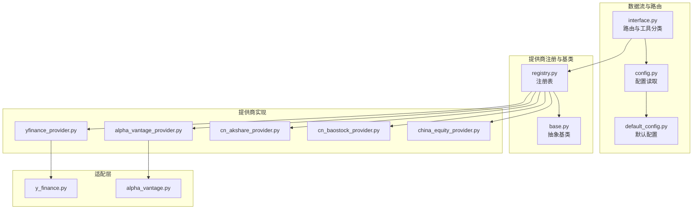
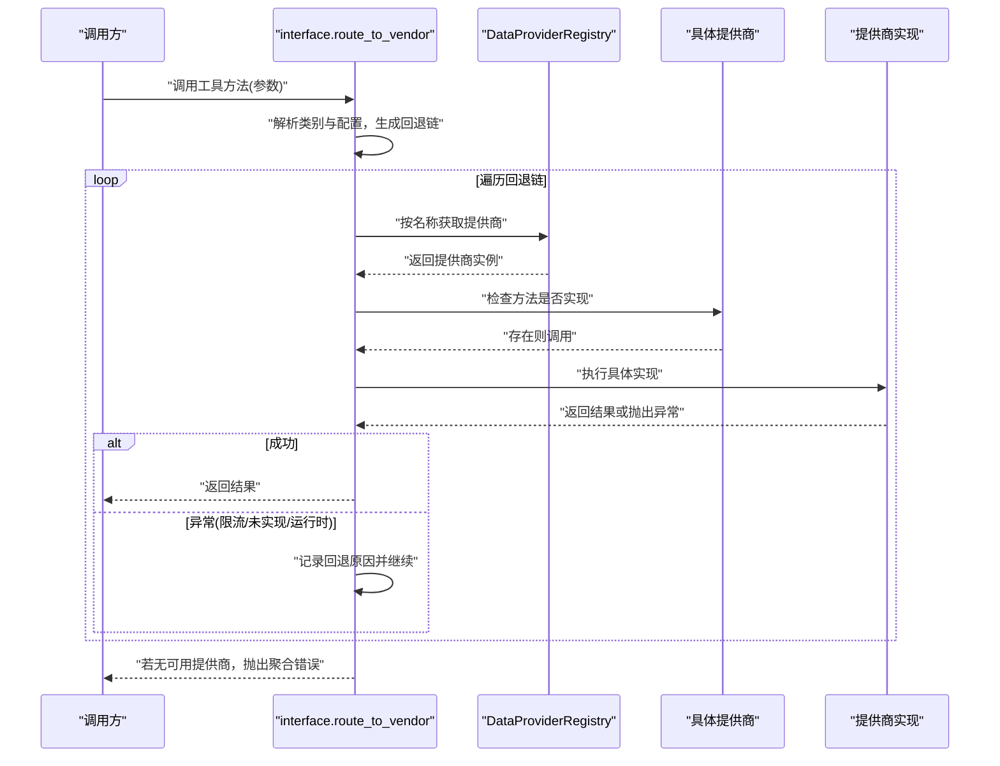
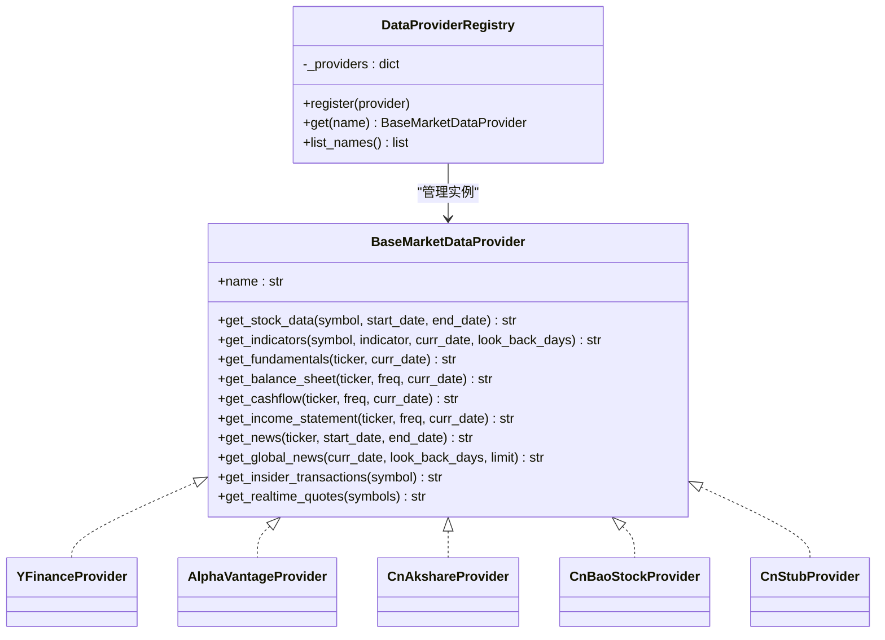
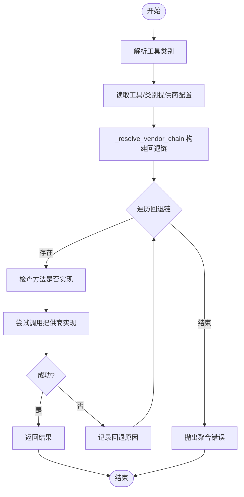
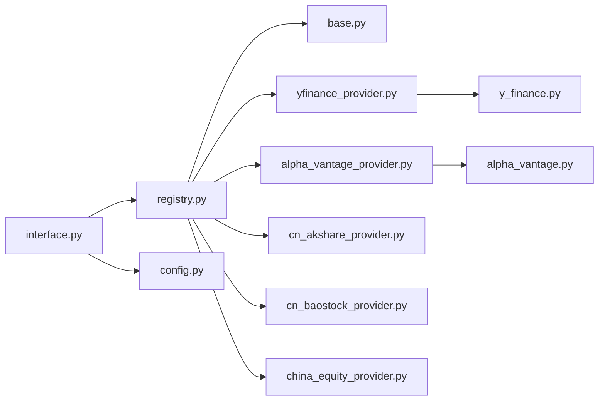

# 数据源管理

<cite>
**本文引用的文件**
- [tradingagents/dataflows/providers/base.py](file://tradingagents/dataflows/providers/base.py)
- [tradingagents/dataflows/providers/registry.py](file://tradingagents/dataflows/providers/registry.py)
- [tradingagents/dataflows/providers/__init__.py](file://tradingagents/dataflows/providers/__init__.py)
- [tradingagents/dataflows/interface.py](file://tradingagents/dataflows/interface.py)
- [tradingagents/dataflows/config.py](file://tradingagents/dataflows/config.py)
- [tradingagents/default_config.py](file://tradingagents/default_config.py)
- [tradingagents/dataflows/providers/yfinance_provider.py](file://tradingagents/dataflows/providers/yfinance_provider.py)
- [tradingagents/dataflows/providers/alpha_vantage_provider.py](file://tradingagents/dataflows/providers/alpha_vantage_provider.py)
- [tradingagents/dataflows/providers/china_equity_provider.py](file://tradingagents/dataflows/providers/china_equity_provider.py)
- [tradingagents/dataflows/providers/cn_akshare_provider.py](file://tradingagents/dataflows/providers/cn_akshare_provider.py)
- [tradingagents/dataflows/providers/cn_baostock_provider.py](file://tradingagents/dataflows/providers/cn_baostock_provider.py)
- [tradingagents/dataflows/y_finance.py](file://tradingagents/dataflows/y_finance.py)
- [tradingagents/dataflows/alpha_vantage.py](file://tradingagents/dataflows/alpha_vantage.py)
- [tests/test_data_collector.py](file://tests/test_data_collector.py)
- [tests/test_realtime_quote_provider.py](file://tests/test_realtime_quote_provider.py)
</cite>

## 目录
1. [简介](#简介)
2. [项目结构](#项目结构)
3. [核心组件](#核心组件)
4. [架构总览](#架构总览)
5. [详细组件分析](#详细组件分析)
6. [依赖分析](#依赖分析)
7. [性能考量](#性能考量)
8. [故障排查指南](#故障排查指南)
9. [结论](#结论)
10. [附录](#附录)

## 简介
本文件系统性梳理 TradingAgents-AShare 的数据源管理子系统，覆盖数据源注册机制、抽象基类设计、多提供商集成架构与路由策略。重点说明各数据源（Alpha Vantage、akshare、baostock、yfinance）的实现差异、适用场景、配置方法与扩展路径，并给出数据源切换、负载均衡与故障转移策略，以及监控、错误处理与调试建议。

## 项目结构
数据源管理位于 tradingagents/dataflows 下，核心文件组织如下：
- 抽象与注册：providers/base.py、providers/registry.py、providers/__init__.py
- 路由与工具分类：dataflows/interface.py、dataflows/config.py、default_config.py
- 具体提供商：providers/yfinance_provider.py、providers/alpha_vantage_provider.py、providers/cn_akshare_provider.py、providers/cn_baostock_provider.py、providers/china_equity_provider.py
- 提供商适配层：dataflows/y_finance.py、dataflows/alpha_vantage.py
- 测试：tests/test_data_collector.py、tests/test_realtime_quote_provider.py

图表来源
- [tradingagents/dataflows/interface.py:1-181](file://tradingagents/dataflows/interface.py#L1-L181)
- [tradingagents/dataflows/config.py:1-32](file://tradingagents/dataflows/config.py#L1-L32)
- [tradingagents/default_config.py:1-43](file://tradingagents/default_config.py#L1-L43)
- [tradingagents/dataflows/providers/registry.py:1-35](file://tradingagents/dataflows/providers/registry.py#L1-L35)
- [tradingagents/dataflows/providers/base.py:1-67](file://tradingagents/dataflows/providers/base.py#L1-L67)
- [tradingagents/dataflows/providers/yfinance_provider.py:1-64](file://tradingagents/dataflows/providers/yfinance_provider.py#L1-L64)
- [tradingagents/dataflows/providers/alpha_vantage_provider.py:1-57](file://tradingagents/dataflows/providers/alpha_vantage_provider.py#L1-L57)
- [tradingagents/dataflows/providers/cn_akshare_provider.py:1-1122](file://tradingagents/dataflows/providers/cn_akshare_provider.py#L1-L1122)
- [tradingagents/dataflows/providers/cn_baostock_provider.py:1-209](file://tradingagents/dataflows/providers/cn_baostock_provider.py#L1-L209)
- [tradingagents/dataflows/providers/china_equity_provider.py:1-55](file://tradingagents/dataflows/providers/china_equity_provider.py#L1-L55)
- [tradingagents/dataflows/y_finance.py:1-479](file://tradingagents/dataflows/y_finance.py#L1-L479)
- [tradingagents/dataflows/alpha_vantage.py:1-5](file://tradingagents/dataflows/alpha_vantage.py#L1-L5)

章节来源
- [tradingagents/dataflows/providers/__init__.py:1-10](file://tradingagents/dataflows/providers/__init__.py#L1-L10)
- [tradingagents/dataflows/interface.py:1-181](file://tradingagents/dataflows/interface.py#L1-L181)
- [tradingagents/dataflows/config.py:1-32](file://tradingagents/dataflows/config.py#L1-L32)
- [tradingagents/default_config.py:1-43](file://tradingagents/default_config.py#L1-L43)

## 核心组件
- 抽象基类 BaseMarketDataProvider：统一定义数据源能力接口，包括 OHLCV、技术指标、财务报表、新闻与实时行情等方法。
- 注册表 DataProviderRegistry：内存型注册表，负责提供商实例登记与按名称检索，并提供默认构建器。
- 路由与工具分类 interface.route_to_vendor：根据工具类别与配置选择提供商，支持链式回退与跟踪日志。
- 配置体系：config.get_config 与 default_config.DEFAULT_CONFIG 提供全局配置读取与默认值设定，含“提供商路由链”与“工具级路由”。

章节来源
- [tradingagents/dataflows/providers/base.py:1-67](file://tradingagents/dataflows/providers/base.py#L1-L67)
- [tradingagents/dataflows/providers/registry.py:1-35](file://tradingagents/dataflows/providers/registry.py#L1-L35)
- [tradingagents/dataflows/interface.py:1-181](file://tradingagents/dataflows/interface.py#L1-L181)
- [tradingagents/dataflows/config.py:1-32](file://tradingagents/dataflows/config.py#L1-L32)
- [tradingagents/default_config.py:1-43](file://tradingagents/default_config.py#L1-L43)

## 架构总览
数据源管理采用“抽象基类 + 注册表 + 路由器”的分层架构：
- 上层通过 interface.route_to_vendor 发起调用；
- 路由器解析工具类别与配置，生成候选提供商链；
- 按顺序尝试调用，遇到限流/未实现/运行时错误则回退；
- 支持 TA_TRACE 开关与参数摘要日志，便于观测与排障。

图表来源
- [tradingagents/dataflows/interface.py:125-181](file://tradingagents/dataflows/interface.py#L125-L181)
- [tradingagents/dataflows/providers/registry.py:20-24](file://tradingagents/dataflows/providers/registry.py#L20-L24)

## 详细组件分析

### 抽象基类与注册表
- 抽象基类 BaseMarketDataProvider：定义统一接口，包括历史行情、技术指标、财务报表、新闻、全球新闻、大股东交易与实时报价等方法；实时报价方法提供默认未实现，具体提供商可覆盖。
- 注册表 DataProviderRegistry：提供 register/get/list_names；默认构建器 build_default_registry 将 akshare、baostock、yfinance、alpha_vantage、占位提供商注册入表。

图表来源
- [tradingagents/dataflows/providers/base.py:1-67](file://tradingagents/dataflows/providers/base.py#L1-L67)
- [tradingagents/dataflows/providers/registry.py:1-35](file://tradingagents/dataflows/providers/registry.py#L1-L35)
- [tradingagents/dataflows/providers/yfinance_provider.py:1-64](file://tradingagents/dataflows/providers/yfinance_provider.py#L1-L64)
- [tradingagents/dataflows/providers/alpha_vantage_provider.py:1-57](file://tradingagents/dataflows/providers/alpha_vantage_provider.py#L1-L57)
- [tradingagents/dataflows/providers/cn_akshare_provider.py:1-1122](file://tradingagents/dataflows/providers/cn_akshare_provider.py#L1-L1122)
- [tradingagents/dataflows/providers/cn_baostock_provider.py:1-209](file://tradingagents/dataflows/providers/cn_baostock_provider.py#L1-L209)
- [tradingagents/dataflows/providers/china_equity_provider.py:1-55](file://tradingagents/dataflows/providers/china_equity_provider.py#L1-L55)

章节来源
- [tradingagents/dataflows/providers/base.py:1-67](file://tradingagents/dataflows/providers/base.py#L1-L67)
- [tradingagents/dataflows/providers/registry.py:1-35](file://tradingagents/dataflows/providers/registry.py#L1-L35)

### 路由与回退策略
- 工具分类：interface.TOOLS_CATEGORIES 将方法归类，便于按类别选择提供商。
- 路由决策：get_vendor 优先读取工具级配置，其次读取类别配置；默认类别映射在 default_config 中。
- 回退链：_resolve_vendor_chain 从配置链开始，补充未占位的已注册提供商，形成兜底链；route_to_vendor 逐个尝试，遇到 AlphaVantageRateLimitError、NotImplementedError 或其他异常即回退。
- 追踪日志：支持 TA_TRACE 环境变量或配置项开启，打印方法名、参数摘要与回退原因，便于诊断。

图表来源
- [tradingagents/dataflows/interface.py:88-181](file://tradingagents/dataflows/interface.py#L88-L181)
- [tradingagents/default_config.py:33-42](file://tradingagents/default_config.py#L33-L42)

章节来源
- [tradingagents/dataflows/interface.py:1-181](file://tradingagents/dataflows/interface.py#L1-L181)
- [tradingagents/default_config.py:1-43](file://tradingagents/default_config.py#L1-L43)

### 具体提供商实现与特点

#### yfinance 提供商
- 名称：yfinance
- 特点：面向国际市场的免费数据源，适配 yfinance 库；对 A 股符号进行规范化处理（.SH/.SZ 到 .SS/.SZ）。
- 能力：OHLCV、技术指标、财务概览、资产负债表、现金流量表、利润表、新闻、全球新闻、大股东交易。
- 适配层：y_finance.py 提供统一的历史数据、指标计算、财务与新闻接口封装。

章节来源
- [tradingagents/dataflows/providers/yfinance_provider.py:1-64](file://tradingagents/dataflows/providers/yfinance_provider.py#L1-L64)
- [tradingagents/dataflows/y_finance.py:1-479](file://tradingagents/dataflows/y_finance.py#L1-L479)

#### Alpha Vantage 提供商
- 名称：alpha_vantage
- 特点：需要 API Key，具备限流保护；接口返回字符串形式的表格数据。
- 能力：OHLCV、技术指标、财务报表、新闻、全球新闻、大股东交易。
- 适配层：alpha_vantage.py 统一导出各模块函数。

章节来源
- [tradingagents/dataflows/providers/alpha_vantage_provider.py:1-57](file://tradingagents/dataflows/providers/alpha_vantage_provider.py#L1-L57)
- [tradingagents/dataflows/alpha_vantage.py:1-5](file://tradingagents/dataflows/alpha_vantage.py#L1-L5)

#### akshare 提供商（A 股）
- 名称：cn_akshare
- 特点：A 股主数据源，支持多源回退（东方财富、新浪、腾讯），内置并发锁与僵尸线程回收，实时行情缓存与降级。
- 能力：OHLCV、技术指标、财务摘要/报表、新闻、全球新闻、大股东交易、实时报价。
- 并发与稳定性：_AkshareLock 控制总并发与定时任务并发，STALE_TIMEOUT 自动回收僵尸线程；实时行情缓存 TTL 降低对上游的压力。
- 降级策略：当某接口不可用时，提供替代方案（如用新闻替代大股东交易）。

章节来源
- [tradingagents/dataflows/providers/cn_akshare_provider.py:1-1122](file://tradingagents/dataflows/providers/cn_akshare_provider.py#L1-L1122)

#### baostock 提供商（A 股）
- 名称：cn_baostock
- 特点：A 股历史数据源，登录/登出会话管理，仅支持 OHLCV 与技术指标。
- 能力：OHLCV、技术指标；财务/新闻/全球新闻/大股东交易暂不支持。
- 适用场景：对 A 股历史与指标计算有需求但不需要财务/新闻数据的场景。

章节来源
- [tradingagents/dataflows/providers/cn_baostock_provider.py:1-209](file://tradingagents/dataflows/providers/cn_baostock_provider.py#L1-L209)

#### 占位提供商（中国股市）
- 名称：cn_stub
- 特点：占位符，明确提示需使用具体提供商（如 cn_akshare 或 cn_tushare）。
- 作用：避免误用导致的未实现错误，引导正确配置。

章节来源
- [tradingagents/dataflows/providers/china_equity_provider.py:1-55](file://tradingagents/dataflows/providers/china_equity_provider.py#L1-L55)

### 配置方法与路由链
- 默认路由链：default_config.DEFAULT_CONFIG.data_vendors 为各类别指定默认提供商链，如 core_stock_apis/technical_indicators/fundamental_data/news_data 使用 cn_akshare,cn_baostock,yfinance；realtime_data 默认 cn_akshare。
- 工具级覆盖：可通过 tool_vendors 对特定工具进行覆盖。
- 环境变量：TA_TRACE 可开启/关闭路由追踪日志；TA_RESULTS_DIR、TA_LLM_* 等环境变量影响运行行为。

章节来源
- [tradingagents/default_config.py:33-42](file://tradingagents/default_config.py#L33-L42)
- [tradingagents/dataflows/config.py:1-32](file://tradingagents/dataflows/config.py#L1-L32)
- [tradingagents/dataflows/interface.py:96-106](file://tradingagents/dataflows/interface.py#L96-L106)

## 依赖分析
- 组件内聚与耦合：
  - providers 包内通过 base.py 与 registry.py 解耦具体提供商实现。
  - interface 仅依赖注册表与配置，不直接依赖具体提供商，降低耦合。
  - 各提供商通过各自适配层（y_finance.py、alpha_vantage.py）与第三方库解耦。
- 外部依赖：
  - yfinance、akshare、baostock、stockstats、pandas 等第三方库。
- 潜在循环依赖：未发现循环导入；注册表在初始化时集中注册，避免运行时循环。

图表来源
- [tradingagents/dataflows/interface.py:1-181](file://tradingagents/dataflows/interface.py#L1-L181)
- [tradingagents/dataflows/providers/registry.py:1-35](file://tradingagents/dataflows/providers/registry.py#L1-L35)
- [tradingagents/dataflows/providers/base.py:1-67](file://tradingagents/dataflows/providers/base.py#L1-L67)
- [tradingagents/dataflows/providers/yfinance_provider.py:1-64](file://tradingagents/dataflows/providers/yfinance_provider.py#L1-L64)
- [tradingagents/dataflows/providers/alpha_vantage_provider.py:1-57](file://tradingagents/dataflows/providers/alpha_vantage_provider.py#L1-L57)
- [tradingagents/dataflows/providers/cn_akshare_provider.py:1-1122](file://tradingagents/dataflows/providers/cn_akshare_provider.py#L1-L1122)
- [tradingagents/dataflows/providers/cn_baostock_provider.py:1-209](file://tradingagents/dataflows/providers/cn_baostock_provider.py#L1-L209)
- [tradingagents/dataflows/providers/china_equity_provider.py:1-55](file://tradingagents/dataflows/providers/china_equity_provider.py#L1-L55)
- [tradingagents/dataflows/y_finance.py:1-479](file://tradingagents/dataflows/y_finance.py#L1-L479)
- [tradingagents/dataflows/alpha_vantage.py:1-5](file://tradingagents/dataflows/alpha_vantage.py#L1-L5)

## 性能考量
- 并发与限流：
  - cn_akshare 提供并发锁与僵尸线程回收，避免 akshare 全局状态与反爬限制导致的阻塞；定时任务与前台请求共享锁池，前台优先。
  - yfinance 通过本地缓存与批量计算减少重复下载与计算成本。
- 缓存策略：
  - cn_akshare 实时行情缓存 TTL，降低上游压力；yfinance 在线模式下按年维度缓存历史数据文件。
- I/O 与网络：
  - 优先使用本地缓存与批量计算；对上游不稳定接口采用多源回退与降级输出。
- 指标计算：
  - yfinance 指标计算支持批量计算与缓存，显著降低重复计算开销。

章节来源
- [tradingagents/dataflows/providers/cn_akshare_provider.py:42-124](file://tradingagents/dataflows/providers/cn_akshare_provider.py#L42-L124)
- [tradingagents/dataflows/y_finance.py:193-274](file://tradingagents/dataflows/y_finance.py#L193-L274)

## 故障排查指南
- 启用路由追踪：
  - 设置环境变量 TA_TRACE=1 或在配置中启用 provider_trace，观察方法名、参数摘要与回退原因。
- 常见问题定位：
  - Alpha Vantage 限流：路由器会捕获限流异常并回退到下一个提供商。
  - 占位提供商：cn_stub 明确提示需使用具体提供商名称。
  - akshare 不可用：多源回退失败时会抛出未实现异常，检查网络与 akshare 安装状态。
  - baostock 登录失败：检查登录返回码与错误信息。
- 调试建议：
  - 结合 TA_TRACE 与最小复现场景（单工具调用）快速定位问题。
  - 在 cn_akshare 中适当放宽回退链顺序以提升成功率。

章节来源
- [tradingagents/dataflows/interface.py:55-86](file://tradingagents/dataflows/interface.py#L55-L86)
- [tradingagents/dataflows/interface.py:125-181](file://tradingagents/dataflows/interface.py#L125-L181)
- [tradingagents/dataflows/providers/china_equity_provider.py:13-17](file://tradingagents/dataflows/providers/china_equity_provider.py#L13-L17)
- [tradingagents/dataflows/providers/cn_baostock_provider.py:58-70](file://tradingagents/dataflows/providers/cn_baostock_provider.py#L58-L70)

## 结论
该数据源管理体系以抽象基类统一能力边界，以注册表与路由器实现灵活的多提供商集成与回退策略。通过默认配置与工具级覆盖，既能满足通用场景，又允许精细化定制。cn_akshare 在并发与稳定性方面做了大量工程优化，适合 A 股主数据源；yfinance 适合国际数据与指标计算；Alpha Vantage 提供丰富财务与新闻能力但需注意限流；baostock 适合 A 股历史与指标计算场景。整体架构清晰、扩展性强，便于后续新增提供商与优化性能。

## 附录

### 数据源对比与适用场景
- yfinance：国际股票、财务概览、技术指标、新闻；适合美股/国际数据与指标计算。
- Alpha Vantage：财务报表、新闻、全球新闻、大股东交易；适合需要付费 API 的场景。
- cn_akshare：A 股主数据源，多源回退、并发控制、实时缓存；适合 A 股全栈数据。
- cn_baostock：A 股历史与指标；适合不需要财务/新闻的场景。
- cn_stub：占位符，避免误用。

章节来源
- [tradingagents/dataflows/providers/yfinance_provider.py:1-64](file://tradingagents/dataflows/providers/yfinance_provider.py#L1-L64)
- [tradingagents/dataflows/providers/alpha_vantage_provider.py:1-57](file://tradingagents/dataflows/providers/alpha_vantage_provider.py#L1-L57)
- [tradingagents/dataflows/providers/cn_akshare_provider.py:1-1122](file://tradingagents/dataflows/providers/cn_akshare_provider.py#L1-L1122)
- [tradingagents/dataflows/providers/cn_baostock_provider.py:1-209](file://tradingagents/dataflows/providers/cn_baostock_provider.py#L1-L209)
- [tradingagents/dataflows/providers/china_equity_provider.py:1-55](file://tradingagents/dataflows/providers/china_equity_provider.py#L1-L55)

### 配置清单（关键项）
- data_vendors：类别到提供商链的映射（默认链见 default_config）。
- tool_vendors：工具到提供商的覆盖映射。
- provider_trace：是否开启路由追踪日志。
- 其他：LLM 提供商、语言、结果目录等（与数据源管理相关性较低）。

章节来源
- [tradingagents/default_config.py:33-42](file://tradingagents/default_config.py#L33-L42)
- [tradingagents/dataflows/config.py:23-27](file://tradingagents/dataflows/config.py#L23-L27)

### 扩展指南：新增数据源提供商
- 步骤：
  1) 实现 BaseMarketDataProvider 接口，命名唯一且符合配置路由。
  2) 在 providers 目录新增文件并实现具体方法。
  3) 在 registry.py 的 build_default_registry 中注册实例。
  4) 在 default_config 中为相关类别添加默认链或在运行时通过 set_config 覆盖。
  5) 如需并发控制或缓存，参考 cn_akshare 的实现模式。
- 注意事项：
  - 对外返回统一字符串格式，便于上层工具处理。
  - 对不稳定接口实现回退与降级逻辑。
  - 提供必要的错误信息以便路由追踪与排障。

章节来源
- [tradingagents/dataflows/providers/base.py:1-67](file://tradingagents/dataflows/providers/base.py#L1-L67)
- [tradingagents/dataflows/providers/registry.py:27-35](file://tradingagents/dataflows/providers/registry.py#L27-L35)
- [tradingagents/default_config.py:33-42](file://tradingagents/default_config.py#L33-L42)

### 测试参考
- 数据采集与实时行情测试：tests/test_data_collector.py、tests/test_realtime_quote_provider.py

章节来源
- [tests/test_data_collector.py](file://tests/test_data_collector.py)
- [tests/test_realtime_quote_provider.py](file://tests/test_realtime_quote_provider.py)