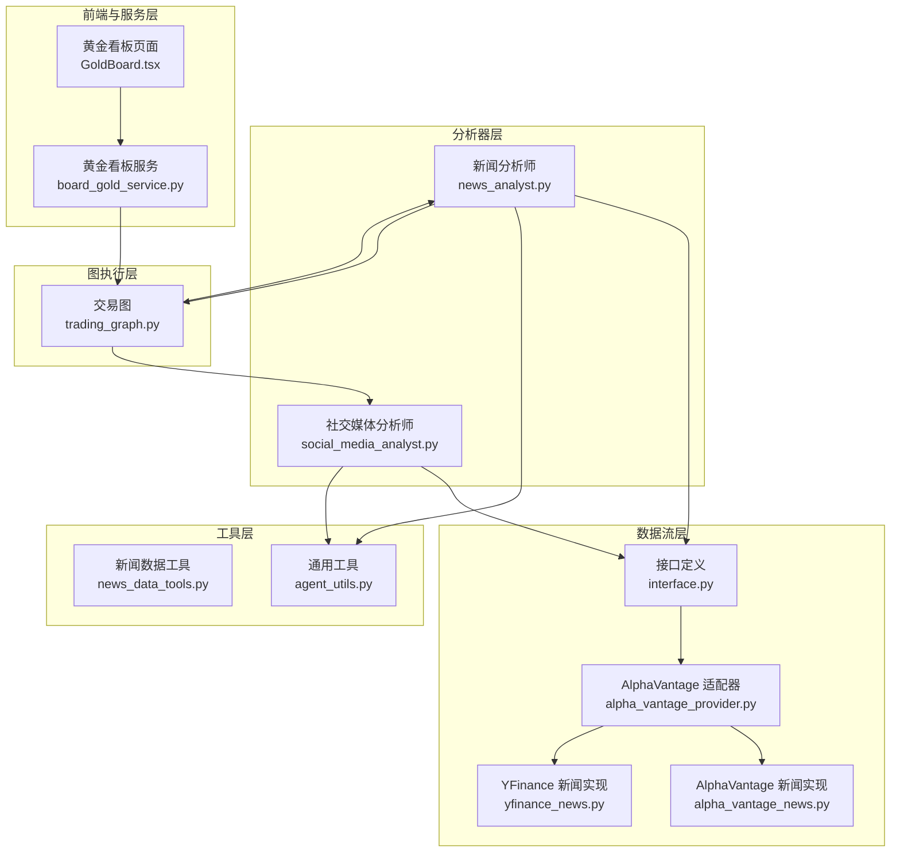
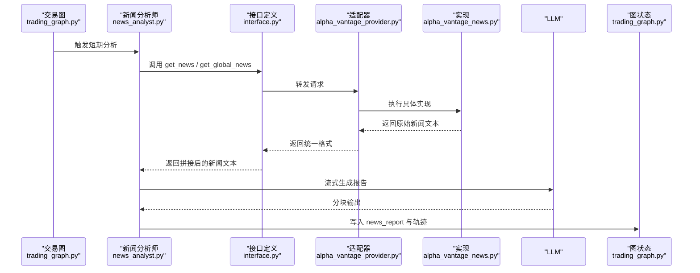
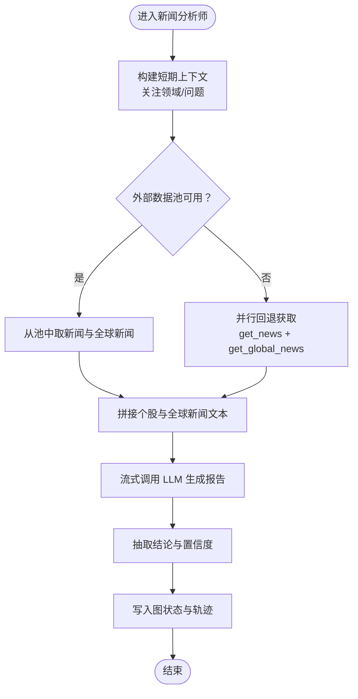
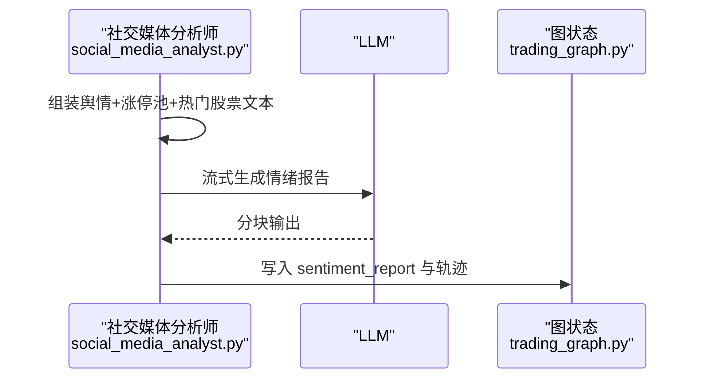
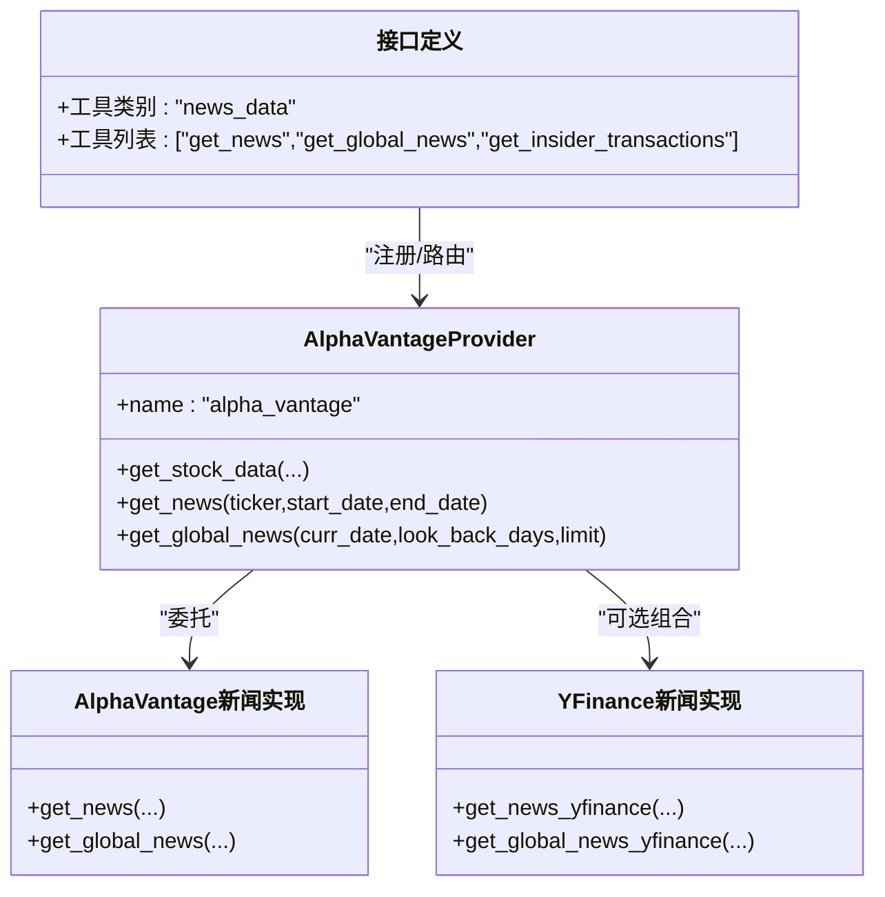
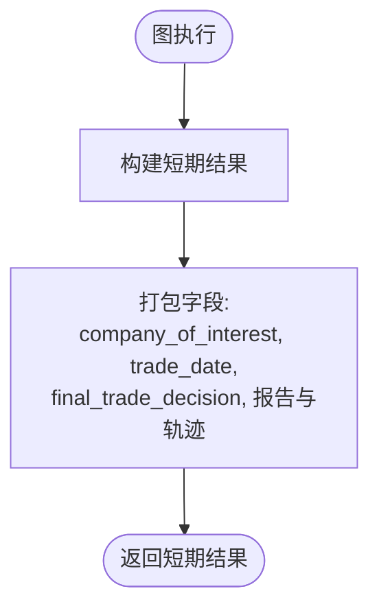
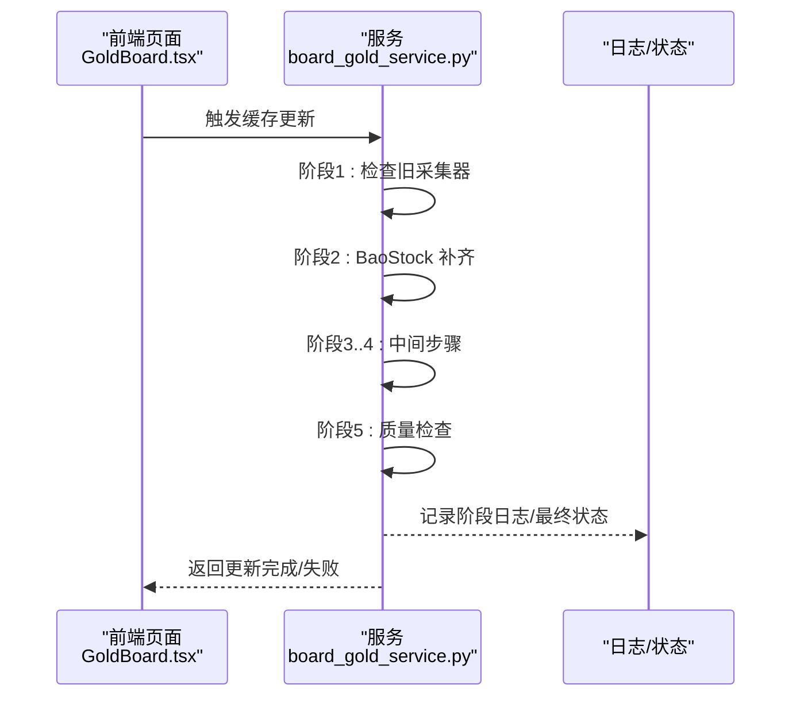
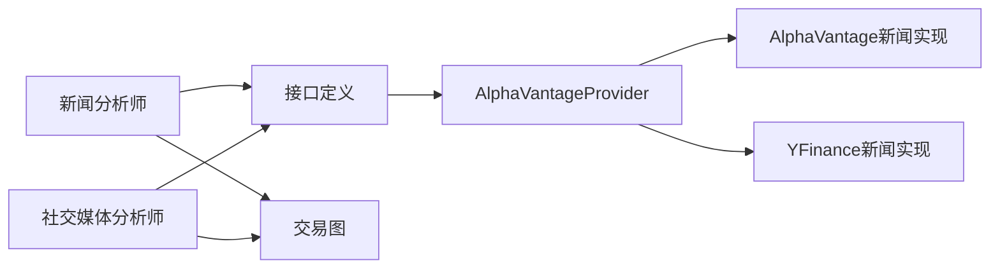

# 新闻数据处理

<cite>
**本文引用的文件**
- [news_analyst.py](file://tradingagents/agents/analysts/news_analyst.py)
- [social_media_analyst.py](file://tradingagents/agents/analysts/social_media_analyst.py)
- [news_data_tools.py](file://tradingagents/agents/utils/news_data_tools.py)
- [agent_utils.py](file://tradingagents/agents/utils/agent_utils.py)
- [interface.py](file://tradingagents/dataflows/interface.py)
- [alpha_vantage_provider.py](file://tradingagents/dataflows/providers/alpha_vantage_provider.py)
- [alpha_vantage_news.py](file://tradingagents/dataflows/alpha_vantage_news.py)
- [yfinance_news.py](file://tradingagents/dataflows/yfinance_news.py)
- [trading_graph.py](file://tradingagents/graph/trading_graph.py)
- [board_gold_service.py](file://api/services/board_gold_service.py)
- [GoldBoard.tsx](file://frontend/src/pages/GoldBoard.tsx)
</cite>

## 目录
1. [简介](#简介)
2. [项目结构](#项目结构)
3. [核心组件](#核心组件)
4. [架构总览](#架构总览)
5. [详细组件分析](#详细组件分析)
6. [依赖关系分析](#依赖关系分析)
7. [性能考量](#性能考量)
8. [故障排查指南](#故障排查指南)
9. [结论](#结论)
10. [附录](#附录)

## 简介
本技术文档聚焦于 TradingAgents-AShare 的新闻数据处理系统，覆盖从多源新闻获取、清洗与聚合、去重与分类，到情感分析、关键词提取与主题建模、时效性与重要性排序、影响评估、可视化与预警，以及缓存策略、增量更新与性能优化等全链路能力。读者可据此理解系统如何在短期视角下整合个股与全球新闻，驱动交易决策。

## 项目结构
围绕新闻数据处理的关键模块分布如下：
- 分析器层：新闻分析师与社交媒体分析师负责组织输入、调用 LLM 并生成报告。
- 工具层：封装新闻获取工具函数，统一对外接口。
- 数据流层：提供多供应商适配器（AlphaVantage、AkShare、Baostock、YFinance），并暴露统一工具集。
- 图执行层：将各分析器串联为图，产出短期/中长期结果。
- 前端与服务层：提供缓存更新入口与可视化展示。

图表来源
- [news_analyst.py:1-89](file://tradingagents/agents/analysts/news_analyst.py#L1-L89)
- [social_media_analyst.py:52-88](file://tradingagents/agents/analysts/social_media_analyst.py#L52-L88)
- [news_data_tools.py:5-23](file://tradingagents/agents/utils/news_data_tools.py#L5-L23)
- [agent_utils.py:15-15](file://tradingagents/agents/utils/agent_utils.py#L15-L15)
- [interface.py:1-52](file://tradingagents/dataflows/interface.py#L1-L52)
- [alpha_vantage_provider.py:15-55](file://tradingagents/dataflows/providers/alpha_vantage_provider.py#L15-L55)
- [alpha_vantage_news.py:2-24](file://tradingagents/dataflows/alpha_vantage_news.py#L2-L24)
- [yfinance_news.py:48-104](file://tradingagents/dataflows/yfinance_news.py#L48-L104)
- [trading_graph.py:342-369](file://tradingagents/graph/trading_graph.py#L342-L369)
- [board_gold_service.py:1665-1774](file://api/services/board_gold_service.py#L1665-L1774)
- [GoldBoard.tsx:321-343](file://frontend/src/pages/GoldBoard.tsx#L321-L343)

章节来源
- [news_analyst.py:1-89](file://tradingagents/agents/analysts/news_analyst.py#L1-L89)
- [social_media_analyst.py:52-88](file://tradingagents/agents/analysts/social_media_analyst.py#L52-L88)
- [news_data_tools.py:5-23](file://tradingagents/agents/utils/news_data_tools.py#L5-L23)
- [agent_utils.py:15-15](file://tradingagents/agents/utils/agent_utils.py#L15-L15)
- [interface.py:1-52](file://tradingagents/dataflows/interface.py#L1-L52)
- [alpha_vantage_provider.py:15-55](file://tradingagents/dataflows/providers/alpha_vantage_provider.py#L15-L55)
- [alpha_vantage_news.py:2-24](file://tradingagents/dataflows/alpha_vantage_news.py#L2-L24)
- [yfinance_news.py:48-104](file://tradingagents/dataflows/yfinance_news.py#L48-L104)
- [trading_graph.py:342-369](file://tradingagents/graph/trading_graph.py#L342-L369)
- [board_gold_service.py:1665-1774](file://api/services/board_gold_service.py#L1665-L1774)
- [GoldBoard.tsx:321-343](file://frontend/src/pages/GoldBoard.tsx#L321-L343)

## 核心组件
- 新闻分析师：负责短期视角下的个股与全球新闻整合、LLM 报告生成与结论抽取。
- 社交媒体分析师：在短期窗口内融合舆情近似资料、涨停池与热门股票信息，生成情绪报告。
- 新闻数据工具：封装 get_news 与 get_global_news，作为统一入口供分析器调用。
- 多源数据提供器：通过适配器模式对接 AlphaVantage、YFinance 等，统一暴露 get_news/get_global_news。
- 图执行器：将分析器节点编排为图，产出短期结果字典，包含各类报告与轨迹。

章节来源
- [news_analyst.py:10-89](file://tradingagents/agents/analysts/news_analyst.py#L10-L89)
- [social_media_analyst.py:52-88](file://tradingagents/agents/analysts/social_media_analyst.py#L52-L88)
- [news_data_tools.py:5-23](file://tradingagents/agents/utils/news_data_tools.py#L5-L23)
- [interface.py:26-33](file://tradingagents/dataflows/interface.py#L26-L33)
- [alpha_vantage_provider.py:46-52](file://tradingagents/dataflows/providers/alpha_vantage_provider.py#L46-L52)
- [trading_graph.py:352-369](file://tradingagents/graph/trading_graph.py#L352-L369)

## 架构总览
新闻数据处理的端到端流程如下：
- 输入准备：分析器根据交易日期与标的构建时间窗口，准备个股与全球新闻。
- 数据获取：通过工具层与数据流层的适配器，从多源拉取新闻。
- 数据清洗与聚合：在分析器内部对原始文本进行拼接与上下文注入。
- 情感分析与结论抽取：调用 LLM 生成报告，并抽取结论与置信度。
- 结果归档：写入图状态，供后续交易决策使用。

图表来源
- [trading_graph.py:342-369](file://tradingagents/graph/trading_graph.py#L342-L369)
- [news_analyst.py:25-87](file://tradingagents/agents/analysts/news_analyst.py#L25-L87)
- [interface.py:26-33](file://tradingagents/dataflows/interface.py#L26-L33)
- [alpha_vantage_provider.py:46-52](file://tradingagents/dataflows/providers/alpha_vantage_provider.py#L46-L52)
- [alpha_vantage_news.py:2-24](file://tradingagents/dataflows/alpha_vantage_news.py#L2-L24)

## 详细组件分析

### 新闻分析师（短期视角）
- 时间窗口与数据来源
  - 使用固定短期窗口（如 14 天）抓取个股新闻与全球新闻。
  - 若外部数据池可用，则优先使用；否则回退至工具层并并行拉取。
- 上下文构建与提示工程
  - 注入“短期”视角、关注领域与问题，确保 LLM 输出聚焦。
- 流式输出与追踪
  - 逐 token 推送至追踪器，便于前端实时显示与调试。
- 结论抽取
  - 从完整报告中抽取结论与置信度，形成“分析器轨迹”。

图表来源
- [news_analyst.py:17-87](file://tradingagents/agents/analysts/news_analyst.py#L17-L87)

章节来源
- [news_analyst.py:10-89](file://tradingagents/agents/analysts/news_analyst.py#L10-L89)

### 社交媒体分析师（短期视角）
- 输入融合
  - 将“舆情近似资料”“涨停池数据”“雪球热门股票”拼接入提示。
- 流式输出与结论抽取
  - 同样采用流式 LLM 输出与结论抽取，生成情绪报告与轨迹。

图表来源
- [social_media_analyst.py:52-88](file://tradingagents/agents/analysts/social_media_analyst.py#L52-L88)

章节来源
- [social_media_analyst.py:52-88](file://tradingagents/agents/analysts/social_media_analyst.py#L52-L88)

### 新闻数据工具与多源适配
- 工具层
  - 提供 get_news 与 get_global_news 两个统一入口，供分析器调用。
- 数据流层
  - 接口定义将“新闻数据”归类为一类工具集合，便于注册与路由。
  - 适配器 AlphaVantageProvider 将具体实现映射到 get_news/get_global_news。
  - AlphaVantage 新闻实现与 YFinance 新闻实现分别提供不同数据源的抓取逻辑。

图表来源
- [interface.py:26-33](file://tradingagents/dataflows/interface.py#L26-L33)
- [alpha_vantage_provider.py:15-55](file://tradingagents/dataflows/providers/alpha_vantage_provider.py#L15-L55)
- [alpha_vantage_news.py:2-24](file://tradingagents/dataflows/alpha_vantage_news.py#L2-L24)
- [yfinance_news.py:48-104](file://tradingagents/dataflows/yfinance_news.py#L48-L104)

章节来源
- [interface.py:1-52](file://tradingagents/dataflows/interface.py#L1-L52)
- [alpha_vantage_provider.py:15-55](file://tradingagents/dataflows/providers/alpha_vantage_provider.py#L15-L55)
- [alpha_vantage_news.py:2-24](file://tradingagents/dataflows/alpha_vantage_news.py#L2-L24)
- [yfinance_news.py:48-104](file://tradingagents/dataflows/yfinance_news.py#L48-L104)

### 图执行与结果归档
- 图执行器将短期分析结果打包为紧凑字典，包含公司、交易日、最终决策、投资计划、各类报告与轨迹。
- 该结构为下游交易器与反思器提供统一输入。

图表来源
- [trading_graph.py:342-369](file://tradingagents/graph/trading_graph.py#L342-L369)

章节来源
- [trading_graph.py:342-369](file://tradingagents/graph/trading_graph.py#L342-L369)

### 缓存策略、增量更新与可视化
- 缓存更新流程（后端服务）
  - 服务按阶段执行：旧采集器增量修复、BaoStock 补齐、质量检查等，记录阶段日志与最终状态。
- 前端触发
  - 黄金看板页面提供“一键更新”按钮，调用后端缓存更新任务。
- 可视化
  - 页面展示本地缓存目录与更新状态，支持用户操作。

图表来源
- [GoldBoard.tsx:321-343](file://frontend/src/pages/GoldBoard.tsx#L321-L343)
- [board_gold_service.py:1665-1774](file://api/services/board_gold_service.py#L1665-L1774)

章节来源
- [GoldBoard.tsx:321-343](file://frontend/src/pages/GoldBoard.tsx#L321-L343)
- [board_gold_service.py:1665-1774](file://api/services/board_gold_service.py#L1665-L1774)

## 依赖关系分析
- 分析器依赖工具层与数据流层，通过接口定义进行解耦。
- 适配器模式降低多源差异，统一对外接口。
- 图执行器仅依赖分析器输出的标准化字段，保证扩展性。

图表来源
- [news_analyst.py:25-87](file://tradingagents/agents/analysts/news_analyst.py#L25-L87)
- [social_media_analyst.py:52-88](file://tradingagents/agents/analysts/social_media_analyst.py#L52-L88)
- [interface.py:26-33](file://tradingagents/dataflows/interface.py#L26-L33)
- [alpha_vantage_provider.py:46-52](file://tradingagents/dataflows/providers/alpha_vantage_provider.py#L46-L52)
- [trading_graph.py:352-369](file://tradingagents/graph/trading_graph.py#L352-L369)

章节来源
- [news_analyst.py:10-89](file://tradingagents/agents/analysts/news_analyst.py#L10-L89)
- [social_media_analyst.py:52-88](file://tradingagents/agents/analysts/social_media_analyst.py#L52-L88)
- [interface.py:1-52](file://tradingagents/dataflows/interface.py#L1-L52)
- [alpha_vantage_provider.py:15-55](file://tradingagents/dataflows/providers/alpha_vantage_provider.py#L15-L55)
- [trading_graph.py:342-369](file://tradingagents/graph/trading_graph.py#L342-L369)

## 性能考量
- 并行获取：当回退到工具层时，个股新闻与全球新闻并行抓取，缩短等待时间。
- 流式输出：LLM 逐 token 推送，降低首屏延迟，提升交互体验。
- 适配器解耦：通过统一接口减少耦合，便于替换或扩展新数据源。
- 缓存更新分阶段：旧采集器修复、BaoStock 补齐、质量检查，避免单点失败导致整体阻塞。

章节来源
- [news_analyst.py:42-51](file://tradingagents/agents/analysts/news_analyst.py#L42-L51)
- [social_media_analyst.py:66-74](file://tradingagents/agents/analysts/social_media_analyst.py#L66-L74)
- [board_gold_service.py:1665-1774](file://api/services/board_gold_service.py#L1665-L1774)

## 故障排查指南
- 回退机制
  - 当外部数据池不可用时，分析器会并行回退至工具层抓取，若仍失败，需检查网络与凭证配置。
- LLM 输出异常
  - 若结论抽取失败，检查 LLM 输出是否符合预期格式；确认提示工程与上下文长度。
- 缓存更新失败
  - 查看服务日志中的阶段记录，定位具体失败环节（旧采集器、BaoStock、质量检查）。
- 前端无响应
  - 确认“一键更新”按钮未处于禁用状态；检查浏览器控制台与后端日志。

章节来源
- [news_analyst.py:31-51](file://tradingagents/agents/analysts/news_analyst.py#L31-L51)
- [social_media_analyst.py:66-74](file://tradingagents/agents/analysts/social_media_analyst.py#L66-L74)
- [board_gold_service.py:1665-1774](file://api/services/board_gold_service.py#L1665-L1774)

## 结论
本系统以分析器为中心，通过工具层与多源适配器实现新闻数据的统一获取与聚合；借助图执行器将短期新闻报告与情绪报告纳入统一决策框架。配合缓存更新流程与前端可视化，形成从数据到洞察再到行动的闭环。建议在实际部署中持续监控多源可用性与 LLM 输出稳定性，并结合业务需求迭代情感评分与主题建模策略。

## 附录
- 关键实现位置参考
  - 新闻分析师：[news_analyst.py:10-89](file://tradingagents/agents/analysts/news_analyst.py#L10-L89)
  - 社交媒体分析师：[social_media_analyst.py:52-88](file://tradingagents/agents/analysts/social_media_analyst.py#L52-L88)
  - 新闻数据工具：[news_data_tools.py:5-23](file://tradingagents/agents/utils/news_data_tools.py#L5-L23)
  - 接口与适配器：[interface.py:26-33](file://tradingagents/dataflows/interface.py#L26-L33)，[alpha_vantage_provider.py:46-52](file://tradingagents/dataflows/providers/alpha_vantage_provider.py#L46-L52)
  - AlphaVantage 新闻实现：[alpha_vantage_news.py:2-24](file://tradingagents/dataflows/alpha_vantage_news.py#L2-L24)
  - YFinance 新闻实现：[yfinance_news.py:48-104](file://tradingagents/dataflows/yfinance_news.py#L48-L104)
  - 图执行与结果打包：[trading_graph.py:342-369](file://tradingagents/graph/trading_graph.py#L342-L369)
  - 缓存更新服务：[board_gold_service.py:1665-1774](file://api/services/board_gold_service.py#L1665-L1774)
  - 前端触发与展示：[GoldBoard.tsx:321-343](file://frontend/src/pages/GoldBoard.tsx#L321-L343)