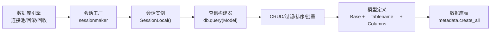
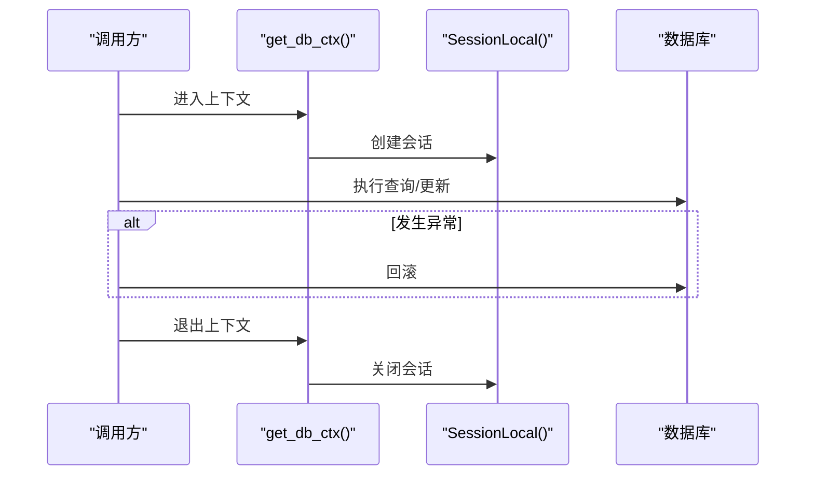
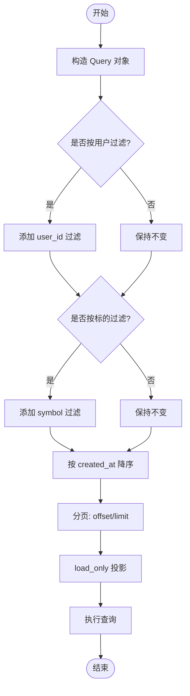
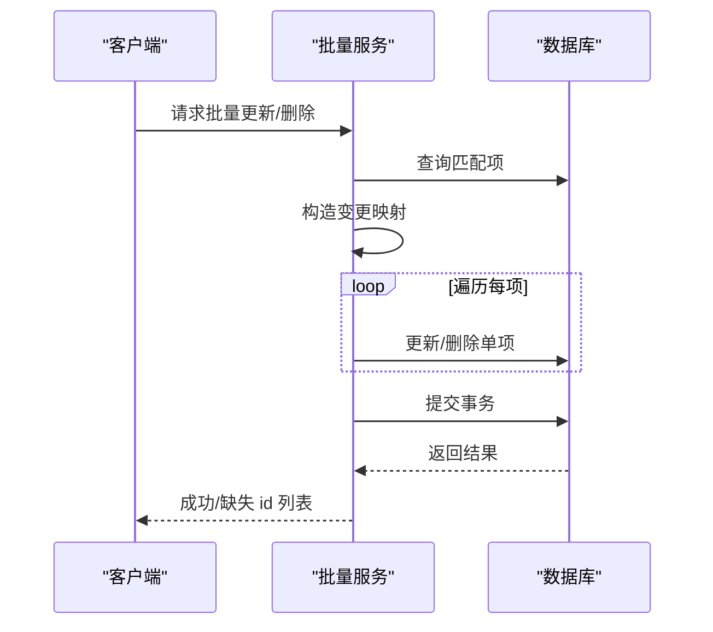
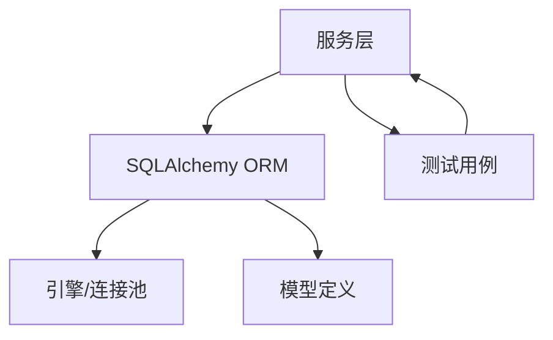

# ORM映射

<cite>
**本文引用的文件**
- [api/database.py](file://api/database.py)
- [api/main.py](file://api/main.py)
- [api/services/report_service.py](file://api/services/report_service.py)
- [api/services/scheduled_service.py](file://api/services/scheduled_service.py)
- [api/services/sponsor_service.py](file://api/services/sponsor_service.py)
- [api/services/auth_service.py](file://api/services/auth_service.py)
- [api/services/email_report_service.py](file://api/services/email_report_service.py)
- [api/services/feedback_service.py](file://api/services/feedback_service.py)
- [api/services/portfolio_import_service.py](file://api/services/portfolio_import_service.py)
- [api/services/token_service.py](file://api/services/token_service.py)
- [api/services/tracking_board_service.py](file://api/services/tracking_board_service.py)
- [api/services/watchlist_service.py](file://api/services/watchlist_service.py)
- [scheduler/main.py](file://scheduler/main.py)
- [tests/test_api_smoke.py](file://tests/test_api_smoke.py)
</cite>

## 目录
1. [简介](#简介)
2. [项目结构](#项目结构)
3. [核心组件](#核心组件)
4. [架构总览](#架构总览)
5. [详细组件分析](#详细组件分析)
6. [依赖分析](#依赖分析)
7. [性能考量](#性能考量)
8. [故障排查指南](#故障排查指南)
9. [结论](#结论)
10. [附录](#附录)

## 简介
本文件系统化梳理 TradingAgents-AShare 的 ORM 映射机制，围绕 SQLAlchemy 配置、模型基类设计、会话管理、模型与表的映射关系、字段类型转换与关系定义、查询构建器与过滤排序、批量操作、延迟加载与关联查询、最佳实践与性能优化、常见陷阱以及模型继承/混合类与自定义类型支持进行深入解析。目标是帮助开发者在不直接阅读源码的情况下快速理解并正确使用 ORM。

## 项目结构
- ORM 核心位于 api/database.py，负责数据库引擎、会话工厂、基础模型类与各业务模型的定义。
- 服务层（api/services/*）通过 Session 对象执行 CRUD、过滤、排序、批量更新等操作。
- 应用入口（api/main.py）集成 ORM 初始化与依赖注入；调度器（scheduler/main.py）也直接使用 ORM。
- 测试（tests/test_api_smoke.py）覆盖批量更新等关键路径，体现 ORM 使用模式。

```mermaid
graph TB
subgraph "应用层"
MAIN["api/main.py"]
SCHED["scheduler/main.py"]
end
subgraph "服务层"
SRV_REPORT["api/services/report_service.py"]
SRV_SCHEDULED["api/services/scheduled_service.py"]
SRV_SPONSOR["api/services/sponsor_service.py"]
SRV_AUTH["api/services/auth_service.py"]
SRV_EMAIL["api/services/email_report_service.py"]
SRV_FEEDBACK["api/services/feedback_service.py"]
SRV_PORTFOLIO["api/services/portfolio_import_service.py"]
SRV_TOKEN["api/services/token_service.py"]
SRV_TRACKING["api/services/tracking_board_service.py"]
SRV_WATCHLIST["api/services/watchlist_service.py"]
end
subgraph "数据访问层"
DB["api/database.py"]
end
MAIN --> DB
SCHED --> DB
SRV_REPORT --> DB
SRV_SCHEDULED --> DB
SRV_SPONSOR --> DB
SRV_AUTH --> DB
SRV_EMAIL --> DB
SRV_FEEDBACK --> DB
SRV_PORTFOLIO --> DB
SRV_TOKEN --> DB
SRV_TRACKING --> DB
SRV_WATCHLIST --> DB
```

图表来源
- [api/database.py](file://api/database.py)
- [api/main.py](file://api/main.py)
- [scheduler/main.py](file://scheduler/main.py)
- [api/services/report_service.py](file://api/services/report_service.py)
- [api/services/scheduled_service.py](file://api/services/scheduled_service.py)
- [api/services/sponsor_service.py](file://api/services/sponsor_service.py)
- [api/services/auth_service.py](file://api/services/auth_service.py)
- [api/services/email_report_service.py](file://api/services/email_report_service.py)
- [api/services/feedback_service.py](file://api/services/feedback_service.py)
- [api/services/portfolio_import_service.py](file://api/services/portfolio_import_service.py)
- [api/services/token_service.py](file://api/services/token_service.py)
- [api/services/tracking_board_service.py](file://api/services/tracking_board_service.py)
- [api/services/watchlist_service.py](file://api/services/watchlist_service.py)

章节来源
- [api/database.py](file://api/database.py)
- [api/main.py](file://api/main.py)
- [scheduler/main.py](file://scheduler/main.py)

## 核心组件
- 数据库引擎与连接池：根据 DATABASE_URL 自动选择 SQLite 或其他数据库，设置连接池大小、溢出、超时与回收策略；SQLite 下启用 WAL 模式以提升并发写入能力。
- 会话工厂与上下文管理：提供基于依赖注入的 get_db 生成器与手动上下文管理器 get_db_ctx，确保事务安全与资源释放。
- 基类与元数据：declarative_base() 作为所有模型的基类，统一表名、索引与约束；init_db() 创建所有表并进行轻量迁移。
- 模型集合：涵盖用户、验证码、LLM 配置、令牌、版本统计、自选股、定时分析、赞助商、反馈、导入组合等业务实体。

章节来源
- [api/database.py](file://api/database.py)

## 架构总览
ORM 层采用“单引擎 + 会话工厂 + 基类模型”的分层设计，服务层通过显式 Session 执行查询与变更，保证事务边界清晰、可测试性强。

图表来源
- [api/database.py](file://api/database.py)

## 详细组件分析

### 数据库引擎与连接池
- 连接字符串来源：优先从环境变量 DATABASE_URL 读取，默认 SQLite。
- SQLite 特性：启用 WAL 模式（若数据库目录可写），线程安全参数；连接池较小但稳定。
- 其他数据库：PostgreSQL/MySQL 使用更大连接池以支持高并发。
- 连接池参数：pool_size、max_overflow、pool_timeout、pool_recycle。

章节来源
- [api/database.py](file://api/database.py)

### 会话管理与生命周期
- 依赖注入：get_db() 生成器在请求期间提供 Session，结束后自动关闭。
- 上下文管理：get_db_ctx() 提供 with 语法，异常时自动回滚，确保一致性。
- 事务语义：非自动提交、非自动刷新，需显式 commit/refresh 控制。

图表来源
- [api/database.py](file://api/database.py)

章节来源
- [api/database.py](file://api/database.py)

### 模型基类与元数据初始化
- 基类：Base = declarative_base()，所有模型继承该基类。
- 表创建：init_db() 调用 Base.metadata.create_all(bind=engine)，一次性创建所有表。
- 轻量迁移：针对现有表追加列（如 users、reports、user_llm_configs），兼容旧部署。

章节来源
- [api/database.py](file://api/database.py)

### 字段类型与约束
- 常用类型：String、Integer、Float、Boolean、DateTime、Text、JSON。
- 约束：唯一约束、主键、索引、默认值、服务器默认值。
- 示例字段：
  - 字符串主键与索引：id、symbol、user_id。
  - JSON 存储复杂结构：result_data、risk_items、key_metrics、analyst_traces。
  - 时间戳：created_at、updated_at，支持 onupdate。
  - 外键/关联：未见显式外键声明，通过 user_id 等字段表达逻辑关联。

章节来源
- [api/database.py](file://api/database.py)

### 查询构建器、过滤与排序
- 基本查询：db.query(Model) 返回 Query 对象，支持 filter、filter_by、order_by、offset、limit。
- 条件组合：多条件链式过滤，按需拼接。
- 排序：按 created_at 等字段降序/升序排列。
- 投影与延迟加载：使用 load_only 仅加载必要列，减少网络与内存开销。
- 示例场景：
  - 获取单条报告：按 id 查询，可选按 user_id 限定。
  - 分页列表：按 created_at 降序，配合 offset/limit。
  - 最新报告：按 symbol 分组取最新记录。

图表来源
- [api/services/report_service.py](file://api/services/report_service.py)

章节来源
- [api/services/report_service.py](file://api/services/report_service.py)

### 批量操作
- 单事务批量更新：先查询匹配项，构造映射，逐项应用变更，最后统一 commit 并 refresh。
- 批量删除：通过 id 列表 in_ 条件筛选，删除后返回缺失 id 清单用于同步。
- 批量接口：服务层暴露批量端点，测试覆盖批量更新与删除行为。

图表来源
- [api/services/scheduled_service.py](file://api/services/scheduled_service.py)
- [tests/test_api_smoke.py](file://tests/test_api_smoke.py)

章节来源
- [api/services/scheduled_service.py](file://api/services/scheduled_service.py)
- [tests/test_api_smoke.py](file://tests/test_api_smoke.py)

### 延迟加载与关联查询
- 延迟加载：通过 load_only 仅加载摘要字段，避免加载大字段（如 JSON）。
- 关联查询：当前模型间未显式声明外键关系，服务层通过 user_id 等字段进行逻辑关联；如需强约束建议引入 ForeignKey 与 relationship。

章节来源
- [api/services/report_service.py](file://api/services/report_service.py)
- [api/database.py](file://api/database.py)

### 模型继承与混合类
- 继承：未发现模型之间存在继承关系。
- 混合类：未发现通用混入类（如 TimestampMixin）。
- 建议：可抽象出时间戳、审计字段等混入类，统一模型风格。

章节来源
- [api/database.py](file://api/database.py)

### 自定义类型与 JSON 字段
- JSON 类型：大量使用 JSON 字段存储结构化数据（如风险项、关键指标、分析师轨迹）。
- 注意事项：JSON 字段无法直接参与 SQL 过滤与排序，需在 Python 层处理或考虑使用可查询 JSON 函数（取决于数据库方言）。

章节来源
- [api/database.py](file://api/database.py)

### 服务层 ORM 使用范式
- 依赖注入：FastAPI 依赖 get_db 提供 Session。
- 手动上下文：在工具脚本或调度器中使用 get_db_ctx 管理会话。
- 事务控制：每个业务操作在独立事务内完成，异常回滚，成功提交。

章节来源
- [api/main.py](file://api/main.py)
- [scheduler/main.py](file://scheduler/main.py)

## 依赖分析
- 低耦合：服务层仅依赖 Session 与模型类，不直接依赖具体数据库驱动。
- 依赖注入：通过 get_db 与 get_db_ctx 解耦框架与数据访问层。
- 外部依赖：SQLAlchemy ORM、引擎、事件钩子（SQLite WAL）。

图表来源
- [api/database.py](file://api/database.py)
- [api/services/report_service.py](file://api/services/report_service.py)
- [tests/test_api_smoke.py](file://tests/test_api_smoke.py)

章节来源
- [api/database.py](file://api/database.py)
- [api/services/report_service.py](file://api/services/report_service.py)
- [tests/test_api_smoke.py](file://tests/test_api_smoke.py)

## 性能考量
- 连接池：根据数据库类型调整 pool_size/max_overflow/pool_timeout/pool_recycle，避免阻塞与资源耗尽。
- 查询投影：对大字段（JSON）使用 load_only，减少序列化与网络传输。
- 批量操作：单事务批量更新/删除，降低往返次数与锁竞争。
- 索引：对高频过滤字段（如 user_id、symbol、status）建立索引，加速查询。
- WAL 模式：SQLite 场景启用 WAL，提高并发写入吞吐。
- 事务粒度：短事务、尽早提交，避免长时间持有行级锁。

## 故障排查指南
- 会话泄漏：确认使用 get_db_ctx 或 FastAPI 依赖注入，确保异常时回滚与关闭。
- 迁移失败：init_db 中的轻量迁移仅追加列，若出现异常检查日志与表结构差异。
- 批量更新异常：核对 item_ids 是否全部存在，缺失 id 将导致错误；服务层会返回缺失清单。
- SQLite 写入阻塞：检查 WAL 文件所在目录权限与磁盘空间，必要时切换到其他数据库。

章节来源
- [api/database.py](file://api/database.py)
- [api/services/scheduled_service.py](file://api/services/scheduled_service.py)
- [tests/test_api_smoke.py](file://tests/test_api_smoke.py)

## 结论
本项目采用简洁而稳健的 SQLAlchemy ORM 设计：单引擎 + 会话工厂 + 基类模型，辅以依赖注入与上下文管理，满足多服务场景下的数据持久化需求。通过 load_only、批量事务与索引策略，可在保证一致性的同时兼顾性能。建议后续引入外键与 relationship、时间戳混入类与更完善的迁移方案，进一步增强模型表达力与可维护性。

## 附录
- 快速参考
  - 引擎与会话：参见 [api/database.py](file://api/database.py)
  - 报告查询示例：参见 [api/services/report_service.py](file://api/services/report_service.py)
  - 批量更新示例：参见 [api/services/scheduled_service.py](file://api/services/scheduled_service.py)
  - 依赖注入入口：参见 [api/main.py](file://api/main.py)
  - 调度器使用：参见 [scheduler/main.py](file://scheduler/main.py)
  - 测试覆盖：参见 [tests/test_api_smoke.py](file://tests/test_api_smoke.py)