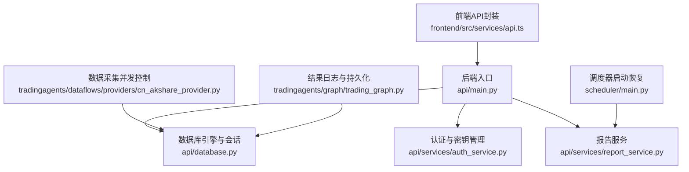
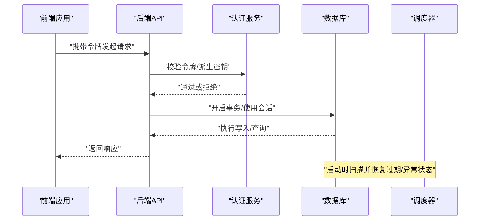
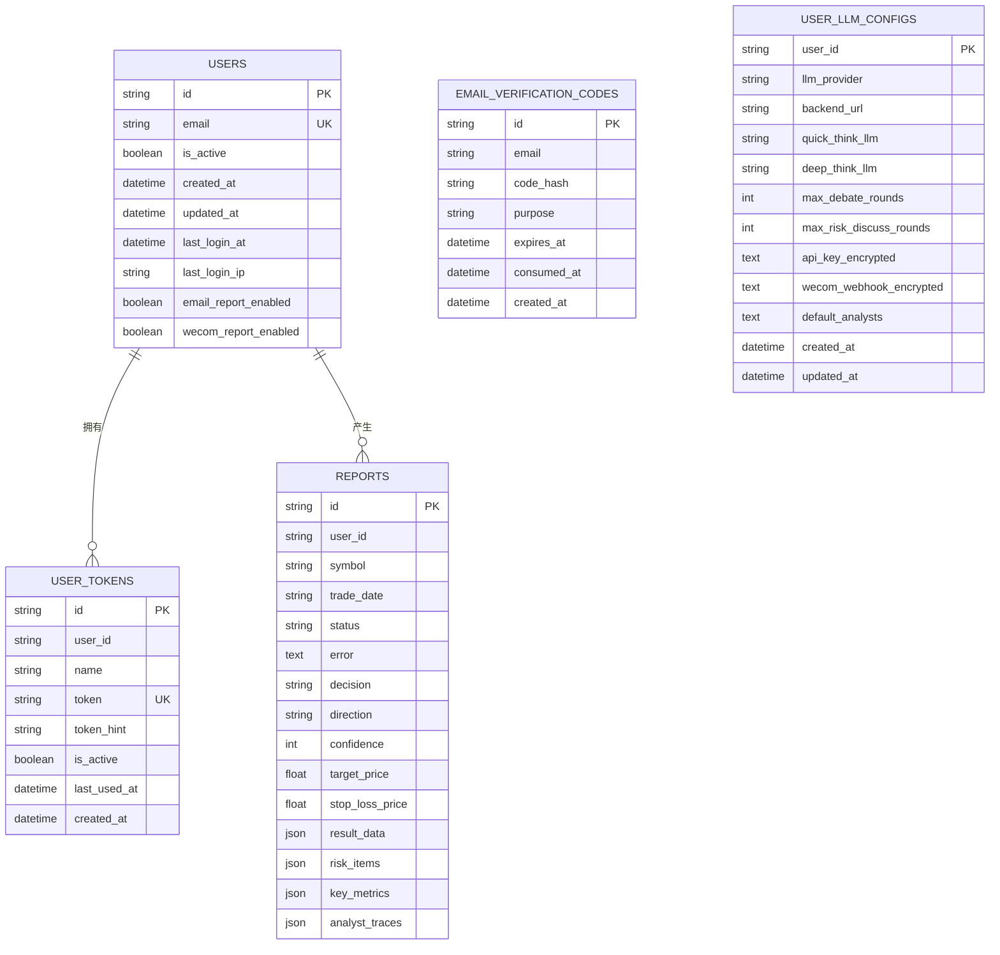
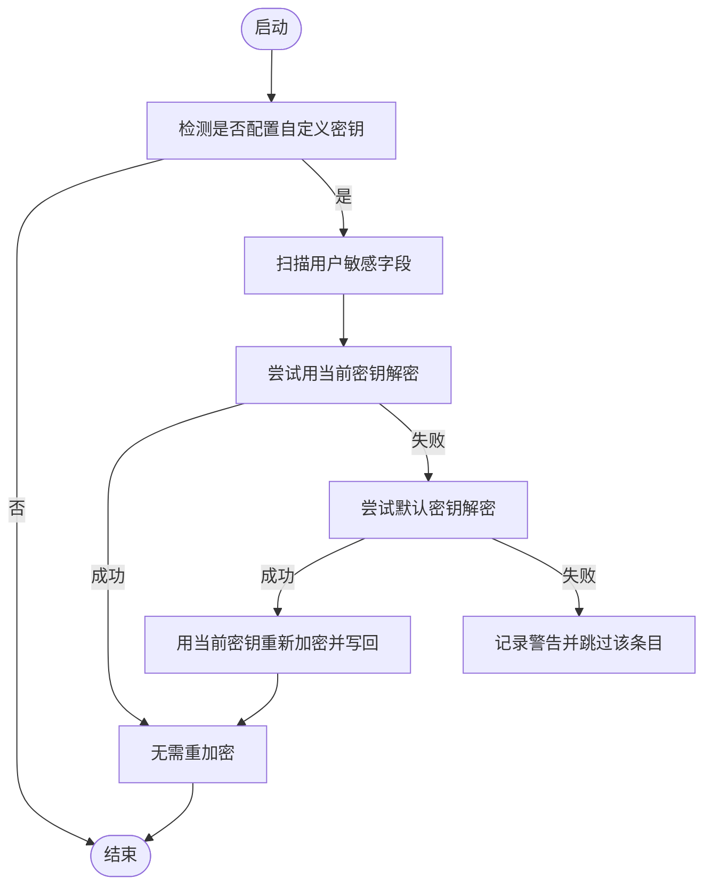
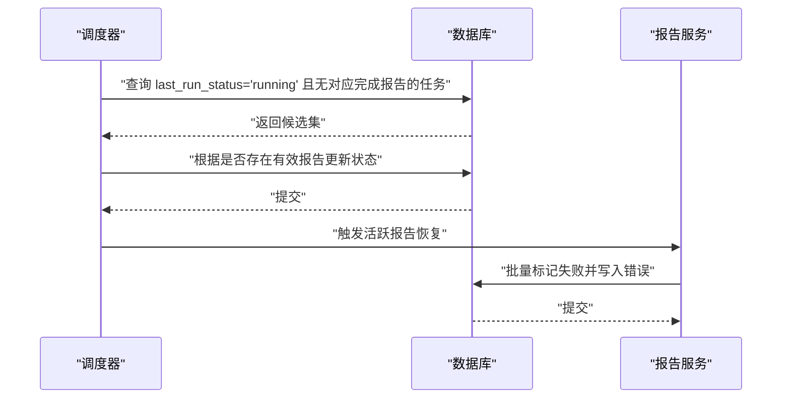
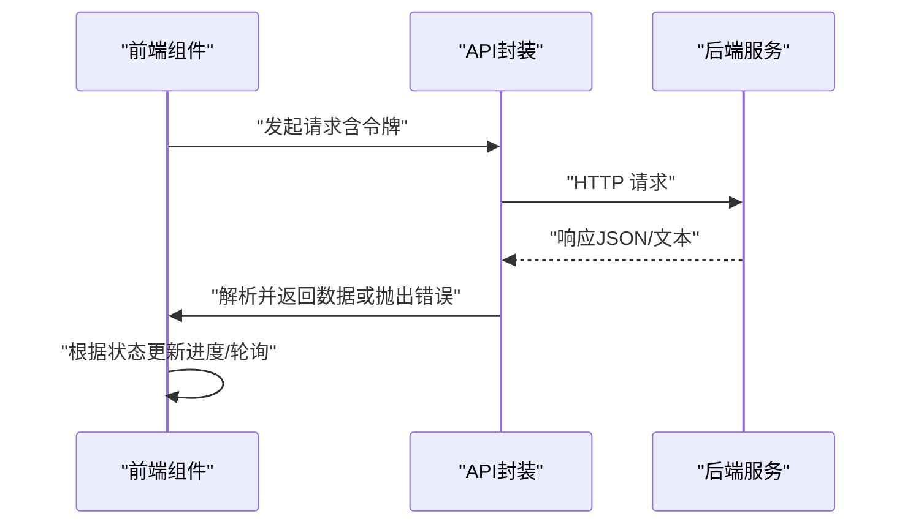
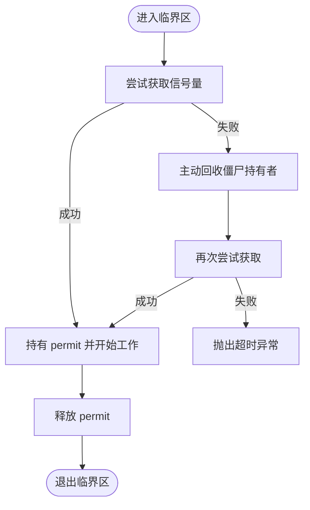
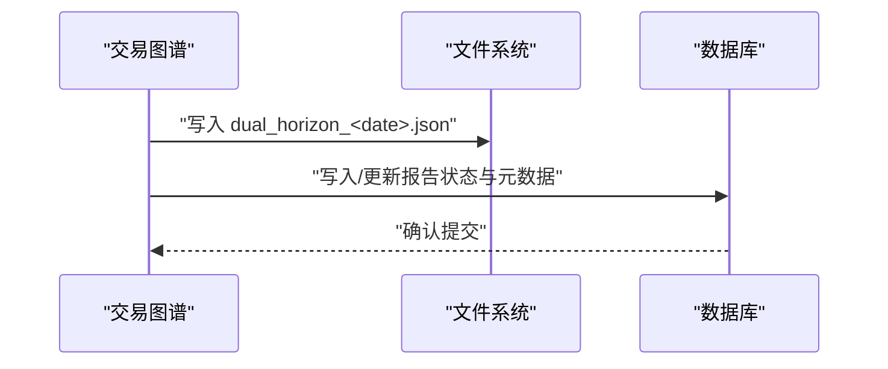
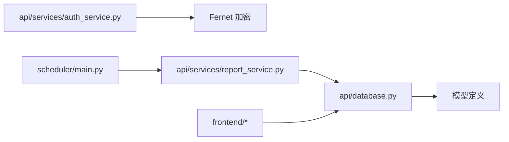

# 数据完整性

<cite>
**本文引用的文件**
- [api/database.py](file://api/database.py)
- [api/services/auth_service.py](file://api/services/auth_service.py)
- [api/services/report_service.py](file://api/services/report_service.py)
- [scheduler/main.py](file://scheduler/main.py)
- [tests/test_report_recovery.py](file://tests/test_report_recovery.py)
- [frontend/src/services/api.ts](file://frontend/src/services/api.ts)
- [frontend/src/utils/progressFeedback.ts](file://frontend/src/utils/progressFeedback.ts)
- [frontend/src/components/TrackingBoardPanel.tsx](file://frontend/src/components/TrackingBoardPanel.tsx)
- [tradingagents/dataflows/providers/cn_akshare_provider.py](file://tradingagents/dataflows/providers/cn_akshare_provider.py)
- [tradingagents/graph/trading_graph.py](file://tradingagents/graph/trading_graph.py)
</cite>

## 目录
1. [简介](#简介)
2. [项目结构](#项目结构)
3. [核心组件](#核心组件)
4. [架构总览](#架构总览)
5. [详细组件分析](#详细组件分析)
6. [依赖分析](#依赖分析)
7. [性能考量](#性能考量)
8. [故障排查指南](#故障排查指南)
9. [结论](#结论)
10. [附录](#附录)

## 简介
本文件聚焦于 TradingAgents-AShare 的数据完整性机制，系统化梳理数据库约束策略、唯一性与外键设计、数据验证与业务规则、一致性检查、索引与查询优化、安全与审计、备份与灾难恢复、以及并发控制与冲突处理。内容基于仓库中实际实现进行归纳总结，并通过图示展示关键流程与关系。

## 项目结构
围绕数据完整性，项目的关键位置包括：
- 数据访问层与模型定义：api/database.py
- 认证与密钥管理：api/services/auth_service.py
- 报告生命周期与一致性恢复：api/services/report_service.py、scheduler/main.py
- 前端请求与状态反馈：frontend/src/services/api.ts、frontend/src/utils/progressFeedback.ts、frontend/src/components/TrackingBoardPanel.tsx
- 数据采集并发控制：tradingagents/dataflows/providers/cn_akshare_provider.py
- 结果持久化与日志：tradingagents/graph/trading_graph.py

图表来源
- [frontend/src/services/api.ts:64-90](file://frontend/src/services/api.ts#L64-L90)
- [api/database.py:14-56](file://api/database.py#L14-L56)
- [api/services/auth_service.py:39-84](file://api/services/auth_service.py#L39-L84)
- [api/services/report_service.py:326-360](file://api/services/report_service.py#L326-L360)
- [scheduler/main.py:337-377](file://scheduler/main.py#L337-L377)
- [tradingagents/dataflows/providers/cn_akshare_provider.py:42-91](file://tradingagents/dataflows/providers/cn_akshare_provider.py#L42-L91)
- [tradingagents/graph/trading_graph.py:371-400](file://tradingagents/graph/trading_graph.py#L371-L400)

章节来源
- [api/database.py:1-143](file://api/database.py#L1-L143)
- [frontend/src/services/api.ts:64-90](file://frontend/src/services/api.ts#L64-L90)

## 核心组件
- 数据库与会话管理：统一的引擎配置、连接池参数、SQLite WAL 模式启用、会话工厂与上下文管理器、初始化与模式演进（向后兼容列添加）。
- 模型与约束：用户、邮箱验证码、用户LLM配置、用户令牌等模型，包含主键、唯一性、索引、默认值与JSON字段。
- 安全与密钥：对称加密（Fernet）、密钥派生、令牌哈希迁移、敏感字段重加密。
- 报告生命周期与一致性：报告状态机、异常与过期检测、启动恢复与清理。
- 前端交互与进度反馈：鉴权头注入、错误处理、轮询刷新与进度计算。

章节来源
- [api/database.py:98-378](file://api/database.py#L98-L378)
- [api/services/auth_service.py:56-84](file://api/services/auth_service.py#L56-L84)
- [api/services/report_service.py:308-360](file://api/services/report_service.py#L308-L360)
- [frontend/src/services/api.ts:64-90](file://frontend/src/services/api.ts#L64-L90)

## 架构总览
下图展示从前端到数据库的关键路径，以及在关键节点上的数据完整性保障措施（会话、加密、状态恢复、并发控制）。

图表来源
- [frontend/src/services/api.ts:64-90](file://frontend/src/services/api.ts#L64-L90)
- [api/services/auth_service.py:39-84](file://api/services/auth_service.py#L39-L84)
- [api/database.py:60-95](file://api/database.py#L60-L95)
- [scheduler/main.py:337-377](file://scheduler/main.py#L337-L377)

## 详细组件分析

### 数据库与模型层（约束、唯一性、外键、索引）
- 引擎与连接池
  - SQLite：启用 WAL 模式以提升并发读写；连接参数包含池大小、溢出、超时与回收周期。
  - 非SQLite：针对高并发场景设置更大连接池。
- 会话与上下文
  - 提供依赖注入式会话生成器与手动上下文管理器，确保异常时回滚与关闭。
- 初始化与模式演进
  - 创建所有表；对现有部署进行“轻量级”列补丁（如 reports、users、user_llm_configs），避免强制迁移。
- 模型与约束
  - 用户表：邮箱唯一、布尔开关默认值、时间戳更新。
  - 邮箱验证码：哈希存储、过期时间、消费标记。
  - 用户LLM配置：主键（user_id）、敏感字段加密存储、默认分析器列表。
  - 用户令牌：唯一性、提示位、活动状态、时间戳。
  - 报告表：主键、符号与交易日组合索引、状态与错误字段、JSON结构化存储。
- 外键关系
  - 未显式声明外键约束；通过业务逻辑与唯一性保证数据一致性（例如 user_id 作为可选索引，令牌与用户关联通过业务层维护）。

图表来源
- [api/database.py:242-378](file://api/database.py#L242-L378)

章节来源
- [api/database.py:14-56](file://api/database.py#L14-L56)
- [api/database.py:98-143](file://api/database.py#L98-L143)
- [api/database.py:242-378](file://api/database.py#L242-L378)

### 安全与密钥管理（加密、敏感信息保护、密钥迁移）
- 对称加密与密钥派生
  - 使用 SHA-256 摘要派生 Fernet 密钥，支持当前密钥与默认密钥的回退解密。
- 敏感字段存储
  - 用户LLM配置中的 API Key 与企业微信 Webhook 采用加密存储；令牌表支持明文到哈希迁移（HMAC-SHA256）。
- 启动时重加密
  - 当自定义密钥配置存在时，尝试用新密钥重加密旧数据；若无法解密则记录警告并跳过。
- 令牌哈希迁移
  - 将以特定前缀开头的明文令牌替换为哈希值与后四位提示，提升安全性。

图表来源
- [api/services/auth_service.py:56-84](file://api/services/auth_service.py#L56-L84)
- [api/database.py:146-239](file://api/database.py#L146-L239)

章节来源
- [api/services/auth_service.py:39-84](file://api/services/auth_service.py#L39-L84)
- [api/database.py:146-239](file://api/database.py#L146-L239)

### 报告生命周期与一致性检查（状态机、恢复、清理）
- 状态机
  - 报告状态包括：待处理、运行中、已完成、失败；错误信息与更新时间用于追踪。
- 启动恢复
  - 调度器启动时扫描“运行中”但无对应完成报告的任务，将其标记为恢复或置为陈旧并清空时间戳。
  - 报告服务扫描活跃报告，对非活动作业的报告标记失败并写入错误信息。
- 过期与孤儿处理
  - 测试覆盖了将陈旧/孤儿报告标记为失败的场景，确保一致性。

图表来源
- [scheduler/main.py:337-377](file://scheduler/main.py#L337-L377)
- [api/services/report_service.py:326-360](file://api/services/report_service.py#L326-L360)

章节来源
- [scheduler/main.py:337-377](file://scheduler/main.py#L337-L377)
- [api/services/report_service.py:308-360](file://api/services/report_service.py#L308-L360)
- [tests/test_report_recovery.py:50-92](file://tests/test_report_recovery.py#L50-L92)

### 前端交互与进度反馈（请求、错误处理、轮询）
- 请求封装
  - 统一注入 Content-Type 与可选 Bearer 令牌；对非 2xx 响应解析 JSON 或文本错误并抛出。
- 进度反馈
  - 前端根据连接状态、时间范围、代理完成数量与最终决策动态计算进度百分比。
- 实时刷新
  - 跟踪看板组件定时轮询接口，避免重复请求与内存泄漏。

图表来源
- [frontend/src/services/api.ts:64-90](file://frontend/src/services/api.ts#L64-L90)
- [frontend/src/utils/progressFeedback.ts:17-38](file://frontend/src/utils/progressFeedback.ts#L17-L38)
- [frontend/src/components/TrackingBoardPanel.tsx:91-124](file://frontend/src/components/TrackingBoardPanel.tsx#L91-L124)

章节来源
- [frontend/src/services/api.ts:64-90](file://frontend/src/services/api.ts#L64-L90)
- [frontend/src/utils/progressFeedback.ts:1-38](file://frontend/src/utils/progressFeedback.ts#L1-L38)
- [frontend/src/components/TrackingBoardPanel.tsx:91-124](file://frontend/src/components/TrackingBoardPanel.tsx#L91-L124)

### 数据采集并发控制（锁与僵尸线程回收）
- 并发锁
  - 使用信号量控制总并发与定时任务并发；区分“前台优先 + 定时任务预留”。
- 僵尸线程回收
  - 超时持有者自动回收 permit；超时阈值与等待超时可配置；异常情况下避免 double-release。
- 冲突解决
  - 获取失败时主动回收并重试，超时则抛出明确异常。

图表来源
- [tradingagents/dataflows/providers/cn_akshare_provider.py:42-91](file://tradingagents/dataflows/providers/cn_akshare_provider.py#L42-L91)

章节来源
- [tradingagents/dataflows/providers/cn_akshare_provider.py:42-91](file://tradingagents/dataflows/providers/cn_akshare_provider.py#L42-L91)

### 结果持久化与日志（状态记录与一致性）
- 双时长结果日志
  - 将短期与中期分析结果、用户意图合并写入 JSON 文件，便于离线复盘与一致性核对。
- 与数据库的关系
  - 文件日志作为补充证据链，数据库负责结构化状态与元数据。

图表来源
- [tradingagents/graph/trading_graph.py:371-400](file://tradingagents/graph/trading_graph.py#L371-L400)

章节来源
- [tradingagents/graph/trading_graph.py:371-400](file://tradingagents/graph/trading_graph.py#L371-L400)

## 依赖分析
- 组件耦合
  - API 层依赖数据库会话工厂与模型；认证服务依赖密钥派生与加密工具；报告服务依赖数据库与调度器恢复逻辑。
- 外部依赖
  - SQLAlchemy ORM、Fernet 对称加密、SQLite/PostgreSQL/MySQL 引擎。
- 潜在循环
  - 未发现直接循环依赖；模型与服务分层清晰。

图表来源
- [api/database.py:14-56](file://api/database.py#L14-L56)
- [api/services/auth_service.py:39-84](file://api/services/auth_service.py#L39-L84)
- [api/services/report_service.py:326-360](file://api/services/report_service.py#L326-L360)
- [scheduler/main.py:337-377](file://scheduler/main.py#L337-L377)

章节来源
- [api/database.py:14-56](file://api/database.py#L14-L56)
- [api/services/auth_service.py:39-84](file://api/services/auth_service.py#L39-L84)
- [api/services/report_service.py:326-360](file://api/services/report_service.py#L326-L360)
- [scheduler/main.py:337-377](file://scheduler/main.py#L337-L377)

## 性能考量
- 连接池与并发
  - SQLite 启用 WAL；连接池参数按数据库类型差异化配置，提升并发读写能力。
- 索引策略
  - 在高频过滤字段（如 reports.symbol、reports.trade_date、reports.status、users.email、user_tokens.token）建立索引，加速查询。
- 查询优化
  - 使用分页与条件过滤；避免 N+1 查询；对 JSON 字段查询建议在应用层做必要校验后再入库。
- 缓存与重试
  - 数据采集层引入并发锁与僵尸回收，减少无效竞争与资源浪费。
- I/O 与日志
  - 结果日志写入文件系统，避免数据库压力；定期归档与清理。

章节来源
- [api/database.py:14-56](file://api/database.py#L14-L56)
- [api/database.py:242-378](file://api/database.py#L242-L378)
- [tradingagents/dataflows/providers/cn_akshare_provider.py:42-91](file://tradingagents/dataflows/providers/cn_akshare_provider.py#L42-L91)
- [tradingagents/graph/trading_graph.py:371-400](file://tradingagents/graph/trading_graph.py#L371-L400)

## 故障排查指南
- 常见问题
  - 令牌不可用：检查令牌哈希迁移是否完成、是否被禁用。
  - 报告状态异常：查看调度器启动恢复日志与报告服务恢复统计。
  - 解密失败：确认密钥是否变更、是否触发重加密流程。
  - 前端请求失败：检查响应头 content-type 与后端错误消息。
- 排查步骤
  - 核对数据库连接与 WAL 模式；检查会话是否正确提交/回滚。
  - 查看报告状态与错误字段，定位失败原因。
  - 检查并发锁是否频繁超时，必要时调整总并发与定时任务并发上限。
  - 确认文件日志是否正常写入，作为一致性证据链。

章节来源
- [api/database.py:146-239](file://api/database.py#L146-L239)
- [api/services/report_service.py:326-360](file://api/services/report_service.py#L326-L360)
- [scheduler/main.py:337-377](file://scheduler/main.py#L337-L377)
- [frontend/src/services/api.ts:77-86](file://frontend/src/services/api.ts#L77-L86)

## 结论
本项目通过“模型约束 + 会话管理 + 启动恢复 + 密钥迁移 + 并发控制 + 文件日志”的组合策略，构建了较为完整的数据完整性体系。SQLite WAL 与连接池提升了并发性能；令牌哈希与敏感字段加密增强了安全性；调度器与报告服务的恢复机制保障了任务一致性；前端进度与错误处理改善了可观测性。建议后续在生产环境引入显式外键约束与数据库迁移框架，进一步强化约束与演进管理。

## 附录
- 备份与恢复
  - SQLite：定期复制数据库文件；WAL 模式下可结合备份工具进行在线备份。
  - 非 SQLite：使用数据库自带备份工具与只读副本策略。
- 灾难恢复
  - 快速切换备用实例；验证 WAL/事务日志完整性；回放最近增量。
- 数据迁移
  - 使用“轻量级列补丁”策略进行向后兼容演进；对敏感字段迁移采用“先解密、再重加密”的双阶段流程。
- 并发控制与隔离
  - 使用连接池与信号量控制并发；SQLite 默认隔离级别；必要时在应用层加锁或使用数据库事务块。