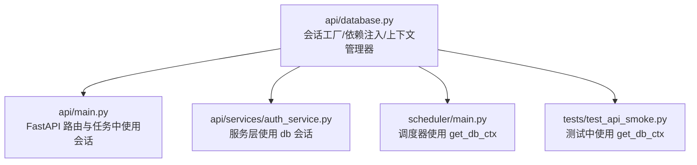
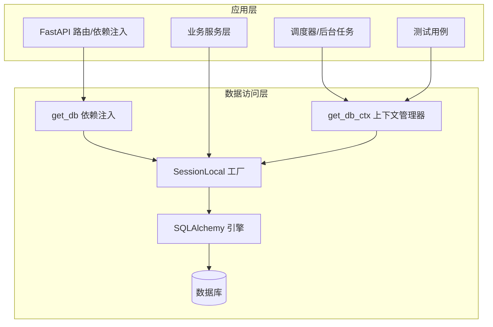
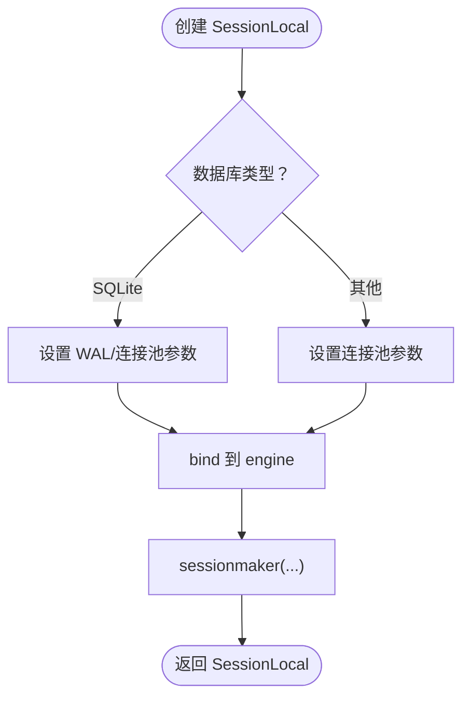
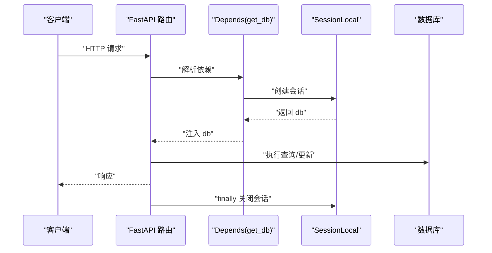
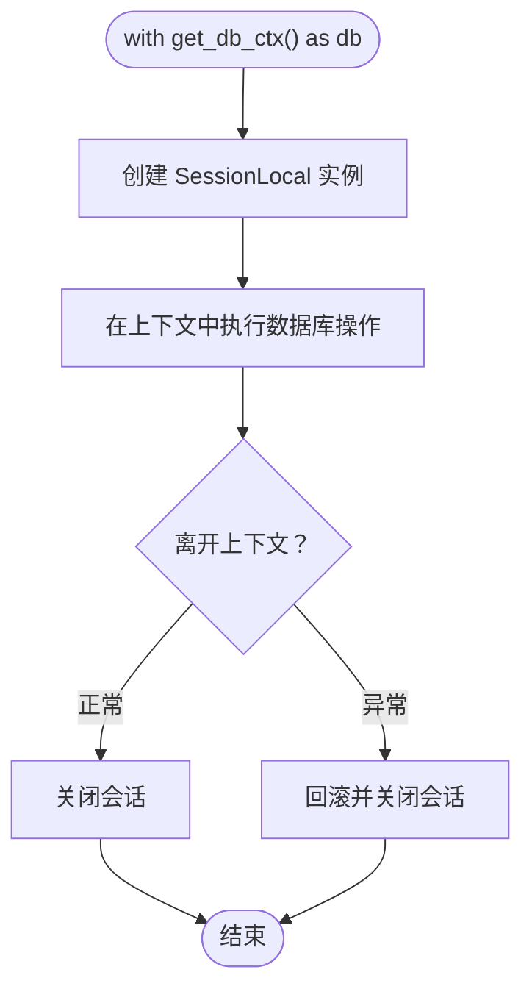
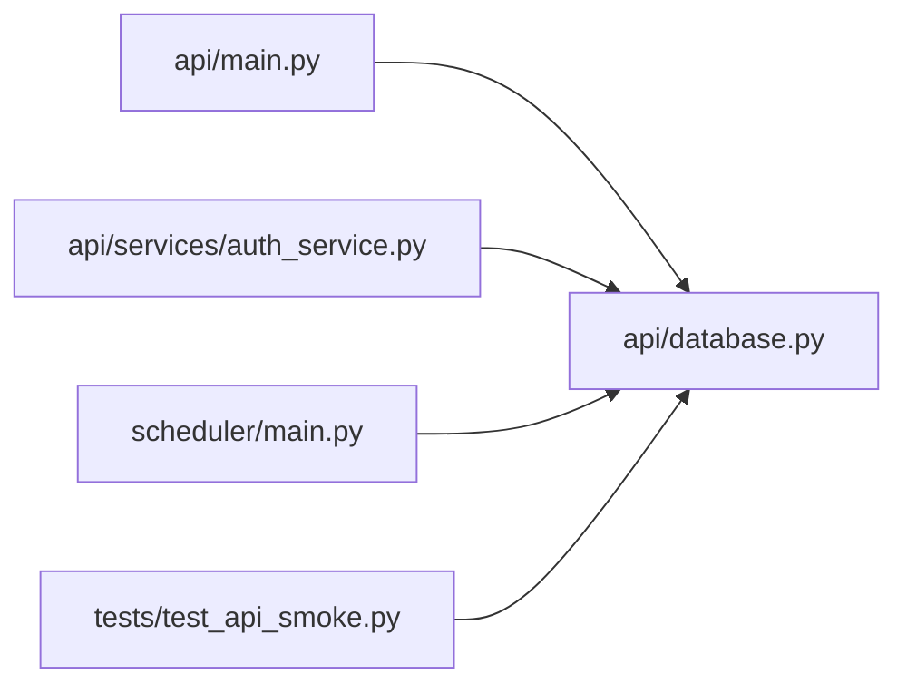

# 会话管理机制

<cite>
**本文引用的文件**
- [api/database.py](file://api/database.py)
- [api/main.py](file://api/main.py)
- [api/services/auth_service.py](file://api/services/auth_service.py)
- [scheduler/main.py](file://scheduler/main.py)
- [tests/test_api_smoke.py](file://tests/test_api_smoke.py)
</cite>

## 目录
1. [引言](#引言)
2. [项目结构](#项目结构)
3. [核心组件](#核心组件)
4. [架构总览](#架构总览)
5. [详细组件分析](#详细组件分析)
6. [依赖关系分析](#依赖关系分析)
7. [性能考量](#性能考量)
8. [故障排查指南](#故障排查指南)
9. [结论](#结论)
10. [附录](#附录)

## 引言
本文件系统性梳理 TradingAgents-AShare 的数据库会话管理机制，围绕以下目标展开：SessionLocal 工厂函数的创建与配置、get_db 依赖注入函数在 FastAPI 中的集成方式、get_db_ctx 上下文管理器的手动会话模式、会话生命周期与资源回收策略、以及在不同场景下的最佳实践（异常处理、资源清理、并发安全）。文中所有技术细节均以仓库源码为依据，并通过图示帮助读者快速建立整体认知。

## 项目结构
与数据库会话管理直接相关的核心文件如下：
- api/database.py：定义数据库引擎、会话工厂、依赖注入与上下文管理器、初始化入口等
- api/main.py：FastAPI 应用入口，广泛使用 get_db 与 get_db_ctx
- api/services/auth_service.py：服务层示例，展示如何接收并使用 db 会话
- scheduler/main.py：调度器中对 get_db_ctx 的使用示例
- tests/test_api_smoke.py：测试用例中对 get_db_ctx 的使用示例

图表来源
- [api/database.py:52-95](file://api/database.py#L52-L95)
- [api/main.py:41](file://api/main.py#L41)
- [api/services/auth_service.py:114-143](file://api/services/auth_service.py#L114-L143)
- [scheduler/main.py:70](file://scheduler/main.py#L70)
- [tests/test_api_smoke.py:19](file://tests/test_api_smoke.py#L19)

章节来源
- [api/database.py:1-120](file://api/database.py#L1-L120)
- [api/main.py:41](file://api/main.py#L41)

## 核心组件
本节聚焦于三个核心构件：SessionLocal 工厂、get_db 依赖注入、get_db_ctx 上下文管理器。

- SessionLocal 工厂
  - 基于 SQLAlchemy 的 sessionmaker 创建，绑定到 engine；关闭自动提交与自动刷新，确保显式控制事务与状态。
  - 针对 SQLite 与非 SQLite（如 PostgreSQL/MySQL）分别设置连接池参数与 WAL 模式支持。
  - 作为后续依赖注入与上下文管理器的基础。

- get_db 依赖注入
  - 以生成器形式提供 db 会话，供 FastAPI 的 Depends 注入使用。
  - 在 try/finally 中确保会话在请求结束时被关闭，避免连接泄漏。

- get_db_ctx 上下文管理器
  - 提供 with 语法的显式会话管理，适合非 FastAPI 场景（如调度器、脚本、测试）。
  - 在退出时若发生异常则回滚，否则不自动提交，保持与 SessionLocal 的一致行为。

章节来源
- [api/database.py:52-95](file://api/database.py#L52-L95)

## 架构总览
下图展示了会话管理在系统中的位置与交互：

图表来源
- [api/database.py:52-95](file://api/database.py#L52-L95)
- [api/main.py:41](file://api/main.py#L41)
- [scheduler/main.py:70](file://scheduler/main.py#L70)
- [tests/test_api_smoke.py:19](file://tests/test_api_smoke.py#L19)

## 详细组件分析

### SessionLocal 工厂与配置
- 工厂创建
  - 使用 sessionmaker(autocommit=False, autoflush=False, bind=engine) 定义 SessionLocal。
  - 该配置强调“显式事务”，即不会自动提交或刷新，需要调用方自行决定何时提交或刷新。
- 引擎与连接池
  - SQLite：启用 WAL（当目录可写时），并设置连接池大小、溢出、超时与回收周期。
  - 非 SQLite：设置更大的连接池容量以提升并发能力。
- 基类与初始化
  - Base 为 ORM 映射基类；init_db 负责建表与轻量迁移。

图表来源
- [api/database.py:14-56](file://api/database.py#L14-L56)

章节来源
- [api/database.py:14-56](file://api/database.py#L14-L56)

### get_db 依赖注入函数（FastAPI 集成）
- 作用
  - 将 db 会话注入到 FastAPI 路由函数中，简化服务层调用。
- 生命周期
  - 进入：创建 SessionLocal 实例。
  - 返回：yield 给路由处理。
  - 退出：finally 中关闭会话，避免泄漏。
- 使用场景
  - 所有 FastAPI 路由均可通过 Depends(get_db) 获取 db 会话。
  - 服务层函数可直接接收 db 参数进行查询/持久化。

图表来源
- [api/database.py:60-66](file://api/database.py#L60-L66)
- [api/main.py:41](file://api/main.py#L41)

章节来源
- [api/database.py:60-66](file://api/database.py#L60-L66)
- [api/main.py:41](file://api/main.py#L41)

### get_db_ctx 上下文管理器（手动会话模式）
- 设计目的
  - 为非 FastAPI 场景提供 with 语义的会话管理，便于统一资源回收。
- 行为特征
  - 进入：创建 SessionLocal 实例并返回。
  - 退出：若发生异常则回滚；无论是否异常均关闭会话。
- 典型使用场景
  - 调度器任务、脚本、测试用例等。

图表来源
- [api/database.py:69-89](file://api/database.py#L69-L89)

章节来源
- [api/database.py:69-89](file://api/database.py#L69-L89)

### 会话生命周期管理、自动提交与刷新
- 自动提交与刷新
  - SessionLocal 未启用自动提交与自动刷新，需显式调用 commit/flush。
- 生命周期
  - FastAPI：通过 Depends(get_db) 在请求期间持有会话，请求结束时关闭。
  - 上下文管理器：进入时创建，退出时关闭；异常时回滚。
- 并发与连接池
  - 非 SQLite 默认使用更大连接池，提升并发吞吐。
  - SQLite 在可用时启用 WAL，改善并发写入与读写性能。

章节来源
- [api/database.py:52-56](file://api/database.py#L52-L56)
- [api/database.py:42-50](file://api/database.py#L42-L50)
- [api/database.py:14-40](file://api/database.py#L14-L40)

### 实际使用示例与场景

- FastAPI 路由中使用 get_db
  - 在路由函数中通过 Depends(get_db) 获取 db，随后在服务层调用中传递该会话。
  - 示例路径参考：[api/main.py:41](file://api/main.py#L41)

- 服务层使用 db 会话
  - 服务函数接收 db 参数，执行查询/新增/更新等操作。
  - 示例路径参考：[api/services/auth_service.py:114-143](file://api/services/auth_service.py#L114-L143)

- 调度器中使用 get_db_ctx
  - 在调度器任务中使用 with get_db_ctx() 作为 db 上下文。
  - 示例路径参考：[scheduler/main.py:70](file://scheduler/main.py#L70)

- 测试中使用 get_db_ctx
  - 测试用例通过 get_db_ctx 管理会话，保证测试隔离与资源回收。
  - 示例路径参考：[tests/test_api_smoke.py:19](file://tests/test_api_smoke.py#L19)

章节来源
- [api/main.py:41](file://api/main.py#L41)
- [api/services/auth_service.py:114-143](file://api/services/auth_service.py#L114-L143)
- [scheduler/main.py:70](file://scheduler/main.py#L70)
- [tests/test_api_smoke.py:19](file://tests/test_api_smoke.py#L19)

## 依赖关系分析
- 组件耦合
  - api/main.py 与 api/database.py 存在直接导入关系，用于依赖注入与上下文管理器。
  - 业务服务层（如 auth_service）依赖 db 会话接口，但不直接依赖具体实现。
  - 调度器与测试用例通过 get_db_ctx 间接依赖 SessionLocal。
- 外部依赖
  - SQLAlchemy 引擎与会话工厂是核心外部依赖。
  - 数据库类型决定连接池与 WAL 设置策略。

图表来源
- [api/main.py:41](file://api/main.py#L41)
- [api/database.py:52-95](file://api/database.py#L52-L95)
- [api/services/auth_service.py:114-143](file://api/services/auth_service.py#L114-L143)
- [scheduler/main.py:70](file://scheduler/main.py#L70)
- [tests/test_api_smoke.py:19](file://tests/test_api_smoke.py#L19)

章节来源
- [api/main.py:41](file://api/main.py#L41)
- [api/database.py:52-95](file://api/database.py#L52-L95)
- [api/services/auth_service.py:114-143](file://api/services/auth_service.py#L114-L143)
- [scheduler/main.py:70](file://scheduler/main.py#L70)
- [tests/test_api_smoke.py:19](file://tests/test_api_smoke.py#L19)

## 性能考量
- 连接池配置
  - 非 SQLite 默认较大连接池，有助于并发请求与任务处理。
  - SQLite 在可用时启用 WAL，减少锁竞争，提升读写并发。
- 事务与刷新
  - 显式控制事务与刷新，避免频繁自动提交带来的开销。
- 资源回收
  - 通过依赖注入与上下文管理器确保会话及时关闭，降低连接泄漏风险。

章节来源
- [api/database.py:42-50](file://api/database.py#L42-L50)
- [api/database.py:14-40](file://api/database.py#L14-L40)
- [api/database.py:60-66](file://api/database.py#L60-L66)
- [api/database.py:69-89](file://api/database.py#L69-L89)

## 故障排查指南
- 常见问题
  - 会话未关闭导致连接泄漏：确认使用了 get_db 或 get_db_ctx 的 finally/close 逻辑。
  - 异常后未回滚：get_db_ctx 在异常时会回滚；若使用自管会话，请确保在异常分支显式回滚。
  - SQLite 写入阻塞：检查目录权限与 WAL 是否启用；必要时调整数据库路径。
- 排查步骤
  - 检查依赖注入与上下文管理器的使用是否正确。
  - 在服务层捕获异常并记录日志，结合会话回滚与关闭流程定位问题。
  - 对于 SQLite，确认数据库文件所在目录具备写入权限，以便 WAL 文件创建。

章节来源
- [api/database.py:60-66](file://api/database.py#L60-L66)
- [api/database.py:69-89](file://api/database.py#L69-L89)
- [api/database.py:14-40](file://api/database.py#L14-L40)

## 结论
本文件基于仓库源码对 TradingAgents-AShare 的数据库会话管理进行了系统化梳理。SessionLocal 工厂提供了统一的会话创建入口；get_db 通过 FastAPI 依赖注入实现了请求级会话管理；get_db_ctx 则为非 FastAPI 场景提供了可靠的上下文管理。三者配合，既满足了 Web 请求的高并发需求，也兼顾了脚本、调度器与测试场景的可控性与安全性。建议在实际开发中遵循“显式事务、及时关闭”的原则，并根据数据库类型合理配置连接池与 WAL，以获得更佳的性能与稳定性。

## 附录
- 最佳实践清单
  - 显式提交/回滚：在业务逻辑中明确提交或回滚，避免隐式行为。
  - 及时关闭：确保每个会话在使用结束后被关闭，优先使用依赖注入或上下文管理器。
  - 异常处理：在服务层捕获异常并进行回滚与日志记录，防止脏数据。
  - 并发安全：根据部署环境选择合适的连接池参数；SQLite 启用 WAL 以提升并发写入。
  - 资源隔离：测试与调度器中使用 get_db_ctx，确保资源在异常情况下也能正确回收。