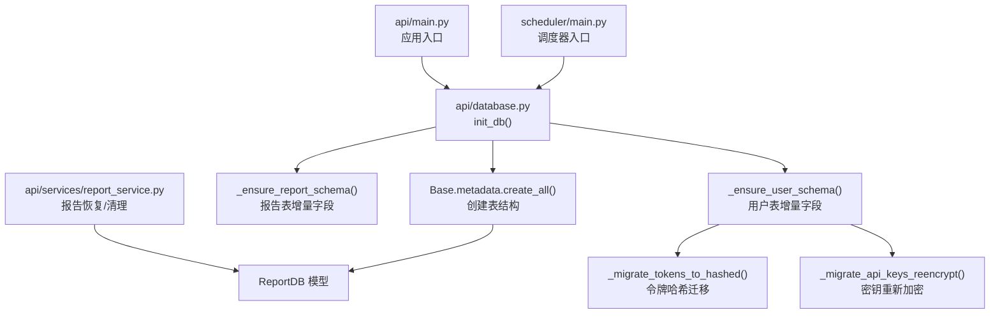
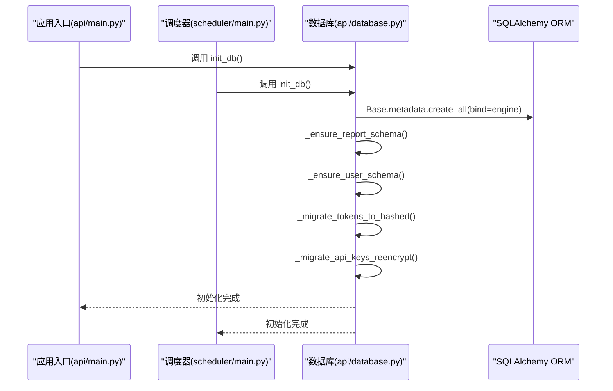
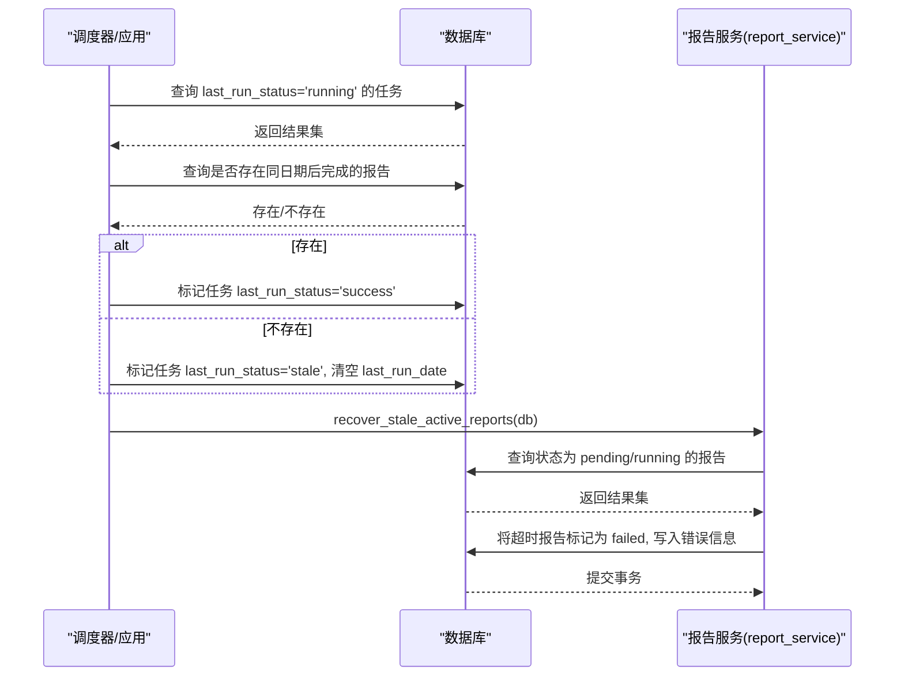
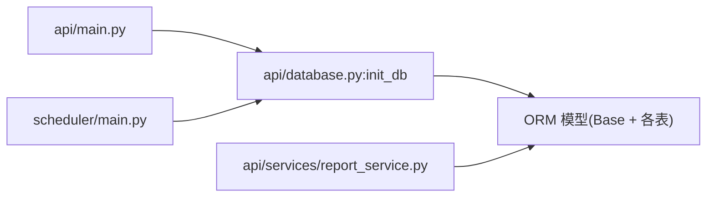

# 数据库初始化

<cite>
**本文引用的文件**
- [api/database.py](file://api/database.py)
- [api/main.py](file://api/main.py)
- [scheduler/main.py](file://scheduler/main.py)
- [api/services/report_service.py](file://api/services/report_service.py)
- [tests/test_report_recovery.py](file://tests/test_report_recovery.py)
</cite>

## 目录
1. [简介](#简介)
2. [项目结构](#项目结构)
3. [核心组件](#核心组件)
4. [架构总览](#架构总览)
5. [详细组件分析](#详细组件分析)
6. [依赖关系分析](#依赖关系分析)
7. [性能考量](#性能考量)
8. [故障排除指南](#故障排除指南)
9. [结论](#结论)
10. [附录](#附录)

## 简介
本文件聚焦于 TradingAgents-AShare 的数据库初始化流程，系统化阐述以下主题：
- init_db 函数如何通过 Base.metadata.create_all 创建表结构
- 报告与用户表的动态字段补全策略（_ensure_report_schema、_ensure_user_schema）
- 向后兼容性保障与现有数据迁移（令牌哈希迁移、API 密钥重新加密）
- 数据库版本管理与模式升级流程
- 初始化失败的故障排除与常见问题
- 数据库重置与重建步骤

## 项目结构
数据库相关代码主要位于 api/database.py，应用启动时在 api/main.py 和调度器 scheduler/main.py 中调用初始化；报告服务在 api/services/report_service.py 中对报告状态进行恢复与清理。

图表来源
- [api/main.py](file://api/main.py)
- [scheduler/main.py](file://scheduler/main.py)
- [api/database.py](file://api/database.py)
- [api/services/report_service.py](file://api/services/report_service.py)

章节来源
- [api/database.py](file://api/database.py)
- [api/main.py](file://api/main.py)
- [scheduler/main.py](file://scheduler/main.py)

## 核心组件
- 数据库引擎与会话：基于 SQLAlchemy 创建引擎与会话工厂，支持 SQLite/WAL 优化与 PostgreSQL/MySQL 连接池。
- 基类与模型：Base 作为所有 ORM 模型的基类，ReportDB、UserDB、UserLLMConfigDB 等模型定义表结构。
- 初始化入口：init_db 负责创建表并执行增量字段与迁移逻辑。
- 动态补全：_ensure_report_schema 与 _ensure_user_schema 在无迁移工具的情况下为既有部署补充字段。
- 安全迁移：_migrate_tokens_to_hashed 将明文令牌迁移到 HMAC-SHA256 哈希存储；_migrate_api_keys_reencrypt 在密钥变更时重新加密用户敏感信息。

章节来源
- [api/database.py](file://api/database.py)

## 架构总览
数据库初始化的整体流程如下：

图表来源
- [api/main.py](file://api/main.py)
- [scheduler/main.py](file://scheduler/main.py)
- [api/database.py](file://api/database.py)

## 详细组件分析

### init_db 表创建机制
- 使用 Base.metadata.create_all 统一创建所有已声明的表，确保模型与数据库一致。
- 针对 SQLite，启用 WAL 模式以提升并发写入性能；对非 SQLite 使用连接池参数优化并发能力。
- 初始化完成后，立即执行增量字段补全与安全迁移，保证既有部署的平滑升级。

章节来源
- [api/database.py](file://api/database.py)

### 报告表动态字段补全（_ensure_report_schema）
- 通过 PRAGMA table_info 查询 reports 表当前列集合，逐项检查是否缺失方向、状态、错误、分析师轨迹、各类专项报告等字段。
- 若缺失则使用 ALTER TABLE 添加相应列（含 JSON 类型），避免破坏现有数据。
- 异常会被捕获并记录日志，不影响整体初始化流程。

```mermaid
flowchart TD
Start(["进入 _ensure_report_schema"]) --> Txn["开启事务(conn)"]
Txn --> Query["查询 reports 表列名(PRAGMA table_info)"]
Query --> CheckDir{"是否存在 direction 列?"}
CheckDir --> |否| AddDir["添加 direction VARCHAR(50)"]
CheckDir --> |是| Next1["继续检查"]
AddDir --> Next1
Next1 --> CheckStatus{"是否存在 status 列?"}
CheckStatus --> |否| AddStatus["添加 status VARCHAR(20) DEFAULT 'completed'"]
CheckStatus --> |是| Next2["继续检查"]
AddStatus --> Next2
Next2 --> CheckErr{"是否存在 error 列?"}
CheckErr --> |否| AddErr["添加 error TEXT"]
CheckErr --> |是| Next3["继续检查"]
AddErr --> Next3
Next3 --> CheckTraces{"是否存在 analyst_traces 列?"}
CheckTraces --> |否| AddTraces["添加 analyst_traces JSON"]
CheckTraces --> |是| Next4["继续检查"]
AddTraces --> Next4
Next4 --> CheckMacro{"是否存在 macro_report 列?"}
CheckMacro --> |否| AddMacro["添加 macro_report TEXT"]
CheckMacro --> |是| Next5["继续检查"]
AddMacro --> Next5
Next5 --> CheckSmart{"是否存在 smart_money_report 列?"}
CheckSmart --> |否| AddSmart["添加 smart_money_report TEXT"]
CheckSmart --> |是| Next6["继续检查"]
AddSmart --> Next6
Next6 --> CheckGame{"是否存在 game_theory_report 列?"}
CheckGame --> |否| AddGame["添加 game_theory_report TEXT"]
CheckGame --> |是| Next7["继续检查"]
AddGame --> Next7
Next7 --> CheckVP{"是否存在 volume_price_report 列?"}
CheckVP --> |否| AddVP["添加 volume_price_report TEXT"]
CheckVP --> |是| Done["结束"]
AddVP --> Done
```

图表来源
- [api/database.py](file://api/database.py)

章节来源
- [api/database.py](file://api/database.py)

### 用户表与 LLM 配置动态字段补全（_ensure_user_schema）
- 对 users 表：若缺失 last_login_ip、email_report_enabled、wecom_report_enabled 等列，则添加对应列。
- 对 user_llm_configs 表：若缺失 wecom_webhook_encrypted、default_analysts 等列，则添加对应列。
- 成功补全后触发安全迁移：
  - 令牌哈希迁移：为 user_tokens 表添加 token_hint 并将明文 ta-sk- 开头的令牌迁移为 HMAC-SHA256 哈希，同时保留后四位作为提示。
  - API 密钥重新加密：当自定义密钥配置存在时，尝试用当前密钥解密用户密文；若失败回退到默认密钥，成功后再用当前密钥重新加密并写回。

```mermaid
flowchart TD
UStart(["进入 _ensure_user_schema"]) --> UTxn["开启事务(conn)"]
UTxn --> UQUsers["查询 users 表列名(PRAGMA table_info)"]
UQUsers --> UCheckIP{"是否存在 last_login_ip?"}
UCheckIP --> |否| UAddIP["添加 last_login_ip VARCHAR(45)"]
UCheckIP --> |是| UNext1["继续检查"]
UAddIP --> UNext1
UNext1 --> UCheckEmail{"是否存在 email_report_enabled?"}
UCheckEmail --> |否| UAddEmail["添加 email_report_enabled BOOLEAN NOT NULL DEFAULT 1"]
UCheckEmail --> |是| UNext2["继续检查"]
UAddEmail --> UNext2
UNext2 --> UCheckWeCom{"是否存在 wecom_report_enabled?"}
UCheckWeCom --> |否| UAddWeCom["添加 wecom_report_enabled BOOLEAN NOT NULL DEFAULT 1"]
UCheckWeCom --> |是| UNext3["继续检查"]
UAddWeCom --> UNext3
UNext3 --> UQLLM["查询 user_llm_configs 表列名(PRAGMA table_info)"]
UQLLM --> UCheckHook{"是否存在 wecom_webhook_encrypted?"}
UCheckHook --> |否| UAddHook["添加 wecom_webhook_encrypted TEXT"]
UCheckHook --> |是| UNext4["继续检查"]
UAddHook --> UNext4
UNext4 --> UCheckAnalysts{"是否存在 default_analysts?"}
UCheckAnalysts --> |否| UAddAnalysts["添加 default_analysts TEXT"]
UCheckAnalysts --> |是| UDone["结束"]
UAddAnalysts --> UDone
UDone --> M1["_migrate_tokens_to_hashed()"]
M1 --> M2["_migrate_api_keys_reencrypt()"]
M2 --> UEnd(["完成"])
```

图表来源
- [api/database.py](file://api/database.py)

章节来源
- [api/database.py](file://api/database.py)

### 报告状态恢复与清理（运行时）
- 应用启动或调度器重启时，会对“运行中”状态的任务进行恢复：若存在同时间点之后已完成的报告，则标记为成功；否则标记为陈旧并清空上次运行时间。
- 对活动中的报告进行扫描，将长时间未完成的报告标记为失败，保障系统一致性。

图表来源
- [scheduler/main.py](file://scheduler/main.py)
- [api/services/report_service.py](file://api/services/report_service.py)

章节来源
- [scheduler/main.py](file://scheduler/main.py)
- [api/services/report_service.py](file://api/services/report_service.py)

## 依赖关系分析
- 入口依赖：api/main.py 与 scheduler/main.py 在启动阶段调用 init_db，确保数据库可用。
- 模型依赖：ReportDB、UserDB、UserLLMConfigDB 等模型继承自 Base，由 create_all 统一创建。
- 运行时依赖：报告服务在运行期对报告状态进行恢复与清理，依赖 ReportDB 模型与数据库连接。

图表来源
- [api/main.py](file://api/main.py)
- [scheduler/main.py](file://scheduler/main.py)
- [api/database.py](file://api/database.py)
- [api/services/report_service.py](file://api/services/report_service.py)

章节来源
- [api/main.py](file://api/main.py)
- [scheduler/main.py](file://scheduler/main.py)
- [api/database.py](file://api/database.py)
- [api/services/report_service.py](file://api/services/report_service.py)

## 性能考量
- SQLite：启用 WAL 模式以提升并发写入；连接池大小设置为 10（SQLite）；线程安全连接参数。
- PostgreSQL/MySQL：连接池大小 20，溢出 10，超时 30 秒，回收周期 3600 秒，适合高并发场景。
- 初始化阶段建议在低负载时段执行，避免大量 ALTER TABLE 操作影响在线业务。

章节来源
- [api/database.py](file://api/database.py)

## 故障排除指南
- 初始化失败
  - 现象：应用启动时报错，无法创建表或字段。
  - 排查要点：
    - 检查 DATABASE_URL 环境变量是否正确（默认 SQLite 路径 ./tradingagents.db）。
    - 确认数据库目录可写（SQLite WAL 需要 -shm/-wal 文件）。
    - 查看日志中“Failed to ensure ... schema”相关错误，定位具体字段或权限问题。
  - 处理建议：
    - 手动执行 ALTER TABLE 为缺失字段添加列，再重启应用。
    - 如涉及权限问题，修正文件权限或更换数据库路径。

- 令牌或密钥异常
  - 现象：登录失败或第三方通知发送异常。
  - 排查要点：
    - 检查 user_tokens 是否存在明文 ta-sk- 开头的令牌，确认是否完成哈希迁移。
    - 检查 user_llm_configs 的加密字段是否为空或解密失败。
  - 处理建议：
    - 重新生成令牌并保存，触发迁移流程。
    - 更换 TA_APP_SECRET_KEY 后，系统会自动尝试用新密钥解密并重新加密。

- 报告状态不一致
  - 现象：报告长时间处于 pending/running。
  - 排查要点：
    - 观察调度器启动日志中的“Reset stale 'running' tasks”统计。
    - 使用报告服务的恢复接口将超时报告标记为失败。
  - 处理建议：
    - 重启应用或调度器，触发状态恢复流程。
    - 手动清理无效报告或重试分析任务。

章节来源
- [api/database.py](file://api/database.py)
- [api/services/report_service.py](file://api/services/report_service.py)
- [scheduler/main.py](file://scheduler/main.py)

## 结论
本项目的数据库初始化采用“统一建表 + 动态补全 + 安全迁移”的策略，在不引入外部迁移工具的前提下，实现了对既有部署的平滑升级与向后兼容。通过运行时的状态恢复与清理，进一步提升了系统的健壮性。建议在生产环境遵循“低峰期初始化、严格权限控制、定期备份”的最佳实践。

## 附录

### 数据库重置与重建步骤
- 备份现有数据库（SQLite 为 .db 文件，其他数据库导出 SQL 或使用备份工具）。
- 删除或重命名现有数据库文件/库。
- 重新启动应用或调度器，init_db 将自动创建所有表结构。
- 如需恢复历史数据，请在重建后导入备份数据，并确保字段补全与迁移逻辑正常执行。

章节来源
- [api/database.py](file://api/database.py)

### 测试中的初始化示例
- 单元测试中使用内存 SQLite 并直接调用 Base.metadata.create_all，验证模型创建与基本查询行为。

章节来源
- [tests/test_report_recovery.py](file://tests/test_report_recovery.py)