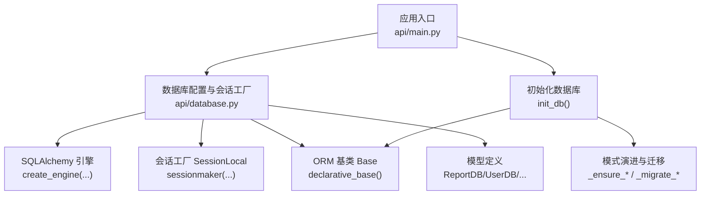
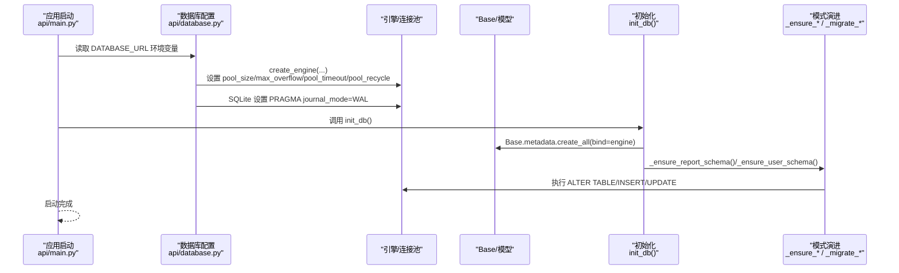
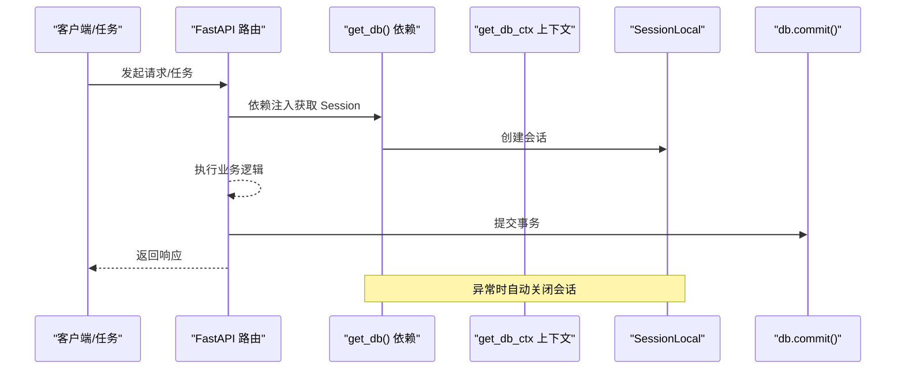
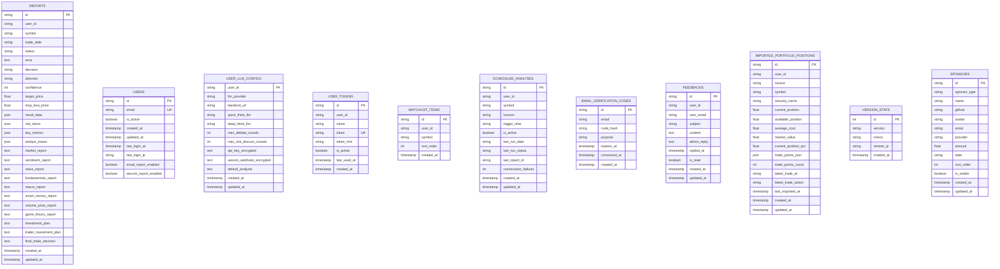
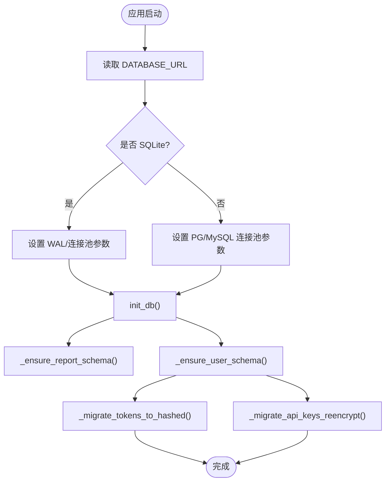
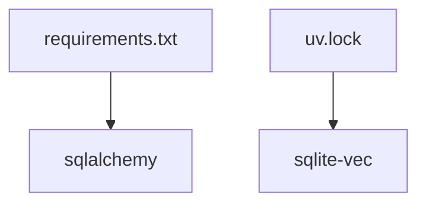

# 数据库架构

<cite>
**本文引用的文件**
- [api/database.py](file://api/database.py)
- [api/main.py](file://api/main.py)
- [requirements.txt](file://requirements.txt)
- [uv.lock](file://uv.lock)
</cite>

## 目录
1. [简介](#简介)
2. [项目结构](#项目结构)
3. [核心组件](#核心组件)
4. [架构总览](#架构总览)
5. [组件详解](#组件详解)
6. [依赖关系分析](#依赖关系分析)
7. [性能与优化](#性能与优化)
8. [故障排除指南](#故障排除指南)
9. [结论](#结论)
10. [附录：配置与迁移清单](#附录配置与迁移清单)

## 简介
本文件系统化梳理 TradingAgents-AShare 的数据库架构，覆盖以下主题：
- 数据库连接配置与引擎参数
- 会话管理机制（依赖注入与上下文管理）
- 连接池设置与不同数据库类型（SQLite 与 PostgreSQL/MySQL）的差异化策略
- 初始化流程、表结构定义与模式演进机制
- 数据库迁移策略、版本兼容性与向后兼容保障
- 事务处理、并发控制与数据一致性保证
- 性能调优建议与常见问题排查

## 项目结构
数据库相关的核心实现集中在后端 API 模块，采用 SQLAlchemy ORM 定义模型与会话管理，并在应用启动时完成数据库初始化。

图表来源
- [api/main.py:251](file://api/main.py#L251)
- [api/database.py:52](file://api/database.py#L52)
- [api/database.py:91](file://api/database.py#L91)

章节来源
- [api/database.py:11-56](file://api/database.py#L11-L56)
- [api/main.py:251](file://api/main.py#L251)

## 核心组件
- 数据库 URL 与引擎创建：根据环境变量选择 SQLite 或 PostgreSQL/MySQL，并分别设置连接池参数与 SQLite 特定 PRAGMA。
- 会话工厂与依赖注入：提供 FastAPI 依赖注入函数与手动上下文管理器，确保每个请求或任务拥有独立且受控的数据库会话。
- 初始化与模式演进：首次启动创建所有表；对既有部署进行轻量级列补全与安全迁移。
- 模型集合：涵盖报告、用户、令牌、计划任务、监控统计等业务实体。

章节来源
- [api/database.py:11-56](file://api/database.py#L11-L56)
- [api/database.py:60-89](file://api/database.py#L60-L89)
- [api/database.py:91-143](file://api/database.py#L91-L143)
- [api/database.py:242-481](file://api/database.py#L242-L481)

## 架构总览
下图展示数据库层在应用生命周期中的位置与交互：

图表来源
- [api/main.py:251](file://api/main.py#L251)
- [api/database.py:11-56](file://api/database.py#L11-L56)
- [api/database.py:91-143](file://api/database.py#L91-L143)

## 组件详解

### 1) 连接配置与引擎参数
- 默认数据库 URL：优先从环境变量读取，未设置时默认使用 SQLite 文件路径。
- SQLite 参数：
  - 连接线程：允许跨线程访问（注意并发注意事项）。
  - 连接池：较小规模（适合单机/开发场景）。
  - 超时与回收：超时与回收时间用于避免长时间占用连接。
  - WAL 模式：在父目录可写时启用 WAL，提升并发读写能力。
- PostgreSQL/MySQL 参数：
  - 使用更大连接池以支持更高并发。
  - 更短的连接超时与回收周期，适应云数据库特性。

章节来源
- [api/database.py:11-50](file://api/database.py#L11-L50)

### 2) 会话管理机制
- 依赖注入：
  - 提供生成器函数，作为 FastAPI 依赖项自动创建与关闭会话。
- 上下文管理：
  - 提供手动上下文管理器，异常时自动回滚并关闭会话，确保资源释放。
- 事务提交：
  - 多处服务逻辑显式调用提交，保证业务原子性。

图表来源
- [api/database.py:60-66](file://api/database.py#L60-L66)
- [api/database.py:69-89](file://api/database.py#L69-L89)

章节来源
- [api/database.py:60-89](file://api/database.py#L60-L89)

### 3) 初始化流程与表结构
- 初始化步骤：
  - 创建所有 ORM 表。
  - 对报告与用户表执行轻量级列补全。
- 表结构概览（关键字段）：
  - 报告表：任务状态、错误信息、决策与指标、JSON 结果与分报告文本。
  - 用户表：邮箱唯一索引、登录信息与通知开关。
  - LLM 配置表：加密存储的密钥与 Webhook。
  - 令牌表：带提示的安全存储。
  - 计划任务表：每日分析任务与失败计数。
  - 其他：赞助商、反馈、自选股、导入组合等。

图表来源
- [api/database.py:242-481](file://api/database.py#L242-L481)

章节来源
- [api/database.py:91-95](file://api/database.py#L91-L95)
- [api/database.py:242-481](file://api/database.py#L242-L481)

### 4) 模式演进与迁移策略
- 轻量级列补全：针对报告与用户表，按需添加新列，避免完整迁移。
- 安全迁移：
  - 将明文 API 令牌迁移到基于密钥的哈希存储，并保留提示后缀便于识别。
  - 当应用密钥变更时，尝试解密旧密文，若成功则用当前密钥重新加密并回写。
- 启动时检查：通过最小代价的 SQL 查询判断是否需要迁移，避免重复操作。

图表来源
- [api/database.py:91-143](file://api/database.py#L91-L143)
- [api/database.py:146-240](file://api/database.py#L146-L240)

章节来源
- [api/database.py:98-143](file://api/database.py#L98-L143)
- [api/database.py:146-240](file://api/database.py#L146-L240)

### 5) 事务处理、并发控制与一致性
- 事务提交：服务层广泛使用显式提交，确保业务操作的原子性。
- 并发控制：
  - SQLite：启用 WAL 模式提升并发读写；连接池较小，适合单机/低并发。
  - PostgreSQL/MySQL：较大连接池与更短超时，适配高并发与云数据库特性。
- 一致性保障：
  - 唯一约束：如用户邮箱、令牌唯一、用户+标的唯一等。
  - 时间戳：统一 UTC 时间，便于审计与排序。
  - 错误记录：失败时持久化错误信息，便于追踪与恢复。

章节来源
- [api/database.py:35-40](file://api/database.py#L35-L40)
- [api/database.py:42-50](file://api/database.py#L42-L50)
- [api/database.py:386-481](file://api/database.py#L386-L481)

## 依赖关系分析
- SQLAlchemy：ORM 与引擎创建的核心依赖。
- 运行时依赖：SQLite 向量扩展（sqlite-vec）在锁定期文件中声明，可能用于向量检索或相似度计算（具体使用取决于上层模块）。

图表来源
- [requirements.txt:19](file://requirements.txt#L19)
- [uv.lock:2591](file://uv.lock#L2591)

章节来源
- [requirements.txt:19](file://requirements.txt#L19)
- [uv.lock:2591](file://uv.lock#L2591)

## 性能与优化
- 连接池参数建议
  - SQLite（开发/单机）：保持现有小连接池；如需更高并发，考虑外部进程或切换到云数据库。
  - PostgreSQL/MySQL：根据并发与 QPS 调整 pool_size 与 max_overflow；缩短 pool_timeout 以快速回收闲置连接。
- WAL 模式
  - 在 SQLite 中启用 WAL 可显著提升并发读写；确保数据库目录具备写权限。
- 事务与批量写入
  - 将多个写操作合并到单个事务中，减少提交次数。
- 索引与查询
  - 对高频过滤字段（如 symbol、user_id、created_at）建立索引；避免 N+1 查询。
- 日志与监控
  - 结合数据库慢查询日志与应用埋点，定位热点表与瓶颈。

## 故障排除指南
- 启动失败或无法创建表
  - 检查 DATABASE_URL 是否正确；SQLite 路径是否存在且可写。
  - 查看初始化日志，确认 init_db() 是否执行。
- SQLite 写入阻塞或死锁
  - 确认 WAL 已启用；检查连接池大小与超时设置。
  - 避免在同一进程中长时间持有会话。
- 迁移失败或重复迁移
  - 关注模式演进函数的幂等性；确保异常时会话正确关闭与回滚。
- 令牌或密钥相关问题
  - 若密钥变更导致旧密文无法解密，系统会尝试回退密钥；必要时清理或重建相关记录。
- 事务未提交
  - 检查服务层是否遗漏提交；确保异常路径有回滚与关闭会话的逻辑。

章节来源
- [api/database.py:91-143](file://api/database.py#L91-L143)
- [api/database.py:60-89](file://api/database.py#L60-L89)

## 结论
该数据库架构以 SQLAlchemy 为核心，结合 FastAPI 依赖注入与上下文管理，提供了清晰的会话生命周期与一致的事务语义。通过差异化连接池与 SQLite WAL 模式，兼顾了开发/单机场景与生产数据库的并发需求。初始化与模式演进机制在不中断服务的前提下实现了平滑升级，配合安全迁移策略提升了数据安全性与可维护性。

## 附录：配置与迁移清单
- 必备环境变量
  - DATABASE_URL：数据库连接字符串（默认 SQLite）
  - TA_APP_SECRET_KEY：应用密钥（用于安全迁移与加密）
- 连接池与引擎参数
  - SQLite：pool_size、max_overflow、pool_timeout、pool_recycle
  - PostgreSQL/MySQL：pool_size、max_overflow、pool_timeout、pool_recycle
- 初始化与迁移
  - init_db()：创建表与轻量级列补全
  - _ensure_report_schema() / _ensure_user_schema()：按需新增列
  - _migrate_tokens_to_hashed()：令牌哈希迁移
  - _migrate_api_keys_reencrypt()：密钥变更后的重加密
- 建议实践
  - 生产环境优先使用 PostgreSQL/MySQL 并调整连接池参数
  - 对高频写入表增加索引与限制事务粒度
  - 定期备份数据库，验证迁移脚本的幂等性与回滚路径