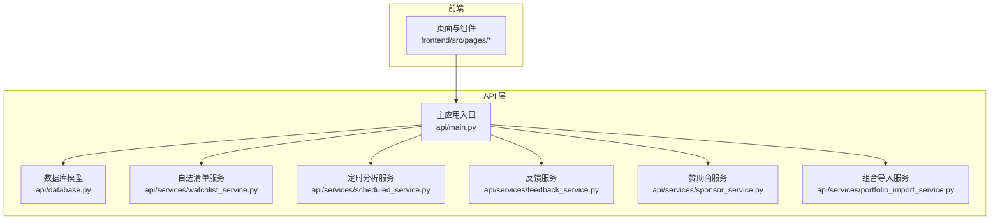
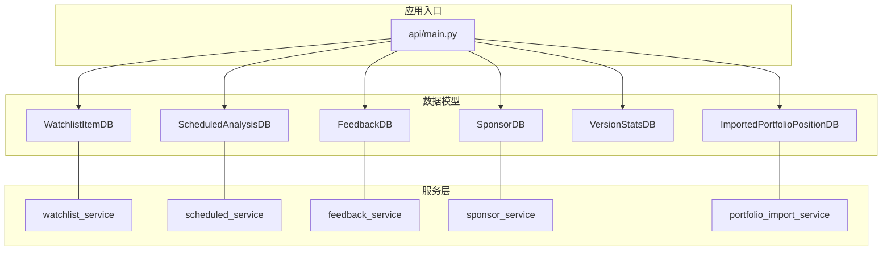
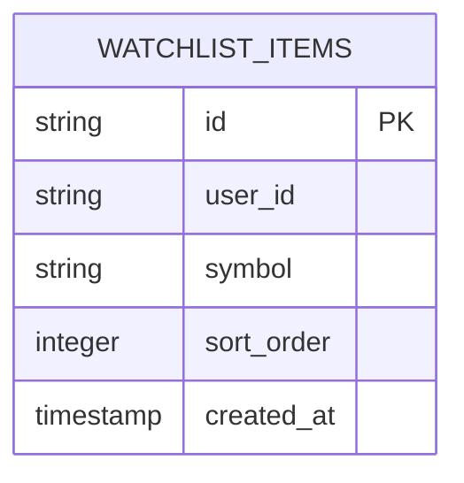
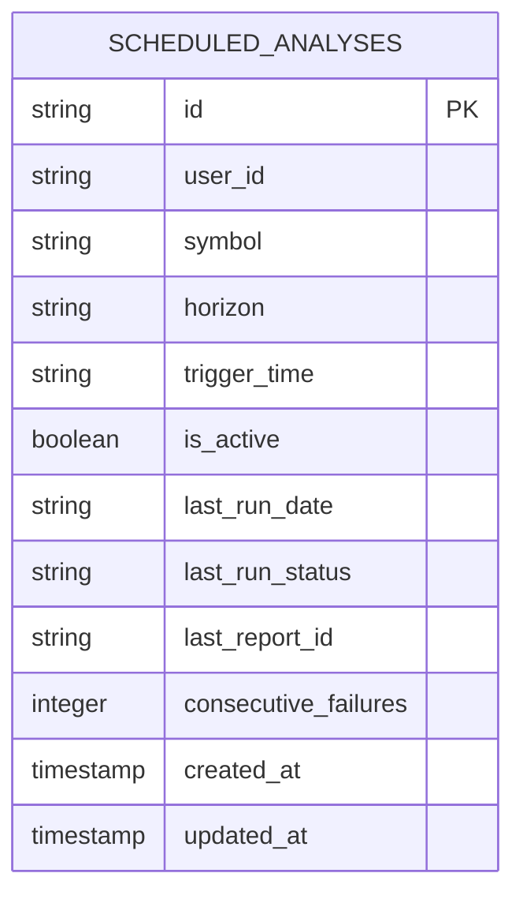
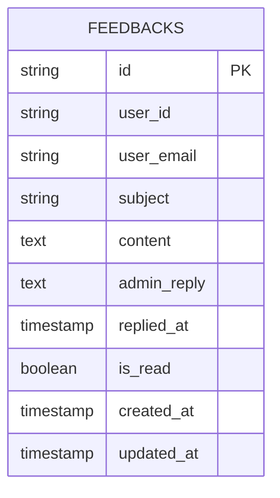
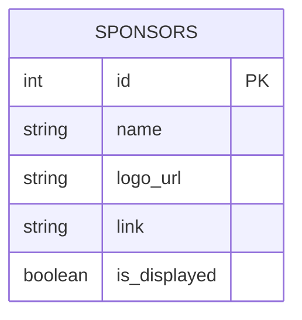
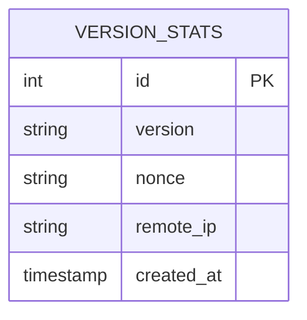
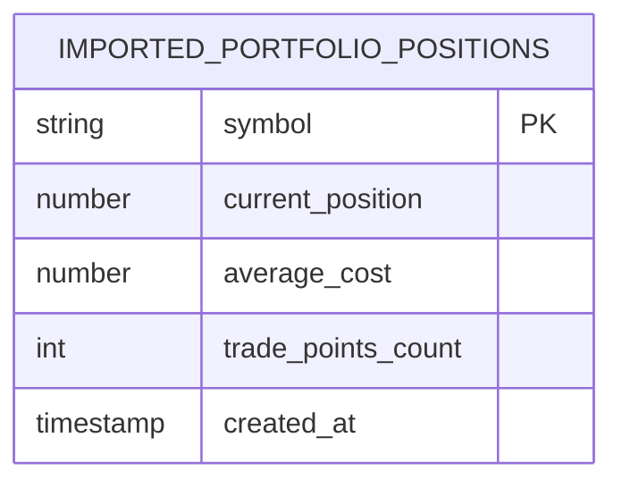
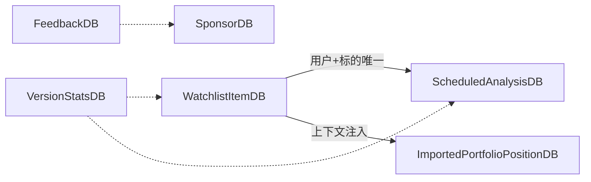

# 业务功能数据模型

<cite>
**本文引用的文件**
- [api/database.py](file://api/database.py)
- [api/services/watchlist_service.py](file://api/services/watchlist_service.py)
- [api/services/scheduled_service.py](file://api/services/scheduled_service.py)
- [api/services/feedback_service.py](file://api/services/feedback_service.py)
- [api/services/sponsor_service.py](file://api/services/sponsor_service.py)
- [api/services/portfolio_import_service.py](file://api/services/portfolio_import_service.py)
- [api/main.py](file://api/main.py)
</cite>

## 目录
1. [简介](#简介)
2. [项目结构](#项目结构)
3. [核心组件](#核心组件)
4. [架构总览](#架构总览)
5. [详细组件分析](#详细组件分析)
6. [依赖关系分析](#依赖关系分析)
7. [性能考量](#性能考量)
8. [故障排查指南](#故障排查指南)
9. [结论](#结论)
10. [附录](#附录)

## 简介
本文件聚焦 TradingAgents-AShare 的业务功能数据模型，系统性梳理并解释以下关键模型：  
- WatchlistItemDB 自选清单模型  
- ScheduledAnalysisDB 定时分析模型  
- FeedbackDB 反馈模型  
- SponsorDB 赞助商模型  
- VersionStatsDB 版本统计模型  
- ImportedPortfolioPositionDB 导入组合持仓模型  

我们将从数据结构、业务规则、约束与索引、状态流转与调度字段、以及与服务层的交互方式等维度进行深入解析，并给出典型使用场景与最佳实践。

## 项目结构
围绕业务数据模型，后端采用 SQLAlchemy ORM 映射到 PostgreSQL 表，服务层通过统一的数据库会话进行 CRUD 操作；前端页面通过 API 与后端交互，实现用户行为与数据持久化的闭环。

图示来源
- [api/database.py:376-466](file://api/database.py#L376-L466)
- [api/services/watchlist_service.py](file://api/services/watchlist_service.py)
- [api/services/scheduled_service.py](file://api/services/scheduled_service.py)
- [api/services/feedback_service.py](file://api/services/feedback_service.py)
- [api/services/sponsor_service.py](file://api/services/sponsor_service.py)
- [api/services/portfolio_import_service.py](file://api/services/portfolio_import_service.py)
- [api/main.py:4083-4093](file://api/main.py#L4083-L4093)

章节来源
- [api/database.py:376-466](file://api/database.py#L376-L466)
- [api/main.py:4083-4093](file://api/main.py#L4083-L4093)

## 核心组件
本节对六大业务模型逐一进行结构与业务规则说明，并标注其在系统中的作用边界。

- WatchlistItemDB（自选清单）
  - 去重约束：用户+标的唯一（UniqueConstraint），防止重复添加同一标的
  - 排序机制：sort_order 字段用于维护用户自定义顺序
  - 关键字段：user_id、symbol、sort_order、created_at
  - 支撑功能：用户自选列表管理、排序展示、去重校验

- ScheduledAnalysisDB（定时分析）
  - 调度字段：horizon（时间尺度）、trigger_time（触发时刻）、is_active（开关）
  - 状态跟踪：last_run_date、last_run_status、consecutive_failures
  - 关联输出：last_report_id 关联报告生成链路
  - 去重约束：用户+标的唯一（UniqueConstraint）
  - 支撑功能：每日定时任务编排、失败重试计数、运行状态回写

- FeedbackDB（反馈）
  - 回复机制：admin_reply 记录管理员回复内容，replied_at 记录回复时间
  - 读取状态：is_read 标识是否已读，默认 False
  - 关键字段：user_id、user_email、subject、content、admin_reply、replied_at、is_read
  - 支撑功能：用户反馈收集、管理员回复、已读未读状态管理

- SponsorDB（赞助商）
  - 管理维度：后台管理的赞助商记录，支持展示控制与上下线
  - 关键字段：名称、Logo、链接、展示状态等（具体字段以实际表结构为准）
  - 支撑功能：赞助商信息集中管理、前端展示控制

- VersionStatsDB（版本统计）
  - 匿名化策略：仅记录版本号、随机 nonce、IP 索引列，不存储可识别身份的信息
  - 时间戳：created_at 记录统计时间
  - 支撑功能：版本使用分布统计、匿名化上报

- ImportedPortfolioPositionDB（导入组合持仓）
  - 数据来源：用户导入的组合当前持仓快照及最近交易点
  - 关键字段：symbol、current_position、average_cost、trade_points_count 等
  - 支撑功能：与自选清单结合，为分析提供“已导入”上下文标记与成本/仓位信息

章节来源
- [api/database.py:376-466](file://api/database.py#L376-L466)

## 架构总览
下图展示了业务模型与服务层之间的交互关系，以及与前端页面的数据流。

图示来源
- [api/database.py:376-466](file://api/database.py#L376-L466)
- [api/services/watchlist_service.py](file://api/services/watchlist_service.py)
- [api/services/scheduled_service.py](file://api/services/scheduled_service.py)
- [api/services/feedback_service.py](file://api/services/feedback_service.py)
- [api/services/sponsor_service.py](file://api/services/sponsor_service.py)
- [api/services/portfolio_import_service.py](file://api/services/portfolio_import_service.py)
- [api/main.py:4083-4093](file://api/main.py#L4083-L4093)

## 详细组件分析

### WatchlistItemDB 自选清单模型
- 结构要点
  - 主键：id（UUID 字符串）
  - 用户索引：user_id（索引）
  - 唯一约束：user_id + symbol
  - 排序字段：sort_order
  - 时间戳：created_at
- 业务逻辑
  - 去重：同一用户不可重复添加相同 symbol
  - 排序：按 sort_order 升序返回，支持拖拽重排
  - 查询：按 user_id 过滤，返回完整列表
- 典型使用场景
  - 用户添加自选：校验唯一约束，插入记录
  - 用户删除自选：按 user_id + symbol 删除
  - 列表展示：按 user_id 查询并按 sort_order 排序
  - 批量重排：更新多个条目的 sort_order
- 数据完整性与规则
  - 非空约束：user_id、symbol
  - 唯一约束：user_id + symbol
  - 排序一致性：建议在更新排序时使用事务保证原子性

图示来源
- [api/database.py:386-398](file://api/database.py#L386-L398)

章节来源
- [api/database.py:386-398](file://api/database.py#L386-L398)

### ScheduledAnalysisDB 定时分析模型
- 结构要点
  - 主键：id（UUID 字符串）
  - 用户索引：user_id（索引）
  - 唯一约束：user_id + symbol
  - 调度字段：horizon（如 short/medium/long）、trigger_time（HH:MM）
  - 状态字段：is_active、last_run_date、last_run_status、consecutive_failures
  - 关联字段：last_report_id
  - 时间戳：created_at、updated_at
- 业务逻辑
  - 任务开关：is_active 控制是否启用定时分析
  - 触发时间：trigger_time 决定每日执行时刻
  - 成功/失败：last_run_status 记录上次运行结果，consecutive_failures 统计连续失败次数
  - 去重：同一用户同一 symbol 仅允许一个计划任务
- 典型使用场景
  - 新建定时分析：设置 horizon、trigger_time、is_active
  - 更新状态：运行后回写 last_run_date、last_run_status、last_report_id
  - 失败处理：consecutive_failures 达阈值后降级或通知
- 数据完整性与规则
  - 非空：user_id、symbol
  - 唯一：user_id + symbol
  - 默认值：horizon 默认短周期、trigger_time 默认 20:00、is_active 默认 True

图示来源
- [api/database.py:400-418](file://api/database.py#L400-L418)

章节来源
- [api/database.py:400-418](file://api/database.py#L400-L418)

### FeedbackDB 反馈模型
- 结构要点
  - 主键：id（UUID 字符串）
  - 用户索引：user_id（索引）
  - 关键字段：user_email、subject、content
  - 回复字段：admin_reply、replied_at
  - 状态字段：is_read（默认 False）
  - 时间戳：created_at、updated_at
- 业务逻辑
  - 提交反馈：写入 user_id、user_email、subject、content
  - 管理员回复：写入 admin_reply 并设置 replied_at
  - 已读管理：首次查看或后续操作可将 is_read 设为 True
- 典型使用场景
  - 用户提交问题：创建新记录
  - 管理员批量处理：查询未回复/未读反馈
  - 前端展示：区分“待回复”“已回复”“已读/未读”
- 数据完整性与规则
  - 非空：user_id、user_email、subject、content
  - 默认：is_read 默认 False

图示来源
- [api/database.py:438-453](file://api/database.py#L438-L453)

章节来源
- [api/database.py:438-453](file://api/database.py#L438-L453)

### SponsorDB 赞助商模型
- 结构要点
  - 表名：sponsors
  - 字段：名称、Logo、链接、展示状态等（以实际表结构为准）
- 业务逻辑
  - 后台管理：增删改查赞助商信息
  - 展示控制：根据状态决定是否在前端展示
- 典型使用场景
  - 后台录入赞助商资料
  - 前端按状态筛选并渲染赞助商列表
- 数据完整性与规则
  - 名称/链接非空校验
  - 展示状态布尔值约束

图示来源
- [api/database.py:420-439](file://api/database.py#L420-L439)

章节来源
- [api/database.py:420-439](file://api/database.py#L420-L439)

### VersionStatsDB 版本统计模型
- 结构要点
  - 主键：id（自增整数）
  - 字段：version（版本号）、nonce（随机标识）、remote_ip（IP 索引）
  - 时间戳：created_at
- 业务逻辑
  - 匿名化上报：仅记录版本号与随机 nonce，IP 做索引便于聚合
  - 统计用途：计算各版本使用分布
- 典型使用场景
  - 应用启动时上报版本统计
  - 后台统计报表：按 version 分组计数
- 数据完整性与规则
  - version/nonce/IP 可为空（匿名化策略）
  - remote_ip 建有索引，便于查询

图示来源
- [api/database.py:376-385](file://api/database.py#L376-L385)

章节来源
- [api/database.py:376-385](file://api/database.py#L376-L385)

### ImportedPortfolioPositionDB 导入组合持仓模型
- 结构要点
  - 表名：imported_portfolio_positions
  - 字段：symbol、current_position、average_cost、trade_points_count 等
- 业务逻辑
  - 数据来源：用户导入的组合当前持仓快照与最近交易点
  - 上下文注入：与自选清单结合，为分析提供“已导入”上下文标记与成本/仓位信息
- 典型使用场景
  - 用户导入组合后，系统在分析时自动注入该标的的导入上下文
  - 前端展示：显示“已导入”标记、当前仓位、平均成本等
- 数据完整性与规则
  - symbol 非空
  - 数值类字段（position/cost）需做类型与范围校验

图示来源
- [api/database.py:455-466](file://api/database.py#L455-L466)

章节来源
- [api/database.py:455-466](file://api/database.py#L455-L466)

## 依赖关系分析
- WatchlistItemDB 与 ScheduledAnalysisDB 共享“用户+标的”唯一约束设计，体现“同一用户对同一标的只能存在一个自选或一个定时分析任务”的一致性约束
- FeedbackDB 与 SponsorDB 独立于核心分析流程，分别服务于用户互动与品牌展示
- VersionStatsDB 与 ImportedPortfolioPositionDB 与分析流程解耦，前者用于匿名统计，后者用于增强分析上下文
- api/main.py 中的上下文注入函数将导入组合信息合并到自选清单项中，形成“已导入上下文”的展示与分析能力

图示来源
- [api/database.py:376-466](file://api/database.py#L376-L466)
- [api/main.py:4083-4093](file://api/main.py#L4083-L4093)

章节来源
- [api/database.py:376-466](file://api/database.py#L376-L466)
- [api/main.py:4083-4093](file://api/main.py#L4083-L4093)

## 性能考量
- 索引优化
  - user_id 建有索引，适合按用户过滤（WatchlistItemDB、ScheduledAnalysisDB、FeedbackDB）
  - remote_ip 建有索引，适合按 IP 聚合统计（VersionStatsDB）
- 唯一约束
  - 在用户+标的维度建立唯一约束，避免重复任务与重复自选，减少查询与去重开销
- 批量操作
  - 自选重排与定时任务状态批量更新建议使用事务，确保一致性与性能
- 上下文注入
  - api/main.py 的上下文合并逻辑为 O(N) 遍历，建议在服务层缓存导入映射以降低重复扫描

## 故障排查指南
- 自选清单重复添加
  - 现象：插入报错或重复出现
  - 排查：检查 user_id + symbol 是否已存在唯一约束冲突
  - 处置：先删除旧记录再插入，或更新现有记录的排序
- 定时分析任务不触发
  - 现象：任务未按 trigger_time 执行
  - 排查：确认 is_active 为 True，trigger_time 格式正确，last_run_date 未被异常覆盖
  - 处置：调整 trigger_time 或临时禁用/启用任务
- 反馈未读/未回复
  - 现象：管理员侧反馈列表显示异常
  - 排查：核对 is_read 与 replied_at 字段状态
  - 处置：在前端或后台更新对应状态
- 版本统计缺失
  - 现象：版本分布统计为空
  - 排查：确认上报接口调用与字段填充
  - 处置：补充上报逻辑或修复匿名化字段

章节来源
- [api/database.py:376-466](file://api/database.py#L376-L466)
- [api/main.py:4083-4093](file://api/main.py#L4083-L4093)

## 结论
上述六大业务模型围绕“用户自选、定时分析、反馈互动、赞助商展示、匿名统计、导入上下文”六大核心场景构建，通过唯一约束与索引保障数据一致性与查询效率，配合服务层与前端页面实现良好的用户体验。建议在生产环境中持续完善字段校验、事务批处理与上下文缓存，以进一步提升稳定性与性能。

## 附录
- 实际使用场景与数据操作示例（路径指引）
  - 自选清单新增/删除/重排：参考服务层方法与 WatchlistItemDB 模型
    - [api/services/watchlist_service.py](file://api/services/watchlist_service.py)
    - [api/database.py:386-398](file://api/database.py#L386-L398)
  - 定时分析任务创建/更新状态：参考服务层方法与 ScheduledAnalysisDB 模型
    - [api/services/scheduled_service.py](file://api/services/scheduled_service.py)
    - [api/database.py:400-418](file://api/database.py#L400-L418)
  - 反馈提交/回复/已读：参考服务层方法与 FeedbackDB 模型
    - [api/services/feedback_service.py](file://api/services/feedback_service.py)
    - [api/database.py:438-453](file://api/database.py#L438-L453)
  - 赞助商管理：参考服务层方法与 SponsorDB 模型
    - [api/services/sponsor_service.py](file://api/services/sponsor_service.py)
    - [api/database.py:420-439](file://api/database.py#L420-L439)
  - 版本统计上报：参考 VersionStatsDB 模型
    - [api/database.py:376-385](file://api/database.py#L376-L385)
  - 导入组合上下文注入：参考 api/main.py 的上下文合并逻辑
    - [api/main.py:4083-4093](file://api/main.py#L4083-L4093)
    - [api/database.py:455-466](file://api/database.py#L455-L466)