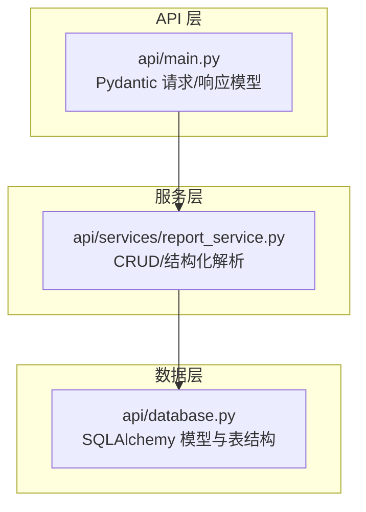
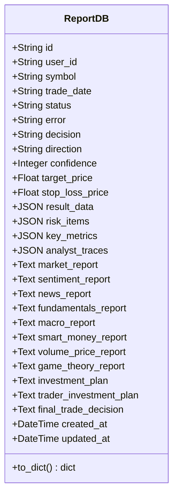
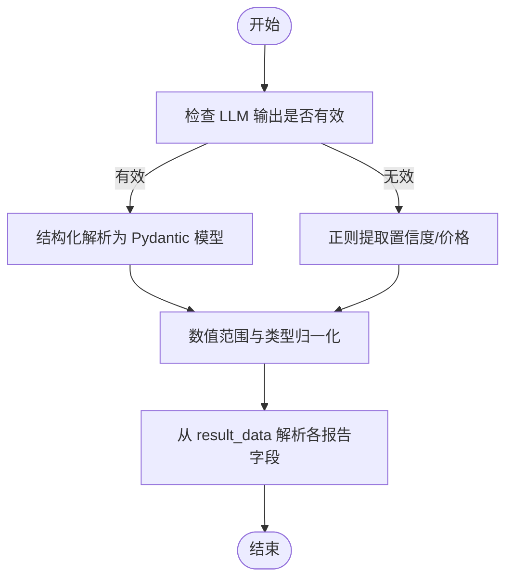
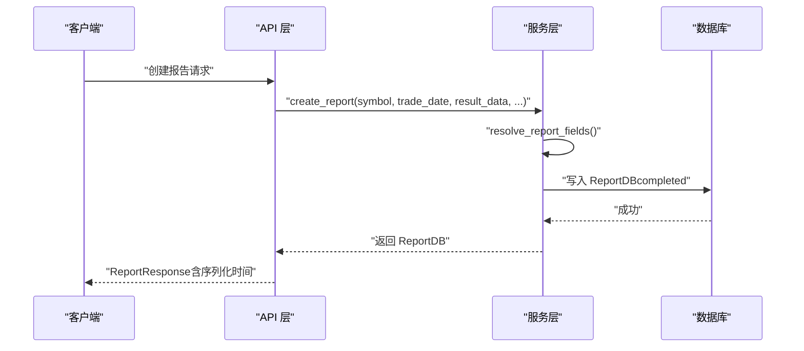
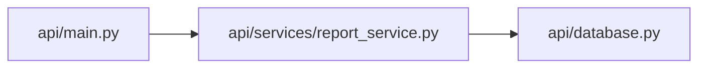

# 报告数据模型

<cite>
**本文引用的文件**
- [api/database.py](file://api/database.py)
- [api/services/report_service.py](file://api/services/report_service.py)
- [api/main.py](file://api/main.py)
</cite>

## 目录
1. [简介](#简介)
2. [项目结构](#项目结构)
3. [核心组件](#核心组件)
4. [架构总览](#架构总览)
5. [详细组件分析](#详细组件分析)
6. [依赖关系分析](#依赖关系分析)
7. [性能考量](#性能考量)
8. [故障排查指南](#故障排查指南)
9. [结论](#结论)
10. [附录](#附录)

## 简介
本文件系统性阐述 TradingAgents-AShare 中 ReportDB 报告数据模型的设计与实现，覆盖字段语义、JSON 序列化机制、状态管理与错误处理、CRUD 操作与查询优化策略，以及 to_dict 数据转换模式。目标是帮助开发者与产品人员快速理解并正确使用该模型。

## 项目结构
ReportDB 所属模块位于后端 API 层，采用 SQLAlchemy ORM 映射到 reports 表；服务层提供 CRUD 与结构化解析能力；API 层定义请求/响应模型并与数据库模型进行序列化互转。

图表来源
- [api/main.py:698-746](file://api/main.py#L698-L746)
- [api/services/report_service.py:258-461](file://api/services/report_service.py#L258-L461)
- [api/database.py:242-328](file://api/database.py#L242-L328)

章节来源
- [api/database.py:242-328](file://api/database.py#L242-L328)
- [api/services/report_service.py:258-461](file://api/services/report_service.py#L258-L461)
- [api/main.py:698-746](file://api/main.py#L698-L746)

## 核心组件
- 数据库模型 ReportDB：定义 reports 表结构，包含任务生命周期、决策信息、价格预测、结构化风险与指标、LLM 提取痕迹、各专业分析报告字段、全文本报告字段、以及时间戳元数据。
- 服务层接口：提供初始化、部分更新、完成写入、查询、计数、删除与批量删除等操作；内置结构化解析与正则回退提取。
- API 层模型：定义请求/响应 Pydantic 模型，负责与前端或外部系统交互时的数据校验与序列化。

章节来源
- [api/database.py:242-328](file://api/database.py#L242-L328)
- [api/services/report_service.py:258-461](file://api/services/report_service.py#L258-L461)
- [api/main.py:698-746](file://api/main.py#L698-L746)

## 架构总览
ReportDB 作为核心实体，贯穿“任务生命周期（状态/错误）— 决策信息（方向/置信度/目标价/止损价）— 结构化结果（风险项/关键指标/分析师轨迹）— 各专业分析报告文本”的全链路。

图表来源
- [api/database.py:242-328](file://api/database.py#L242-L328)

## 详细组件分析

### 字段设计与用途
- 任务生命周期
  - status：任务状态，支持 pending/running/completed/failed；用于前端与调度层跟踪。
  - error：失败原因文本，便于恢复与审计。
- 决策信息
  - decision：最终交易决策关键词（如 BUY/SELL/HOLD 或 增持/减持/持有）。
  - direction：中文方向描述（看多/偏多/中性/偏空/看空），用于可视化与汇总。
  - confidence：置信度 0-100，结构化解析优先，否则正则提取。
  - target_price / stop_loss_price：目标价与止损价，支持从不同报告片段提取。
- 结构化结果
  - result_data：完整分析结果的 JSON 容器，便于后续二次加工。
  - risk_items：主要风险清单，包含名称、等级（high/medium/low）、描述。
  - key_metrics：关键指标清单，包含名称、值（含单位）、优劣（good/neutral/bad）。
  - analyst_traces：分析师观点与关键发现的追踪记录，便于溯源与复盘。
- 专业分析报告字段
  - market_report、sentiment_report、news_report、fundamentals_report、macro_report、smart_money_report、volume_price_report、game_theory_report：各专业视角的报告文本，便于独立查看与检索。
  - investment_plan、trader_investment_plan、final_trade_decision：计划与最终决策文本，用于结构化解析与回放。
- 元数据
  - created_at / updated_at：UTC 时间戳，统一序列化为 ISO 字符串。

章节来源
- [api/database.py:242-328](file://api/database.py#L242-L328)
- [api/services/report_service.py:80-96](file://api/services/report_service.py#L80-L96)
- [api/main.py:698-746](file://api/main.py#L698-L746)

### JSON 字段的使用场景与序列化机制
- risk_items/key_metrics：通过 Pydantic Schema 进行强类型校验与归一化，保证前端消费一致性。
- result_data：承载完整分析结果，供二次解析或导出使用。
- analyst_traces：记录各分析师观点与关键发现，便于审计与可视化。
- 序列化：API 层 Response 模型启用 from_attributes，并对 datetime 字段进行统一序列化；模型内部 to_dict 方法亦将时间字段转为 ISO 字符串，确保前后端一致。

章节来源
- [api/services/report_service.py:48-96](file://api/services/report_service.py#L48-L96)
- [api/database.py:289-318](file://api/database.py#L289-L318)
- [api/main.py:727-732](file://api/main.py#L727-L732)

### 状态管理与错误处理
- 初始化：init_report 将 status 设为 pending 并写入 created_at/updated_at。
- 完成/失败：create_report 在写入完成后将 status 设为 completed；update_report_partial 支持显式设置 status 与 error；finalize_orphan_report 与 recover_stale_active_reports 将悬挂任务标记为 failed 并写入错误信息。
- 查询：get_report/get_reports_by_user 等接口支持按用户与符号过滤，并使用 load_only 仅加载摘要列，降低网络与内存开销。

章节来源
- [api/services/report_service.py:260-281](file://api/services/report_service.py#L260-L281)
- [api/services/report_service.py:372-461](file://api/services/report_service.py#L372-L461)
- [api/services/report_service.py:308-370](file://api/services/report_service.py#L308-L370)
- [api/services/report_service.py:464-483](file://api/services/report_service.py#L464-L483)

### 结构化解析与回退提取
- 结构化解析：extract_structured_data 使用 LLM 的结构化输出，结合 Pydantic Schema 校验与归一化，输出 StructuredReport。
- 正则回退：当 LLM 不可用或输出异常时，_extract_confidence_regex/_extract_price_regex 提供基于正则的置信度与价格提取。
- 字段解析：resolve_report_fields 从 result_data 中抽取各专业报告文本与最终决策，并据此推导 direction/confidence/target_price/stop_loss_price。

图表来源
- [api/services/report_service.py:97-144](file://api/services/report_service.py#L97-L144)
- [api/services/report_service.py:149-199](file://api/services/report_service.py#L149-L199)
- [api/services/report_service.py:201-255](file://api/services/report_service.py#L201-L255)

章节来源
- [api/services/report_service.py:97-144](file://api/services/report_service.py#L97-L144)
- [api/services/report_service.py:149-199](file://api/services/report_service.py#L149-L199)
- [api/services/report_service.py:201-255](file://api/services/report_service.py#L201-L255)

### CRUD 操作与查询优化
- 初始化与完成写入
  - init_report：创建 pending 状态的报告记录。
  - create_report：完成写入，合并 resolve 后的字段，设置 completed 状态。
- 部分更新
  - update_report_partial：支持仅更新指定字段（如某专业报告片段），并统一更新 updated_at。
- 查询
  - get_report：按 id 获取单条记录，可选按 user_id 过滤。
  - get_reports_by_user：摘要列查询，按 created_at 降序分页。
  - get_latest_reports_by_symbols：按符号去重取最新记录，适合“最近一次分析”场景。
  - count_reports：统计总数，支持按用户/符号过滤。
- 删除
  - delete_report：单条删除。
  - batch_delete_reports：批量删除并返回缺失 ID 列表，便于前端提示。

图表来源
- [api/services/report_service.py:372-461](file://api/services/report_service.py#L372-L461)
- [api/main.py:698-746](file://api/main.py#L698-L746)

章节来源
- [api/services/report_service.py:258-461](file://api/services/report_service.py#L258-L461)
- [api/services/report_service.py:464-575](file://api/services/report_service.py#L464-L575)

### to_dict 方法与数据转换模式
- to_dict：将 ReportDB 实体转换为字典，统一将时间字段序列化为 ISO 字符串，便于前端消费。
- API 层模型：ReportResponse/ReportDetailResponse 通过 from_attributes 与自定义序列化器，确保与数据库字段一致且格式统一。

章节来源
- [api/database.py:289-318](file://api/database.py#L289-L318)
- [api/main.py:727-732](file://api/main.py#L727-L732)

## 依赖关系分析
- 模型依赖：ReportDB 依赖 SQLAlchemy Column/JSON/Text 等类型定义。
- 服务依赖：report_service 依赖 ReportDB、SQLAlchemy Session、Pydantic Schema、正则与 LLM 客户端。
- API 依赖：main.py 的请求/响应模型与 ReportDB 字段一一对应，确保序列化一致性。

图表来源
- [api/main.py:698-746](file://api/main.py#L698-L746)
- [api/services/report_service.py:17](file://api/services/report_service.py#L17)
- [api/database.py:242-328](file://api/database.py#L242-L328)

章节来源
- [api/main.py:698-746](file://api/main.py#L698-L746)
- [api/services/report_service.py:17](file://api/services/report_service.py#L17)
- [api/database.py:242-328](file://api/database.py#L242-L328)

## 性能考量
- 查询优化
  - 使用 load_only 摘要列进行列表查询，减少传输与内存占用。
  - 对 user_id/symbol/status 等高频过滤字段建立索引（模型中已定义 index=True）。
- 写入优化
  - 批量删除前先做存在性校验与去重，避免无效 IO。
- 存储优化
  - JSON 字段仅在必要时解析，避免大对象频繁反序列化。
- 并发与连接池
  - SQLite 默认 WAL 模式（在满足权限条件下）提升并发读写；PostgreSQL/MySQL 使用更大连接池参数。

章节来源
- [api/services/report_service.py:471-483](file://api/services/report_service.py#L471-L483)
- [api/database.py:15-50](file://api/database.py#L15-L50)

## 故障排查指南
- 任务悬挂
  - 使用 recover_stale_active_reports 将不在活动队列中的 pending/running 任务标记为 failed，并写入统一错误信息。
- 失败标记
  - mark_report_failed 直接设置 status 与 error，便于前端展示与重试。
- 结构化解析失败
  - LLM 解析异常会记录警告与原始输出，便于定位问题；正则回退作为兜底方案。
- 数据不一致
  - schema 自动迁移函数确保新增列（如 direction/status/error/analyst_traces 等）在旧部署上也能正常工作。

章节来源
- [api/services/report_service.py:308-370](file://api/services/report_service.py#L308-L370)
- [api/services/report_service.py:97-144](file://api/services/report_service.py#L97-L144)
- [api/database.py:98-121](file://api/database.py#L98-L121)

## 结论
ReportDB 以清晰的生命周期与决策信息为核心，结合结构化 JSON 字段与专业分析报告文本，构建了可扩展、可观测、可审计的报告体系。服务层提供稳健的 CRUD 与解析能力，API 层确保数据一致性与序列化规范。配合索引与摘要查询策略，可在大数据量下保持良好性能。

## 附录

### 字段对照与典型用法路径
- 决策信息
  - [api/database.py:257-262](file://api/database.py#L257-L262)
  - [api/services/report_service.py:201-255](file://api/services/report_service.py#L201-L255)
- 结构化结果
  - [api/database.py:264-270](file://api/database.py#L264-L270)
  - [api/services/report_service.py:48-96](file://api/services/report_service.py#L48-L96)
- 专业分析报告
  - [api/database.py:272-283](file://api/database.py#L272-L283)
  - [api/main.py:542-550](file://api/main.py#L542-L550)
- CRUD 与查询
  - [api/services/report_service.py:258-461](file://api/services/report_service.py#L258-L461)
  - [api/services/report_service.py:464-575](file://api/services/report_service.py#L464-L575)
- 序列化与转换
  - [api/database.py:289-318](file://api/database.py#L289-L318)
  - [api/main.py:727-732](file://api/main.py#L727-L732)