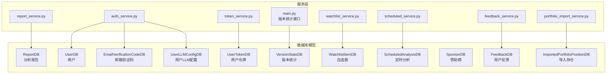
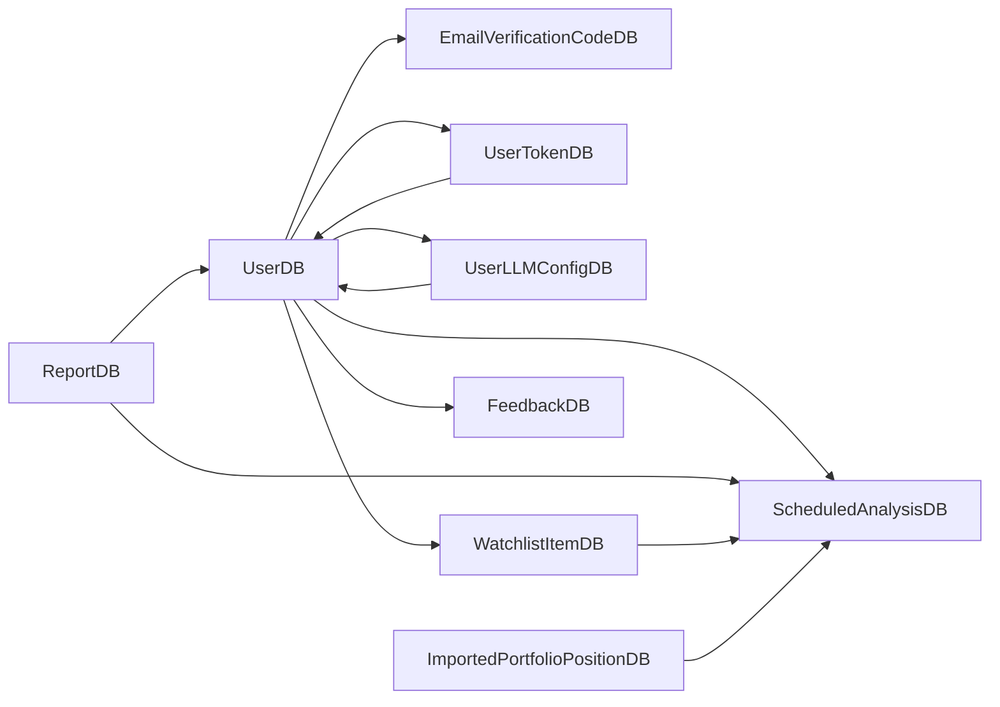
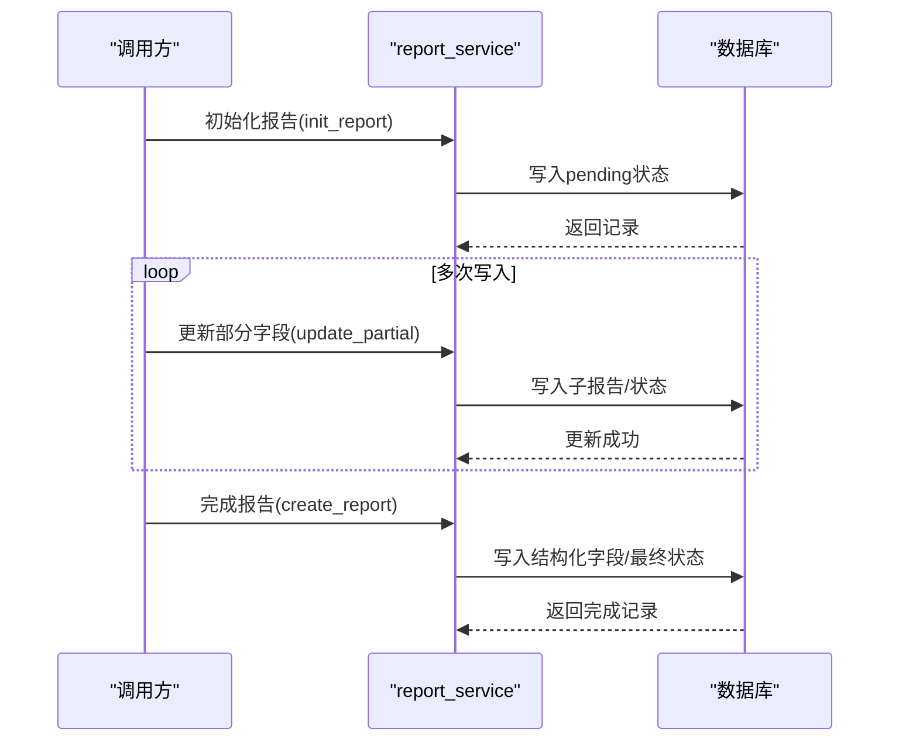
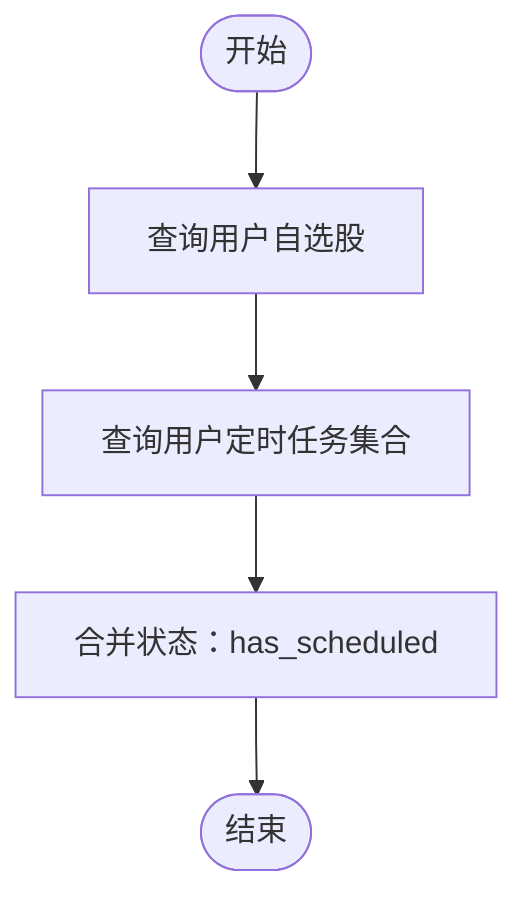
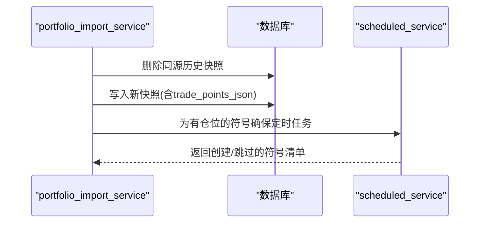
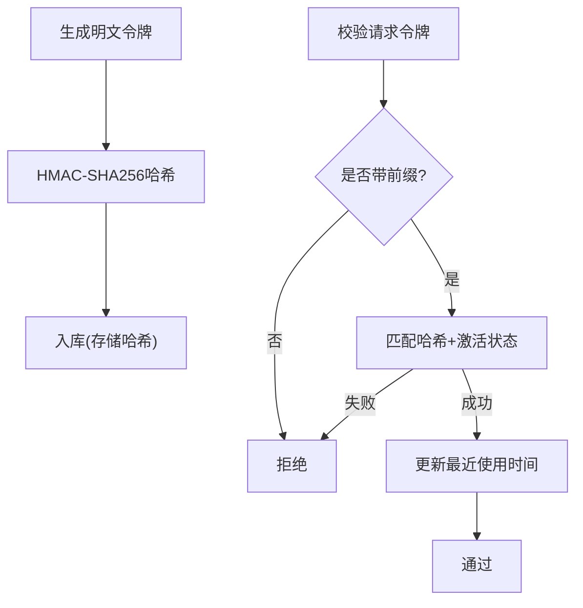
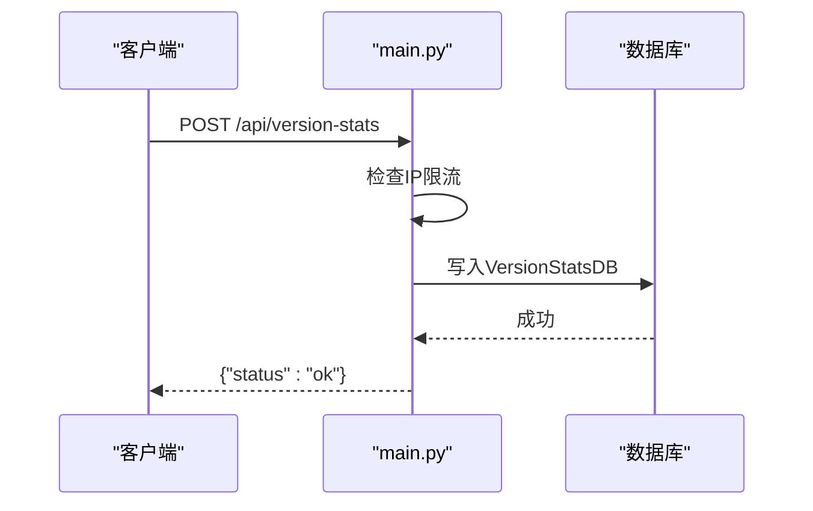
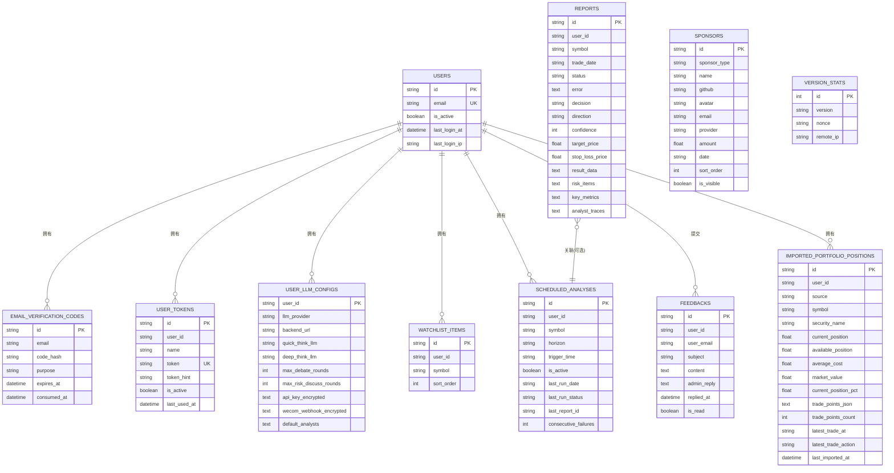

# 数据模型定义

<cite>
**本文档引用的文件**
- [api/database.py](file://api/database.py)
- [api/services/report_service.py](file://api/services/report_service.py)
- [api/services/watchlist_service.py](file://api/services/watchlist_service.py)
- [api/services/token_service.py](file://api/services/token_service.py)
- [api/services/portfolio_import_service.py](file://api/services/portfolio_import_service.py)
- [api/services/feedback_service.py](file://api/services/feedback_service.py)
- [api/services/auth_service.py](file://api/services/auth_service.py)
- [api/services/scheduled_service.py](file://api/services/scheduled_service.py)
- [api/main.py](file://api/main.py)
</cite>

## 目录
1. [简介](#简介)
2. [项目结构](#项目结构)
3. [核心组件](#核心组件)
4. [架构总览](#架构总览)
5. [详细组件分析](#详细组件分析)
6. [依赖分析](#依赖分析)
7. [性能考虑](#性能考虑)
8. [故障排除指南](#故障排除指南)
9. [结论](#结论)

## 简介
本文件系统性梳理 TradingAgents-AShare 的数据库模型，覆盖 ReportDB、UserDB、EmailVerificationCodeDB、UserLLMConfigDB、UserTokenDB、VersionStatsDB、WatchlistItemDB、ScheduledAnalysisDB、SponsorDB、FeedbackDB、ImportedPortfolioPositionDB 等核心模型。内容包括：
- 设计目的与职责边界
- 字段定义与类型说明
- 主键、外键与唯一约束
- JSON 字段的使用场景与序列化机制
- 索引策略与查询优化建议
- 模型间关系图与典型使用示例

## 项目结构
数据库模型集中于 api/database.py，配套服务层在 api/services/* 中对各模型进行增删改查与业务编排。

图表来源
- [api/database.py:242-483](file://api/database.py#L242-L483)
- [api/services/report_service.py:1-576](file://api/services/report_service.py#L1-L576)
- [api/services/watchlist_service.py:1-100](file://api/services/watchlist_service.py#L1-L100)
- [api/services/token_service.py:1-106](file://api/services/token_service.py#L1-L106)
- [api/services/portfolio_import_service.py:1-227](file://api/services/portfolio_import_service.py#L1-L227)
- [api/services/feedback_service.py:1-58](file://api/services/feedback_service.py#L1-L58)
- [api/services/auth_service.py:1-296](file://api/services/auth_service.py#L1-L296)
- [api/services/scheduled_service.py:1-383](file://api/services/scheduled_service.py#L1-L383)
- [api/main.py:2570-2592](file://api/main.py#L2570-L2592)

章节来源
- [api/database.py:1-483](file://api/database.py#L1-L483)

## 核心组件
本节按模型逐一说明设计目的、字段语义、主键/索引/约束策略，以及服务层典型用法。

- ReportDB（分析报告）
  - 设计目的：存储一次分析任务的完整生命周期与结果，支持结构化抽取与分拆报告。
  - 关键字段：id（主键，UUID）、user_id（索引）、symbol、trade_date、status/error（任务状态与错误）、决策与方向（decision/direction/confidence/target_price/stop_loss_price）、result_data/risk_items/key_metrics/analyst_traces（JSON 存储结构化数据）、各子报告字段（市场/新闻/基本面/宏观/聪明钱/量价/博弈论/投资计划等）、元数据 created_at/updated_at。
  - 索引：id、user_id、symbol、status。
  - JSON 使用：result_data、risk_items、key_metrics、analyst_traces；服务层通过解析与正则回退提取结构化字段。
  - 典型用法：初始化 pending、逐步写入部分报告、最终完成并持久化结构化数据。
  
  章节来源
  - [api/database.py:242-318](file://api/database.py#L242-L318)
  - [api/services/report_service.py:200-461](file://api/services/report_service.py#L200-L461)

- UserDB（用户）
  - 设计目的：用户身份与登录行为记录。
  - 关键字段：id（主键）、email（唯一+索引）、is_active、last_login_at/last_login_ip、邮件/企业微信推送开关。
  - 索引：id、email。
  - 典型用法：登录验证码校验、JWT 签发、登录 IP 记录。
  
  章节来源
  - [api/database.py:321-333](file://api/database.py#L321-L333)
  - [api/services/auth_service.py:114-184](file://api/services/auth_service.py#L114-L184)

- EmailVerificationCodeDB（邮箱验证码）
  - 设计目的：登录验证码生成、校验与消费控制。
  - 关键字段：id（主键）、email（索引）、code_hash、purpose、expires_at、consumed_at、created_at。
  - 索引：id、email。
  - 典型用法：生成随机码并哈希存储，限定过期时间，消费后禁止复用。
  
  章节来源
  - [api/database.py:335-344](file://api/database.py#L335-L344)
  - [api/services/auth_service.py:122-184](file://api/services/auth_service.py#L122-L184)

- UserLLMConfigDB（用户LLM配置）
  - 设计目的：保存用户 LLM 提供方、模型、密钥与默认分析师等个性化配置。
  - 关键字段：user_id（主键+索引）、llm_provider/backend_url、quick_think_llm/deep_think_llm、max_debate_rounds/max_risk_discuss_rounds、api_key_encrypted/wecom_webhook_encrypted（加密存储）、default_analysts（JSON 列表字符串）、created_at/updated_at。
  - 索引：user_id。
  - JSON 使用：default_analysts 以文本形式存储 JSON 数组。
  - 典型用法：读取/更新配置，敏感信息加密存储，迁移时支持重新加密。
  
  章节来源
  - [api/database.py:347-361](file://api/database.py#L347-L361)
  - [api/services/auth_service.py:239-295](file://api/services/auth_service.py#L239-L295)

- UserTokenDB（用户令牌）
  - 设计目的：API 密钥管理，支持多令牌、哈希存储与提示展示。
  - 关键字段：id（主键）、user_id（索引）、name、token（唯一+索引，存储 HMAC-SHA256）、token_hint（最后4位明文提示）、is_active、last_used_at、created_at。
  - 索引：id、user_id、token。
  - 典型用法：生成带前缀的明文令牌，仅返回一次；入库前做 HMAC 哈希；校验时匹配哈希并更新最近使用时间。
  
  章节来源
  - [api/database.py:364-375](file://api/database.py#L364-L375)
  - [api/services/token_service.py:34-106](file://api/services/token_service.py#L34-L106)

- VersionStatsDB（版本统计）
  - 设计目的：匿名收集部署实例的版本与 IP 信息，用于统计分析。
  - 关键字段：id（自增主键）、version、nonce、remote_ip（索引）、created_at。
  - 索引：id、remote_ip。
  - 典型用法：健康检查接口接收上报，按 IP 限流，入库记录。
  
  章节来源
  - [api/database.py:377-384](file://api/database.py#L377-L384)
  - [api/main.py:2572-2592](file://api/main.py#L2572-L2592)

- WatchlistItemDB（自选股）
  - 设计目的：用户自选股集合，支持排序与去重。
  - 关键字段：id（主键）、user_id（索引）、symbol、sort_order、created_at。
  - 唯一约束：(user_id, symbol)。
  - 典型用法：添加/删除/批量添加，查询时合并定时分析状态。
  
  章节来源
  - [api/database.py:387-398](file://api/database.py#L387-L398)
  - [api/services/watchlist_service.py:13-100](file://api/services/watchlist_service.py#L13-L100)

- ScheduledAnalysisDB（定时分析）
  - 设计目的：为用户符号设定定时分析任务，记录执行状态与报告关联。
  - 关键字段：id（主键）、user_id（索引）、symbol、horizon/trigger_time、is_active、last_run_date/last_run_status/last_report_id、consecutive_failures、created_at/updated_at。
  - 唯一约束：(user_id, symbol)。
  - 典型用法：创建/更新/删除任务，按时间窗口筛选待运行任务，记录成功/失败与连续失败次数。
  
  章节来源
  - [api/database.py:400-417](file://api/database.py#L400-L417)
  - [api/services/scheduled_service.py:34-383](file://api/services/scheduled_service.py#L34-L383)

- SponsorDB（赞助商）
  - 设计目的：公开展示赞助信息，金额字段仅管理员可见。
  - 关键字段：id（主键+索引）、sponsor_type（money/token，索引）、name/github/avatar/email/provider/amount/date/sort_order/is_visible、created_at/updated_at。
  - 索引：id、sponsor_type。
  - 典型用法：公开读取可见赞助商列表，按排序与日期排序。
  
  章节来源
  - [api/database.py:420-436](file://api/database.py#L420-L436)
  - [api/services/sponsor_service.py:19-24](file://api/services/sponsor_service.py#L19-L24)

- FeedbackDB（用户反馈）
  - 设计目的：用户提交反馈与管理员回复，支持未读计数。
  - 关键字段：id（主键+索引）、user_id（索引）、user_email、subject/content、admin_reply/replied_at、is_read、created_at/updated_at。
  - 索引：id、user_id。
  - 典型用法：创建反馈、分页列出、标记已读、计算未读数。
  
  章节来源
  - [api/database.py:439-453](file://api/database.py#L439-L453)
  - [api/services/feedback_service.py:18-58](file://api/services/feedback_service.py#L18-L58)

- ImportedPortfolioPositionDB（导入持仓）
  - 设计目的：保存用户从任意来源导入的当前持仓快照及交易点，支持多源聚合。
  - 关键字段：id（主键）、user_id（索引）、source（默认 manual）、symbol/security_name、current_position/available_position/average_cost/market_value/current_position_pct、trade_points_json（JSON）、trade_points_count、latest_trade_at/latest_trade_action、last_imported_at、created_at/updated_at。
  - 唯一约束：(user_id, source, symbol)。
  - JSON 使用：trade_points_json 存储交易时点序列。
  - 典型用法：替换某来源的持仓快照、构建定时分析上下文、清理全部导入数据。
  
  章节来源
  - [api/database.py:455-481](file://api/database.py#L455-L481)
  - [api/services/portfolio_import_service.py:31-227](file://api/services/portfolio_import_service.py#L31-L227)

## 架构总览
下图展示模型间的直接依赖与典型交互路径：

图表来源
- [api/database.py:321-481](file://api/database.py#L321-L481)
- [api/services/report_service.py:1-576](file://api/services/report_service.py#L1-L576)
- [api/services/watchlist_service.py:1-100](file://api/services/watchlist_service.py#L1-L100)
- [api/services/token_service.py:1-106](file://api/services/token_service.py#L1-L106)
- [api/services/portfolio_import_service.py:1-227](file://api/services/portfolio_import_service.py#L1-L227)
- [api/services/feedback_service.py:1-58](file://api/services/feedback_service.py#L1-L58)
- [api/services/auth_service.py:1-296](file://api/services/auth_service.py#L1-L296)
- [api/services/scheduled_service.py:1-383](file://api/services/scheduled_service.py#L1-L383)

## 详细组件分析

### 报告模型流程（ReportDB）
- 生命周期：init_report 创建 pending，后续可多次写入子报告字段，最终 create_report 完成并持久化结构化数据。
- 结构化抽取：优先使用 LLM 结构化输出，失败时回退正则提取置信度、目标价、止损价等。
- 查询优化：按 user_id/symbol/status 组合建立索引，常用字段采用 load_only 投影加载。

图表来源
- [api/services/report_service.py:260-461](file://api/services/report_service.py#L260-L461)

章节来源
- [api/services/report_service.py:200-461](file://api/services/report_service.py#L200-L461)
- [api/database.py:242-318](file://api/database.py#L242-L318)

### 自选股与定时分析联动（WatchlistItemDB ↔ ScheduledAnalysisDB）
- 关系：自选股与定时分析均以 (user_id, symbol) 唯一约束，便于去重与一致性。
- 用法：查询自选股时可合并定时分析状态，新增自选股时可批量确保定时任务存在。

图表来源
- [api/services/watchlist_service.py:13-36](file://api/services/watchlist_service.py#L13-L36)
- [api/database.py:387-398](file://api/database.py#L387-L398)
- [api/database.py:400-417](file://api/database.py#L400-L417)

章节来源
- [api/services/watchlist_service.py:13-100](file://api/services/watchlist_service.py#L13-L100)
- [api/services/scheduled_service.py:148-210](file://api/services/scheduled_service.py#L148-L210)

### 导入持仓与定时分析上下文（ImportedPortfolioPositionDB）
- 用途：将外部导入的持仓快照作为定时分析的上下文输入，支持多源聚合与去重。
- 上下文构建：基于当前持仓、成本、占比等生成用户上下文，供分析器使用。

图表来源
- [api/services/portfolio_import_service.py:31-116](file://api/services/portfolio_import_service.py#L31-L116)
- [api/services/scheduled_service.py:148-210](file://api/services/scheduled_service.py#L148-L210)
- [api/database.py:455-481](file://api/database.py#L455-L481)

章节来源
- [api/services/portfolio_import_service.py:119-184](file://api/services/portfolio_import_service.py#L119-L184)

### 用户令牌与安全（UserTokenDB）
- 安全策略：明文令牌仅在首次返回，入库前做 HMAC-SHA256 哈希；token_hint 显示最后4位便于识别。
- 校验流程：校验前缀、匹配哈希、启用状态、更新最近使用时间。

图表来源
- [api/services/token_service.py:23-106](file://api/services/token_service.py#L23-L106)
- [api/database.py:364-375](file://api/database.py#L364-L375)

章节来源
- [api/services/token_service.py:34-106](file://api/services/token_service.py#L34-L106)
- [api/database.py:364-375](file://api/database.py#L364-L375)

### 版本统计与限流（VersionStatsDB）
- 接口：POST /api/version-stats，接收版本号与随机 nonce，按 IP 限流后入库。
- 用途：匿名统计部署版本分布，辅助产品规划。

图表来源
- [api/main.py:2572-2592](file://api/main.py#L2572-L2592)
- [api/database.py:377-384](file://api/database.py#L377-L384)

章节来源
- [api/main.py:2572-2592](file://api/main.py#L2572-L2592)
- [api/database.py:377-384](file://api/database.py#L377-L384)

## 依赖分析
- 内聚性：各模型职责清晰，围绕单一业务实体建模（用户、令牌、报告、自选股、定时任务、反馈、导入持仓、赞助商、版本统计）。
- 耦合度：模型间弱耦合，主要通过 user_id 关联用户；ReportDB 与 ScheduledAnalysisDB 通过 symbol 关联分析对象；WatchlistItemDB 与 ScheduledAnalysisDB 通过 (user_id, symbol) 唯一约束保持一致性。
- 外键：数据库层面未显式声明外键约束，但服务层通过 user_id 等字段保证引用一致性；如需强约束可考虑在迁移阶段添加外键。

图表来源
- [api/database.py:242-483](file://api/database.py#L242-L483)

章节来源
- [api/database.py:242-483](file://api/database.py#L242-L483)

## 性能考虑
- 索引策略
  - 高频过滤字段：user_id、symbol、email、token、status、sponsor_type、remote_ip 建立索引。
  - 唯一约束：(user_id, symbol) 在 WatchlistItemDB 与 ScheduledAnalysisDB，避免重复与提升查找效率。
  - JSON 字段：不建议在 JSON 字段上建立索引；如需检索可考虑规范化或物化列。
- 查询优化
  - 报告查询：常用投影使用 load_only，减少 IO。
  - 分页与排序：按 created_at 或 sort_order 排序，避免全表扫描。
  - 令牌校验：先按 token 唯一索引定位，再检查 is_active。
- 存储与序列化
  - JSON 字段采用 SQLAlchemy JSON 类型，服务层负责序列化/反序列化与校验。
  - 敏感字段（api_key、webhook）采用对称加密存储，迁移时支持重新加密。

## 故障排除指南
- 报告状态异常
  - 现象：pending/running 任务长时间未完成。
  - 处理：recover_stale_active_reports 将不在活动作业集合中的活跃报告标记为 failed，并附带提示信息。
  
  章节来源
  - [api/services/report_service.py:326-361](file://api/services/report_service.py#L326-L361)

- 令牌校验失败
  - 现象：校验返回空。
  - 处理：确认令牌前缀、哈希匹配、是否激活、是否过期；必要时重新生成令牌。
  
  章节来源
  - [api/services/token_service.py:86-106](file://api/services/token_service.py#L86-L106)

- 自选股/定时任务冲突
  - 现象：添加重复符号时报错。
  - 处理：利用唯一约束避免重复；批量添加时捕获异常并区分重复/失败。
  
  章节来源
  - [api/services/watchlist_service.py:39-85](file://api/services/watchlist_service.py#L39-L85)
  - [api/services/scheduled_service.py:109-146](file://api/services/scheduled_service.py#L109-L146)

- 导入持仓为空或格式错误
  - 现象：同步后无有效记录。
  - 处理：检查输入格式、标准化代码、去重与校验；必要时清理并重试。
  
  章节来源
  - [api/services/portfolio_import_service.py:31-80](file://api/services/portfolio_import_service.py#L31-L80)

## 结论
本数据模型体系围绕用户、令牌、报告、自选股、定时分析、反馈、导入持仓、赞助商与版本统计等核心业务域构建，具备清晰的职责划分与合理的索引策略。JSON 字段满足灵活存储需求，同时通过服务层的结构化抽取与校验保障数据质量。建议在生产环境中结合唯一约束与外键增强引用完整性，并持续监控高频查询路径以优化性能。