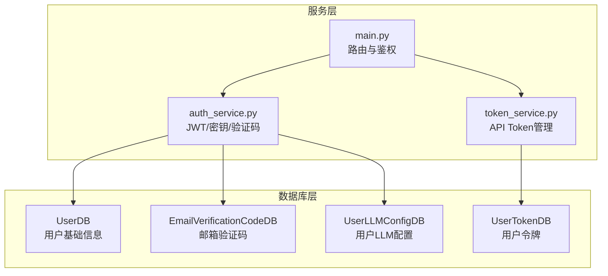
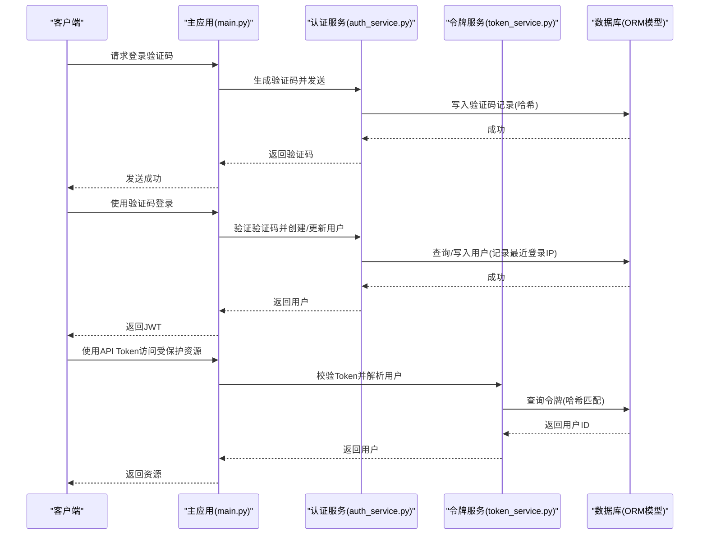
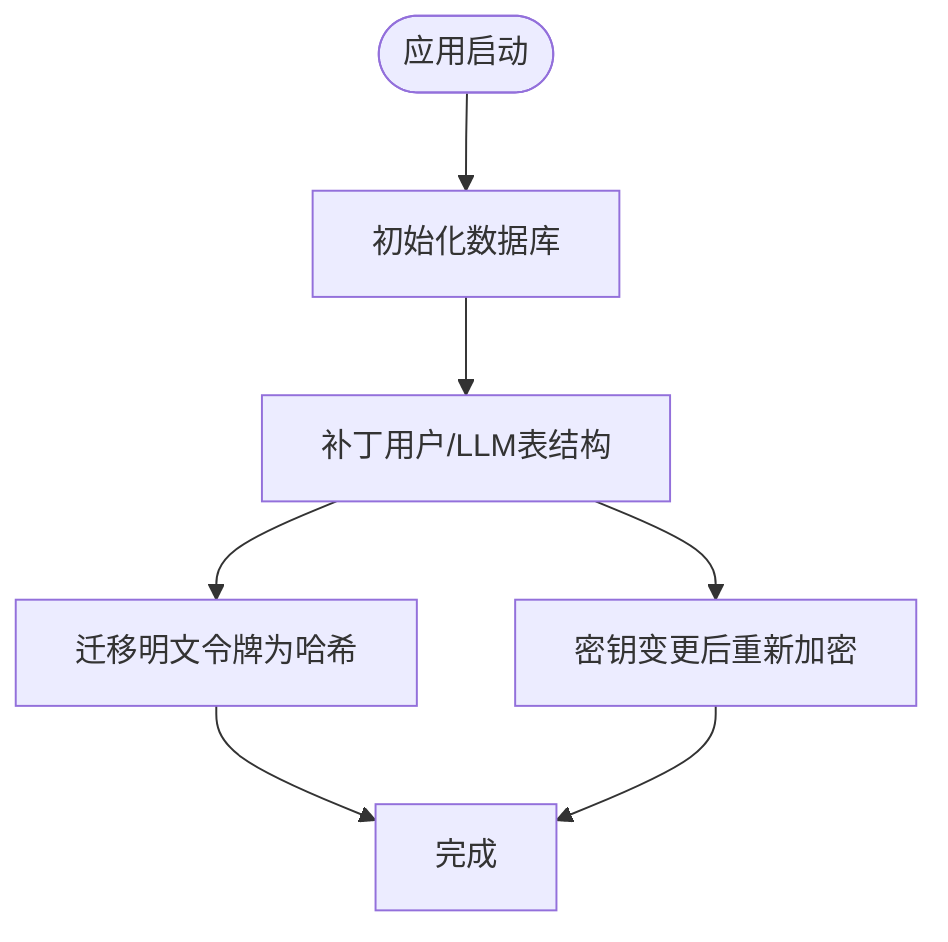
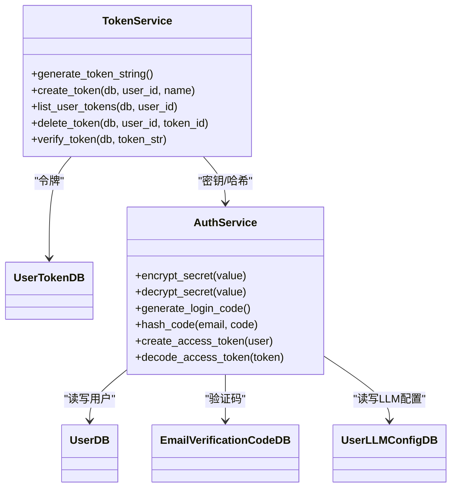

# 用户数据模型

<cite>
**本文引用的文件**
- [api/database.py](file://api/database.py)
- [api/services/auth_service.py](file://api/services/auth_service.py)
- [api/services/token_service.py](file://api/services/token_service.py)
- [api/main.py](file://api/main.py)
</cite>

## 目录
1. [简介](#简介)
2. [项目结构](#项目结构)
3. [核心组件](#核心组件)
4. [架构总览](#架构总览)
5. [详细组件分析](#详细组件分析)
6. [依赖关系分析](#依赖关系分析)
7. [性能考量](#性能考量)
8. [故障排查指南](#故障排查指南)
9. [结论](#结论)
10. [附录](#附录)

## 简介
本文件面向 TradingAgents-AShare 的用户相关数据模型，系统化梳理并解释以下模型与机制：
- 用户模型 UserDB：用户基本信息、偏好开关与登录追踪字段
- 用户 LLM 配置模型 UserLLMConfigDB：LLM 提供方、后端地址、思维链模型、默认分析师、敏感密钥与企业微信 Webhook 的加密存储
- 用户令牌模型 UserTokenDB：API 密钥令牌的生成、哈希存储与校验
- 邮箱验证码模型 EmailVerificationCodeDB：登录验证码的生成、哈希存储与消费控制
- 认证与授权的数据存储策略：基于 JWT 的会话与基于 API Token 的无状态访问
- 安全实现：令牌哈希存储、API 密钥加密与密钥轮换迁移
- 偏好设置与 LLM 配置项的使用：邮件报告开关、企业微信报告开关、LLM 提供方、后端地址、思维链模型、默认分析师
- 增删改查操作示例与安全最佳实践
- 令牌迁移与重新加密的后台处理机制

## 项目结构
围绕用户数据模型的核心文件组织如下：
- 数据库层：在数据库配置文件中定义所有用户相关 ORM 模型，并在启动时进行表结构补丁与安全迁移
- 认证与密钥服务：提供 JWT 签发/解码、对称加密/解密、验证码生成/校验等能力
- 令牌服务：负责 API Token 的生成、哈希存储、校验与生命周期管理
- 主应用：集中暴露与用户数据模型相关的 API 路由与鉴权策略

图表来源
- [api/database.py:321-375](file://api/database.py#L321-L375)
- [api/services/auth_service.py:18-111](file://api/services/auth_service.py#L18-L111)
- [api/services/token_service.py:14-106](file://api/services/token_service.py#L14-L106)
- [api/main.py:3505-3859](file://api/main.py#L3505-L3859)

章节来源
- [api/database.py:91-144](file://api/database.py#L91-L144)
- [api/services/auth_service.py:39-111](file://api/services/auth_service.py#L39-L111)
- [api/services/token_service.py:14-106](file://api/services/token_service.py#L14-L106)
- [api/main.py:3505-3859](file://api/main.py#L3505-L3859)

## 核心组件
- UserDB：用户唯一标识、邮箱、激活状态、时间戳、最近登录时间与 IP、以及两类报告偏好开关
- UserLLMConfigDB：用户级 LLM 配置、最大辩论轮次、最大风控讨论轮次、加密存储的 API Key 与企业微信 Webhook、默认分析师集合
- UserTokenDB：令牌唯一标识、所属用户、令牌名称、哈希值与可见后缀、启用状态、最后使用时间
- EmailVerificationCodeDB：验证码唯一标识、邮箱、哈希值、用途、过期时间、消费时间、创建时间

章节来源
- [api/database.py:321-375](file://api/database.py#L321-L375)

## 架构总览
用户数据模型在系统中的交互路径：
- 启动阶段：初始化数据库并执行用户相关表结构补丁与安全迁移（令牌哈希迁移、密钥重新加密）
- 认证流程：通过邮箱验证码换取 JWT；或通过 API Token 进行无状态访问
- 配置读取：前端从运行时配置接口读取用户 LLM 配置与偏好设置
- 安全策略：令牌以 HMAC-SHA256 存储；敏感配置以对称加密存储；密钥变更时自动重加密

图表来源
- [api/main.py:3505-3859](file://api/main.py#L3505-L3859)
- [api/services/auth_service.py:122-184](file://api/services/auth_service.py#L122-L184)
- [api/services/token_service.py:86-106](file://api/services/token_service.py#L86-L106)

## 详细组件分析

### UserDB 用户模型
- 字段要点
  - 唯一标识、邮箱、激活状态、创建/更新时间
  - 最近登录时间与登录 IP（用于审计与风控）
  - 报告偏好：email_report_enabled、wecom_report_enabled（默认开启）
- 设计意图
  - 支持未来多用户场景扩展
  - 便于按用户维度统计与推送
- 使用场景
  - 登录成功后更新最近登录时间与 IP
  - 前端运行时配置接口读取偏好并决定是否推送报告

章节来源
- [api/database.py:321-333](file://api/database.py#L321-L333)
- [api/services/auth_service.py:166-184](file://api/services/auth_service.py#L166-L184)
- [api/main.py:3841-3859](file://api/main.py#L3841-L3859)

### UserLLMConfigDB 用户 LLM 配置模型
- 字段要点
  - 用户 ID 为主键
  - LLM 提供方、后端地址、快速思考与深度思考模型
  - 最大辩论轮次、最大风控讨论轮次
  - 加密存储的 API Key 与企业微信 Webhook URL
  - 默认分析师集合（JSON 文本）
  - 创建/更新时间
- 设计意图
  - 将敏感凭据与配置分离存储，降低泄露面
  - 通过默认分析师控制分析团队的默认选择
- 使用场景
  - 前端运行时配置接口读取并展示
  - 任务调度时读取默认分析师与 LLM 参数

章节来源
- [api/database.py:347-362](file://api/database.py#L347-L362)
- [api/services/auth_service.py:239-295](file://api/services/auth_service.py#L239-L295)
- [api/main.py:3841-3859](file://api/main.py#L3841-L3859)

### UserTokenDB 用户令牌模型
- 字段要点
  - 令牌唯一标识、所属用户、令牌名称
  - token 字段存储 HMAC-SHA256 哈希，不保存明文
  - token_hint 保存明文令牌后四位，用于提示
  - 启用状态、最后使用时间、创建时间
- 设计意图
  - 即使数据库泄露也无法直接使用令牌
  - 通过限制每用户令牌数量与提示后缀提升易用性与安全性
- 使用场景
  - 创建新令牌时生成随机字符串并计算哈希入库
  - 校验时对请求令牌做相同哈希后与数据库比对

章节来源
- [api/database.py:363-375](file://api/database.py#L363-L375)
- [api/services/token_service.py:14-106](file://api/services/token_service.py#L14-L106)

### EmailVerificationCodeDB 邮箱验证码模型
- 字段要点
  - 唯一标识、邮箱、哈希后的验证码、用途（默认登录）、过期时间、消费时间、创建时间
- 设计意图
  - 不存储明文验证码，仅存储哈希，防止泄露
  - 过期与消费控制确保一次性使用与时效性
- 使用场景
  - 生成验证码并发送给用户
  - 校验验证码时检查过期、哈希一致与未被消费

章节来源
- [api/database.py:335-345](file://api/database.py#L335-L345)
- [api/services/auth_service.py:122-184](file://api/services/auth_service.py#L122-L184)

### 认证与授权机制中的数据存储策略
- JWT 会话
  - 使用 HS256 算法，密钥来自环境变量或默认密钥
  - 登录成功后签发 JWT，前端携带在 Authorization Bearer 中
- API Token 无状态访问
  - 令牌前缀固定，创建时生成随机字符串并仅显示一次
  - 数据库存储的是哈希值，校验时同样计算哈希进行比对
- 登录审计
  - 登录成功后更新用户最近登录时间与 IP，便于审计与风控

章节来源
- [api/services/auth_service.py:99-111](file://api/services/auth_service.py#L99-L111)
- [api/services/auth_service.py:166-184](file://api/services/auth_service.py#L166-L184)
- [api/services/token_service.py:86-106](file://api/services/token_service.py#L86-L106)

### 令牌哈希存储的安全实现
- 生成与存储
  - 生成随机令牌字符串并计算 HMAC-SHA256 哈希
  - 仅将哈希与后缀写入数据库，明文令牌仅在创建时返回一次
- 校验流程
  - 接收请求令牌，计算哈希并与数据库记录比对
  - 若匹配则更新最后使用时间并返回用户
- 优势
  - 即使数据库泄露，攻击者无法直接使用令牌
  - 通过后缀提示提升用户体验

章节来源
- [api/services/token_service.py:23-63](file://api/services/token_service.py#L23-L63)
- [api/services/token_service.py:86-106](file://api/services/token_service.py#L86-L106)

### API 密钥加密机制
- 对称加密
  - 使用基于密钥派生的对称加密算法对敏感配置进行加密存储
  - 解密时优先尝试当前密钥，失败则回退到默认密钥
- 密钥轮换与迁移
  - 应用启动时检测是否存在使用旧密钥加密的记录
  - 若能用默认密钥解密，则使用当前密钥重新加密并写回
- 作用范围
  - 用户级 API Key 与企业微信 Webhook URL

章节来源
- [api/services/auth_service.py:56-84](file://api/services/auth_service.py#L56-L84)
- [api/database.py:174-240](file://api/database.py#L174-L240)

### 用户偏好设置与 LLM 配置选项的使用
- 偏好设置
  - email_report_enabled：是否启用邮件报告
  - wecom_report_enabled：是否启用企业微信报告
- LLM 配置选项
  - llm_provider、backend_url、quick_think_llm、deep_think_llm
  - max_debate_rounds、max_risk_discuss_rounds
  - default_analysts：默认分析团队成员集合
- 前端读取
  - 运行时配置接口统一返回上述配置与偏好，前端据此决定行为

章节来源
- [api/database.py:347-362](file://api/database.py#L347-L362)
- [api/main.py:3841-3859](file://api/main.py#L3841-L3859)

### 增删改查操作示例与安全最佳实践
- 创建用户令牌
  - 步骤：校验用户配额 → 生成随机令牌 → 计算哈希 → 写入数据库 → 返回明文令牌（仅一次）
  - 安全建议：严格限制每用户令牌数量；令牌创建后妥善保存；定期轮换
- 列出与删除令牌
  - 列表：按用户 ID 查询并按创建时间倒序
  - 删除：按用户 ID 与令牌 ID 精确匹配删除
- 校验令牌
  - 校验前缀 → 计算哈希 → 数据库比对 → 更新最后使用时间 → 返回用户
- 用户登录
  - 生成验证码并发送 → 校验验证码 → 创建/更新用户（记录最近登录时间与 IP）→ 签发 JWT
- LLM 配置更新
  - 可选清空敏感字段或传入新值，新值将被加密存储
  - 默认分析师以 JSON 文本形式存储

章节来源
- [api/services/token_service.py:34-84](file://api/services/token_service.py#L34-L84)
- [api/services/auth_service.py:122-184](file://api/services/auth_service.py#L122-L184)
- [api/services/auth_service.py:243-295](file://api/services/auth_service.py#L243-L295)

### 令牌迁移与重新加密的后台处理机制
- 启动迁移
  - 初始化数据库时触发：若用户表缺少关键列则补丁添加
  - 执行令牌哈希迁移：检测明文令牌并转换为哈希存储，同时写入后缀提示
  - 执行密钥重新加密：检测使用旧密钥加密的记录，使用当前密钥重新加密并写回
- 迁移保障
  - 令牌迁移：逐条处理，记录迁移数量
  - 密钥重加密：先尝试当前密钥，再回退默认密钥，仍失败则跳过并记录警告
- 影响范围
  - 保证历史数据在密钥变更后仍可正常使用
  - 降低数据库泄露风险

图表来源
- [api/database.py:91-144](file://api/database.py#L91-L144)
- [api/database.py:146-240](file://api/database.py#L146-L240)

章节来源
- [api/database.py:91-144](file://api/database.py#L91-L144)
- [api/database.py:146-240](file://api/database.py#L146-L240)

## 依赖关系分析
- 组件耦合
  - 主应用依赖认证与令牌服务进行鉴权
  - 认证服务依赖数据库模型进行用户与验证码的读写
  - 令牌服务依赖认证服务提供的密钥派生与哈希函数
- 外部依赖
  - SQLAlchemy ORM 用于模型定义与数据库操作
  - 对称加密库用于敏感配置的加密与解密
  - JWT 库用于会话令牌的签发与验证

图表来源
- [api/database.py:321-375](file://api/database.py#L321-L375)
- [api/services/auth_service.py:56-111](file://api/services/auth_service.py#L56-L111)
- [api/services/token_service.py:23-106](file://api/services/token_service.py#L23-L106)

章节来源
- [api/database.py:321-375](file://api/database.py#L321-L375)
- [api/services/auth_service.py:56-111](file://api/services/auth_service.py#L56-L111)
- [api/services/token_service.py:23-106](file://api/services/token_service.py#L23-L106)

## 性能考量
- 数据库连接池
  - SQLite：WAL 模式与连接池参数优化并发
  - PostgreSQL/MySQL：更大的连接池与回收策略
- 查询优化
  - 用户与令牌模型均建立索引字段，减少高频查询开销
  - 令牌校验仅基于哈希比对，避免复杂解密
- 启动迁移
  - 迁移过程在事务中执行，避免中途失败导致不一致
  - 对于大量记录采用分步处理与日志记录，避免阻塞

章节来源
- [api/database.py:15-50](file://api/database.py#L15-L50)
- [api/database.py:146-240](file://api/database.py#L146-L240)

## 故障排查指南
- 无法登录
  - 检查验证码是否过期或已被消费
  - 确认邮箱大小写与标准化处理
- 令牌无效
  - 确认令牌前缀与长度
  - 检查是否已启用且未过期
  - 核对哈希计算是否一致
- 密钥相关问题
  - 若更换 TA_APP_SECRET_KEY 后出现解密失败，确认迁移是否完成
  - 查看日志中关于“无法解密”的警告并手动清理或恢复
- 权限不足
  - 确认使用正确的鉴权方式（JWT 或 API Token）
  - 检查用户激活状态与令牌启用状态

章节来源
- [api/services/auth_service.py:146-184](file://api/services/auth_service.py#L146-L184)
- [api/services/token_service.py:86-106](file://api/services/token_service.py#L86-L106)
- [api/database.py:174-240](file://api/database.py#L174-L240)

## 结论
本文档系统化梳理了 TradingAgents-AShare 的用户数据模型与相关安全机制，明确了各模型的职责边界、字段设计与使用场景，并给出了认证与授权的数据存储策略、令牌哈希与密钥加密实现、迁移与重加密后台处理流程。结合增删改查示例与最佳实践，有助于在生产环境中安全、稳定地管理用户数据。

## 附录
- 关键环境变量
  - TA_APP_SECRET_KEY：JWT 与对称加密密钥
  - DATABASE_URL：数据库连接串（支持 SQLite/PostgreSQL/MySQL）
- 前端交互
  - 获取运行时配置接口会返回用户偏好与 LLM 配置，前端据此决定行为