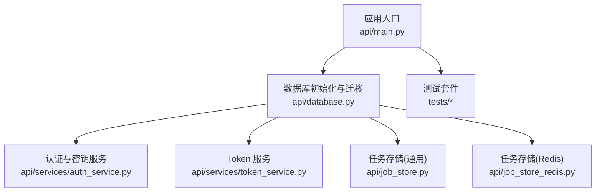
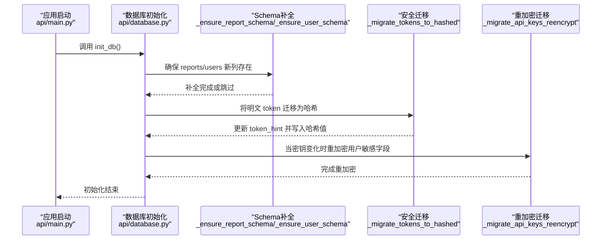
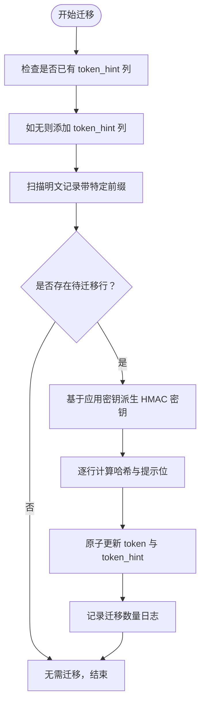
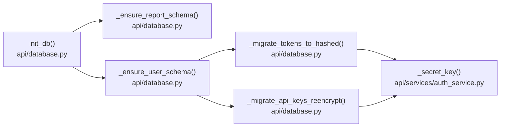

# 迁移策略

<cite>
**本文引用的文件**
- [api/database.py](file://api/database.py)
- [api/main.py](file://api/main.py)
- [api/services/auth_service.py](file://api/services/auth_service.py)
- [api/services/token_service.py](file://api/services/token_service.py)
- [api/job_store.py](file://api/job_store.py)
- [api/job_store_redis.py](file://api/job_store_redis.py)
- [tests/test_api_smoke.py](file://tests/test_api_smoke.py)
- [tests/test_job_store.py](file://tests/test_job_store.py)
- [tests/test_job_store_redis.py](file://tests/test_job_store_redis.py)
</cite>

## 目录
1. [引言](#引言)
2. [项目结构](#项目结构)
3. [核心组件](#核心组件)
4. [架构总览](#架构总览)
5. [详细组件分析](#详细组件分析)
6. [依赖关系分析](#依赖关系分析)
7. [性能考量](#性能考量)
8. [故障排查指南](#故障排查指南)
9. [结论](#结论)
10. [附录](#附录)

## 引言
本文件面向 TradingAgents-AShare 的数据库迁移与演进，聚焦以下目标：
- 向后兼容性保障与现有数据的平滑迁移
- _token_hash 迁移与 _api_keys 重加密的具体实现
- 数据库版本管理与 schema 演进最佳实践
- 迁移失败的回滚策略与数据恢复方案
- 增量迁移与批量迁移的选择标准
- 迁移测试与验证的完整流程

本项目采用 SQLAlchemy 作为 ORM，并在启动时通过初始化函数确保表结构存在；同时对历史部署中缺失的列进行“就地补全”，避免强制迁移带来的中断风险。

## 项目结构
与迁移相关的代码主要集中在后端 API 层：
- 数据库初始化与迁移：api/database.py
- 应用入口与版本统计上报：api/main.py
- 认证与密钥服务：api/services/auth_service.py
- Token 管理与哈希工具：api/services/token_service.py
- 任务存储（Redis）：api/job_store_redis.py
- 通用任务存储（SQLite/其他）：api/job_store.py
- 测试用例：tests 下若干集成与功能测试

图表来源
- [api/main.py:90-110](file://api/main.py#L90-L110)
- [api/database.py:91-143](file://api/database.py#L91-L143)

章节来源
- [api/database.py:91-143](file://api/database.py#L91-L143)
- [api/main.py:90-110](file://api/main.py#L90-L110)

## 核心组件
- 数据库引擎与会话工厂：负责连接、池化与事务控制
- 初始化函数：创建基础表并执行“就地补全”迁移
- 就地补全迁移：针对 reports 与 users 表新增列
- 安全迁移：将明文 API Token 迁移为 HMAC-SHA256 哈希并记录提示位
- 重加密迁移：当应用密钥变更时，重新加密用户敏感字段
- 版本统计：匿名上报版本信息（非业务迁移，但与版本管理相关）

章节来源
- [api/database.py:33-95](file://api/database.py#L33-L95)
- [api/database.py:98-143](file://api/database.py#L98-L143)
- [api/database.py:146-171](file://api/database.py#L146-L171)
- [api/database.py:174-243](file://api/database.py#L174-L243)
- [api/main.py:90-110](file://api/main.py#L90-L110)

## 架构总览
下图展示迁移路径与关键模块交互：

图表来源
- [api/database.py:91-143](file://api/database.py#L91-L143)
- [api/database.py:146-171](file://api/database.py#L146-L171)
- [api/database.py:174-243](file://api/database.py#L174-L243)

## 详细组件分析

### 数据库初始化与就地补全迁移
- 目标：确保 reports 与 users 表具备运行所需的新列，避免强制迁移导致停机
- 实现要点：
  - 使用 PRAGMA 查询当前表结构
  - 若缺失列则执行 ALTER TABLE 动态添加
  - 对 user_llm_configs 表补充 wecom_webhook_encrypted、default_analysts 等列
- 兼容性保障：
  - 仅在缺失列时才执行 ALTER，避免重复执行造成影响
  - 使用事务块包裹，失败可回滚
- 失败处理：
  - 捕获异常并记录错误日志，不中断应用启动

章节来源
- [api/database.py:98-141](file://api/database.py#L98-L141)

### 明文 Token 到 HMAC-SHA256 哈希迁移（_token_hash）
- 目标：将以特定前缀开头的明文 API Token 改为 HMAC-SHA256 哈希存储，并保留短提示位
- 迁移步骤：
  - 为 user_tokens 表添加 token_hint 列（若不存在）
  - 扫描所有以特定前缀开头的明文记录
  - 使用应用密钥生成 HMAC-SHA256 哈希与后四位提示
  - 原子更新 token 与 token_hint 字段
- 安全性：
  - 即便数据库泄露，也无法直接使用明文 Token
  - 提示位用于前端显示，便于用户识别
- 可逆性：
  - 该迁移不可逆；一旦哈希化，无法还原明文
  - 建议在迁移前备份 user_tokens 表

图表来源
- [api/database.py:146-171](file://api/database.py#L146-L171)
- [api/services/auth_service.py:1-40](file://api/services/auth_service.py#L1-L40)
- [api/services/token_service.py:18-31](file://api/services/token_service.py#L18-L31)

章节来源
- [api/database.py:146-171](file://api/database.py#L146-L171)
- [api/services/auth_service.py:1-40](file://api/services/auth_service.py#L1-L40)
- [api/services/token_service.py:18-31](file://api/services/token_service.py#L18-L31)

### 用户密钥重加密（_api_keys 重加密）
- 目标：当应用密钥（TA_APP_SECRET_KEY）变更时，重新加密用户敏感字段
- 实现要点：
  - 在初始化阶段检测并触发重加密逻辑
  - 针对 user_llm_configs 中的 wecom_webhook_encrypted 等字段执行解密-再加密
  - 保持业务可用性，避免长时间锁表
- 失败处理：
  - 捕获异常并记录错误日志，不影响应用继续启动
  - 建议在生产环境分批执行并监控进度

章节来源
- [api/database.py:174-243](file://api/database.py#L174-L243)

### 版本统计与版本管理
- 版本统计：应用启动时可选上报匿名版本信息，便于生态统计
- 版本管理建议：
  - 使用独立的版本表或注释字段记录当前 schema 版本
  - 在每次重大变更前增加版本号并编写升级脚本
  - 通过环境变量或配置项控制迁移开关

章节来源
- [api/main.py:90-110](file://api/main.py#L90-L110)
- [api/database.py:377-386](file://api/database.py#L377-L386)

## 依赖关系分析
- 初始化顺序依赖：
  - init_db → _ensure_report_schema/_ensure_user_schema → _migrate_tokens_to_hashed → _migrate_api_keys_reencrypt
- 外部依赖：
  - 应用密钥由认证服务提供，用于 HMAC 与重加密
  - Redis 任务存储与 SQLite 任务存储分别对应不同部署场景

图表来源
- [api/database.py:91-143](file://api/database.py#L91-L143)
- [api/database.py:146-171](file://api/database.py#L146-L171)
- [api/database.py:174-243](file://api/database.py#L174-L243)
- [api/services/auth_service.py:1-40](file://api/services/auth_service.py#L1-L40)

章节来源
- [api/database.py:91-143](file://api/database.py#L91-L143)
- [api/database.py:146-171](file://api/database.py#L146-L171)
- [api/database.py:174-243](file://api/database.py#L174-L243)
- [api/services/auth_service.py:1-40](file://api/services/auth_service.py#L1-L40)

## 性能考量
- 连接池与并发：
  - 非 SQLite 场景使用较大连接池以提升并发能力
  - SQLite 默认 WAL 模式减少写入冲突
- 迁移性能：
  - 就地补全迁移为小规模 DDL，影响极低
  - Token 哈希迁移建议分页/分批处理，避免长事务
  - 重加密迁移应避免在高峰期执行，必要时采用限速策略
- 缓存与任务：
  - Redis 任务存储适合高吞吐场景
  - SQLite 任务存储适合轻量部署

章节来源
- [api/database.py:33-57](file://api/database.py#L33-L57)
- [api/job_store_redis.py:53-70](file://api/job_store_redis.py#L53-L70)
- [api/job_store.py:1-100](file://api/job_store.py#L1-L100)

## 故障排查指南
- 常见问题与定位：
  - 迁移失败：查看日志中关于“Token hash migration failed”“User secret re-encryption migration failed”的记录
  - Schema 补全失败：确认 PRAGMA 查询与 ALTER 权限
  - 密钥相关错误：确认 TA_APP_SECRET_KEY 是否正确设置
- 回滚与恢复：
  - Token 哈希迁移不可逆；建议在迁移前导出 user_tokens 表为备份
  - 重加密失败：可按用户维度重试，或临时回滚密钥后再次执行
  - Schema 补全：若中途失败，可手动执行缺失的 ALTER 语句并标记版本
- 监控与告警：
  - 在生产环境启用迁移进度与错误计数指标
  - 对长时间未完成的批次迁移设置超时与告警

章节来源
- [api/database.py:170-171](file://api/database.py#L170-L171)
- [api/database.py:238-243](file://api/database.py#L238-L243)
- [api/database.py:98-141](file://api/database.py#L98-L141)

## 结论
本项目的迁移策略以“就地补全 + 安全哈希 + 密钥感知重加密”为核心，兼顾向后兼容与安全性：
- 通过 PRAGMA 与条件 ALTER 实现零停机补全
- 明文 Token 哈希化降低泄露风险
- 密钥变更时自动重加密，保障数据安全
- 建议在生产中结合版本管理、分批迁移与充分测试，确保平滑演进

## 附录

### 增量迁移与批量迁移选择标准
- 增量迁移适用于：
  - 数据量较小、可接受短暂停机窗口
  - 需要严格一致性与原子性的场景
- 批量迁移适用于：
  - 数据量大、需避免长事务
  - 可容忍阶段性不一致，最终一致即可
- 建议：
  - 对 user_tokens 采用分页/分批更新
  - 对 user_llm_configs 采用按用户维度重试

章节来源
- [api/database.py:146-171](file://api/database.py#L146-L171)
- [api/database.py:174-243](file://api/database.py#L174-L243)

### 迁移测试与验证流程
- 单元与集成测试建议覆盖：
  - 初始化流程：验证 init_db 能成功创建表并执行补全
  - Token 哈希迁移：构造含明文 token 的测试数据，验证哈希与提示位更新
  - 重加密迁移：模拟密钥变更场景，验证字段被重新加密
  - 错误分支：断网/权限不足/密钥缺失等异常路径
- 验证清单：
  - reports/users 表新列存在且默认值正确
  - user_tokens 中明文 token 已替换为哈希，token_hint 正确
  - user_llm_configs 中敏感字段已重加密
  - 日志中无迁移失败记录

章节来源
- [tests/test_api_smoke.py:1-100](file://tests/test_api_smoke.py#L1-L100)
- [tests/test_job_store.py:1-100](file://tests/test_job_store.py#L1-L100)
- [tests/test_job_store_redis.py:1-100](file://tests/test_job_store_redis.py#L1-L100)