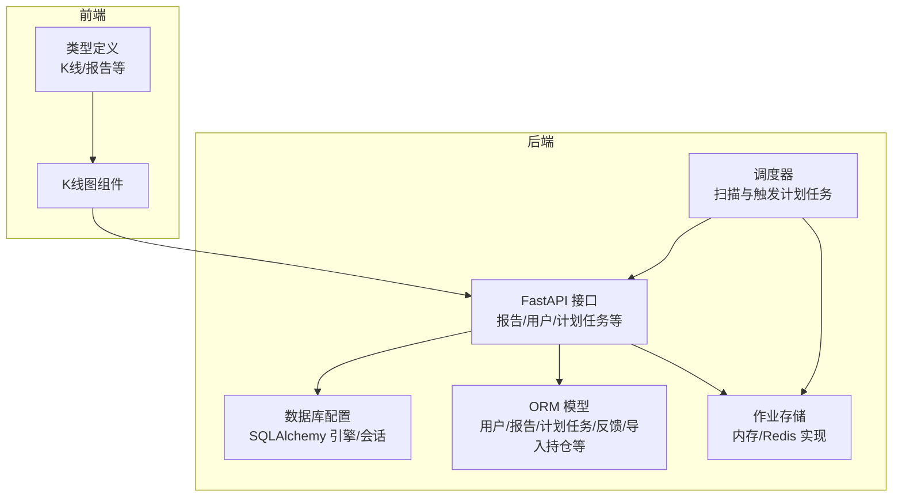
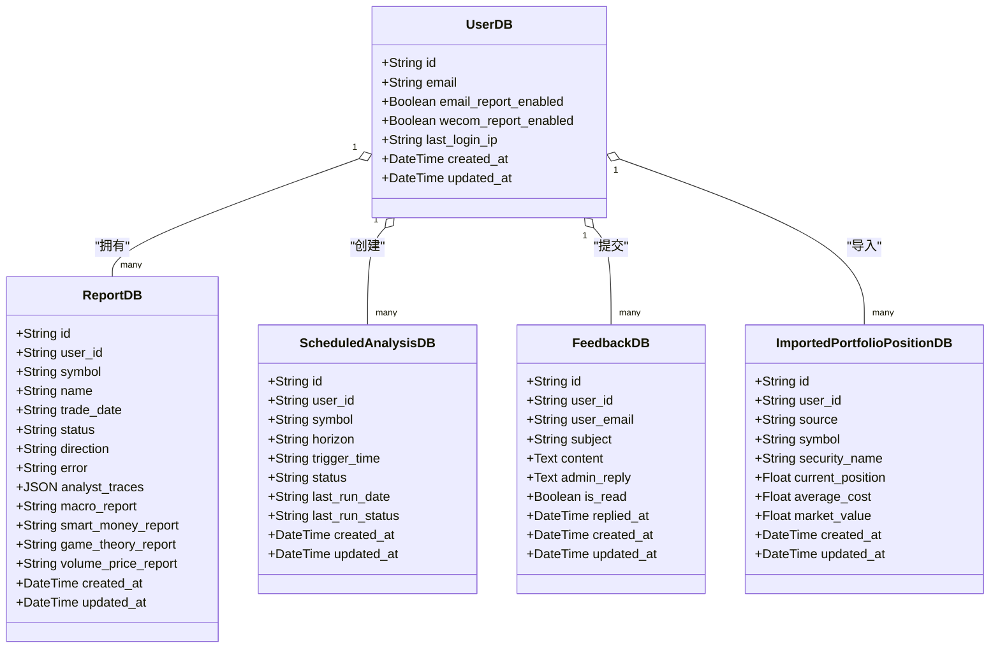
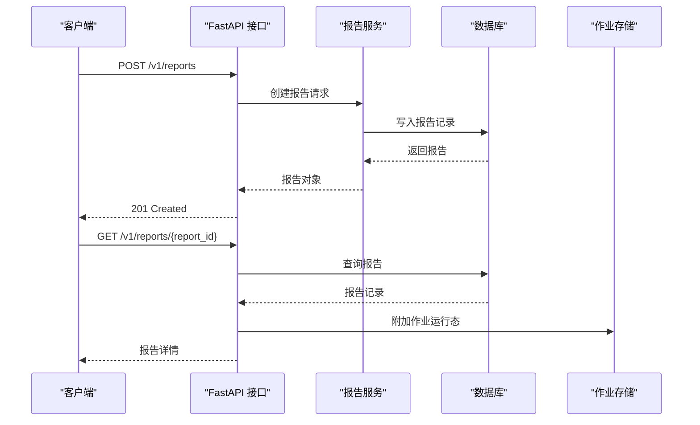
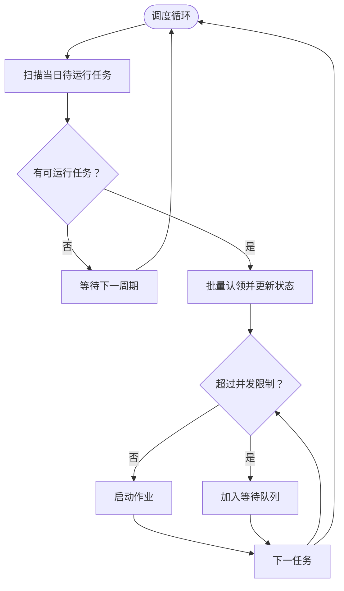
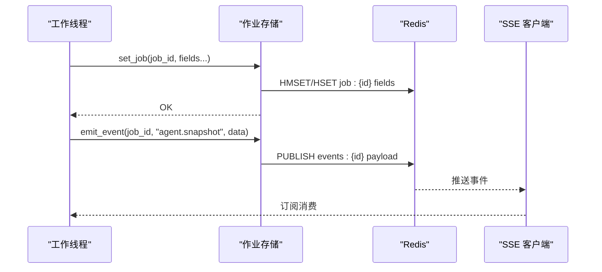
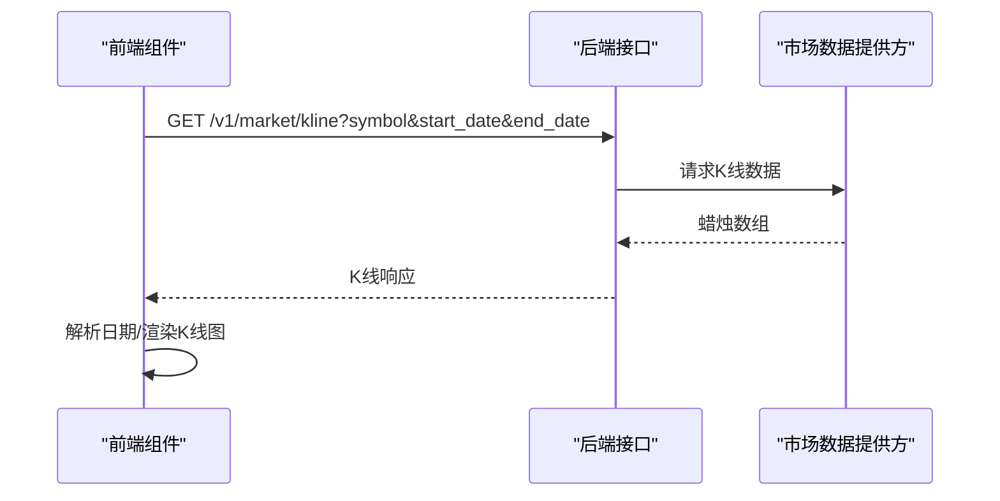
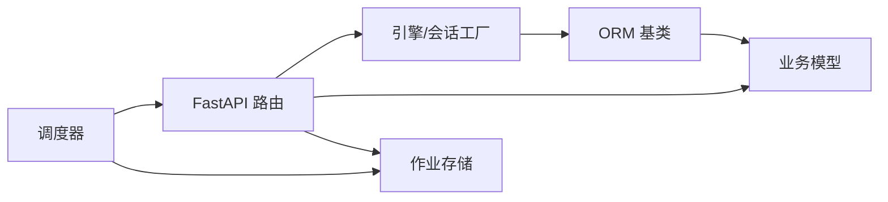

# 数据库设计

<cite>
**本文引用的文件**   
- [api/database.py](file://api/database.py)
- [api/main.py](file://api/main.py)
- [api/job_store.py](file://api/job_store.py)
- [api/job_store_redis.py](file://api/job_store_redis.py)
- [scheduler/main.py](file://scheduler/main.py)
- [frontend/src/types/index.ts](file://frontend/src/types/index.ts)
- [frontend/src/components/KlinePanel.tsx](file://frontend/src/components/KlinePanel.tsx)
- [tests/test_job_store.py](file://tests/test_job_store.py)
- [tests/test_job_store_redis.py](file://tests/test_job_store_redis.py)
- [tests/test_scheduled_queue.py](file://tests/test_scheduled_queue.py)
- [tests/test_api_smoke.py](file://tests/test_api_smoke.py)
</cite>

## 目录
1. [简介](#简介)
2. [项目结构](#项目结构)
3. [核心组件](#核心组件)
4. [架构总览](#架构总览)
5. [详细组件分析](#详细组件分析)
6. [依赖分析](#依赖分析)
7. [性能考量](#性能考量)
8. [故障排查指南](#故障排查指南)
9. [结论](#结论)
10. [附录](#附录)

## 简介
本设计文档面向 TradingAgents-AShare 的数据库系统，聚焦于后端数据库模型、表结构关系与数据类型定义，覆盖用户、报告、作业、计划任务、反馈、导入持仓等核心实体；同时阐述索引策略、查询优化、数据完整性保障、ORM 映射、事务处理与并发控制机制，并给出数据库迁移、备份恢复与安全建议，以及数据访问模式与缓存策略。

## 项目结构
数据库层主要由以下部分组成：
- ORM 模型与初始化：在数据库配置模块中定义 SQLAlchemy 基类、引擎、会话工厂及各业务模型类，并提供初始化与向后兼容的列补全逻辑。
- API 层：通过 FastAPI 路由对模型进行增删改查操作，暴露报告、用户、计划任务等接口。
- 作业存储：提供内存与 Redis 两种作业状态与事件存储实现，支持多实例共享与实时事件推送。
- 调度器：负责扫描与触发计划任务，维护运行队列与并发限制。
- 前端类型：定义 K 线与报告等数据结构，用于前后端契约一致。

图表来源
- [api/database.py:1-175](file://api/database.py#L1-L175)
- [api/main.py:3400-3490](file://api/main.py#L3400-L3490)
- [api/job_store.py:1-305](file://api/job_store.py#L1-L305)
- [api/job_store_redis.py:1-79](file://api/job_store_redis.py#L1-L79)
- [scheduler/main.py:302-335](file://scheduler/main.py#L302-L335)
- [frontend/src/types/index.ts:283-345](file://frontend/src/types/index.ts#L283-L345)
- [frontend/src/components/KlinePanel.tsx:1-177](file://frontend/src/components/KlinePanel.tsx#L1-L177)

章节来源
- [api/database.py:1-175](file://api/database.py#L1-L175)
- [api/main.py:3400-3490](file://api/main.py#L3400-L3490)
- [api/job_store.py:1-305](file://api/job_store.py#L1-L305)
- [api/job_store_redis.py:1-79](file://api/job_store_redis.py#L1-L79)
- [scheduler/main.py:302-335](file://scheduler/main.py#L302-L335)
- [frontend/src/types/index.ts:283-345](file://frontend/src/types/index.ts#L283-L345)
- [frontend/src/components/KlinePanel.tsx:1-177](file://frontend/src/components/KlinePanel.tsx#L1-L177)

## 核心组件
本节从数据模型、字段与约束、索引策略、查询优化、完整性与安全等方面，系统梳理核心实体。

- 用户表（users）
  - 字段要点：主键、邮箱唯一性、登录 IP 记录、邮件/企业微信通知开关、创建/更新时间等。
  - 约束：邮箱唯一；布尔开关默认值；IP 字段长度上限。
  - 索引：按用户标识与邮箱建立索引以支持登录与查找。
  - 完整性：外键约束体现在业务层（如报告表中的 user_id），需配合应用层校验。
  - 安全：令牌迁移采用哈希存储，敏感字段加密重加密。

- 报告表（reports）
  - 字段要点：关联用户、标的代码、交易日期、状态、方向、错误信息、各类分析报告文本、JSON 结构的追踪信息等。
  - 约束：状态枚举化；可空字段用于异步生成；JSON 列用于复杂追踪结构。
  - 索引：按 user_id、symbol、trade_date、status 建立复合索引以优化查询与分页。
  - 完整性：通过应用层状态机与作业存储协同保证最终一致性。
  - 性能：大文本字段拆分为多列，减少单列膨胀；JSON 列按需读取。

- 计划分析任务表（scheduled_analysis）
  - 字段要点：用户标识、标的、时间窗（短期/中期）、触发时间、状态、最近运行时间与状态等。
  - 约束：触发时间范围校验；并发与等待队列管理。
  - 索引：按 user_id、状态、触发时间排序字段建立索引。
  - 并发：调度器维护运行队列与最大并发，避免资源争用。

- 反馈表（feedbacks）
  - 字段要点：用户标识、邮箱、主题、内容、管理员回复、已读标记、创建/更新时间。
  - 约束：必填字段与可空回复；时间戳自动维护。
  - 索引：按 user_id、is_read、created_at 建立索引。

- 导入持仓快照表（imported_portfolio_positions）
  - 字段要点：用户标识、来源、标的、名称、当前仓位、成本均价、市值等。
  - 约束：来源枚举化；数值精度满足财务计算。
  - 索引：按 user_id、symbol 建立索引，便于上下文注入。

- 其他模型（令牌、LLM 配置、赞助、版本统计等）
  - 令牌表：存储哈希后的密钥与提示后缀，支持迁移与重加密。
  - LLM 配置表：扩展 webhook 加密与默认分析师列表。
  - 版本统计与赞助表：辅助运营与审计。

章节来源
- [api/database.py:98-175](file://api/database.py#L98-L175)
- [api/database.py:242-458](file://api/database.py#L242-L458)
- [api/main.py:3400-3490](file://api/main.py#L3400-L3490)
- [tests/test_api_smoke.py:761-787](file://tests/test_api_smoke.py#L761-L787)

## 架构总览
数据库层采用 SQLAlchemy ORM，统一的会话工厂与基类，支持 SQLite/WAL 与 PostgreSQL/MySQL 连接池配置。API 层通过依赖注入获取会话，完成 CRUD；作业状态与事件通过内存或 Redis 共享，调度器周期扫描并触发任务，前端通过接口消费报告与 K 线数据。

图表来源
- [api/database.py:242-458](file://api/database.py#L242-L458)

## 详细组件分析

### 报告模型与 API 流程
- 模型字段与约束：涵盖状态、方向、错误、JSON 追踪与多类报告文本，支持异步生成与回溯。
- API 行为：提供创建、查询与删除接口；查询时补充名称与作业运行态。
- 事务与一致性：API 层使用会话依赖注入；删除失败返回 404；最终一致性由作业存储与调度器保障。

图表来源
- [api/main.py:3400-3490](file://api/main.py#L3400-L3490)
- [api/database.py:242-290](file://api/database.py#L242-L290)

章节来源
- [api/main.py:3400-3490](file://api/main.py#L3400-L3490)
- [api/database.py:242-290](file://api/database.py#L242-L290)

### 计划任务与调度流程
- 触发校验：时间格式与非交易时段限制；最多保留固定数量的任务项。
- 调度执行：扫描待运行任务，更新最后运行状态并提交作业；按并发限制逐步启动。
- 队列与并发：维护等待队列与运行集合，限制最大并发，确保资源可控。

图表来源
- [scheduler/main.py:302-335](file://scheduler/main.py#L302-L335)
- [api/services/scheduled_service.py:1-42](file://api/services/scheduled_service.py#L1-L42)

章节来源
- [scheduler/main.py:302-335](file://scheduler/main.py#L302-L335)
- [api/services/scheduled_service.py:1-42](file://api/services/scheduled_service.py#L1-L42)

### 作业存储与事件流
- 内存实现：基于字典与有界队列，支持合并写入、溢出丢弃最旧事件、清理句柄。
- Redis 实现：使用 Hash 存状态，Pub/Sub 发布事件，支持多实例共享与持久化 TTL。
- 选择策略：根据环境变量选择实现，缺失依赖时回退到内存实现。

图表来源
- [api/job_store.py:169-192](file://api/job_store.py#L169-L192)
- [api/job_store_redis.py:51-79](file://api/job_store_redis.py#L51-L79)

章节来源
- [api/job_store.py:1-305](file://api/job_store.py#L1-L305)
- [api/job_store_redis.py:1-79](file://api/job_store_redis.py#L1-L79)
- [tests/test_job_store.py:1-182](file://tests/test_job_store.py#L1-L182)
- [tests/test_job_store_redis.py:1-93](file://tests/test_job_store_redis.py#L1-L93)

### K 线数据访问与前端展示
- 后端接口：提供指数与个股 K 线查询，按日期区间返回蜡烛数据。
- 前端类型：定义 K 线蜡烛结构与响应体，组件将字符串日期转换为业务日并渲染。
- 性能：前端按可视宽度裁剪显示条数，避免一次性绘制过多蜡烛。

图表来源
- [frontend/src/components/KlinePanel.tsx:1-177](file://frontend/src/components/KlinePanel.tsx#L1-L177)
- [frontend/src/types/index.ts:283-345](file://frontend/src/types/index.ts#L283-L345)
- [api/main.py:2482-2492](file://api/main.py#L2482-L2492)

章节来源
- [frontend/src/components/KlinePanel.tsx:1-177](file://frontend/src/components/KlinePanel.tsx#L1-L177)
- [frontend/src/types/index.ts:283-345](file://frontend/src/types/index.ts#L283-L345)
- [api/main.py:2482-2492](file://api/main.py#L2482-L2492)

## 依赖分析
- ORM 与引擎：统一的 Base、SessionLocal 与 engine；SQLite 使用 WAL，PostgreSQL/MySQL 使用连接池。
- 模型依赖：各模型继承 Base，通过外键与关系在应用层体现；用户与报告存在一对多关系。
- API 依赖：路由依赖注入 get_db 获取会话；作业存储通过工厂函数按环境选择实现。
- 调度器依赖：扫描服务与作业存储协作，维护并发与等待队列。

图表来源
- [api/database.py:1-175](file://api/database.py#L1-L175)
- [api/main.py:3400-3490](file://api/main.py#L3400-L3490)
- [api/job_store.py:289-305](file://api/job_store.py#L289-L305)
- [scheduler/main.py:302-335](file://scheduler/main.py#L302-L335)

章节来源
- [api/database.py:1-175](file://api/database.py#L1-L175)
- [api/main.py:3400-3490](file://api/main.py#L3400-L3490)
- [api/job_store.py:289-305](file://api/job_store.py#L289-L305)
- [scheduler/main.py:302-335](file://scheduler/main.py#L302-L335)

## 性能考量
- 连接池与并发
  - SQLite：启用 WAL，提升并发读写；线程池大小适配本地部署。
  - PostgreSQL/MySQL：较大连接池与溢出配置，满足高并发场景。
- 索引策略
  - 报告：按 user_id、symbol、trade_date、status 建立复合索引，支持分页与过滤。
  - 计划任务：按 user_id、状态、触发时间建立索引，加速扫描与认领。
  - 反馈：按 user_id、is_read、created_at 建立索引，优化检索与统计。
- 查询优化
  - 分页与投影：仅查询必要字段，避免大文本列参与排序。
  - 缓存热点：对高频报表与 K 线结果进行应用层缓存（如 Redis）。
- 事务与锁
  - 使用会话级事务，批量写入时合并提交，减少锁竞争。
  - 乐观锁：对并发更新的字段采用 CAS 或版本号控制。
- I/O 与序列化
  - JSON 列按需读取，避免不必要的反序列化开销。
  - 作业事件采用有界队列，溢出丢弃最旧事件，防止内存膨胀。

## 故障排查指南
- 报告状态异常
  - 现象：报告状态为“运行中”但无对应作业。
  - 处理：查询作业存储确认是否存在；若无则归档为孤儿报告并清理。
- 作业事件丢失
  - 现象：SSE 订阅断连后事件缺失。
  - 处理：检查作业存储实现（内存/Redis）与队列容量；Redis 模式下确认 Pub/Sub 通道与 TTL 设置。
- 计划任务未触发
  - 现象：到达触发时间未执行。
  - 处理：核对触发时间范围与非交易时段限制；检查并发限制与等待队列。
- 数据迁移失败
  - 现象：令牌或密钥迁移报错。
  - 处理：查看迁移日志，确认密钥变更与重加密流程是否成功。

章节来源
- [api/main.py:3462-3477](file://api/main.py#L3462-L3477)
- [api/job_store.py:169-192](file://api/job_store.py#L169-L192)
- [api/job_store_redis.py:21-29](file://api/job_store_redis.py#L21-L29)
- [tests/test_scheduled_queue.py:35-81](file://tests/test_scheduled_queue.py#L35-L81)
- [tests/test_job_store.py:121-143](file://tests/test_job_store.py#L121-L143)

## 结论
该数据库设计以 SQLAlchemy ORM 为核心，结合内存与 Redis 作业存储，实现了高可用的报告与计划任务体系。通过合理的索引策略、连接池配置与并发控制，兼顾了开发效率与运行性能。建议在生产环境中优先采用 PostgreSQL/MySQL，并结合 Redis 缓存与监控告警，持续优化查询路径与资源使用。

## 附录

### 数据库迁移指南
- 初始化与补列
  - 首次启动自动创建表；对现有 SQLite 部署自动添加轻量列（如报告方向、状态、错误、追踪 JSON 等）。
- 令牌与密钥迁移
  - 将明文令牌迁移为 HMAC-SHA256 哈希存储，并记录后缀提示；当应用密钥变更时重新加密用户敏感字段。
- 版本演进
  - 采用“补列+默认值”的渐进式迁移策略，避免破坏性变更；后续可引入正式迁移工具。

章节来源
- [api/database.py:91-143](file://api/database.py#L91-L143)
- [api/database.py:146-175](file://api/database.py#L146-L175)

### 备份与恢复策略
- SQLite
  - WAL 模式下可直接复制数据库文件；建议定期归档并验证恢复流程。
- PostgreSQL/MySQL
  - 使用官方备份工具导出；制定恢复演练计划，验证时间点恢复能力。
- 作业状态
  - 若使用 Redis，备份其数据集并验证 Pub/Sub 通道可用性；必要时重建前缀空间。

### 数据安全措施
- 传输与存储
  - 生产环境强制 TLS；数据库凭据通过环境变量注入。
- 最小权限
  - 应用连接数据库仅授予必要权限；审计关键 DDL/DML 操作。
- 敏感数据
  - 令牌与密钥采用哈希存储与重加密；日志脱敏，避免泄露。

### ORM 映射与事务
- 映射
  - 所有模型继承自统一 Base；字段类型与约束在模型中显式声明。
- 事务
  - 使用会话工厂创建会话；API 层通过依赖注入确保每个请求独立会话；异常时自动回滚。
- 并发控制
  - 通过调度器并发限制与作业存储队列，避免资源争用；Redis 模式下利用原子操作保障一致性。

章节来源
- [api/database.py:1-175](file://api/database.py#L1-L175)
- [api/main.py:3400-3490](file://api/main.py#L3400-L3490)
- [scheduler/main.py:302-335](file://scheduler/main.py#L302-L335)