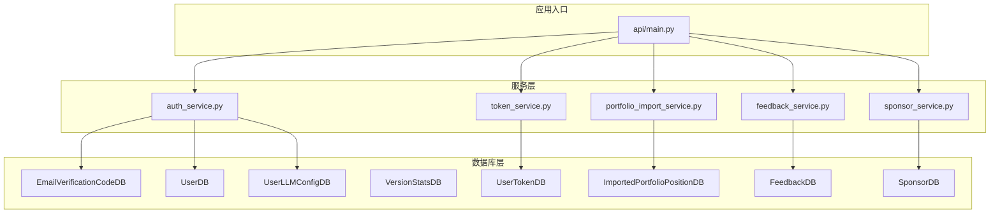
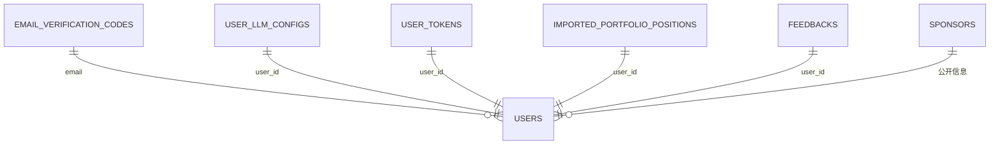
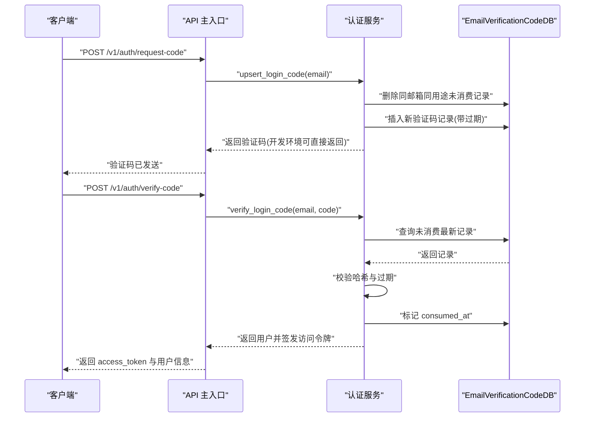
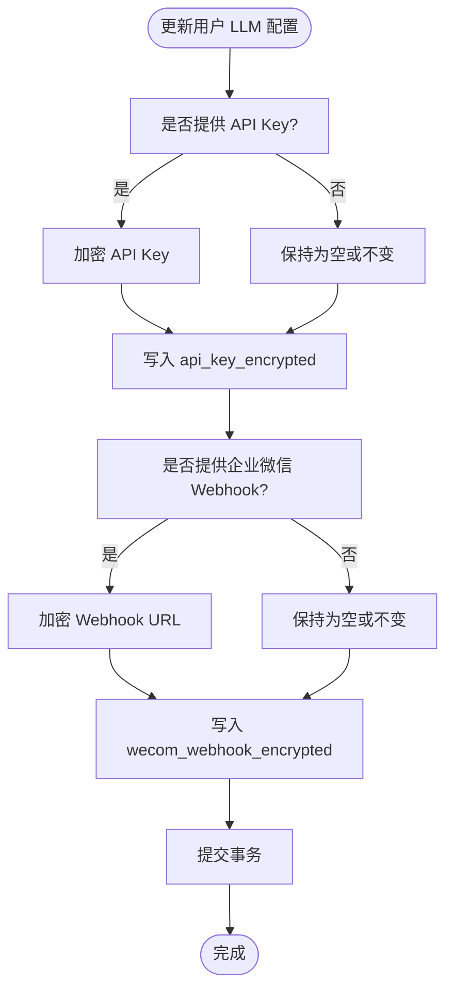
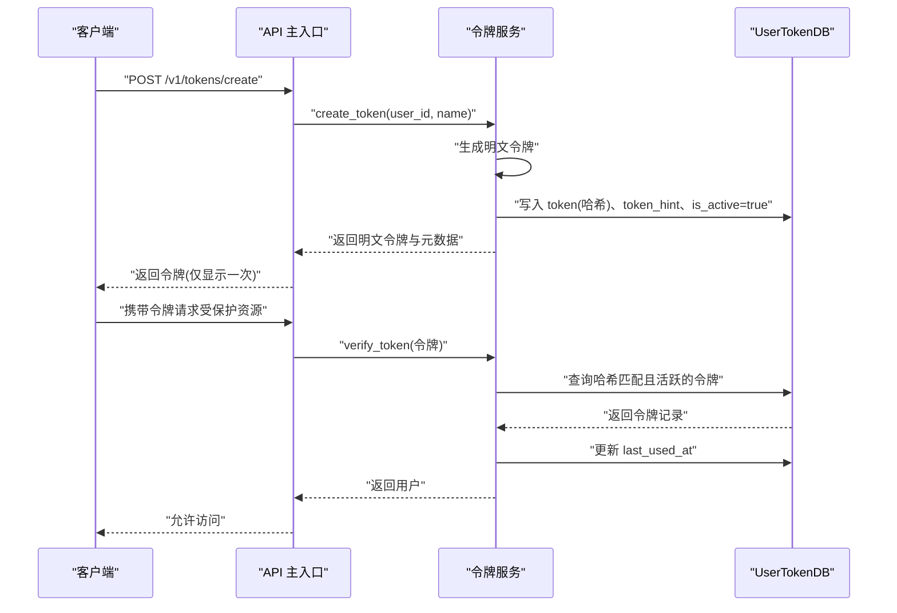
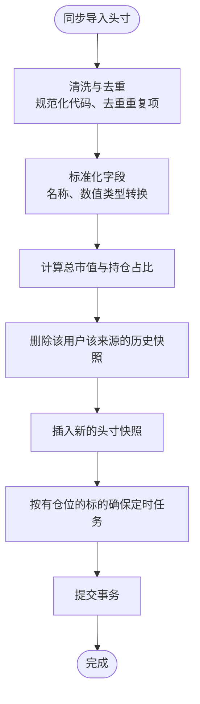
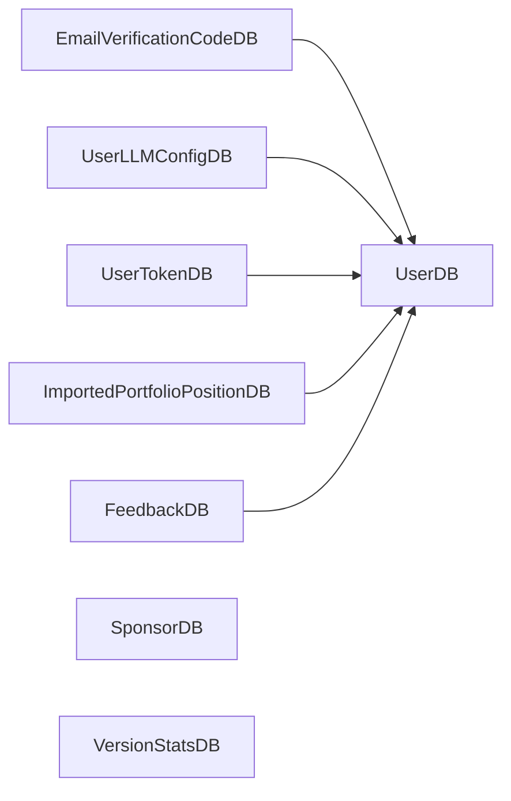

# 支撑数据模型

<cite>
**本文引用的文件**
- [api/database.py](file://api/database.py)
- [api/services/auth_service.py](file://api/services/auth_service.py)
- [api/services/token_service.py](file://api/services/token_service.py)
- [api/services/portfolio_import_service.py](file://api/services/portfolio_import_service.py)
- [api/services/feedback_service.py](file://api/services/feedback_service.py)
- [api/services/sponsor_service.py](file://api/services/sponsor_service.py)
- [api/main.py](file://api/main.py)
- [tests/test_portfolio_import.py](file://tests/test_portfolio_import.py)
</cite>

## 目录
1. [简介](#简介)
2. [项目结构](#项目结构)
3. [核心组件](#核心组件)
4. [架构总览](#架构总览)
5. [详细组件分析](#详细组件分析)
6. [依赖分析](#依赖分析)
7. [性能考量](#性能考量)
8. [故障排查指南](#故障排查指南)
9. [结论](#结论)
10. [附录](#附录)

## 简介
本文件聚焦 TradingAgents-AShare 的支撑性数据模型，系统性梳理以下模型的结构、字段、业务用途、与核心模型的关系、数据流转、查询优化、性能与安全策略，并给出实际业务案例与最佳实践建议：
- EmailVerificationCodeDB：邮箱验证码与登录流程支撑
- UserLLMConfigDB：用户 LLM 配置与敏感密钥加密存储
- UserTokenDB：用户 API Token 及其哈希化与迁移策略
- VersionStatsDB：版本统计与访问追踪
- SponsorDB：赞助商信息（公开读取）
- FeedbackDB：用户反馈与消息板
- ImportedPortfolioPositionDB：导入的组合头寸快照与交易点

## 项目结构
支撑数据模型位于数据库层定义文件中，配套的服务层负责业务逻辑与安全处理，主程序入口提供对外接口。

图表来源
- [api/database.py](file://api/database.py)
- [api/services/auth_service.py](file://api/services/auth_service.py)
- [api/services/token_service.py](file://api/services/token_service.py)
- [api/services/portfolio_import_service.py](file://api/services/portfolio_import_service.py)
- [api/services/feedback_service.py](file://api/services/feedback_service.py)
- [api/services/sponsor_service.py](file://api/services/sponsor_service.py)
- [api/main.py](file://api/main.py)

章节来源
- [api/database.py](file://api/database.py)
- [api/main.py](file://api/main.py)

## 核心组件
- EmailVerificationCodeDB：用于邮箱验证码生成、校验与消费，支撑免密码登录流程。
- UserLLMConfigDB：保存用户 LLM 提供方、后端地址、模型选择、最大辩论轮次、默认分析师列表以及加密存储的 API Key 与企业微信 Webhook。
- UserTokenDB：用户 API Token 的持久化，支持一次性明文返回与 HMAC 哈希存储；含 token 提示位与活跃状态。
- VersionStatsDB：版本号、随机 nonce、远端 IP 与时间戳，用于版本统计与访问追踪。
- SponsorDB：公开展示的赞助商信息，含类型、名称、链接、头像、日期与排序。
- FeedbackDB：用户反馈表，支持分页、未读计数、管理员回复标记。
- ImportedPortfolioPositionDB：导入的组合头寸快照与最近交易点，按用户+来源+股票去重，支持自动调度同步。

章节来源
- [api/database.py](file://api/database.py)

## 架构总览
支撑数据模型围绕“认证与安全”“用户配置与密钥”“令牌与访问控制”“导入与分析上下文”“公开信息与反馈”展开，与核心模型（如 UserDB、ReportDB）通过外键或业务关联协同工作。

图表来源
- [api/database.py](file://api/database.py)

## 详细组件分析

### EmailVerificationCodeDB 模型
- 作用：支撑邮箱验证码登录流程，包括生成、哈希存储、过期控制与消费标记。
- 关键字段
  - id：主键
  - email：索引，目标邮箱
  - code_hash：验证码哈希值（结合邮箱、验证码与密钥）
  - purpose：用途，默认“login”
  - expires_at：过期时间
  - consumed_at：消费时间（校验成功后写入）
  - created_at：创建时间
- 业务用途
  - 生成与发送验证码：服务层生成六位数字验证码并哈希存储，设置 10 分钟有效期
  - 验证码校验：按邮箱+用途+未消费条件查询最新一条记录，校验哈希与过期时间，成功则标记消费并更新用户最后登录信息
- 数据流
  - 生成：请求验证码 → 生成验证码 → 计算哈希 → 写入记录 → 发送邮件/控制台
  - 校验：提交验证码 → 查询未消费最新记录 → 校验哈希与过期 → 标记消费 → 创建/更新用户 → 返回访问令牌
- 安全与性能
  - 哈希存储避免明文泄露；过期时间严格控制
  - 查询按 email+purpose+未消费+时间倒序，确保幂等与一致性
- 使用场景
  - 邮箱登录、二次验证、找回密码（如扩展）
- 最佳实践
  - 控制同一邮箱同用途并发验证码数量，避免滥用
  - 合理设置过期时间与重试限制
  - 邮件发送失败时回退到控制台输出（开发环境）

图表来源
- [api/services/auth_service.py](file://api/services/auth_service.py)
- [api/main.py](file://api/main.py)

章节来源
- [api/database.py](file://api/database.py)
- [api/services/auth_service.py](file://api/services/auth_service.py)
- [api/main.py](file://api/main.py)

### UserLLMConfigDB 模型
- 作用：保存用户的 LLM 配置与敏感信息（API Key、企业微信 Webhook），采用对称加密存储。
- 关键字段
  - user_id：主键，关联用户
  - llm_provider、backend_url、quick_think_llm、deep_think_llm：LLM 提供方与模型选择
  - max_debate_rounds、max_risk_discuss_rounds：对话轮次上限
  - api_key_encrypted、wecom_webhook_encrypted：加密存储的敏感信息
  - default_analysts：默认分析师列表（JSON 字符串）
  - created_at、updated_at：时间戳
- 业务用途
  - 用户个性化 LLM 配置管理
  - 加密存储第三方密钥与回调地址，支持密钥轮换与重新加密
- 数据流
  - 更新配置：服务层接收参数，必要字段加密后写入
  - 读取配置：按 user_id 查询，解密敏感字段用于运行时使用
- 安全与性能
  - 对称加密基于应用密钥派生的 Fernet 密钥，支持密钥变更后的批量重加密
  - 服务层提供解密回退逻辑，兼容历史密钥
- 使用场景
  - 自定义 LLM 提供方、模型切换、风控讨论轮次调整
- 最佳实践
  - 仅在需要时解密敏感字段，避免长期驻留内存
  - 定期轮换密钥并触发重加密迁移

图表来源
- [api/services/auth_service.py](file://api/services/auth_service.py)
- [api/database.py](file://api/database.py)

章节来源
- [api/database.py](file://api/database.py)
- [api/services/auth_service.py](file://api/services/auth_service.py)

### UserTokenDB 模型
- 作用：用户 API Token 的持久化，支持一次性明文返回与 HMAC 哈希存储，含 token 提示位与活跃状态。
- 关键字段
  - id：主键
  - user_id：索引，关联用户
  - name：令牌名称
  - token：唯一索引，存储 HMAC-SHA256 哈希
  - token_hint：明文后四位提示位（仅用于显示）
  - is_active：是否启用
  - last_used_at：最后使用时间
  - created_at：创建时间
- 业务用途
  - 生成新令牌：一次性返回完整明文令牌字符串，数据库仅存储哈希与提示位
  - 校验令牌：根据前缀判断与哈希匹配，返回绑定用户
- 数据流
  - 生成：生成明文令牌 → 计算哈希 → 写入 token、token_hint → 返回明文一次
  - 校验：校验前缀 → 计算哈希 → 查询活跃令牌 → 更新最后使用时间 → 返回用户
- 安全与性能
  - 明文仅在创建时返回一次，数据库只存哈希，降低泄露面
  - 迁移逻辑：将历史明文令牌转换为哈希并补全 token_hint
- 使用场景
  - 第三方集成、自动化脚本调用 API
- 最佳实践
  - 控制单用户令牌数量上限，定期清理不再使用的令牌
  - 令牌泄露时立即禁用或删除

图表来源
- [api/services/token_service.py](file://api/services/token_service.py)
- [api/database.py](file://api/database.py)

章节来源
- [api/database.py](file://api/database.py)
- [api/services/token_service.py](file://api/services/token_service.py)

### VersionStatsDB 模型
- 作用：版本统计与访问追踪，记录版本号、随机 nonce、远端 IP 与时间戳。
- 关键字段
  - id：自增主键
  - version：版本号
  - nonce：随机数
  - remote_ip：远端 IP（索引）
  - created_at：创建时间
- 业务用途
  - 统计各版本访问量与来源 IP
  - 与前端版本号联动进行健康度监控
- 使用场景
  - 版本发布后的访问统计、异常追踪
- 最佳实践
  - 结合日志与指标系统进行聚合分析
  - 对高频来源进行限流或白名单控制

章节来源
- [api/database.py](file://api/database.py)
- [api/main.py](file://api/main.py)

### SponsorDB 模型
- 作用：公开展示的赞助商信息，由后台管理直接维护，前台仅做公开读取。
- 关键字段
  - id：主键
  - sponsor_type：类型（money/token）
  - name、github、avatar、email、provider、amount、date、sort_order、is_visible
  - created_at、updated_at
- 业务用途
  - 赞助商列表展示，金额字段对公众隐藏
- 使用场景
  - “致谢页面”公开展示
- 最佳实践
  - 严格控制金额字段的可见范围，避免泄露敏感财务信息

章节来源
- [api/database.py](file://api/database.py)
- [api/services/sponsor_service.py](file://api/services/sponsor_service.py)

### FeedbackDB 模型
- 作用：用户反馈与消息板，支持分页、未读计数与管理员回复标记。
- 关键字段
  - id：主键
  - user_id、user_email：用户标识
  - subject、content：主题与内容
  - admin_reply、replied_at：管理员回复与时间
  - is_read：是否已读
  - created_at、updated_at
- 业务用途
  - 用户反馈收集与处理
- 使用场景
  - 反馈列表、未读提醒、回复管理
- 最佳实践
  - 对未读计数进行缓存与异步刷新
  - 管理员回复后标记已读，提升用户体验

章节来源
- [api/database.py](file://api/database.py)
- [api/services/feedback_service.py](file://api/services/feedback_service.py)

### ImportedPortfolioPositionDB 模型
- 作用：导入的组合头寸快照与最近交易点，按用户+来源+股票去重，支持自动调度同步。
- 关键字段
  - id：主键
  - user_id：索引
  - source：来源标签（如 manual、某券商）
  - symbol、security_name：股票代码与名称
  - current_position、available_position、average_cost、market_value、current_position_pct：头寸与估值
  - trade_points_json：最近交易点（JSON）
  - trade_points_count、latest_trade_at、latest_trade_action：交易点统计与最近动作
  - last_imported_at：最后导入时间
  - created_at、updated_at
- 业务用途
  - 支持多来源导入（手动、券商等），统一构建用户上下文
  - 为定时分析任务提供“持有/观察”等上下文信息
- 数据流
  - 同步：清洗去重 → 计算占比 → 删除该来源旧快照 → 插入新快照 → 触发定时任务
  - 查询：按用户列出所有来源头寸，支持排序与汇总
- 使用场景
  - 自动化定时分析、投资决策辅助
- 最佳实践
  - 输入标准化（代码规范化、去重、百分比计算）
  - 交易点 JSON 结构化存储，便于后续分析与可视化

图表来源
- [api/services/portfolio_import_service.py](file://api/services/portfolio_import_service.py)
- [api/database.py](file://api/database.py)

章节来源
- [api/database.py](file://api/database.py)
- [api/services/portfolio_import_service.py](file://api/services/portfolio_import_service.py)
- [tests/test_portfolio_import.py](file://tests/test_portfolio_import.py)

## 依赖分析
- EmailVerificationCodeDB 与 UserDB：通过 email 关联，验证码消费后更新用户登录信息
- UserLLMConfigDB 与 UserDB：一对一 user_id 关联，承载用户个性化 LLM 配置
- UserTokenDB 与 UserDB：一对多 user_id 关联，一个用户可拥有多个令牌
- ImportedPortfolioPositionDB 与 UserDB：一对多 user_id 关联，支持多来源头寸
- FeedbackDB 与 UserDB：一对多 user_id 关联，用户反馈归属
- SponsorDB：独立公开信息表，与用户无直接关联
- VersionStatsDB：独立统计表，记录版本与访问信息

图表来源
- [api/database.py](file://api/database.py)

章节来源
- [api/database.py](file://api/database.py)

## 性能考量
- 索引设计
  - 多处使用 email、user_id、token 唯一索引与 created_at/updated_at 时间索引，提升查询与排序效率
- 连接池与数据库模式
  - SQLite 默认 WAL 模式（若父目录可写）提升并发读写
  - 非 SQLite 使用更大连接池与回收策略
- 查询优化
  - 验证码查询按 email+purpose+未消费+时间倒序，保证最新记录优先
  - 令牌校验按哈希与活跃状态过滤，减少扫描范围
  - 头寸查询按市值/数量/代码排序，利于前端展示
- 缓存与批处理
  - 反馈未读计数可缓存并异步刷新
  - 大批量迁移（令牌哈希化、密钥重加密）分批执行并记录进度

章节来源
- [api/database.py](file://api/database.py)
- [api/services/token_service.py](file://api/services/token_service.py)
- [api/services/auth_service.py](file://api/services/auth_service.py)
- [api/services/portfolio_import_service.py](file://api/services/portfolio_import_service.py)

## 故障排查指南
- 验证码问题
  - 症状：无法收到或验证码无效
  - 排查：确认邮箱格式、SMTP 配置、验证码是否过期、是否已被消费
- 令牌问题
  - 症状：令牌无法通过校验或频繁失效
  - 排查：确认令牌前缀、哈希是否正确、是否被禁用、是否触发迁移
- 密钥解密失败
  - 症状：无法读取用户 LLM 密钥
  - 排查：检查应用密钥是否变更、是否存在回退密钥、是否已完成重加密迁移
- 头寸同步异常
  - 症状：导入后未生效或重复
  - 排查：检查代码规范化、去重逻辑、来源标签、定时任务是否创建

章节来源
- [api/services/auth_service.py](file://api/services/auth_service.py)
- [api/services/token_service.py](file://api/services/token_service.py)
- [api/services/portfolio_import_service.py](file://api/services/portfolio_import_service.py)

## 结论
上述支撑数据模型围绕“认证与安全”“用户配置与密钥”“令牌与访问控制”“导入与分析上下文”“公开信息与反馈”五大维度构建，既满足功能需求，又兼顾安全性与性能。通过合理的索引、加密与迁移策略，保障系统在多用户场景下的稳定运行。

## 附录
- 实际业务案例
  - 邮箱登录：请求验证码 → 校验验证码 → 创建/更新用户 → 签发访问令牌
  - 导入头寸：清洗去重 → 计算占比 → 替换快照 → 自动创建定时任务
  - 管理员回复反馈：标记已读、记录回复时间、通知用户
- 最佳实践清单
  - 令牌：仅在创建时暴露明文，数据库仅存哈希与提示位
  - 密钥：始终加密存储，定期轮换并触发重加密
  - 头寸：标准化输入、去重与占比计算，按用户+来源+股票去重
  - 日志：记录关键操作与异常，便于审计与排障