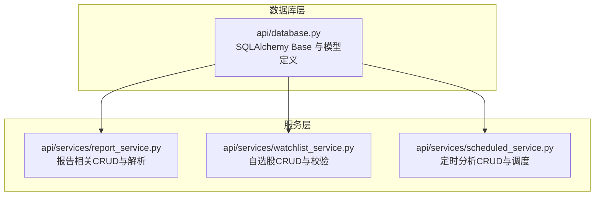
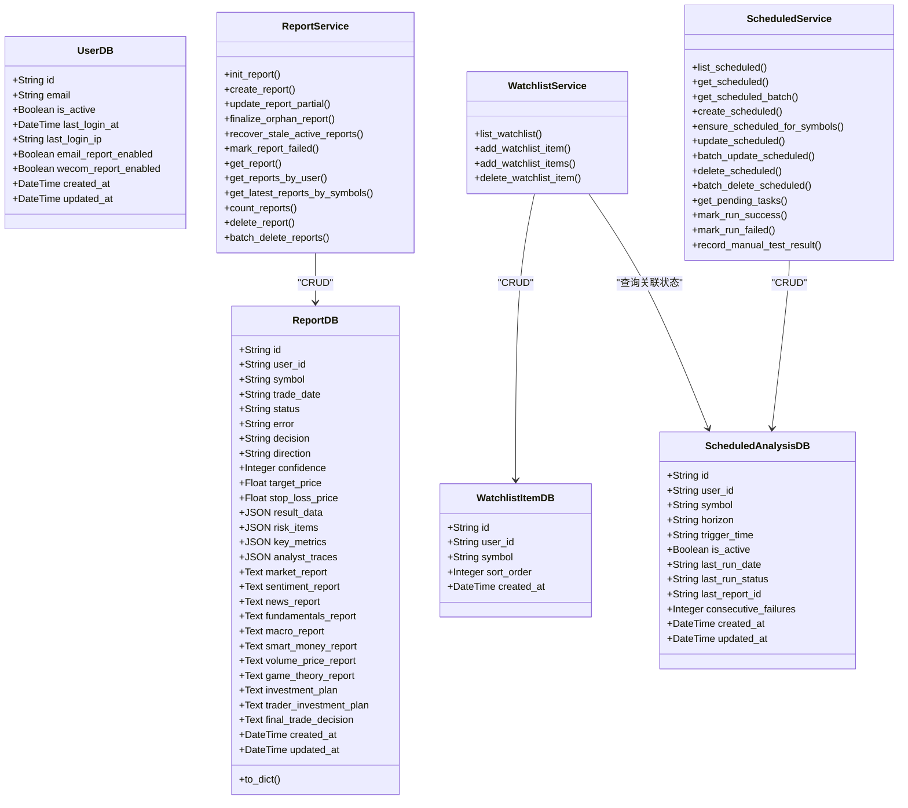
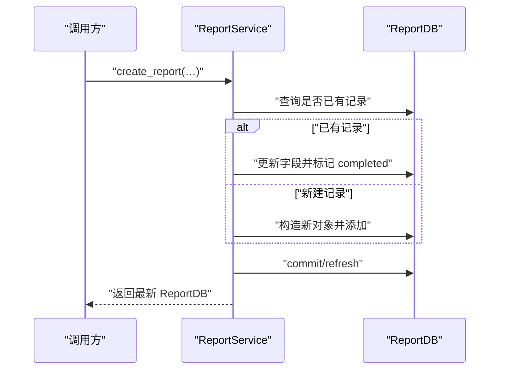
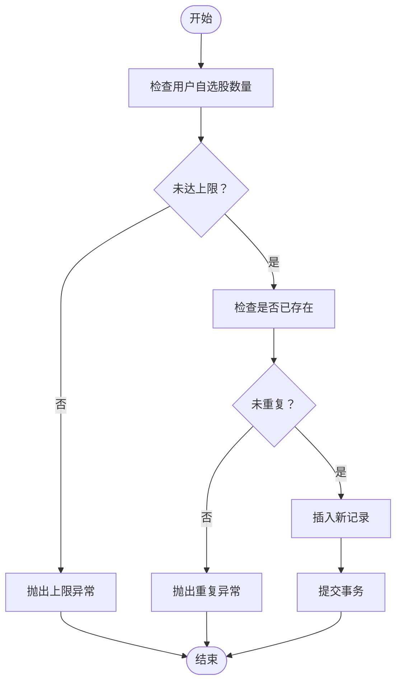
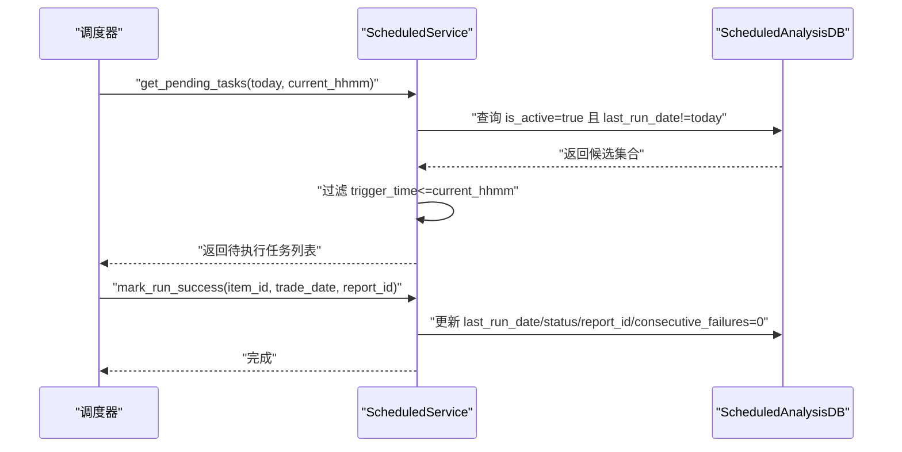
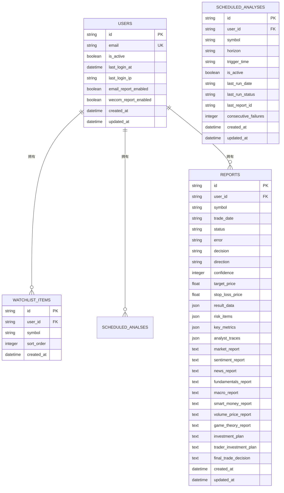

# 数据模型

<cite>
**本文引用的文件**
- [api/database.py](file://api/database.py)
- [api/services/report_service.py](file://api/services/report_service.py)
- [api/services/watchlist_service.py](file://api/services/watchlist_service.py)
- [api/services/scheduled_service.py](file://api/services/scheduled_service.py)
</cite>

## 目录
1. [简介](#简介)
2. [项目结构](#项目结构)
3. [核心组件](#核心组件)
4. [架构总览](#架构总览)
5. [详细组件分析](#详细组件分析)
6. [依赖分析](#依赖分析)
7. [性能考虑](#性能考虑)
8. [故障排查指南](#故障排查指南)
9. [结论](#结论)
10. [附录](#附录)

## 简介
本文件系统性梳理 TradingAgents-AShare 的数据模型设计与实现，重点覆盖以下核心模型类：ReportDB、UserDB、WatchlistItemDB、ScheduledAnalysisDB 等。内容涵盖字段定义、数据类型、约束与索引策略、模型间关系映射、ORM 属性与方法、序列化逻辑、生命周期管理、验证规则与数据完整性保障机制，并提供使用示例与最佳实践。

## 项目结构
数据库模型集中于 api/database.py，配套服务层在 api/services 下，通过 SQLAlchemy ORM 进行持久化操作。初始化流程在数据库模块中完成，包含基础表创建与历史部署的列补丁迁移。

图表来源
- [api/database.py:242-483](file://api/database.py#L242-L483)
- [api/services/report_service.py:17](file://api/services/report_service.py#L17)
- [api/services/watchlist_service.py:8](file://api/services/watchlist_service.py#L8)
- [api/services/scheduled_service.py:8](file://api/services/scheduled_service.py#L8)

章节来源
- [api/database.py:91-143](file://api/database.py#L91-L143)

## 核心组件
本节对关键模型进行逐项说明，包括字段、类型、约束、索引、ORM 属性与序列化方法。

- ReportDB
  - 表名：reports
  - 主键：id（字符串）
  - 关键字段与类型
    - user_id：字符串，索引，可空（为未来多用户支持预留）
    - symbol：字符串（股票代码），索引，非空
    - trade_date：字符串（YYYY-MM-DD），非空
    - status：字符串，默认 completed，索引；取值：pending/running/completed/failed
    - error：文本，可空
    - decision：字符串，可空（决策关键词）
    - direction：字符串，可空（看多/偏多/中性/偏空/看空）
    - confidence：整数，0-100，可空
    - target_price、stop_loss_price：浮点数，可空
    - result_data、risk_items、key_metrics、analyst_traces：JSON，可空
    - 各类子报告字段：market_report、sentiment_report、news_report、fundamentals_report、macro_report、smart_money_report、volume_price_report、game_theory_report、investment_plan、trader_investment_plan、final_trade_decision：文本，可空
    - created_at、updated_at：时间戳，默认当前 UTC，更新时自动写入
  - 约束与索引
    - 主键：id
    - 复合唯一：(user_id, symbol)（由其他模型定义）
    - 索引：user_id、symbol、status
  - ORM 属性与方法
    - to_dict：导出字典，时间字段转 ISO 字符串
  - 使用场景
    - 记录一次完整的分析任务结果，支持增量更新与最终落库
    - 提供结构化抽取与正则回退两种解析路径
  - 章节来源
    - [api/database.py:242-320](file://api/database.py#L242-L320)
    - [api/services/report_service.py:20-576](file://api/services/report_service.py#L20-L576)

- UserDB
  - 表名：users
  - 主键：id（字符串）
  - 关键字段与类型
    - email：字符串，唯一、索引，非空
    - is_active：布尔，默认 true，非空
    - last_login_at、last_login_ip：时间戳与 IP，可空
    - email_report_enabled、wecom_report_enabled：布尔，默认 true，非空
    - created_at、updated_at：时间戳，默认当前 UTC
  - 约束与索引
    - 主键：id
    - 唯一：email
    - 索引：email
  - ORM 属性与方法
    - 无显式自定义方法
  - 章节来源
    - [api/database.py:321-333](file://api/database.py#L321-L333)

- WatchlistItemDB
  - 表名：watchlist_items
  - 主键：id（字符串）
  - 关键字段与类型
    - user_id：字符串，索引，非空
    - symbol：字符串，非空
    - sort_order：整数，默认 0
    - created_at：时间戳，默认当前 UTC
  - 约束与索引
    - 主键：id
    - 复合唯一：(user_id, symbol)
    - 索引：user_id
  - ORM 属性与方法
    - 无显式自定义方法
  - 章节来源
    - [api/database.py:387-398](file://api/database.py#L387-L398)

- ScheduledAnalysisDB
  - 表名：scheduled_analyses
  - 主键：id（字符串）
  - 关键字段与类型
    - user_id：字符串，索引，非空
    - symbol：字符串，非空
    - horizon：字符串，默认 short，取值 short/medium
    - trigger_time：字符串，默认 20:00（HH:MM）
    - is_active：布尔，默认 true
    - last_run_date：字符串（YYYY-MM-DD），可空
    - last_run_status：字符串，可空
    - last_report_id：字符串，可空
    - consecutive_failures：整数，默认 0
    - created_at、updated_at：时间戳，默认当前 UTC
  - 约束与索引
    - 主键：id
    - 复合唯一：(user_id, symbol)
    - 索引：user_id
  - ORM 属性与方法
    - 无显式自定义方法
  - 章节来源
    - [api/database.py:400-417](file://api/database.py#L400-L417)

- 其他常用模型（简述）
  - EmailVerificationCodeDB：邮箱验证码表，含唯一索引与过期控制
  - UserLLMConfigDB：用户 LLM 配置，主键 user_id，含加密字段
  - UserTokenDB：用户令牌表，token 唯一，带提示字段
  - VersionStatsDB：版本统计表，远程 IP 索引
  - SponsorDB：赞助商记录
  - FeedbackDB：用户反馈
  - ImportedPortfolioPositionDB：导入持仓快照与交易点，复合唯一
  - 章节来源
    - [api/database.py:335-481](file://api/database.py#L335-L481)

## 架构总览
下图展示模型间的典型交互关系与服务层调用链：

图表来源
- [api/database.py:242-417](file://api/database.py#L242-L417)
- [api/services/report_service.py:260-576](file://api/services/report_service.py#L260-L576)
- [api/services/watchlist_service.py:13-100](file://api/services/watchlist_service.py#L13-L100)
- [api/services/scheduled_service.py:34-383](file://api/services/scheduled_service.py#L34-L383)

## 详细组件分析

### ReportDB 模型
- 设计要点
  - 采用 JSON 字段存储结构化结果与分拆后的子报告，便于扩展与检索
  - 支持任务生命周期状态管理（pending/running/completed/failed）
  - 提供 to_dict 序列化方法，统一对外输出
- 生命周期管理
  - 初始化：提交任务时创建 pending 记录
  - 运行中：可按子分析师逐步写入中间结果
  - 完成：最终落库并标记 completed
  - 异常：超时或中断标记 failed 并写入错误信息
- 验证与完整性
  - 结构化抽取优先使用 LLM 输出，失败时回退正则提取
  - 对数值字段进行范围校验（置信度 0-100）
- 使用示例（路径）
  - 初始化与落库：[api/services/report_service.py:260-461](file://api/services/report_service.py#L260-L461)
  - 查询与聚合：[api/services/report_service.py:464-524](file://api/services/report_service.py#L464-L524)
  - 批量删除：[api/services/report_service.py:539-576](file://api/services/report_service.py#L539-L576)

图表来源
- [api/services/report_service.py:372-461](file://api/services/report_service.py#L372-L461)
- [api/database.py:242-320](file://api/database.py#L242-L320)

章节来源
- [api/database.py:242-320](file://api/database.py#L242-L320)
- [api/services/report_service.py:20-576](file://api/services/report_service.py#L20-L576)

### WatchlistItemDB 模型
- 设计要点
  - 自选股去重：(user_id, symbol) 唯一
  - 支持排序字段 sort_order 与批量添加
- 使用示例（路径）
  - 列表与关联状态查询：[api/services/watchlist_service.py:13-36](file://api/services/watchlist_service.py#L13-L36)
  - 新增与去重校验：[api/services/watchlist_service.py:39-62](file://api/services/watchlist_service.py#L39-L62)
  - 批量新增与错误处理：[api/services/watchlist_service.py:65-85](file://api/services/watchlist_service.py#L65-L85)
  - 删除：[api/services/watchlist_service.py:88-99](file://api/services/watchlist_service.py#L88-L99)

图表来源
- [api/services/watchlist_service.py:39-62](file://api/services/watchlist_service.py#L39-L62)
- [api/database.py:387-398](file://api/database.py#L387-L398)

章节来源
- [api/database.py:387-398](file://api/database.py#L387-L398)
- [api/services/watchlist_service.py:13-100](file://api/services/watchlist_service.py#L13-L100)

### ScheduledAnalysisDB 模型
- 设计要点
  - 定时分析任务配置：horizon、trigger_time
  - 运行状态跟踪：last_run_date、last_run_status、last_report_id、consecutive_failures
  - 去重：(user_id, symbol) 唯一
- 使用示例（路径）
  - 创建与去重校验：[api/services/scheduled_service.py:109-145](file://api/services/scheduled_service.py#L109-L145)
  - 批量确保任务：[api/services/scheduled_service.py:148-209](file://api/services/scheduled_service.py#L148-L209)
  - 更新与批量更新：[api/services/scheduled_service.py:212-262](file://api/services/scheduled_service.py#L212-L262)
  - 删除与批量删除：[api/services/scheduled_service.py:265-312](file://api/services/scheduled_service.py#L265-L312)
  - 获取待执行任务与运行结果登记：[api/services/scheduled_service.py:315-367](file://api/services/scheduled_service.py#L315-L367)

图表来源
- [api/services/scheduled_service.py:315-367](file://api/services/scheduled_service.py#L315-L367)
- [api/database.py:400-417](file://api/database.py#L400-L417)

章节来源
- [api/database.py:400-417](file://api/database.py#L400-L417)
- [api/services/scheduled_service.py:109-383](file://api/services/scheduled_service.py#L109-L383)

### UserDB 模型
- 设计要点
  - 用户基本信息与登录统计
  - 报告通知开关：email_report_enabled、wecom_report_enabled
- 使用示例（路径）
  - 作为其他模型外键关联的基础表
  - 在初始化与迁移中补充历史字段
  - 章节来源
    - [api/database.py:321-333](file://api/database.py#L321-L333)
    - [api/database.py:123-143](file://api/database.py#L123-L143)

## 依赖分析
- 组件耦合
  - WatchlistItemDB 与 ScheduledAnalysisDB 通过 user_id 关联用户维度
  - ReportDB 与 UserDB 通过 user_id 关联用户维度
- 外键约束
  - 代码中未显式声明外键约束，但业务上遵循 user_id 关联
- 唯一约束
  - WatchlistItemDB：(user_id, symbol)
  - ScheduledAnalysisDB：(user_id, symbol)
  - UserDB：email 唯一
- 索引策略
  - user_id、symbol、status 等常用查询字段建立索引，提升查询效率

图表来源
- [api/database.py:321-417](file://api/database.py#L321-L417)

章节来源
- [api/database.py:321-417](file://api/database.py#L321-L417)

## 性能考虑
- 索引优化
  - 在高频过滤字段（user_id、symbol、status）上建立索引，减少全表扫描
- 连接池与并发
  - SQLite 默认连接池参数适合轻量场景；生产建议使用 PostgreSQL/MySQL 并增大连接池
- 查询优化
  - 使用 load_only 仅加载必要列，降低序列化与网络开销
- 写入批处理
  - 批量新增/更新时使用 flush/commit 合理切分事务，避免长事务阻塞

## 故障排查指南
- 报告状态异常
  - 现象：pending/running 任务长时间未完成
  - 排查：检查 recover_stale_active_reports 是否被触发，确认 error 字段与 created_at/updated_at 时间线
  - 参考路径：[api/services/report_service.py:326-360](file://api/services/report_service.py#L326-L360)
- 定时任务未执行
  - 现象：超过触发时间仍未执行
  - 排查：核对 trigger_time 格式与当前时间比较逻辑，确认 is_active 与 last_run_date
  - 参考路径：[api/services/scheduled_service.py:315-326](file://api/services/scheduled_service.py#L315-L326)
- 唯一冲突
  - 现象：新增自选股或定时任务报唯一约束冲突
  - 排查：确认 (user_id, symbol) 是否已存在，或清理重复数据
  - 参考路径：[api/database.py:387-398](file://api/database.py#L387-L398)、[api/database.py:400-417](file://api/database.py#L400-L417)
- 序列化问题
  - 现象：时间字段显示异常
  - 排查：确认 to_dict 中时间字段转换逻辑
  - 参考路径：[api/database.py:289-318](file://api/database.py#L289-L318)

章节来源
- [api/services/report_service.py:326-360](file://api/services/report_service.py#L326-L360)
- [api/services/scheduled_service.py:315-326](file://api/services/scheduled_service.py#L315-L326)
- [api/database.py:289-318](file://api/database.py#L289-L318)

## 结论
本数据模型围绕“分析任务—用户—自选股—定时计划”四维构建，具备良好的扩展性与可维护性。通过 JSON 字段承载结构化结果、索引优化与服务层封装，既满足快速迭代需求，又兼顾性能与一致性。建议在生产环境启用 PostgreSQL/MySQL 并完善外键约束，进一步强化数据完整性。

## 附录
- 最佳实践
  - 新增字段时优先考虑 JSON 扩展与向后兼容
  - 对高频查询字段保持索引，避免全表扫描
  - 使用服务层统一封装 CRUD，避免跨模块直接操作模型
  - 对外暴露序列化统一走 to_dict 或 Pydantic 模型，确保字段与类型一致
- 版本演进
  - 历史部署通过 _ensure_*_schema 动态补列，避免强制迁移
  - 章节来源：[api/database.py:98-143](file://api/database.py#L98-L143)