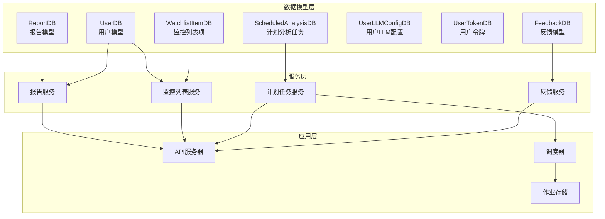
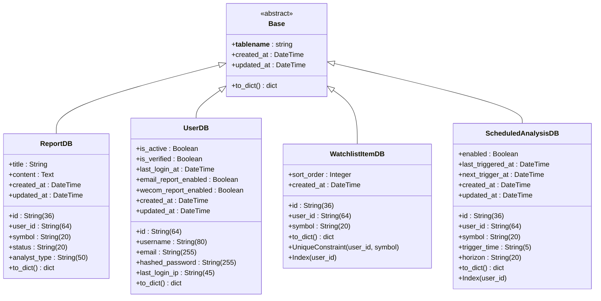
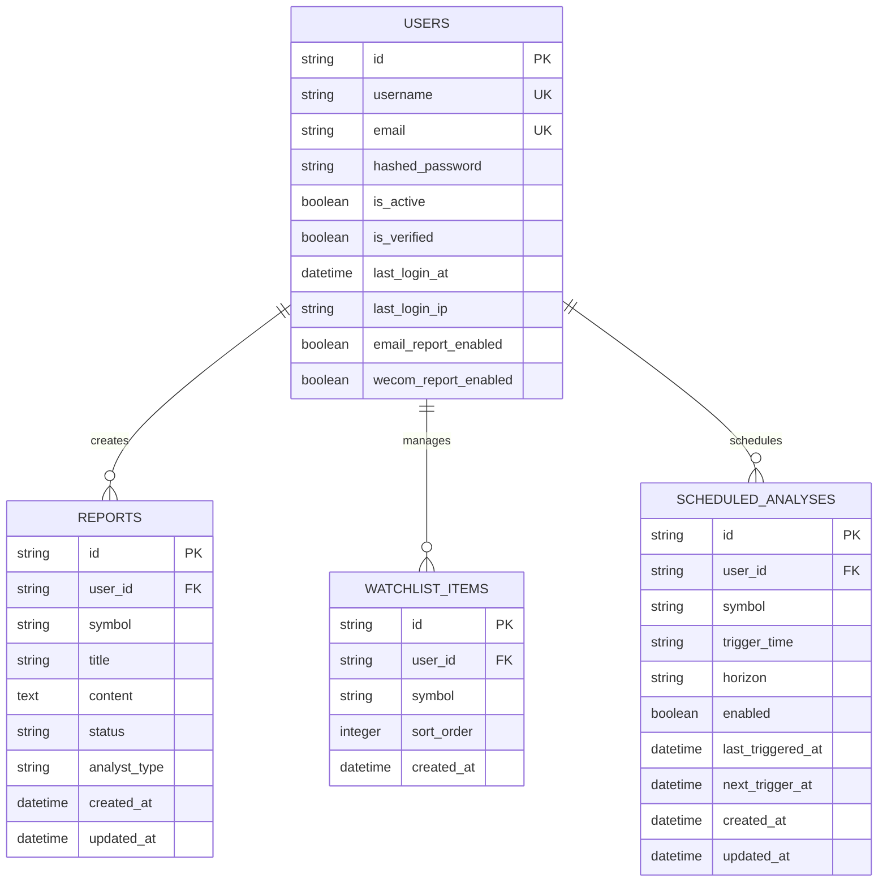
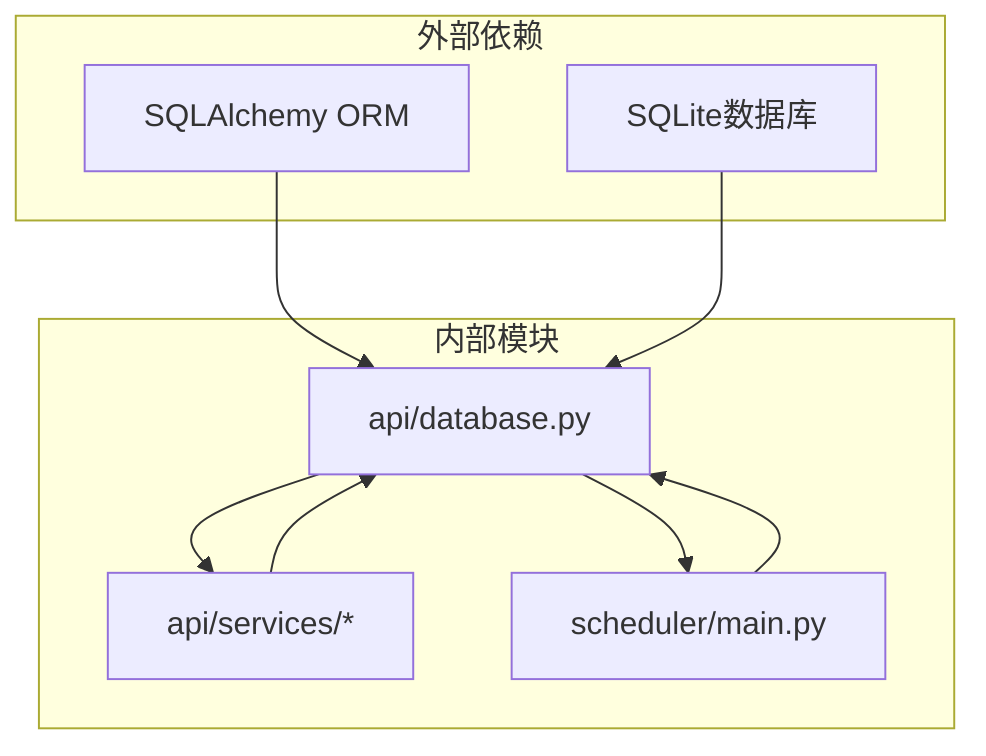

# 核心数据模型

<cite>
**本文档引用的文件**
- [api/database.py](file://api/database.py)
- [api/services/scheduled_service.py](file://api/services/scheduled_service.py)
- [api/services/watchlist_service.py](file://api/services/watchlist_service.py)
- [api/services/report_service.py](file://api/services/report_service.py)
- [api/services/feedback_service.py](file://api/services/feedback_service.py)
- [api/main.py](file://api/main.py)
- [api/job_store.py](file://api/job_store.py)
- [api/job_store_redis.py](file://api/job_store_redis.py)
- [scheduler/main.py](file://scheduler/main.py)
</cite>

## 目录
1. [简介](#简介)
2. [项目结构](#项目结构)
3. [核心组件](#核心组件)
4. [架构概览](#架构概览)
5. [详细组件分析](#详细组件分析)
6. [依赖分析](#依赖分析)
7. [性能考虑](#性能考虑)
8. [故障排除指南](#故障排除指南)
9. [结论](#结论)

## 简介

TradingAgents-AShare是一个基于AI代理的股票交易系统，其核心数据模型设计围绕用户管理、报告生成、监控列表和计划任务等核心业务功能构建。本文档深入分析了ReportDB、UserDB、WatchlistItemDB、ScheduledAnalysisDB等核心业务模型的设计和实现，详细解释每个模型的字段定义、数据类型、约束条件和索引策略。

## 项目结构

系统采用分层架构设计，数据库模型位于API服务层，通过ORM映射到SQLite数据库。核心数据模型之间通过外键关系建立关联，形成完整的企业级数据存储体系。

**图表来源**
- [api/database.py:242-460](file://api/database.py#L242-L460)
- [api/services/scheduled_service.py:1-42](file://api/services/scheduled_service.py#L1-L42)

**章节来源**
- [api/database.py:242-460](file://api/database.py#L242-L460)
- [api/main.py](file://api/main.py)

## 核心组件

系统包含以下核心数据模型：

### ReportDB - 报告模型
负责存储AI生成的股票分析报告，支持多维度的数据结构和复杂的查询需求。

### UserDB - 用户模型  
管理用户账户信息，包括认证凭据、偏好设置和统计信息。

### WatchlistItemDB - 监控列表项模型
实现用户自定义的股票监控功能，支持排序和去重约束。

### ScheduledAnalysisDB - 计划分析任务模型
管理定时分析任务，确保在非交易时间执行数据分析。

**章节来源**
- [api/database.py:242-460](file://api/database.py#L242-L460)

## 架构概览

系统采用三层架构模式，数据访问层通过SQLAlchemy ORM提供统一的数据操作接口。

**图表来源**
- [api/database.py:242-460](file://api/database.py#L242-L460)

## 详细组件分析

### ReportDB 模型分析

ReportDB是系统的核心数据模型，负责存储AI生成的股票分析报告。

#### 字段定义与数据类型
- `id`: String(36) - 主键，UUID格式
- `user_id`: String(64) - 外键，关联UserDB.id
- `symbol`: String(20) - 股票代码
- `title`: String - 报告标题
- `content`: Text - 报告内容
- `status`: String(20) - 报告状态（pending/processing/completed/failed）
- `analyst_type`: String(50) - 分析师类型
- `created_at`: DateTime - 创建时间
- `updated_at`: DateTime - 更新时间

#### 约束条件
- 外键约束：user_id → UserDB.id
- 索引策略：对user_id进行索引优化查询性能

#### 序列化逻辑
模型提供to_dict()方法，将ORM对象转换为字典格式，便于API响应和数据传输。

**章节来源**
- [api/database.py:242-280](file://api/database.py#L242-L280)

### UserDB 模型分析

UserDB管理用户账户信息和认证相关数据。

#### 字段定义与数据类型
- `id`: String(64) - 主键，UUID格式
- `username`: String(80) - 用户名
- `email`: String(255) - 邮箱地址
- `hashed_password`: String(255) - 哈希密码
- `is_active`: Boolean - 账户激活状态
- `is_verified`: Boolean - 邮箱验证状态
- `last_login_at`: DateTime - 最后登录时间
- `last_login_ip`: String(45) - 最后登录IP
- `email_report_enabled`: Boolean - 邮件报告开关
- `wecom_report_enabled`: Boolean - 企业微信报告开关
- `created_at`: DateTime - 创建时间
- `updated_at`: DateTime - 更新时间

#### 约束条件
- 唯一约束：username和email字段的唯一性
- 默认值：email_report_enabled和wecom_report_enabled默认为True

#### 序列化逻辑
to_dict()方法返回用户信息字典，排除敏感字段如hashed_password。

**章节来源**
- [api/database.py:320-360](file://api/database.py#L320-L360)

### WatchlistItemDB 模型分析

WatchlistItemDB实现用户股票监控功能。

#### 字段定义与数据类型
- `id`: String(36) - 主键，UUID格式
- `user_id`: String(64) - 外键，关联UserDB.id
- `symbol`: String(20) - 股票代码
- `sort_order`: Integer - 排序权重，默认0
- `created_at`: DateTime - 创建时间

#### 约束条件
- 复合唯一约束：(user_id, symbol) - 确保同一用户不能重复添加相同股票
- 单独索引：user_id - 优化用户查询性能

#### 序列化逻辑
to_dict()方法返回监控列表项的字典表示，包含必要的元数据。

**章节来源**
- [api/database.py:386-398](file://api/database.py#L386-L398)

### ScheduledAnalysisDB 模型分析

ScheduledAnalysisDB管理定时分析任务。

#### 字段定义与数据类型
- `id`: String(36) - 主键，UUID格式
- `user_id`: String(64) - 外键，关联UserDB.id
- `symbol`: String(20) - 股票代码
- `trigger_time`: String(5) - 触发时间（HH:MM格式）
- `horizon`: String(20) - 分析时间范围（short/medium）
- `enabled`: Boolean - 任务启用状态
- `last_triggered_at`: DateTime - 最后触发时间
- `next_trigger_at`: DateTime - 下次触发时间
- `created_at`: DateTime - 创建时间
- `updated_at`: DateTime - 更新时间

#### 约束条件
- 外键约束：user_id → UserDB.id
- 索引策略：对user_id进行索引
- 业务约束：trigger_time必须在允许的时间窗口内（20:00-23:59或00:00-08:00）

#### 序列化逻辑
to_dict()方法返回计划任务的完整信息，包含计算后的触发时间。

**章节来源**
- [api/database.py:400-418](file://api/database.py#L400-L418)

### 数据模型关系映射

**图表来源**
- [api/database.py:242-418](file://api/database.py#L242-L418)

## 依赖分析

系统中各模型之间的依赖关系清晰明确，遵循数据库设计的最佳实践。

**图表来源**
- [api/database.py:1-50](file://api/database.py#L1-L50)
- [scheduler/main.py](file://scheduler/main.py)

**章节来源**
- [api/database.py:1-50](file://api/database.py#L1-L50)
- [scheduler/main.py](file://scheduler/main.py)

## 性能考虑

系统在设计时充分考虑了性能优化：

### 索引策略
- 对经常查询的字段建立索引，如user_id、symbol等
- 复合唯一约束确保数据完整性的同时维护查询效率

### 查询优化
- 使用适当的过滤条件减少查询结果集
- 合理利用索引提高查询性能

### 内存管理
- ORM对象及时清理，避免内存泄漏
- 批量操作时注意事务边界

## 故障排除指南

### 常见问题及解决方案

#### 数据库连接问题
- 检查数据库文件路径和权限
- 验证SQLite版本兼容性

#### 索引冲突
- 监控unique constraint冲突
- 定期检查重复数据

#### 性能问题
- 分析慢查询日志
- 优化索引策略

**章节来源**
- [api/database.py:123-143](file://api/database.py#L123-L143)

## 结论

TradingAgents-AShare的核心数据模型设计体现了现代Web应用的最佳实践。通过清晰的模型定义、合理的约束条件和优化的索引策略，系统能够高效地处理复杂的业务需求。各模型之间的关系映射清晰，为系统的可扩展性和可维护性奠定了坚实基础。