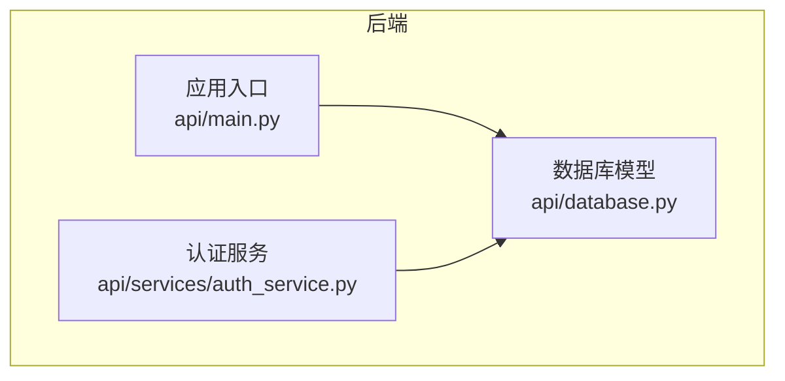
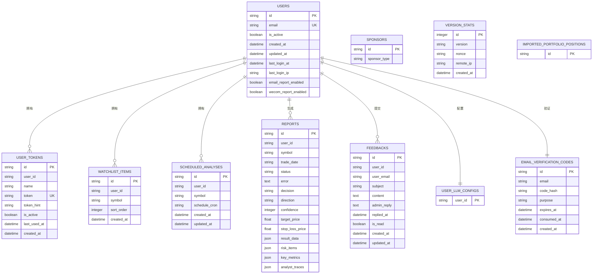
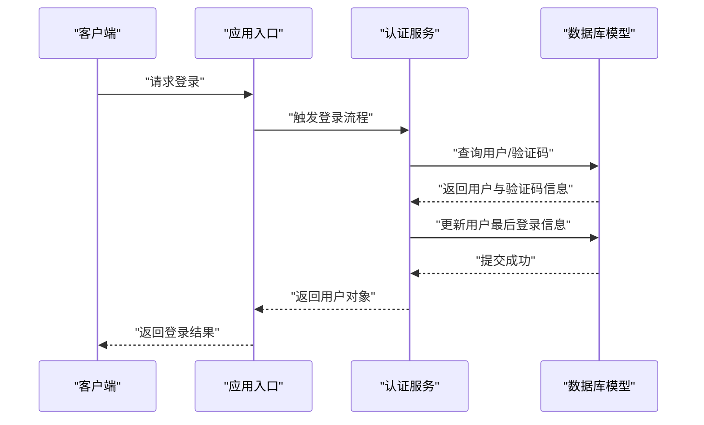

# 模型关系与约束

<cite>
**本文档引用的文件**
- [api/database.py](file://api/database.py)
- [api/main.py](file://api/main.py)
- [api/services/auth_service.py](file://api/services/auth_service.py)
</cite>

## 目录
1. [简介](#简介)
2. [项目结构](#项目结构)
3. [核心组件](#核心组件)
4. [架构总览](#架构总览)
5. [详细组件分析](#详细组件分析)
6. [依赖分析](#依赖分析)
7. [性能考虑](#性能考虑)
8. [故障排查指南](#故障排查指南)
9. [结论](#结论)
10. [附录](#附录)

## 简介
本文件聚焦于 TradingAgents-AShare 的数据模型关系与数据库约束，系统梳理用户、令牌、LLM 配置、关注列表、定时分析、报告、反馈、赞助等核心实体之间的关联关系、唯一性与外键约束，并结合 ER 图与 SQL 约束定义，给出关系查询最佳实践与性能优化建议。同时解释业务逻辑与数据一致性保障机制，覆盖用户与令牌、用户与 LLM 配置、用户与关注列表、用户与定时分析等关键关系。

## 项目结构
后端使用 SQLAlchemy ORM 定义数据库模型，统一在数据库模块中集中管理；FastAPI 主程序导入并初始化数据库，服务层通过会话访问模型进行业务处理。

图表来源
- [api/database.py:55-95](file://api/database.py#L55-L95)
- [api/main.py:42-64](file://api/main.py#L42-L64)
- [api/services/auth_service.py:114-184](file://api/services/auth_service.py#L114-L184)

章节来源
- [api/database.py:55-95](file://api/database.py#L55-L95)
- [api/main.py:42-64](file://api/main.py#L42-L64)

## 核心组件
本节概述所有数据库模型及其关键字段、主键、索引与约束，便于快速建立整体认知。

- 用户表 users
  - 主键：id
  - 唯一约束：email
  - 其他字段：is_active、created_at、updated_at、last_login_at、last_login_ip、email_report_enabled、wecom_report_enabled
- 邮箱验证码表 email_verification_codes
  - 主键：id
  - 索引：email
  - 字段：email、code_hash、purpose、expires_at、consumed_at、created_at
- 用户 LLM 配置表 user_llm_configs
  - 主键：user_id（与 users.id 对应）
  - 字段：llm_provider、backend_url、quick_think_llm、deep_think_llm、max_debate_rounds、max_risk_discuss_rounds、api_key_encrypted、wecom_webhook_encrypted、default_analysts、created_at、updated_at
- 用户令牌表 user_tokens
  - 主键：id
  - 索引：user_id、token
  - 唯一约束：token
  - 字段：user_id、name、token、token_hint、is_active、last_used_at、created_at
- 关注列表 watchlist_items
  - 主键：id
  - 索引：user_id、symbol
  - 唯一约束：user_id + symbol
  - 字段：user_id、symbol、sort_order、created_at
- 定时分析 scheduled_analyses
  - 主键：id
  - 索引：user_id、symbol
  - 唯一约束：user_id + symbol
  - 字段：user_id、symbol、schedule_cron、created_at、updated_at
- 报告 reports
  - 主键：id
  - 索引：user_id、symbol、trade_date、status
  - 字段：user_id、symbol、trade_date、status、error、decision、direction、confidence、target_price、stop_loss_price、result_data、risk_items、key_metrics、analyst_traces
- 反馈 feedbacks
  - 主键：id
  - 索引：user_id
  - 字段：user_id、user_email、subject、content、admin_reply、replied_at、is_read、created_at、updated_at
- 赞助 sponsors
  - 主键：id
  - 索引：sponsor_type
  - 字段：sponsor_type、...（省略非关键字段）
- 版本统计 version_stats
  - 主键：id
  - 字段：version、nonce、remote_ip、created_at
- 导入组合头寸 imported_portfolio_positions
  - 主键：id
  - 字段：...（省略非关键字段）

章节来源
- [api/database.py:242-270](file://api/database.py#L242-L270)
- [api/database.py:321-333](file://api/database.py#L321-L333)
- [api/database.py:335-345](file://api/database.py#L335-L345)
- [api/database.py:347-362](file://api/database.py#L347-L362)
- [api/database.py:364-375](file://api/database.py#L364-L375)
- [api/database.py:387-397](file://api/database.py#L387-L397)
- [api/database.py:400-417](file://api/database.py#L400-L417)
- [api/database.py:439-452](file://api/database.py#L439-L452)
- [api/database.py:419-429](file://api/database.py#L419-L429)
- [api/database.py:377-384](file://api/database.py#L377-L384)
- [api/database.py:455-465](file://api/database.py#L455-L465)

## 架构总览
下图展示核心模型之间的关系与约束，包括一对一、一对多与唯一性约束。

图表来源
- [api/database.py:321-333](file://api/database.py#L321-L333)
- [api/database.py:335-345](file://api/database.py#L335-L345)
- [api/database.py:347-362](file://api/database.py#L347-L362)
- [api/database.py:364-375](file://api/database.py#L364-L375)
- [api/database.py:387-397](file://api/database.py#L387-L397)
- [api/database.py:400-417](file://api/database.py#L400-L417)
- [api/database.py:242-270](file://api/database.py#L242-L270)
- [api/database.py:439-452](file://api/database.py#L439-L452)
- [api/database.py:419-429](file://api/database.py#L419-L429)
- [api/database.py:377-384](file://api/database.py#L377-L384)
- [api/database.py:455-465](file://api/database.py#L455-L465)

## 详细组件分析

### 用户与令牌（一对一/一对多）
- 关系类型：一对多（一个用户可拥有多个令牌）
- 实现方式：
  - 用户表 users 的主键 id 作为外键被 user_tokens.user_id 引用
  - user_tokens.token 建有唯一索引，确保令牌全局唯一
- 约束与完整性：
  - user_tokens.user_id 非空且带索引，支持按用户检索
  - user_tokens.token 唯一，防止重复
  - user_tokens.is_active 支持逻辑删除或禁用
- 查询最佳实践：
  - 按用户查询：先按 user_id 过滤，再按 is_active 过滤
  - 按令牌查询：直接按 token 唯一索引查找
- 性能优化建议：
  - 在 user_tokens 上为 user_id、token 建立复合索引以提升常用查询
  - 使用分页与只读事务减少锁竞争

章节来源
- [api/database.py:321-333](file://api/database.py#L321-L333)
- [api/database.py:364-375](file://api/database.py#L364-L375)

### 用户与 LLM 配置（一对一）
- 关系类型：一对一（每个用户仅有一份 LLM 配置）
- 实现方式：
  - user_llm_configs 的主键为 user_id，直接与 users.id 对应
- 约束与完整性：
  - 通过主键约束保证一对一
  - 支持默认分析器列表、最大辩论轮次等可选配置
- 查询最佳实践：
  - 直接按用户 ID 获取配置，避免 JOIN
- 性能优化建议：
  - 将高频读取的配置缓存到进程内存或 Redis

章节来源
- [api/database.py:347-362](file://api/database.py#L347-L362)
- [api/database.py:321-333](file://api/database.py#L321-L333)

### 用户与关注列表（一对多）
- 关系类型：一对多（一个用户可拥有多个关注股票）
- 实现方式：
  - users.id → watchlist_items.user_id
  - watchlist_items 对 (user_id, symbol) 建有唯一约束，避免重复关注同一标的
- 约束与完整性：
  - 唯一约束保证关注列表去重
  - sort_order 支持排序
- 查询最佳实践：
  - 按用户过滤后按 sort_order 排序返回
  - 批量查询时使用 IN 子句
- 性能优化建议：
  - 为 watchlist_items 建立 (user_id, symbol) 的复合唯一索引（已存在）
  - 分页加载，避免一次性返回过多记录

章节来源
- [api/database.py:387-397](file://api/database.py#L387-L397)
- [api/database.py:321-333](file://api/database.py#L321-L333)

### 用户与定时分析（一对多）
- 关系类型：一对多（一个用户可设置多个定时分析任务）
- 实现方式：
  - users.id → scheduled_analyses.user_id
  - scheduled_analyses 对 (user_id, symbol) 建有唯一约束，避免重复定时任务
- 约束与完整性：
  - 唯一约束保证任务去重
  - schedule_cron 字段存储调度表达式
- 查询最佳实践：
  - 按用户过滤后按 symbol 或 cron 排序
- 性能优化建议：
  - 为 (user_id, symbol) 建立复合唯一索引（已存在）
  - 使用独立的任务调度器异步执行，避免阻塞主流程

章节来源
- [api/database.py:400-417](file://api/database.py#L400-L417)
- [api/database.py:321-333](file://api/database.py#L321-L333)

### 用户与报告（一对多）
- 关系类型：一对多（一个用户可生成多个报告）
- 实现方式：
  - users.id → reports.user_id
  - reports 对 (symbol, trade_date) 建有索引，便于按标的与日期检索
- 约束与完整性：
  - 报告状态、错误信息、决策方向、目标价/止损价等字段用于记录分析结果与过程
  - JSON 字段存储结构化提取结果
- 查询最佳实践：
  - 按用户与标的过滤，再按日期范围筛选
  - 使用状态字段过滤已完成/失败等结果
- 性能优化建议：
  - 为 reports 建立 (user_id, symbol, trade_date, status) 的复合索引
  - 对大字段（JSON）采用延迟加载或分表策略

章节来源
- [api/database.py:242-270](file://api/database.py#L242-L270)
- [api/database.py:321-333](file://api/database.py#L321-L333)

### 用户与反馈（一对多）
- 关系类型：一对多（一个用户可提交多条反馈）
- 实现方式：
  - users.id → feedbacks.user_id
- 约束与完整性：
  - 记录用户邮箱、主题、内容、管理员回复与已读状态
- 查询最佳实践：
  - 按用户过滤，再按已读状态与时间排序
- 性能优化建议：
  - 为 feedbacks.user_id 建立索引（已存在）
  - 对长文本字段采用分页或懒加载

章节来源
- [api/database.py:439-452](file://api/database.py#L439-L452)
- [api/database.py:321-333](file://api/database.py#L321-L333)

### 认证与登录流程（用户与邮箱验证码）
- 关系类型：一对一（单个邮箱在有效期内仅保留一条未消费验证码）
- 实现方式：
  - email_verification_codes.email 建有索引
  - 验证码过期与消费状态由 expires_at 与 consumed_at 控制
- 查询最佳实践：
  - 先按邮箱与目的筛选，再按创建时间倒序取最新一条，检查是否过期与未消费
- 性能优化建议：
  - 为 email_verification_codes.email 建立索引（已存在）
  - 定期清理过期未消费记录

章节来源
- [api/database.py:335-345](file://api/database.py#L335-L345)
- [api/services/auth_service.py:114-184](file://api/services/auth_service.py#L114-L184)

## 依赖分析
- 初始化与会话
  - 应用启动时调用初始化函数创建表结构
  - 通过会话工厂获取数据库会话，确保事务边界与连接池复用
- 服务层依赖
  - 认证服务依赖用户与验证码模型完成登录与校验
  - 各业务服务通过会话访问用户、令牌、关注列表、定时分析、报告等模型

图表来源
- [api/main.py:42-64](file://api/main.py#L42-L64)
- [api/services/auth_service.py:114-184](file://api/services/auth_service.py#L114-L184)
- [api/database.py:321-333](file://api/database.py#L321-L333)
- [api/database.py:335-345](file://api/database.py#L335-L345)

章节来源
- [api/main.py:42-64](file://api/main.py#L42-L64)
- [api/services/auth_service.py:114-184](file://api/services/auth_service.py#L114-L184)

## 性能考虑
- 索引策略
  - 为高频过滤字段建立单列或复合索引：users.email、user_tokens.user_id、user_tokens.token、watchlist_items.user_id+symbol、scheduled_analyses.user_id+symbol、reports.user_id+symbol+trade_date+status、feedbacks.user_id
- 连接池与并发
  - SQLite 默认连接池参数适合轻量场景；生产环境建议使用 PostgreSQL/MySQL 并增大连接池
- 写入优化
  - 使用批量插入与事务合并写入，降低锁竞争
- 读取优化
  - 对大字段（JSON）采用延迟加载或拆表存储
  - 分页查询与只读事务减少锁持有时间
- 缓存
  - 将热点配置（如 LLM 配置）放入进程缓存或外部缓存系统

## 故障排查指南
- 常见问题
  - 令牌重复：检查 user_tokens.token 唯一约束是否被违反
  - 关注列表重复：检查 watchlist_items 的 (user_id, symbol) 唯一约束
  - 定时任务重复：检查 scheduled_analyses 的 (user_id, symbol) 唯一约束
  - 登录验证码失效：检查 email_verification_codes 的过期与消费状态
- 排查步骤
  - 确认唯一约束冲突的具体字段与值
  - 查看相关索引是否存在
  - 检查会话事务是否正确提交或回滚
- 相关实现参考
  - 初始化与迁移：[api/database.py:91-143](file://api/database.py#L91-L143)
  - 登录验证码处理：[api/services/auth_service.py:122-184](file://api/services/auth_service.py#L122-L184)

章节来源
- [api/database.py:91-143](file://api/database.py#L91-L143)
- [api/services/auth_service.py:122-184](file://api/services/auth_service.py#L122-L184)

## 结论
本项目通过清晰的模型划分与严格的唯一性约束，实现了用户、令牌、LLM 配置、关注列表、定时分析、报告、反馈等核心实体之间的稳定关系。借助索引与连接池优化，可在保证数据一致性的前提下获得良好性能。建议在生产环境中进一步完善任务调度、缓存与监控体系，持续优化查询路径与写入吞吐。

## 附录

### SQL 约束定义摘要
- 用户表 users
  - 主键：id
  - 唯一：email
- 用户令牌表 user_tokens
  - 主键：id
  - 唯一：token
  - 索引：user_id
- 关注列表 watchlist_items
  - 主键：id
  - 唯一：user_id + symbol
- 定时分析 scheduled_analyses
  - 主键：id
  - 唯一：user_id + symbol
- 报告 reports
  - 主键：id
  - 索引：user_id、symbol、trade_date、status
- 反馈 feedbacks
  - 主键：id
  - 索引：user_id
- 邮箱验证码 email_verification_codes
  - 主键：id
  - 索引：email

章节来源
- [api/database.py:321-333](file://api/database.py#L321-L333)
- [api/database.py:364-375](file://api/database.py#L364-L375)
- [api/database.py:387-397](file://api/database.py#L387-L397)
- [api/database.py:400-417](file://api/database.py#L400-L417)
- [api/database.py:242-270](file://api/database.py#L242-L270)
- [api/database.py:439-452](file://api/database.py#L439-L452)
- [api/database.py:335-345](file://api/database.py#L335-L345)