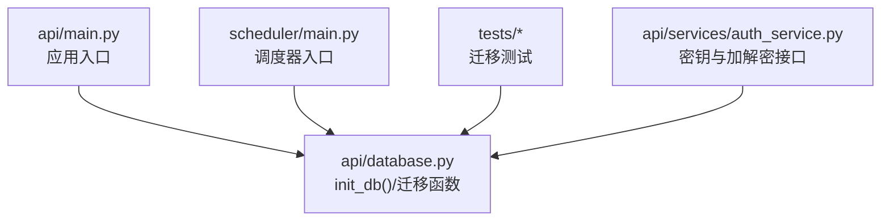
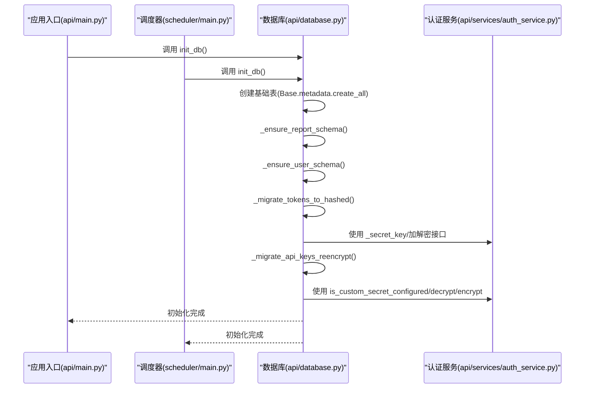
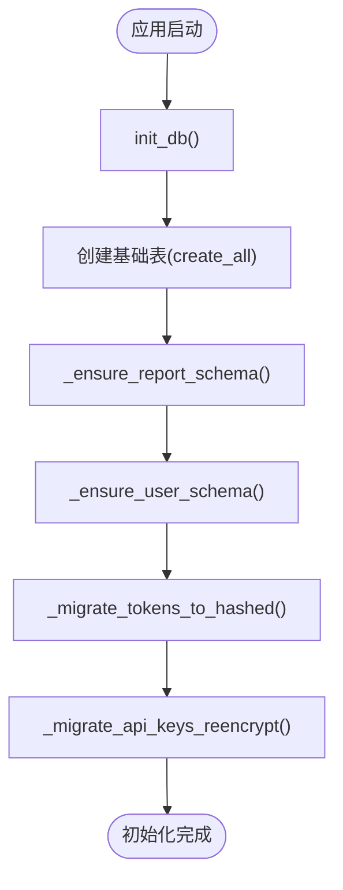
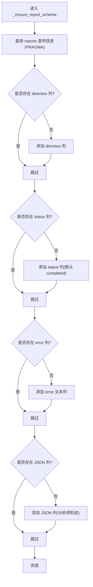
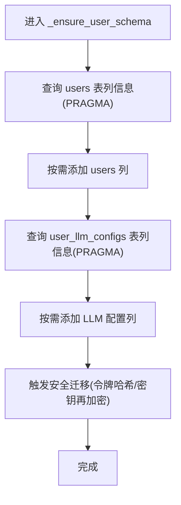
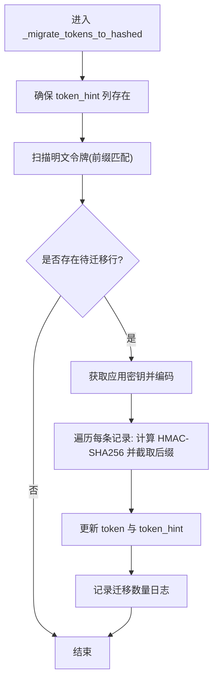
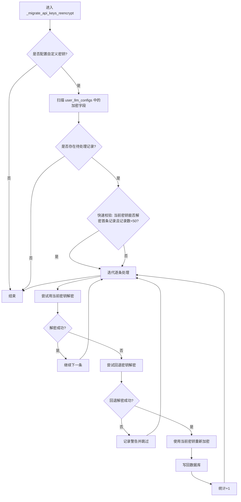
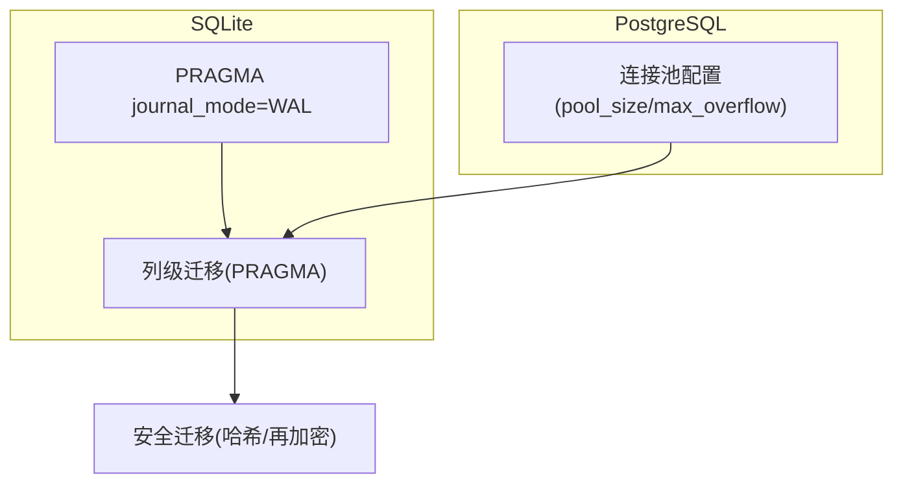
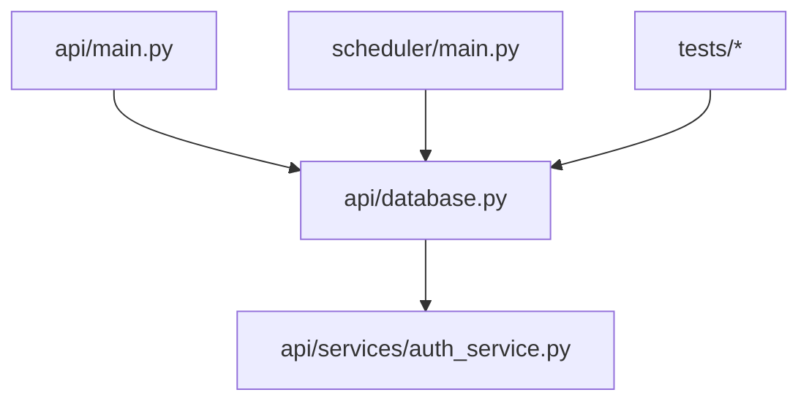

# 模式迁移与演进

<cite>
**本文引用的文件**
- [api/database.py](file://api/database.py)
- [api/main.py](file://api/main.py)
- [scheduler/main.py](file://scheduler/main.py)
- [tests/test_api_smoke.py](file://tests/test_api_smoke.py)
- [tests/test_board_gold_api.py](file://tests/test_board_gold_api.py)
- [tests/test_dashboard_tracking.py](file://tests/test_dashboard_tracking.py)
- [tests/test_portfolio_import.py](file://tests/test_portfolio_import.py)
- [api/services/auth_service.py](file://api/services/auth_service.py)
</cite>

## 目录
1. [引言](#引言)
2. [项目结构](#项目结构)
3. [核心组件](#核心组件)
4. [架构总览](#架构总览)
5. [详细组件分析](#详细组件分析)
6. [依赖关系分析](#依赖关系分析)
7. [性能考量](#性能考量)
8. [故障排查指南](#故障排查指南)
9. [结论](#结论)
10. [附录](#附录)

## 引言
本文围绕 TradingAgents-AShare 的数据库模式迁移与演进展开，重点覆盖以下内容：
- 初始化流程与启动时迁移：init_db 函数如何在应用启动时完成表结构创建与增量迁移。
- 增量迁移机制：_ensure_report_schema 与 _ensure_user_schema 如何对现有部署进行无风险的列级扩展。
- 向后兼容性与版本演进：如何在不中断服务的前提下平滑引入新字段与数据格式。
- 安全迁移：_migrate_tokens_to_hashed 与 _migrate_api_keys_reencrypt 的密文轮换与再加密策略。
- 执行顺序、回滚与故障恢复：迁移脚本的调用链、失败处理与恢复建议。
- 生产环境最佳实践：SQLite 与 PostgreSQL 的不同策略、WAL 模式、并发控制与密钥轮换。
- 数据完整性与迁移状态跟踪：如何确保迁移过程中的数据一致性与可观测性。

## 项目结构
数据库相关的核心代码集中在 api/database.py，应用入口与调度器在 api/main.py 与 scheduler/main.py 中调用 init_db 完成初始化；测试用例验证了迁移在多种场景下的可用性。

图表来源
- [api/main.py:250](file://api/main.py#L250)
- [scheduler/main.py:69](file://scheduler/main.py#L69)
- [scheduler/main.py:404](file://scheduler/main.py#L404)
- [api/database.py:90](file://api/database.py#L90)

章节来源
- [api/database.py:90-143](file://api/database.py#L90-L143)
- [api/main.py:250](file://api/main.py#L250)
- [scheduler/main.py:69](file://scheduler/main.py#L69)
- [scheduler/main.py:404](file://scheduler/main.py#L404)
- [tests/test_api_smoke.py:69](file://tests/test_api_smoke.py#L69)
- [tests/test_board_gold_api.py:13](file://tests/test_board_gold_api.py#L13)
- [tests/test_dashboard_tracking.py:5](file://tests/test_dashboard_tracking.py#L5)
- [tests/test_portfolio_import.py:25](file://tests/test_portfolio_import.py#L25)

## 核心组件
- 初始化与迁移入口：init_db 在应用启动时负责创建基础表并触发增量迁移。
- 报告模式增量迁移：_ensure_report_schema 对 reports 表进行列级扩展，支持多类报告字段与状态字段。
- 用户模式增量迁移：_ensure_user_schema 对 users 与 user_llm_configs 表进行列级扩展，新增通知开关与加密字段。
- 安全迁移（令牌哈希）：_migrate_tokens_to_hashed 将明文令牌转换为 HMAC-SHA256 哈希存储，并保留可读提示后缀。
- 安全迁移（密钥再加密）：_migrate_api_keys_reencrypt 在自定义密钥变更时对用户敏感信息进行再加密。
- 连接与并发：根据 DATABASE_URL 自动选择 SQLite 或 PostgreSQL 配置，SQLite 启用 WAL 模式以提升并发读写能力。

章节来源
- [api/database.py:90-143](file://api/database.py#L90-L143)
- [api/database.py:98-143](file://api/database.py#L98-L143)
- [api/database.py:146-239](file://api/database.py#L146-L239)

## 架构总览
下图展示了应用启动时的数据库初始化与迁移调用链，以及与认证服务的交互关系。

图表来源
- [api/main.py:250](file://api/main.py#L250)
- [scheduler/main.py:69](file://scheduler/main.py#L69)
- [scheduler/main.py:404](file://scheduler/main.py#L404)
- [api/database.py:90](file://api/database.py#L90)
- [api/database.py:146](file://api/database.py#L146)
- [api/database.py:174](file://api/database.py#L174)
- [api/services/auth_service.py:77](file://api/services/auth_service.py#L77)

## 详细组件分析

### 初始化流程与执行顺序
- init_db 负责：
  - 创建所有声明模型对应的表。
  - 调用 _ensure_report_schema 与 _ensure_user_schema 完成增量迁移。
  - 立即执行安全迁移：令牌哈希迁移与 API 密钥再加密。
- 执行顺序严格按上述步骤进行，确保在任何查询之前完成模式与数据的安全加固。

图表来源
- [api/database.py:90](file://api/database.py#L90)
- [api/database.py:98](file://api/database.py#L98)
- [api/database.py:123](file://api/database.py#L123)
- [api/database.py:146](file://api/database.py#L146)
- [api/database.py:174](file://api/database.py#L174)

章节来源
- [api/database.py:90-143](file://api/database.py#L90-L143)

### 报告模式增量迁移（_ensure_report_schema）
- 目标：为 reports 表添加方向、状态、错误描述与多类报告文本字段，同时引入 JSON 字段以承载结构化追踪信息。
- 实现要点：
  - 使用 PRAGMA table_info 查询当前列集合，避免重复添加。
  - 逐列判断并执行 ALTER TABLE 添加，保持幂等性。
  - 新增 JSON 字段用于存储结构化分析轨迹，便于后续检索与可视化。
- 兼容性：
  - 仅追加列，不修改既有列，保证历史数据可读。
  - 默认值与类型设计兼顾历史存量与未来扩展。

图表来源
- [api/database.py:98](file://api/database.py#L98)
- [api/database.py:100-118](file://api/database.py#L100-L118)

章节来源
- [api/database.py:98-120](file://api/database.py#L98-L120)

### 用户模式增量迁移（_ensure_user_schema）
- 目标：为 users 与 user_llm_configs 表增加登录 IP 记录、邮件/企业微信报告开关、Webhook 加密字段与默认分析师配置。
- 实现要点：
  - users 表新增 last_login_ip、email_report_enabled、wecom_report_enabled。
  - user_llm_configs 表新增 wecom_webhook_encrypted 与 default_analysts。
  - 采用列存在性检测与条件添加，保证幂等。
- 安全前置：在完成列扩展后立即触发令牌哈希迁移与密钥再加密，确保新增字段承载的数据安全。

图表来源
- [api/database.py:123](file://api/database.py#L123)
- [api/database.py:125-138](file://api/database.py#L125-L138)
- [api/database.py:142](file://api/database.py#L142)

章节来源
- [api/database.py:123-143](file://api/database.py#L123-L143)

### 安全迁移：令牌哈希迁移（_migrate_tokens_to_hashed）
- 目标：将明文 API 令牌迁移到 HMAC-SHA256 哈希存储，保留最后四位作为可读提示，降低运维成本。
- 实现要点：
  - 首先确保 token_hint 列存在，用于存储明文后缀。
  - 通过前缀匹配识别未迁移行（明文令牌以特定前缀开头）。
  - 使用应用密钥对明文进行 HMAC-SHA256 哈希，更新 token 与 token_hint。
  - 记录迁移数量，便于审计与监控。
- 安全收益：即使数据库泄露，攻击者也无法直接使用明文令牌。

图表来源
- [api/database.py:146](file://api/database.py#L146)
- [api/database.py:150-169](file://api/database.py#L150-L169)

章节来源
- [api/database.py:146-171](file://api/database.py#L146-L171)

### 安全迁移：API 密钥再加密（_migrate_api_keys_reencrypt）
- 目标：当 TA_APP_SECRET_KEY 发生变化时，对用户敏感信息进行再加密，确保数据在密钥轮换后仍可解密与访问。
- 实现要点：
  - 若未配置自定义密钥则直接返回。
  - 扫描 user_llm_configs 中存在加密字段的记录。
  - 快速校验：若首条记录能用当前密钥解密且记录数较少，则跳过进一步校验以提升性能。
  - 对无法用当前密钥解密的记录尝试回退密钥解密，成功后使用当前密钥重新加密并写回。
  - 统计并记录再加密数量，便于审计。
- 容错与回退：当无法用任何已知密钥解密时，记录警告并跳过该记录，避免破坏整体迁移进度。

图表来源
- [api/database.py:174](file://api/database.py#L174)
- [api/database.py:187-239](file://api/database.py#L187-L239)

章节来源
- [api/database.py:174-239](file://api/database.py#L174-L239)

### SQLite 与 PostgreSQL 的不同迁移策略
- SQLite 策略：
  - 使用连接事件设置 PRAGMA journal_mode=WAL，提升并发读写能力。
  - 通过 PRAGMA table_info 检查列存在性，避免重复迁移。
  - 事务边界使用 engine.begin()，确保单次迁移原子性。
- PostgreSQL 策略：
  - 使用较大的连接池参数（pool_size、max_overflow、pool_recycle），以应对高并发场景。
  - 保持与 SQLite 相同的列级迁移逻辑，但无需 WAL 设置。
- 执行顺序：
  - 无论数据库类型如何，均先创建表，再执行增量迁移，最后进行安全迁移。

图表来源
- [api/database.py:14-50](file://api/database.py#L14-L50)
- [api/database.py:98-143](file://api/database.py#L98-L143)
- [api/database.py:174-239](file://api/database.py#L174-L239)

章节来源
- [api/database.py:14-50](file://api/database.py#L14-L50)
- [api/database.py:98-143](file://api/database.py#L98-L143)
- [api/database.py:174-239](file://api/database.py#L174-L239)

### 数据完整性与迁移状态跟踪
- 幂等性：所有列级迁移均基于 PRAGMA 检查列是否存在，避免重复添加。
- 原子性：使用 engine.begin() 包裹迁移逻辑，失败自动回滚。
- 可观测性：迁移过程中记录错误日志与成功统计，便于问题定位与审计。
- 测试覆盖：多个测试文件在启动阶段调用 init_db，验证迁移在真实场景下的可用性。

章节来源
- [api/database.py:98-143](file://api/database.py#L98-L143)
- [api/database.py:146-239](file://api/database.py#L146-L239)
- [tests/test_api_smoke.py:69](file://tests/test_api_smoke.py#L69)
- [tests/test_board_gold_api.py:13](file://tests/test_board_gold_api.py#L13)
- [tests/test_dashboard_tracking.py:5](file://tests/test_dashboard_tracking.py#L5)
- [tests/test_portfolio_import.py:25](file://tests/test_portfolio_import.py#L25)

## 依赖关系分析
- 应用入口与调度器在启动时调用 init_db，确保数据库初始化与迁移在业务逻辑之前完成。
- 安全迁移依赖认证服务提供的密钥管理与加解密接口。
- 测试用例覆盖多种启动路径，验证迁移的稳定性与兼容性。

图表来源
- [api/main.py:250](file://api/main.py#L250)
- [scheduler/main.py:69](file://scheduler/main.py#L69)
- [scheduler/main.py:404](file://scheduler/main.py#L404)
- [api/database.py:90](file://api/database.py#L90)
- [api/services/auth_service.py:77](file://api/services/auth_service.py#L77)

章节来源
- [api/main.py:250](file://api/main.py#L250)
- [scheduler/main.py:69](file://scheduler/main.py#L69)
- [scheduler/main.py:404](file://scheduler/main.py#L404)
- [api/database.py:90](file://api/database.py#L90)
- [api/services/auth_service.py:77](file://api/services/auth_service.py#L77)

## 性能考量
- SQLite 并发：启用 WAL 模式显著提升并发读写性能，适合中小规模部署与开发环境。
- PostgreSQL 并发：通过连接池参数优化吞吐量，适合生产高并发场景。
- 迁移批处理：对于大规模数据（如密钥再加密），采用“快速校验 + 分批处理”策略，在保证正确性的前提下减少启动时间。
- 日志与监控：迁移过程中的错误与统计日志可用于性能与容量规划。

## 故障排查指南
- 迁移失败：
  - 检查数据库权限与 WAL 文件目录可写性（SQLite）。
  - 查看迁移日志中的错误堆栈，确认具体失败步骤。
  - 对于密钥再加密失败，确认是否能用回退密钥解密，必要时回滚密钥或恢复备份。
- 回滚策略：
  - SQLite：由于是列级追加与哈希替换，回滚较为困难；建议保留备份并在迁移前导出快照。
  - PostgreSQL：可通过备份恢复到迁移前的状态，或使用数据库层面的回滚工具。
- 故障恢复：
  - 重启应用以再次触发 init_db，系统会自动重试幂等迁移步骤。
  - 对于密钥再加密，若部分记录失败，可在修复密钥后重新启动应用以继续处理。

章节来源
- [api/database.py:98-143](file://api/database.py#L98-L143)
- [api/database.py:146-239](file://api/database.py#L146-L239)

## 结论
本项目的数据库迁移采用“启动时一次性迁移 + 幂等列级扩展 + 安全前置”的策略，既保证了向后兼容与生产可用性，又在密钥轮换与数据安全方面提供了稳健的保障。通过 WAL 模式与连接池配置，系统在 SQLite 与 PostgreSQL 上均具备良好的并发与性能表现。建议在生产环境中遵循“迁移前备份、分步验证、监控日志”的最佳实践，确保迁移过程可控、可恢复。

## 附录
- 执行顺序清单
  - 创建基础表
  - 报告模式增量迁移
  - 用户模式增量迁移
  - 令牌哈希迁移
  - API 密钥再加密
- 生产环境建议
  - 迁移窗口：选择低峰时段执行，预留回滚时间。
  - 备份策略：迁移前导出数据库快照，关键表单独备份。
  - 监控指标：关注迁移日志、数据库连接池使用率与 WAL 文件状态。
  - 密钥轮换：提前演练密钥切换流程，确保再加密迁移顺利。