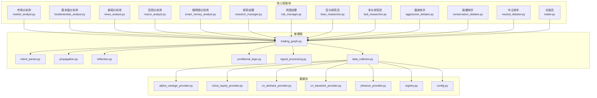
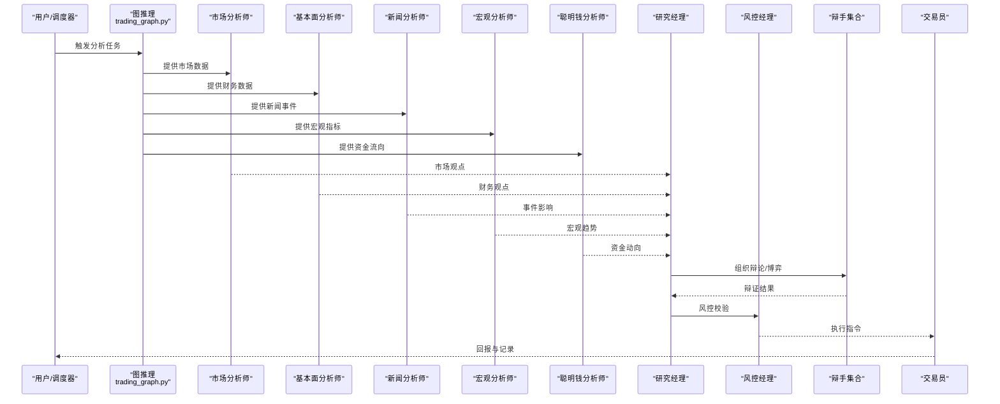
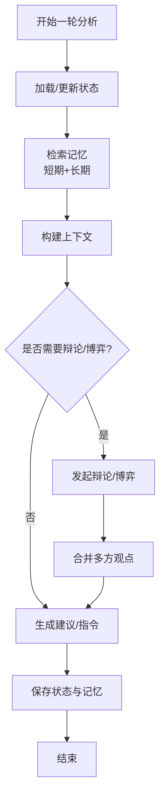
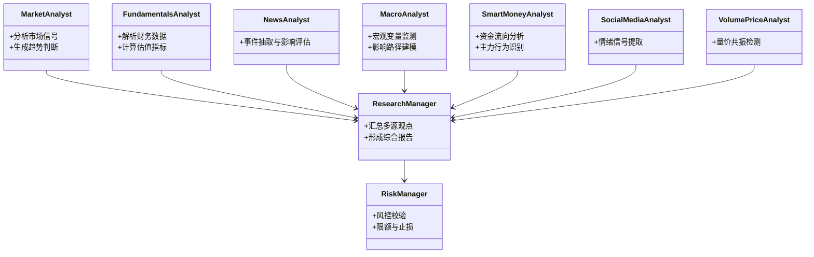
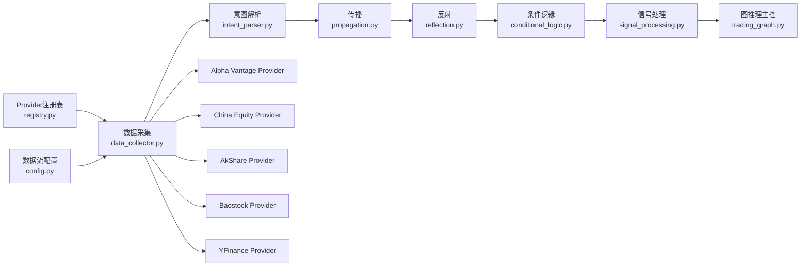
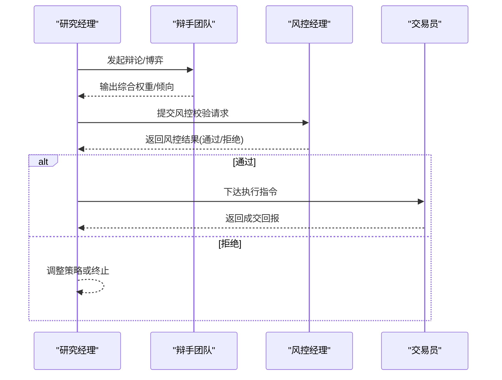
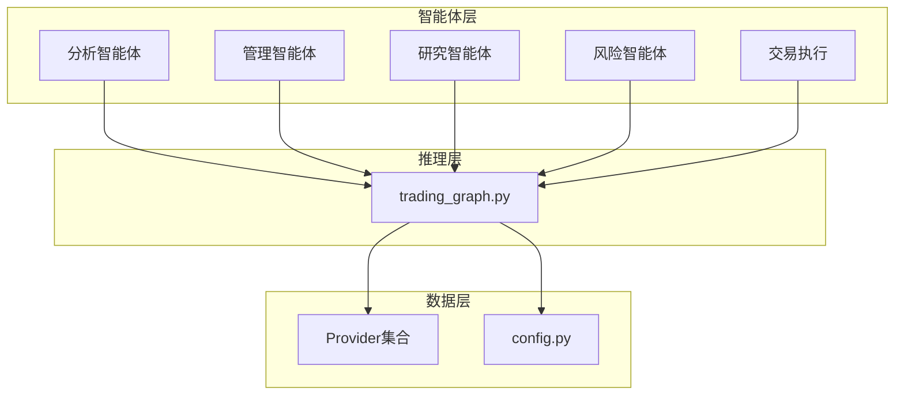

# 智能体系统

<cite>
**本文引用的文件**
- [AGENTS.md](file://AGENTS.md)
- [default_config.py](file://tradingagents/default_config.py)
- [market_analyst.py](file://tradingagents/agents/analysts/market_analyst.py)
- [fundamentals_analyst.py](file://tradingagents/agents/analysts/fundamentals_analyst.py)
- [news_analyst.py](file://tradingagents/agents/analysts/news_analyst.py)
- [macro_analyst.py](file://tradingagents/agents/analysts/macro_analyst.py)
- [smart_money_analyst.py](file://tradingagents/agents/analysts/smart_money_analyst.py)
- [social_media_analyst.py](file://tradingagents/agents/analysts/social_media_analyst.py)
- [volume_price_analyst.py](file://tradingagents/agents/analysts/volume_price_analyst.py)
- [research_manager.py](file://tradingagents/agents/managers/research_manager.py)
- [risk_manager.py](file://tradingagents/agents/managers/risk_manager.py)
- [bear_researcher.py](file://tradingagents/agents/researchers/bear_researcher.py)
- [bull_researcher.py](file://tradingagents/agents/researchers/bull_researcher.py)
- [aggressive_debator.py](file://tradingagents/agents/risk_mgmt/aggressive_debator.py)
- [conservative_debator.py](file://tradingagents/agents/risk_mgmt/conservative_debator.py)
- [neutral_debator.py](file://tradingagents/agents/risk_mgmt/neutral_debator.py)
- [trader.py](file://tradingagents/agents/trader/trader.py)
- [agent_states.py](file://tradingagents/agents/utils/agent_states.py)
- [memory.py](file://tradingagents/agents/utils/memory.py)
- [context_utils.py](file://tradingagents/agents/utils/context_utils.py)
- [debate_utils.py](file://tradingagents/agents/utils/debate_utils.py)
- [game_theory_tools.py](file://tradingagents/agents/utils/game_theory_tools.py)
- [trading_graph.py](file://tradingagents/graph/trading_graph.py)
- [intent_parser.py](file://tradingagents/graph/intent_parser.py)
- [propagation.py](file://tradingagents/graph/propagation.py)
- [reflection.py](file://tradingagents/graph/reflection.py)
- [signal_processing.py](file://tradingagents/graph/signal_processing.py)
- [conditional_logic.py](file://tradingagents/graph/conditional_logic.py)
- [data_collector.py](file://tradingagents/graph/data_collector.py)
- [alpha_vantage_provider.py](file://tradingagents/dataflows/providers/alpha_vantage_provider.py)
- [china_equity_provider.py](file://tradingagents/dataflows/providers/china_equity_provider.py)
- [cn_akshare_provider.py](file://tradingagents/dataflows/providers/cn_akshare_provider.py)
- [cn_baostock_provider.py](file://tradingagents/dataflows/providers/cn_baostock_provider.py)
- [yfinance_provider.py](file://tradingagents/dataflows/providers/yfinance_provider.py)
- [registry.py](file://tradingagents/dataflows/providers/registry.py)
- [config.py](file://tradingagents/dataflows/config.py)
- [main.py](file://api/main.py)
- [logging_config.yaml](file://api/logging_config.yaml)
- [main.py](file://scheduler/main.py)
- [test_market_analyst.py](file://tests/test_market_analyst.py)
- [test_smart_money_analyst.py](file://tests/test_smart_money_analyst.py)
- [test_agent_states.py](file://tests/test_agent_states.py)
</cite>

## 目录
1. [简介](#简介)
2. [项目结构](#项目结构)
3. [核心组件](#核心组件)
4. [架构总览](#架构总览)
5. [详细组件分析](#详细组件分析)
6. [依赖关系分析](#依赖关系分析)
7. [性能考虑](#性能考虑)
8. [故障排查指南](#故障排查指南)
9. [结论](#结论)
10. [附录](#附录)

## 简介
本技术文档面向TradingAgents-AShare的多智能体系统，聚焦于专业智能体（市场分析师、基本面分析师、新闻分析师、宏观分析师、聪明钱分析师等）的架构设计、角色分工与协作机制。文档从智能体状态管理、记忆机制与决策过程入手，阐述智能体间对话协议、辩论机制与最终决策制定流程，并覆盖配置选项、参数调优与性能监控方法，最后提供扩展指南与自定义智能体开发教程，帮助读者快速理解并高效迭代该系统。

## 项目结构
项目采用分层与功能域结合的组织方式：
- tradingagents：核心智能体与数据流引擎
  - agents：智能体家族（analysts、managers、researchers、risk_mgmt、trader）
  - agents/utils：通用工具（状态、记忆、上下文、辩论、博弈论等）
  - graph：图计算与推理管线（意图解析、传播、反射、条件逻辑、信号处理、数据采集）
  - dataflows：数据提供者与配置（Alpha Vantage、AkShare、Baostock、YFinance等）
  - llm_clients：大模型客户端工厂与校验
  - prompts：提示词目录
  - default_config.py：默认配置入口
- api：后端服务入口与作业存储
- scheduler：调度器
- tests：单元测试与集成测试
- frontend：前端可视化与交互界面
- 其他：Dockerfile、requirements、工作流与CI配置

图表来源
- [market_analyst.py](file://tradingagents/agents/analysts/market_analyst.py)
- [fundamentals_analyst.py](file://tradingagents/agents/analysts/fundamentals_analyst.py)
- [news_analyst.py](file://tradingagents/agents/analysts/news_analyst.py)
- [macro_analyst.py](file://tradingagents/agents/analysts/macro_analyst.py)
- [smart_money_analyst.py](file://tradingagents/agents/analysts/smart_money_analyst.py)
- [research_manager.py](file://tradingagents/agents/managers/research_manager.py)
- [risk_manager.py](file://tradingagents/agents/managers/risk_manager.py)
- [bear_researcher.py](file://tradingagents/agents/researchers/bear_researcher.py)
- [bull_researcher.py](file://tradingagents/agents/researchers/bull_researcher.py)
- [aggressive_debator.py](file://tradingagents/agents/risk_mgmt/aggressive_debator.py)
- [conservative_debator.py](file://tradingagents/agents/risk_mgmt/conservative_debator.py)
- [neutral_debator.py](file://tradingagents/agents/risk_mgmt/neutral_debator.py)
- [trader.py](file://tradingagents/agents/trader/trader.py)
- [trading_graph.py](file://tradingagents/graph/trading_graph.py)
- [intent_parser.py](file://tradingagents/graph/intent_parser.py)
- [propagation.py](file://tradingagents/graph/propagation.py)
- [reflection.py](file://tradingagents/graph/reflection.py)
- [conditional_logic.py](file://tradingagents/graph/conditional_logic.py)
- [signal_processing.py](file://tradingagents/graph/signal_processing.py)
- [data_collector.py](file://tradingagents/graph/data_collector.py)
- [alpha_vantage_provider.py](file://tradingagents/dataflows/providers/alpha_vantage_provider.py)
- [china_equity_provider.py](file://tradingagents/dataflows/providers/china_equity_provider.py)
- [cn_akshare_provider.py](file://tradingagents/dataflows/providers/cn_akshare_provider.py)
- [cn_baostock_provider.py](file://tradingagents/dataflows/providers/cn_baostock_provider.py)
- [yfinance_provider.py](file://tradingagents/dataflows/providers/yfinance_provider.py)
- [registry.py](file://tradingagents/dataflows/providers/registry.py)
- [config.py](file://tradingagents/dataflows/config.py)

章节来源
- [AGENTS.md](file://AGENTS.md)
- [default_config.py](file://tradingagents/default_config.py)

## 核心组件
- 智能体家族
  - 分析类智能体：市场、基本面、新闻、宏观、聪明钱、社交媒体、量价分析
  - 管理类智能体：研究经理、风控经理
  - 研究类智能体：空头/多头研究员
  - 风险管理类智能体：激进/稳健/中立辩手
  - 交易执行：交易员
- 推理图（Graph）：意图解析、信息传播、反思、条件逻辑、信号处理、数据采集
- 数据流：多源Provider注册与配置
- 工具库：状态、记忆、上下文、辩论、博弈论

章节来源
- [AGENTS.md](file://AGENTS.md)
- [market_analyst.py](file://tradingagents/agents/analysts/market_analyst.py)
- [fundamentals_analyst.py](file://tradingagents/agents/analysts/fundamentals_analyst.py)
- [news_analyst.py](file://tradingagents/agents/analysts/news_analyst.py)
- [macro_analyst.py](file://tradingagents/agents/analysts/macro_analyst.py)
- [smart_money_analyst.py](file://tradingagents/agents/analysts/smart_money_analyst.py)
- [social_media_analyst.py](file://tradingagents/agents/analysts/social_media_analyst.py)
- [volume_price_analyst.py](file://tradingagents/agents/analysts/volume_price_analyst.py)
- [research_manager.py](file://tradingagents/agents/managers/research_manager.py)
- [risk_manager.py](file://tradingagents/agents/managers/risk_manager.py)
- [bear_researcher.py](file://tradingagents/agents/researchers/bear_researcher.py)
- [bull_researcher.py](file://tradingagents/agents/researchers/bull_researcher.py)
- [aggressive_debator.py](file://tradingagents/agents/risk_mgmt/aggressive_debator.py)
- [conservative_debator.py](file://tradingagents/agents/risk_mgmt/conservative_debator.py)
- [neutral_debator.py](file://tradingagents/agents/risk_mgmt/neutral_debator.py)
- [trader.py](file://tradingagents/agents/trader/trader.py)
- [trading_graph.py](file://tradingagents/graph/trading_graph.py)
- [intent_parser.py](file://tradingagents/graph/intent_parser.py)
- [propagation.py](file://tradingagents/graph/propagation.py)
- [reflection.py](file://tradingagents/graph/reflection.py)
- [conditional_logic.py](file://tradingagents/graph/conditional_logic.py)
- [signal_processing.py](file://tradingagents/graph/signal_processing.py)
- [data_collector.py](file://tradingagents/graph/data_collector.py)
- [alpha_vantage_provider.py](file://tradingagents/dataflows/providers/alpha_vantage_provider.py)
- [china_equity_provider.py](file://tradingagents/dataflows/providers/china_equity_provider.py)
- [cn_akshare_provider.py](file://tradingagents/dataflows/providers/cn_akshare_provider.py)
- [cn_baostock_provider.py](file://tradingagents/dataflows/providers/cn_baostock_provider.py)
- [yfinance_provider.py](file://tradingagents/dataflows/providers/yfinance_provider.py)
- [registry.py](file://tradingagents/dataflows/providers/registry.py)
- [config.py](file://tradingagents/dataflows/config.py)

## 架构总览
系统以“智能体 + 图推理 + 多源数据流”为核心，形成“输入数据 → 分析智能体 → 推理图 → 决策/执行”的闭环。各分析智能体负责不同维度的数据与信号，研究经理汇总输出，风控经理进行风险校验，辩手参与辩论与博弈，最终由交易员执行。

图表来源
- [trading_graph.py](file://tradingagents/graph/trading_graph.py)
- [market_analyst.py](file://tradingagents/agents/analysts/market_analyst.py)
- [fundamentals_analyst.py](file://tradingagents/agents/analysts/fundamentals_analyst.py)
- [news_analyst.py](file://tradingagents/agents/analysts/news_analyst.py)
- [macro_analyst.py](file://tradingagents/agents/analysts/macro_analyst.py)
- [smart_money_analyst.py](file://tradingagents/agents/analysts/smart_money_analyst.py)
- [research_manager.py](file://tradingagents/agents/managers/research_manager.py)
- [risk_manager.py](file://tradingagents/agents/managers/risk_manager.py)
- [aggressive_debator.py](file://tradingagents/agents/risk_mgmt/aggressive_debator.py)
- [conservative_debator.py](file://tradingagents/agents/risk_mgmt/conservative_debator.py)
- [neutral_debator.py](file://tradingagents/agents/risk_mgmt/neutral_debator.py)
- [trader.py](file://tradingagents/agents/trader/trader.py)

## 详细组件分析

### 智能体状态管理与记忆机制
- 状态管理：通过统一的状态容器与生命周期钩子，确保智能体在不同阶段（准备、分析、反思、决策）的状态一致性与可追踪性。
- 记忆机制：支持短期与长期记忆的融合，结合上下文工具与检索策略，提升跨轮次对话与历史分析的连贯性。
- 上下文与辩论：提供上下文拼接、角色扮演与辩论协议，支撑多智能体协同与冲突消解。

图表来源
- [agent_states.py](file://tradingagents/agents/utils/agent_states.py)
- [memory.py](file://tradingagents/agents/utils/memory.py)
- [context_utils.py](file://tradingagents/agents/utils/context_utils.py)
- [debate_utils.py](file://tradingagents/agents/utils/debate_utils.py)

章节来源
- [agent_states.py](file://tradingagents/agents/utils/agent_states.py)
- [memory.py](file://tradingagents/agents/utils/memory.py)
- [context_utils.py](file://tradingagents/agents/utils/context_utils.py)
- [debate_utils.py](file://tradingagents/agents/utils/debate_utils.py)

### 分析智能体职责与协作
- 市场分析师：负责价格、成交量、技术形态等市场层面的信号提取与趋势判断。
- 基本面分析师：整合财务报表、估值指标与盈利预测，评估内在价值与安全边际。
- 新闻分析师：识别事件驱动、研报与公告，量化其对股价的即时与持续影响。
- 宏观分析师：跟踪GDP、通胀、货币政策等宏观变量，评估对板块与个股的影响路径。
- 聪明钱分析师：基于资金流向、机构持仓变化与买卖盘统计，捕捉主力行为信号。
- 社交媒体与量价分析师：补充情绪与量价共振信号，完善多模态视角。

图表来源
- [market_analyst.py](file://tradingagents/agents/analysts/market_analyst.py)
- [fundamentals_analyst.py](file://tradingagents/agents/analysts/fundamentals_analyst.py)
- [news_analyst.py](file://tradingagents/agents/analysts/news_analyst.py)
- [macro_analyst.py](file://tradingagents/agents/analysts/macro_analyst.py)
- [smart_money_analyst.py](file://tradingagents/agents/analysts/smart_money_analyst.py)
- [social_media_analyst.py](file://tradingagents/agents/analysts/social_media_analyst.py)
- [volume_price_analyst.py](file://tradingagents/agents/analysts/volume_price_analyst.py)
- [research_manager.py](file://tradingagents/agents/managers/research_manager.py)
- [risk_manager.py](file://tradingagents/agents/managers/risk_manager.py)

章节来源
- [market_analyst.py](file://tradingagents/agents/analysts/market_analyst.py)
- [fundamentals_analyst.py](file://tradingagents/agents/analysts/fundamentals_analyst.py)
- [news_analyst.py](file://tradingagents/agents/analysts/news_analyst.py)
- [macro_analyst.py](file://tradingagents/agents/analysts/macro_analyst.py)
- [smart_money_analyst.py](file://tradingagents/agents/analysts/smart_money_analyst.py)
- [social_media_analyst.py](file://tradingagents/agents/analysts/social_media_analyst.py)
- [volume_price_analyst.py](file://tradingagents/agents/analysts/volume_price_analyst.py)
- [research_manager.py](file://tradingagents/agents/managers/research_manager.py)
- [risk_manager.py](file://tradingagents/agents/managers/risk_manager.py)

### 推理图与数据流
- 图推理：通过意图解析确定分析目标，利用传播与反射机制在节点间传递与修正信息，条件逻辑与信号处理完成最终决策前置筛选。
- 数据流：多Provider注册与切换，支持Alpha Vantage、AkShare、Baostock、YFinance等，统一配置与路由。

图表来源
- [data_collector.py](file://tradingagents/graph/data_collector.py)
- [intent_parser.py](file://tradingagents/graph/intent_parser.py)
- [propagation.py](file://tradingagents/graph/propagation.py)
- [reflection.py](file://tradingagents/graph/reflection.py)
- [conditional_logic.py](file://tradingagents/graph/conditional_logic.py)
- [signal_processing.py](file://tradingagents/graph/signal_processing.py)
- [trading_graph.py](file://tradingagents/graph/trading_graph.py)
- [alpha_vantage_provider.py](file://tradingagents/dataflows/providers/alpha_vantage_provider.py)
- [china_equity_provider.py](file://tradingagents/dataflows/providers/china_equity_provider.py)
- [cn_akshare_provider.py](file://tradingagents/dataflows/providers/cn_akshare_provider.py)
- [cn_baostock_provider.py](file://tradingagents/dataflows/providers/cn_baostock_provider.py)
- [yfinance_provider.py](file://tradingagents/dataflows/providers/yfinance_provider.py)
- [registry.py](file://tradingagents/dataflows/providers/registry.py)
- [config.py](file://tradingagents/dataflows/config.py)

章节来源
- [trading_graph.py](file://tradingagents/graph/trading_graph.py)
- [intent_parser.py](file://tradingagents/graph/intent_parser.py)
- [propagation.py](file://tradingagents/graph/propagation.py)
- [reflection.py](file://tradingagents/graph/reflection.py)
- [conditional_logic.py](file://tradingagents/graph/conditional_logic.py)
- [signal_processing.py](file://tradingagents/graph/signal_processing.py)
- [data_collector.py](file://tradingagents/graph/data_collector.py)
- [alpha_vantage_provider.py](file://tradingagents/dataflows/providers/alpha_vantage_provider.py)
- [china_equity_provider.py](file://tradingagents/dataflows/providers/china_equity_provider.py)
- [cn_akshare_provider.py](file://tradingagents/dataflows/providers/cn_akshare_provider.py)
- [cn_baostock_provider.py](file://tradingagents/dataflows/providers/cn_baostock_provider.py)
- [yfinance_provider.py](file://tradingagents/dataflows/providers/yfinance_provider.py)
- [registry.py](file://tradingagents/dataflows/providers/registry.py)
- [config.py](file://tradingagents/dataflows/config.py)

### 决策与执行流程
- 协同与辩论：研究经理汇总多源观点，辩手团队引入博弈论与风险偏好，形成多视角平衡。
- 风控校验：风控经理对潜在风险进行限额、止损与集中度检查。
- 交易执行：交易员根据风控后的指令执行买卖操作，并回传执行回报。

图表来源
- [research_manager.py](file://tradingagents/agents/managers/research_manager.py)
- [aggressive_debator.py](file://tradingagents/agents/risk_mgmt/aggressive_debator.py)
- [conservative_debator.py](file://tradingagents/agents/risk_mgmt/conservative_debator.py)
- [neutral_debator.py](file://tradingagents/agents/risk_mgmt/neutral_debator.py)
- [risk_manager.py](file://tradingagents/agents/managers/risk_manager.py)
- [trader.py](file://tradingagents/agents/trader/trader.py)
- [game_theory_tools.py](file://tradingagents/agents/utils/game_theory_tools.py)

章节来源
- [research_manager.py](file://tradingagents/agents/managers/research_manager.py)
- [risk_manager.py](file://tradingagents/agents/managers/risk_manager.py)
- [aggressive_debator.py](file://tradingagents/agents/risk_mgmt/aggressive_debator.py)
- [conservative_debator.py](file://tradingagents/agents/risk_mgmt/conservative_debator.py)
- [neutral_debator.py](file://tradingagents/agents/risk_mgmt/neutral_debator.py)
- [trader.py](file://tradingagents/agents/trader/trader.py)
- [game_theory_tools.py](file://tradingagents/agents/utils/game_theory_tools.py)

### 配置选项、参数调优与性能监控
- 默认配置：集中于默认配置入口，便于全局参数收敛与快速启动。
- 参数调优建议：
  - 分析智能体：调整信号窗口、阈值与权重；控制输出粒度与冗余度。
  - 推理图：优化传播深度、反射迭代次数与条件分支剪枝。
  - 数据流：选择合适Provider与缓存策略，避免重复拉取。
  - 记忆与上下文：设定最大上下文长度与记忆保留策略，平衡性能与效果。
- 性能监控：结合日志配置与作业存储，记录关键节点耗时与吞吐，定位瓶颈。

章节来源
- [default_config.py](file://tradingagents/default_config.py)
- [logging_config.yaml](file://api/logging_config.yaml)

### 扩展指南与自定义智能体开发教程
- 新增分析智能体步骤：
  - 在对应模块新增智能体类，遵循统一接口与状态管理规范。
  - 在推理图中注册其输入/输出节点，确保数据通路正确。
  - 编写单元测试与集成测试，覆盖边界场景与回归用例。
- 新增Provider：
  - 实现Provider接口，注册到注册表，配置默认参数与降级策略。
- 新增辩手/研究员：
  - 明确角色职责与输入输出契约，复用博弈论与辩论工具。
- 文档与测试：
  - 更新相关文档与测试矩阵，保证可维护性与可演进性。

章节来源
- [AGENTS.md](file://AGENTS.md)
- [test_market_analyst.py](file://tests/test_market_analyst.py)
- [test_smart_money_analyst.py](file://tests/test_smart_money_analyst.py)
- [test_agent_states.py](file://tests/test_agent_states.py)

## 依赖关系分析
- 模块内聚：智能体家族内部高内聚，通过统一工具库共享状态、记忆、上下文与辩论能力。
- 模块耦合：推理图作为中枢，向上承接多智能体输出，向下驱动数据流与执行链路。
- 外部依赖：Provider注册与配置，日志与作业存储，前端可视化与交互。

图表来源
- [trading_graph.py](file://tradingagents/graph/trading_graph.py)
- [alpha_vantage_provider.py](file://tradingagents/dataflows/providers/alpha_vantage_provider.py)
- [china_equity_provider.py](file://tradingagents/dataflows/providers/china_equity_provider.py)
- [cn_akshare_provider.py](file://tradingagents/dataflows/providers/cn_akshare_provider.py)
- [cn_baostock_provider.py](file://tradingagents/dataflows/providers/cn_baostock_provider.py)
- [yfinance_provider.py](file://tradingagents/dataflows/providers/yfinance_provider.py)
- [config.py](file://tradingagents/dataflows/config.py)

章节来源
- [registry.py](file://tradingagents/dataflows/providers/registry.py)
- [config.py](file://tradingagents/dataflows/config.py)

## 性能考虑
- 并行化：在不破坏状态一致性的前提下，尽可能并行化分析智能体的独立计算。
- 缓存与去重：对高频查询与重复信号进行缓存，减少Provider压力与网络开销。
- 信号压缩：在信号处理阶段进行必要的降维与聚合，降低后续推理成本。
- 日志与观测：启用细粒度计时与采样，持续监控关键路径性能。

## 故障排查指南
- 状态异常：检查状态容器与生命周期钩子，确认状态迁移是否符合预期。
- 记忆偏差：核对记忆检索策略与上下文拼接逻辑，避免噪声累积。
- 推理死锁：审查传播与反射的终止条件，防止无限循环。
- 数据缺失：验证Provider可用性与配置项，设置降级与重试策略。
- 测试验证：运行单元测试与集成测试，定位问题范围与根因。

章节来源
- [test_agent_states.py](file://tests/test_agent_states.py)
- [test_market_analyst.py](file://tests/test_market_analyst.py)
- [test_smart_money_analyst.py](file://tests/test_smart_money_analyst.py)

## 结论
本系统通过“多智能体 + 图推理 + 多源数据流”的架构，实现了从数据到洞察再到执行的全链路自动化。分析智能体覆盖市场、基本面、新闻、宏观与聪明钱等维度，管理与风控智能体保障质量与安全，推理图与工具库提供强大的协同与决策能力。依托完善的测试与配置体系，系统具备良好的可扩展性与可维护性，适合进一步定制与演进。

## 附录
- 快速上手：参考默认配置与最小可用流程，逐步接入真实数据与业务规则。
- 参考实现：优先参考现有智能体与推理图的实现模式，保持风格一致。
- 文档与测试：持续完善文档与测试矩阵，确保变更可追溯、可验证。