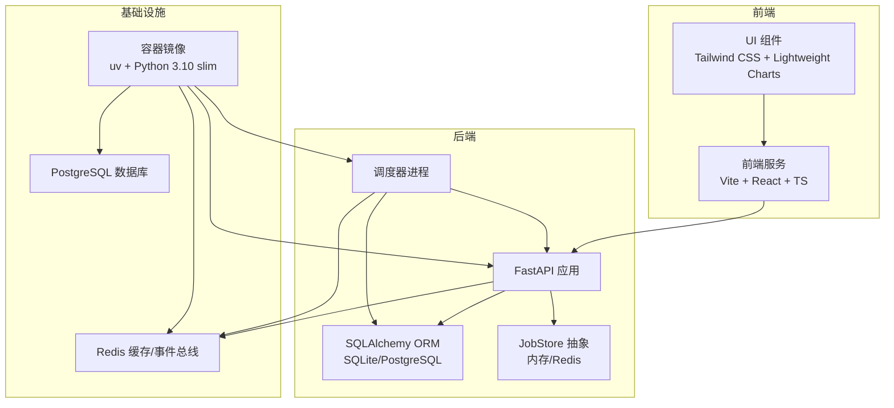
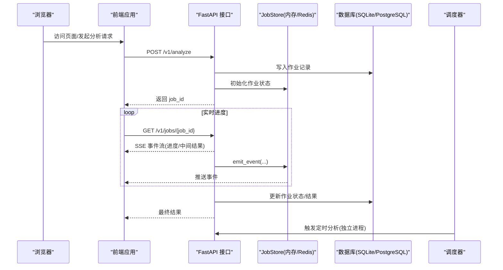
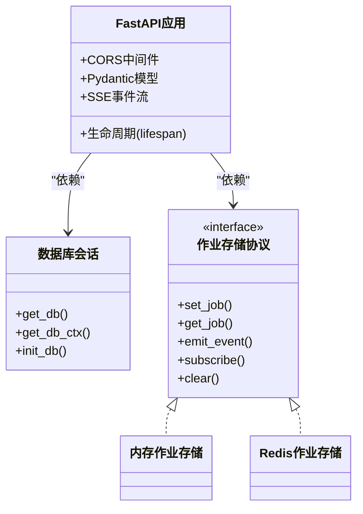
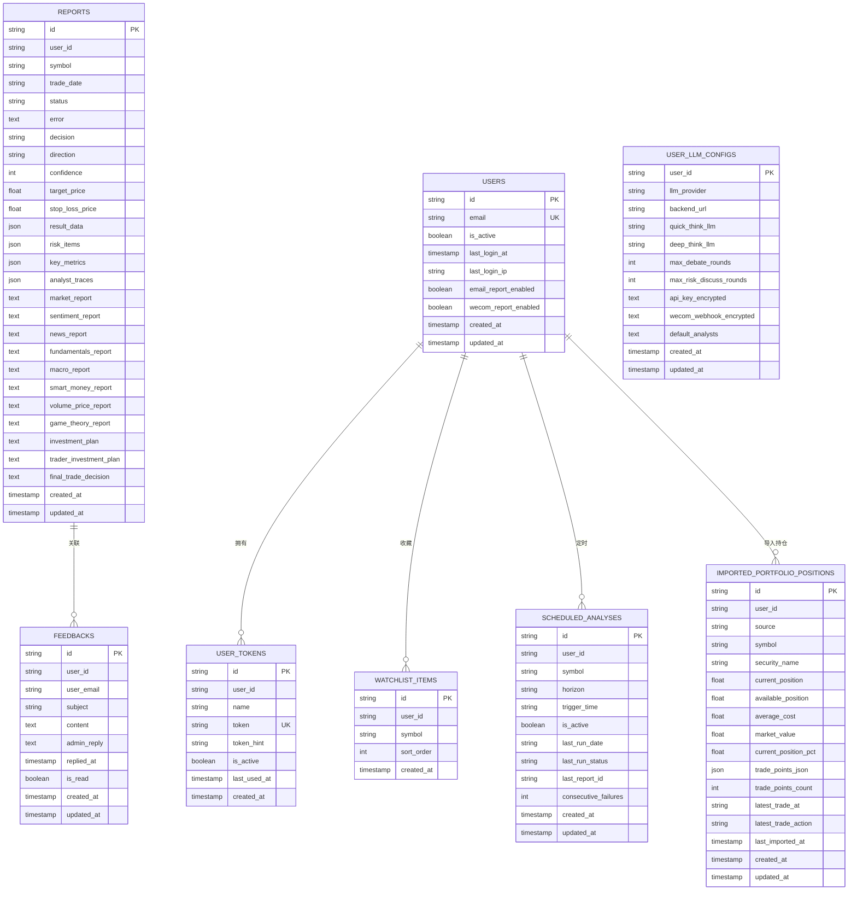
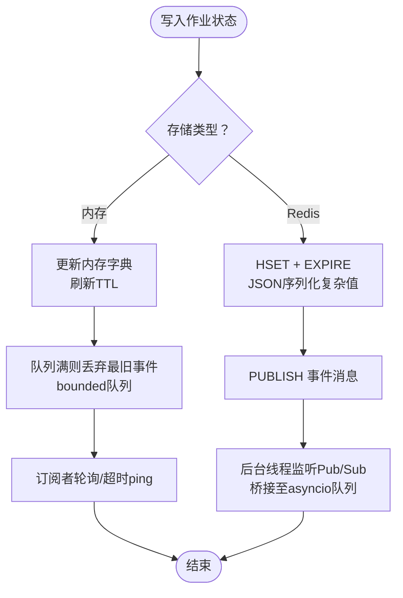
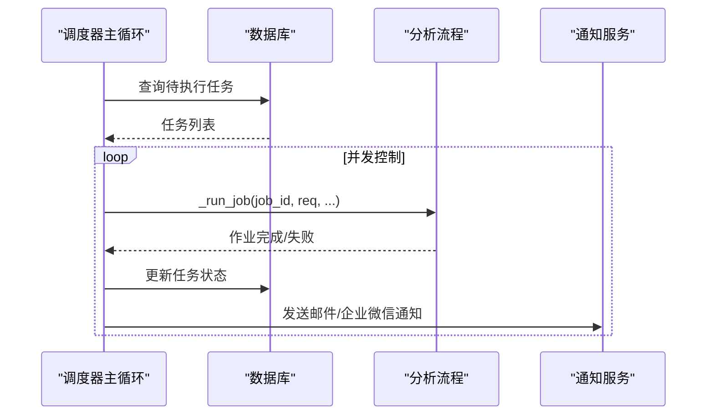
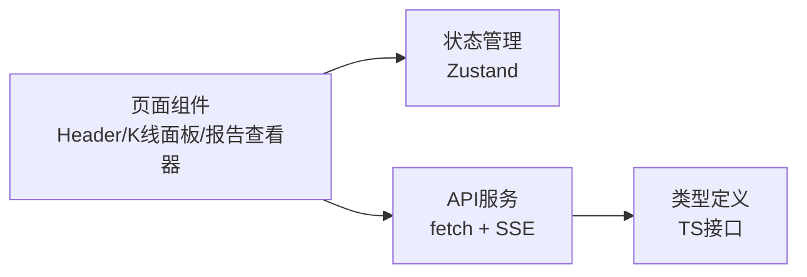
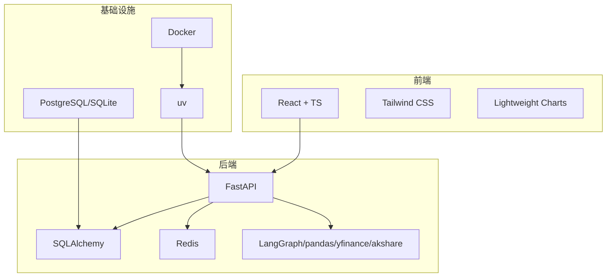

# 技术栈架构

<cite>
**本文引用的文件**
- [pyproject.toml](file://pyproject.toml)
- [requirements.txt](file://requirements.txt)
- [Dockerfile](file://Dockerfile)
- [api/main.py](file://api/main.py)
- [api/database.py](file://api/database.py)
- [api/job_store.py](file://api/job_store.py)
- [api/job_store_redis.py](file://api/job_store_redis.py)
- [scheduler/main.py](file://scheduler/main.py)
- [frontend/package.json](file://frontend/package.json)
- [frontend/tailwind.config.js](file://frontend/tailwind.config.js)
- [frontend/vite.config.ts](file://frontend/vite.config.ts)
- [frontend/src/services/api.ts](file://frontend/src/services/api.ts)
</cite>

## 目录
1. [引言](#引言)
2. [项目结构](#项目结构)
3. [核心组件](#核心组件)
4. [架构总览](#架构总览)
5. [详细组件分析](#详细组件分析)
6. [依赖关系分析](#依赖关系分析)
7. [性能考虑](#性能考虑)
8. [故障排查指南](#故障排查指南)
9. [结论](#结论)
10. [附录](#附录)

## 引言
本技术栈架构文档面向 TradingAgents-AShare 项目的后端、前端与基础设施层，系统梳理并解释支撑系统的完整技术栈：后端采用 Python 生态（FastAPI、LangGraph、SQLAlchemy、Redis），前端采用 React 生态（TypeScript、Tailwind CSS、Lightweight Charts），基础设施采用 Docker 与 PostgreSQL（通过 SQLAlchemy 支持 SQLite/PostgreSQL 双形态）。文档从技术选型原因、优势与局限性出发，阐述 API 设计、数据序列化与跨语言通信机制，并给出版本管理、依赖管理与升级策略建议。

## 项目结构
项目采用多模块分层组织：
- 后端 API：FastAPI 应用，提供 REST 接口与 SSE 实时事件流，负责作业状态存储与调度触发。
- 调度器：独立的异步调度进程，按时间窗口触发定时分析任务。
- 数据层：SQLAlchemy ORM 定义数据库模型，支持 SQLite/PostgreSQL。
- 作业存储：内存或 Redis 两种实现，统一抽象为 JobStore 协议，保障多实例部署一致性。
- 前端：React + TypeScript，使用 Vite 构建，Tailwind CSS 样式，Lightweight Charts 绘制 K 线图。

图表来源
- [Dockerfile:1-51](file://Dockerfile#L1-L51)
- [api/main.py:298-313](file://api/main.py#L298-L313)
- [api/database.py:11-50](file://api/database.py#L11-L50)
- [api/job_store.py:289-305](file://api/job_store.py#L289-L305)
- [scheduler/main.py:1-447](file://scheduler/main.py#L1-L447)

章节来源
- [Dockerfile:1-51](file://Dockerfile#L1-L51)
- [frontend/package.json:1-47](file://frontend/package.json#L1-L47)
- [frontend/tailwind.config.js:1-37](file://frontend/tailwind.config.js#L1-L37)
- [frontend/vite.config.ts:1-75](file://frontend/vite.config.ts#L1-L75)

## 核心组件
- 后端框架与路由
  - FastAPI 提供高性能异步接口、自动 OpenAPI 文档与 Pydantic 数据校验。
  - CORS 中间件允许开发环境跨域访问。
- 数据持久化
  - SQLAlchemy 支持 SQLite（默认）与 PostgreSQL，连接池参数按数据库类型优化。
- 作业状态与事件
  - JobStore 抽象统一内存与 Redis 存储，支持 SSE 事件发布订阅。
- 调度与并发
  - 独立调度器进程，基于 asyncio.Semaphore 控制并发，定时触发分析任务。
- 前端交互
  - Vite 开发服务器代理到后端 8000 端口，TS 类型安全，Tailwind 快速样式，Lightweight Charts 渲染 K 线。

章节来源
- [api/main.py:298-313](file://api/main.py#L298-L313)
- [api/database.py:11-50](file://api/database.py#L11-L50)
- [api/job_store.py:35-67](file://api/job_store.py#L35-L67)
- [api/job_store_redis.py:51-75](file://api/job_store_redis.py#L51-L75)
- [scheduler/main.py:95-123](file://scheduler/main.py#L95-L123)
- [frontend/vite.config.ts:48-73](file://frontend/vite.config.ts#L48-L73)

## 架构总览
系统采用“前后端分离 + 后端微服务化”的架构：
- 前端通过 HTTP/JSON 与 SSE 与后端交互；SSE 用于实时展示分析进度与中间结果。
- 后端通过 JobStore 将作业状态与事件广播至 Redis（可选），实现多实例共享。
- 调度器独立运行，读取数据库任务表，调用后端分析流程并发送通知。

图表来源
- [api/main.py:599-653](file://api/main.py#L599-L653)
- [api/job_store.py:108-124](file://api/job_store.py#L108-L124)
- [api/job_store_redis.py:105-114](file://api/job_store_redis.py#L105-L114)
- [scheduler/main.py:251-273](file://scheduler/main.py#L251-L273)

## 详细组件分析

### 后端 API（FastAPI）
- 职责
  - 提供分析、报告、监控板、看板、令牌等 REST 接口。
  - 使用 Pydantic 模型进行请求/响应序列化与校验。
  - 通过 SSE 流式返回分析过程中的中间结果。
- 关键点
  - 生命周期管理：启动时初始化数据库、加载交易日历与股票映射。
  - 线程池与事件循环：提升高并发场景下的吞吐量。
  - CORS 与安全：生产环境可关闭文档端点，提供密钥告警。

图表来源
- [api/main.py:216-279](file://api/main.py#L216-L279)
- [api/database.py:60-96](file://api/database.py#L60-L96)
- [api/job_store.py:35-67](file://api/job_store.py#L35-L67)
- [api/job_store_redis.py:51-75](file://api/job_store_redis.py#L51-L75)

章节来源
- [api/main.py:216-279](file://api/main.py#L216-L279)
- [api/main.py:599-653](file://api/main.py#L599-L653)

### 数据库与模型（SQLAlchemy）
- 职责
  - 定义报告、用户、令牌、看板、定时任务等核心表结构。
  - 支持 SQLite（默认）与 PostgreSQL，自动迁移轻量字段。
- 关键点
  - 连接池参数针对不同数据库类型优化。
  - JSON 字段用于存储结构化分析结果与中间报告。

图表来源
- [api/database.py:242-483](file://api/database.py#L242-L483)

章节来源
- [api/database.py:11-50](file://api/database.py#L11-L50)
- [api/database.py:242-483](file://api/database.py#L242-L483)

### 作业存储（JobStore）与事件系统
- 职责
  - 统一作业状态与事件的存储与订阅，支持内存与 Redis 两种实现。
  - 通过队列上限与 TTL 控制内存占用，保障长连接稳定性。
- 关键点
  - Redis 实现使用 Hash 存状态、Pub/Sub 发布事件，适合多实例共享。
  - 内存实现兼容单实例部署，提供与 Redis 行为一致的接口。

图表来源
- [api/job_store.py:108-179](file://api/job_store.py#L108-L179)
- [api/job_store_redis.py:78-114](file://api/job_store_redis.py#L78-L114)

章节来源
- [api/job_store.py:289-305](file://api/job_store.py#L289-L305)
- [api/job_store_redis.py:51-75](file://api/job_store_redis.py#L51-L75)

### 调度器（独立进程）
- 职责
  - 每分钟扫描数据库中待执行的定时任务，在交易日非交易时段触发分析。
  - 通过信号量控制并发，避免资源争用。
- 关键点
  - 与 API 共享相同的分析流程与上下文构建逻辑，确保行为一致。
  - 启动时恢复“运行中”但无响应的任务状态。

图表来源
- [scheduler/main.py:277-333](file://scheduler/main.py#L277-L333)
- [scheduler/main.py:178-249](file://scheduler/main.py#L178-L249)

章节来源
- [scheduler/main.py:95-123](file://scheduler/main.py#L95-L123)
- [scheduler/main.py:277-333](file://scheduler/main.py#L277-L333)

### 前端（React + TypeScript + Tailwind CSS + Lightweight Charts）
- 职责
  - 提供分析、报告、看板、设置等页面，通过 ApiService 统一调用后端接口。
  - 使用 Vite 开发服务器，代理到后端 8000 端口，便于本地联调。
- 关键点
  - Tailwind CSS 主题扩展了 trading 命名空间的颜色与动画。
  - Lightweight Charts 用于绘制 K 线图，支持交互与自定义样式。

图表来源
- [frontend/src/services/api.ts:64-104](file://frontend/src/services/api.ts#L64-L104)
- [frontend/tailwind.config.js:8-33](file://frontend/tailwind.config.js#L8-L33)
- [frontend/vite.config.ts:48-73](file://frontend/vite.config.ts#L48-L73)

章节来源
- [frontend/package.json:12-30](file://frontend/package.json#L12-L30)
- [frontend/tailwind.config.js:1-37](file://frontend/tailwind.config.js#L1-L37)
- [frontend/vite.config.ts:1-75](file://frontend/vite.config.ts#L1-L75)
- [frontend/src/services/api.ts:64-104](file://frontend/src/services/api.ts#L64-L104)

## 依赖关系分析
- 后端依赖
  - 核心库：FastAPI、SQLAlchemy、Redis、LangGraph、pandas、yfinance、akshare、baostock 等。
  - 版本管理：pyproject.toml 与 requirements.txt 双轨并行，uv.lock 保证锁定。
- 前端依赖
  - React、Tailwind CSS、Lightweight Charts、Zustand、TanStack Virtual 等。
- 基础设施
  - Docker 多阶段构建，Node 用于前端构建，uv 用于 Python 依赖同步。

图表来源
- [pyproject.toml:11-38](file://pyproject.toml#L11-L38)
- [requirements.txt:1-24](file://requirements.txt#L1-L24)
- [Dockerfile:1-51](file://Dockerfile#L1-L51)
- [frontend/package.json:12-30](file://frontend/package.json#L12-L30)

章节来源
- [pyproject.toml:11-38](file://pyproject.toml#L11-L38)
- [requirements.txt:1-24](file://requirements.txt#L1-L24)
- [Dockerfile:1-51](file://Dockerfile#L1-L51)

## 性能考虑
- 后端
  - 线程池与事件循环：根据并发需求调整默认线程池大小，避免阻塞。
  - 连接池：SQLite/PostgreSQL 分别配置池大小与回收策略。
  - SSE：队列上限与 TTL 控制内存增长，终端事件后及时清理。
- 前端
  - Vite 构建优化与代理，减少跨域与网络往返。
  - 图表渲染：Lightweight Charts 按需更新，避免全量重绘。
- 基础设施
  - Docker 多阶段构建与缓存挂载，缩短构建时间。
  - uv 同步依赖，提升镜像构建速度与一致性。

章节来源
- [api/main.py:234-249](file://api/main.py#L234-L249)
- [api/database.py:14-50](file://api/database.py#L14-L50)
- [api/job_store.py:20-29](file://api/job_store.py#L20-L29)
- [frontend/vite.config.ts:4-12](file://frontend/vite.config.ts#L4-L12)

## 故障排查指南
- CORS 与跨域
  - 检查 CORS 允许来源与正则配置，确保开发环境可访问。
- 数据库连接
  - SQLite 默认路径与权限问题；PostgreSQL 连接字符串格式与网络可达性。
- Redis 事件
  - REDIS_URL 设置后需确保 api.job_store_redis 可导入；检查 Pub/Sub 订阅与 TTL。
- SSE 事件丢失
  - 队列上限与消费者断连导致事件溢出，适当增大上限或优化消费速率。
- 调度器并发
  - SCHEDULER_CONCURRENCY 与线程池大小不匹配导致饥饿或过载，按 CPU/IO 调整。

章节来源
- [api/main.py:76-94](file://api/main.py#L76-L94)
- [api/database.py:11-50](file://api/database.py#L11-L50)
- [api/job_store_redis.py:61-66](file://api/job_store_redis.py#L61-L66)
- [api/job_store.py:20-29](file://api/job_store.py#L20-L29)
- [scheduler/main.py:42-48](file://scheduler/main.py#L42-L48)

## 结论
该技术栈围绕“高性能异步 + 事件驱动 + 多实例共享”的目标设计：后端以 FastAPI 为核心，结合 SQLAlchemy 与 Redis 实现状态与事件的可靠传播；调度器独立运行，保障定时任务的稳定执行；前端以 React + TS 为基础，配合 Tailwind CSS 与 Lightweight Charts 提供流畅的可视化体验。整体架构具备良好的扩展性与可维护性，适合金融分析类应用的持续演进。

## 附录

### 技术栈选型与权衡
- 后端
  - FastAPI：异步、强类型、自动生成文档，适合高并发 API。
  - LangGraph：多智能体协作编排，契合多分析师并行处理。
  - SQLAlchemy：ORM 简化数据库操作，支持多种后端。
  - Redis：事件总线与状态共享，满足多实例部署需求。
- 前端
  - React + TypeScript：类型安全与生态丰富，适合复杂交互。
  - Tailwind CSS：原子化样式，快速迭代 UI。
  - Lightweight Charts：专业级 K 线渲染，性能优异。
- 基础设施
  - Docker：标准化交付，隔离依赖。
  - uv：更快的包管理与锁定，提升构建效率。

### API 设计与数据序列化
- 请求/响应模型均使用 Pydantic，自动进行字段校验与序列化。
- SSE 事件通过统一的事件通道推送，前端以流式方式消费。
- 时间字段统一为 UTC ISO 格式，避免时区歧义。

章节来源
- [api/main.py:586-732](file://api/main.py#L586-L732)
- [frontend/src/services/api.ts:64-104](file://frontend/src/services/api.ts#L64-L104)

### 跨语言通信
- 前后端通过 HTTP/JSON 与 SSE 通信，无需额外协议。
- Redis 作为共享状态与事件总线，屏蔽后端语言差异。
- 调度器与 API 共用分析流程，确保行为一致性。

章节来源
- [api/job_store_redis.py:105-114](file://api/job_store_redis.py#L105-L114)
- [scheduler/main.py:80-90](file://scheduler/main.py#L80-L90)

### 版本管理、依赖管理与升级策略
- 版本管理
  - 后端版本来自包元数据与环境变量，前端通过 Git 提交信息注入构建元数据。
- 依赖管理
  - pyproject.toml 为主，requirements.txt 为辅；uv.lock 锁定具体版本。
- 升级策略
  - 优先在 Dockerfile 中固定基础镜像与工具链版本，再逐步升级依赖。
  - 对核心库（FastAPI、SQLAlchemy、LangGraph）进行灰度验证后再全量升级。

章节来源
- [Dockerfile:40-47](file://Dockerfile#L40-L47)
- [frontend/vite.config.ts:14-32](file://frontend/vite.config.ts#L14-L32)
- [pyproject.toml:5-11](file://pyproject.toml#L5-L11)