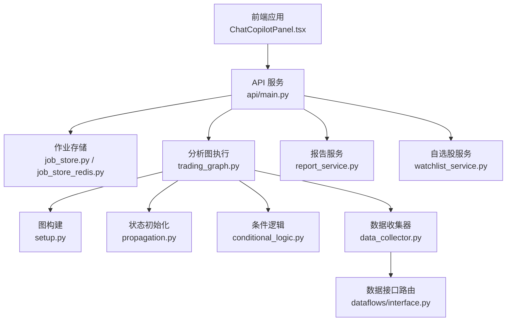
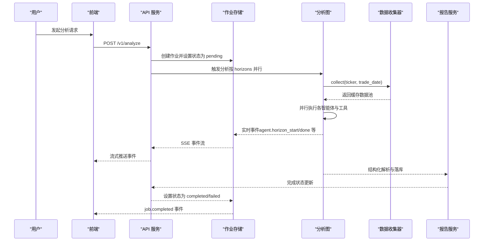
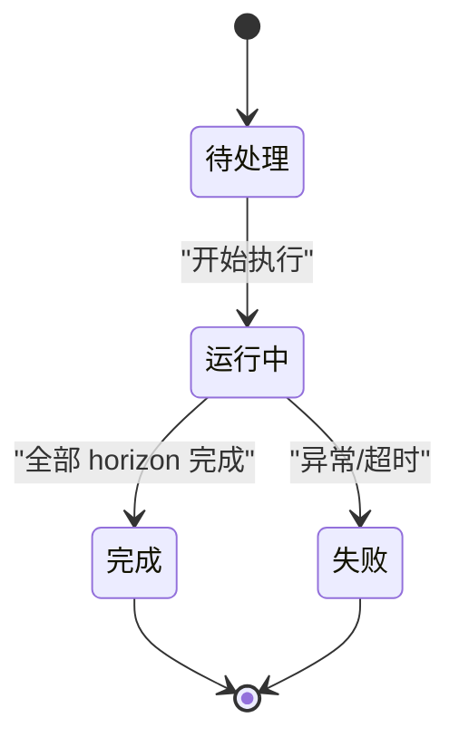
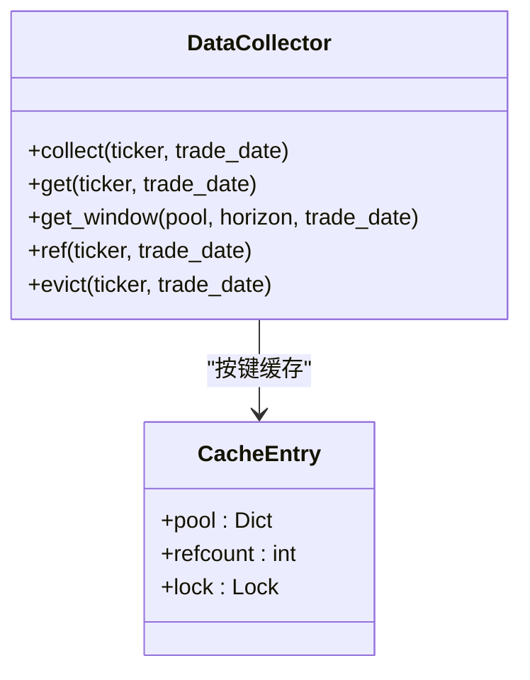
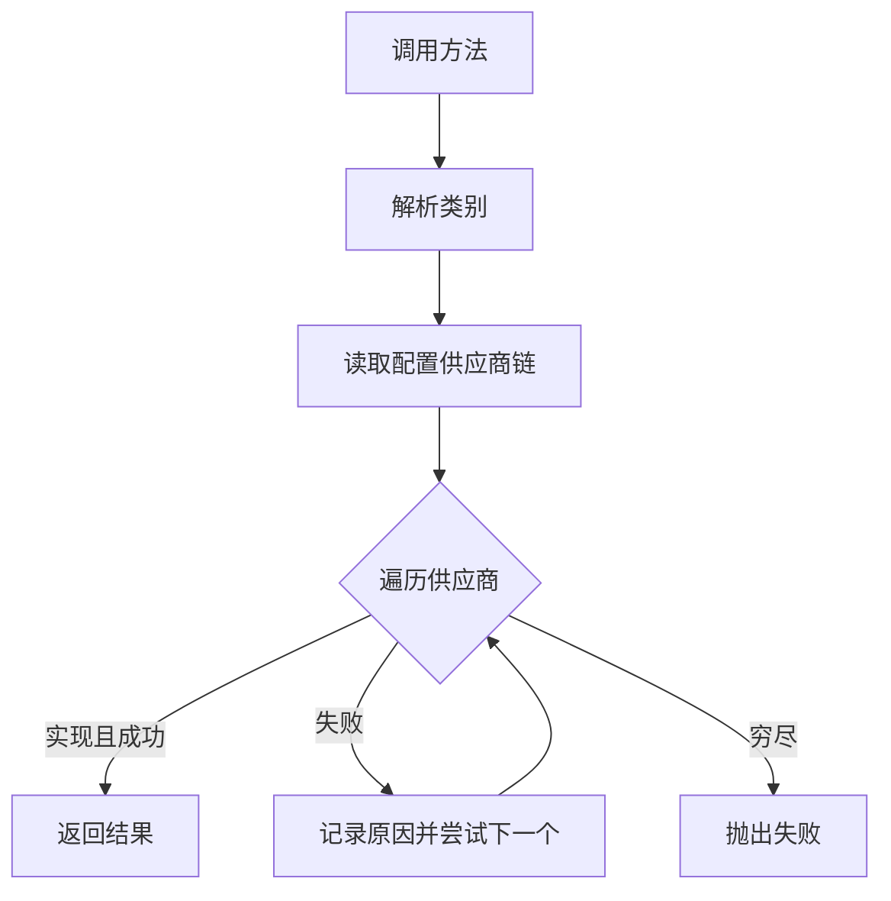
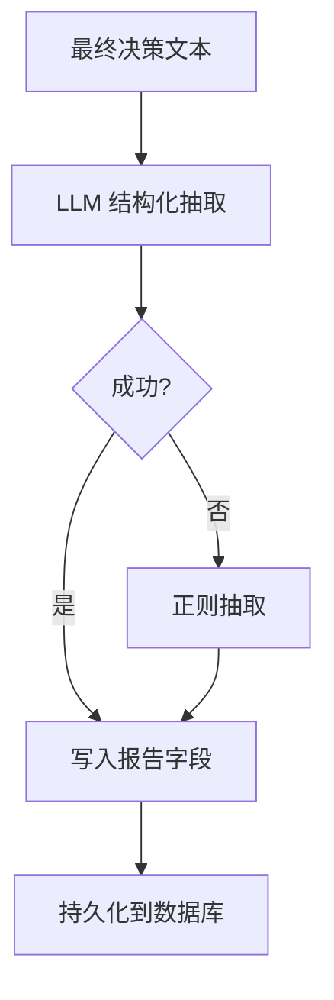
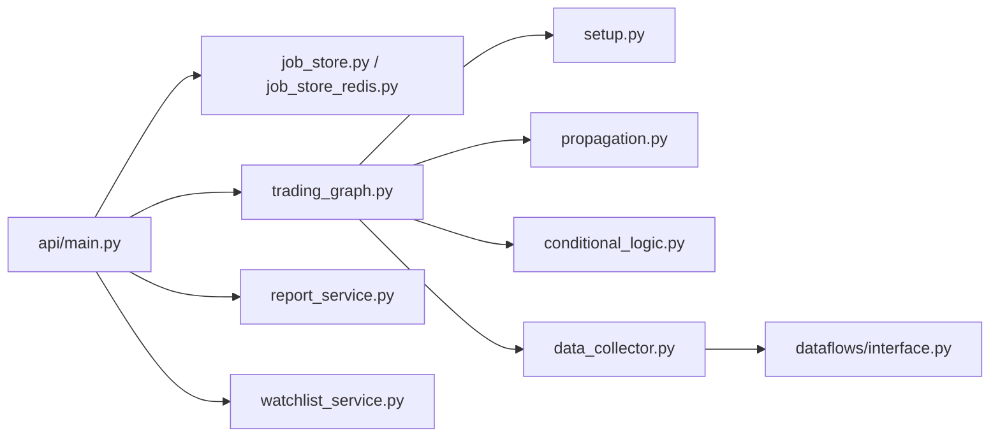

# 数据流设计

<cite>
**本文档引用的文件**
- [api/main.py](file://api/main.py)
- [api/job_store.py](file://api/job_store.py)
- [api/job_store_redis.py](file://api/job_store_redis.py)
- [api/services/report_service.py](file://api/services/report_service.py)
- [api/services/watchlist_service.py](file://api/services/watchlist_service.py)
- [tradingagents/graph/trading_graph.py](file://tradingagents/graph/trading_graph.py)
- [tradingagents/graph/setup.py](file://tradingagents/graph/setup.py)
- [tradingagents/graph/propagation.py](file://tradingagents/graph/propagation.py)
- [tradingagents/graph/conditional_logic.py](file://tradingagents/graph/conditional_logic.py)
- [tradingagents/graph/data_collector.py](file://tradingagents/graph/data_collector.py)
- [tradingagents/agents/utils/agent_states.py](file://tradingagents/agents/utils/agent_states.py)
- [tradingagents/dataflows/interface.py](file://tradingagents/dataflows/interface.py)
- [frontend/src/components/ChatCopilotPanel.tsx](file://frontend/src/components/ChatCopilotPanel.tsx)
- [skills/tradingagents-analysis/scripts/analyze.sh](file://skills/tradingagents-analysis/scripts/analyze.sh)
</cite>

## 目录
1. [简介](#简介)
2. [项目结构](#项目结构)
3. [核心组件](#核心组件)
4. [架构总览](#架构总览)
5. [详细组件分析](#详细组件分析)
6. [依赖分析](#依赖分析)
7. [性能考虑](#性能考虑)
8. [故障排查指南](#故障排查指南)
9. [结论](#结论)
10. [附录](#附录)

## 简介
本文件面向 TradingAgents-AShare 的“多智能体协同分析”系统，提供从用户请求到最终报告输出的完整数据流设计文档。重点涵盖：
- 多智能体协作过程中的状态传播、消息传递与结果聚合
- 数据缓存策略、共享数据收集器的设计与实现
- 作业状态管理、并发控制与错误处理的数据流
- 实时数据处理、批量处理与异步处理的差异与适用场景
- 数据流向图、状态转换图与关键数据结构说明

## 项目结构
系统采用前后端分离与模块化分层设计：
- 前端：React + TypeScript，负责交互与实时订阅
- 后端：FastAPI 提供 REST 与 SSE 接口，调度与执行分析工作流
- 分析引擎：LangGraph 图执行框架，封装多智能体协作与状态传播
- 数据层：统一接口路由到不同数据提供商，支持多供应商回退
- 存储层：作业状态与事件通过内存或 Redis 共享，报告持久化至数据库



图表来源
- [api/main.py](file://api/main.py)
- [api/job_store.py](file://api/job_store.py)
- [api/job_store_redis.py](file://api/job_store_redis.py)
- [api/services/report_service.py](file://api/services/report_service.py)
- [api/services/watchlist_service.py](file://api/services/watchlist_service.py)
- [tradingagents/graph/trading_graph.py](file://tradingagents/graph/trading_graph.py)
- [tradingagents/graph/setup.py](file://tradingagents/graph/setup.py)
- [tradingagents/graph/propagation.py](file://tradingagents/graph/propagation.py)
- [tradingagents/graph/conditional_logic.py](file://tradingagents/graph/conditional_logic.py)
- [tradingagents/graph/data_collector.py](file://tradingagents/graph/data_collector.py)
- [tradingagents/dataflows/interface.py](file://tradingagents/dataflows/interface.py)

章节来源
- [api/main.py](file://api/main.py)
- [tradingagents/graph/trading_graph.py](file://tradingagents/graph/trading_graph.py)

## 核心组件
- 作业存储与事件系统：提供作业状态写入、事件发布与订阅（SSE），支持内存与 Redis 两种实现，保障多进程/多实例一致性
- 分析图执行：基于 LangGraph 的状态机，定义多智能体节点、工具节点与条件边，实现并行分析与辩论式合成
- 数据收集器：按“标的+交易日”维度缓存全量数据，避免重复抓取，支持短/中线窗口裁剪
- 报告服务：结构化解析与落库，支持正则与 LLM 两种抽取路径，保证字段一致性
- 数据接口路由：按类别与方法名映射到具体供应商，支持配置化与回退链

章节来源
- [api/job_store.py](file://api/job_store.py)
- [api/job_store_redis.py](file://api/job_store_redis.py)
- [tradingagents/graph/trading_graph.py](file://tradingagents/graph/trading_graph.py)
- [tradingagents/graph/data_collector.py](file://tradingagents/graph/data_collector.py)
- [api/services/report_service.py](file://api/services/report_service.py)
- [tradingagents/dataflows/interface.py](file://tradingagents/dataflows/interface.py)

## 架构总览
用户请求经 API 层进入，触发作业创建与状态更新，分析图并行执行各智能体，实时事件通过 SSE 推送，最终生成结构化报告并持久化。



图表来源
- [api/main.py](file://api/main.py)
- [api/job_store.py](file://api/job_store.py)
- [tradingagents/graph/trading_graph.py](file://tradingagents/graph/trading_graph.py)
- [tradingagents/graph/data_collector.py](file://tradingagents/graph/data_collector.py)
- [api/services/report_service.py](file://api/services/report_service.py)

## 详细组件分析

### 作业状态管理与并发控制
- 作业生命周期：pending → running → completed/failed
- 事件模型：SSE 事件类型包括 job.created、agent.horizon_start、agent.horizon_done、job.completed、job.failed 等
- 并发控制：定时分析采用信号量与队列进行限流与排队，避免资源争用
- 超时与清理：统一超时时间，超时后标记失败并写回数据库，内存存储支持 TTL 清理



图表来源
- [api/job_store.py](file://api/job_store.py)
- [api/main.py](file://api/main.py)

章节来源
- [api/job_store.py](file://api/job_store.py)
- [api/main.py](file://api/main.py)

### 多智能体协作与状态传播
- 图构建：按选择的分析师动态注册节点与工具节点，定义并行→串行的条件边
- 初始状态：包含市场上下文、仪器上下文、用户上下文、辩论状态等
- 条件逻辑：依据上一轮消息是否包含工具调用决定继续工具调用或进入总结阶段
- 状态传播：消息状态在节点间传递，最终汇聚到研究经理与交易员，再进入风险评审与修订流程

```mermaid
flowchart TD
START(["开始"]) --> INIT["初始化状态<br/>市场/仪器/用户上下文"]
INIT --> PARALLEL["并行分析各分析师"]
PARALLEL --> TOOLS{"是否仍有工具调用?"}
TOOLS --> |是| TOOLS_RUN["执行工具节点"]
TOOLS_RUN --> PARALLEL
TOOLS --> |否| SUMMARIZE["汇总报告与计划"]
SUMMARIZE --> DEBATE["投资辩论多轮"]
DEBATE --> RESEARCH_MGR["研究经理综合"]
RESEARCH_MGR --> TRADER["交易员制定计划"]
TRADER --> RISK_DEBATE["风险评审Aggressive/Neutral/Conservative"]
RISK_DEBATE --> REVISION{"是否需要修订?"}
REVISION --> |是| TRADER
REVISION --> |否| FINAL["最终决策"]
FINAL --> [*]
```

图表来源
- [tradingagents/graph/setup.py](file://tradingagents/graph/setup.py)
- [tradingagents/graph/propagation.py](file://tradingagents/graph/propagation.py)
- [tradingagents/graph/conditional_logic.py](file://tradingagents/graph/conditional_logic.py)
- [tradingagents/graph/trading_graph.py](file://tradingagents/graph/trading_graph.py)

章节来源
- [tradingagents/graph/setup.py](file://tradingagents/graph/setup.py)
- [tradingagents/graph/propagation.py](file://tradingagents/graph/propagation.py)
- [tradingagents/graph/conditional_logic.py](file://tradingagents/graph/conditional_logic.py)
- [tradingagents/graph/trading_graph.py](file://tradingagents/graph/trading_graph.py)

### 数据缓存策略与共享数据收集器
- 缓存键：ticker + trade_date，全局共享，避免重复抓取
- 并发安全：按键加锁，同一键并发访问串行化，确保只抓取一次
- 生命周期：引用计数，使用完毕后释放，内存回收
- 数据窗口：按短/中线裁剪，避免重复计算指标



图表来源
- [tradingagents/graph/data_collector.py](file://tradingagents/graph/data_collector.py)

章节来源
- [tradingagents/graph/data_collector.py](file://tradingagents/graph/data_collector.py)

### 数据接口路由与供应商回退
- 类别到方法映射：核心行情、技术指标、基本面、新闻、实时、A 股特色等
- 供应商链：按配置优先级与注册表回退，记录 trace 便于诊断
- 异常处理：速率限制与未实现错误触发回退，其他异常也回退到下一个供应商



图表来源
- [tradingagents/dataflows/interface.py](file://tradingagents/dataflows/interface.py)

章节来源
- [tradingagents/dataflows/interface.py](file://tradingagents/dataflows/interface.py)

### 报告结构化抽取与落库
- 结构化解析：优先使用 LLM 结构化输出，失败时回退正则抽取
- 字段收敛：统一提取方向、置信度、目标价、止损价、关键指标与风险项
- 落库策略：按需部分更新或一次性完成，失败时标记并记录错误



图表来源
- [api/services/report_service.py](file://api/services/report_service.py)

章节来源
- [api/services/report_service.py](file://api/services/report_service.py)

### 实时数据处理、批量处理与异步处理
- 实时处理：SSE 流式事件推送，前端即时渲染；适合交互式分析
- 批量处理：脚本并行提交多个 job，轮询完成状态；适合策略回测与批量扫描
- 异步处理：后台任务与线程池解耦 IO 与 CPU 密集操作，避免阻塞事件循环

章节来源
- [frontend/src/components/ChatCopilotPanel.tsx](file://frontend/src/components/ChatCopilotPanel.tsx)
- [skills/tradingagents-analysis/scripts/analyze.sh](file://skills/tradingagents-analysis/scripts/analyze.sh)
- [api/main.py](file://api/main.py)

## 依赖分析
- 组件耦合
  - API 依赖作业存储与报告服务；分析图依赖数据收集器与条件逻辑
  - 数据接口路由独立于业务层，通过抽象方法注入工具节点
- 外部依赖
  - Redis（可选）用于分布式作业状态与事件广播
  - SQLite（默认）用于本地持久化
- 潜在环路
  - 通过抽象接口与工厂函数避免循环导入，延迟加载智能体工厂



图表来源
- [api/main.py](file://api/main.py)
- [api/job_store.py](file://api/job_store.py)
- [api/job_store_redis.py](file://api/job_store_redis.py)
- [api/services/report_service.py](file://api/services/report_service.py)
- [api/services/watchlist_service.py](file://api/services/watchlist_service.py)
- [tradingagents/graph/trading_graph.py](file://tradingagents/graph/trading_graph.py)
- [tradingagents/graph/setup.py](file://tradingagents/graph/setup.py)
- [tradingagents/graph/propagation.py](file://tradingagents/graph/propagation.py)
- [tradingagents/graph/conditional_logic.py](file://tradingagents/graph/conditional_logic.py)
- [tradingagents/graph/data_collector.py](file://tradingagents/graph/data_collector.py)
- [tradingagents/dataflows/interface.py](file://tradingagents/dataflows/interface.py)

章节来源
- [api/main.py](file://api/main.py)
- [tradingagents/graph/trading_graph.py](file://tradingagents/graph/trading_graph.py)

## 性能考虑
- 并发抓取：数据收集器使用线程池并行抓取多源数据，降低总延迟
- 缓存复用：同一标的同日数据仅抓取一次，显著减少重复 IO
- 事件队列：SSE 事件队列带溢出丢弃策略，防止内存膨胀
- 线程池与限流：提升吞吐同时避免资源争用，超时与失败快速降级
- I/O 与 CPU 解耦：异步任务与线程池分离，避免事件循环阻塞

## 故障排查指南
- 作业超时：检查任务耗时与线程池配置，确认未出现死锁或阻塞
- 事件丢失：检查队列容量与消费者断连情况，必要时启用 Redis 事件通道
- 数据源异常：查看接口路由 trace，确认供应商链与回退是否生效
- 报告抽取失败：优先检查 LLM 输出格式，必要时回退正则抽取
- 并发冲突：核对定时分析的并发限制与等待队列长度

章节来源
- [api/main.py](file://api/main.py)
- [api/job_store.py](file://api/job_store.py)
- [api/job_store_redis.py](file://api/job_store_redis.py)
- [api/services/report_service.py](file://api/services/report_service.py)
- [tradingagents/dataflows/interface.py](file://tradingagents/dataflows/interface.py)

## 结论
本系统通过“作业状态+事件流+SSE”的统一数据通道，结合“共享数据收集器+条件逻辑+图执行”的分析框架，实现了高并发、可扩展、可观测的多智能体协同分析流水线。建议在生产环境启用 Redis 作业存储与事件通道，合理配置并发与超时参数，并持续优化数据源回退链与抽取策略以提升稳定性与准确性。

## 附录
- 关键数据结构
  - 作业状态：包含状态、时间戳、符号、日期、错误信息、等待队列统计等
  - 分析状态：包含仪器/市场/用户上下文、辩论状态、报告与计划、最终决策等
  - 报告字段：方向、置信度、目标价、止损价、关键指标、风险项、分析轨迹等

章节来源
- [api/main.py](file://api/main.py)
- [tradingagents/agents/utils/agent_states.py](file://tradingagents/agents/utils/agent_states.py)
- [api/services/report_service.py](file://api/services/report_service.py)