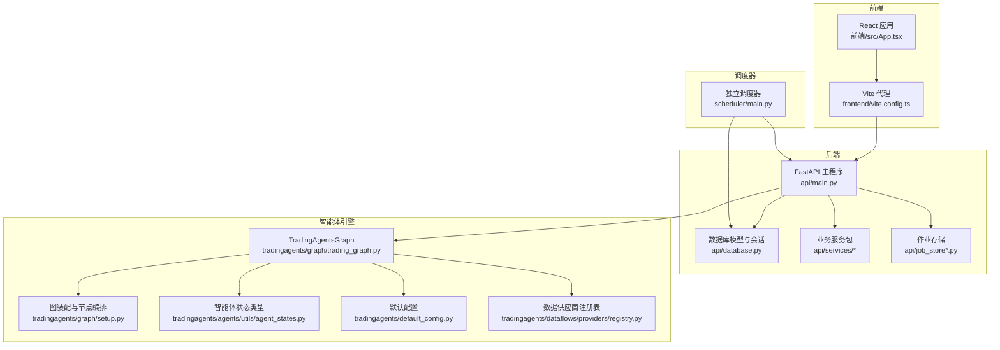
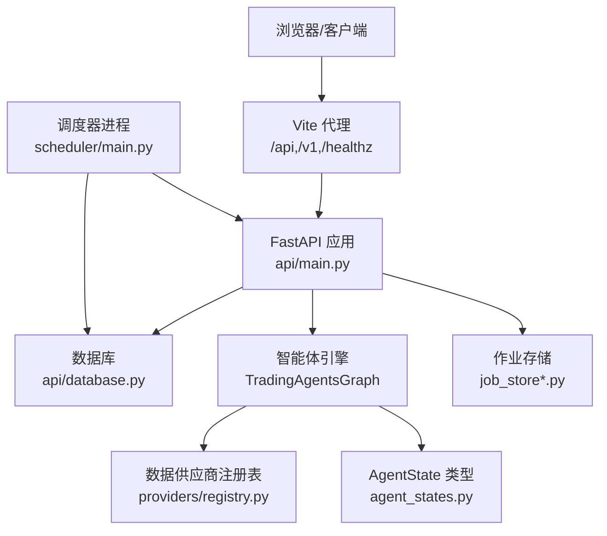
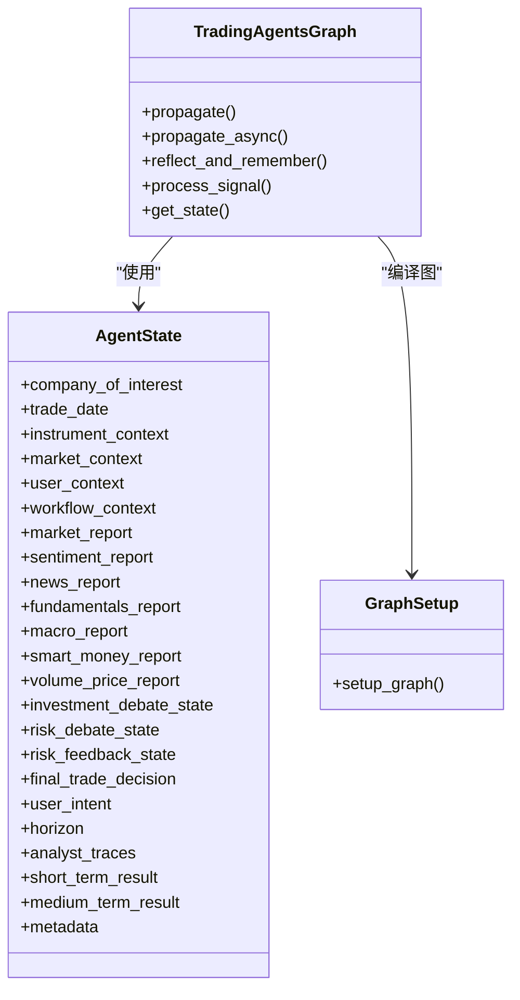
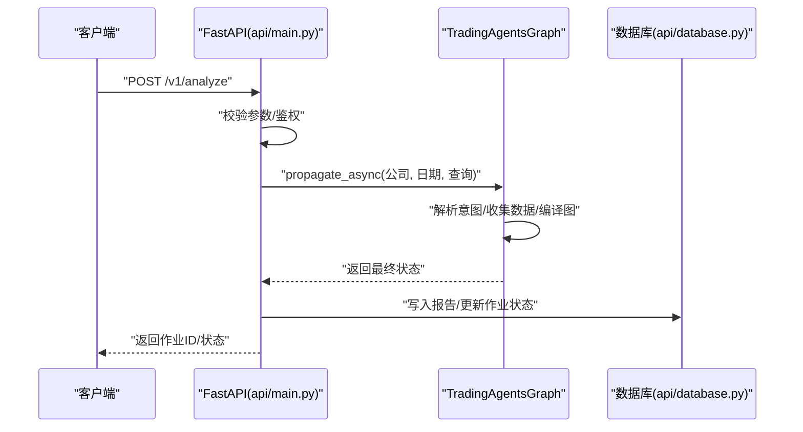
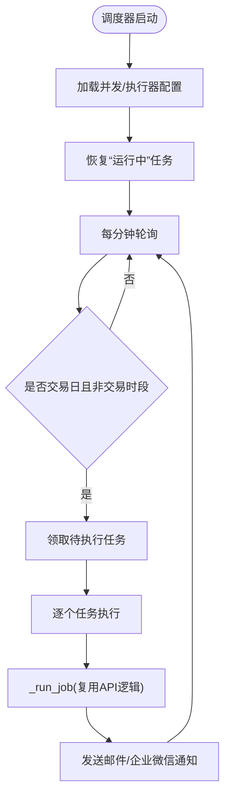
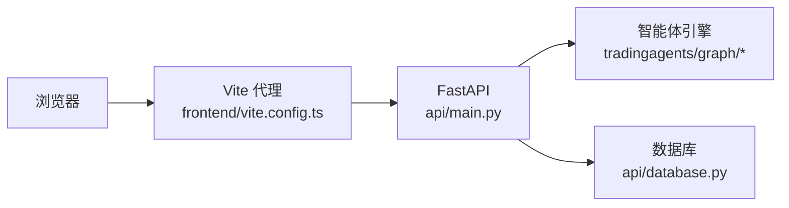
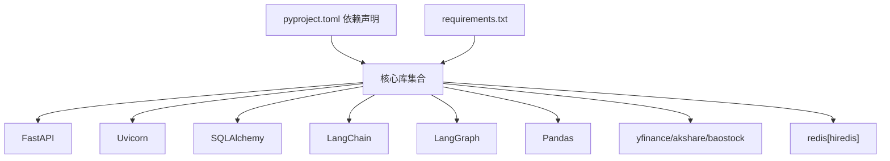

# 架构设计

<cite>
**本文引用的文件**   
- [api/main.py](file://api/main.py)
- [tradingagents/graph/trading_graph.py](file://tradingagents/graph/trading_graph.py)
- [tradingagents/graph/setup.py](file://tradingagents/graph/setup.py)
- [tradingagents/agents/utils/agent_states.py](file://tradingagents/agents/utils/agent_states.py)
- [api/database.py](file://api/database.py)
- [scheduler/main.py](file://scheduler/main.py)
- [tradingagents/default_config.py](file://tradingagents/default_config.py)
- [frontend/src/App.tsx](file://frontend/src/App.tsx)
- [frontend/vite.config.ts](file://frontend/vite.config.ts)
- [Dockerfile](file://Dockerfile)
- [pyproject.toml](file://pyproject.toml)
- [requirements.txt](file://requirements.txt)
- [tradingagents/dataflows/providers/registry.py](file://tradingagents/dataflows/providers/registry.py)
</cite>

## 目录
1. [引言](#引言)
2. [项目结构](#项目结构)
3. [核心组件](#核心组件)
4. [架构总览](#架构总览)
5. [详细组件分析](#详细组件分析)
6. [依赖分析](#依赖分析)
7. [性能考虑](#性能考虑)
8. [故障排查指南](#故障排查指南)
9. [结论](#结论)
10. [附录](#附录)

## 引言
本架构设计文档面向 TradingAgents-AShare 多智能体交易决策系统，聚焦于以下目标：
- 解释基于 LangGraph 的多智能体协作架构与智能体间通信机制
- 描述前后端分离架构、API 设计原则与数据库设计模式
- 明确系统边界、外部依赖与集成点
- 给出架构决策的技术考量、性能权衡与扩展性设计
- 提供组件交互图、数据流图与部署拓扑图

## 项目结构
项目采用“后端 API + 前端应用 + 调度器 + 核心交易智能体引擎”的分层组织方式：
- 后端 API：FastAPI 应用，负责路由、鉴权、作业调度、持久化与对外接口
- 交易智能体引擎：基于 LangGraph 的多智能体工作流，封装分析、研究、风险管理与交易执行
- 调度器：独立进程，按计划触发分析任务并处理通知
- 前端应用：React/Vite 应用，通过代理访问后端 API
- 数据与配置：统一默认配置、数据供应商注册表与数据库模型

图表来源
- [api/main.py:1-120](file://api/main.py#L1-L120)
- [tradingagents/graph/trading_graph.py:1-120](file://tradingagents/graph/trading_graph.py#L1-L120)
- [tradingagents/graph/setup.py:1-120](file://tradingagents/graph/setup.py#L1-L120)
- [tradingagents/agents/utils/agent_states.py:1-120](file://tradingagents/agents/utils/agent_states.py#L1-L120)
- [api/database.py:1-120](file://api/database.py#L1-L120)
- [scheduler/main.py:1-120](file://scheduler/main.py#L1-L120)
- [frontend/src/App.tsx:1-78](file://frontend/src/App.tsx#L1-L78)
- [frontend/vite.config.ts:1-75](file://frontend/vite.config.ts#L1-L75)

章节来源
- [api/main.py:1-200](file://api/main.py#L1-L200)
- [tradingagents/graph/trading_graph.py:1-120](file://tradingagents/graph/trading_graph.py#L1-L120)
- [tradingagents/graph/setup.py:1-120](file://tradingagents/graph/setup.py#L1-L120)
- [tradingagents/agents/utils/agent_states.py:1-120](file://tradingagents/agents/utils/agent_states.py#L1-L120)
- [api/database.py:1-120](file://api/database.py#L1-L120)
- [scheduler/main.py:1-120](file://scheduler/main.py#L1-L120)
- [frontend/src/App.tsx:1-78](file://frontend/src/App.tsx#L1-L78)
- [frontend/vite.config.ts:1-75](file://frontend/vite.config.ts#L1-L75)

## 核心组件
- 后端 API（FastAPI）
  - 负责路由、CORS、鉴权、作业生命周期管理、定时任务触发与事件推送
  - 使用内存或 Redis 作为作业存储，支持并发控制与后台任务跟踪
- 交易智能体引擎（LangGraph）
  - 基于状态图的工作流，包含多类分析师节点、研究者节点、风险评审节点与交易员节点
  - 支持工具节点调用外部数据源，具备检查点持久化能力
- 调度器（独立进程）
  - 按交易日与时间窗口扫描待执行任务，控制并发，完成后发送通知
- 前端应用（React/Vite）
  - 通过本地代理转发 /api、/v1、/healthz 等路径到后端，提供仪表盘、分析、报告等页面
- 数据与配置
  - 默认配置集中管理 LLM 提供商、模型、提示语言与数据供应商路由
  - 数据供应商注册表统一管理多家数据源
  - 数据库模型覆盖用户、令牌、报告、自选、定时分析等实体

章节来源
- [api/main.py:298-350](file://api/main.py#L298-L350)
- [tradingagents/graph/trading_graph.py:51-152](file://tradingagents/graph/trading_graph.py#L51-L152)
- [tradingagents/graph/setup.py:85-282](file://tradingagents/graph/setup.py#L85-L282)
- [scheduler/main.py:176-273](file://scheduler/main.py#L176-L273)
- [frontend/vite.config.ts:48-74](file://frontend/vite.config.ts#L48-L74)
- [tradingagents/default_config.py:1-43](file://tradingagents/default_config.py#L1-L43)
- [tradingagents/dataflows/providers/registry.py:11-35](file://tradingagents/dataflows/providers/registry.py#L11-L35)
- [api/database.py:242-483](file://api/database.py#L242-L483)

## 架构总览
系统采用“前后端分离 + 多智能体工作流 + 独立调度器”的整体架构。API 层作为统一入口，协调智能体引擎完成多维度分析，并将结果持久化至数据库。调度器在独立进程中按计划触发分析任务，实现异步与解耦。

图表来源
- [api/main.py:298-350](file://api/main.py#L298-L350)
- [tradingagents/graph/trading_graph.py:51-152](file://tradingagents/graph/trading_graph.py#L51-L152)
- [tradingagents/graph/setup.py:85-282](file://tradingagents/graph/setup.py#L85-L282)
- [tradingagents/agents/utils/agent_states.py:147-185](file://tradingagents/agents/utils/agent_states.py#L147-L185)
- [api/database.py:242-483](file://api/database.py#L242-L483)
- [scheduler/main.py:176-273](file://scheduler/main.py#L176-L273)
- [frontend/vite.config.ts:48-74](file://frontend/vite.config.ts#L48-L74)

## 详细组件分析

### 多智能体协作与 LangGraph 工作流
- 图装配与节点编排
  - 通过 GraphSetup 动态加载各智能体工厂函数，构建并编译状态图
  - 并行启动选定分析师节点，随后汇聚至研究者节点进行观点交锋
  - 研究管理器汇总短期与长期视角，交由交易员制定投资计划
  - 风险评审节点对计划进行多角度评估，必要时回退修订
- 状态模型
  - AgentState 扩展自 MessagesState，承载标的上下文、市场上下文、用户上下文、工作流元信息、各分析师报告与最终决策
  - 投资辩论与风险辩论状态用于记录多智能体对话历史与裁决
- 检查点与并发
  - 使用 MemorySaver 实现状态持久化，支持并发安全
  - 通过 thread_id 将不同请求/分析会话隔离

图表来源
- [tradingagents/agents/utils/agent_states.py:147-185](file://tradingagents/agents/utils/agent_states.py#L147-L185)
- [tradingagents/graph/trading_graph.py:51-152](file://tradingagents/graph/trading_graph.py#L51-L152)
- [tradingagents/graph/setup.py:85-282](file://tradingagents/graph/setup.py#L85-L282)

章节来源
- [tradingagents/graph/trading_graph.py:51-152](file://tradingagents/graph/trading_graph.py#L51-L152)
- [tradingagents/graph/setup.py:85-282](file://tradingagents/graph/setup.py#L85-L282)
- [tradingagents/agents/utils/agent_states.py:147-185](file://tradingagents/agents/utils/agent_states.py#L147-L185)

### API 服务与作业生命周期
- 作业存储与并发
  - 作业存储支持内存或 Redis 后端，API 层通过全局单例获取
  - 通过 AnyIO 线程限制器与默认线程池大小提升高并发同步端点吞吐
- 作业执行与状态追踪
  - 作业状态包含等待队列长度、并发运行数与超时控制
  - 通过 contextvar 将进度追踪器注入异步图节点，实现并行感知的状态推进
- 定时分析与手动触发
  - 支持手动触发与批量触发，兼容定时分析的用户上下文构建与调度记录

图表来源
- [api/main.py:2080-2093](file://api/main.py#L2080-L2093)
- [tradingagents/graph/trading_graph.py:297-350](file://tradingagents/graph/trading_graph.py#L297-L350)
- [api/database.py:242-318](file://api/database.py#L242-L318)

章节来源
- [api/main.py:298-350](file://api/main.py#L298-L350)
- [api/main.py:2080-2093](file://api/main.py#L2080-L2093)
- [tradingagents/graph/trading_graph.py:297-350](file://tradingagents/graph/trading_graph.py#L297-L350)
- [api/database.py:242-318](file://api/database.py#L242-L318)

### 调度器与通知
- 并发控制与恢复
  - 使用信号量控制并发，启动时恢复“运行中”但无对应报告的任务
  - 每分钟轮询，仅在交易日且非交易时段触发
- 通知机制
  - 成功后根据用户配置发送邮件与企业微信通知
- 与 API 的协作
  - 复用 API 内部的作业执行逻辑与用户上下文构建方法

图表来源
- [scheduler/main.py:382-430](file://scheduler/main.py#L382-L430)
- [scheduler/main.py:277-333](file://scheduler/main.py#L277-L333)
- [scheduler/main.py:176-273](file://scheduler/main.py#L176-L273)

章节来源
- [scheduler/main.py:382-430](file://scheduler/main.py#L382-L430)
- [scheduler/main.py:277-333](file://scheduler/main.py#L277-L333)
- [scheduler/main.py:176-273](file://scheduler/main.py#L176-L273)

### 前后端分离与代理
- 前端路由与权限
  - React 应用通过路由守卫与鉴权状态控制页面访问
- 本地开发代理
  - Vite 代理将 /api、/v1、/healthz、/openapi.json、/docs 等转发到后端
- 生产部署
  - Docker 多阶段构建，前端产物复制到后端镜像，统一暴露 8000 端口

图表来源
- [frontend/src/App.tsx:1-78](file://frontend/src/App.tsx#L1-L78)
- [frontend/vite.config.ts:48-74](file://frontend/vite.config.ts#L48-L74)
- [Dockerfile:1-51](file://Dockerfile#L1-L51)

章节来源
- [frontend/src/App.tsx:1-78](file://frontend/src/App.tsx#L1-L78)
- [frontend/vite.config.ts:48-74](file://frontend/vite.config.ts#L48-L74)
- [Dockerfile:1-51](file://Dockerfile#L1-L51)

### 数据与配置
- 默认配置
  - 集中管理 LLM 提供商、模型、提示语言、最大辩论轮次、数据供应商路由等
- 数据供应商注册表
  - 统一注册多家数据源（AkShare、BaoStock、YFinance、AlphaVantage、CN Stub），便于按需切换
- 数据缓存与一致性
  - DataCollector 对同一标的/日期的数据进行一次性采集并缓存，避免重复抓取

章节来源
- [tradingagents/default_config.py:1-43](file://tradingagents/default_config.py#L1-L43)
- [tradingagents/dataflows/providers/registry.py:11-35](file://tradingagents/dataflows/providers/registry.py#L11-L35)

## 依赖分析
- 运行时依赖
  - Python 3.10+，核心库包括 FastAPI、Uvicorn、SQLAlchemy、LangChain/LangGraph、pandas、yfinance、akshare、baostock、redis 等
- 构建与打包
  - 使用 uv 进行依赖同步，Docker 多阶段构建，前端使用 Vite/React
- 外部集成点
  - LLM 提供商（OpenAI、Anthropic、Google GenAI）
  - 数据供应商（AkShare、BaoStock、YFinance、AlphaVantage）
  - 通知渠道（邮件、企业微信 Webhook）

图表来源
- [pyproject.toml:11-38](file://pyproject.toml#L11-L38)
- [requirements.txt:1-24](file://requirements.txt#L1-24)

章节来源
- [pyproject.toml:11-38](file://pyproject.toml#L11-L38)
- [requirements.txt:1-24](file://requirements.txt#L1-24)

## 性能考虑
- 并发与线程池
  - API 层提升 AnyIO 线程限制与默认线程池大小，缓解长流程与频繁同步端点之间的资源竞争
  - 调度器设置独立线程池与默认线程池，确保高频 to_thread 调用不阻塞
- 作业超时与资源回收
  - 作业默认超时 30 分钟，避免长时间占用资源
  - 作业完成后清理作业存储与数据缓存，降低内存压力
- 缓存策略
  - 股票名称映射缓存带 TTL，减少冷启动开销
  - DataCollector 对分析所需数据进行一次性采集并缓存
- I/O 与数据库
  - SQLite 在 WAL 模式下提升并发读写；生产环境建议使用 PostgreSQL/MySQL 并增大连接池

章节来源
- [api/main.py:216-279](file://api/main.py#L216-L279)
- [scheduler/main.py:382-430](file://scheduler/main.py#L382-L430)
- [api/main.py:387-440](file://api/main.py#L387-L440)
- [api/database.py:14-50](file://api/database.py#L14-L50)

## 故障排查指南
- 认证与密钥
  - 若未设置应用密钥，系统会在启动时发出警告，建议在生产环境配置 TA_APP_SECRET_KEY
- 数据源可用性
  - 当 akshare/baostock/yfinance 等数据源不可用时，DataCollector 会降级或报错，需检查网络与限流
- 作业失败
  - 查看作业状态与错误字段，确认是否因超时、LLM 调用失败或数据采集异常
- 调度器卡住
  - 启动时会恢复“运行中”但无报告的任务，若仍卡住，检查数据库连接与并发限制
- 前端代理
  - 确认 Vite 代理已正确转发 /api、/v1、/healthz、/openapi.json、/docs

章节来源
- [api/main.py:257-264](file://api/main.py#L257-L264)
- [scheduler/main.py:337-378](file://scheduler/main.py#L337-L378)
- [frontend/vite.config.ts:48-74](file://frontend/vite.config.ts#L48-L74)

## 结论
本系统通过“前后端分离 + LangGraph 多智能体工作流 + 独立调度器”的架构，实现了从意图解析、多源数据分析、多智能体辩论到最终交易决策的闭环。API 层提供统一接入与作业生命周期管理，智能体引擎以状态图为载体实现强解耦与可扩展的协作模式，调度器保障定时任务的可靠性与并发控制。通过合理的缓存、并发与数据库配置，系统在性能与稳定性之间取得良好平衡，并为后续扩展（如引入更多数据源、LLM 提供商与通知渠道）提供了清晰的边界与路径。

## 附录
- 部署拓扑
  - 单机部署：容器内同时运行前端静态资源、后端 API 与调度器
  - 多实例部署：后端 API 可横向扩展，Redis 作为共享作业存储，调度器可独立扩缩容
- 微服务化建议
  - 将“报告生成”“通知发送”“数据采集”拆分为独立服务，通过消息队列或事件驱动解耦
- 负载均衡
  - 前端通过反向代理或 CDN 分发静态资源；后端 API 通过 Nginx/Traefik 做健康检查与路由
- 缓存与持久化
  - 作业状态与中间结果使用 LangGraph 检查点持久化；Redis 适合高并发场景；SQLite 适合单实例开发测试