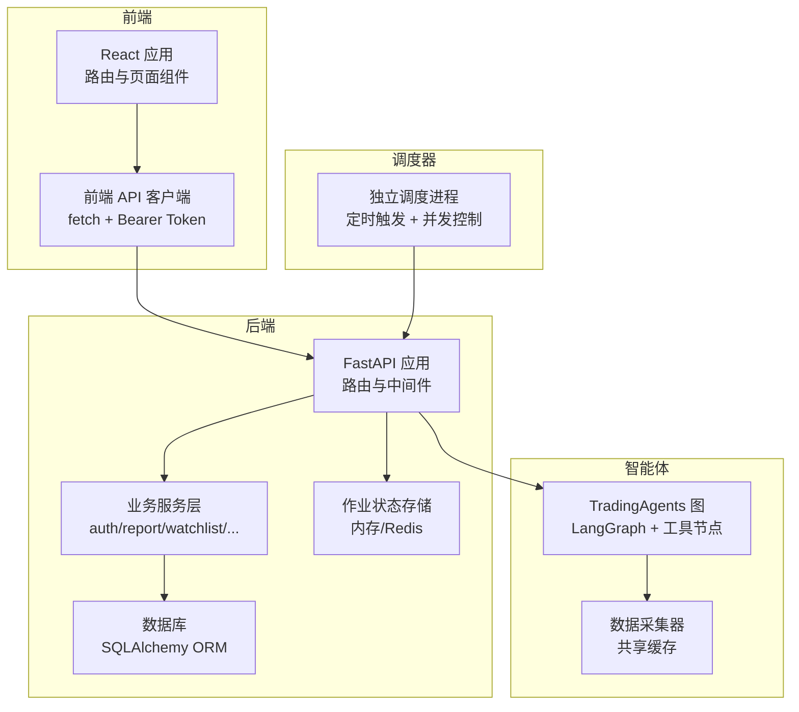
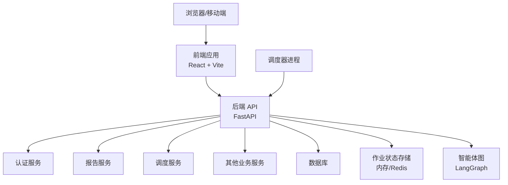
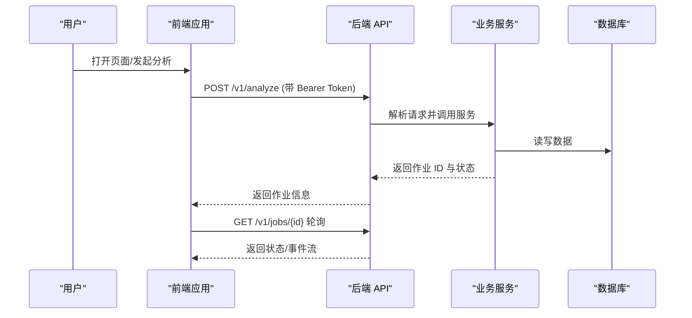
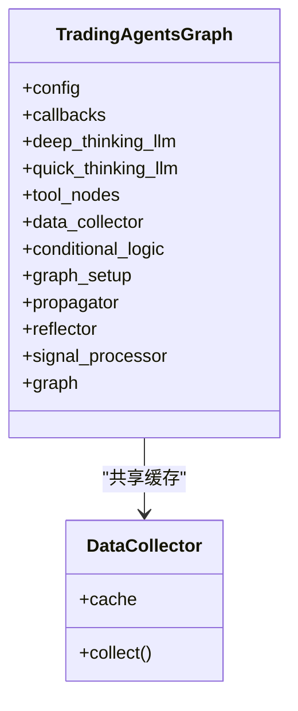
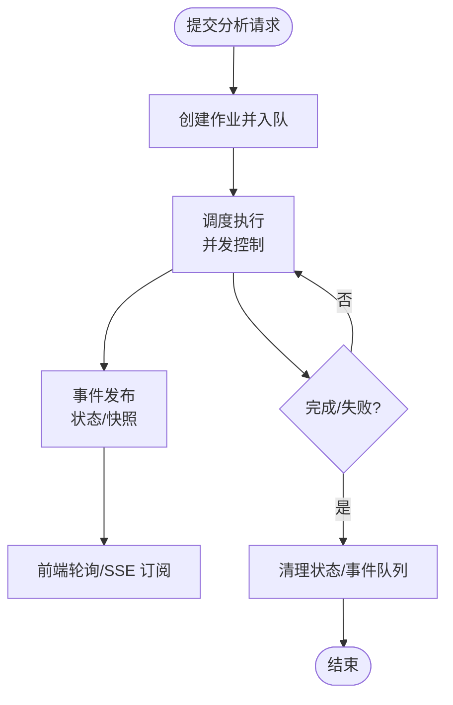
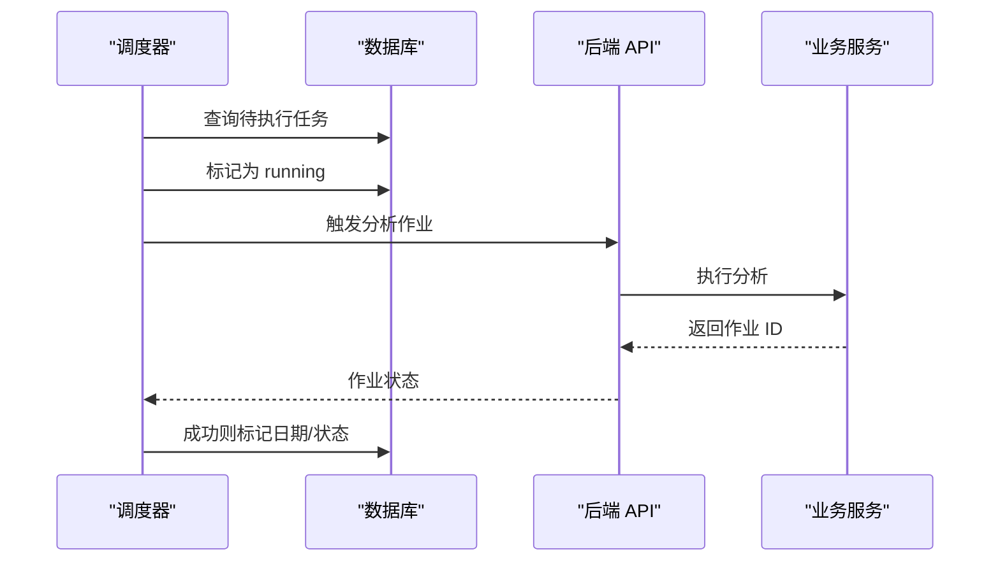
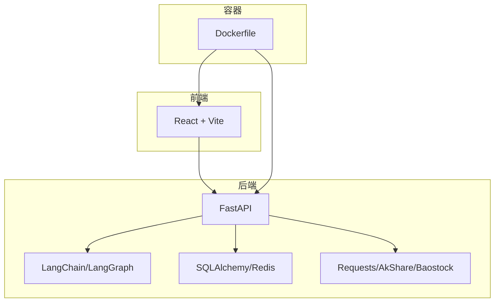

# 系统架构概览

<cite>
**本文引用的文件**   
- [api/main.py](file://api/main.py)
- [frontend/src/App.tsx](file://frontend/src/App.tsx)
- [frontend/src/services/api.ts](file://frontend/src/services/api.ts)
- [scheduler/main.py](file://scheduler/main.py)
- [pyproject.toml](file://pyproject.toml)
- [Dockerfile](file://Dockerfile)
- [frontend/vite.config.ts](file://frontend/vite.config.ts)
- [api/services/__init__.py](file://api/services/__init__.py)
- [tradingagents/graph/trading_graph.py](file://tradingagents/graph/trading_graph.py)
- [api/job_store.py](file://api/job_store.py)
- [tests/test_api_smoke.py](file://tests/test_api_smoke.py)
</cite>

## 目录
1. [引言](#引言)
2. [项目结构](#项目结构)
3. [核心组件](#核心组件)
4. [架构总览](#架构总览)
5. [详细组件分析](#详细组件分析)
6. [依赖分析](#依赖分析)
7. [性能考虑](#性能考虑)
8. [故障排查指南](#故障排查指南)
9. [结论](#结论)
10. [附录](#附录)

## 引言
本文件为 TradingAgents-AShare 提供系统架构概览文档，聚焦于前后端分离架构、微服务理念下的组件划分、FastAPI 后端与 React 前端的交互模式、多智能体系统的集成架构，以及模块化设计（API 层、业务逻辑层、数据访问层）的职责划分。同时给出系统边界、外部依赖与集成点、架构决策的技术考量、性能权衡与扩展性设计，并提供高层架构图与组件关系图。

## 项目结构
项目采用“前后端分离 + 多进程微服务”的组织方式：
- 后端：FastAPI 应用作为统一 API 网关与业务编排中心，负责认证鉴权、任务调度、作业状态管理、报表生成、通知等。
- 前端：React 应用，通过 TypeScript 与后端 API 通信，使用 Vite 进行开发与构建，本地开发通过代理转发到后端。
- 调度器：独立的 Python 进程，负责定时触发分析任务，具备并发控制与失败恢复能力。
- 智能体框架：基于 LangGraph 的多智能体交易分析图，封装数据采集、条件判断、传播、反思与信号处理等模块。
- 数据与存储：SQLAlchemy ORM 访问数据库；作业状态可选内存或 Redis 存储；静态资源由后端挂载提供。

图表来源
- [api/main.py](file://api/main.py)
- [frontend/src/App.tsx](file://frontend/src/App.tsx)
- [frontend/src/services/api.ts](file://frontend/src/services/api.ts)
- [scheduler/main.py](file://scheduler/main.py)
- [tradingagents/graph/trading_graph.py](file://tradingagents/graph/trading_graph.py)
- [api/job_store.py](file://api/job_store.py)

章节来源
- [pyproject.toml](file://pyproject.toml)
- [Dockerfile](file://Dockerfile)
- [frontend/vite.config.ts](file://frontend/vite.config.ts)

## 核心组件
- FastAPI 后端服务
  - 提供统一 API 网关、CORS 支持、JWT 认证、数据库连接、作业状态存储、静态资源挂载与 SPA 回退。
  - 关键职责：接收前端请求、调用业务服务、编排智能体分析、维护作业生命周期、推送通知与报表。
- React 前端应用
  - 使用 React Router 管理页面路由，通过自定义 API 客户端进行 HTTP 通信，本地开发通过 Vite 代理转发到后端。
- 独立调度器
  - 独立进程，按交易日与时间窗口扫描待执行任务，使用信号量控制并发，失败自动记录并支持启动恢复。
- 多智能体分析图
  - 基于 LangGraph 的 TradingAgents 图，包含工具节点、条件逻辑、传播、反思与信号处理，支持共享数据采集缓存。
- 作业状态存储
  - 可选内存或 Redis 实现，支持事件订阅、队列容量限制与 TTL 清理。

章节来源
- [api/main.py](file://api/main.py)
- [frontend/src/App.tsx](file://frontend/src/App.tsx)
- [frontend/src/services/api.ts](file://frontend/src/services/api.ts)
- [scheduler/main.py](file://scheduler/main.py)
- [tradingagents/graph/trading_graph.py](file://tradingagents/graph/trading_graph.py)
- [api/job_store.py](file://api/job_store.py)

## 架构总览
系统采用“单体后端 + 前端 SPA + 独立调度器 + 智能体图”的混合架构：
- 前后端分离：前端通过 REST 接口与后端交互，支持 SSE 事件流用于作业状态更新。
- 微服务理念：后端内部按功能域拆分服务模块，调度器独立部署，便于水平扩展与故障隔离。
- 多智能体集成：后端在运行期编排智能体图，将分析任务分解为多个子任务，通过共享数据采集器提升性能。
- 模块化设计：API 层负责路由与鉴权；业务逻辑层封装领域服务；数据访问层通过 ORM 统一抽象。

图表来源
- [api/main.py](file://api/main.py)
- [frontend/src/services/api.ts](file://frontend/src/services/api.ts)
- [scheduler/main.py](file://scheduler/main.py)
- [tradingagents/graph/trading_graph.py](file://tradingagents/graph/trading_graph.py)

## 详细组件分析

### 前后端交互模式
- 前端路由与页面
  - 使用 React Router 管理页面级路由，登录态校验通过全局守卫实现，未登录自动跳转登录页。
- API 客户端
  - 统一封装 fetch 请求，自动注入 Bearer Token，错误响应统一解析，支持多种业务接口。
- 本地开发代理
  - Vite 代理将 /v1/* 请求转发至后端，简化跨域与联调。
- 后端静态资源与 SPA 回退
  - 后端挂载前端构建产物目录，对未命中路径回退到 index.html，支持前端路由。

图表来源
- [frontend/src/App.tsx](file://frontend/src/App.tsx)
- [frontend/src/services/api.ts](file://frontend/src/services/api.ts)
- [api/main.py](file://api/main.py)

章节来源
- [frontend/src/App.tsx](file://frontend/src/App.tsx)
- [frontend/src/services/api.ts](file://frontend/src/services/api.ts)
- [frontend/vite.config.ts](file://frontend/vite.config.ts)
- [api/main.py](file://api/main.py)

### 多智能体系统集成架构
- 智能体图
  - 以 TradingAgentsGraph 为核心，初始化 LLM 客户端、记忆体、工具节点与各处理模块。
  - 使用共享检查点与数据采集器，支持并发安全与跨周期复用。
- 数据流
  - DataCollector 负责一次性拉取并缓存数据，避免重复 IO；工具节点封装不同数据源的抽象方法。
- 作业编排
  - 后端在运行期根据请求参数构建分析图，异步执行并输出状态事件，前端通过 SSE 实时展示。

图表来源
- [tradingagents/graph/trading_graph.py](file://tradingagents/graph/trading_graph.py)

章节来源
- [tradingagents/graph/trading_graph.py](file://tradingagents/graph/trading_graph.py)

### 作业状态与事件流
- 作业存储
  - 支持内存与 Redis 两种实现，后者需额外模块依赖；提供事件订阅、队列容量限制与 TTL 清理。
- 事件模型
  - 作业状态变更与智能体快照通过事件队列广播，前端可订阅特定作业事件。
- 生命周期
  - 创建、运行、完成/失败、清理；终端状态会触发定时清理任务。

图表来源
- [api/job_store.py](file://api/job_store.py)
- [api/main.py](file://api/main.py)

章节来源
- [api/job_store.py](file://api/job_store.py)
- [tests/test_api_smoke.py](file://tests/test_api_smoke.py)

### 调度器与定时任务
- 触发策略
  - 仅在交易日且非交易时段扫描待执行任务，按 HH:MM 时间阈值触发。
- 并发控制
  - 使用信号量限制同时运行的任务数，避免资源争用。
- 失败与恢复
  - 启动时扫描“运行中”但无对应报告的任务并重置，确保一致性。

图表来源
- [scheduler/main.py](file://scheduler/main.py)
- [api/main.py](file://api/main.py)

章节来源
- [scheduler/main.py](file://scheduler/main.py)

## 依赖分析
- 后端依赖
  - Web 框架：FastAPI、Uvicorn
  - 数据库：SQLAlchemy、Redis（可选）
  - LLM 生态：LangChain、LangGraph、OpenAI/Anthropic/Google 客户端
  - 数据采集：AkShare、Baostock、YFinance
  - 工具库：Pandas、Requests、PyJWT、Cryptography
- 前端依赖
  - React 生态：React Router、Vite
  - 类型与样式：TypeScript、TailwindCSS
- 构建与运行
  - Docker 多阶段构建，先构建前端再安装后端依赖，最终通过 uv 运行 API 服务。

图表来源
- [pyproject.toml](file://pyproject.toml)
- [Dockerfile](file://Dockerfile)

章节来源
- [pyproject.toml](file://pyproject.toml)
- [Dockerfile](file://Dockerfile)

## 性能考虑
- 线程池与并发
  - 后端与调度器均配置默认线程池大小，满足大量同步调用（数据库、网络请求、数据采集）场景。
- 事件与队列
  - 作业事件队列有容量上限，溢出丢弃旧事件，避免内存膨胀；终端状态触发 TTL 清理。
- 缓存与复用
  - 共享数据采集器与股票映射缓存，减少重复 IO 与外部 API 调用。
- SSE 与轮询
  - 前端优先使用 SSE 获取实时事件，降低轮询频率与服务器压力。
- 容器与构建
  - 多阶段构建与缓存优化，缩短构建时间；uv 同步依赖提升安装效率。

## 故障排查指南
- 认证失败
  - 检查 Bearer Token 是否正确注入；确认用户状态与令牌有效性。
- 作业长时间处于 running
  - 查看调度器并发配置与任务队列；确认外部数据源可用性与网络状况。
- SSE 不生效
  - 确认后端 CORS 配置与前端代理设置；检查浏览器网络面板与后端日志。
- 调度器未触发
  - 检查交易日历与时间窗口；确认任务状态标记与数据库事务提交。
- 依赖缺失
  - Docker 构建阶段 Redis 模块缺失时会回退到内存作业存储；按需安装相应依赖。

章节来源
- [api/main.py](file://api/main.py)
- [scheduler/main.py](file://scheduler/main.py)
- [frontend/vite.config.ts](file://frontend/vite.config.ts)

## 结论
本系统以 FastAPI 为核心，结合 React 前端、独立调度器与多智能体分析图，形成高内聚、低耦合的前后端分离架构。通过模块化设计与清晰的职责划分，系统在保证可扩展性的同时兼顾了性能与可靠性。建议在生产环境中启用 Redis 作业存储、完善监控与告警，并持续优化外部数据源的缓存策略与并发参数。

## 附录
- 系统边界
  - 内部：后端 API、调度器、智能体图、数据库与作业存储。
  - 外部：AkShare、Baostock、YFinance、第三方 LLM 供应商、邮件与企业微信通知服务。
- 集成点
  - SSE 事件流、REST API、静态资源挂载、定时任务触发、外部数据源接入。
- 架构决策
  - 选择 LangGraph 作为智能体编排框架，便于可视化与调试；采用独立调度器降低主服务负载；通过作业存储抽象支持多环境部署。