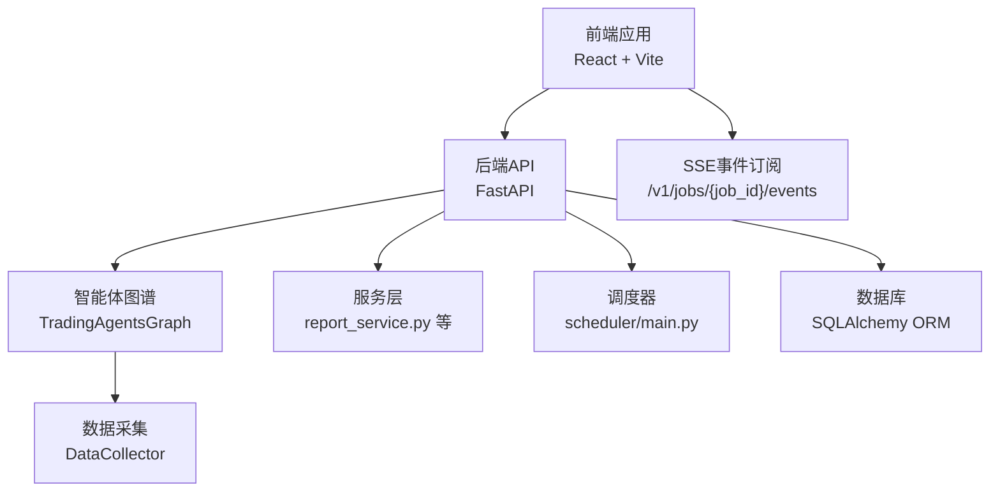
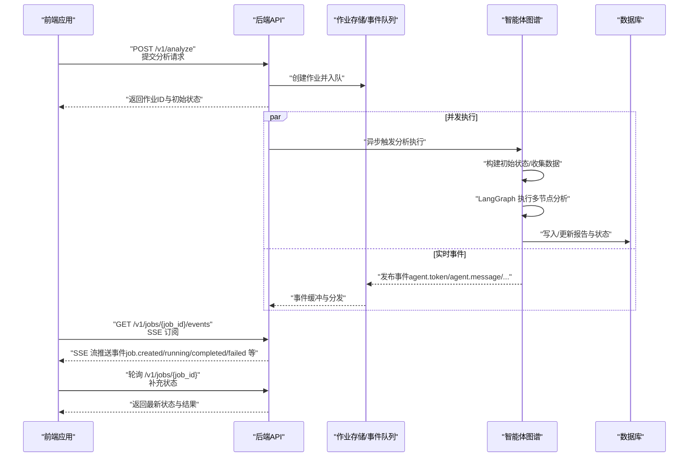
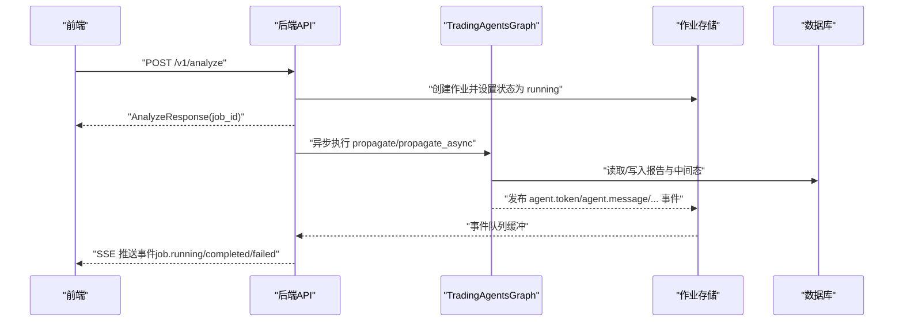
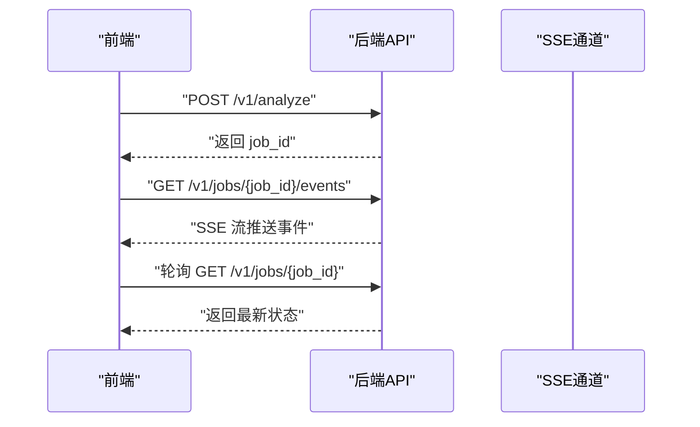
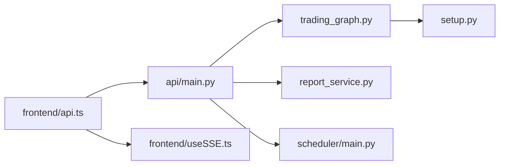
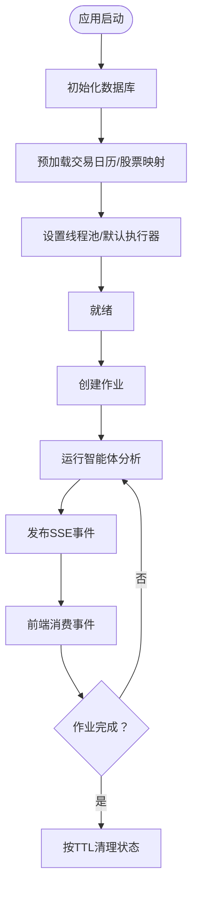
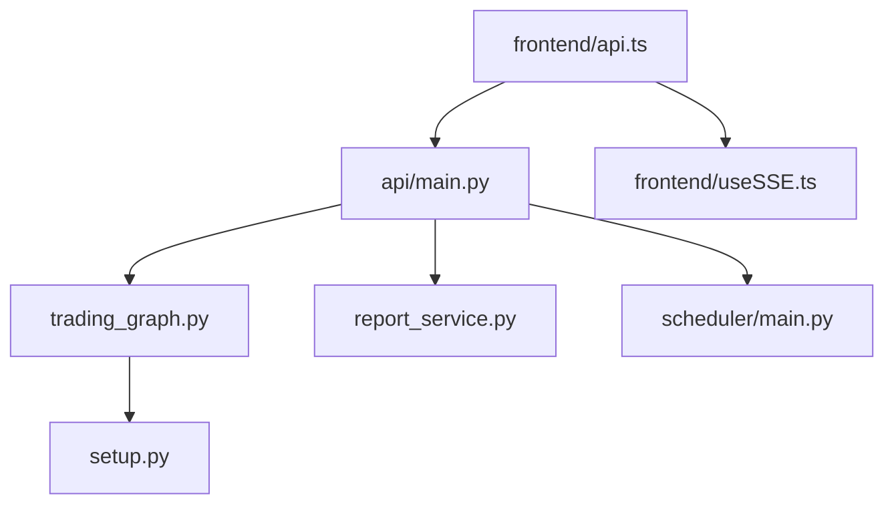

# 组件交互关系

<cite>
**本文引用的文件**
- [api/main.py](file://api/main.py)
- [frontend/src/services/api.ts](file://frontend/src/services/api.ts)
- [frontend/src/hooks/useSSE.ts](file://frontend/src/hooks/useSSE.ts)
- [tradingagents/graph/trading_graph.py](file://tradingagents/graph/trading_graph.py)
- [tradingagents/graph/setup.py](file://tradingagents/graph/setup.py)
- [api/services/report_service.py](file://api/services/report_service.py)
- [scheduler/main.py](file://scheduler/main.py)
- [frontend/src/App.tsx](file://frontend/src/App.tsx)
</cite>

## 目录
1. [简介](#简介)
2. [项目结构](#项目结构)
3. [核心组件](#核心组件)
4. [架构总览](#架构总览)
5. [详细组件分析](#详细组件分析)
6. [依赖关系分析](#依赖关系分析)
7. [性能考量](#性能考量)
8. [故障排查指南](#故障排查指南)
9. [结论](#结论)
10. [附录](#附录)

## 简介
本文件聚焦于 TradingAgents-AShare 的组件交互关系，系统性梳理后端 API 服务与智能体系统之间的调用链路、前端应用与后端的交互协议（HTTP 请求/响应与 Server-Sent Events 实时推送）、组件间依赖与耦合控制、接口设计原则、生命周期管理、资源分配与性能监控机制。文档通过多种可视化图表展示实际代码中的组件关系、时序流程与消息流，帮助读者快速理解系统运行机制。

## 项目结构
系统采用前后端分离架构：
- 后端：FastAPI 应用提供 REST API 与 SSE 事件流，负责作业调度、状态管理、报告生成与数据服务。
- 智能体系统：基于 LangGraph 的交易智能体图谱，封装多分析师、研究员、交易员与风控节点，执行多周期（短期/中期）协同分析。
- 前端：React 应用通过 HTTP API 获取数据与状态，使用 SSE 订阅分析作业的实时事件流，实现所见即所得的分析过程可视化。

**图表来源**
- [api/main.py:2867-2961](file://api/main.py#L2867-L2961)
- [frontend/src/services/api.ts:106-151](file://frontend/src/services/api.ts#L106-L151)
- [frontend/src/hooks/useSSE.ts:288-357](file://frontend/src/hooks/useSSE.ts#L288-L357)
- [tradingagents/graph/trading_graph.py:51-152](file://tradingagents/graph/trading_graph.py#L51-L152)
- [api/services/report_service.py:1-200](file://api/services/report_service.py#L1-L200)
- [scheduler/main.py:302-335](file://scheduler/main.py#L302-L335)

**章节来源**
- [api/main.py:2867-2961](file://api/main.py#L2867-L2961)
- [frontend/src/services/api.ts:106-151](file://frontend/src/services/api.ts#L106-L151)
- [frontend/src/hooks/useSSE.ts:288-357](file://frontend/src/hooks/useSSE.ts#L288-L357)
- [tradingagents/graph/trading_graph.py:51-152](file://tradingagents/graph/trading_graph.py#L51-L152)
- [api/services/report_service.py:1-200](file://api/services/report_service.py#L1-L200)
- [scheduler/main.py:302-335](file://scheduler/main.py#L302-L335)

## 核心组件
- 后端 API（FastAPI）
  - 提供分析启动、作业状态轮询、SSE 实时事件、报告查询、看板与策略扫描等接口。
  - 内部集成智能体图谱执行引擎，统一管理作业生命周期与并发控制。
- 智能体图谱（TradingAgentsGraph）
  - 封装多分析师、研究员、交易员与风控节点，支持双周期（短期/中期）协同分析。
  - 使用工具节点访问市场、新闻、资金流等外部数据源，结合记忆模块进行反思与学习。
- 服务层（report_service.py 等）
  - 负责报告结构化抽取、数据库持久化、配置热更新与运行期预热。
- 调度器（scheduler/main.py）
  - 定时扫描待执行的计划分析任务，触发手动/批量触发流程，维持并发与重试。
- 前端（React）
  - 通过 ApiService 统一发起 HTTP 请求；通过 useSSE 订阅 SSE 事件，实时渲染分析进度与结果。

**章节来源**
- [api/main.py:2867-2961](file://api/main.py#L2867-L2961)
- [tradingagents/graph/trading_graph.py:51-152](file://tradingagents/graph/trading_graph.py#L51-L152)
- [api/services/report_service.py:1-200](file://api/services/report_service.py#L1-L200)
- [scheduler/main.py:302-335](file://scheduler/main.py#L302-L335)
- [frontend/src/services/api.ts:64-104](file://frontend/src/services/api.ts#L64-L104)
- [frontend/src/hooks/useSSE.ts:6-416](file://frontend/src/hooks/useSSE.ts#L6-L416)

## 架构总览
下图展示了从前端到后端、再到智能体系统的端到端交互路径与事件流。

**图表来源**
- [api/main.py:2867-2961](file://api/main.py#L2867-L2961)
- [frontend/src/services/api.ts:106-151](file://frontend/src/services/api.ts#L106-L151)
- [frontend/src/hooks/useSSE.ts:288-357](file://frontend/src/hooks/useSSE.ts#L288-L357)
- [tradingagents/graph/trading_graph.py:297-351](file://tradingagents/graph/trading_graph.py#L297-L351)
- [api/services/report_service.py:1-200](file://api/services/report_service.py#L1-L200)

**章节来源**
- [api/main.py:2867-2961](file://api/main.py#L2867-L2961)
- [frontend/src/services/api.ts:106-151](file://frontend/src/services/api.ts#L106-L151)
- [frontend/src/hooks/useSSE.ts:288-357](file://frontend/src/hooks/useSSE.ts#L288-L357)
- [tradingagents/graph/trading_graph.py:297-351](file://tradingagents/graph/trading_graph.py#L297-L351)
- [api/services/report_service.py:1-200](file://api/services/report_service.py#L1-L200)

## 详细组件分析

### API 服务与智能体系统的调用关系
- 参数传递
  - 前端通过 POST /v1/analyze 发起分析，携带 symbol、trade_date、horizons、query、user_intent、selected_analysts、config_overrides 等字段。
  - 后端解析请求后，构建 AnalyzeRequest，调用内部作业执行函数，传入用户上下文与配置覆盖。
- 返回值处理
  - 初次返回 AnalyzeResponse，包含 job_id 与状态；随后通过 SSE 推送实时事件，最终在 job.completed 时携带完整分析结果与结构化数据。
- 异常传播
  - 作业执行过程中若发生异常，后端记录错误并推送 job.failed 事件；前端据此更新 UI 并提示用户。

**图表来源**
- [api/main.py:2867-2961](file://api/main.py#L2867-L2961)
- [tradingagents/graph/trading_graph.py:297-351](file://tradingagents/graph/trading_graph.py#L297-L351)
- [api/services/report_service.py:1-200](file://api/services/report_service.py#L1-L200)

**章节来源**
- [api/main.py:2867-2961](file://api/main.py#L2867-L2961)
- [tradingagents/graph/trading_graph.py:297-351](file://tradingagents/graph/trading_graph.py#L297-L351)
- [api/services/report_service.py:1-200](file://api/services/report_service.py#L1-L200)

### 前端应用与后端服务的交互协议
- HTTP 请求/响应模式
  - ApiService 统一封装请求，自动注入 Bearer Token，处理非 JSON 响应与空响应，抛出可读错误。
  - 关键接口包括：分析启动、作业状态查询、K线数据、聊天补全、报告 CRUD、看板与策略扫描、配置热更新等。
- WebSocket 连接与实时数据推送
  - 前端通过 useSSE 订阅 /v1/jobs/{job_id}/events，按事件类型（job.created/running/completed/failed、agent.token、agent.message、agent.debate 等）更新 UI。
  - 支持断线重连与心跳 ping，保证长连接稳定性。

**图表来源**
- [frontend/src/services/api.ts:64-104](file://frontend/src/services/api.ts#L64-L104)
- [frontend/src/hooks/useSSE.ts:288-357](file://frontend/src/hooks/useSSE.ts#L288-L357)
- [api/main.py:2961-3000](file://api/main.py#L2961-L3000)

**章节来源**
- [frontend/src/services/api.ts:64-104](file://frontend/src/services/api.ts#L64-L104)
- [frontend/src/hooks/useSSE.ts:288-357](file://frontend/src/hooks/useSSE.ts#L288-L357)
- [api/main.py:2961-3000](file://api/main.py#L2961-L3000)

### 组件间的依赖关系与耦合度控制
- 低耦合设计
  - API 层仅负责路由与作业编排，智能体系统通过抽象工具节点与数据采集器解耦外部数据源。
  - 服务层（如 report_service）专注于报告结构化抽取与数据库操作，避免与前端直接耦合。
- 接口契约
  - 通过 Pydantic 模型定义请求/响应结构，确保前后端契约稳定。
  - SSE 事件类型标准化，前端按事件名分支处理，便于扩展新事件类型。

**图表来源**
- [api/main.py:2867-2961](file://api/main.py#L2867-L2961)
- [tradingagents/graph/trading_graph.py:51-152](file://tradingagents/graph/trading_graph.py#L51-L152)
- [tradingagents/graph/setup.py:57-200](file://tradingagents/graph/setup.py#L57-L200)
- [api/services/report_service.py:1-200](file://api/services/report_service.py#L1-L200)
- [scheduler/main.py:302-335](file://scheduler/main.py#L302-L335)
- [frontend/src/services/api.ts:64-104](file://frontend/src/services/api.ts#L64-L104)
- [frontend/src/hooks/useSSE.ts:6-416](file://frontend/src/hooks/useSSE.ts#L6-L416)

**章节来源**
- [api/main.py:2867-2961](file://api/main.py#L2867-L2961)
- [tradingagents/graph/trading_graph.py:51-152](file://tradingagents/graph/trading_graph.py#L51-L152)
- [tradingagents/graph/setup.py:57-200](file://tradingagents/graph/setup.py#L57-L200)
- [api/services/report_service.py:1-200](file://api/services/report_service.py#L1-L200)
- [scheduler/main.py:302-335](file://scheduler/main.py#L302-L335)
- [frontend/src/services/api.ts:64-104](file://frontend/src/services/api.ts#L64-L104)
- [frontend/src/hooks/useSSE.ts:6-416](file://frontend/src/hooks/useSSE.ts#L6-L416)

### 接口设计原则
- 明确职责边界：API 负责作业编排与事件分发，智能体系统专注分析逻辑，服务层专注数据处理。
- 数据一致性：通过作业状态机与检查点（checkpointer）保障状态持久化与可恢复。
- 可观测性：SSE 事件覆盖分析全流程，前端可实时感知 agent 状态、里程碑与对话片段。
- 安全性：鉴权采用 Bearer Token，CORS 白名单可控，敏感配置覆盖受白名单限制。

**章节来源**
- [api/main.py:2867-2961](file://api/main.py#L2867-L2961)
- [frontend/src/services/api.ts:64-104](file://frontend/src/services/api.ts#L64-L104)
- [frontend/src/hooks/useSSE.ts:6-416](file://frontend/src/hooks/useSSE.ts#L6-L416)
- [tradingagents/graph/trading_graph.py:51-152](file://tradingagents/graph/trading_graph.py#L51-L152)

### 组件生命周期管理、资源分配与性能监控
- 生命周期
  - FastAPI lifespan 在启动时初始化数据库、预加载交易日历与股票映射、设置线程池与默认执行器，关闭时清理资源。
  - 作业生命周期：创建（pending）→ 运行（running）→ 完成（completed/failed），完成后按 TTL 清理。
- 资源分配
  - AnyIO 线程限制与 asyncio 默认执行器可根据环境变量动态调整，避免高并发阻塞。
  - 作业存储采用有界队列，满载时丢弃最旧事件，防止内存膨胀。
- 性能监控
  - SSE 事件包含里程碑与 token 流，前端可统计分析耗时与吞吐。
  - 日志与版本上报（匿名）用于运行期健康监控。

**图表来源**
- [api/main.py:216-279](file://api/main.py#L216-L279)
- [api/main.py:2961-3000](file://api/main.py#L2961-L3000)
- [frontend/src/hooks/useSSE.ts:288-357](file://frontend/src/hooks/useSSE.ts#L288-L357)

**章节来源**
- [api/main.py:216-279](file://api/main.py#L216-L279)
- [api/main.py:2961-3000](file://api/main.py#L2961-L3000)
- [frontend/src/hooks/useSSE.ts:288-357](file://frontend/src/hooks/useSSE.ts#L288-L357)

## 依赖关系分析
- 后端 API 依赖智能体图谱与服务层，同时通过作业存储与 SSE 事件系统与前端交互。
- 智能体图谱依赖工具节点与数据采集器，通过条件逻辑与信号处理模块组织分析流程。
- 前端通过 ApiService 与 useSSE 与后端解耦，事件驱动 UI 更新。

**图表来源**
- [api/main.py:2867-2961](file://api/main.py#L2867-L2961)
- [tradingagents/graph/trading_graph.py:51-152](file://tradingagents/graph/trading_graph.py#L51-L152)
- [tradingagents/graph/setup.py:57-200](file://tradingagents/graph/setup.py#L57-L200)
- [api/services/report_service.py:1-200](file://api/services/report_service.py#L1-L200)
- [scheduler/main.py:302-335](file://scheduler/main.py#L302-L335)
- [frontend/src/services/api.ts:64-104](file://frontend/src/services/api.ts#L64-L104)
- [frontend/src/hooks/useSSE.ts:6-416](file://frontend/src/hooks/useSSE.ts#L6-L416)

**章节来源**
- [api/main.py:2867-2961](file://api/main.py#L2867-L2961)
- [tradingagents/graph/trading_graph.py:51-152](file://tradingagents/graph/trading_graph.py#L51-L152)
- [tradingagents/graph/setup.py:57-200](file://tradingagents/graph/setup.py#L57-L200)
- [api/services/report_service.py:1-200](file://api/services/report_service.py#L1-L200)
- [scheduler/main.py:302-335](file://scheduler/main.py#L302-L335)
- [frontend/src/services/api.ts:64-104](file://frontend/src/services/api.ts#L64-L104)
- [frontend/src/hooks/useSSE.ts:6-416](file://frontend/src/hooks/useSSE.ts#L6-L416)

## 性能考量
- 并发与线程池
  - 通过 AnyIO 线程限制与 asyncio 默认执行器扩大并发能力，避免同步端点相互饿死。
- 缓存与预热
  - 交易日历与股票映射在启动时预加载并缓存，减少运行期冷启动开销。
- 事件队列限流
  - 作业事件队列有界，满载丢弃最旧事件，保障系统稳定性。
- SSE 断线重连
  - 前端实现指数退避与心跳 ping，提升长连接可靠性。

**章节来源**
- [api/main.py:216-279](file://api/main.py#L216-L279)
- [api/main.py:387-440](file://api/main.py#L387-L440)
- [frontend/src/hooks/useSSE.ts:329-357](file://frontend/src/hooks/useSSE.ts#L329-L357)

## 故障排查指南
- 常见问题定位
  - SSE 连接失败：检查鉴权头、网络与断线重连逻辑；关注前端日志与事件类型。
  - 作业长时间 pending/卡住：检查线程池配置、外部数据源可用性与代理设置。
  - 报告结构化抽取失败：查看 LLM 输出修复日志与正则回退路径。
- 关键日志与事件
  - job.created/job.running/job.completed/job.failed：作业生命周期事件。
  - agent.status/agent.token/agent.message/agent.debate：分析过程事件。
- 调试建议
  - 前端：开启调试模式，观察 useSSE 事件分发与状态更新。
  - 后端：启用更高等级日志，定位作业执行与事件投递瓶颈。

**章节来源**
- [frontend/src/hooks/useSSE.ts:329-357](file://frontend/src/hooks/useSSE.ts#L329-L357)
- [api/services/report_service.py:97-144](file://api/services/report_service.py#L97-L144)
- [api/main.py:2961-3000](file://api/main.py#L2961-L3000)

## 结论
本系统通过清晰的职责划分与事件驱动架构，实现了从前端到后端再到智能体系统的高效协作。API 服务承担编排与可观测性职责，智能体系统专注于多源数据分析与决策合成，服务层与调度器分别负责数据处理与任务编排。SSE 实时事件与严格的生命周期管理，确保了用户体验与系统稳定性。建议在生产环境中进一步完善监控埋点与告警策略，持续优化并发与缓存策略以应对更高负载。

## 附录
- 关键端点与事件
  - POST /v1/analyze：启动分析
  - GET /v1/jobs/{job_id}：查询作业状态
  - GET /v1/jobs/{job_id}/events：SSE 实时事件
  - 事件类型：job.created/running/completed/failed、agent.status/token/message/debate 等
- 前端路由与鉴权
  - App.tsx 中的路由守卫与在线跳转逻辑，配合 ApiService 统一请求封装。

**章节来源**
- [api/main.py:2867-2961](file://api/main.py#L2867-L2961)
- [frontend/src/App.tsx:27-43](file://frontend/src/App.tsx#L27-L43)
- [frontend/src/services/api.ts:64-104](file://frontend/src/services/api.ts#L64-L104)
- [frontend/src/hooks/useSSE.ts:6-416](file://frontend/src/hooks/useSSE.ts#L6-L416)