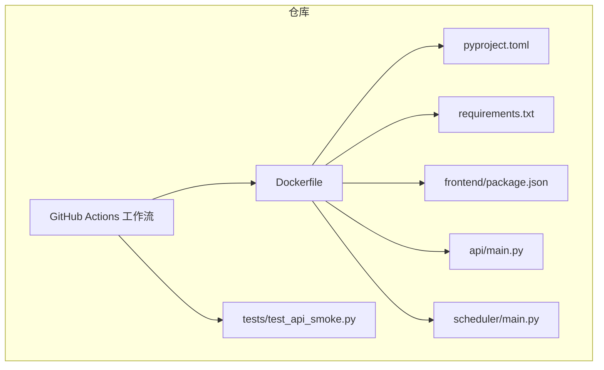
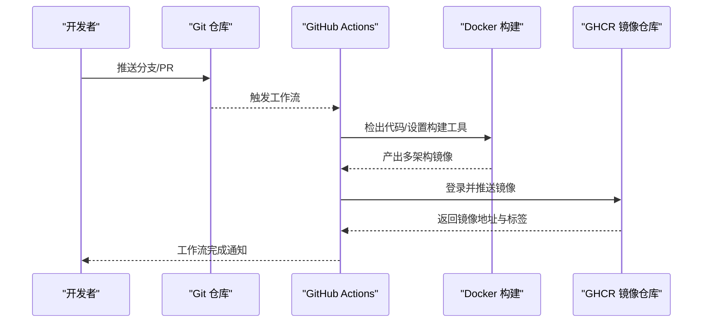
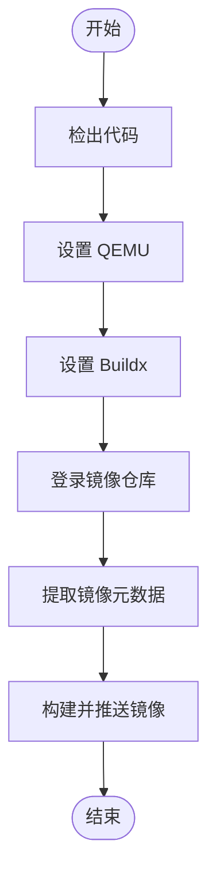
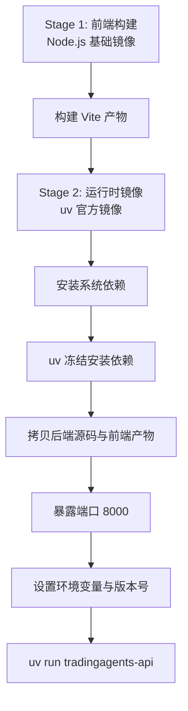
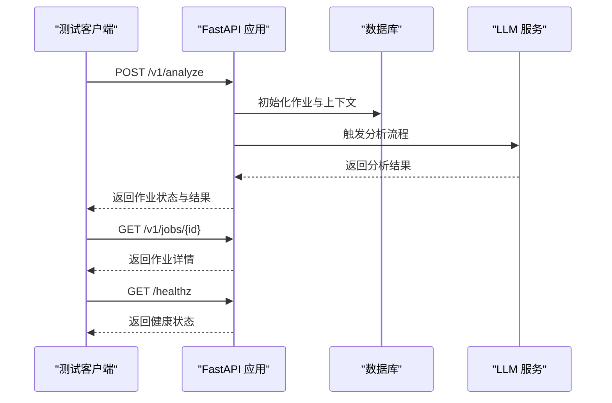
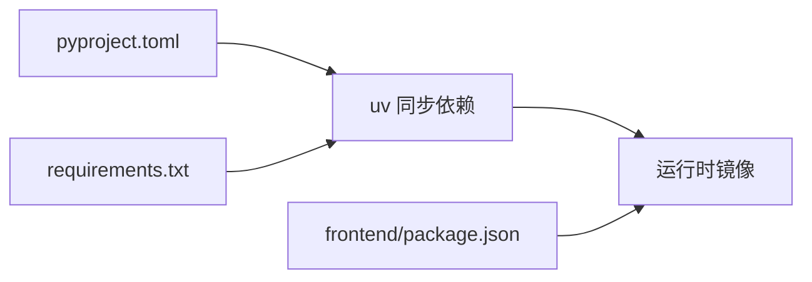

# CI/CD流水线

<cite>
**本文引用的文件**   
- [.github/workflows/ci-checks.yml](file://.github/workflows/ci-checks.yml)
- [.github/workflows/docker-publish.yml](file://.github/workflows/docker-publish.yml)
- [Dockerfile](file://Dockerfile)
- [pyproject.toml](file://pyproject.toml)
- [requirements.txt](file://requirements.txt)
- [.github/dependabot.yml](file://.github/dependabot.yml)
- [api/main.py](file://api/main.py)
- [scheduler/main.py](file://scheduler/main.py)
- [tests/test_api_smoke.py](file://tests/test_api_smoke.py)
- [frontend/package.json](file://frontend/package.json)
</cite>

## 目录
1. [简介](#简介)
2. [项目结构](#项目结构)
3. [核心组件](#核心组件)
4. [架构总览](#架构总览)
5. [详细组件分析](#详细组件分析)
6. [依赖分析](#依赖分析)
7. [性能考虑](#性能考虑)
8. [故障排查指南](#故障排查指南)
9. [结论](#结论)
10. [附录](#附录)

## 简介
本文件为 TradingAgents-AShare 项目的 CI/CD 流水线文档，聚焦于以下方面：
- GitHub Actions 工作流配置与执行策略
- 代码质量检查、单元测试、集成测试与端到端测试流程
- 自动化构建、打包与镜像推送流程
- 版本管理、标签策略与发布分支管理
- 代码覆盖率报告、安全扫描与依赖漏洞检查
- 手动触发部署、回滚策略与蓝绿部署配置建议
- 环境变量管理、密钥轮换与凭据安全存储
- 部署验证、健康检查与服务可用性测试

## 项目结构
本项目采用多阶段 Docker 构建，后端使用 uv 进行依赖同步，前端通过 Vite 构建并注入到最终镜像中。GitHub Actions 使用两个工作流：
- 代码质量检查与测试工作流（当前处于占位禁用状态）
- Docker 镜像构建与推送工作流（基于语义化版本标签）

**图示来源**
- [.github/workflows/docker-publish.yml:1-66](file://.github/workflows/docker-publish.yml#L1-L66)
- [Dockerfile:1-51](file://Dockerfile#L1-L51)
- [pyproject.toml:1-52](file://pyproject.toml#L1-L52)
- [requirements.txt:1-24](file://requirements.txt#L1-L24)
- [frontend/package.json:1-47](file://frontend/package.json#L1-L47)
- [api/main.py:1-4772](file://api/main.py#L1-L4772)
- [scheduler/main.py:1-447](file://scheduler/main.py#L1-L447)
- [tests/test_api_smoke.py:1-823](file://tests/test_api_smoke.py#L1-L823)

**章节来源**
- [.github/workflows/ci-checks.yml:1-18](file://.github/workflows/ci-checks.yml#L1-L18)
- [.github/workflows/docker-publish.yml:1-66](file://.github/workflows/docker-publish.yml#L1-L66)
- [Dockerfile:1-51](file://Dockerfile#L1-L51)
- [pyproject.toml:1-52](file://pyproject.toml#L1-L52)
- [requirements.txt:1-24](file://requirements.txt#L1-L24)
- [frontend/package.json:1-47](file://frontend/package.json#L1-L47)
- [api/main.py:1-4772](file://api/main.py#L1-L4772)
- [scheduler/main.py:1-447](file://scheduler/main.py#L1-L447)
- [tests/test_api_smoke.py:1-823](file://tests/test_api_smoke.py#L1-L823)

## 核心组件
- GitHub Actions 工作流
  - 代码质量检查与测试工作流：当前为占位禁用状态，便于后续启用。
  - Docker 发布工作流：基于推送语义化版本标签触发，支持多架构镜像构建与推送至 GHCR。
- Docker 镜像构建
  - 前端构建阶段：使用 Node.js 基础镜像，启用 npm 缓存与原生平台加速。
  - 运行时阶段：使用 uv 提升依赖安装速度，拷贝后端源码与前端产物，暴露 8000 端口，注入版本号与环境变量。
- 依赖管理
  - 后端依赖通过 pyproject.toml 与 requirements.txt 维护，Docker 构建阶段使用 uv 进行冻结安装。
  - 前端依赖通过 package.json 管理，Vite 构建产物注入镜像。
- 测试与验证
  - 单元与集成测试：通过 FastAPI TestClient 进行端到端冒烟测试，覆盖分析、聊天、配置、监控等关键路径。
  - 健康检查：应用内提供 /healthz 接口，可用于容器健康探针。

**章节来源**
- [.github/workflows/ci-checks.yml:1-18](file://.github/workflows/ci-checks.yml#L1-L18)
- [.github/workflows/docker-publish.yml:1-66](file://.github/workflows/docker-publish.yml#L1-L66)
- [Dockerfile:1-51](file://Dockerfile#L1-L51)
- [pyproject.toml:1-52](file://pyproject.toml#L1-L52)
- [requirements.txt:1-24](file://requirements.txt#L1-L24)
- [tests/test_api_smoke.py:1-823](file://tests/test_api_smoke.py#L1-L823)
- [api/main.py:313-318](file://api/main.py#L313-L318)

## 架构总览
下图展示从代码提交到镜像发布的整体流程，以及关键的触发条件与产物。

**图示来源**
- [.github/workflows/docker-publish.yml:1-66](file://.github/workflows/docker-publish.yml#L1-L66)
- [Dockerfile:1-51](file://Dockerfile#L1-L51)

## 详细组件分析

### GitHub Actions 工作流：代码质量检查与测试
- 当前状态：占位禁用，仅输出跳过信息。
- 建议启用步骤：
  - 添加 Node.js 与 Python 环境设置
  - 安装前端依赖与后端依赖
  - 运行 ESLint、类型检查与 pytest
  - 收集覆盖率报告（如使用 pytest-cov）
  - 配置安全扫描（如 trivy-action 或 codeql）
- 触发条件：对 main 分支的 PR 与推送保持一致。

**章节来源**
- [.github/workflows/ci-checks.yml:1-18](file://.github/workflows/ci-checks.yml#L1-L18)

### GitHub Actions 工作流：Docker 构建与发布
- 触发方式：
  - 推送语义化版本标签（如 v0.1.0）
  - 手动触发（workflow_dispatch）
- 关键步骤：
  - 检出代码
  - 设置 QEMU 与 Buildx（支持多架构）
  - 登录 GHCR（使用 GITHUB_TOKEN）
  - 提取镜像元数据（分支、语义化版本、SHA、latest）
  - 构建并推送镜像（启用缓存）
- 环境变量：
  - REGISTRY、IMAGE_NAME、FORCE_JAVASCRIPT_ACTIONS_TO_NODE24
- 多架构支持：linux/amd64, linux/arm64

**图示来源**
- [.github/workflows/docker-publish.yml:1-66](file://.github/workflows/docker-publish.yml#L1-L66)

**章节来源**
- [.github/workflows/docker-publish.yml:1-66](file://.github/workflows/docker-publish.yml#L1-L66)

### Docker 镜像构建与运行时
- 多阶段构建：
  - 前端构建阶段：使用 Node.js 基础镜像，启用 npm 缓存，构建 Vite 产物。
  - 运行时阶段：基于 uv 官方镜像，安装系统依赖，使用 uv 冻结安装第三方依赖与项目代码，拷贝前端产物，暴露 8000 端口。
- 版本注入：通过 --build-arg VERSION 注入版本号，默认 dev。
- 环境变量：
  - PYTHONUNBUFFERED、PYTHONPATH、TA_JOB_TIMEOUT
  - APP_VERSION 由环境变量或包元数据决定
- 启动命令：uv run --no-sync tradingagents-api

**图示来源**
- [Dockerfile:1-51](file://Dockerfile#L1-L51)

**章节来源**
- [Dockerfile:1-51](file://Dockerfile#L1-L51)
- [pyproject.toml:1-52](file://pyproject.toml#L1-L52)
- [requirements.txt:1-24](file://requirements.txt#L1-L24)
- [frontend/package.json:1-47](file://frontend/package.json#L1-L47)

### 测试与验证
- 测试范围：
  - FastAPI 端点冒烟测试：覆盖 /v1/analyze、/v1/chat/completions、/v1/jobs/{id} 等关键接口。
  - 配置热身与校验：PATCH /v1/config、/v1/config/warmup、/v1/config/wecom/warmup。
  - 监控与健康：/healthz。
- 建议扩展：
  - 引入 pytest-cov 生成覆盖率报告
  - 增加集成测试与端到端测试（如 Playwright）
  - 加入安全扫描（trivy-action、codeql-action）

**图示来源**
- [tests/test_api_smoke.py:1-823](file://tests/test_api_smoke.py#L1-L823)
- [api/main.py:313-318](file://api/main.py#L313-L318)

**章节来源**
- [tests/test_api_smoke.py:1-823](file://tests/test_api_smoke.py#L1-L823)
- [api/main.py:313-318](file://api/main.py#L313-L318)

### 依赖与漏洞管理
- 依赖更新策略：Dependabot 配置按生态自动发起 PR，标签与提交前缀规范化。
- 建议增强：
  - 在 CI 中加入 trivy-action 扫描镜像漏洞
  - 对 pip 与 npm 依赖进行定期扫描与升级

**章节来源**
- [.github/dependabot.yml:1-63](file://.github/dependabot.yml#L1-L63)

## 依赖分析
- 语言与框架
  - 后端：FastAPI、Uvicorn、SQLAlchemy、Redis、LangChain/Graph 系列
  - 前端：React、Vite、TailwindCSS、TypeScript
- 依赖来源
  - 后端：pyproject.toml 与 requirements.txt
  - 前端：frontend/package.json
- Docker 依赖安装
  - uv 用于加速依赖同步，支持冻结安装与缓存

**图示来源**
- [pyproject.toml:1-52](file://pyproject.toml#L1-L52)
- [requirements.txt:1-24](file://requirements.txt#L1-L24)
- [Dockerfile:19-32](file://Dockerfile#L19-L32)
- [frontend/package.json:1-47](file://frontend/package.json#L1-L47)

**章节来源**
- [pyproject.toml:1-52](file://pyproject.toml#L1-L52)
- [requirements.txt:1-24](file://requirements.txt#L1-L24)
- [Dockerfile:19-32](file://Dockerfile#L19-L32)
- [frontend/package.json:1-47](file://frontend/package.json#L1-L47)

## 性能考虑
- 前端构建优化：Node 阶段启用 npm 缓存，原生平台构建提升速度。
- 依赖安装优化：运行时阶段使用 uv 冻结安装，结合 Docker 层缓存减少重复安装。
- 并发控制：调度器通过 asyncio.Semaphore 控制并发，避免资源争用。
- 线程池调优：根据任务负载调整 AnyIO 线程限制与默认 asyncio 执行器大小。

**章节来源**
- [Dockerfile:5-8](file://Dockerfile#L5-L8)
- [Dockerfile:21-32](file://Dockerfile#L21-L32)
- [scheduler/main.py:42-44](file://scheduler/main.py#L42-L44)
- [scheduler/main.py:390-403](file://scheduler/main.py#L390-L403)

## 故障排查指南
- 镜像构建失败
  - 检查 Dockerfile 多阶段构建顺序与缓存层
  - 确认 uv 锁文件与依赖版本一致性
- 依赖安装超时
  - 校验网络与镜像源配置
  - 清理 Docker 缓存后重试
- 测试失败
  - 查看测试日志与断言失败点
  - 使用本地 FastAPI TestClient 复现问题
- 健康检查异常
  - 访问 /healthz 确认服务可用性
  - 检查容器日志与端口映射

**章节来源**
- [Dockerfile:1-51](file://Dockerfile#L1-L51)
- [tests/test_api_smoke.py:1-823](file://tests/test_api_smoke.py#L1-L823)
- [api/main.py:313-318](file://api/main.py#L313-L318)

## 结论
本项目的 CI/CD 流水线以 Docker 多阶段构建为核心，结合 GitHub Actions 实现了从代码到镜像的自动化交付。当前测试工作流处于占位状态，建议尽快启用并完善测试矩阵、覆盖率与安全扫描。版本管理与标签策略清晰，配合 Dependabot 可持续降低依赖风险。后续可在现有基础上引入更丰富的测试与安全能力，进一步提升交付质量与安全性。

## 附录
- 环境变量与密钥
  - 应用级：APP_VERSION、TA_APP_SECRET_KEY、TA_JOB_TIMEOUT、LOG_LEVEL、CORS_ALLOW_ORIGINS、CORS_ALLOW_ORIGIN_REGEX、ASYNCIO_DEFAULT_EXECUTOR_WORKERS、ANYIO_THREAD_LIMIT
  - 容器运行：PYTHONUNBUFFERED、PYTHONPATH、APP_VERSION
  - 建议：生产环境必须设置 TA_APP_SECRET_KEY，避免使用默认密钥
- 手动触发与回滚
  - 手动触发：使用 workflow_dispatch 在 GH 页面触发 Docker 发布工作流
  - 回滚策略：基于语义化版本标签，可回退到上一个稳定版本标签
- 蓝绿部署配置建议
  - 使用多标签策略（如 latest、版本标签）与滚动更新
  - 配合就绪/存活探针与健康检查端点实现平滑切换

**章节来源**
- [api/main.py:257-264](file://api/main.py#L257-L264)
- [api/main.py:281-296](file://api/main.py#L281-L296)
- [Dockerfile:40-47](file://Dockerfile#L40-L47)
- [.github/workflows/docker-publish.yml:42-47](file://.github/workflows/docker-publish.yml#L42-L47)