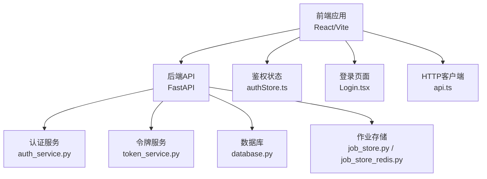
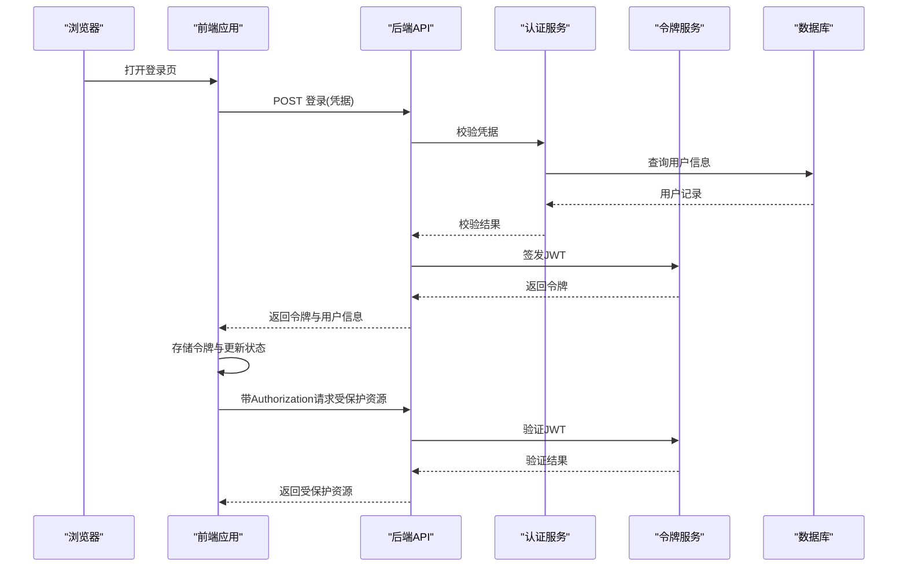
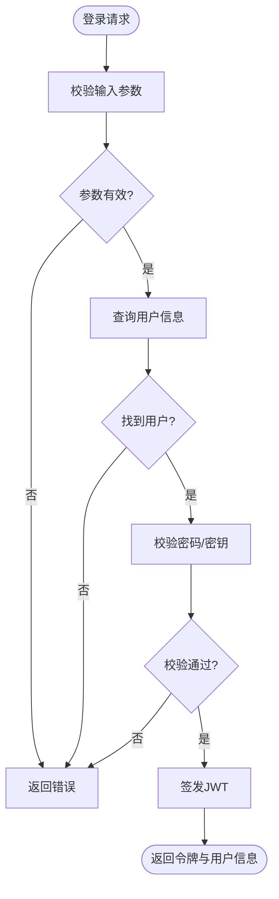
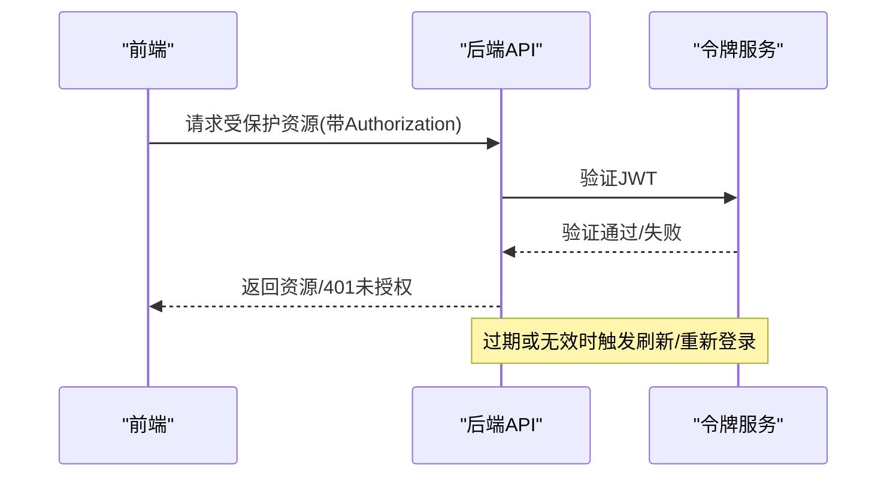
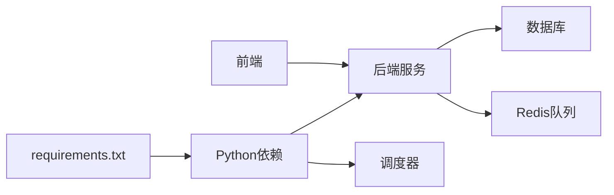

# 安全与维护

<cite>
**本文引用的文件**
- [api/main.py](file://api/main.py)
- [api/services/auth_service.py](file://api/services/auth_service.py)
- [api/services/token_service.py](file://api/services/token_service.py)
- [api/database.py](file://api/database.py)
- [api/job_store.py](file://api/job_store.py)
- [api/job_store_redis.py](file://api/job_store_redis.py)
- [frontend/src/pages/Login.tsx](file://frontend/src/pages/Login.tsx)
- [frontend/src/stores/authStore.ts](file://frontend/src/stores/authStore.ts)
- [frontend/src/services/api.ts](file://frontend/src/services/api.ts)
- [Dockerfile](file://Dockerfile)
- [requirements.txt](file://requirements.txt)
- [.github/workflows](file://.github/workflows)
- [api/logging_config.yaml](file://api/logging_config.yaml)
- [tests](file://tests)
</cite>

## 目录
1. [引言](#引言)
2. [项目结构](#项目结构)
3. [核心组件](#核心组件)
4. [架构总览](#架构总览)
5. [详细组件分析](#详细组件分析)
6. [依赖分析](#依赖分析)
7. [性能考虑](#性能考虑)
8. [故障排查指南](#故障排查指南)
9. [结论](#结论)
10. [附录](#附录)

## 引言
本文件面向 TradingAgents-AShare 的安全与运维团队，聚焦于身份认证与授权、JWT 令牌管理与会话安全、数据与传输安全、API 防护与防攻击、漏洞扫描与合规检查、日常维护与灾难恢复、安全事件响应与应急处置等主题。文档基于仓库中现有实现与配置进行梳理，并提供可操作的最佳实践建议。

## 项目结构
项目采用前后端分离架构：后端通过 FastAPI 提供 REST API；前端使用 React/Vite 构建；调度器独立运行；交易分析能力以技能脚本形式组织；测试覆盖业务关键路径。安全相关的关键位置包括：
- 后端入口与服务层：api/main.py、api/services/*
- 前端登录与鉴权状态：frontend/src/pages/Login.tsx、frontend/src/stores/authStore.ts、frontend/src/services/api.ts
- 数据库与作业队列：api/database.py、api/job_store.py、api/job_store_redis.py
- 日志与容器化：api/logging_config.yaml、Dockerfile
- 持续集成与依赖：.github/workflows、requirements.txt

**图表来源**
- [api/main.py](file://api/main.py)
- [api/services/auth_service.py](file://api/services/auth_service.py)
- [api/services/token_service.py](file://api/services/token_service.py)
- [api/database.py](file://api/database.py)
- [api/job_store.py](file://api/job_store.py)
- [api/job_store_redis.py](file://api/job_store_redis.py)
- [frontend/src/pages/Login.tsx](file://frontend/src/pages/Login.tsx)
- [frontend/src/stores/authStore.ts](file://frontend/src/stores/authStore.ts)
- [frontend/src/services/api.ts](file://frontend/src/services/api.ts)

**章节来源**
- [api/main.py](file://api/main.py)
- [frontend/src/pages/Login.tsx](file://frontend/src/pages/Login.tsx)
- [frontend/src/stores/authStore.ts](file://frontend/src/stores/authStore.ts)
- [frontend/src/services/api.ts](file://frontend/src/services/api.ts)
- [api/services/auth_service.py](file://api/services/auth_service.py)
- [api/services/token_service.py](file://api/services/token_service.py)
- [api/database.py](file://api/database.py)
- [api/job_store.py](file://api/job_store.py)
- [api/job_store_redis.py](file://api/job_store_redis.py)
- [Dockerfile](file://Dockerfile)
- [requirements.txt](file://requirements.txt)

## 核心组件
- 认证与授权服务：负责用户凭据校验、角色判定与访问控制（后端服务模块）。
- JWT 令牌管理：生成、验证与刷新令牌，确保会话安全与无状态会话。
- 数据与作业存储：数据库连接与作业队列持久化，保障数据一致性与可恢复性。
- 前端鉴权状态：集中管理登录态、令牌与请求头注入。
- 日志与容器化：统一日志格式与运行环境隔离，便于审计与问题定位。

**章节来源**
- [api/services/auth_service.py](file://api/services/auth_service.py)
- [api/services/token_service.py](file://api/services/token_service.py)
- [api/database.py](file://api/database.py)
- [api/job_store.py](file://api/job_store.py)
- [api/job_store_redis.py](file://api/job_store_redis.py)
- [frontend/src/stores/authStore.ts](file://frontend/src/stores/authStore.ts)
- [frontend/src/services/api.ts](file://frontend/src/services/api.ts)

## 架构总览
下图展示从浏览器到后端 API 的典型认证与授权流程，以及令牌在前端与后端之间的流转。

**图表来源**
- [frontend/src/pages/Login.tsx](file://frontend/src/pages/Login.tsx)
- [frontend/src/stores/authStore.ts](file://frontend/src/stores/authStore.ts)
- [frontend/src/services/api.ts](file://frontend/src/services/api.ts)
- [api/main.py](file://api/main.py)
- [api/services/auth_service.py](file://api/services/auth_service.py)
- [api/services/token_service.py](file://api/services/token_service.py)
- [api/database.py](file://api/database.py)

## 详细组件分析

### 身份认证与授权机制
- 后端认证服务：负责接收登录请求、校验用户凭据、查询用户角色与权限，并返回授权结果。
- 前端登录页面与状态管理：登录成功后写入令牌与用户信息，后续请求自动附加认证头。
- 授权策略：建议结合用户角色与资源访问控制（RBAC），在路由或中间件层实施细粒度授权。

**图表来源**
- [api/services/auth_service.py](file://api/services/auth_service.py)
- [api/services/token_service.py](file://api/services/token_service.py)
- [frontend/src/pages/Login.tsx](file://frontend/src/pages/Login.tsx)
- [frontend/src/stores/authStore.ts](file://frontend/src/stores/authStore.ts)

**章节来源**
- [api/services/auth_service.py](file://api/services/auth_service.py)
- [frontend/src/pages/Login.tsx](file://frontend/src/pages/Login.tsx)
- [frontend/src/stores/authStore.ts](file://frontend/src/stores/authStore.ts)

### JWT 令牌管理与会话安全
- 令牌签发：后端根据用户信息生成 JWT，设置合理过期时间与签名算法。
- 令牌验证：请求到达时对 Authorization 头中的 Bearer 令牌进行解析与验证。
- 刷新与吊销：建议实现刷新令牌与黑名单机制，支持登出与强制失效。
- 传输安全：所有令牌必须通过 HTTPS 传输，避免明文泄露。
- 存储安全：前端仅在内存中保存令牌，避免写入本地存储；必要时启用 HttpOnly/Cross-Site Cookie 属性（若采用 Cookie 方式）。

**图表来源**
- [frontend/src/services/api.ts](file://frontend/src/services/api.ts)
- [api/services/token_service.py](file://api/services/token_service.py)
- [api/main.py](file://api/main.py)

**章节来源**
- [api/services/token_service.py](file://api/services/token_service.py)
- [frontend/src/services/api.ts](file://frontend/src/services/api.ts)

### 数据加密、传输安全与存储安全
- 传输安全：启用 HTTPS，强制重定向至安全协议；配置 TLS 版本与密码套件；使用 HSTS。
- 存储安全：数据库连接使用加密通道；敏感字段（如密码哈希）采用强哈希算法；密钥与证书妥善保管。
- 前端安全：避免在前端硬编码密钥；使用环境变量注入；最小权限原则配置 API 密钥。
- 容器化安全：基础镜像定期更新；非 root 用户运行；最小化依赖；只暴露必要端口。

**章节来源**
- [Dockerfile](file://Dockerfile)
- [api/database.py](file://api/database.py)
- [requirements.txt](file://requirements.txt)

### API 安全防护、速率限制与防攻击
- CORS 与安全头：严格配置允许来源，启用 X-Content-Type-Options、X-Frame-Options、Referrer-Policy 等。
- 速率限制：对登录与敏感接口实施限流，防止暴力破解与滥用。
- 输入验证与净化：对所有外部输入进行白名单校验与长度限制，防止注入与超长请求。
- 防护措施：启用 WAF/网关层防护；对异常行为进行审计与阻断；对敏感操作增加二次确认。
- 错误处理：不向客户端泄露内部错误细节；统一错误码与日志记录。

**章节来源**
- [api/main.py](file://api/main.py)
- [frontend/src/services/api.ts](file://frontend/src/services/api.ts)

### 漏洞扫描、安全审计与合规检查
- 依赖扫描：定期使用 pip-audit 或类似工具扫描 Python 依赖漏洞。
- 代码审计：静态分析工具（如 bandit、semgrep）检查安全问题；手动审查高风险点（密码学、输入处理、配置）。
- 渗透测试：对生产环境进行授权范围内的渗透测试，覆盖认证、授权、敏感数据访问。
- 合规检查：遵循最小权限、数据最小化、日志保留与删除策略；确保隐私政策与数据保护要求满足。

**章节来源**
- [requirements.txt](file://requirements.txt)
- [.github/workflows](file://.github/workflows)

### 定期维护任务、系统清理与资源回收
- 依赖更新：锁定版本并定期升级安全补丁；CI 中加入依赖扫描。
- 日志轮转与清理：按大小/时间轮转，保留审计期满后的日志归档。
- 数据库维护：索引优化、统计信息更新、冷热数据分层存储。
- 作业队列清理：清理过期/失败作业，释放资源；监控队列积压。
- 缓存与会话：定期清理过期缓存与会话；限制单用户并发会话数。

**章节来源**
- [api/logging_config.yaml](file://api/logging_config.yaml)
- [api/job_store.py](file://api/job_store.py)
- [api/job_store_redis.py](file://api/job_store_redis.py)

### 备份策略、数据恢复与灾难恢复
- 数据备份：数据库与作业存储双写/快照策略；离线归档；异地备份。
- 恢复演练：定期进行 RTO/RPO 测试；验证备份完整性与可恢复性。
- DRP：定义故障场景与切换流程；明确恢复优先级与通知机制。
- 配置备份：版本化管理配置文件与密钥；变更审批与回滚预案。

**章节来源**
- [api/database.py](file://api/database.py)
- [api/job_store.py](file://api/job_store.py)
- [api/job_store_redis.py](file://api/job_store_redis.py)

### 安全事件响应、威胁检测与应急处理
- 威胁检测：异常登录、高频失败、异常请求模式、越权访问尝试。
- 应急处理：快速隔离受影响实例；撤销相关令牌；封禁可疑 IP；回滚可疑变更。
- 报告与复盘：记录事件时间线、影响范围与处置过程；完善规则与告警。

**章节来源**
- [api/logging_config.yaml](file://api/logging_config.yaml)
- [api/main.py](file://api/main.py)

## 依赖分析
- 后端依赖：FastAPI、uvicorn、数据库驱动、Redis 客户端、令牌库等。
- 前端依赖：React、Vite、Axios、状态管理库等。
- CI/CD：GitHub Actions 工作流用于构建、测试与部署。

**图表来源**
- [requirements.txt](file://requirements.txt)
- [Dockerfile](file://Dockerfile)

**章节来源**
- [requirements.txt](file://requirements.txt)
- [Dockerfile](file://Dockerfile)

## 性能考虑
- 令牌验证：使用高效算法与缓存；避免重复解码。
- 数据库与队列：连接池配置、慢查询日志、批量写入。
- 前端请求：合并请求、缓存策略、防抖与节流。
- 监控与告警：CPU/内存/IO/队列长度/错误率阈值。

## 故障排查指南
- 登录失败：检查凭据、用户是否存在、密码校验逻辑；查看后端日志。
- 401/403：确认令牌是否过期、是否正确附加 Authorization 头、权限是否匹配。
- 数据库连接：核对连接字符串、网络连通性、TLS 配置。
- 作业队列堆积：检查消费者数量、失败重试策略、磁盘空间。
- 日志问题：确认日志级别、输出目标、轮转策略。

**章节来源**
- [api/services/auth_service.py](file://api/services/auth_service.py)
- [api/services/token_service.py](file://api/services/token_service.py)
- [api/database.py](file://api/database.py)
- [api/job_store.py](file://api/job_store.py)
- [api/job_store_redis.py](file://api/job_store_redis.py)
- [api/logging_config.yaml](file://api/logging_config.yaml)

## 结论
本项目已具备基础的认证与授权框架、前端状态管理与 API 交互能力。建议在现有基础上强化令牌生命周期管理、传输与存储加密、API 防护与限流、漏洞扫描与合规检查、定期维护与 DRP，以形成完整的安全与运维闭环。

## 附录

### 安全配置检查清单
- [ ] HTTPS 启用与强制跳转
- [ ] TLS 最小版本与密码套件配置
- [ ] CORS 白名单与安全头
- [ ] JWT 签名算法与过期策略
- [ ] 速率限制与防暴力破解
- [ ] 输入验证与参数白名单
- [ ] 敏感字段加密与最小化存储
- [ ] 依赖漏洞扫描与修复
- [ ] 日志审计与合规保留
- [ ] 备份与恢复演练
- [ ] 安全事件响应流程

### 最佳实践指南
- 使用强随机盐与不可逆哈希存储凭证。
- 将密钥与证书置于安全密管系统，避免硬编码。
- 对所有外部输入进行严格校验与长度限制。
- 实施最小权限原则与职责分离。
- 定期进行渗透测试与安全审计。
- 建立完善的变更管理与回滚机制。
- 在 CI 中集成自动化安全扫描。