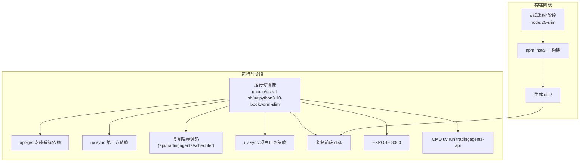
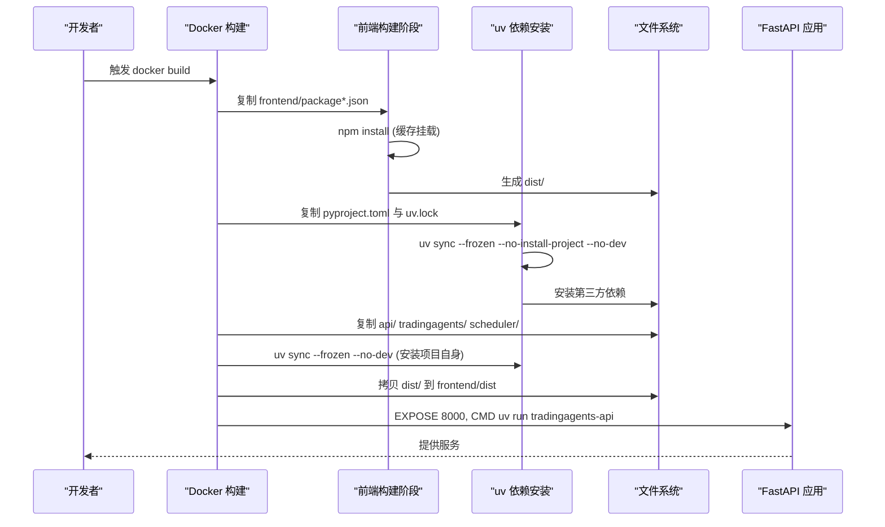
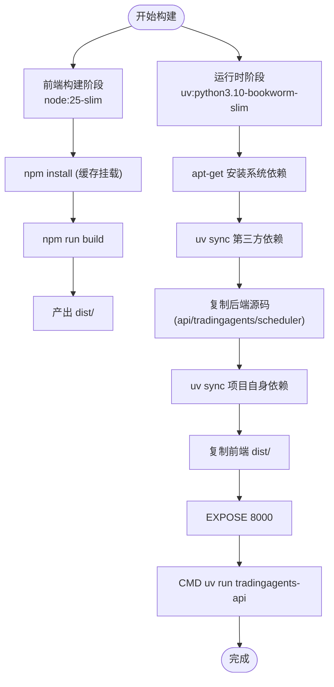
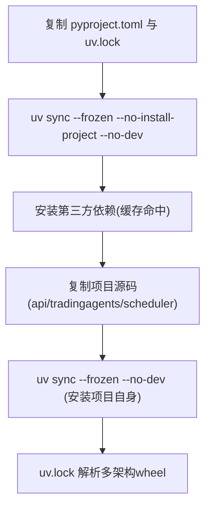
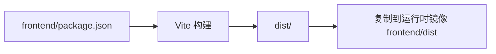
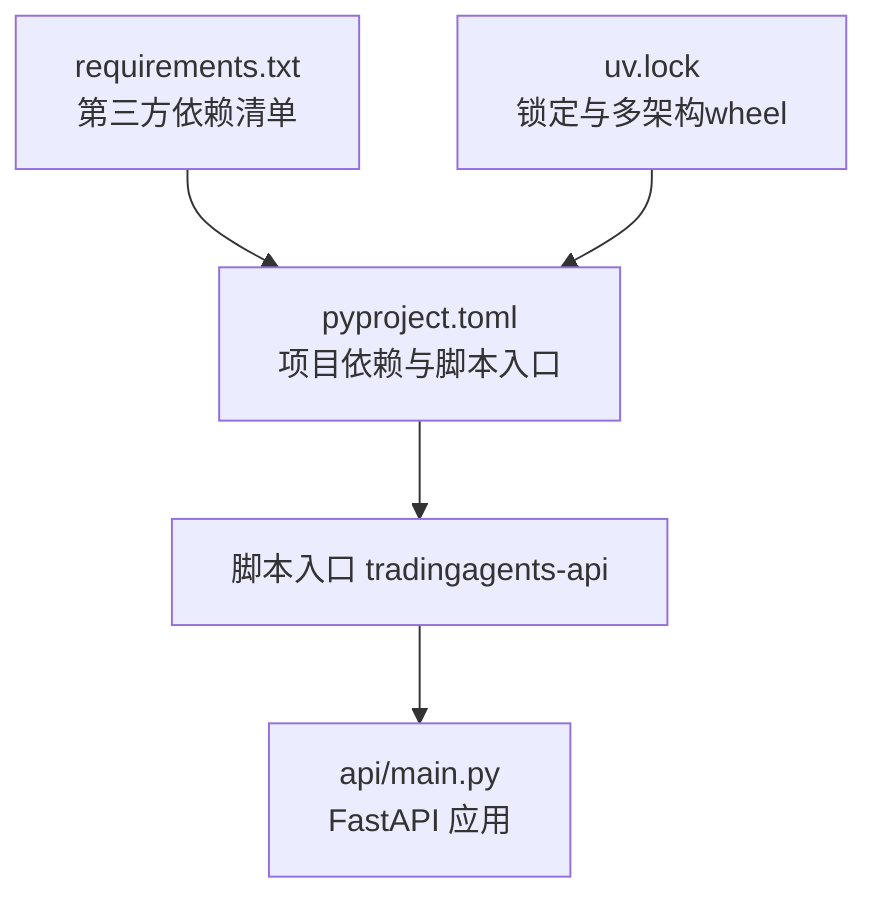

# 容器化部署

<cite>
**本文档引用的文件**
- [Dockerfile](file://Dockerfile)
- [pyproject.toml](file://pyproject.toml)
- [uv.lock](file://uv.lock)
- [requirements.txt](file://requirements.txt)
- [frontend/package.json](file://frontend/package.json)
- [api/logging_config.yaml](file://api/logging_config.yaml)
- [api/main.py](file://api/main.py)
- [frontend/vite.config.ts](file://frontend/vite.config.ts)
</cite>

## 目录
1. [简介](#简介)
2. [项目结构](#项目结构)
3. [核心组件](#核心组件)
4. [架构总览](#架构总览)
5. [详细组件分析](#详细组件分析)
6. [依赖关系分析](#依赖关系分析)
7. [性能考虑](#性能考虑)
8. [故障排查指南](#故障排查指南)
9. [结论](#结论)
10. [附录](#附录)

## 简介
本文件面向TradingAgents-AShare项目的容器化部署，基于仓库中的Dockerfile与相关配置，系统性阐述多阶段构建流程、uv包管理器使用、依赖安装优化与镜像层缓存策略、多架构支持与平台兼容性、构建参数配置、容器启动命令与环境变量、端口暴露、本地开发容器化、生产环境编排建议、健康检查、资源限制、网络配置、存储卷挂载、调试技巧、日志查看与性能监控等主题。

## 项目结构
项目采用前后端分离的多阶段Docker构建方案：
- 前端构建阶段：在node:25-slim镜像中使用npm进行依赖安装与打包，产物输出到dist目录。
- 运行时镜像阶段：基于ghcr.io/astral-sh/uv:python3.10-bookworm-slim，使用uv同步依赖并安装项目代码，最终通过uv run启动FastAPI应用。

**图表来源**
- [Dockerfile:1-50](file://Dockerfile#L1-L50)

**章节来源**
- [Dockerfile:1-50](file://Dockerfile#L1-L50)

## 核心组件
- 多阶段构建
  - 前端构建阶段：使用node:25-slim，启用npm缓存挂载，提升安装速度。
  - 运行时阶段：使用uv官方Python镜像，结合uv.lock实现确定性依赖安装。
- uv包管理器
  - 使用uv sync进行依赖安装，支持缓存挂载与冻结安装，确保一致性与速度。
- 依赖锁定与版本
  - pyproject.toml声明项目依赖与脚本入口；uv.lock包含大量平台与Python版本标记，覆盖多架构wheel分发。
- 前端与后端集成
  - 前端构建产物dist拷贝到运行时镜像，供后端FastAPI服务提供静态资源。
- 环境变量与启动
  - 设置APP_VERSION、PYTHONUNBUFFERED、PYTHONPATH、TA_JOB_TIMEOUT等；通过uv run启动tradingagents-api脚本。

**章节来源**
- [Dockerfile:1-50](file://Dockerfile#L1-L50)
- [pyproject.toml:1-52](file://pyproject.toml#L1-L52)
- [uv.lock:1-511](file://uv.lock#L1-L511)

## 架构总览
下图展示了从源码到容器镜像的关键路径与交互：

**图表来源**
- [Dockerfile:1-50](file://Dockerfile#L1-L50)
- [pyproject.toml:40-43](file://pyproject.toml#L40-L43)

## 详细组件分析

### Dockerfile 多阶段构建
- 前端构建阶段
  - 平台选择：使用BUILDPLATFORM参数，允许跨平台构建但前端在原生架构运行以提升速度。
  - 缓存优化：通过--mount=type=cache,target=/root/.npm显著加速npm install。
- 运行时阶段
  - 基础系统依赖：apt-get安装curl，满足运行时需求。
  - uv依赖安装：先安装第三方依赖，再安装项目自身，充分利用层缓存。
  - 前端产物集成：将前端dist拷贝到运行时镜像的frontend/dist。
  - 端口与启动：EXPOSE 8000，CMD uv run tradingagents-api。

**图表来源**
- [Dockerfile:1-50](file://Dockerfile#L1-L50)

**章节来源**
- [Dockerfile:1-50](file://Dockerfile#L1-L50)

### uv 包管理器与依赖安装优化
- 依赖锁定与多架构
  - uv.lock包含丰富的resolution-markers与多wheel分发，覆盖macOS、Linux、Windows及多种CPU架构与Python版本。
- 冻结安装与缓存
  - 使用--frozen确保与锁文件严格一致；--mount=type=cache,target=/root/.cache/uv提升安装速度。
- 分层安装策略
  - 先安装第三方依赖，再安装项目自身，避免项目变更导致第三方依赖重复下载。

**图表来源**
- [Dockerfile:21-32](file://Dockerfile#L21-L32)
- [uv.lock:1-10](file://uv.lock#L1-L10)

**章节来源**
- [Dockerfile:21-32](file://Dockerfile#L21-L32)
- [uv.lock:1-511](file://uv.lock#L1-L511)

### 前端构建与产物集成
- 前端依赖与构建
  - frontend/package.json定义了React、Vite、Tailwind等依赖与构建脚本。
  - Vite开发服务器默认端口5173，代理规则指向后端8000端口。
- 产物集成
  - 前端构建产物dist在运行时被复制到镜像的frontend/dist，供后端FastAPI提供静态资源。

**图表来源**
- [frontend/package.json:1-47](file://frontend/package.json#L1-L47)
- [frontend/vite.config.ts:48-74](file://frontend/vite.config.ts#L48-L74)
- [Dockerfile:34-35](file://Dockerfile#L34-L35)

**章节来源**
- [frontend/package.json:1-47](file://frontend/package.json#L1-L47)
- [frontend/vite.config.ts:48-74](file://frontend/vite.config.ts#L48-L74)
- [Dockerfile:34-35](file://Dockerfile#L34-L35)

### 环境变量与启动命令
- 环境变量
  - APP_VERSION：通过--build-arg注入版本号，默认dev。
  - PYTHONUNBUFFERED=1：确保Python输出实时刷新。
  - PYTHONPATH=/app：设置Python模块搜索路径。
  - TA_JOB_TIMEOUT=1800：作业超时时间（秒）。
- 启动命令
  - CMD ["uv", "run", "--no-sync", "tradingagents-api"]：使用uv运行FastAPI入口脚本。

**章节来源**
- [Dockerfile:40-47](file://Dockerfile#L40-L47)
- [pyproject.toml:40-43](file://pyproject.toml#L40-L43)

### 日志配置与可观测性
- uvicorn日志格式
  - logging_config.yaml定义了默认与访问日志格式，便于容器内统一输出。
- 标准输出与错误流
  - uvicorn默认使用stderr/stdout输出，适合容器日志收集。

**章节来源**
- [api/logging_config.yaml:1-35](file://api/logging_config.yaml#L1-L35)

## 依赖关系分析
- 项目入口脚本
  - tradingagents-api对应pyproject.toml中的脚本入口，用于启动FastAPI应用。
- 依赖来源
  - pyproject.toml声明项目依赖集合；requirements.txt列出主要第三方库；uv.lock提供确定性解析与多架构wheel分发。

**图表来源**
- [pyproject.toml:40-43](file://pyproject.toml#L40-L43)
- [api/main.py:298-305](file://api/main.py#L298-L305)
- [requirements.txt:1-24](file://requirements.txt#L1-L24)
- [uv.lock:1-10](file://uv.lock#L1-L10)

**章节来源**
- [pyproject.toml:40-43](file://pyproject.toml#L40-L43)
- [api/main.py:298-305](file://api/main.py#L298-L305)
- [requirements.txt:1-24](file://requirements.txt#L1-L24)
- [uv.lock:1-10](file://uv.lock#L1-L10)

## 性能考虑
- 多阶段构建与层缓存
  - 前端与后端分别在不同阶段构建，减少重复工作；uv依赖安装使用缓存挂载，提升二次构建速度。
- 多架构支持
  - uv.lock包含大量平台与Python版本标记，确保在不同CPU架构与操作系统上获得最优wheel。
- 依赖冻结安装
  - 使用--frozen确保与锁文件严格一致，避免版本漂移带来的性能波动。

**章节来源**
- [Dockerfile:21-32](file://Dockerfile#L21-L32)
- [uv.lock:1-10](file://uv.lock#L1-L10)

## 故障排查指南
- 常见问题定位
  - 端口冲突：确认宿主机8000端口未被占用；容器EXPOSE 8000，需映射到宿主机端口。
  - 前端静态资源：确认dist已正确复制到frontend/dist；否则UI无法加载。
  - 依赖安装失败：检查网络与缓存挂载权限；必要时清理缓存后重试。
- 日志查看
  - uvicorn日志按默认格式输出到标准输出/错误流，可通过容器日志收集系统查看。
- 调试技巧
  - 临时增加环境变量LOG_LEVEL=DEBUG（若应用支持）以获取更详细日志。
  - 使用docker exec进入容器内部，手动执行uv run命令验证启动流程。

**章节来源**
- [Dockerfile:37-38](file://Dockerfile#L37-L38)
- [api/logging_config.yaml:1-35](file://api/logging_config.yaml#L1-L35)

## 结论
本容器化方案通过多阶段构建与uv包管理器实现了高效、可复现且多架构兼容的镜像构建。前端与后端的分离构建、依赖锁定与缓存优化、以及明确的环境变量与启动配置，为本地开发与生产部署提供了坚实基础。建议在生产环境中配合编排工具（如Kubernetes）进行资源限制、健康检查与滚动更新，并结合日志与监控系统实现全链路可观测性。

## 附录

### 容器启动命令与环境变量
- 启动命令
  - docker run -d -p 8000:8000 --name tradingagents-container tradingagents:latest
- 关键环境变量
  - APP_VERSION：通过--build-arg注入版本号
  - TA_JOB_TIMEOUT：作业超时时间（秒），默认1800
  - LOG_LEVEL：日志级别（如需）

**章节来源**
- [Dockerfile:40-47](file://Dockerfile#L40-L47)

### 端口暴露与网络配置
- 端口
  - EXPOSE 8000：容器监听8000端口
- 网络
  - 前端开发代理：Vite默认5173端口，代理到后端8000端口
  - 生产环境：直接通过8000端口对外提供服务

**章节来源**
- [Dockerfile:37-38](file://Dockerfile#L37-L38)
- [frontend/vite.config.ts:48-74](file://frontend/vite.config.ts#L48-L74)

### 存储卷挂载与持久化
- 建议挂载
  - 数据库文件或日志目录（如使用SQLite或自定义日志路径）
  - 配置文件或密钥（通过环境变量或只读挂载注入）
- 注意事项
  - 避免将敏感信息硬编码在镜像中；优先使用环境变量或Secrets管理

### 健康检查与资源限制
- 健康检查
  - 建议在编排层添加HTTP健康检查，探针路径可参考应用根路径或/healthz
- 资源限制
  - CPU/内存限额：根据并发与分析任务复杂度设定
  - 线程池与执行器：结合应用内的AnyIO线程限制与默认asyncio执行器配置

### 生产环境容器编排建议
- 编排工具
  - Kubernetes：使用Deployment/Service/ConfigMap/Secret管理
  - Docker Compose：单机或多节点编排
- 最佳实践
  - 使用只读根文件系统与最小权限
  - 配置滚动更新与回滚策略
  - 结合Prometheus/Grafana进行性能监控