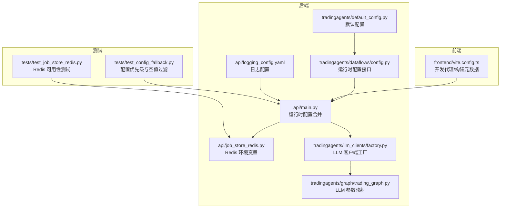
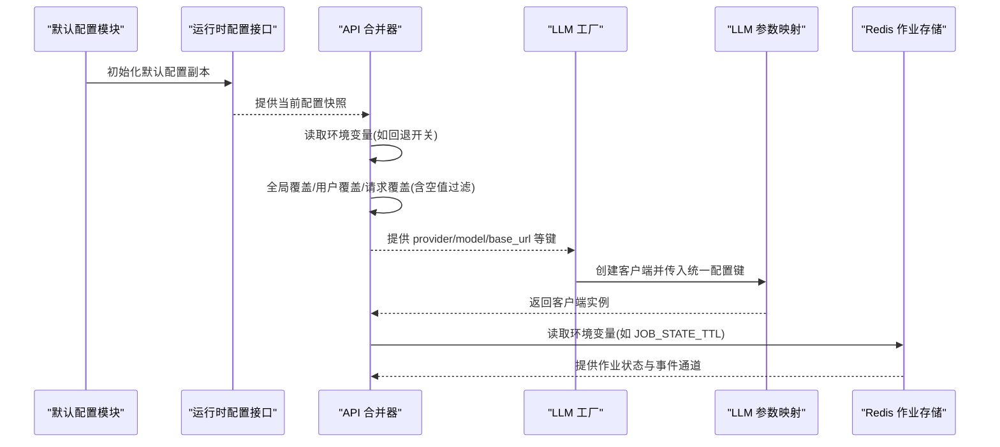
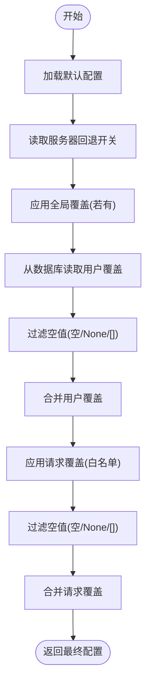
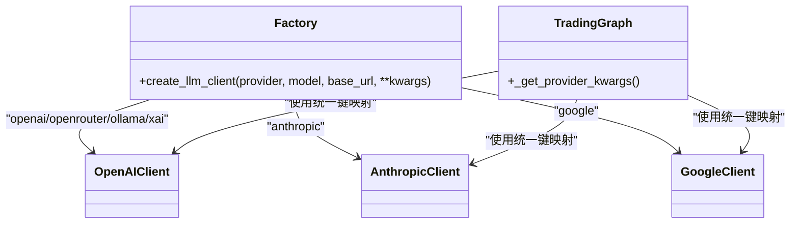
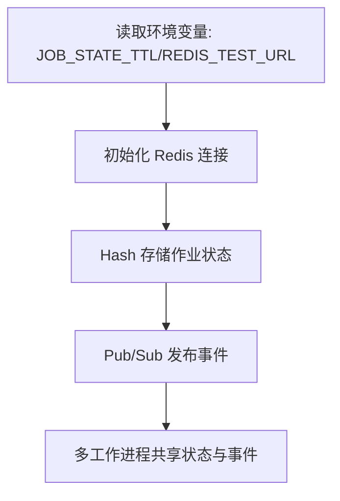
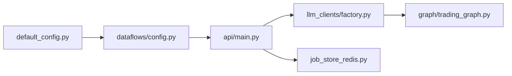

# 环境配置

<cite>
**本文引用的文件**
- [api/main.py](file://api/main.py)
- [api/job_store_redis.py](file://api/job_store_redis.py)
- [tests/test_config_fallback.py](file://tests/test_config_fallback.py)
- [tradingagents/dataflows/config.py](file://tradingagents/dataflows/config.py)
- [tradingagents/default_config.py](file://tradingagents/default_config.py)
- [tradingagents/llm_clients/factory.py](file://tradingagents/llm_clients/factory.py)
- [tradingagents/graph/trading_graph.py](file://tradingagents/graph/trading_graph.py)
- [frontend/vite.config.ts](file://frontend/vite.config.ts)
- [api/logging_config.yaml](file://api/logging_config.yaml)
- [tests/test_job_store_redis.py](file://tests/test_job_store_redis.py)
</cite>

## 目录
1. [简介](#简介)
2. [项目结构](#项目结构)
3. [核心组件](#核心组件)
4. [架构总览](#架构总览)
5. [详细组件分析](#详细组件分析)
6. [依赖分析](#依赖分析)
7. [性能考虑](#性能考虑)
8. [故障排查指南](#故障排查指南)
9. [结论](#结论)
10. [附录](#附录)

## 简介
本文件系统化梳理 TradingAgents-AShare 的环境配置管理，覆盖开发、测试、生产三类环境的配置差异与最佳实践；解释数据库连接、缓存与外部服务配置；阐述 LLM API 密钥管理、数据源配置与第三方服务集成；明确环境变量定义、配置文件组织与敏感信息保护策略；给出配置验证、加载顺序与默认值处理方法；说明配置热更新、动态配置与回滚机制；并提供配置模板、示例文件与迁移指南。

## 项目结构
围绕配置管理的关键目录与文件如下：
- 后端 API 配置与运行时合并：api/main.py
- Redis 作业存储与环境变量：api/job_store_redis.py
- 默认配置与运行时配置注入：tradingagents/default_config.py、tradingagents/dataflows/config.py
- LLM 客户端工厂与参数映射：tradingagents/llm_clients/factory.py、tradingagents/graph/trading_graph.py
- 前端代理与构建元数据：frontend/vite.config.ts
- 日志 YAML 配置：api/logging_config.yaml
- 测试用例：tests/test_config_fallback.py、tests/test_job_store_redis.py

图表来源
- [api/main.py](file://api/main.py)
- [api/job_store_redis.py](file://api/job_store_redis.py)
- [tradingagents/default_config.py](file://tradingagents/default_config.py)
- [tradingagents/dataflows/config.py](file://tradingagents/dataflows/config.py)
- [tradingagents/llm_clients/factory.py](file://tradingagents/llm_clients/factory.py)
- [tradingagents/graph/trading_graph.py](file://tradingagents/graph/trading_graph.py)
- [api/logging_config.yaml](file://api/logging_config.yaml)
- [frontend/vite.config.ts](file://frontend/vite.config.ts)
- [tests/test_config_fallback.py](file://tests/test_config_fallback.py)
- [tests/test_job_store_redis.py](file://tests/test_job_store_redis.py)

章节来源
- [api/main.py](file://api/main.py)
- [api/job_store_redis.py](file://api/job_store_redis.py)
- [tradingagents/default_config.py](file://tradingagents/default_config.py)
- [tradingagents/dataflows/config.py](file://tradingagents/dataflows/config.py)
- [tradingagents/llm_clients/factory.py](file://tradingagents/llm_clients/factory.py)
- [tradingagents/graph/trading_graph.py](file://tradingagents/graph/trading_graph.py)
- [frontend/vite.config.ts](file://frontend/vite.config.ts)
- [api/logging_config.yaml](file://api/logging_config.yaml)
- [tests/test_config_fallback.py](file://tests/test_config_fallback.py)
- [tests/test_job_store_redis.py](file://tests/test_job_store_redis.py)

## 核心组件
- 默认配置模块：提供全局默认键值集合，作为所有运行时配置的基线。
- 运行时配置接口：负责初始化、更新与读取当前配置，支持在模块导入时完成基础初始化。
- 运行时配置合并器：在 API 层按“服务器级允许回退”“全局覆盖”“用户覆盖”“请求覆盖”的优先级进行深度合并，并对空值进行过滤以避免覆盖环境变量默认值。
- LLM 客户端工厂与参数映射：根据配置中的 provider/model/base_url 等键创建对应客户端，并将统一的配置键映射到各供应商特定参数。
- Redis 作业存储：通过环境变量控制作业状态 TTL 等行为，便于多工作进程共享状态。
- 日志配置：通过 YAML 文件集中管理日志级别与输出格式。
- 前端开发代理：在开发阶段将 /v1、/api 等路径代理至后端，便于联调。

章节来源
- [tradingagents/default_config.py](file://tradingagents/default_config.py)
- [tradingagents/dataflows/config.py](file://tradingagents/dataflows/config.py)
- [api/main.py](file://api/main.py)
- [tradingagents/llm_clients/factory.py](file://tradingagents/llm_clients/factory.py)
- [tradingagents/graph/trading_graph.py](file://tradingagents/graph/trading_graph.py)
- [api/job_store_redis.py](file://api/job_store_redis.py)
- [api/logging_config.yaml](file://api/logging_config.yaml)
- [frontend/vite.config.ts](file://frontend/vite.config.ts)

## 架构总览
下图展示从默认配置到运行时配置、再到 LLM 客户端创建与 Redis 作业存储的整体流程。

图表来源
- [tradingagents/default_config.py](file://tradingagents/default_config.py)
- [tradingagents/dataflows/config.py](file://tradingagents/dataflows/config.py)
- [api/main.py](file://api/main.py)
- [tradingagents/llm_clients/factory.py](file://tradingagents/llm_clients/factory.py)
- [tradingagents/graph/trading_graph.py](file://tradingagents/graph/trading_graph.py)
- [api/job_store_redis.py](file://api/job_store_redis.py)

## 详细组件分析

### 运行时配置合并与优先级
- 加载顺序
  1) 读取默认配置作为基线；
  2) 读取服务器级允许回退开关；
  3) 应用全局覆盖（来自 PATCH /v1/config 的持久化覆盖）；
  4) 从数据库读取用户级覆盖；
  5) 应用请求级覆盖（仅允许白名单键）；
  6) 对用户与请求覆盖进行空值过滤，防止覆盖环境变量默认值。
- 关键行为
  - 白名单过滤：仅接受允许的键，提升安全性；
  - 空值过滤：None、空字符串、空列表等不会覆盖已有值；
  - 回退开关：通过环境变量控制是否启用服务器级回退。

图表来源
- [api/main.py](file://api/main.py)

章节来源
- [api/main.py](file://api/main.py)
- [tests/test_config_fallback.py](file://tests/test_config_fallback.py)

### LLM 客户端工厂与参数映射
- 工厂创建
  - 支持 provider=openai/openrouter/ollama/xai、anthropic、google；
  - 统一接收 model/base_url 等参数；
  - 不同 provider 的特殊参数会映射到客户端期望的键。
- 参数映射要点
  - Google：可选 thinking_level、api_key；
  - OpenAI：可选 reasoning_effort、api_key；
  - Anthropic：可选 api_key；
  - 未使用但被忽略的 base_url 将在部分客户端中被丢弃（见 TODO）。

图表来源
- [tradingagents/llm_clients/factory.py](file://tradingagents/llm_clients/factory.py)
- [tradingagents/graph/trading_graph.py](file://tradingagents/graph/trading_graph.py)

章节来源
- [tradingagents/llm_clients/factory.py](file://tradingagents/llm_clients/factory.py)
- [tradingagents/graph/trading_graph.py](file://tradingagents/graph/trading_graph.py)

### Redis 作业存储与环境变量
- 关键环境变量
  - JOB_STATE_TTL：作业状态哈希的 TTL（秒），默认 86400；
  - REDIS_TEST_URL：测试环境 Redis 地址，默认 redis://localhost:6379/15。
- 行为特性
  - 使用 Redis Hash 存储作业状态；
  - 使用 Pub/Sub 实现实时事件推送；
  - 多工作进程共享同一作业状态与事件流。

图表来源
- [api/job_store_redis.py](file://api/job_store_redis.py)
- [tests/test_job_store_redis.py](file://tests/test_job_store_redis.py)

章节来源
- [api/job_store_redis.py](file://api/job_store_redis.py)
- [tests/test_job_store_redis.py](file://tests/test_job_store_redis.py)

### 日志配置与前端代理
- 日志配置
  - 通过 YAML 文件集中管理日志级别与输出格式，便于在不同环境中调整。
- 前端代理
  - 开发环境下将 /v1、/api、/healthz、/openapi.json、/docs 等路径代理到后端，简化联调。

章节来源
- [api/logging_config.yaml](file://api/logging_config.yaml)
- [frontend/vite.config.ts](file://frontend/vite.config.ts)

## 依赖分析
- 配置层依赖
  - 默认配置模块为运行时配置接口提供基线；
  - 运行时配置接口为 API 合并器提供当前配置；
  - API 合并器为 LLM 工厂与参数映射提供统一配置键；
  - Redis 作业存储依赖环境变量进行行为控制。
- 外部依赖
  - Redis：用于作业状态与事件通道；
  - LLM 供应商：OpenAI、Anthropic、Google 等。

图表来源
- [tradingagents/default_config.py](file://tradingagents/default_config.py)
- [tradingagents/dataflows/config.py](file://tradingagents/dataflows/config.py)
- [api/main.py](file://api/main.py)
- [tradingagents/llm_clients/factory.py](file://tradingagents/llm_clients/factory.py)
- [tradingagents/graph/trading_graph.py](file://tradingagents/graph/trading_graph.py)
- [api/job_store_redis.py](file://api/job_store_redis.py)

章节来源
- [tradingagents/default_config.py](file://tradingagents/default_config.py)
- [tradingagents/dataflows/config.py](file://tradingagents/dataflows/config.py)
- [api/main.py](file://api/main.py)
- [tradingagents/llm_clients/factory.py](file://tradingagents/llm_clients/factory.py)
- [tradingagents/graph/trading_graph.py](file://tradingagents/graph/trading_graph.py)
- [api/job_store_redis.py](file://api/job_store_redis.py)

## 性能考虑
- 配置合并
  - 采用深度合并与白名单过滤，减少无效键带来的解析开销；
  - 空值过滤避免重复写入与回退逻辑的误触发。
- Redis 作业存储
  - TTL 控制降低长期占用内存；
  - Hash + Pub/Sub 的组合适合高并发下的状态共享与事件分发。
- 日志
  - YAML 集中管理便于在生产环境降低日志级别，减少 IO 压力。

## 故障排查指南
- 配置优先级问题
  - 症状：用户覆盖或请求覆盖未生效；
  - 排查：确认覆盖键是否在白名单内；检查是否存在空值（None/""/[]）导致被过滤。
- 回退开关
  - 症状：服务器回退未按预期触发；
  - 排查：检查环境变量 ALLOW_SERVER_LLM_FALLBACK 的取值。
- Redis 不可用
  - 症状：作业状态无法持久化或事件无法推送；
  - 排查：确认 REDIS_TEST_URL 或生产 Redis 地址可达；核对 JOB_STATE_TTL 设置。
- LLM 客户端异常
  - 症状：参数映射错误或 base_url 未生效；
  - 排查：对照工厂与参数映射逻辑，确保 provider/model/base_url 正确传递。

章节来源
- [api/main.py](file://api/main.py)
- [tests/test_config_fallback.py](file://tests/test_config_fallback.py)
- [tests/test_job_store_redis.py](file://tests/test_job_store_redis.py)
- [tradingagents/llm_clients/factory.py](file://tradingagents/llm_clients/factory.py)
- [tradingagents/graph/trading_graph.py](file://tradingagents/graph/trading_graph.py)

## 结论
本项目通过“默认配置 + 运行时合并 + 环境变量 + 白名单过滤 + 空值过滤”的组合，实现了可控、安全、可扩展的配置体系。LLM 客户端工厂与参数映射进一步统一了对外部服务的接入方式。Redis 作业存储与日志配置则分别满足了状态共享与可观测性的需求。建议在不同环境严格区分环境变量与配置文件，配合测试用例验证优先级与过滤规则，确保配置变更的稳定性与可追溯性。

## 附录

### 环境变量清单与用途
- ALLOW_SERVER_LLM_FALLBACK：控制服务器级 LLM 回退开关（影响运行时配置合并）。
- JOB_STATE_TTL：Redis 作业状态哈希的 TTL（秒）。
- REDIS_TEST_URL：测试环境 Redis 地址（默认 redis://localhost:6379/15）。
- 其他：可在运行时配置中使用的键（如 quick_think_llm、deep_think_llm 等）由默认配置与运行时合并器共同决定。

章节来源
- [api/main.py](file://api/main.py)
- [api/job_store_redis.py](file://api/job_store_redis.py)
- [tests/test_config_fallback.py](file://tests/test_config_fallback.py)

### 配置文件组织与敏感信息保护
- 配置文件组织
  - 默认配置：tradingagents/default_config.py
  - 运行时配置接口：tradingagents/dataflows/config.py
  - API 运行时合并：api/main.py
  - 日志配置：api/logging_config.yaml
- 敏感信息保护
  - LLM API 密钥通过统一配置键注入，避免硬编码；
  - 请求覆盖仅允许白名单键，防止注入未知配置；
  - 空值过滤避免将空字符串写入配置覆盖环境变量默认值。

章节来源
- [tradingagents/default_config.py](file://tradingagents/default_config.py)
- [tradingagents/dataflows/config.py](file://tradingagents/dataflows/config.py)
- [api/main.py](file://api/main.py)
- [api/logging_config.yaml](file://api/logging_config.yaml)

### 配置验证与加载顺序
- 验证点
  - 白名单键校验；
  - 空值过滤；
  - 服务器回退开关；
  - 用户与请求覆盖的合并结果。
- 加载顺序
  1) 默认配置；
  2) 服务器回退开关；
  3) 全局覆盖；
  4) 用户覆盖（过滤空值）；
  5) 请求覆盖（白名单 + 过滤空值）。

章节来源
- [api/main.py](file://api/main.py)
- [tests/test_config_fallback.py](file://tests/test_config_fallback.py)

### 动态配置与回滚机制
- 动态配置
  - 通过 PATCH /v1/config 设置全局覆盖；
  - 通过用户覆盖与请求覆盖实现按用户与按次调用的动态调整。
- 回滚机制
  - 当前实现未提供显式“回滚”操作，可通过清除全局覆盖或恢复默认配置实现回退；
  - 建议在生产环境引入“版本化配置 + 快照”的回滚策略（扩展建议）。

章节来源
- [api/main.py](file://api/main.py)

### 配置模板与示例
- 默认配置模板位置：tradingagents/default_config.py
- 运行时配置接口模板位置：tradingagents/dataflows/config.py
- 日志配置模板位置：api/logging_config.yaml
- 前端开发代理示例：frontend/vite.config.ts

章节来源
- [tradingagents/default_config.py](file://tradingagents/default_config.py)
- [tradingagents/dataflows/config.py](file://tradingagents/dataflows/config.py)
- [api/logging_config.yaml](file://api/logging_config.yaml)
- [frontend/vite.config.ts](file://frontend/vite.config.ts)

### 配置迁移指南
- 从旧配置迁移到运行时合并
  - 将原有硬编码配置项迁移至默认配置；
  - 将用户级与请求级覆盖迁移至数据库与 API 接口；
  - 在环境变量中设置服务器回退开关与 Redis 相关参数。
- 迁移验证
  - 使用测试用例验证优先级与空值过滤；
  - 在预生产环境进行端到端联调，确认 LLM 客户端参数映射正确。

章节来源
- [api/main.py](file://api/main.py)
- [tests/test_config_fallback.py](file://tests/test_config_fallback.py)