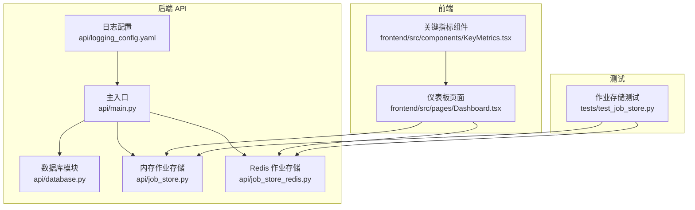
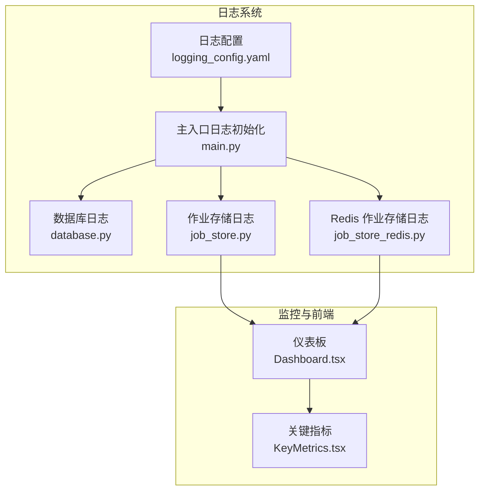
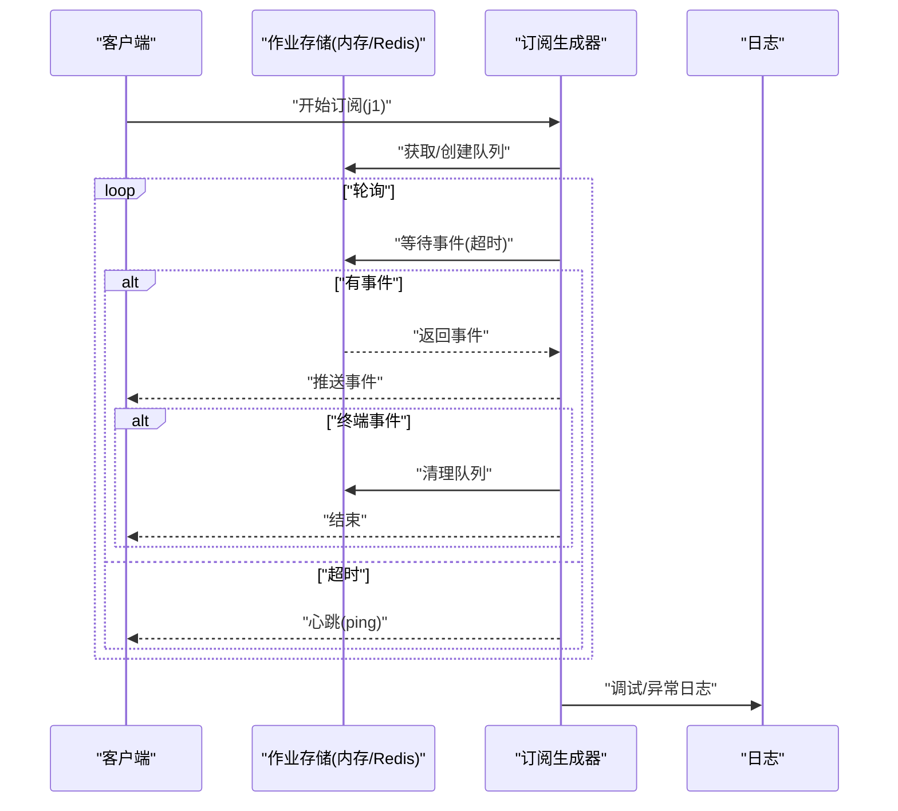
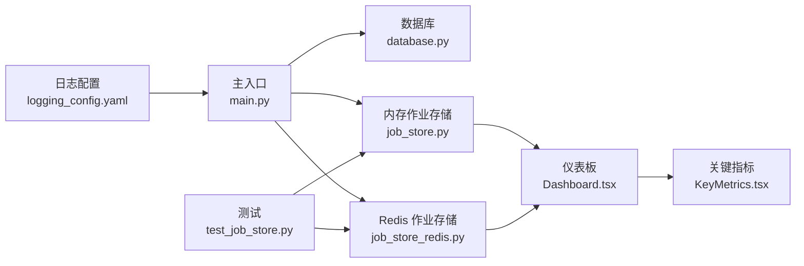

# 监控与日志

<cite>
**本文引用的文件**
- [api/logging_config.yaml](file://api/logging_config.yaml)
- [api/main.py](file://api/main.py)
- [api/database.py](file://api/database.py)
- [api/job_store.py](file://api/job_store.py)
- [api/job_store_redis.py](file://api/job_store_redis.py)
- [frontend/src/pages/Dashboard.tsx](file://frontend/src/pages/Dashboard.tsx)
- [frontend/src/components/KeyMetrics.tsx](file://frontend/src/components/KeyMetrics.tsx)
- [tests/test_job_store.py](file://tests/test_job_store.py)
</cite>

## 目录
1. [简介](#简介)
2. [项目结构](#项目结构)
3. [核心组件](#核心组件)
4. [架构总览](#架构总览)
5. [详细组件分析](#详细组件分析)
6. [依赖关系分析](#依赖关系分析)
7. [性能考量](#性能考量)
8. [故障排查指南](#故障排查指南)
9. [结论](#结论)
10. [附录](#附录)

## 简介
本文件面向 TradingAgents-AShare 的监控与日志管理，聚焦以下方面：
- 日志配置文件结构、日志级别与输出格式
- 应用性能监控、API 响应时间与错误率统计
- 系统资源监控（内存与 CPU 负载）
- 智能体执行监控、作业状态跟踪与队列处理监控
- 告警配置、阈值与通知机制
- 日志聚合、搜索与分析方法
- 性能基准测试、瓶颈识别与优化建议
- 监控仪表板配置与关键指标可视化

## 项目结构
围绕监控与日志的关键目录与文件如下：
- 后端 API 层：日志配置、主入口、数据库与作业存储模块
- 前端仪表板：关键指标展示与系统状态概览
- 测试：作业队列行为与事件流验证

图表来源
- [api/logging_config.yaml:1-35](file://api/logging_config.yaml#L1-L35)
- [api/main.py:18-27](file://api/main.py#L18-L27)
- [api/database.py:2,56,119,139,168,217,236](file://api/database.py#L2,L56,L119,L139,L168,L217,L236)
- [api/job_store.py:8,14,177,182,251,270,300](file://api/job_store.py#L8,L14,L177,L182,L251,L270,L300)
- [api/job_store_redis.py:10,18,65,146](file://api/job_store_redis.py#L10,L18,L65,L146)
- [frontend/src/pages/Dashboard.tsx:72-101,103-105:72-101](file://frontend/src/pages/Dashboard.tsx#L72-L101)
- [frontend/src/components/KeyMetrics.tsx:10-44](file://frontend/src/components/KeyMetrics.tsx#L10-L44)
- [tests/test_job_store.py:12-133](file://tests/test_job_store.py#L12-L133)

章节来源
- [api/logging_config.yaml:1-35](file://api/logging_config.yaml#L1-L35)
- [api/main.py:18-27](file://api/main.py#L18-L27)
- [api/database.py:2,56,119,139,168,217,236](file://api/database.py#L2,L56,L119,L139,L168,L217,L236)
- [api/job_store.py:8,14,177,182,251,270,300](file://api/job_store.py#L8,L14,L177,L182,L251,L270,L300)
- [api/job_store_redis.py:10,18,65,146](file://api/job_store_redis.py#L10,L18,L65,L146)
- [frontend/src/pages/Dashboard.tsx:72-101,103-105:72-101](file://frontend/src/pages/Dashboard.tsx#L72-L101)
- [frontend/src/components/KeyMetrics.tsx:10-44](file://frontend/src/components/KeyMetrics.tsx#L10-L44)
- [tests/test_job_store.py:12-133](file://tests/test_job_store.py#L12-L133)

## 核心组件
- 日志配置与级别
  - 使用 YAML 定义默认与访问日志格式，分别输出到标准错误与标准输出；根日志器与 uvicorn 子日志器按需配置级别与处理器。
  - 参考路径：[api/logging_config.yaml:1-35](file://api/logging_config.yaml#L1-L35)
- 日志入口与环境变量
  - 主入口通过基础日志配置读取环境变量 LOG_LEVEL 控制全局日志级别。
  - 参考路径：[api/main.py:18-27](file://api/main.py#L18-L27)
- 数据库层日志
  - 数据库迁移与异常处使用标准日志记录错误与安全相关操作信息。
  - 参考路径：[api/database.py:2,56,119,139,168,217,236](file://api/database.py#L2,L56,L119,L139,L168,L217,L236)
- 作业存储与事件流
  - 内存与 Redis 作业存储均使用标准日志记录连接、调试与异常信息；订阅生成器在断开或超时时清理队列，避免泄漏。
  - 参考路径：[api/job_store.py:8,14,177,182,251,270,300](file://api/job_store.py#L8,L14,L177,L182,L251,L270,L300)，[api/job_store_redis.py:10,18,65,146](file://api/job_store_redis.py#L10,L18,L65,L146)
- 前端监控展示
  - 仪表板页面展示 Agent 状态、分析任务、报告总数与系统状态；关键指标组件用于展示分析结果中的关键指标。
  - 参考路径：[frontend/src/pages/Dashboard.tsx:72-101,103-105:72-101](file://frontend/src/pages/Dashboard.tsx#L72-L101)，[frontend/src/components/KeyMetrics.tsx:10-44](file://frontend/src/components/KeyMetrics.tsx#L10-L44)
- 作业队列行为验证
  - 测试覆盖作业事件发布、订阅、超时心跳、队列溢出丢弃等行为，确保事件流与内存回收符合预期。
  - 参考路径：[tests/test_job_store.py:12-133](file://tests/test_job_store.py#L12-L133)

章节来源
- [api/logging_config.yaml:1-35](file://api/logging_config.yaml#L1-L35)
- [api/main.py:18-27](file://api/main.py#L18-L27)
- [api/database.py:2,56,119,139,168,217,236](file://api/database.py#L2,L56,L119,L139,L168,L217,L236)
- [api/job_store.py:8,14,177,182,251,270,300](file://api/job_store.py#L8,L14,L177,L182,L251,L270,L300)
- [api/job_store_redis.py:10,18,65,146](file://api/job_store_redis.py#L10,L18,L65,L146)
- [frontend/src/pages/Dashboard.tsx:72-101,103-105:72-101](file://frontend/src/pages/Dashboard.tsx#L72-L101)
- [frontend/src/components/KeyMetrics.tsx:10-44](file://frontend/src/components/KeyMetrics.tsx#L10-L44)
- [tests/test_job_store.py:12-133](file://tests/test_job_store.py#L12-L133)

## 架构总览
下图展示了日志、作业存储与前端监控之间的交互关系。

图表来源
- [api/logging_config.yaml:1-35](file://api/logging_config.yaml#L1-L35)
- [api/main.py:18-27](file://api/main.py#L18-L27)
- [api/database.py:2,56,119,139,168,217,236](file://api/database.py#L2,L56,L119,L139,L168,L217,L236)
- [api/job_store.py:8,14,177,182,251,270,300](file://api/job_store.py#L8,L14,L177,L182,L251,L270,L300)
- [api/job_store_redis.py:10,18,65,146](file://api/job_store_redis.py#L10,L18,L65,L146)
- [frontend/src/pages/Dashboard.tsx:72-101,103-105:72-101](file://frontend/src/pages/Dashboard.tsx#L72-L101)
- [frontend/src/components/KeyMetrics.tsx:10-44](file://frontend/src/components/KeyMetrics.tsx#L10-L44)

## 详细组件分析

### 日志配置与输出格式
- 配置项说明
  - 版本与禁用现有日志器：保证新配置生效且不重复初始化。
  - 格式器：
    - 默认格式器：包含时间戳、日志级别与消息正文。
    - 访问格式器：包含客户端地址、请求行与状态码。
  - 处理器：
    - 默认处理器：输出到标准错误流。
    - 访问处理器：输出到标准输出流。
  - 日志器：
    - uvicorn、uvicorn.error、uvicorn.access 分别绑定处理器并设置级别。
    - 根日志器设置级别与默认处理器。
- 环境变量控制
  - LOG_LEVEL 环境变量决定全局日志级别，未设置时默认 INFO。
- 输出目标
  - 标准错误用于默认日志，标准输出用于访问日志，便于容器与日志收集系统区分。

章节来源
- [api/logging_config.yaml:1-35](file://api/logging_config.yaml#L1-L35)
- [api/main.py:18-27](file://api/main.py#L18-L27)

### API 响应时间与错误率统计
- 访问日志
  - uvicorn 访问格式器已包含状态码字段，可作为错误率统计的基础数据源。
- 错误率计算
  - 在日志聚合平台中，基于状态码与时间窗口统计 5xx/4xx 比例，结合请求总量得到错误率。
- 响应时间
  - 当前日志未直接记录响应耗时；可在网关或中间件层补充耗时字段，或通过外部 APM 工具采集。

章节来源
- [api/logging_config.yaml:8-11](file://api/logging_config.yaml#L8-L11)

### 系统资源监控（内存与 CPU 负载）
- 当前实现
  - 后端未内置资源监控指标导出；日志中未包含内存/CPU 统计。
- 建议方案
  - 引入进程级指标采集（如 psutil 或第三方 exporter），在健康检查接口暴露指标。
  - 结合容器编排平台（如 Kubernetes）的资源限制与监控面板进行可视化。

章节来源
- [api/main.py:18-27](file://api/main.py#L18-L27)

### 智能体执行监控与作业状态跟踪
- 作业生命周期
  - 作业状态包括 running、completed、failed 等；订阅生成器在终端状态或超时后终止并清理队列。
- 事件流
  - 支持 agent.snapshot、job.completed 等事件；若无消费者，队列满时会丢弃最旧事件以避免无限增长。
- 断连处理
  - 订阅生成器退出时自动删除对应队列，防止内存泄漏。

图表来源
- [api/job_store.py:182,251,270,300](file://api/job_store.py#L182,L251,L270,L300)
- [api/job_store_redis.py:155,160,166,173](file://api/job_store_redis.py#L155,L160,L166,L173)

章节来源
- [api/job_store.py:8,14,177,182,251,270,300](file://api/job_store.py#L8,L14,L177,L182,L251,L270,L300)
- [api/job_store_redis.py:10,18,65,146,155,160,166,173](file://api/job_store_redis.py#L10,L18,L65,L146,L155,L160,L166,L173)
- [tests/test_job_store.py:45-92,121-133](file://tests/test_job_store.py#L45-L92,L121-L133)

### 队列处理监控
- 队列容量与溢出策略
  - 队列最大长度受常量控制；当无消费者时，新事件到达导致最旧事件被丢弃。
- 心跳与断连
  - 超时产生 ping 事件；终端状态触发终止；生成器退出时清理队列。
- 行为验证
  - 单元测试覆盖事件发布、订阅、超时心跳、队列溢出丢弃与断连清理。

章节来源
- [tests/test_job_store.py:12-133](file://tests/test_job_store.py#L12-L133)
- [api/job_store.py:182,251,270,300](file://api/job_store.py#L182,L251,L270,L300)
- [api/job_store_redis.py:155,160,166,173](file://api/job_store_redis.py#L155,L160,L166,L173)

### 前端监控与可视化
- 仪表板指标
  - Agent 状态、分析任务、报告总数、系统状态等卡片化展示。
- 关键指标组件
  - 展示分析报告中的关键指标名称、数值与状态（良好/中性/不佳）。

章节来源
- [frontend/src/pages/Dashboard.tsx:72-101,103-105:72-101](file://frontend/src/pages/Dashboard.tsx#L72-L101)
- [frontend/src/components/KeyMetrics.tsx:10-44](file://frontend/src/components/KeyMetrics.tsx#L10-L44)

## 依赖关系分析
- 日志配置对主入口与各模块的影响
  - 主入口通过基础日志配置统一初始化日志级别；uvicorn 子日志器独立配置，避免与业务日志冲突。
- 作业存储对前端的依赖
  - 仪表板通过订阅事件流获取作业状态变化，实现前端实时更新。
- 测试对生产代码的验证
  - 通过单元测试验证事件流、超时与队列行为，保障生产稳定性。

图表来源
- [api/logging_config.yaml:1-35](file://api/logging_config.yaml#L1-L35)
- [api/main.py:18-27](file://api/main.py#L18-L27)
- [api/database.py:2,56,119,139,168,217,236](file://api/database.py#L2,L56,L119,L139,L168,L217,L236)
- [api/job_store.py:8,14,177,182,251,270,300](file://api/job_store.py#L8,L14,L177,L182,L251,L270,L300)
- [api/job_store_redis.py:10,18,65,146](file://api/job_store_redis.py#L10,L18,L65,L146)
- [frontend/src/pages/Dashboard.tsx:72-101,103-105:72-101](file://frontend/src/pages/Dashboard.tsx#L72-L101)
- [frontend/src/components/KeyMetrics.tsx:10-44](file://frontend/src/components/KeyMetrics.tsx#L10-L44)
- [tests/test_job_store.py:12-133](file://tests/test_job_store.py#L12-L133)

章节来源
- [api/logging_config.yaml:1-35](file://api/logging_config.yaml#L1-L35)
- [api/main.py:18-27](file://api/main.py#L18-L27)
- [api/database.py:2,56,119,139,168,217,236](file://api/database.py#L2,L56,L119,L139,L168,L217,L236)
- [api/job_store.py:8,14,177,182,251,270,300](file://api/job_store.py#L8,L14,L177,L182,L251,L270,L300)
- [api/job_store_redis.py:10,18,65,146](file://api/job_store_redis.py#L10,L18,L65,L146)
- [frontend/src/pages/Dashboard.tsx:72-101,103-105:72-101](file://frontend/src/pages/Dashboard.tsx#L72-L101)
- [frontend/src/components/KeyMetrics.tsx:10-44](file://frontend/src/components/KeyMetrics.tsx#L10-L44)
- [tests/test_job_store.py:12-133](file://tests/test_job_store.py#L12-L133)

## 性能考量
- 日志级别与开销
  - 将日志级别调整为 WARNING/INFO 可降低高并发下的 I/O 压力；仅在问题定位时临时提升到 DEBUG。
- 队列容量与事件频率
  - 合理设置队列最大长度，避免频繁丢弃事件；在事件高峰时考虑增加消费者或采用 Redis 存储以提升吞吐。
- 订阅超时与心跳
  - 适当缩短轮询间隔可提升前端实时性，但会增加 CPU 开销；建议根据业务场景折中设置。
- 建议引入的指标
  - 请求延迟分布、错误率、队列积压长度、事件消费速率、内存占用与 GC 次数等。

## 故障排查指南
- 日志级别不足
  - 症状：无法定位异常。
  - 处理：通过环境变量提升日志级别，或在本地开发时临时调整配置。
  - 参考：[api/main.py:18-27](file://api/main.py#L18-L27)
- 数据库迁移失败
  - 症状：启动时报错或功能异常。
  - 处理：查看数据库模块日志中的错误堆栈，确认权限与版本兼容性。
  - 参考：[api/database.py:119,139,168,217,236](file://api/database.py#L119,L139,L168,L217,L236)
- 作业事件丢失
  - 症状：前端事件不完整。
  - 处理：检查队列最大长度与事件发布频率；必要时启用 Redis 存储并增加消费者。
  - 参考：[tests/test_job_store.py:121-133](file://tests/test_job_store.py#L121-L133)
- 订阅断连泄漏
  - 症状：内存持续增长。
  - 处理：确认订阅生成器是否正常退出；查看日志中关于队列清理的调试信息。
  - 参考：[api/job_store.py:270,300](file://api/job_store.py#L270,L300)，[api/job_store_redis.py:174,176](file://api/job_store_redis.py#L174,L176)

章节来源
- [api/main.py:18-27](file://api/main.py#L18-L27)
- [api/database.py:119,139,168,217,236](file://api/database.py#L119,L139,L168,L217,L236)
- [tests/test_job_store.py:121-133](file://tests/test_job_store.py#L121-L133)
- [api/job_store.py:270,300](file://api/job_store.py#L270,L300)
- [api/job_store_redis.py:174,176](file://api/job_store_redis.py#L174,L176)

## 结论
- 本项目已具备完善的日志配置与基础监控能力，涵盖 API 访问日志、数据库操作日志与作业事件流。
- 建议在现有基础上扩展系统资源指标采集、错误率与响应时间统计，并完善告警与可视化面板，以形成闭环的监控体系。

## 附录
- 告警配置与阈值建议
  - 错误率：5 分钟窗口内 5xx/4xx 比例超过 5% 触发告警。
  - 响应时间：P95 超过 5 秒触发告警。
  - 队列积压：事件消费速率显著低于发布速率且积压超过 100 条触发告警。
  - 资源阈值：CPU 使用率连续 3 分钟超过 80%，内存使用率超过 85% 触发告警。
- 通知机制
  - 通过企业微信、邮件或即时通讯工具集成告警通道，支持多级通知与静默时段配置。
- 日志聚合与分析
  - 使用日志收集系统统一采集标准输出与标准错误；在聚合平台按时间、状态码、作业 ID 等维度检索与分析。
- 性能基准测试与优化
  - 基准：模拟高并发事件发布与订阅，测量 P50/P95 延迟与吞吐；对比内存与 Redis 存储方案。
  - 优化：合理设置队列大小、调整订阅轮询间隔、引入异步消费者池、启用持久化存储。