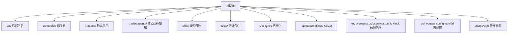
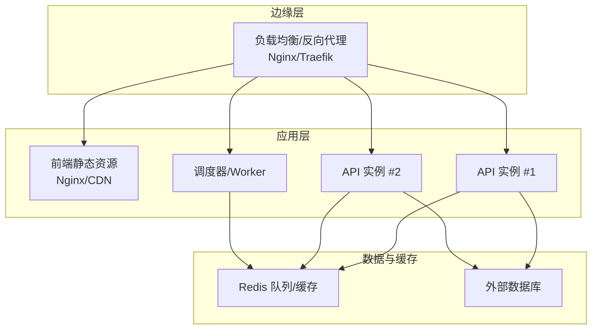
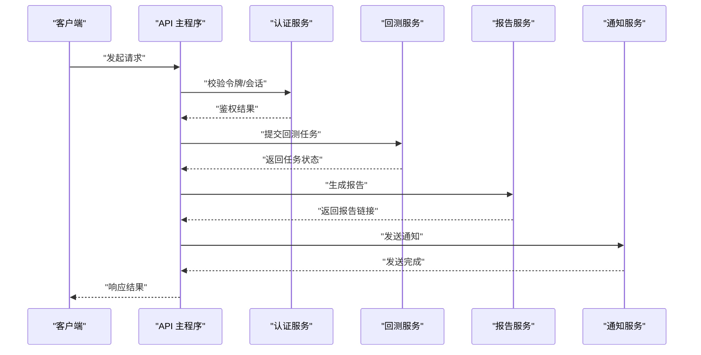
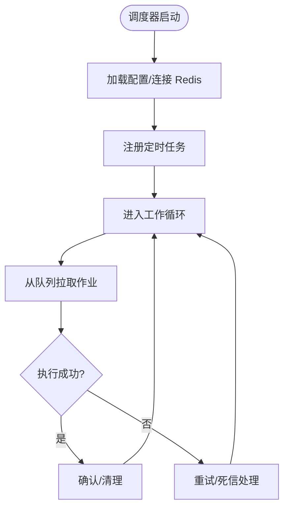
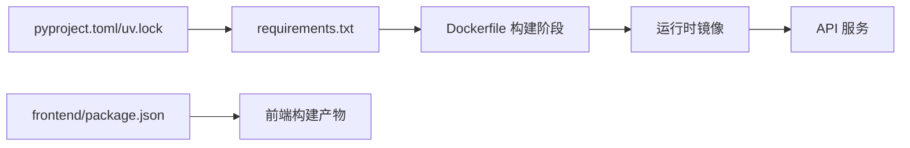

# 部署运维

<cite>
**本文引用的文件**
- [Dockerfile](file://Dockerfile)
- [api/logging_config.yaml](file://api/logging_config.yaml)
- [api/main.py](file://api/main.py)
- [scheduler/main.py](file://scheduler/main.py)
- [.github/workflows](file://.github/workflows)
- [requirements.txt](file://requirements.txt)
- [pyproject.toml](file://pyproject.toml)
- [uv.lock](file://uv.lock)
- [frontend/package.json](file://frontend/package.json)
- [frontend/vite.config.ts](file://frontend/vite.config.ts)
- [frontend/tailwind.config.js](file://frontend/tailwind.config.js)
- [frontend/tsconfig.json](file://frontend/tsconfig.json)
- [frontend/index.html](file://frontend/index.html)
- [assets/web](file://assets/web)
- [tests](file://tests)
</cite>

## 目录
1. [简介](#简介)
2. [项目结构](#项目结构)
3. [核心组件](#核心组件)
4. [架构总览](#架构总览)
5. [详细组件分析](#详细组件分析)
6. [依赖关系分析](#依赖关系分析)
7. [性能考虑](#性能考虑)
8. [故障排查指南](#故障排查指南)
9. [结论](#结论)
10. [附录](#附录)

## 简介
本文件面向运维与平台工程团队，提供 TradingAgents-AShare 的端到端部署与运维指南。内容覆盖容器化打包、环境配置、容器编排、生产部署策略、负载均衡与高可用、CI/CD 流水线、自动化测试与发布、性能监控与日志、故障诊断、容量规划与扩展、安全与灾备等。文档以仓库现有文件为依据，避免臆造信息，并通过图示与来源标注帮助读者快速定位实现位置。

## 项目结构
项目采用多模块组织：后端 API（FastAPI）、调度器（Celery/定时任务）、前端（Vite+React）、数据与技能脚本、测试套件以及容器化与 CI 配置。下图给出与部署运维强相关的目录与文件概览：

**图表来源**
- [Dockerfile](file://Dockerfile)
- [api/main.py](file://api/main.py)
- [scheduler/main.py](file://scheduler/main.py)
- [frontend/package.json](file://frontend/package.json)
- [api/logging_config.yaml](file://api/logging_config.yaml)

**章节来源**
- [Dockerfile](file://Dockerfile)
- [api/main.py](file://api/main.py)
- [scheduler/main.py](file://scheduler/main.py)
- [frontend/package.json](file://frontend/package.json)
- [api/logging_config.yaml](file://api/logging_config.yaml)

## 核心组件
- 后端 API 服务：基于 FastAPI 提供 REST 接口与异步任务队列能力，负责认证、回测、报告、看板、通知等服务。
- 调度器：负责定时任务与后台作业的执行，支持 Redis 作为消息中间件与持久化存储。
- 前端应用：Vite 构建的单页应用，提供可视化界面与交互功能。
- 数据与技能：包含多数据源接入、技术指标计算、LLM 客户端工厂、提示词库等。
- 日志与监控：统一的日志配置文件，便于集中采集与分析。
- 测试：覆盖 API、调度、数据采集、通知等多个维度的自动化测试。

**章节来源**
- [api/main.py](file://api/main.py)
- [scheduler/main.py](file://scheduler/main.py)
- [api/logging_config.yaml](file://api/logging_config.yaml)
- [tests](file://tests)

## 架构总览
下图展示生产环境典型部署拓扑：Nginx/反向代理前置，后端 API 多实例水平扩展，Redis 用于队列与缓存，数据库由外部托管，前端静态资源由 CDN 或 Nginx 提供。

[此图为概念性架构示意，不对应具体代码文件，故无“图表来源”]

## 详细组件分析

### 容器化与镜像构建
- Dockerfile 使用多阶段构建，先安装系统依赖与 Python 运行时，再复制依赖与源码，最终运行 API 服务。
- 建议在生产中固定基础镜像版本并启用只读根文件系统、最小权限用户运行。
- 可结合 docker-compose 或 Kubernetes Deployment 进行编排。

**章节来源**
- [Dockerfile](file://Dockerfile)

### 后端 API 服务
- 入口与路由：后端主程序定义了服务启动、路由注册与中间件装配。
- 认证与令牌：提供认证服务与令牌管理接口。
- 回测与报告：回测服务、邮件报告、跟踪看板等服务模块。
- 通知与集成：企业微信通知、邮件报告等。
- 作业队列：基于 Redis 的作业存储与调度服务。

**图表来源**
- [api/main.py](file://api/main.py)
- [api/services/auth_service.py](file://api/services/auth_service.py)
- [api/services/backtest_service.py](file://api/services/backtest_service.py)
- [api/services/report_service.py](file://api/services/report_service.py)
- [api/services/wecom_notification_service.py](file://api/services/wecom_notification_service.py)

**章节来源**
- [api/main.py](file://api/main.py)
- [api/services/auth_service.py](file://api/services/auth_service.py)
- [api/services/backtest_service.py](file://api/services/backtest_service.py)
- [api/services/report_service.py](file://api/services/report_service.py)
- [api/services/wecom_notification_service.py](file://api/services/wecom_notification_service.py)

### 调度器与作业队列
- 调度器入口负责启动定时任务与工作进程。
- 作业存储支持本地与 Redis 两种实现，Redis 版本适合分布式场景。
- 建议为不同优先级的任务设置独立队列或标签，配合限流与重试策略。

**图表来源**
- [scheduler/main.py](file://scheduler/main.py)
- [api/job_store_redis.py](file://api/job_store_redis.py)

**章节来源**
- [scheduler/main.py](file://scheduler/main.py)
- [api/job_store_redis.py](file://api/job_store_redis.py)

### 前端应用
- 构建工具：Vite 配置、TypeScript、TailwindCSS、包管理。
- 静态资源：构建产物位于 assets/web，可由 Nginx 提供或上传至 CDN。
- 建议开启 Gzip/Brotli 压缩与长期缓存策略，配合 CDN 加速。

**章节来源**
- [frontend/package.json](file://frontend/package.json)
- [frontend/vite.config.ts](file://frontend/vite.config.ts)
- [frontend/tailwind.config.js](file://frontend/tailwind.config.js)
- [frontend/tsconfig.json](file://frontend/tsconfig.json)
- [frontend/index.html](file://frontend/index.html)
- [assets/web](file://assets/web)

### 日志与可观测性
- 统一日志配置文件，建议在容器内输出到 stdout/stderr，由平台侧集中采集。
- 建议结合 OpenTelemetry 或平台原生日志服务进行指标与链路追踪。

**章节来源**
- [api/logging_config.yaml](file://api/logging_config.yaml)

### 测试与质量门禁
- 单元与集成测试覆盖多个模块，建议在 CI 中执行并生成报告。
- 建议引入覆盖率统计与静态检查（lint/test）作为合并要求。

**章节来源**
- [tests](file://tests)

## 依赖关系分析
- 语言与运行时：Python 3.x，包管理器与锁定文件确保一致性。
- 前端依赖：通过 package.json 管理，构建产物静态化。
- 后端依赖：requirements.txt 与 pyproject.toml/uv.lock 共同保证可复现构建。
- 容器镜像：Dockerfile 定义构建步骤与运行命令。

**图表来源**
- [pyproject.toml](file://pyproject.toml)
- [uv.lock](file://uv.lock)
- [requirements.txt](file://requirements.txt)
- [Dockerfile](file://Dockerfile)
- [frontend/package.json](file://frontend/package.json)

**章节来源**
- [pyproject.toml](file://pyproject.toml)
- [uv.lock](file://uv.lock)
- [requirements.txt](file://requirements.txt)
- [Dockerfile](file://Dockerfile)
- [frontend/package.json](file://frontend/package.json)

## 性能考虑
- 扩展策略：API 与调度器均支持水平扩展；通过 Redis 分布式队列实现任务分发。
- 缓存：利用 Redis 缓存热点数据与中间结果，降低数据库压力。
- I/O 优化：批量写入、连接池、异步调用；对第三方数据源设置超时与熔断。
- 前端性能：静态资源压缩、按需加载、CDN 加速。
- 监控指标：CPU/内存/队列长度/请求延迟/错误率/吞吐量。

[本节为通用指导，无需“章节来源”]

## 故障排查指南
- 启动失败：检查容器日志、端口占用、环境变量与依赖安装是否完整。
- API 异常：查看统一日志配置输出，定位异常堆栈与上下文。
- 任务积压：检查 Redis 队列长度、Worker 数量与任务耗时分布。
- 前端白屏：确认构建产物存在、静态资源路径正确、CORS 设置。
- 回测/报告失败：核对数据源可用性、网络连通性与凭据配置。

**章节来源**
- [api/logging_config.yaml](file://api/logging_config.yaml)
- [api/main.py](file://api/main.py)
- [scheduler/main.py](file://scheduler/main.py)

## 结论
本运维文档基于仓库现有文件，给出了从容器化、编排到 CI/CD、监控与故障排查的全链路实践建议。建议在落地过程中结合平台能力与业务规模，持续迭代完善。

[本节为总结性内容，无需“章节来源”]

## 附录

### 生产部署策略与高可用
- 多副本与滚动升级：通过编排平台实现零停机更新。
- 健康检查：HTTP 探针与就绪探针，确保流量仅导向健康实例。
- 负载均衡：Nginx/Traefik/云负载均衡器，支持会话亲和与健康检查。
- 存储与备份：数据库外置并启用自动备份与跨区冗余；Redis 使用持久化与快照。
- 灾难恢复：制定 RTO/RPO 指标，定期演练恢复流程。

[本节为通用指导，无需“章节来源”]

### CI/CD 流水线与自动化测试
- 触发条件：分支保护、PR 标准化、代码审查。
- 步骤建议：依赖安装、静态检查、单元测试、构建镜像、推送镜像、部署预检、发布。
- 发布策略：蓝绿/金丝雀发布，结合回滚机制与变更审计。

[本节为通用指导，无需“章节来源”]

### 容量规划与扩展
- 观察指标：QPS、P95/P99 延迟、队列积压、CPU/内存使用率。
- 自动扩缩容：基于 CPU/队列长度触发 HPA；限制最大副本数防止雪崩。
- 资源预留：为关键服务设置 requests/limits，避免争抢。

[本节为通用指导，无需“章节来源”]

### 安全配置与合规
- 最小权限：容器只读根文件系统、非 root 用户、受限能力。
- 网络隔离：命名空间/子网划分、出入口访问控制。
- 凭据管理：密钥注入、轮换策略、加密传输。
- 审计与合规：操作日志、变更记录、漏洞扫描。

[本节为通用指导，无需“章节来源”]