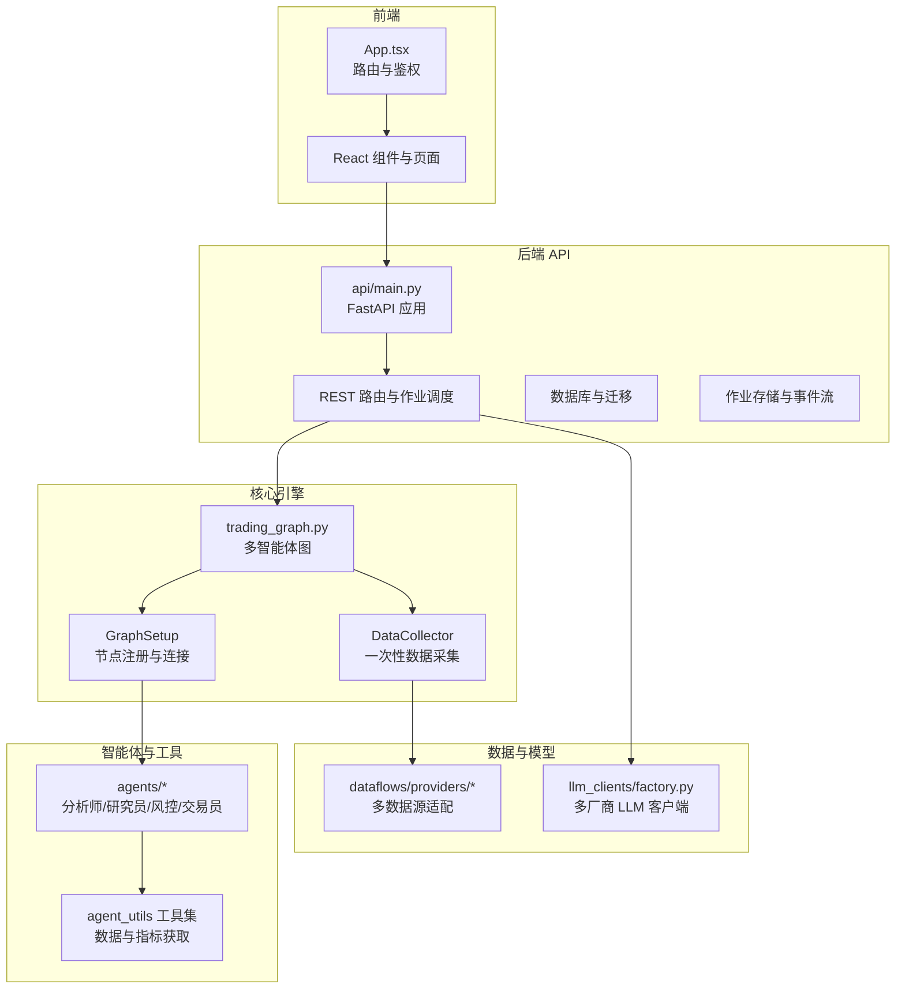
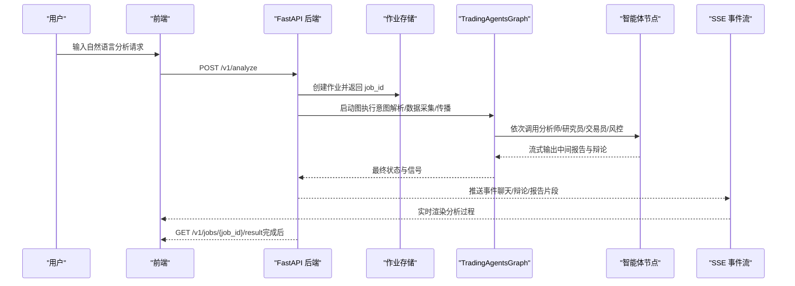
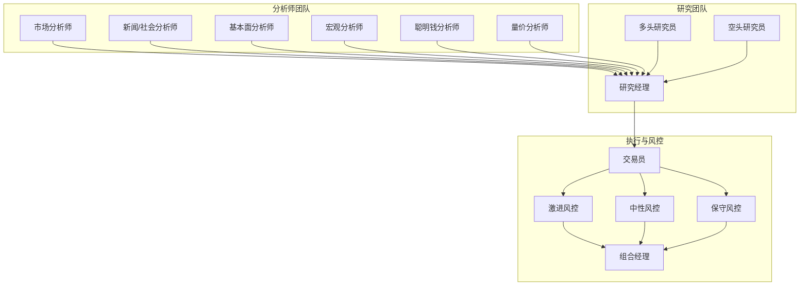
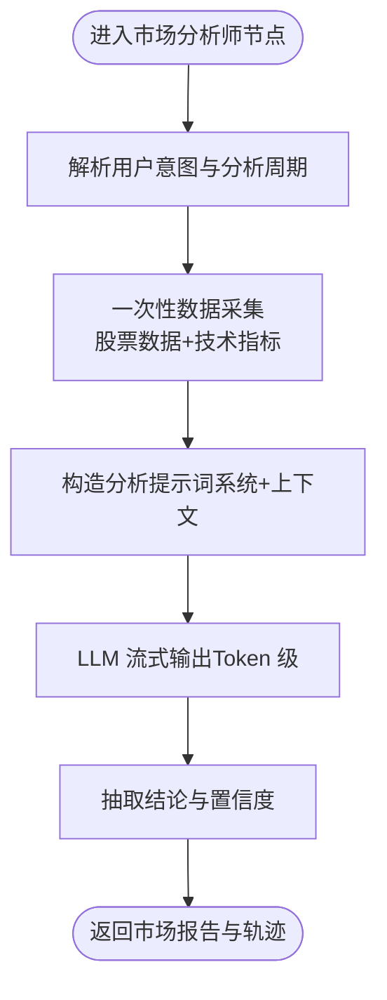
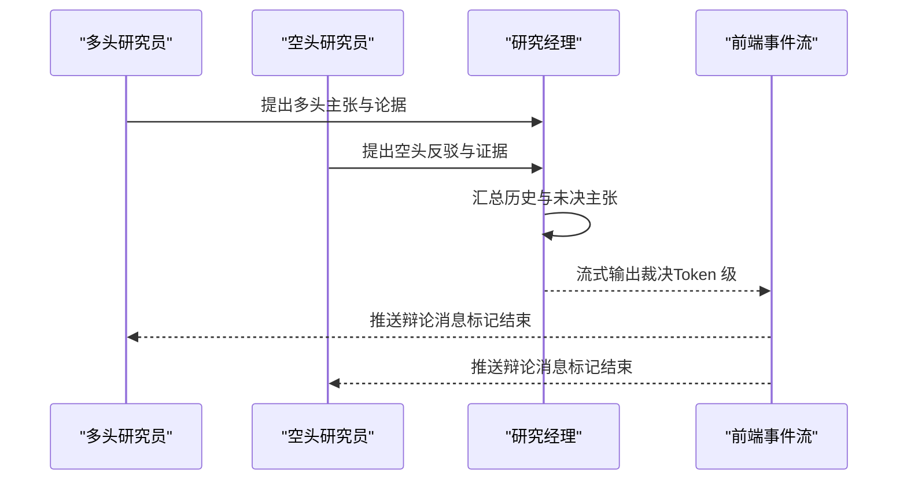
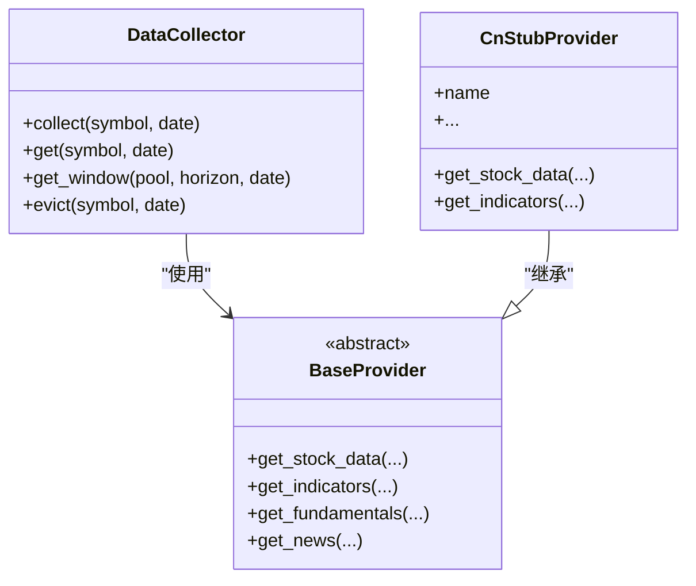
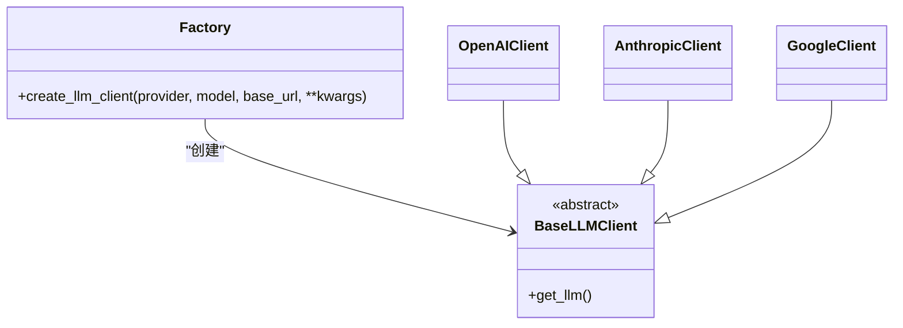
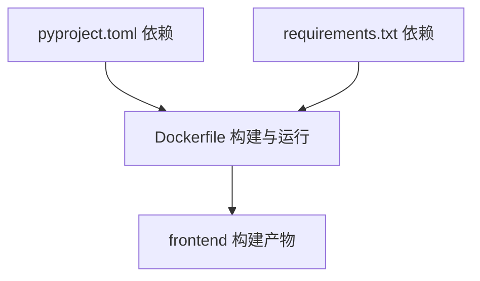

# 项目概述

<cite>
**本文引用的文件**
- [README.md](file://README.md)
- [AGENTS.md](file://AGENTS.md)
- [Dockerfile](file://Dockerfile)
- [requirements.txt](file://requirements.txt)
- [pyproject.toml](file://pyproject.toml)
- [api/main.py](file://api/main.py)
- [tradingagents/graph/trading_graph.py](file://tradingagents/graph/trading_graph.py)
- [tradingagents/agents/__init__.py](file://tradingagents/agents/__init__.py)
- [tradingagents/agents/analysts/market_analyst.py](file://tradingagents/agents/analysts/market_analyst.py)
- [tradingagents/agents/researchers/bull_researcher.py](file://tradingagents/agents/researchers/bull_researcher.py)
- [tradingagents/agents/managers/research_manager.py](file://tradingagents/agents/managers/research_manager.py)
- [tradingagents/dataflows/providers/china_equity_provider.py](file://tradingagents/dataflows/providers/china_equity_provider.py)
- [tradingagents/llm_clients/factory.py](file://tradingagents/llm_clients/factory.py)
- [frontend/src/App.tsx](file://frontend/src/App.tsx)
</cite>

## 目录
1. [引言](#引言)
2. [项目结构](#项目结构)
3. [核心组件](#核心组件)
4. [架构总览](#架构总览)
5. [详细组件分析](#详细组件分析)
6. [依赖分析](#依赖分析)
7. [性能考虑](#性能考虑)
8. [故障排除指南](#故障排除指南)
9. [结论](#结论)
10. [附录](#附录)

## 引言
TradingAgents-AShare 是一个面向 A 股市场的多智能体投研平台，通过 14 名专业智能体的协同工作，模拟顶级投研机构的决策闭环，为用户提供结构化、可解释的交易建议。系统支持自然语言意图驱动的分析、辩论可视化、定时分析、持仓跟踪、黄金信号扫描以及多模型厂商接入，既适合初学者快速上手，也为有经验的开发者提供了可扩展的技术架构。

- 项目定位：A 股智能投研 SaaS 产品，提供从数据采集、多智能体分析、辩论裁决到风控执行的全链路服务。
- 应用场景：个人投资者、量化研究助理、交易机器人对接、第三方看板集成。
- 价值主张：以多智能体协作提升分析质量与可解释性，降低投研门槛，提高决策效率。

**章节来源**
- [README.md:1-213](file://README.md#L1-L213)
- [AGENTS.md:1-245](file://AGENTS.md#L1-L245)

## 项目结构
项目采用前后端分离与多模块协作的组织方式：
- 后端（FastAPI）：提供 REST API、作业调度、事件流、数据库与持久化。
- 前端（React/Vite）：SPA 页面与状态管理，支持聊天式分析、可视化工作流、报告与看板。
- 核心引擎（LangGraph）：多智能体图执行框架，统一调度分析师、研究员、交易员与风控方。
- 数据层（多数据源）：AkShare、BaoStock、yfinance、Alpha Vantage 等，支持 A 股与全球市场数据。
- LLM 客户端工厂：统一接入 OpenAI、Anthropic、Google Gemini、DeepSeek、Moonshot、智谱、硅基流动等。

**图表来源**
- [frontend/src/App.tsx:1-78](file://frontend/src/App.tsx#L1-L78)
- [api/main.py:1-800](file://api/main.py#L1-L800)
- [tradingagents/graph/trading_graph.py:1-489](file://tradingagents/graph/trading_graph.py#L1-L489)
- [tradingagents/agents/__init__.py:1-46](file://tradingagents/agents/__init__.py#L1-L46)
- [tradingagents/dataflows/providers/china_equity_provider.py:1-55](file://tradingagents/dataflows/providers/china_equity_provider.py#L1-L55)
- [tradingagents/llm_clients/factory.py:1-43](file://tradingagents/llm_clients/factory.py#L1-L43)

**章节来源**
- [AGENTS.md:20-67](file://AGENTS.md#L20-L67)
- [Dockerfile:1-51](file://Dockerfile#L1-L51)
- [requirements.txt:1-24](file://requirements.txt#L1-L24)
- [pyproject.toml:1-52](file://pyproject.toml#L1-L52)

## 核心组件
- 多智能体图（TradingAgentsGraph）：封装 LLM 客户端、工具节点、记忆体、条件逻辑与传播器，统一执行短/中周期分析与反思。
- 智能体模块：分析师（市场/新闻/情绪/基本面/宏观/聪明钱/量价）、研究员（多头/空头）、研究/风控管理、交易员与三方风控。
- 数据采集（DataCollector）：一次性拉取并缓存所需数据，供各分析师并行读取，减少重复请求。
- 作业系统：基于内存或 Redis 的作业存储，支持 SSE 事件流与结果恢复。
- 前端分析流：聊天式意图解析、实时辩论可视化、报告与看板展示。

**章节来源**
- [tradingagents/graph/trading_graph.py:51-151](file://tradingagents/graph/trading_graph.py#L51-L151)
- [tradingagents/agents/__init__.py:24-46](file://tradingagents/agents/__init__.py#L24-L46)
- [api/main.py:505-550](file://api/main.py#L505-L550)

## 架构总览
系统采用“意图驱动 + 多智能体图 + SSE 流式输出”的架构模式：
- 用户通过自然语言发起分析请求，后端解析意图并创建作业。
- 作业在后台运行，TradingAgentsGraph 串联各智能体节点，实时产出分析报告与辩论过程。
- SSE 将中间状态与最终结果推送到前端，前端同步展示聊天与可视化工作流。
- 结果结构化存储，支持历史检索与报告详情查看。

**图表来源**
- [api/main.py:599-612](file://api/main.py#L599-L612)
- [api/main.py:614-670](file://api/main.py#L614-L670)
- [tradingagents/graph/trading_graph.py:243-296](file://tradingagents/graph/trading_graph.py#L243-L296)

**章节来源**
- [README.md:96-179](file://README.md#L96-L179)
- [AGENTS.md:73-122](file://AGENTS.md#L73-L122)

## 详细组件分析

### 多智能体协作角色与职责
- 分析师团队：市场/新闻/情绪/基本面/宏观/聪明钱/量价分析师并行作业，提取多维度证据。
- 研究员团队：多头/空头研究员围绕核心主张展开结构化辩论，研究总监综合裁决形成投资计划。
- 决策与风控：交易员将研究结论转化为可执行方案，激进/稳健/中性三方风控评审，组合经理最终裁决。

**图表来源**
- [api/main.py:505-541](file://api/main.py#L505-L541)
- [tradingagents/agents/__init__.py:5-22](file://tradingagents/agents/__init__.py#L5-L22)

**章节来源**
- [README.md:67-95](file://README.md#L67-L95)
- [AGENTS.md:108-115](file://AGENTS.md#L108-L115)

### 市场分析师（技术面）处理流程
市场分析师聚焦短期技术面，使用统一的数据窗口与指标集合，结合系统提示词完成分析，并以 Token 级流式输出到前端。

**图表来源**
- [tradingagents/agents/analysts/market_analyst.py:26-89](file://tradingagents/agents/analysts/market_analyst.py#L26-L89)

**章节来源**
- [tradingagents/agents/analysts/market_analyst.py:12-23](file://tradingagents/agents/analysts/market_analyst.py#L12-L23)
- [tradingagents/agents/analysts/market_analyst.py:92-122](file://tradingagents/agents/analysts/market_analyst.py#L92-L122)

### 多头研究员与研究经理的辩论与裁决
多头研究员基于各维度报告与过往辩论历史，提出多头主张并参与结构化辩论；研究经理汇总双方观点与未决主张，形成裁决与投资计划。

**图表来源**
- [tradingagents/agents/researchers/bull_researcher.py:15-99](file://tradingagents/agents/researchers/bull_researcher.py#L15-L99)
- [tradingagents/agents/managers/research_manager.py:15-149](file://tradingagents/agents/managers/research_manager.py#L15-L149)

**章节来源**
- [tradingagents/agents/researchers/bull_researcher.py:16-99](file://tradingagents/agents/researchers/bull_researcher.py#L16-L99)
- [tradingagents/agents/managers/research_manager.py:16-149](file://tradingagents/agents/managers/research_manager.py#L16-L149)

### 数据采集与多数据源适配
系统通过 DataCollector 一次性采集所需数据，避免重复抓取；多数据源适配器支持 AkShare、BaoStock、yfinance、Alpha Vantage 等，A 股市场数据提供器以占位符形式预留扩展点。

**图表来源**
- [tradingagents/graph/trading_graph.py:118-119](file://tradingagents/graph/trading_graph.py#L118-L119)
- [tradingagents/dataflows/providers/china_equity_provider.py:4-55](file://tradingagents/dataflows/providers/china_equity_provider.py#L4-L55)

**章节来源**
- [tradingagents/graph/trading_graph.py:118-119](file://tradingagents/graph/trading_graph.py#L118-L119)
- [tradingagents/dataflows/providers/china_equity_provider.py:19-55](file://tradingagents/dataflows/providers/china_equity_provider.py#L19-L55)

### LLM 客户端工厂与多模型厂商支持
通过工厂方法统一创建不同厂商的 LLM 客户端，支持 OpenAI、Anthropic、Google Gemini、DeepSeek、Moonshot、智谱、硅基流动等，前端可自由切换模型与厂商。

**图表来源**
- [tradingagents/llm_clients/factory.py:9-43](file://tradingagents/llm_clients/factory.py#L9-L43)

**章节来源**
- [AGENTS.md:92-104](file://AGENTS.md#L92-L104)
- [README.md:57-63](file://README.md#L57-L63)

## 依赖分析
- 运行时依赖：FastAPI、Uvicorn、SQLAlchemy、LangChain/LangGraph、pandas、yfinance、akshare、baostock、stockstats、rank-bm25、requests、PyJWT、cryptography、json-repair、markdown、redis 等。
- 构建与打包：pyproject.toml 定义项目元数据与依赖；Dockerfile 使用 uv 优化依赖安装与镜像分层。
- 前端：React/Vite、React Router、TailwindCSS、ESLint、TypeScript，构建产物静态托管于后端。

**图表来源**
- [pyproject.toml:11-38](file://pyproject.toml#L11-L38)
- [requirements.txt:1-24](file://requirements.txt#L1-24)
- [Dockerfile:10-51](file://Dockerfile#L10-L51)

**章节来源**
- [pyproject.toml:1-52](file://pyproject.toml#L1-L52)
- [requirements.txt:1-24](file://requirements.txt#L1-L24)
- [Dockerfile:1-51](file://Dockerfile#L1-L51)

## 性能考虑
- 并发与限流：后端启动时提升 AnyIO 线程限制与默认线程池大小，避免高频同步接口与长任务互相阻塞。
- 数据缓存：DataCollector 一次性采集并缓存，避免重复抓取；股票映射与名称到代码的映射带 TTL 缓存。
- 作业超时：默认作业超时 30 分钟，满足多智能体长流程分析需求；可通过环境变量调整。
- SSE 事件流：前端通过事件流接收聊天与辩论片段，保证低延迟与高吞吐。

**章节来源**
- [api/main.py:216-279](file://api/main.py#L216-L279)
- [api/main.py:349-351](file://api/main.py#L349-L351)
- [api/main.py:383-440](file://api/main.py#L383-L440)

## 故障排除指南
- 密钥与安全：未设置应用密钥时会发出警告，生产环境必须设置且不可更改，否则会破坏已加密的用户 LLM Key 解密。
- 邮箱验证码：未配置 SMTP 时前端登录页会显示开发环境验证码；真实邮件投递需正确配置环境变量。
- 作业超时：若日志提示“超过 600 秒”，可能是部署环境显式设置了较短超时；可通过环境变量调整。
- 黄金信号扫描：需设置数据目录与缓存脚本目录；扫描结果写入本地缓存目录，不在版本控制中。
- LLM 配置：启动后在前端“设置”页面配置模型厂商、API Key 与模型名称；可执行模型 warmup 以排查接入问题。

**章节来源**
- [README.md:117-125](file://README.md#L117-L125)
- [AGENTS.md:73-122](file://AGENTS.md#L73-L122)

## 结论
TradingAgents-AShare 以多智能体协作为核心，结合意图驱动的自然语言交互、可视化辩论与结构化报告，构建了面向 A 股市场的智能化投研平台。其模块化设计、可扩展的数据与模型接入能力，以及完善的前端可视化与作业系统，使其既能满足初学者的易用性需求，也能为高级用户提供深入定制与集成的空间。

## 附录

### 快速开始
- Docker 一键部署（推荐）：拉取镜像、准备数据目录、设置密钥与数据库 URL、暴露端口并启动容器。
- 源码安装：后端使用 uv 同步依赖，前端使用 npm 安装并构建；复制 .env.example 到 .env 并按需修改；启动后端服务并访问 http://localhost:8000。

**章节来源**
- [README.md:96-151](file://README.md#L96-L151)

### 系统要求与安装准备
- 后端：Python 3.10+，依赖见 requirements.txt 与 pyproject.toml。
- 前端：Node.js 18+，安装依赖并构建产物。
- 部署：Docker 支持多架构镜像构建与运行；生产环境务必设置 TA_APP_SECRET_KEY。

**章节来源**
- [pyproject.toml:10-11](file://pyproject.toml#L10-L11)
- [Dockerfile:1-51](file://Dockerfile#L1-L51)

### API 集成
- 标准 REST API：触发分析、状态追踪、结果获取、历史检索、报告管理、定时任务、模型 warmup 等。
- 认证：Web 登录后在“设置 / API Token”生成密钥，通过 Authorization: Bearer <TOKEN> 传入。

**章节来源**
- [README.md:152-179](file://README.md#L152-L179)

### 前端路由与页面
- 路由：登录、仪表盘、分析、报告、组合、设置、跟踪看板、黄金信号看板、反馈、赞助与致谢等。
- 鉴权：RequireAuth 保护非公开页面，Hydrate 初始化用户状态。

**章节来源**
- [frontend/src/App.tsx:18-78](file://frontend/src/App.tsx#L18-L78)